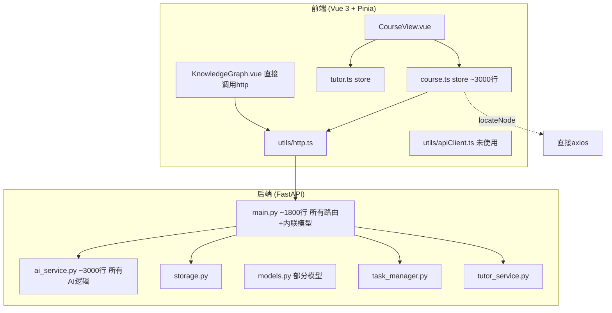
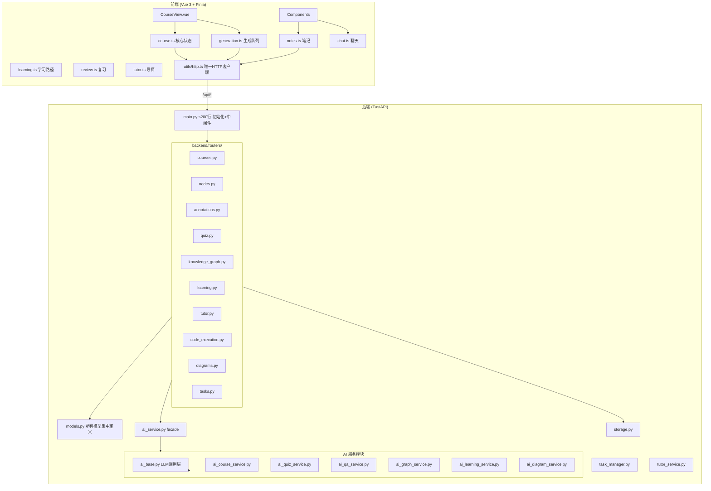

# 技术设计文档：代码库优化与重构

## 概述

本设计文档描述 Knowledge Map AI 项目的代码库优化与重构方案。项目在快速迭代中积累了显著的技术债务：后端 `main.py`（~1800 行）包含所有路由和内联模型定义，`ai_service.py`（~3000 行）承载全部 AI 逻辑，前端 `course.ts` store（~3000 行）混合了课程、生成、笔记、聊天等多个功能域的状态管理。此外还存在重复的 HTTP 客户端、遗留的 Annotations 系统、不一致的 API 路径前缀等问题。

本次重构的核心原则是：**在不改变任何用户可见功能的前提下**，通过模块化拆分、死代码清理和抽象统一来提升代码的可维护性和工程质量。

重构分为三个层面：
1. **后端重构**：路由模块化（需求 1）、模型集中化（需求 2）、AI 服务拆分（需求 3）、API 前缀统一（需求 7）
2. **前端重构**：HTTP 客户端统一（需求 4）、Store 拆分（需求 5）、Annotations 清理（需求 6）、死代码清理（需求 8）
3. **测试建设**：后端测试覆盖（需求 9）、前端测试基础（需求 10）

## 架构

### 当前架构



### 目标架构



## 组件与接口

### 1. 后端路由模块（需求 1、7）

将 `main.py` 中的路由按功能域拆分到 `backend/routers/` 目录，每个 Router 使用 `/api` 统一前缀。

| 模块文件 | 路由前缀 | 职责 |
|---------|---------|------|
| `routers/courses.py` | `/api/courses` | 课程 CRUD、课程列表 |
| `routers/nodes.py` | `/api/courses/{id}/nodes` | 节点操作（添加、删除、更新、内容生成） |
| `routers/annotations.py` | `/api/annotations` | 标注/笔记 CRUD |
| `routers/quiz.py` | `/api/quiz` | 测验生成、成绩分析 |
| `routers/knowledge_graph.py` | `/api/courses/{id}/knowledge-graph` | 知识图谱生成与查询 |
| `routers/learning.py` | `/api/courses/{id}/learning` | 学习路径、知识掌握度、学习统计 |
| `routers/review.py` | `/api/courses/{id}/review` | 复习调度（含 `/api/review` 全局端点） |
| `routers/tutor.py` | `/api/tutor` | AI 辅导（问候、建议、目标管理） |
| `routers/code_execution.py` | `/api/code` | 代码执行、支持语言查询 |
| `routers/diagrams.py` | `/api/diagrams` | 图表生成、图表类型查询 |
| `routers/tasks.py` | `/api/tasks` | 后台任务管理（创建、暂停、恢复、删除） |

重构后的 `main.py` 仅保留：
- FastAPI 应用实例创建
- CORS 中间件配置
- WebSocket 管理（`ConnectionManager` 和 `/ws/tasks` 端点）
- 所有 Router 的注册（`app.include_router()`）
- 静态文件服务
- 启动/关闭事件
- 通用辅助函数（`get_course_or_404`、`get_node_or_404` 等）移至 `backend/dependencies.py`

接口示例（Router 注册）：

```python
# backend/main.py（重构后）
from fastapi import FastAPI
from backend.routers import (
    courses, nodes, annotations, quiz,
    knowledge_graph, learning, review,
    tutor, code_execution, diagrams, tasks
)

app = FastAPI(title="Knowledge Map AI")

# 注册所有路由
for router_module in [
    courses, nodes, annotations, quiz,
    knowledge_graph, learning, review,
    tutor, code_execution, diagrams, tasks
]:
    app.include_router(router_module.router)
```

```python
# backend/routers/courses.py 示例
from fastapi import APIRouter, HTTPException
from backend.models import GenerateCourseRequest
from backend.dependencies import get_course_or_404
from backend.storage import storage
from backend.ai_service import ai_service

router = APIRouter(prefix="/api/courses", tags=["courses"])

@router.get("/")
async def list_courses():
    return storage.list_courses()

@router.get("/{course_id}")
async def get_course(course_id: str):
    return await get_course_or_404(course_id)
```

### 2. 后端模型集中化（需求 2）

将 `main.py` 中的 9 个内联 Pydantic 模型迁移到 `models.py`，按功能域分组：

需要迁移的模型：
- `KnowledgeGraphRequest` → 知识图谱分组
- `SummarizeNodeRequest` → 节点操作分组
- `GenerateDiagramRequest` / `GenerateDiagramResponse` → 图表分组（注意：`models.py` 已有 `GenerateDiagramRequest`，需合并去重）
- `CreateGoalRequest` / `UpdateGoalProgressRequest` → 辅导分组
- `RecordLearningRequest` / `SessionSummaryRequest` / `TutorContextRequest` → 辅导分组

`models.py` 分组结构：

```python
# === 课程相关 ===
class GenerateCourseRequest(BaseModel): ...
class Node(BaseModel): ...

# === 节点操作 ===
class AddNodeRequest(BaseModel): ...
class UpdateNodeRequest(BaseModel): ...
class SummarizeNodeRequest(BaseModel): ...  # 从 main.py 迁移

# === 标注与笔记 ===
class Annotation(BaseModel): ...
class SaveAnnotationRequest(BaseModel): ...

# === 测验 ===
class GenerateQuizRequest(BaseModel): ...

# === 知识图谱 ===
class KnowledgeGraphRequest(BaseModel): ...  # 从 main.py 迁移
class GenerateKnowledgeGraphRequest(BaseModel): ...

# === 学习路径与复习 ===
class LearningPathRequest(BaseModel): ...
class ReviewItem(BaseModel): ...
class SubmitReviewRequest(BaseModel): ...

# === 代码执行 ===
class ExecuteCodeRequest(BaseModel): ...

# === 图表 ===
class GenerateDiagramRequest(BaseModel): ...  # 合并 main.py 和 models.py 的定义

# === AI 辅导 ===
class CreateGoalRequest(BaseModel): ...      # 从 main.py 迁移
class UpdateGoalProgressRequest(BaseModel): ... # 从 main.py 迁移
class RecordLearningRequest(BaseModel): ...  # 从 main.py 迁移
class SessionSummaryRequest(BaseModel): ...  # 从 main.py 迁移
class TutorContextRequest(BaseModel): ...    # 从 main.py 迁移
```

### 3. AI 服务拆分（需求 3）

将 `ai_service.py`（~3000 行）按功能域拆分为独立模块，共享基础 LLM 调用层。

```
backend/
├── ai_base.py              # 基础 LLM 调用层
├── ai_course_service.py    # 课程生成、节点内容、子节点生成
├── ai_quiz_service.py      # 测验生成、成绩分析
├── ai_qa_service.py        # 问答、聊天摘要、苏格拉底辅导
├── ai_graph_service.py     # 知识图谱生成与验证
├── ai_learning_service.py  # 学习路径、复习调度（SM-2）、知识掌握度
├── ai_diagram_service.py   # 图表生成
└── ai_service.py           # Facade：从子模块重新导出所有公开方法
```

`ai_base.py` 提供的共享接口：

```python
class AIBase:
    """LLM 调用基础层"""
    def __init__(self):
        self.client = AsyncOpenAI(...)
        self.model = os.getenv("AI_MODEL", "Qwen/Qwen3-32B")
        self.model_fast = os.getenv("AI_MODEL_FAST", self.model)

    async def _call_llm(self, messages, model=None, temperature=0.7, max_tokens=4096) -> str: ...
    async def _stream_llm(self, messages, model=None, temperature=0.7) -> AsyncGenerator: ...
    def _extract_json(self, text: str) -> Optional[Dict]: ...
    def clean_response_text(self, text: str) -> str: ...
    def _clean_mermaid_syntax(self, text: str) -> str: ...
    def _clean_latex_syntax(self, text: str) -> str: ...
```

各子服务继承 `AIBase`：

```python
# backend/ai_course_service.py
from backend.ai_base import AIBase

class AICourseService(AIBase):
    async def generate_course(self, keyword, difficulty, style, requirements) -> dict: ...
    async def generate_sub_nodes(self, ...) -> list: ...
    async def generate_node_content(self, ...) -> str: ...
    async def redefine_content(self, ...) -> str: ...
    async def redefine_node_content(self, ...) -> AsyncGenerator: ...
    async def extend_content(self, ...) -> str: ...
    async def summarize_content(self, ...) -> str: ...
```

Facade 模块保持向后兼容：

```python
# backend/ai_service.py（重构后的 facade）
from backend.ai_course_service import AICourseService
from backend.ai_quiz_service import AIQuizService
from backend.ai_qa_service import AIQAService
from backend.ai_graph_service import AIGraphService
from backend.ai_learning_service import AILearningService
from backend.ai_diagram_service import AIDiagramService

class AIService(AICourseService, AIQuizService, AIQAService,
                AIGraphService, AILearningService, AIDiagramService):
    """向后兼容的门面类，聚合所有 AI 服务功能"""
    pass

ai_service = AIService()
```

设计决策说明：使用多重继承而非组合模式，是因为现有代码中 `ai_service.method()` 的调用方式遍布整个后端，多重继承可以零修改地保持所有调用点兼容。各子服务之间无交叉依赖，不存在菱形继承问题。

### 4. 前端 HTTP 客户端统一（需求 4）

操作步骤：
1. 删除 `frontend/src/utils/apiClient.ts`（已确认无任何导入引用）
2. 将 `KnowledgeGraph.vue` 中直接导入 `http` 的请求改为通过 `useCourseStore()` 的 action 调用
3. 将 `course.ts` 中 `locateNode` 方法的 `axios.post()` 替换为 `http.post()`

### 5. 前端 Course Store 拆分（需求 5）

将 `course.ts`（~3000 行）拆分为 6 个独立 Pinia store：

| Store 文件 | 职责 | 关键 State |
|-----------|------|-----------|
| `stores/course.ts` | 课程列表、当前课程、节点树 | `courseList`, `currentCourseId`, `courseTree`, `nodes`, `currentNode` |
| `stores/generation.ts` | 课程生成队列、任务管理 | `tasks`, `queue`, `isQueueProcessing`, `isGenerating`, `generationStatus` |
| `stores/notes.ts` | 笔记 CRUD、标签、分类、导出 | `notes`, `focusNoteId` |
| `stores/learning.ts` | 学习路径、知识掌握度、统计 | 学习相关 state |
| `stores/review.ts` | 间隔复习调度、复习结果 | 复习相关 state |
| `stores/chat.ts` | 聊天历史、AI 问答、流式响应 | `chatHistory`, `chatLoading`, `chatAbortController`, `pendingChatInput` |

跨 Store 访问模式：

```typescript
// stores/generation.ts 中需要访问课程数据
import { useCourseStore } from './course'

export const useGenerationStore = defineStore('generation', () => {
  // 在 action 内部获取其他 store
  async function startGeneration(keyword: string) {
    const courseStore = useCourseStore()
    // 使用 courseStore.currentCourseId 等
  }
})
```

### 6. Annotations 遗留系统清理（需求 6）

需要移除的代码：
- `course.ts` 中的 `annotations: [] as Annotation[]` state 字段
- `course.ts` 中的 `activeAnnotation: null as Annotation | null` state 字段
- `course.ts` 中的 `Annotation` 接口定义（注意：`models.py` 中的 `Annotation` 模型保留，因为后端 annotations API 仍服务于 Notes 系统）
- `course.ts` 中 `deleteNote` 等方法里引用 `this.annotations` 的代码

后端 annotations API 端点保留，因为 Notes 系统的后端存储实际使用的就是 annotations API。在 Router 代码中添加注释标注。

### 7. API 路径前缀统一（需求 7）

当前状态：部分端点已使用 `/api` 前缀（如 tutor store 中的 `/api/tutor/*`），但大部分端点没有前缀（如 `/courses/*`、`/annotations/*`）。

统一方案：
- 所有 Router 使用 `prefix="/api/..."` 
- 前端 `http.ts` 的 `baseURL` 保持为空（由 Vite proxy 处理）
- 前端所有请求路径更新为 `/api/...` 前缀
- Vite proxy 简化为两条规则：

```typescript
// vite.config.ts（重构后）
server: {
  proxy: {
    '/api': {
      target: 'http://localhost:8000',
      changeOrigin: true
    },
    '/ws': {
      target: 'ws://localhost:8000',
      ws: true,
      changeOrigin: true
    }
  }
}
```

- 后端静态文件服务（`/` 路径）不受影响，继续由 FastAPI `StaticFiles` 提供
- Markdown 导入端点 `/api/import/markdown` 使用 `/api` 前缀

### 8. 前端死代码清理（需求 8）

清理范围：
- 删除 `apiClient.ts`（已确认无引用）
- Store 拆分过程中识别并移除未被引用的 state、getter、action
- 检查并移除未被导入的 TypeScript 模块文件
- 检查并移除未被使用的导出接口和类型
- 最终通过 `npm run build`（含类型检查）验证无编译错误

### 9. 后端依赖模块（新增）

创建 `backend/dependencies.py` 存放路由共享的依赖函数：

```python
# backend/dependencies.py
from fastapi import HTTPException
from backend.storage import storage

async def get_course_or_404(course_id: str) -> dict:
    course = storage.load_course(course_id)
    if not course:
        raise HTTPException(status_code=404, detail="课程不存在")
    return course

def get_node_or_404(tree_data: dict, node_id: str) -> dict:
    # 在节点树中查找指定节点
    ...
```

## 数据模型

本次重构不引入新的数据模型，仅对现有模型进行重组。

### 模型迁移清单

以下模型从 `main.py` 迁移到 `models.py`：

| 模型名 | 原位置 (main.py 行号) | 目标分组 |
|--------|---------------------|---------|
| `KnowledgeGraphRequest` | L661 | 知识图谱 |
| `SummarizeNodeRequest` | L740 | 节点操作 |
| `GenerateDiagramRequest` | L1368 | 图表（与 models.py 已有定义合并） |
| `GenerateDiagramResponse` | L1375 | 图表 |
| `CreateGoalRequest` | L1523 | AI 辅导 |
| `UpdateGoalProgressRequest` | L1534 | AI 辅导 |
| `RecordLearningRequest` | L1538 | AI 辅导 |
| `SessionSummaryRequest` | L1546 | AI 辅导 |
| `TutorContextRequest` | L1553 | AI 辅导 |

### 模型合并说明

`GenerateDiagramRequest` 存在两处定义：
- `main.py` L1368：`description: str, diagram_type: str, context: Optional[str]`
- `models.py`：`description: str, diagram_type: str, context: Optional[str]`

两者字段完全一致，合并后保留 `models.py` 中的定义，删除 `main.py` 中的重复定义。

### 前端类型迁移

Store 拆分后，类型定义从 `course.ts` 迁移到 `frontend/src/types/` 目录：

```
frontend/src/types/
├── course.ts      # Node, Course 接口
├── notes.ts       # Note 接口
├── generation.ts  # QueueItem, Task 接口
├── chat.ts        # ChatMessage, AIContent 接口
└── index.ts       # 统一导出
```

`Annotation` 接口从前端类型系统中移除（需求 6）。


## 正确性属性

*属性（Property）是一种在系统所有有效执行中都应成立的特征或行为——本质上是对系统应做什么的形式化陈述。属性是人类可读规范与机器可验证正确性保证之间的桥梁。*

### Property 1: API 端点行为保持不变

*For any* 有效的 API 请求（包括路径、方法、请求体），重构后的系统返回的响应状态码和响应体结构 SHALL 与重构前完全一致。

**Validates: Requirements 1.4**

### Property 2: Facade 向后兼容性

*For any* 原 `AIService` 类上的公开方法名，通过重构后的 facade 模块（`ai_service.py`）访问该方法 SHALL 返回一个可调用对象，且其函数签名与原方法一致。

**Validates: Requirements 3.3**

### Property 3: Notes 系统功能完整性

*For any* 有效的笔记操作（创建、编辑、删除、添加标签、设置分类、导出），在移除 Annotations 遗留代码后，操作 SHALL 成功执行且产生正确的结果（笔记列表长度变化正确、内容匹配）。

**Validates: Requirements 6.4**

### Property 4: API 路由前缀一致性

*For any* 在 FastAPI 应用中注册的 API 路由（排除静态文件服务和 WebSocket 端点），其路径 SHALL 以 `/api/` 开头。

**Validates: Requirements 7.1**

### Property 5: SM-2 ease_factor 变化方向一致性

*For any* 有效的复习参数组合（`review_count ≥ 0`、`1.3 ≤ ease_factor ≤ 3.0`、`0 ≤ quality ≤ 5`），调用 `calculate_next_review` 得到 `new_ease_factor` 后，以相同的 `quality` 值再次调用，第二次得到的 `ease_factor` 变化方向（相对于输入）SHALL 与第一次一致。即：如果第一次 `new_ef > ef`，则第二次 `new_ef2 > new_ef1`（或相等）；如果第一次 `new_ef < ef`，则第二次 `new_ef2 < new_ef1`（或相等）。

**Validates: Requirements 9.4**

### Property 6: Prompt-config 验证函数幂等性

*For any* 有效的输入值和 `prompt-config.ts` 中的任意验证函数（`validateDifficulty`、`validateStyle`、`validateChapterCount`、`validateSubChapterCount`、`validateQuestionCount`、`validateGenerateCourseParams` 等），对相同输入调用两次 SHALL 产生完全相同的验证结果。即 `f(x) === f(f_result)` 在布尔返回值层面成立，且对于返回 `ValidationResult` 的函数，`validate(x).isValid === validate(x).isValid` 且 `validate(x).errors` 内容一致。

**Validates: Requirements 10.4**

## 错误处理

### 后端错误处理策略

1. **路由层**：每个 Router 模块使用 FastAPI 的 `HTTPException` 返回标准化错误响应。通用的 404 检查通过 `dependencies.py` 中的辅助函数统一处理。

2. **AI 服务层**：每个拆分后的 AI 服务模块必须包含完整的 try/except 处理：
   - LLM 调用超时 → 返回 fallback 内容（如 `_generate_smart_fallback_quiz`）
   - JSON 解析失败 → 使用 `_extract_json` 的容错逻辑重试
   - API 限流 → 指数退避重试（最多 2 次）
   - 所有异常 → 记录日志并返回用户友好的错误消息

3. **存储层**：文件 I/O 错误通过 try/except 捕获，返回空数据而非崩溃。

4. **WebSocket**：连接断开时自动从 `ConnectionManager` 移除，不影响其他连接。

### 前端错误处理策略

1. **HTTP 层**：`http.ts` 的响应拦截器统一处理错误，通过 `ElMessage.error()` 显示用户友好消息。

2. **Store 层**：每个 action 使用 try/catch 包裹 HTTP 调用，catch 中设置 loading 状态为 false 并显示错误提示。

3. **跨 Store 调用**：通过 `useXxxStore()` 获取其他 store 时，在 action 内部调用（非顶层），避免循环依赖。

### 重构过程中的错误预防

1. **渐进式迁移**：每完成一个模块的拆分，立即运行测试验证。
2. **类型检查**：前端通过 `npm run build`（含 `vue-tsc`）确保类型安全。
3. **导入验证**：每个 Router 模块创建后，验证所有导入路径正确。

## 测试策略

### 双轨测试方法

本项目采用单元测试与属性测试相结合的策略：

- **单元测试**：验证具体示例、边界条件和错误场景
- **属性测试**：验证跨所有输入的通用属性

两者互补：单元测试捕获具体 bug，属性测试验证通用正确性。

### 后端测试（pytest）

测试文件组织：

```
tests/
├── test_storage.py              # Storage 层读写操作
├── test_courses_api.py          # 课程 CRUD API 端点
├── test_nodes_api.py            # 节点操作 API 端点
├── test_review.py               # SM-2 复习调度算法（含属性测试）
├── test_api_prefix.py           # API 路由前缀验证
└── conftest.py                  # 共享 fixtures
```

属性测试库：**Hypothesis**（Python）

属性测试配置：
- 每个属性测试最少运行 100 次迭代
- 每个测试用注释标注对应的设计属性
- 标注格式：`# Feature: codebase-optimization, Property {number}: {property_text}`

关键属性测试：

```python
# test_review.py
from hypothesis import given, strategies as st, settings

# Feature: codebase-optimization, Property 5: SM-2 ease_factor 变化方向一致性
@settings(max_examples=200)
@given(
    review_count=st.integers(min_value=0, max_value=100),
    ease_factor=st.floats(min_value=1.3, max_value=3.0),
    quality=st.integers(min_value=0, max_value=5)
)
def test_sm2_ease_factor_direction_consistency(review_count, ease_factor, quality):
    """SM-2 算法：相同 quality 连续调用，ease_factor 变化方向一致"""
    _, ef1, rc1 = ai_service.calculate_next_review(review_count, ease_factor, quality)
    _, ef2, _ = ai_service.calculate_next_review(rc1, ef1, quality)
    
    direction1 = ef1 - ease_factor
    direction2 = ef2 - ef1
    # 变化方向一致（同号或至少一个为零）
    assert direction1 * direction2 >= 0 or abs(direction1) < 1e-9 or abs(direction2) < 1e-9
```

```python
# test_api_prefix.py
# Feature: codebase-optimization, Property 4: API 路由前缀一致性
def test_all_api_routes_have_prefix():
    """所有 API 路由（排除静态文件和 WebSocket）使用 /api 前缀"""
    from backend.main import app
    excluded = {"/", "/health", "/ws/tasks"}
    for route in app.routes:
        if hasattr(route, 'path') and route.path not in excluded:
            if not route.path.startswith("/api/"):
                # 静态文件挂载点排除
                if not isinstance(route, Mount):
                    assert route.path.startswith("/api/"), f"Route {route.path} missing /api prefix"
```

单元测试重点：
- `test_storage.py`：课程保存/加载 round-trip、标注 CRUD、知识图谱缓存
- `test_courses_api.py`：课程列表、获取、删除的 HTTP 状态码和响应格式
- `test_nodes_api.py`：节点添加、删除、更新的正确性

### 前端测试（Vitest）

测试文件组织：

```
frontend/src/__tests__/
├── stores/
│   ├── course.test.ts           # 课程 store 核心 action
│   ├── notes.test.ts            # 笔记 store CRUD
│   ├── generation.test.ts       # 生成队列管理
│   └── chat.test.ts             # 聊天 store
├── utils/
│   ├── http.test.ts             # HTTP 错误处理
│   └── markdown.test.ts         # Markdown 渲染工具
└── shared/
    └── prompt-config.test.ts    # 验证规则（含属性测试）
```

属性测试库：**fast-check**（TypeScript）

属性测试配置：
- 每个属性测试最少运行 100 次迭代
- 标注格式：`// Feature: codebase-optimization, Property {number}: {property_text}`

关键属性测试：

```typescript
// prompt-config.test.ts
import fc from 'fast-check'
import { validateDifficulty, validateStyle, validateChapterCount } from '@/shared/prompt-config'

// Feature: codebase-optimization, Property 6: Prompt-config 验证函数幂等性
describe('验证函数幂等性', () => {
  it('validateDifficulty 对相同输入产生相同结果', () => {
    fc.assert(
      fc.property(fc.string(), (input) => {
        const result1 = validateDifficulty(input)
        const result2 = validateDifficulty(input)
        return result1 === result2
      }),
      { numRuns: 100 }
    )
  })

  it('validateChapterCount 对相同输入产生相同结果', () => {
    fc.assert(
      fc.property(fc.integer(), (input) => {
        const result1 = validateChapterCount(input)
        const result2 = validateChapterCount(input)
        return result1 === result2
      }),
      { numRuns: 100 }
    )
  })
})
```

单元测试重点：
- Store 测试：mock HTTP 调用，验证 state 变更逻辑
- `http.test.ts`：验证各 HTTP 状态码的错误消息映射
- `markdown.test.ts`：验证 `renderMarkdown` 对各种输入的渲染结果

### 重构验证清单

每个重构步骤完成后的验证流程：
1. 后端：`PYTHONPATH=.. pytest tests/ -v`
2. 前端：`cd frontend && npm run build && npm run test`
3. 手动冒烟测试：创建课程 → 生成内容 → 添加笔记 → 生成测验 → 查看知识图谱
