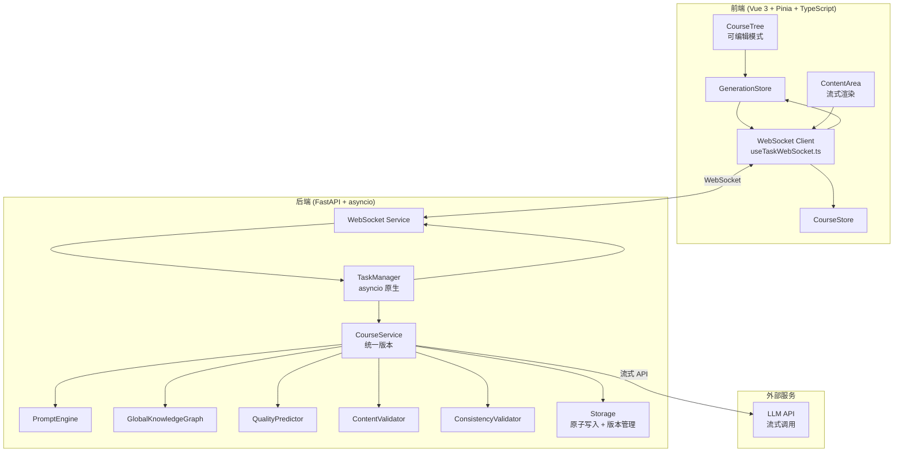
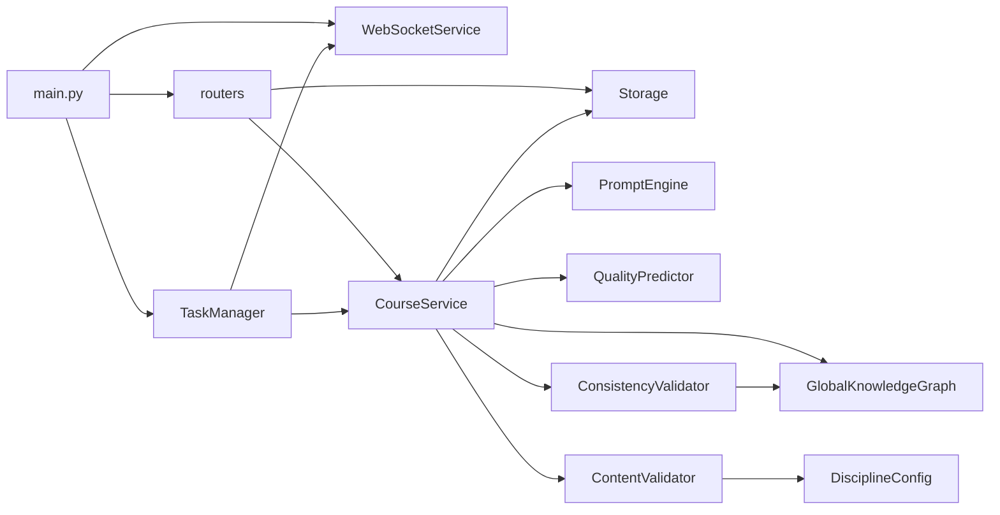
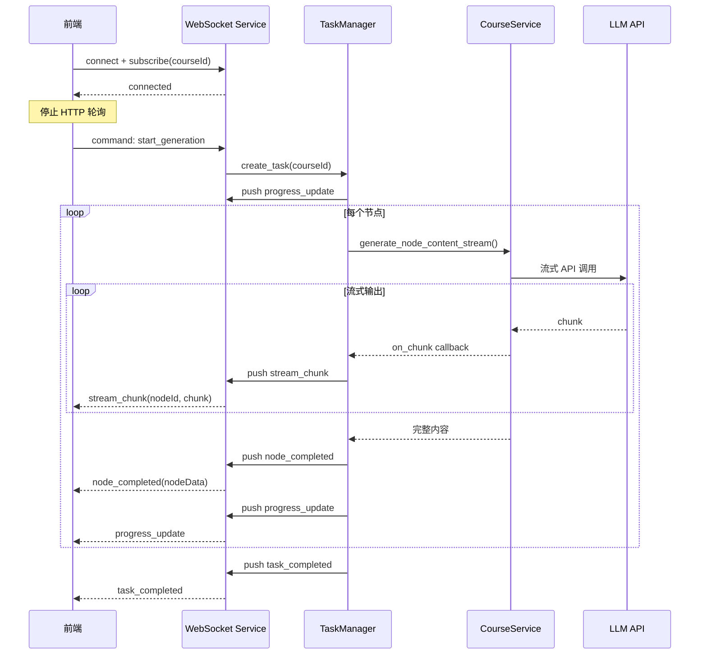
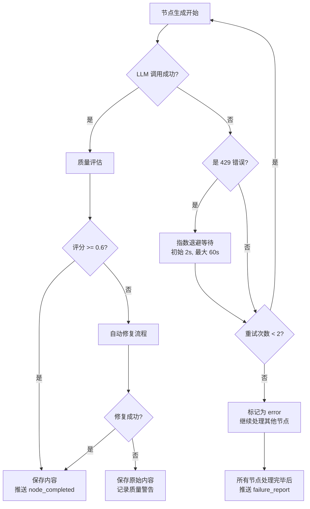

# 设计文档：课程生成系统全方位优化

## 概述

本设计文档描述 KnowledgeMap 课程生成系统的全方位优化方案，覆盖生成速度、内容质量、实时交互、用户体验和代码架构五大领域。

### 当前系统问题

| 维度 | 现状 | 目标 |
|------|------|------|
| 速度 | 无流式输出，BATCH_SIZE=3 顺序执行，前端 2s HTTP 轮询 | WebSocket 实时推送，流式输出，asyncio 并发 |
| 质量 | 节点独立生成缺乏上下文，简单字符数阈值，MD5 去重 | 跨节点上下文注入，结构化评分，余弦相似度去重 |
| 交互 | 无用户干预，大纲不可编辑，无流式预览 | 大纲编辑，单节点控制，实时流式预览 |
| 架构 | 5 个版本 ai_course_service 共存，threading+asyncio 混合 | 单一服务版本，纯 asyncio 架构 |

### 设计原则

1. **渐进式重构**：在保持系统可用的前提下逐步替换旧组件
2. **关注点分离**：将 GlobalKnowledgeGraph、QualityPredictor 等从 ai_course_service_v5.py 拆分为独立模块
3. **异步优先**：统一使用 asyncio，消除 threading 混合
4. **类型安全**：所有公共接口提供完整的 Python type hints

## 架构

### 整体架构图



### 模块依赖关系



### 关键架构决策

| 决策 | 选择 | 理由 |
|------|------|------|
| 实时通信 | WebSocket + HTTP 轮询回退 | WebSocket 提供低延迟推送，HTTP 轮询作为降级方案保证可用性 |
| 并发模型 | asyncio 原生 | 消除 threading+asyncio 混合的复杂性，利用 FastAPI 原生事件循环 |
| 任务调度 | asyncio.Queue + Semaphore | 生产者-消费者模式，Semaphore 控制并发上限 |
| 存储安全 | 原子写入 + 文件级锁 | 先写临时文件再重命名，asyncio.Lock 按 course_id 隔离 |
| 流式输出 | SSE over WebSocket | 复用已有 WebSocket 连接，减少连接开销 |
| 代码统一 | 保留 v5，拆分子模块 | 保留最新版本，将内聚组件拆分为独立文件 |

## 组件与接口

### 1. WebSocket Service（新增）

负责管理 WebSocket 连接和消息推送，替代当前 `main.py` 中的 `ConnectionManager`。

```python
# backend/websocket_service.py

class WebSocketService:
    """WebSocket 服务，管理连接和消息推送"""

    async def connect(self, websocket: WebSocket, course_id: str | None = None) -> str:
        """建立连接，返回 connection_id，可选订阅 course_id"""
        ...

    async def disconnect(self, connection_id: str) -> None:
        """断开连接并清理订阅"""
        ...

    async def subscribe(self, connection_id: str, course_id: str) -> None:
        """订阅指定课程的更新事件"""
        ...

    async def unsubscribe(self, connection_id: str, course_id: str) -> None:
        """取消订阅"""
        ...

    async def push_node_completed(self, course_id: str, node_data: dict) -> None:
        """推送节点完成事件，仅发送给订阅了该 course_id 的客户端"""
        ...

    async def push_progress_update(self, course_id: str, progress: TaskProgress) -> None:
        """推送进度更新事件"""
        ...

    async def push_stream_chunk(self, course_id: str, node_id: str, chunk: str) -> None:
        """推送流式内容片段"""
        ...

    async def push_error(self, course_id: str, error: TaskError) -> None:
        """推送错误事件"""
        ...

    async def handle_client_command(self, connection_id: str, command: dict) -> None:
        """处理客户端命令：skip_node, retry_node, custom_instruction, stop_node"""
        ...
```

#### WebSocket 消息协议

```python
# 服务端 -> 客户端
class WSMessage(TypedDict):
    type: Literal[
        "progress_update",    # 进度更新
        "node_completed",     # 节点完成
        "stream_chunk",       # 流式内容片段
        "task_completed",     # 任务完成
        "task_error",         # 任务错误
        "failure_report",     # 失败节点汇总
    ]
    task_id: str
    course_id: str
    payload: dict  # 具体内容取决于 type

# 客户端 -> 服务端
class WSCommand(TypedDict):
    type: Literal[
        "subscribe",          # 订阅课程
        "unsubscribe",        # 取消订阅
        "skip_node",          # 跳过节点
        "retry_node",         # 重试节点
        "stop_node",          # 停止节点生成
        "custom_instruction", # 自定义指令
        "retry_all_failed",   # 重试所有失败节点
    ]
    course_id: str
    node_id: str | None
    payload: dict | None

# progress_update payload
class ProgressPayload(TypedDict):
    task_id: str
    course_id: str
    status: str
    progress: float
    current_node_name: str
    completed_nodes: int
    total_nodes: int
    estimated_time_remaining: float

# stream_chunk payload
class StreamChunkPayload(TypedDict):
    node_id: str
    chunk: str
    accumulated_length: int
```

### 2. TaskManager（重构）

从 threading+asyncio 混合模式重构为纯 asyncio 架构。

```python
# backend/task_manager.py

class TaskManager:
    """异步任务管理器，使用 asyncio 原生调度"""

    def __init__(
        self,
        storage: Storage,
        course_service: CourseService,
        ws_service: WebSocketService,
        max_concurrency: int = 5,
    ) -> None: ...

    async def start(self) -> None:
        """通过 FastAPI lifespan 启动，创建消费者协程"""
        ...

    async def shutdown(self, timeout: float = 30.0) -> None:
        """优雅关闭，等待正在执行的任务完成"""
        ...

    async def create_task(self, course_id: str, task_type: str = "auto_generate") -> str:
        """创建任务并放入 asyncio.Queue"""
        ...

    async def skip_node(self, task_id: str, node_id: str) -> None:
        """跳过指定节点"""
        ...

    async def retry_node(self, task_id: str, node_id: str) -> None:
        """重试指定节点"""
        ...

    async def stop_node(self, task_id: str, node_id: str) -> None:
        """停止正在生成的节点，保留已生成内容"""
        ...

    async def retry_all_failed(self, task_id: str) -> None:
        """批量重试所有失败节点"""
        ...

    async def update_outline(self, task_id: str, new_outline: list[dict]) -> None:
        """更新大纲，取消受影响的待执行任务并重新调度"""
        ...

    async def _consumer_loop(self) -> None:
        """消费者循环，从 asyncio.Queue 取任务执行"""
        ...

    async def _schedule_nodes(self, task_id: str, nodes: list[dict]) -> None:
        """按层级优先策略调度节点生成"""
        ...

    async def _process_node(self, task_id: str, node: dict) -> None:
        """处理单个节点，包含重试和错误恢复"""
        ...

    def _get_task_log(self, task_id: str) -> list[TaskLogEntry]:
        """获取任务执行日志"""
        ...
```

### 3. CourseService（重构拆分）

将 `ai_course_service_v5.py` 中的 `GlobalKnowledgeGraph`、`ContentCache`、`QualityPredictor` 拆分为独立模块。

```python
# backend/course_service.py（从 ai_course_service_v5.py 重命名并重构）

class CourseService:
    """课程生成服务，协调 LLM 调用和内容生成"""

    def __init__(
        self,
        prompt_engine: PromptEngine,
        knowledge_graph: GlobalKnowledgeGraph,
        quality_predictor: QualityPredictor,
        content_validator: ContentValidator,
        consistency_validator: ConsistencyValidator,
    ) -> None: ...

    async def generate_course(
        self, topic: str, difficulty: DifficultyLevel, style: TeachingStyle,
        requirements: str = "",
    ) -> CourseData: ...

    async def generate_node_content_stream(
        self, course_id: str, node: dict, config: NodeGenerationConfig,
        on_chunk: Callable[[str], Awaitable[None]],
    ) -> str:
        """流式生成节点内容，每个 chunk 通过 on_chunk 回调推送"""
        ...

    async def repair_content(
        self, content: str, quality_issues: list[QualityIssue],
        discipline: DisciplineType,
    ) -> str:
        """根据质量问题修复内容"""
        ...

    async def run_consistency_check(self, course_id: str) -> list[ConsistencyIssue]:
        """全局一致性检查"""
        ...

    async def auto_fix_consistency(
        self, course_id: str, issues: list[ConsistencyIssue],
    ) -> FixReport: ...
```

```python
# backend/knowledge_graph.py（从 ai_course_service_v5.py 拆分）

class GlobalKnowledgeGraph:
    """全局知识图谱，维护跨节点的概念、示例和公式注册表"""

    def register_concept(self, name: str, definition: str, node_id: str, context: str = "") -> None: ...
    def register_example(self, title: str, summary: str, node_id: str) -> None: ...
    def register_formula(self, formula: str, description: str, node_id: str) -> None: ...
    def get_context_for_node(self, node_id: str, max_items: int = 10) -> str: ...
    def get_used_example_titles(self) -> list[str]: ...
    def check_example_similarity(self, new_example: str, threshold: float = 0.8) -> list[SimilarExample]: ...
    def get_term_definition_source(self, term: str) -> TermSource | None: ...
```

```python
# backend/quality_predictor.py（从 ai_course_service_v5.py 拆分）

class QualityPredictor:
    """内容质量预测与评估"""

    def predict_quality(self, section_info: dict, discipline: DisciplineType) -> tuple[float, GenerationMode]: ...

    def evaluate_content(self, content: str, node_info: dict) -> QualityScore:
        """多维度评估：结构完整性、内容深度、可读性、格式规范性"""
        ...

    def validate_mermaid(self, content: str) -> list[MermaidIssue]:
        """验证 Mermaid 图表语法"""
        ...
```

### 4. Storage（增强）

```python
# backend/storage.py（增强）

class Storage:
    """文件系统存储层，支持原子写入、并发锁和版本管理"""

    def __init__(self, data_dir: str = "data", max_versions: int = 3) -> None: ...

    async def save_course(self, course_id: str, data: dict) -> None:
        """原子写入：先写临时文件，再重命名。按 course_id 加锁"""
        ...

    async def load_course(self, course_id: str) -> dict: ...

    async def rollback_course(self, course_id: str, version: int) -> dict:
        """回滚到指定版本"""
        ...

    async def validate_all_courses(self) -> list[ValidationReport]:
        """启动时验证所有课程 JSON 完整性"""
        ...

    async def _atomic_write(self, filepath: Path, data: dict) -> None:
        """原子写入实现：写入 .tmp 文件后 rename"""
        ...

    async def _create_snapshot(self, course_id: str) -> None:
        """创建版本快照"""
        ...
```

### 5. 前端 WebSocket Client（新增）

```typescript
// frontend/src/composables/useTaskWebSocket.ts

interface UseTaskWebSocket {
  connect(courseId?: string): void
  disconnect(): void
  subscribe(courseId: string): void
  unsubscribe(courseId: string): void
  sendCommand(command: WSCommand): void
  isConnected: Ref<boolean>
  connectionState: Ref<'connecting' | 'connected' | 'disconnected' | 'reconnecting'>
}

interface WSCommand {
  type: 'skip_node' | 'retry_node' | 'stop_node' | 'custom_instruction' | 'retry_all_failed'
  course_id: string
  node_id?: string
  payload?: Record<string, unknown>
}
```

### 6. 前端 GenerationStore（重构）

```typescript
// 关键变更：
// 1. 移除 Math.random() 随机刷新逻辑
// 2. WebSocket 连接成功后停止 globalPollingTimer
// 3. WebSocket 断开后自动回退到 HTTP 轮询
// 4. 精确更新受影响节点，不刷新整个课程

// 新增 actions:
actions: {
  // WebSocket 事件处理
  handleWSProgressUpdate(payload: ProgressPayload): void
  handleWSNodeCompleted(payload: NodeCompletedPayload): void
  handleWSStreamChunk(payload: StreamChunkPayload): void
  handleWSTaskError(payload: TaskErrorPayload): void
  handleWSFailureReport(payload: FailureReportPayload): void

  // 单节点控制
  skipNode(courseId: string, nodeId: string): void
  retryNode(courseId: string, nodeId: string): void
  stopNode(courseId: string, nodeId: string): void
  setCustomInstruction(courseId: string, nodeId: string, instruction: string): void
  retryAllFailed(courseId: string): void

  // 大纲编辑
  enterOutlineEditMode(): void
  confirmOutline(): void
  updateOutline(nodes: Node[]): void
}
```

### 7. CourseTree 编辑模式（增强）

```typescript
// CourseTree.vue 新增功能：
// 1. 可编辑模式：拖拽排序、重命名、删除、添加节点
// 2. 节点状态可视化：pending/generating/completed/error/skipped
// 3. 总体进度条：已完成/总数 + 预估剩余时间
// 4. 节点级操作按钮：跳过、重试、自定义指令

interface NodeStatus {
  state: 'pending' | 'generating' | 'completed' | 'error' | 'skipped'
  generatedChars: number
  errorSummary?: string
}
```

### 8. 节点生成配置（新增）

```python
# backend/models.py 新增

class NodeGenerationConfig(BaseModel):
    """单节点生成配置"""
    difficulty: DifficultyLevel = "intermediate"
    style: TeachingStyle = "academic"
    target_word_range: tuple[int, int] = (800, 2000)
    include_code_examples: bool = True
    include_exercises: bool = False
    custom_instruction: str | None = None
```

## 数据模型

### 后端数据模型

```python
# backend/models.py 新增/修改

class NodeStatus(str, Enum):
    """节点生成状态"""
    PENDING = "pending"
    GENERATING = "generating"
    COMPLETED = "completed"
    ERROR = "error"
    SKIPPED = "skipped"

class Node(BaseModel):
    """课程节点（扩展）"""
    node_id: str
    parent_node_id: str
    node_name: str
    node_level: int
    node_content: str = ""
    node_type: Literal["original", "custom", "extend"] = "original"
    create_time: datetime | None = None
    is_read: bool = False
    quiz_score: int | None = None
    # 新增字段
    generation_status: NodeStatus = NodeStatus.PENDING
    generation_config: NodeGenerationConfig | None = None
    generated_chars: int = 0
    error_summary: str | None = None

class TaskLogEntry(BaseModel):
    """任务执行日志条目"""
    timestamp: datetime
    node_id: str | None = None
    node_name: str | None = None
    event: Literal["start", "complete", "error", "retry", "skip"]
    message: str
    retry_count: int = 0
    generated_chars: int = 0
    duration_ms: float | None = None

class TaskState(BaseModel):
    """任务状态（替代当前 dict 结构）"""
    task_id: str
    course_id: str
    task_type: str = "auto_generate"
    status: Literal["pending", "running", "paused", "completed", "error"]
    progress: float = 0.0
    current_node_name: str = ""
    completed_nodes: int = 0
    total_nodes: int = 0
    created_at: datetime
    updated_at: datetime
    logs: list[TaskLogEntry] = []
    failed_nodes: list[str] = []
    error_message: str | None = None

class QualityScore(BaseModel):
    """内容质量评分"""
    overall: float  # 0.0 - 1.0
    structure_completeness: float
    content_depth: float
    readability: float
    format_correctness: float
    details: dict[str, str] = {}

class ConsistencyIssue(BaseModel):
    """一致性问题"""
    severity: Literal["critical", "warning"]
    issue_type: Literal["duplicate_example", "contradicting_definition", "broken_reference"]
    node_ids: list[str]
    description: str
    auto_fixable: bool

class SimilarExample(BaseModel):
    """相似案例"""
    existing_title: str
    existing_node_id: str
    similarity_score: float
    summary: str

class CourseSnapshot(BaseModel):
    """课程数据快照"""
    version: int
    created_at: datetime
    course_id: str
    data_hash: str
    filepath: str
```

### 前端数据模型

```typescript
// frontend/src/stores/types.ts 新增/修改

interface Node {
  node_id: string
  parent_node_id: string
  node_name: string
  node_level: number
  node_content: string
  node_type: 'original' | 'custom' | 'extend'
  // 新增
  generation_status: 'pending' | 'generating' | 'completed' | 'error' | 'skipped'
  generation_config?: NodeGenerationConfig
  generated_chars: number
  error_summary?: string
}

interface NodeGenerationConfig {
  difficulty: 'beginner' | 'intermediate' | 'advanced'
  style: string
  target_word_range: [number, number]
  include_code_examples: boolean
  include_exercises: boolean
  custom_instruction?: string
}

interface TaskProgress {
  task_id: string
  course_id: string
  status: string
  progress: number
  current_node_name: string
  completed_nodes: number
  total_nodes: number
  estimated_time_remaining: number
}

interface FailureReport {
  task_id: string
  course_id: string
  failed_nodes: Array<{
    node_id: string
    node_name: string
    error: string
    retry_count: number
  }>
  total_failed: number
}
```

### 存储文件结构

```
data/
├── courses/
│   ├── {course_id}.json          # 当前版本
│   ├── {course_id}.v1.json       # 快照版本 1
│   ├── {course_id}.v2.json       # 快照版本 2
│   └── {course_id}.v3.json       # 快照版本 3
├── knowledge_graphs/
│   └── {course_id}_kg.json       # 知识图谱数据
├── tasks.json                     # 任务状态持久化
└── annotations.json               # 标注数据
```

### WebSocket 消息流序列图



### 错误恢复与重试流程



## 正确性属性

*属性（Property）是指在系统所有有效执行中都应成立的特征或行为——本质上是对系统应做什么的形式化陈述。属性是人类可读规范与机器可验证正确性保证之间的桥梁。*

### Property 1: WebSocket 消息结构完整性与订阅隔离

*对于任意* TaskManager 状态更新和任意一组已订阅客户端，WebSocket 推送的消息应包含 taskId、courseId、status、progress、currentNodeName、completedNodes、totalNodes 全部字段，且仅发送给订阅了对应 courseId 的客户端。

**Validates: Requirements 1.1, 1.5, 1.6**

### Property 2: 前端进度状态同步

*对于任意* progress_update 事件 payload，GenerationStore 接收后应将对应任务的 progress、status、currentNodeName 等字段更新为 payload 中的值，且不影响其他任务的状态。

**Validates: Requirements 1.2**

### Property 3: 流式内容完整性

*对于任意* 节点的流式生成过程，所有 stream_chunk 的文本拼接结果应与最终写入 Storage 的完整内容一致。

**Validates: Requirements 2.2, 2.5**

### Property 4: 并发上限不变量

*对于任意* 一组待生成节点和配置的最大并发数 M，在任意时刻同时执行的节点生成任务数不应超过 M。

**Validates: Requirements 3.2**

### Property 5: 层级优先调度顺序

*对于任意* 同一课程的待生成节点集合，TaskManager 的调度顺序应满足：level 1 节点优先于 level 2，level 2 优先于 level 3，同层级按原始顺序执行。

**Validates: Requirements 3.3**

### Property 6: 失败隔离与重试上限

*对于任意* 节点生成失败场景，该节点的重试次数不应超过 2 次；重试耗尽后该节点应被标记为 error 状态；其他节点的生成应不受影响地继续执行。

**Validates: Requirements 3.5, 13.1**

### Property 7: 提示词上下文完整性

*对于任意* 待生成节点，其生成提示词应包含：(a) 最多 3 个前序同级节点的摘要，(b) 知识图谱中已定义术语的原始定义位置引用，(c) 已使用案例标题列表，(d) 若存在自定义指令则包含该指令。

**Validates: Requirements 4.1, 4.3, 7.3, 15.2**

### Property 8: 知识图谱注册完整性

*对于任意* 已注册到 GlobalKnowledgeGraph 的节点，其条目应包含核心概念列表、关键术语定义和已使用案例标题；每个案例摘要长度不少于 50 字且关联有效的 node_id。

**Validates: Requirements 4.2, 15.1**

### Property 9: 一致性问题自动修复

*对于任意* ConsistencyValidator 检测到的严重问题（重复案例、错误引用），CourseService 应自动执行修复；修复后重新检测不应再出现相同的严重问题。

**Validates: Requirements 4.5, 15.4**

### Property 10: 多维度质量评估

*对于任意* 生成内容，QualityPredictor 返回的评分应包含结构完整性、内容深度、可读性、格式规范性四个维度的独立分数，且 ContentValidator 应基于最小段落数、代码示例数量、概念定义数量等结构化规则进行验证。

**Validates: Requirements 5.1, 5.2**

### Property 11: 低质量内容自动修复触发

*对于任意* 质量评分低于 0.6 的内容，CourseService 应自动触发修复流程，将具体质量问题作为修复指令传递给 LLM。

**Validates: Requirements 5.3**

### Property 12: Mermaid 图表语法保证

*对于任意* 包含 Mermaid 代码块的生成内容，经过 ContentValidator 验证和 CourseService 修复后，内容中不应存在语法错误的 Mermaid 图表。

**Validates: Requirements 5.4, 5.5**

### Property 13: 编辑模式生成阻断

*对于任意* CourseTree 处于编辑模式的状态，GenerationStore 不应启动任何内容生成任务。

**Validates: Requirements 6.2**

### Property 14: 大纲确认后任务队列一致性

*对于任意* 用户确认的大纲结构，GenerationStore 创建的任务队列应包含大纲中每个需要生成内容的节点对应的任务，且不包含大纲外的节点任务。

**Validates: Requirements 6.3**

### Property 15: 大纲变更任务取消

*对于任意* 生成过程中的大纲修改操作，TaskManager 应取消所有受影响节点（被删除或被修改的节点）的待执行任务，并为新增节点创建新任务。

**Validates: Requirements 6.5**

### Property 16: 节点跳过状态转换

*对于任意* 处于 pending 状态的节点，执行跳过操作后该节点状态应变为 skipped，且 TaskManager 应继续处理队列中的下一个节点。

**Validates: Requirements 7.1**

### Property 17: 节点重试任务创建

*对于任意* 处于 error 或 completed 状态的节点，执行重新生成操作后 TaskManager 应创建一个仅针对该节点的新生成任务，且结果应覆盖原有内容。

**Validates: Requirements 7.2**

### Property 18: WebSocket 命令处理

*对于任意* 有效的客户端命令（skip_node、retry_node、custom_instruction、stop_node、retry_all_failed），WebSocket Service 应接受并转发给 TaskManager 执行，且返回确认响应。

**Validates: Requirements 7.4**

### Property 19: 进度计算正确性

*对于任意* 任务状态，总体进度百分比应等于 completed_nodes / total_nodes * 100，且已完成节点数 + 待处理节点数 + 失败节点数 + 跳过节点数 = 总节点数。

**Validates: Requirements 8.4**

### Property 20: 优雅关闭

*对于任意* 一组正在执行的任务，当 FastAPI 应用关闭时，TaskManager 应等待所有正在执行的任务完成（最长 30 秒），超时后强制终止并释放资源。

**Validates: Requirements 10.4**

### Property 21: 并发写入安全

*对于任意* 对同一 course_id 的并发写入操作，Storage 应通过文件级锁串行执行写入，最终文件应为有效 JSON 且包含最后一次写入的完整数据。

**Validates: Requirements 10.5, 11.2**

### Property 22: 原子写入与故障恢复

*对于任意* 写入操作，Storage 应使用先写临时文件再重命名的原子写入模式；若写入失败，上一个有效版本的数据文件应保持完整可读。

**Validates: Requirements 11.1, 11.3**

### Property 23: 启动时数据完整性验证

*对于任意* 一组课程 JSON 文件（包含有效和损坏的文件），Storage 启动验证应正确识别所有损坏文件并记录警告。

**Validates: Requirements 11.4**

### Property 24: 版本快照上限

*对于任意* 课程的保存操作序列，Storage 应仅保留最近 3 个版本的快照；当快照数超过 3 时，最旧的快照应被删除。

**Validates: Requirements 11.5**

### Property 25: 精确节点更新

*对于任意* node_completed 或 nodes_updated WebSocket 事件，CourseStore 应仅更新事件中指定的节点数据，其他节点的数据应保持不变。

**Validates: Requirements 12.2**

### Property 26: 确定性刷新条件

*对于任意* GenerationStore 状态变化，课程数据刷新应仅在以下条件下触发：任务状态变更为 completed、用户手动切换课程、WebSocket 重连成功。不应存在基于随机数的刷新逻辑。

**Validates: Requirements 12.3**

### Property 27: 失败节点汇总报告

*对于任意* 包含失败节点的任务，当所有其他节点处理完毕后，TaskManager 应生成包含所有失败节点信息（node_id、node_name、error、retry_count）的汇总报告并通过 WebSocket 推送。

**Validates: Requirements 13.2**

### Property 28: 批量重试失败节点

*对于任意* 包含 N 个 error 状态节点的任务，执行"重试所有失败节点"操作后应创建 N 个重试任务，每个任务对应一个失败节点。

**Validates: Requirements 13.3**

### Property 29: 指数退避策略

*对于任意* 连续的 429 速率限制错误序列，TaskManager 的等待时间应遵循指数退避：第 k 次等待时间为 min(2^k * 2, 60) 秒。

**Validates: Requirements 13.4**

### Property 30: 任务执行日志完整性

*对于任意* 已完成的任务，其执行日志应包含每个节点的开始时间、结束时间、重试次数、错误信息（如有）和生成字数。

**Validates: Requirements 13.5**

### Property 31: 生成配置解析

*对于任意* 节点生成请求，若该节点有自定义配置则使用自定义配置，否则使用课程级别默认配置；配置中的难度级别、教学风格、目标字数范围、代码示例开关、练习题开关应全部反映在生成提示词中。

**Validates: Requirements 14.2, 14.3, 14.4**

### Property 32: 案例重复检测

*对于任意* 两个不同节点中的案例文本，若其余弦相似度 ≥ 0.8，ConsistencyValidator 应将其标记为重复。

**Validates: Requirements 15.3**

### Property 33: 课程数据序列化往返

*对于任意* 有效的课程 JSON 数据对象，序列化为 JSON 字符串后再反序列化应产生与原始数据等价的对象。

**Validates: Requirements 16.5**

## 错误处理

### 后端错误处理策略

| 错误场景 | 处理方式 | 恢复策略 |
|----------|----------|----------|
| LLM API 超时 | 记录错误，重试（最多 2 次） | 指数退避后重试 |
| LLM API 429 速率限制 | 指数退避等待（2s → 4s → 8s → ... → 60s） | 自动重试直到成功或达到最大等待时间 |
| LLM API 返回无效内容 | 质量评分 < 0.6 触发修复流程 | 自动修复或保留原始内容并记录警告 |
| 流式传输中断 | 记录已接收内容长度 | 重试时从断点继续 |
| 节点生成失败（重试耗尽） | 标记为 error，继续其他节点 | 用户可手动重试或批量重试 |
| Storage 写入失败 | 保留上一有效版本，记录错误日志 | 原子写入保证不会损坏现有文件 |
| Storage 文件损坏 | 启动时检测，尝试从快照恢复 | 保留最近 3 个版本快照 |
| 并发写入冲突 | asyncio.Lock 按 course_id 串行化 | 锁保证写入顺序 |
| WebSocket 连接断开 | 前端自动回退到 HTTP 轮询 | 自动重连，重连后恢复 WebSocket 模式 |
| WebSocket 消息发送失败 | 捕获异常，移除断开的连接 | 客户端重连后重新订阅 |
| 大纲编辑冲突 | 编辑模式下阻断生成任务 | 确认大纲后重新创建任务队列 |
| 知识图谱数据不一致 | ConsistencyValidator 检测并分类 | 严重问题自动修复，轻微问题记录日志 |

### 错误分级

```python
class ErrorSeverity(str, Enum):
    CRITICAL = "critical"    # 需要立即处理：数据损坏、服务不可用
    WARNING = "warning"      # 需要关注：质量问题、一致性问题
    INFO = "info"            # 仅记录：重试成功、自动修复完成
```

### 前端错误处理

- WebSocket 断开：自动切换到 HTTP 轮询，UI 显示连接状态指示器
- 节点生成失败：CourseTree 中显示错误摘要和重试按钮
- 批量失败：任务完成后显示失败汇总弹窗，提供"重试所有失败"按钮
- 网络错误：使用 ElMessage 显示错误提示，自动重试关键操作

## 测试策略

### 测试框架选择

| 层级 | 框架 | 用途 |
|------|------|------|
| 后端单元测试 | pytest + pytest-asyncio | 异步函数测试 |
| 后端属性测试 | pytest + hypothesis | 属性基测试（Property-Based Testing） |
| 前端单元测试 | vitest | 组件和 store 测试 |
| 前端属性测试 | vitest + fast-check | 属性基测试 |
| 集成测试 | pytest + httpx + websockets | WebSocket 和 API 集成测试 |

### 属性基测试配置

- 每个属性测试最少运行 **100 次迭代**
- 每个测试必须通过注释引用设计文档中的属性编号
- 标签格式：**Feature: course-generation-optimization, Property {number}: {property_text}**
- 每个正确性属性由**单个**属性基测试实现

### 后端测试覆盖

#### TaskManager 测试

- **单元测试**：
  - 任务创建和状态转换（pending → running → completed/error）
  - 节点跳过、重试、停止操作
  - 大纲变更后任务取消和重新调度
  - 优雅关闭超时处理

- **属性测试**：
  - Property 4: 并发上限不变量 — `@given(st.lists(st.text()), st.integers(min_value=1, max_value=20))`
  - Property 5: 层级优先调度 — `@given(st.lists(node_strategy()))`
  - Property 6: 失败隔离与重试上限 — `@given(node_strategy(), st.integers(min_value=0, max_value=5))`
  - Property 19: 进度计算 — `@given(st.integers(min_value=0), st.integers(min_value=1))`
  - Property 29: 指数退避 — `@given(st.integers(min_value=1, max_value=10))`
  - Property 30: 日志完整性 — `@given(st.lists(task_log_strategy()))`

#### Storage 测试

- **单元测试**：
  - 原子写入成功和失败场景
  - 版本快照创建和清理
  - 启动时数据验证
  - 损坏文件恢复

- **属性测试**：
  - Property 21: 并发写入安全 — `@given(st.lists(course_data_strategy()))`
  - Property 22: 原子写入故障恢复 — `@given(course_data_strategy())`
  - Property 24: 版本快照上限 — `@given(st.lists(course_data_strategy(), min_size=1, max_size=10))`
  - Property 33: 序列化往返 — `@given(course_json_strategy())`

#### ContentValidator 测试

- **单元测试**：
  - 各维度评分计算
  - Mermaid 语法验证（有效和无效样例）
  - 质量阈值触发修复

- **属性测试**：
  - Property 10: 多维度质量评估 — `@given(content_strategy())`
  - Property 12: Mermaid 语法保证 — `@given(mermaid_content_strategy())`

#### GlobalKnowledgeGraph 测试

- **单元测试**：
  - 概念、案例、公式注册和查询
  - 术语定义源查找

- **属性测试**：
  - Property 8: 知识图谱注册完整性 — `@given(knowledge_entry_strategy())`
  - Property 32: 案例重复检测 — `@given(st.tuples(st.text(min_size=50), st.text(min_size=50)))`

#### ConsistencyValidator 测试

- **属性测试**：
  - Property 9: 一致性问题自动修复 — `@given(consistency_issues_strategy())`

#### CourseService 测试

- **属性测试**：
  - Property 7: 提示词上下文完整性 — `@given(node_context_strategy())`
  - Property 11: 低质量自动修复触发 — `@given(content_with_score_strategy())`
  - Property 31: 生成配置解析 — `@given(generation_config_strategy())`

### 前端测试覆盖

#### GenerationStore 测试

- **单元测试**：
  - WebSocket 连接/断开时轮询切换
  - 节点控制操作（跳过、重试、停止）
  - 编辑模式阻断生成

- **属性测试**（fast-check）：
  - Property 2: 进度状态同步 — `fc.record({ progress, status, ... })`
  - Property 25: 精确节点更新 — `fc.array(fc.record(nodeArbitrary))`
  - Property 26: 确定性刷新条件 — `fc.oneof(stateChangeArbitrary)`

#### WebSocket 集成测试

- **集成测试**：
  - Property 1: 消息结构完整性与订阅隔离
  - Property 3: 流式内容完整性
  - Property 18: 命令处理
  - WebSocket 断开重连场景
  - 多客户端并发订阅

### 测试目录结构

```
backend/
├── tests/
│   ├── conftest.py                    # 共享 fixtures
│   ├── strategies.py                  # Hypothesis 自定义策略
│   ├── test_task_manager.py           # TaskManager 单元+属性测试
│   ├── test_storage.py                # Storage 单元+属性测试
│   ├── test_content_validator.py      # ContentValidator 单元+属性测试
│   ├── test_knowledge_graph.py        # GlobalKnowledgeGraph 单元+属性测试
│   ├── test_consistency_validator.py  # ConsistencyValidator 测试
│   ├── test_course_service.py         # CourseService 测试
│   ├── test_quality_predictor.py      # QualityPredictor 测试
│   └── test_websocket_integration.py  # WebSocket 集成测试

frontend/
├── src/
│   └── stores/
│       └── __tests__/
│           ├── generation.test.ts     # GenerationStore 单元+属性测试
│           └── websocket.test.ts      # WebSocket 集成测试
```
