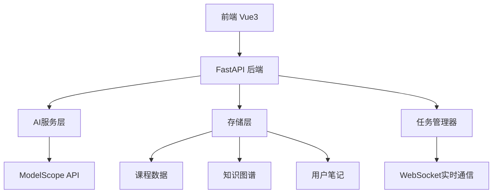
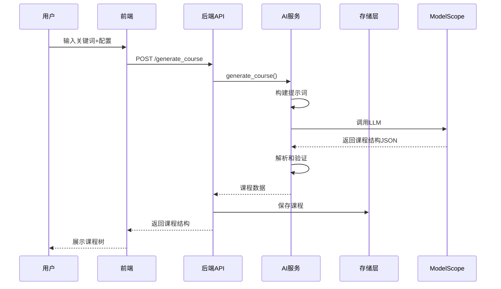

# Knowledge Map AI - 完整功能文档设计

## 1. 项目概述

Knowledge Map AI（知识图谱 AI 助手）是一个基于 AI 的交互式知识图谱生成与学习平台，通过 AI 自动生成课程大纲、教学内容、知识图谱，并提供智能导师、测验和复习系统。

### 1.1 技术栈
- **前端**: Vue 3, Vite, TailwindCSS, Mermaid.js
- **后端**: FastAPI, Python 3.10
- **AI模型**: ModelScope API (Qwen/Qwen2.5, Qwen3-32B)
- **部署**: Docker, ModelScope 创空间

### 1.2 核心价值
- 自动化课程内容生成，降低教育内容创作门槛
- 知识图谱可视化，帮助学习者建立系统性认知
- AI苏格拉底式导师，引导深度思考
- 基于艾宾浩斯遗忘曲线的智能复习系统

---

## 2. 系统架构设计

### 2.1 整体架构



### 2.2 模块划分

#### 2.2.1 前端模块
- **课程管理**: 课程列表、创建、删除
- **内容展示**: 树形结构、节点内容渲染（Markdown + LaTeX + Mermaid）
- **AI交互**: 聊天面板、流式响应
- **知识图谱**: 可视化展示、节点关联
- **测验系统**: 题目生成、答题、结果分析
- **复习系统**: 复习计划、记忆曲线

#### 2.2.2 后端模块
- **API路由**: RESTful API + WebSocket
- **AI服务**: 提示工程、模型调用、响应处理
- **存储服务**: JSON文件存储（课程、笔记、知识图谱）
- **任务管理**: 异步任务队列、进度追踪

---

## 3. 核心功能设计

### 3.1 智能课程生成

#### 3.1.1 功能描述
用户输入关键词，系统自动生成完整的课程大纲和知识结构。

#### 3.1.2 技术实现

**API端点**: `POST /generate_course`

**请求参数**:
```json
{
  "keyword": "深度学习",
  "difficulty": "intermediate",  // beginner | intermediate | advanced
  "style": "academic",           // academic | industrial | socratic | humorous
  "requirements": "侧重实战应用"
}
```

**响应结构**:
```json
{
  "course_id": "uuid",
  "course_name": "《深度学习：原理与实践》",
  "logic_flow": "课程设计逻辑说明",
  "difficulty": "intermediate",
  "style": "academic",
  "nodes": [
    {
      "node_id": "uuid",
      "parent_node_id": "root",
      "node_name": "第一章 神经网络基础",
      "node_level": 1,
      "node_content": "章节简介",
      "node_type": "original"
    }
  ]
}
```

#### 3.1.3 AI提示工程
- 使用 `ACADEMIC_IDENTITY` 定义AI角色为世界顶尖学科权威
- 根据难度级别调整内容深度（入门/进阶/专家）
- 根据教学风格调整表述方式（学术/工业/苏格拉底/幽默）
- 生成8-12个核心章节，每章5-8个子小节

#### 3.1.4 数据流程


---

### 3.2 动态内容生成

#### 3.2.1 子节点生成

**API端点**: `POST /courses/{course_id}/nodes/{node_id}/subnodes`

**功能**: 为章节生成详细的子小节

**去重机制**: 检查是否已存在子节点，避免重复生成

**AI策略**:
- 参考全书大纲，避免内容重复
- 生成6-10个子小节（严禁只生成2-3个）
- 每个子小节聚焦具体知识点

#### 3.2.2 内容重定义（流式生成）

**API端点**: `POST /courses/{course_id}/nodes/{node_id}/redefine_stream`

**功能**: 根据用户需求重新生成章节内容，支持实时流式输出

**技术特点**:
- 使用 `StreamingResponse` 实现打字机效果
- 流式传输完成后自动保存到存储
- 支持LaTeX公式和Mermaid图表

**内容规范**:
- 篇幅: 800-1500字
- 格式: Markdown + LaTeX + Mermaid
- 质量: 学术著作级别，可被引用为参考文献

---

### 3.3 知识图谱可视化

#### 3.3.1 功能描述
从课程内容中提取核心知识实体（概念、定理、方法），构建知识图谱展示知识点之间的逻辑关系。

#### 3.3.2 API设计

**生成图谱**: `POST /courses/{course_id}/knowledge_graph`

**获取图谱**: `GET /courses/{course_id}/knowledge_graph`

#### 3.3.3 图谱结构

**节点类型**:
- `root`: 课程本身
- `module`: 主要模块/章节
- `concept`: 核心概念
- `theorem`: 定理/定律
- `method`: 方法/算法

**关系类型**:
- `contains`: 层级包含
- `depends_on`: 前置依赖
- `leads_to`: 逻辑推导
- `related`: 强相关
- `applies_to`: 应用于

**数据格式**:
```json
{
  "nodes": [
    {
      "id": "node_1",
      "label": "反向传播算法",
      "type": "method",
      "description": "神经网络训练的核心算法",
      "chapter_id": "chapter_uuid"
    }
  ],
  "edges": [
    {
      "source": "node_1",
      "target": "node_2",
      "relation": "depends_on",
      "label": "依赖"
    }
  ]
}
```

#### 3.3.4 缓存策略
- 首次生成后缓存到 `backend/data/knowledge_graphs/{course_id}.json`
- 后续请求直接返回缓存数据
- 课程内容更新时需重新生成

---

### 3.4 AI苏格拉底导师

#### 3.4.1 功能描述
内置AI助手，通过追问引导深度思考，提供个性化学习辅导。

#### 3.4.2 API设计

**端点**: `POST /ask`

**请求参数**:
```json
{
  "course_id": "uuid",
  "node_id": "uuid",
  "node_name": "章节名称",
  "node_content": "章节内容",
  "question": "用户问题",
  "history": [
    {"role": "user", "content": "之前的问题"},
    {"role": "assistant", "content": "之前的回答"}
  ],
  "selection": "用户选中的文本",
  "user_notes": "用户笔记",
  "user_persona": "用户画像",
  "session_metrics": {
    "total_messages": 10,
    "user_messages": 5,
    "ai_messages": 5,
    "session_duration_minutes": 15,
    "topics_discussed": ["概念", "原理"],
    "question_types": {
      "conceptual": 3,
      "procedural": 1
    }
  },
  "enable_long_term_memory": true
}
```

#### 3.4.3 会话记忆增强

**功能**: 根据会话历史提供上下文感知的回答

**实现**:
- 前端计算会话指标（消息数、时长、主题、问题类型）
- 后端将会话上下文注入系统提示
- AI根据历史对话调整回答风格和深度

**会话上下文示例**:
```
--- 会话上下文 ---
本会话已有 10 条消息（用户: 5, AI: 5）
已讨论主题: 概念, 原理, 函数
问题类型分布: 概念性(3), 程序性(1), 故障排除(1)
------------------
```

#### 3.4.4 响应格式

**流式响应**: 使用 `StreamingResponse` 实时返回

**元数据分隔**: 使用 `---METADATA---` 分隔正文和元数据

**元数据结构**:
```json
{
  "node_id": "uuid",
  "quote": "引用的原文片段",
  "anno_summary": "5-10字摘要"
}
```

---

### 3.5 测验与评估系统

#### 3.5.1 测验生成

**API端点**: `POST /courses/{course_id}/nodes/{node_id}/quiz`

**请求参数**:
```json
{
  "node_content": "章节内容",
  "node_name": "章节名称",
  "difficulty": "intermediate",
  "style": "academic",
  "user_persona": "计算机专业大三学生",
  "question_count": 3
}
```

**题目类型**:
- `conceptual`: 概念理解题
- `application`: 应用分析题
- `analysis`: 深度分析题
- `synthesis`: 综合判断题

**题目结构**:
```json
{
  "id": 1,
  "type": "conceptual",
  "question": "题目内容",
  "options": ["选项A", "选项B", "选项C", "选项D"],
  "correct_index": 1,
  "explanation": "详细解析（支持Markdown/Mermaid）",
  "knowledge_point": "考察的知识点",
  "difficulty_score": 3
}
```

#### 3.5.2 智能回退机制

当AI生成失败时，使用预定义模板生成通用题目：
- 基于节点名称生成5个不同类型的题目
- 如果有错题记录，优先生成相关类型题目

#### 3.5.3 测验分析

**功能**: 分析用户答题表现，生成学习建议

**分析维度**:
- 得分统计（正确率、百分比）
- 薄弱知识点识别
- 错误模式分析（按题型统计）
- 个性化学习建议
- 下一步行动计划

---

### 3.6 智能复习系统

#### 3.6.1 复习计划生成

**API端点**: `POST /courses/{course_id}/review/schedule`

**算法**: SM-2间隔重复算法（SuperMemo 2）

**参数**:
- `ease_factor`: 难度因子（默认2.5）
- `interval_days`: 复习间隔（1, 3, 7, 14, 30...）
- `quality`: 回忆质量评分（0-5）

#### 3.6.2 复习项目模型

```python
class ReviewItem:
    node_id: str
    node_name: str
    last_reviewed: datetime
    next_review: datetime
    review_count: int
    interval_days: int
    ease_factor: float
    priority: "high" | "medium" | "low"
    status: "due" | "completed" | "overdue"
```

#### 3.6.3 记忆曲线追踪

**功能**: 可视化展示记忆保持率随时间的变化

**数据结构**:
```json
{
  "memory_curve": [
    {"day": 0, "retention": 1.0, "review_count": 1},
    {"day": 1, "retention": 0.8, "review_count": 0},
    {"day": 3, "retention": 0.6, "review_count": 1}
  ],
  "total_reviews": 15,
  "average_retention": 0.75,
  "weak_nodes": [...]
}
```

---

### 3.7 任务管理系统

#### 3.7.1 功能描述
管理课程生成的异步任务，支持暂停、恢复、取消操作。

#### 3.7.2 API设计

**启动自动生成**: `POST /courses/{course_id}/auto_generate`

**获取任务状态**: `GET /courses/{course_id}/task`

**暂停任务**: `POST /tasks/{task_id}/pause`

**恢复任务**: `POST /tasks/{task_id}/resume`

**删除任务**: `DELETE /tasks/{task_id}`

#### 3.7.3 WebSocket实时通信

**端点**: `ws://localhost:7860/ws/tasks`

**消息类型**:
- `ping/pong`: 心跳检测
- `subscribe`: 订阅课程任务更新
- `task_update`: 任务状态更新
- `task_completed`: 任务完成
- `task_error`: 任务失败

**消息格式**:
```json
{
  "type": "task_update",
  "payload": {
    "taskId": "uuid",
    "courseId": "uuid",
    "status": "running",
    "progress": 45,
    "currentNodeName": "第三章 卷积神经网络",
    "message": "正在生成内容..."
  }
}
```

---

## 4. 数据存储设计

### 4.1 存储结构

```
backend/data/
├── courses/
│   └── {course_id}.json          # 课程数据
├── knowledge_graphs/
│   └── {course_id}.json          # 知识图谱缓存
└── annotations.json              # 用户笔记（全局）
```

### 4.2 课程数据模型

```json
{
  "course_id": "uuid",
  "course_name": "课程名称",
  "logic_flow": "课程设计逻辑",
  "difficulty": "intermediate",
  "style": "academic",
  "requirements": "用户需求",
  "nodes": [
    {
      "node_id": "uuid",
      "parent_node_id": "root",
      "node_name": "章节名称",
      "node_level": 1,
      "node_content": "章节内容（Markdown）",
      "node_type": "original",
      "create_time": "2026-03-05T00:00:00Z",
      "is_read": false,
      "quiz_score": null
    }
  ]
}
```

### 4.3 笔记数据模型

```json
{
  "anno_id": "uuid",
  "node_id": "uuid",
  "course_id": "uuid",
  "question": "用户问题",
  "answer": "AI回答",
  "anno_summary": "笔记摘要",
  "source_type": "user" | "ai" | "user_saved",
  "quote": "引用片段",
  "create_time": "2026-03-05T00:00:00Z"
}
```

---

## 5. AI提示工程设计

### 5.1 提示模板系统

**文件**: `backend/prompts.py`

**模板管理**: 使用 `get_prompt(template_name)` 获取模板

**模板类型**:
- `generate_course`: 课程生成
- `generate_sub_nodes`: 子节点生成
- `generate_content`: 内容生成
- `redefine_content`: 内容重定义
- `extend_content`: 内容扩展
- `generate_quiz`: 测验生成
- `generate_knowledge_graph`: 知识图谱生成
- `tutor_base`: 导师系统基础
- `summarize_note`: 笔记摘要
- `summarize_chat`: 对话复盘

### 5.2 共享组件

**学术身份** (`ACADEMIC_IDENTITY`):
```
你是一位世界顶尖的学科权威、获过图灵奖或诺贝尔奖级别的终身教授，
同时拥有丰富的一线工业界落地经验。
```

**难度级别** (`DIFFICULTY_LEVELS`):
- `beginner`: 零基础，侧重直观理解
- `intermediate`: 具备基础，侧重原理和实践
- `advanced`: 领域专家，侧重底层内核和前沿

**教学风格** (`TEACHING_STYLES`):
- `academic`: 学术严谨，引用权威论文
- `industrial`: 工业实战，结合大厂案例
- `socratic`: 苏格拉底式，通过提问引导
- `humorous`: 生动幽默，降低认知负担

### 5.3 格式规范

**LaTeX公式**:
- 行内公式: `$E=mc^2$`
- 块级公式: 独占一行，用 `$` 包裹
- 严禁裸写LaTeX命令

**Mermaid图表**:
- 使用 `graph TD` 或 `graph LR`
- 节点ID用纯英文
- 复杂文本用双引号包裹
- 必须在 ` ```mermaid ` 代码块中

---

## 6. 前端架构设计

### 6.1 技术栈
- Vue 3 (Composition API)
- TypeScript
- Vite
- TailwindCSS
- Mermaid.js (图表渲染)
- KaTeX (LaTeX渲染)

### 6.2 核心组件

**CourseTree.vue**: 课程树形结构
- 递归渲染节点
- 支持展开/折叠
- 节点点击事件

**ContentArea.vue**: 内容展示区
- Markdown渲染
- LaTeX公式渲染
- Mermaid图表渲染
- 代码高亮

**ChatPanel.vue**: AI聊天面板
- 流式消息接收
- 历史记录管理
- 会话指标计算

**CourseNode.vue**: 单个课程节点
- 节点信息展示
- 操作按钮（生成子节点、重定义内容等）

### 6.3 状态管理

使用 Pinia 管理全局状态:
- `courseStore`: 课程数据
- `chatStore`: 聊天历史
- `userStore`: 用户配置

---

## 7. 部署架构

### 7.1 Docker配置

**Dockerfile**:
```dockerfile
FROM python:3.10-slim
WORKDIR /app
COPY backend/requirements.txt .
RUN pip install -r requirements.txt
COPY backend/ ./backend/
COPY frontend/dist/ ./backend/static/
EXPOSE 7860
CMD ["python", "-m", "uvicorn", "backend.main:app", "--host", "0.0.0.0", "--port", "7860"]
```

### 7.2 ModelScope创空间部署

**配置文件**: `README.md` (YAML front matter)
```yaml
---
title: Knowledge Map AI
emoji: 🧠
colorFrom: blue
colorTo: indigo
sdk: docker
app_port: 7860
---
```

**部署流程**:
1. 前端构建: `cd frontend && npm run build`
2. 静态文件复制到 `backend/static/`
3. Docker镜像构建
4. 推送到ModelScope创空间

---

## 8. 性能优化设计

### 8.1 前端优化
- 虚拟滚动（大型课程树）
- 懒加载（节点内容按需加载）
- 防抖/节流（搜索、输入）
- 缓存策略（课程数据、知识图谱）

### 8.2 后端优化
- 异步任务队列（课程生成）
- 响应缓存（知识图谱）
- 流式响应（内容生成、AI对话）
- 连接池管理（AI API调用）

### 8.3 AI调用优化
- 模型路由（智能模型 vs 快速模型）
- 重试机制（指数退避）
- 超时控制
- 错误降级（智能回退）

---

## 9. 安全设计

### 9.1 API安全
- CORS配置（允许所有来源，生产环境需限制）
- 输入验证（Pydantic模型）
- 错误处理（统一异常捕获）

### 9.2 数据安全
- 文件路径验证（防止路径遍历）
- JSON数据验证
- 敏感信息脱敏（API密钥日志）

### 9.3 AI安全
- 提示注入防护
- 输出内容过滤
- 调用频率限制

---

## 10. 监控与日志

### 10.1 日志系统
- 使用Python `logging` 模块
- 日志级别: INFO, WARNING, ERROR
- 关键操作日志: AI调用、任务状态、错误信息

### 10.2 健康检查
- 端点: `GET /health`
- 返回: 系统状态、时间戳

### 10.3 性能监控
- AI调用耗时
- 任务执行进度
- WebSocket连接数

---

## 11. 扩展性设计

### 11.1 多模型支持
- 通过环境变量配置不同模型
- 支持智能模型和快速模型切换
- 可扩展到其他LLM提供商

### 11.2 多语言支持
- 提示模板国际化
- 前端UI国际化
- 内容生成语言配置

### 11.3 插件系统
- 自定义内容生成器
- 自定义测验类型
- 自定义知识图谱渲染

---

## 12. 技术债务与改进方向

### 12.1 当前限制
- 存储使用JSON文件（不支持并发写入）
- 无用户认证系统
- 无多租户支持
- 前端状态管理较简单

### 12.2 改进建议
- 迁移到数据库（PostgreSQL + SQLAlchemy）
- 添加用户认证（JWT）
- 实现多租户隔离
- 优化前端状态管理（Pinia模块化）
- 添加单元测试和集成测试
- 实现CI/CD流程

---

## 13. 开发规范

### 13.1 代码风格
- Python: PEP 8
- TypeScript: ESLint + Prettier
- 注释: 中文注释，关键逻辑必须注释

### 13.2 Git工作流
- 主分支: `main`
- 功能分支: `feature/功能名`
- 修复分支: `fix/问题描述`
- 提交信息: 中文，清晰描述改动

### 13.3 文档维护
- API文档: 使用FastAPI自动生成（`/docs`）
- 代码文档: Docstring（Google风格）
- 用户文档: Markdown格式

---

## 14. 测试策略

### 14.1 单元测试
- 后端: pytest
- 前端: Vitest
- 覆盖率目标: 70%+

### 14.2 集成测试
- API端到端测试
- AI服务模拟测试
- WebSocket通信测试

### 14.3 手动测试
- 课程生成流程
- AI对话交互
- 知识图谱渲染
- 测验系统

---

## 15. 附录

### 15.1 环境变量配置

```bash
# AI模型配置
AI_API_KEY=your_modelscope_api_key
AI_API_BASE=https://api-inference.modelscope.cn/v1
AI_MODEL=Qwen/Qwen3-32B
AI_MODEL_FAST=Qwen/Qwen3-32B

# 服务配置
PORT=7860
HOST=0.0.0.0
```

### 15.2 依赖版本

**后端** (`backend/requirements.txt`):
```
fastapi>=0.104.0
uvicorn>=0.24.0
pydantic>=2.0.0
python-dotenv>=1.0.0
openai>=1.0.0
```

**前端** (`frontend/package.json`):
```json
{
  "dependencies": {
    "vue": "^3.3.0",
    "typescript": "^5.0.0",
    "vite": "^5.0.0",
    "tailwindcss": "^3.3.0",
    "mermaid": "^10.0.0",
    "katex": "^0.16.0"
  }
}
```

### 15.3 API端点总览

**课程管理**:
- `GET /courses` - 列出所有课程
- `GET /courses/{course_id}` - 获取课程详情
- `POST /generate_course` - 生成新课程
- `DELETE /courses/{course_id}` - 删除课程

**节点操作**:
- `POST /courses/{course_id}/nodes` - 添加自定义节点
- `POST /courses/{course_id}/nodes/{node_id}/subnodes` - 生成子节点
- `POST /courses/{course_id}/nodes/{node_id}/redefine_stream` - 重定义内容（流式）
- `POST /courses/{course_id}/nodes/{node_id}/extend` - 扩展内容

**知识图谱**:
- `POST /courses/{course_id}/knowledge_graph` - 生成知识图谱
- `GET /courses/{course_id}/knowledge_graph` - 获取知识图谱

**AI交互**:
- `POST /ask` - AI问答（流式）
- `POST /courses/{course_id}/nodes/{node_id}/quiz` - 生成测验
- `POST /courses/{course_id}/nodes/{node_id}/summarize` - 内容摘要

**笔记管理**:
- `GET /nodes/{node_id}/annotations` - 获取笔记
- `POST /annotations` - 保存笔记
- `PUT /annotations/{anno_id}` - 更新笔记
- `DELETE /annotations/{anno_id}` - 删除笔记

**任务管理**:
- `POST /courses/{course_id}/auto_generate` - 启动自动生成
- `GET /courses/{course_id}/task` - 获取任务状态
- `POST /tasks/{task_id}/pause` - 暂停任务
- `POST /tasks/{task_id}/resume` - 恢复任务
- `DELETE /tasks/{task_id}` - 删除任务

**WebSocket**:
- `ws://localhost:7860/ws/tasks` - 任务实时更新

---

## 结论

Knowledge Map AI 是一个功能完整、架构清晰的AI驱动学习平台。本文档详细描述了系统的各个模块设计、技术实现和最佳实践，为后续开发和维护提供了完整的技术参考。
