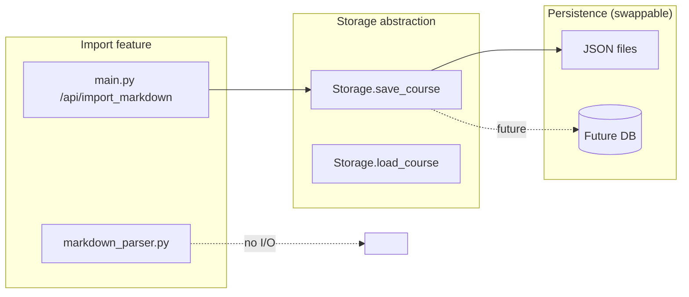

# Design Document: Markdown Import

## Overview

This feature adds a Markdown-to-course import pipeline. Users upload a `.md` or `.txt` file; the backend parses it into the platform's `Node` tree structure and persists it via the existing `Storage` interface; the frontend navigates to the new course immediately.

The design has three layers:
1. `backend/markdown_parser.py` — pure parsing logic (no I/O)
2. A thin `POST /api/import_markdown` route in `backend/main.py` — orchestrates validation, parsing, and storage
3. `frontend/src/components/MarkdownImport.vue` + a new `importMarkdown` action in `frontend/src/stores/course.ts`

No new storage abstractions are introduced. The import feature is a consumer of the existing `Storage.save_course` / `Storage.load_course` interface, exactly like AI-generated courses.

---

## Architecture

```mermaid
flowchart TD
    A[User selects .md file] --> B[MarkdownImport.vue]
    B -->|FormData POST /api/import_markdown| C[main.py route handler]
    C -->|validate size, MIME, encoding| C
    C -->|parse_markdown_to_nodes(text, filename)| D[markdown_parser.py]
    D -->|List[Node] + course_name| C
    C -->|storage.save_course(course_id, tree)| E[Storage]
    E -->|JSON file + in-memory cache| F[backend/data/courses/]
    C -->|{course_id, course_name}| B
    B -->|courseStore.loadCourse(course_id)| G[course.ts Pinia store]
    G -->|GET /courses/course_id| C2[existing /courses route]
```

The parser is a pure function: `parse_markdown_to_nodes(text: str, filename: str) -> tuple[list[dict], str]`. It takes raw text and returns a node list plus the derived course name. It has no side effects and no imports from the rest of the backend, making it independently testable.

---

## Components and Interfaces

### `backend/markdown_parser.py`

Public interface:

```python
def parse_markdown_to_nodes(text: str, filename: str) -> tuple[list[dict], str]:
    """
    Parse Markdown text into a flat list of Node dicts and a course name.

    Args:
        text:     Raw UTF-8 Markdown content.
        filename: Original filename (without extension), used as fallback course name
                  and as the name of a synthetic root node when pre-heading text exists.

    Returns:
        (nodes, course_name)
        nodes:       List of dicts matching the Node schema.
        course_name: Derived from the first minimum-level heading, or filename.

    Raises:
        ValueError: If the document contains no ATX headings.
    """

def pretty_print(nodes: list[dict]) -> str:
    """
    Serialize a flat node list back to a Markdown document.
    node_level 1 → '#', 2 → '##', 3 → '###'.
    Each heading is followed by a blank line, then node_content (if non-empty),
    then another blank line before the next heading.
    """
```

Internal helpers (not exported):

```python
def _detect_min_depth(lines: list[str]) -> int
def _parse_heading(line: str) -> tuple[int, str] | None   # (depth, text) or None
def _compute_level(depth: int, min_depth: int) -> int      # clamps to 3
def _find_parent(stack: list[dict], level: int) -> str     # returns node_id or "root"
def _process_image(match: re.Match) -> str                 # external keep / local replace
def _process_body(raw: str) -> str                         # applies image substitution
```

### `POST /api/import_markdown` (in `backend/main.py`)

```python
@app.post("/api/import_markdown")
async def import_markdown(file: UploadFile = File(...)):
    ...
```

Response model (added to `backend/models.py`):

```python
class ImportMarkdownResponse(BaseModel):
    course_id: str
    course_name: str
```

### `frontend/src/components/MarkdownImport.vue`

A self-contained Element Plus dialog/drawer component. Props: none. Emits: none (uses the store directly). Internal state: `file`, `uploading`, `error`.

### `frontend/src/stores/course.ts` — new action

```typescript
async importMarkdown(file: File): Promise<{ course_id: string; course_name: string }>
```

Uses `http` (the existing `utils/http` instance, confirmed as the utility used throughout `course.ts` and `tutor.ts`). Sends a `multipart/form-data` POST to `/api/import_markdown`, then calls `fetchCourseList()` and `loadCourse(course_id)` on success — the same pattern used after `createCourse`.

---

## Data Models

### Node dict (matches existing `Node` Pydantic model)

| Field | Type | Value for imported nodes |
|---|---|---|
| `node_id` | `str` | `str(uuid.uuid4())` |
| `parent_node_id` | `str` | `"root"` for level-1 nodes; `node_id` of nearest ancestor at `level - 1` |
| `node_name` | `str` | Heading text (stripped) |
| `node_level` | `int` | `depth - min_depth + 1`, clamped to `[1, 3]` |
| `node_content` | `str` | Body text between this heading and the next; `""` if none |
| `node_type` | `str` | `"original"` |
| `is_read` | `bool` | `False` |
| `quiz_score` | `None` | `None` |
| `create_time` | `str` | `datetime.utcnow().isoformat()` |

### Course_Tree dict (matches existing storage format)

```json
{
  "course_id": "<uuid>",
  "course_name": "<string>",
  "keyword": "<same as course_name>",
  "nodes": [ /* list of Node dicts */ ],
  "difficulty": "intermediate",
  "style": "academic",
  "create_time": "<iso8601>"
}
```

This is the exact shape that `Storage.save_course` persists and `Storage.load_course` returns. No schema changes are needed.

---

## Relative Heading Level Algorithm

The core parsing algorithm in `parse_markdown_to_nodes`:

```
1. Scan all lines for ATX headings (^#{1,6}\s).
   Record the minimum depth found → min_depth.

2. Walk lines sequentially, maintaining:
   - current_node: the node being accumulated
   - ancestor_stack: list of nodes from level 1 to current level
     (used for O(1) parent lookup)

3. For each line:
   a. If it is a heading:
      - Compute level = clamp(depth - min_depth + 1, 1, 3)
      - Pop ancestor_stack until top.level < level
      - parent_id = ancestor_stack[-1].node_id if stack non-empty else "root"
      - Finalize current_node (assign accumulated body to node_content)
      - Create new node, push onto stack
   b. Otherwise:
      - Append line to current body accumulator

4. Finalize the last node.

5. If text exists before the first heading:
   - Create a synthetic node: node_name=filename, node_level=1,
     parent_node_id="root", node_content=pre_heading_text
   - Prepend to node list.

6. course_name = node_name of the first node whose node_level == 1,
   or filename if no such node exists.
```

The ancestor stack ensures parent assignment is always O(n) overall. Flattening (step 3a clamp) means a `####` heading in a document whose min is `#` gets level 3, not 4, and its parent is the nearest level-2 ancestor.

---

## Image Handling

Applied during body accumulation via regex substitution:

```python
IMAGE_RE = re.compile(r'!\[([^\]]*)\]\(([^)]+)\)')

def _process_image(alt: str, url: str) -> str:
    is_external = url.startswith('http://') or url.startswith('https://')
    if is_external:
        return f''          # preserve as-is
    placeholder = f'[图片: {alt}]' if alt else '[图片]'
    return placeholder
```

Caption detection: after substituting an image, if the immediately following line is plain text (not a heading, not blank, not another image) or matches `<figcaption>...</figcaption>`, it is appended as plain text on the next line and consumed from the accumulator.

---

## Storage Abstraction Boundary

The import feature interacts with storage through exactly one call:

```python
storage.save_course(course_id, course_tree_dict)
```

This is the same call made by the AI course generation path. The `Storage` class encapsulates all file I/O. If the storage backend is later replaced (e.g., PostgreSQL), only `storage.py` changes — `markdown_parser.py` and the import route handler require zero modifications.



`markdown_parser.py` has no imports from `storage.py` and performs no I/O. It is a pure transformation module.

---

## Correctness Properties

*A property is a characteristic or behavior that should hold true across all valid executions of a system — essentially, a formal statement about what the system should do. Properties serve as the bridge between human-readable specifications and machine-verifiable correctness guarantees.*

### Property 1: Relative heading level mapping

*For any* Markdown document containing at least one ATX heading, every heading's `node_level` in the parsed output must equal `(depth - min_depth + 1)`, clamped to `[1, 3]`, where `min_depth` is the smallest ATX depth present in the document.

**Validates: Requirements 1.1, 1.2, 1.3, 1.5**

### Property 2: Parent chain invariant

*For any* parsed node list, every node with `node_level > 1` must have a `parent_node_id` that refers to a node in the same list whose `node_level` is exactly one less. Nodes with `node_level == 1` must have `parent_node_id == "root"`.

**Validates: Requirements 1.2, 1.4**

### Property 3: Node fields invariant

*For any* parsed node list, all `node_id` values must be distinct valid UUIDs, and every node must have `node_type == "original"`.

**Validates: Requirements 1.6, 1.7**

### Property 4: Body content assignment

*For any* Markdown document, the `node_content` of each heading node must equal the raw text between that heading line and the next heading line (of any level), with leading/trailing whitespace stripped. When no body text exists, `node_content` must be `""`.

**Validates: Requirements 2.1, 2.3**

### Property 5: Inline formatting preservation

*For any* `node_content` string containing inline formatting spans (bold `**`, italic `*`/`_`, inline code `` ` ``, strikethrough `~~`, highlight `==`, Markdown links `[]()`), those spans must appear verbatim and unchanged in the parsed output.

**Validates: Requirements 2.4**

### Property 6: Image handling

*For any* Markdown document, after parsing: (a) every external image (`https?://` URL) must appear in `node_content` with its original syntax unchanged; (b) every local image path must be replaced by `[图片: {alt}]` (or `[图片]` when alt is empty) and must not retain the original path.

**Validates: Requirements 3.1, 3.2**

### Property 7: Storage round-trip

*For any* valid Markdown document, after a successful import the `course_id` returned by the endpoint must be loadable via `Storage.load_course(course_id)`, and the returned tree must contain the same `course_name` and the same number of nodes as were produced by the parser.

**Validates: Requirements 4.1, 4.2, 4.3**

### Property 8: Parse → print → parse round-trip

*For any* Markdown document containing only ATX headings at levels 1–3 (i.e., no deep nesting that would trigger flattening), parsing it to a node list, serializing with `pretty_print`, then parsing again must produce a node list with identical `node_name`, `node_content`, `node_level`, and `parent_node_id` values for every node (UUIDs will differ between the two parse passes and are excluded from comparison).

**Validates: Requirements 7.1, 7.2, 7.3**

---

## Error Handling

| Condition | Layer | HTTP status | Message |
|---|---|---|---|
| File size > 20 MB | Route handler | 413 | "文件过大，最大支持 20 MB" |
| Empty file (0 bytes) | Route handler | 400 | "上传的文件为空" |
| MIME not in allowed set | Route handler | 415 | "不支持的文件类型，请上传 .md 或 .txt 文件" |
| Non-UTF-8 content | Route handler | 422 | "文件编码不支持，请使用 UTF-8 编码的 Markdown 文件" |
| No ATX headings found | Parser (`ValueError`) caught in route | 422 | "未检测到 Markdown 标题，请确保文件包含至少一个 # 标题" |
| Unexpected parse error | Route handler | 500 | "解析失败，请检查文件格式" |

The route handler reads the file bytes once, checks size, attempts UTF-8 decode, checks MIME, then calls the parser. All error responses use FastAPI's `HTTPException`.

---

## Testing Strategy

### Unit tests (`frontend/src/tests/` for frontend, `tests/` for backend)

Focus on specific examples and edge cases:
- Pre-heading text creates a synthetic root node named after the filename
- File with only one heading level (e.g., all `##`) maps correctly to level 1
- Deep headings (`####`, `#####`) are flattened to level 3
- Local image paths are replaced; external URLs are kept
- Image with empty alt text produces `[图片]`
- Empty body between consecutive headings produces `node_content = ""`
- HTTP 400 on empty file, 413 on oversized file, 422 on no headings, 422 on non-UTF-8, 415 on wrong MIME

### Property-based tests (`tests/test_markdown_import.py`)

Uses **Hypothesis** (already a natural fit for Python; no new dependency category — add `hypothesis` to `backend/requirements.txt`).

Each property test runs a minimum of 100 iterations. Tests are tagged with a comment referencing the design property.

```python
# Feature: markdown-import, Property 1: Relative heading level mapping
@given(st.lists(heading_strategy(), min_size=1))
@settings(max_examples=200)
def test_relative_level_mapping(headings): ...

# Feature: markdown-import, Property 2: Parent chain invariant
@given(markdown_document_strategy())
@settings(max_examples=200)
def test_parent_chain_invariant(doc): ...

# Feature: markdown-import, Property 3: Node fields invariant
@given(markdown_document_strategy())
@settings(max_examples=100)
def test_node_fields_invariant(doc): ...

# Feature: markdown-import, Property 4: Body content assignment
@given(markdown_with_bodies_strategy())
@settings(max_examples=200)
def test_body_content_assignment(doc): ...

# Feature: markdown-import, Property 5: Inline formatting preservation
@given(content_with_formatting_strategy())
@settings(max_examples=200)
def test_inline_formatting_preserved(content): ...

# Feature: markdown-import, Property 6: Image handling
@given(markdown_with_images_strategy())
@settings(max_examples=200)
def test_image_handling(doc): ...

# Feature: markdown-import, Property 7: Storage round-trip
@given(markdown_document_strategy())
@settings(max_examples=100)
def test_storage_roundtrip(doc): ...

# Feature: markdown-import, Property 8: Parse → print → parse round-trip
@given(markdown_document_strategy(max_depth=3))
@settings(max_examples=200)
def test_parse_print_parse_roundtrip(doc): ...
```

Generators (`heading_strategy`, `markdown_document_strategy`, etc.) are defined in the same test file using Hypothesis `@composite` strategies. The `markdown_document_strategy(max_depth=3)` generator for Property 8 restricts heading depth to 1–3 to satisfy the round-trip precondition.

Property tests and unit tests are complementary: unit tests catch concrete edge cases quickly; property tests verify the general correctness of the parsing logic across the full input space.
