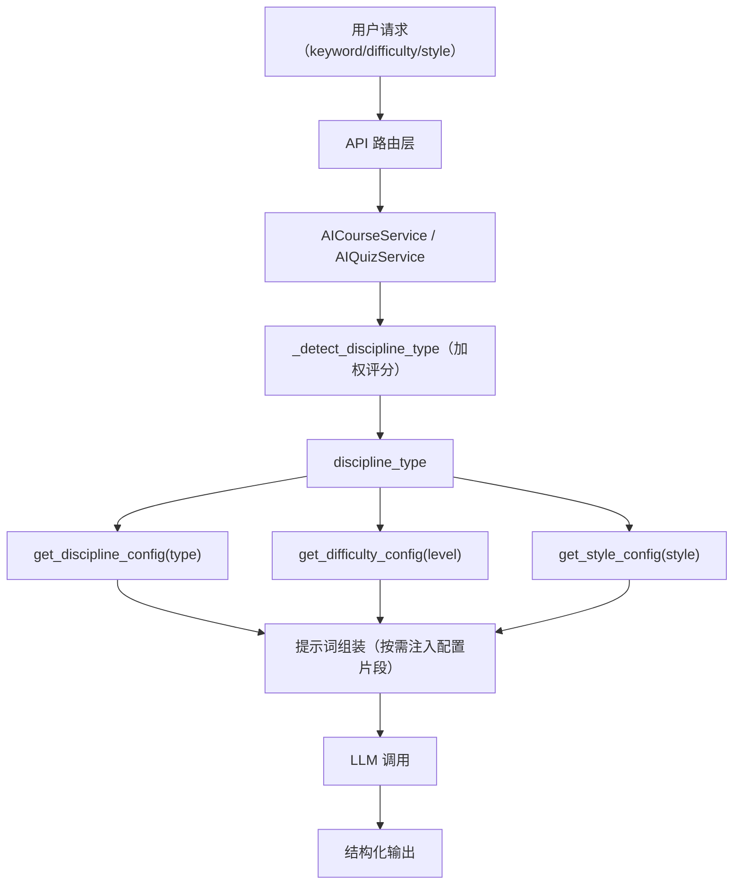
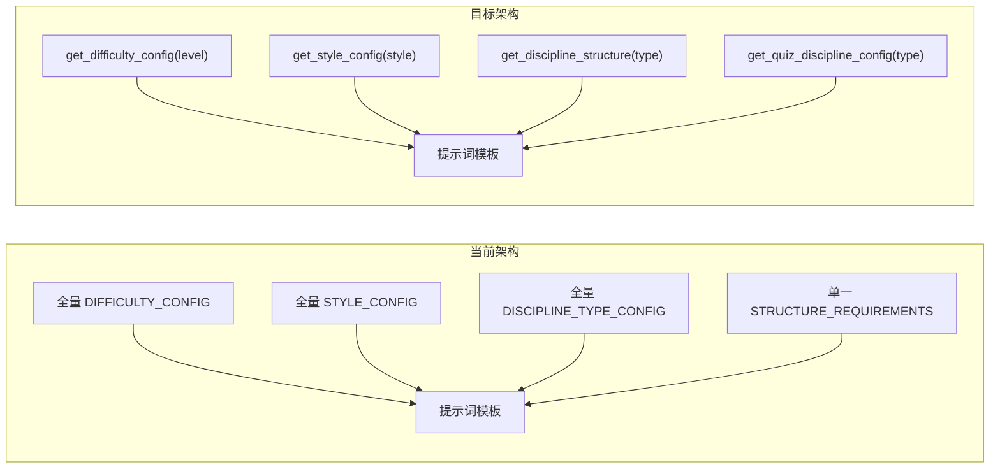

# 设计文档：提示词工程优化

## 概述

本设计针对 Knowledge Map AI 提示词系统的六大优化方向：学科差异化内容模板、学科差异化测验生成、测验链路学科类型传递、提示词信噪比提升、学科检测逻辑改进、回退测验质量改进、子节点生成学科差异化、以及共享配置同步。

核心设计思路是将当前"一刀切"的提示词体系重构为**学科感知（discipline-aware）**的分层架构：

1. **提示词层**：将单一 `STRUCTURE_REQUIREMENTS` 拆分为三套学科专用模板；将全量 `DIFFICULTY_CONFIG` / `STYLE_CONFIG` / `DISCIPLINE_TYPE_CONFIG` 替换为按需查询的配置函数
2. **服务层**：在 `AIQuizService.generate_quiz` 和 `_generate_smart_fallback_quiz` 中新增 `discipline_type` 参数，实现学科感知的题型分布和回退题目
3. **API 层**：在 `GenerateQuizRequest` 模型中新增可选 `discipline_type` 字段，路由层透传
4. **检测层**：改进 `_detect_discipline_type` 的加权评分和关键词覆盖
5. **共享配置层**：在 `shared/` 中新增 `DisciplineType` 枚举和验证函数，前后端同步

## 架构

### 整体数据流



### 提示词组装流程（改进后）



## 组件与接口

### 1. 提示词配置查询函数（`prompts.py` 新增）

```python
def get_difficulty_config(level: str) -> str:
    """返回指定难度等级的配置文本片段"""
    ...

def get_style_config(style: str) -> str:
    """返回指定教学风格的配置文本片段"""
    ...

def get_discipline_structure(discipline_type: str) -> str:
    """返回指定学科类型的内容结构模板"""
    ...

def get_quiz_discipline_config(discipline_type: str) -> str:
    """返回指定学科类型的测验配置（题型分布、要求等）"""
    ...

def get_subnode_discipline_hints(discipline_type: str) -> str:
    """返回指定学科类型的子节点生成建议"""
    ...
```

### 2. 学科专用内容结构模板（替换 `STRUCTURE_REQUIREMENTS`）

```python
STRUCTURE_NATURAL_SCIENCE = """
## 结构化写作要求（自然科学）
- ### 💡 核心定义与物理意义：精确定义 + 物理/几何直观解释
- ### 🔍 定理陈述与完整证明/推导：定理→证明→推论（核心板块）
- ### 🛠️ 算法步骤/计算方法：具体的推导过程、算法步骤
- ### 🎨 可视化图解：必须包含 Mermaid 流程图或结构图
- ### 🏭 工程/科研应用案例：真实工程或科研场景
- ### ✅ 推导题/证明题：基于本节内容的推导或证明练习
"""

STRUCTURE_HUMANITIES = """
## 结构化写作要求（人文学科）
- ### 💡 概念定义与历史语境：概念界定 + 思想史背景
- ### 🔍 论证链条展示：观点→论据→反驳→回应（核心板块）
- ### 🛠️ 研究方法/分析框架：方法论工具和分析视角
- ### 🎨 概念关系图：概念间的逻辑关系可视化
- ### 🏭 现实意义与当代关联：思想的现实映射（非行业应用）
- ### ✅ 开放性问题/批判性思考题：引发深度思辨
"""

STRUCTURE_SKILL_BASED = """
## 结构化写作要求（技能学科）
- ### 💡 技能定义与学习价值：技能界定 + 学习意义
- ### 🔍 技能背后的原理/机制：理论支撑
- ### 🛠️ 具体示范材料与练习任务：可模仿的示范 + 练习（核心板块）
- ### 🎨 流程图/评分标准表：操作流程或评估标准可视化
- ### 🏭 真实比赛/项目案例：多样化来源的实战案例
- ### ✅ 实践任务/自我评估：动手练习 + 自评清单
"""
```

### 3. 学科专用测验配置

```python
QUIZ_CONFIG_NATURAL_SCIENCE = """
### 自然科学测验要求
- 题型分布：计算/推导题 ≥ 30%，概念辨析题 30%，应用分析题 40%
- 选项设计：包含常见计算错误作为干扰项
- 公式要求：题目和解析中使用 LaTeX 公式（$...$）
- 解析要求：包含分步骤求解过程
"""

QUIZ_CONFIG_HUMANITIES = """
### 人文学科测验要求
- 题型分布：论述分析题 40%，观点辨析题 30%，语境理解题 30%
- 选项设计：涵盖不同学派/视角的观点
- 解析要求：展示论证逻辑链条
"""

QUIZ_CONFIG_SKILL_BASED = """
### 技能学科测验要求
- 题型分布：情境判断题 40%，实操步骤排序题 30%，概念理解题 30%
- 选项设计：基于真实操作场景
- 解析要求：包含操作要点和评分标准
"""
```

### 4. `AIQuizService.generate_quiz` 接口变更

```python
async def generate_quiz(
    self,
    content: str,
    node_name: str = "",
    difficulty: DifficultyLevel = DIFFICULTY_LEVELS["INTERMEDIATE"],
    style: TeachingStyle = TEACHING_STYLES["ACADEMIC"],
    user_persona: str = "",
    question_count: int = 3,
    quiz_type: str = "mixed",
    previous_mistakes: List[Dict] = None,
    discipline_type: str = None  # 新增参数
) -> List[Dict]:
```

### 5. `_detect_discipline_type` 改进接口

```python
def _detect_discipline_type(self, course_name: str, keyword: str = "") -> str:
    """
    加权评分 + 扩展关键词库 + 英文支持
    核心关键词权重=2，普通关键词权重=1
    得分差距 ≤ 1 时使用加权评分
    """
```

### 6. `GenerateQuizRequest` 模型变更

```python
class GenerateQuizRequest(BaseModel):
    node_content: str
    node_name: Optional[str] = ""
    difficulty: DifficultyLevel = "intermediate"
    style: Optional[TeachingStyle] = "academic"
    user_persona: Optional[str] = ""
    question_count: int = 3
    discipline_type: Optional[str] = None  # 新增
```

### 7. 共享配置新增（`shared/prompt_config.py`）

```python
class DisciplineType(str, Enum):
    NATURAL_SCIENCE = "natural_science"
    HUMANITIES = "humanities"
    SKILL_BASED = "skill_based"

VALID_DISCIPLINE_TYPES: List[str] = ["natural_science", "humanities", "skill_based"]

def validate_discipline_type(discipline_type: str) -> bool:
    return discipline_type in VALID_DISCIPLINE_TYPES
```

## 数据模型

### 学科类型枚举

| 值 | 含义 | 内容模板特征 | 测验特征 |
|---|---|---|---|
| `natural_science` | 自然科学 | 定义→定理→证明→例题→练习 | 计算题/推导题 ≥ 30%，LaTeX 公式 |
| `humanities` | 人文学科 | 语境→论证→多视角→批判→开放问题 | 论述分析/观点辨析为主 |
| `skill_based` | 技能学科 | 概述→原理→示范→练习→评估 | 情境判断/实操排序为主 |

### 学科检测加权关键词表

| 学科类型 | 核心关键词（权重=2） | 普通关键词（权重=1） |
|---|---|---|
| natural_science | 量子、力学、微积分、线性代数、概率、算法、数据结构、神经网络、热力学、电磁 | 物理、化学、数学、编程、计算机、工程、电子、统计、科学、技术、生物、地理、天文、医学、machine learning、deep learning、algorithm、physics、chemistry、mathematics |
| humanities | 哲学、伦理、存在主义、现象学、诠释学、辩证法、形而上学 | 历史、文学、艺术、社会学、政治、思想、文化、宗教、美学、逻辑、认识论、经济学、法学、心理学、教育学、philosophy、history、literature、ethics |
| skill_based | 辩论、演讲、写作技巧、项目管理 | 设计、实践、沟通、谈判、领导力、创业、营销、销售、面试、职场、技能、口才、表达、debate、writing、presentation |

### 回退测验题目模板结构

每个学科类型包含至少 5 道模板题目：

| 学科类型 | 题目类型分布 |
|---|---|
| natural_science | 概念辨析题 ×2 + 简单应用分析题 ×2 + 基础计算/推理题 ×1 |
| humanities | 观点理解题 ×2 + 语境分析题 ×2 + 论证评价题 ×1 |
| skill_based | 操作步骤排序题 ×2 + 情境判断题 ×2 + 评估标准题 ×1 |

### 难度配置片段映射

`get_difficulty_config(level)` 返回值：

| level | 返回内容 |
|---|---|
| `beginner` | 仅入门级配置（目标受众、内容特征、章节长度等） |
| `intermediate` | 仅进阶级配置 |
| `advanced` | 仅专家级配置 |

### 教学风格配置片段映射

`get_style_config(style)` 返回值：

| style | 返回内容 |
|---|---|
| `academic` | 仅学术严谨风格配置 |
| `industrial` | 仅工业实战风格配置 |
| `socratic` | 仅苏格拉底式风格配置 |
| `humorous` | 仅生动幽默风格配置 |


## 正确性属性

*属性（Property）是指在系统所有合法执行路径中都应成立的特征或行为——本质上是对系统"应该做什么"的形式化陈述。属性是连接人类可读规格说明与机器可验证正确性保证之间的桥梁。*

### Property 1: 学科配置函数返回学科专属内容

*For any* 两个不同的 discipline_type 值（从 `["natural_science", "humanities", "skill_based"]` 中选取），`get_discipline_structure(type_a)` 和 `get_discipline_structure(type_b)` 应返回不同的模板字符串；同理 `get_quiz_discipline_config(type_a)` 和 `get_quiz_discipline_config(type_b)` 也应返回不同的配置字符串。

**Validates: Requirements 1.4, 2.5**

### Property 2: 配置查询函数仅返回当前值的配置片段

*For any* 有效的难度等级 `level`，`get_difficulty_config(level)` 返回的文本应包含该等级的标识关键词，且不包含其他等级的标识关键词。*For any* 有效的教学风格 `style`，`get_style_config(style)` 返回的文本应包含该风格的标识关键词，且不包含其他风格的标识关键词。*For any* 有效的学科类型 `discipline_type`，`get_discipline_structure(discipline_type)` 返回的文本应仅包含该学科类型的板块标题。

**Validates: Requirements 4.1, 4.2, 4.3**

### Property 3: 加权评分机制中核心关键词优先

*For any* 课程名称，若该名称仅包含某学科类型 A 的一个核心关键词（权重=2）和另一学科类型 B 的一个普通关键词（权重=1），则 `_detect_discipline_type` 应返回学科类型 A。

**Validates: Requirements 5.1**

### Property 4: 回退测验题目池充足性

*For any* 有效的 discipline_type 值，`_generate_smart_fallback_quiz(node_name, question_count=5, discipline_type=type)` 应返回恰好 5 道题目，且每道题目的 `type` 字段不全相同（至少包含 2 种不同题型）。

**Validates: Requirements 6.5**

### Property 5: 前后端共享配置一致性

*For any* 在 Python `shared/prompt_config.py` 中定义的 `VALID_DISCIPLINE_TYPES` 列表值，TypeScript `shared/prompt-config.ts` 中的 `VALID_DISCIPLINE_TYPES` 数组应包含完全相同的值集合。

**Validates: Requirements 8.1**

### Property 6: 学科类型验证函数正确性

*For any* 随机字符串 `s`，`validate_discipline_type(s)` 返回 `True` 当且仅当 `s` 属于 `["natural_science", "humanities", "skill_based"]`。

**Validates: Requirements 8.3**

## 错误处理

### 1. discipline_type 参数缺失或无效

| 场景 | 处理策略 |
|---|---|
| `get_discipline_structure(None)` 或无法识别的值 | 回退返回 `STRUCTURE_NATURAL_SCIENCE`（自然科学模板） |
| `get_quiz_discipline_config(None)` 或无法识别的值 | 回退返回通用题型分布配置 |
| `get_difficulty_config(invalid)` | 回退返回 `intermediate` 配置 |
| `get_style_config(invalid)` | 回退返回 `academic` 配置 |
| `get_subnode_discipline_hints(None)` | 回退返回空字符串（不添加学科建议） |

### 2. 学科检测失败

| 场景 | 处理策略 |
|---|---|
| 所有学科得分均为 0 | 返回 `natural_science`，记录 `logger.warning` |
| 课程名称为空字符串 | 返回 `natural_science`，记录 `logger.warning` |
| 多学科得分相同且加权后仍相同 | 按优先级 `natural_science > humanities > skill_based` 选择 |

### 3. 回退测验生成

| 场景 | 处理策略 |
|---|---|
| LLM 调用失败 + discipline_type 已知 | 使用对应学科的回退题目模板集 |
| LLM 调用失败 + discipline_type 未知 | 使用当前通用回退模板（向后兼容） |
| 请求题目数 > 模板池大小 | 返回模板池中所有可用题目（最多 5 道） |

### 4. 向后兼容

| 场景 | 处理策略 |
|---|---|
| 前端未传递 `discipline_type` 字段 | `GenerateQuizRequest.discipline_type` 默认为 `None`，Quiz_Service 保持当前行为 |
| 旧版 API 调用不含 `discipline_type` | Pydantic 模型的 `Optional[str] = None` 确保兼容 |

## 测试策略

### 测试框架选择

- **Python 单元测试**：`pytest`
- **Python 属性测试**：`hypothesis`（property-based testing 库）
- **TypeScript 单元测试**：`vitest`
- **TypeScript 属性测试**：`fast-check`（通过 vitest 运行）

### 属性测试配置

- 每个属性测试最少运行 100 次迭代
- 每个属性测试必须以注释标注对应的设计文档属性编号
- 标注格式：`# Feature: prompt-engineering-optimization, Property {N}: {property_text}`

### 属性测试覆盖

| 属性 | 测试文件 | 测试内容 |
|---|---|---|
| Property 1 | `tests/test_prompt_properties.py` | 生成所有 discipline_type 对的组合，验证配置函数返回不同内容 |
| Property 2 | `tests/test_prompt_properties.py` | 用 hypothesis 生成随机有效参数值，验证配置查询函数的排他性 |
| Property 3 | `tests/test_prompt_properties.py` | 用 hypothesis 生成包含核心/普通关键词组合的课程名称，验证加权评分优先级 |
| Property 4 | `tests/test_prompt_properties.py` | 对所有 discipline_type 值调用回退测验生成，验证题目数量和类型多样性 |
| Property 5 | `frontend/src/__tests__/shared/prompt-config.test.ts` | 读取 Python 和 TypeScript 配置文件，验证 VALID_DISCIPLINE_TYPES 一致 |
| Property 6 | `tests/test_prompt_properties.py` + `frontend/src/__tests__/shared/prompt-config.test.ts` | 用 hypothesis/fast-check 生成随机字符串，验证验证函数的正确性 |

### 单元测试覆盖

| 测试目标 | 测试文件 | 测试内容 |
|---|---|---|
| 学科内容模板选择 | `tests/test_prompt_properties.py` | 验证每种 discipline_type 返回包含正确板块标题的模板 |
| 学科测验配置选择 | `tests/test_prompt_properties.py` | 验证每种 discipline_type 返回包含正确题型要求的配置 |
| 学科检测新关键词 | `tests/test_prompt_properties.py` | 验证新增关键词（生物学、天文学、法学等）的分类正确性 |
| 英文关键词检测 | `tests/test_prompt_properties.py` | 验证 "machine learning"→natural_science, "philosophy"→humanities 等 |
| 回退测验学科差异化 | `tests/test_prompt_properties.py` | 验证每种 discipline_type 的回退题目包含正确的题型 |
| GenerateQuizRequest 模型 | `tests/test_prompt_properties.py` | 验证模型接受 discipline_type=None 和有效值 |
| 子节点学科建议 | `tests/test_prompt_properties.py` | 验证每种 discipline_type 的子节点建议包含正确关键词 |
| 共享配置枚举 | `frontend/src/__tests__/shared/prompt-config.test.ts` | 验证 DisciplineType 枚举和验证函数存在且正确 |
| 默认值回退 | `tests/test_prompt_properties.py` | 验证无效 discipline_type 回退到 natural_science |
