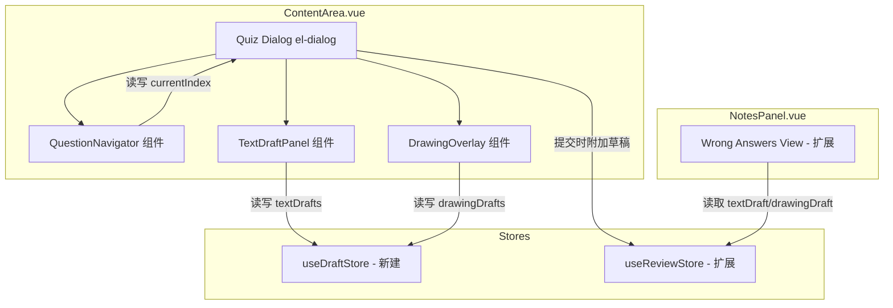
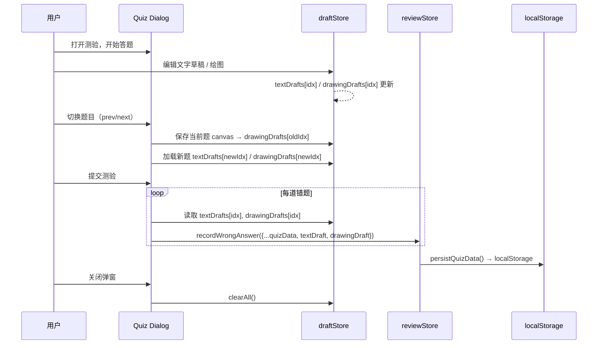

# Design Document: quiz-ui-enhancement

## Overview

本设计文档描述测验界面增强功能的技术方案。当前 Quiz Dialog（ContentArea.vue 中的 `el-dialog`，宽度 600px）一次性渲染所有题目（`v-for="(q, idx) in quizQuestions"`），缺少辅助思考工具。

本次增强包含五个核心变更：
1. 将题目列表改为单题显示 + 导航器（prev/next + 进度指示）
2. 新增右侧滑出的文字草稿面板（per-question textarea）
3. 新增半透明 Canvas 绘图覆盖层（画笔/橡皮擦/颜色/粗细/清空）
4. 提交测验时将错题的草稿数据附加到 `reviewStore.wrongAnswers`
5. 在 NotesPanel.vue 错题本中展示保存的文字/图画笔记

所有变更均为纯前端，不涉及后端 API 或数据库变更。草稿数据通过 localStorage 持久化（跟随现有 `reviewStore.persistQuizData()` 模式）。

## Architecture

### 现有架构分析

当前测验流程：
1. 用户在课程节点上点击"测验" → `handleStartQuiz()` 打开 `quizConfig` 配置弹窗
2. 确认后 `confirmQuiz()` 调用 `courseStore.generateQuiz()` 获取题目
3. 题目存入 `quizQuestions` ref，用户答案存入 `userAnswers` ref（索引数组）
4. 提交时 `submitQuiz()` 遍历题目，错题通过 `courseStore.recordWrongAnswer()` → `reviewStore.recordWrongAnswer()` 记录
5. 关闭弹窗时 watcher 清空 `quizQuestions`、`userAnswers`、`quizSubmitted`

错题查看：NotesPanel.vue 的 `activeTab === 'wrong'` 分支渲染错题列表，支持展开查看选项、解析、重测、闯关练习。

### 架构变更方案



设计决策：

1. **新建 `useDraftStore`（Pinia store）** 而非在 ContentArea.vue 中用 ref 管理草稿状态。理由：草稿数据需要在提交时被 `submitQuiz` 读取并传递给 `reviewStore`，独立 store 使数据流清晰，且避免进一步膨胀已有 3848 行的 ContentArea.vue。

2. **QuestionNavigator、TextDraftPanel、DrawingOverlay 作为独立 Vue 组件**，通过 props/emits 与 Quiz Dialog 交互。理由：ContentArea.vue 已经过大，新增 UI 逻辑应抽取为组件。

3. **DrawingOverlay 使用原生 Canvas 2D API**，不引入第三方绘图库。理由：需求仅涉及自由画笔和橡皮擦，Canvas 2D 足够，避免额外依赖。

4. **图画数据以 `canvas.toDataURL('image/png')` 格式存储**。理由：可直接作为 `` 渲染，与 localStorage 字符串存储兼容。

## Components and Interfaces

### 1. QuestionNavigator 组件

**文件**: `frontend/src/components/QuestionNavigator.vue`

```typescript
// Props
interface Props {
  currentIndex: number       // 当前题目索引（0-based）
  totalCount: number         // 总题数
  submitted: boolean         // 是否已提交
}

// Emits
interface Emits {
  (e: 'update:currentIndex', index: number): void
  (e: 'prev'): void
  (e: 'next'): void
}
```

**职责**：
- 显示"第 X 题 / 共 Y 题"进度文本
- 渲染"上一题"/"下一题"按钮
- 索引为 0 时禁用"上一题"，索引为 totalCount-1 时禁用"下一题"
- 提交后仍可导航浏览答案和解析

**布局位置**：Quiz Dialog body 顶部，题目内容上方

### 2. TextDraftPanel 组件

**文件**: `frontend/src/components/TextDraftPanel.vue`

```typescript
// Props
interface Props {
  visible: boolean           // 面板是否显示
  questionIndex: number      // 当前题目索引
}

// Emits
interface Emits {
  (e: 'update:visible', val: boolean): void
}
```

**职责**：
- 从 Quiz Dialog 右侧滑出（CSS transition，`transform: translateX`）
- 提供 `<textarea>` 编辑区域
- 从 `draftStore.textDrafts[questionIndex]` 读取/写入内容
- 输入时实时更新 store（使用 `v-model` 直接绑定 computed getter/setter 或 watch）
- 切换题目时自动加载对应草稿

**布局位置**：Quiz Dialog 内部右侧，使用 `position: absolute` 或 flex 布局滑出

### 3. DrawingOverlay 组件

**文件**: `frontend/src/components/DrawingOverlay.vue`

```typescript
// Props
interface Props {
  visible: boolean           // 覆盖层是否显示
  questionIndex: number      // 当前题目索引
}

// Emits
interface Emits {
  (e: 'update:visible', val: boolean): void
}
```

**职责**：
- 以半透明背景覆盖在 Quiz Dialog 上方（`position: absolute; inset: 0; z-index` 高于 dialog body）
- 内含 `<canvas>` 元素，尺寸匹配 dialog body
- DrawingToolbar 子区域提供：
  - 5 种颜色按钮：黑色 `#000`、红色 `#e53e3e`、蓝色 `#3182ce`、绿色 `#38a169`、橙色 `#dd6b20`
  - 3 种线条粗细：细 2px、中 4px、粗 8px
  - 画笔/橡皮擦切换（两个工具按钮，互斥选中态）
  - 清空按钮
- Canvas 绘图逻辑：
  - `mousedown` → 开始路径，记录起点
  - `mousemove`（按住时）→ `lineTo` + `stroke`（画笔）或 `clearRect`（橡皮擦，使用较大半径）
  - `mouseup` / `mouseleave` → 结束路径，保存 canvas 到 draftStore
- 切换题目时：保存当前 canvas → 清空 → 从 draftStore 加载目标题目的 dataURL（`drawImage`）
- 关闭时：保存当前 canvas 到 draftStore

### 4. useDraftStore（Pinia Store）

**文件**: `frontend/src/stores/draft.ts`

```typescript
import { defineStore } from 'pinia'

export const useDraftStore = defineStore('draft', {
  state: () => ({
    // 按题目索引存储，每次测验开始时重置
    textDrafts: {} as Record<number, string>,
    drawingDrafts: {} as Record<number, string>,  // dataURL
  }),
  actions: {
    setTextDraft(index: number, content: string) {
      this.textDrafts[index] = content
    },
    getTextDraft(index: number): string {
      return this.textDrafts[index] || ''
    },
    setDrawingDraft(index: number, dataURL: string) {
      this.drawingDrafts[index] = dataURL
    },
    getDrawingDraft(index: number): string {
      return this.drawingDrafts[index] || ''
    },
    clearAll() {
      this.textDrafts = {}
      this.drawingDrafts = {}
    },
  },
})
```

**设计决策**：不持久化到 localStorage。草稿仅在答题过程中存在，提交后错题的草稿转移到 reviewStore，正确题的草稿丢弃，关闭弹窗时清空。

### 5. useReviewStore 扩展

**变更文件**: `frontend/src/stores/review.ts`

扩展 `wrongAnswers` 数组元素类型，新增两个可选字段：

```typescript
wrongAnswers: [] as Array<{
  // ... 现有字段 ...
  textDraft?: string          // 文字草稿内容
  drawingDraft?: string       // 图画草稿 dataURL
}>
```

扩展 `recordWrongAnswer` 方法签名，接受可选的 `textDraft` 和 `drawingDraft` 参数。

### 6. ContentArea.vue 变更

**变更文件**: `frontend/src/components/ContentArea.vue`

- 新增 `currentQuestionIndex` ref（默认 0）
- Quiz Dialog body 中将 `v-for` 循环替换为 `quizQuestions[currentQuestionIndex]` 单题渲染
- 在题目上方插入 `<QuestionNavigator>`
- 在题目下方插入"文字草稿"和"图画草稿"两个按钮
- 插入 `<TextDraftPanel>` 和 `<DrawingOverlay>` 组件
- `submitQuiz()` 中错题分支：从 `draftStore` 读取对应索引的草稿，传递给 `recordWrongAnswer`
- `watch(quizVisible)` 关闭时：调用 `draftStore.clearAll()`，重置 `currentQuestionIndex = 0`

### 7. NotesPanel.vue 变更

**变更文件**: `frontend/src/components/NotesPanel.vue`

在错题展开区域（`expandedKey === wrongItemKey(item)` 分支）的操作按钮区域上方新增：
- 条件渲染"查看文字笔记"按钮（`v-if="item.textDraft"`）
- 条件渲染"查看图画笔记"按钮（`v-if="item.drawingDraft"`）
- 文字笔记展开区：只读 `<div>` 显示 `item.textDraft`，使用 `whitespace-pre-wrap`
- 图画笔记展示：内嵌 `` 或弹窗展示

## Data Models

### 草稿临时数据（draftStore，内存态，不持久化）

```typescript
// 按题目索引（0-based）存储，每次测验生命周期内有效
interface DraftState {
  textDrafts: Record<number, string>    // { 0: "我的思路...", 2: "关键公式..." }
  drawingDrafts: Record<number, string> // { 0: "data:image/png;base64,...", 1: "data:image/png;base64,..." }
}
```

### 错题记录扩展（reviewStore，持久化到 localStorage）

```typescript
// 现有 wrongAnswers 元素类型扩展
interface WrongAnswer {
  question: string
  options: string[]
  correctIndex: number
  userIndex: number
  explanation: string
  nodeId: string
  nodeName: string
  timestamp: number
  reviewCount: number
  reflection?: string
  // ---- 新增字段 ----
  textDraft?: string       // 文字草稿内容，仅错题保存
  drawingDraft?: string    // 图画草稿 dataURL（PNG），仅错题保存
}
```

### 数据流转



### 存储容量考量

- 单张 Canvas dataURL（600×400 PNG）约 50-200KB
- 一次测验最多 10 题，最坏情况全部错误 → ~2MB dataURL 数据
- localStorage 限制通常 5-10MB，需注意累积
- 设计上仅保存错题的草稿，正确题丢弃，控制增长
- 未来可考虑压缩（降低 canvas 分辨率或使用 JPEG）或定期清理旧数据

## Correctness Properties

*A property is a characteristic or behavior that should hold true across all valid executions of a system — essentially, a formal statement about what the system should do. Properties serve as the bridge between human-readable specifications and machine-verifiable correctness guarantees.*

### Property 1: Single question visibility

*For any* list of quiz questions (length ≥ 1) and any valid currentIndex (0 ≤ index < length), the Quiz Dialog should render exactly one question — the one at currentIndex — and no others should be visible in the DOM.

**Validates: Requirements 1.1**

### Property 2: Navigation progress text format

*For any* currentIndex (0-based) and totalCount (≥ 1), the QuestionNavigator should display the text "第 {currentIndex + 1} 题 / 共 {totalCount} 题".

**Validates: Requirements 1.2**

### Property 3: Navigation index bounds

*For any* valid currentIndex and totalCount, clicking "下一题" when currentIndex < totalCount - 1 should increment the index by exactly 1, clicking "上一题" when currentIndex > 0 should decrement the index by exactly 1, "上一题" should be disabled when currentIndex === 0, and "下一题" should be disabled when currentIndex === totalCount - 1.

**Validates: Requirements 1.3, 1.4, 1.5, 1.6**

### Property 4: Answer preservation across navigation

*For any* sequence of answer selections and navigation actions (including post-submission navigation), the userAnswers array should preserve all previously selected answers — navigating away from a question and back should not alter its stored answer.

**Validates: Requirements 1.7, 1.8**

### Property 5: Draft independence per question

*For any* two distinct question indices i and j, setting a text draft or drawing draft for question i should not modify the draft stored for question j. Formally: `setTextDraft(i, content)` should not change `getTextDraft(j)` when i ≠ j, and likewise for drawing drafts.

**Validates: Requirements 2.5, 2.7, 3.11**

### Property 6: Draft round-trip on navigation

*For any* question index and any draft content (text string or dataURL string), storing a draft, navigating to a different question, then navigating back should return the exact same draft content. Formally: `setTextDraft(i, s); navigate(j); navigate(i); getTextDraft(i) === s` for all valid i, j, s.

**Validates: Requirements 2.6, 3.12**

### Property 7: Canvas clear produces blank state

*For any* canvas state (any combination of drawn strokes), clicking "清空" should result in a canvas whose exported dataURL is identical to a freshly created blank canvas of the same dimensions.

**Validates: Requirements 3.10**

### Property 8: Draft attachment follows correctness

*For any* quiz submission with a mix of correct and incorrect answers, each wrong answer record in reviewStore should contain the textDraft and drawingDraft from draftStore for that question's index, and no correct answer should produce a record with draft data.

**Validates: Requirements 4.1, 4.2**

### Property 9: Draft persistence round-trip via localStorage

*For any* wrong answer record containing textDraft and/or drawingDraft, calling `persistQuizData()` followed by `restoreQuizData()` should produce wrongAnswers entries with identical textDraft and drawingDraft values.

**Validates: Requirements 4.4**

### Property 10: Draft cleanup on dialog close

*For any* state of draftStore (any number of text and drawing drafts stored), closing the Quiz Dialog should result in `draftStore.textDrafts` and `draftStore.drawingDrafts` both being empty objects.

**Validates: Requirements 4.5**

### Property 11: Draft note button visibility matches data presence

*For any* wrong answer record, the "查看文字笔记" button should be visible if and only if `textDraft` is a non-empty string, and the "查看图画笔记" button should be visible if and only if `drawingDraft` is a non-empty string.

**Validates: Requirements 5.1, 5.2, 5.5, 5.6**

## Error Handling

### Canvas 相关错误

| 场景 | 处理方式 |
|------|----------|
| `canvas.toDataURL()` 失败（安全限制等） | catch 异常，该题 drawingDraft 设为空字符串，不阻塞提交流程 |
| `drawImage()` 加载 dataURL 失败 | catch 异常，显示空白画布，console.warn 记录 |
| Canvas 上下文获取失败（`getContext('2d')` 返回 null） | 禁用绘图功能，隐藏 DrawingOverlay，显示 ElMessage.warning 提示 |

### localStorage 容量

| 场景 | 处理方式 |
|------|----------|
| `persistQuizData()` 写入 localStorage 抛出 QuotaExceededError | catch 异常，ElMessage.warning 提示"存储空间不足，草稿可能未完整保存"，错题记录本身仍保存（草稿字段置空） |
| 单张 dataURL 过大（>500KB） | 在保存前降低 canvas 导出质量：`toDataURL('image/jpeg', 0.6)` 作为 fallback |

### 导航边界

| 场景 | 处理方式 |
|------|----------|
| currentIndex 越界（理论上不应发生） | `Math.max(0, Math.min(index, totalCount - 1))` 钳位处理 |
| quizQuestions 为空数组时打开导航 | 不渲染 QuestionNavigator，保持现有"暂无测验题目"提示 |

### 草稿数据完整性

| 场景 | 处理方式 |
|------|----------|
| 从 localStorage 恢复的 wrongAnswer 缺少 textDraft/drawingDraft 字段 | 字段为 optional，缺失时 UI 不显示对应按钮（Property 11 保证） |
| drawingDraft 不是有效的 dataURL | `` 的 `@error` 事件处理，显示"图画加载失败"占位文本 |

## Testing Strategy

### 测试框架

- **单元测试 / 属性测试**: Vitest（已配置，`frontend/src/tests/`）
- **属性测试库**: [fast-check](https://github.com/dubzzz/fast-check)（需新增依赖 `npm install -D fast-check`）
- **DOM 环境**: jsdom（已配置）

### 属性测试（Property-Based Tests）

每个属性测试至少运行 100 次迭代。每个测试用注释标注对应的设计属性。

测试文件：`frontend/src/tests/quiz-ui-enhancement.property.test.ts`

标注格式示例：
```typescript
// Feature: quiz-ui-enhancement, Property 1: Single question visibility
// Feature: quiz-ui-enhancement, Property 5: Draft independence per question
```

属性测试覆盖范围：
- Property 1: 生成随机题目数组和索引，验证单题显示
- Property 2: 生成随机 index/total 对，验证进度文本格式
- Property 3: 生成随机导航序列，验证索引变化和边界禁用
- Property 4: 生成随机答案选择和导航序列，验证答案保持
- Property 5: 生成随机 (index, content) 对，验证草稿独立性
- Property 6: 生成随机草稿内容和导航序列，验证草稿往返
- Property 7: 生成随机绘图操作序列，验证清空后为空白
- Property 8: 生成随机测验结果（正确/错误混合），验证草稿附加逻辑
- Property 9: 生成随机 wrongAnswer 含草稿数据，验证 localStorage 往返
- Property 10: 生成随机草稿状态，验证关闭后清空
- Property 11: 生成随机 wrongAnswer（有/无草稿），验证按钮可见性

### 单元测试（Unit Tests）

测试文件：`frontend/src/tests/quiz-ui-enhancement.unit.test.ts`

覆盖 example 和 edge-case 类型的验收标准：
- 文字草稿按钮存在性（Req 2.1）
- 文字草稿面板 toggle 开关（Req 2.2, 2.3）
- textarea 元素存在性（Req 2.4）
- 图画草稿按钮存在性（Req 3.1）
- DrawingOverlay toggle 和半透明背景（Req 3.2）
- Canvas 元素存在性（Req 3.3）
- 5 种颜色按钮（Req 3.4）
- 3 种粗细选项（Req 3.5）
- 画笔/橡皮擦两种工具（Req 3.6）
- 画笔绘制和橡皮擦擦除的基本 canvas 操作（Req 3.7, 3.8）
- 清空按钮存在性（Req 3.9）
- 关闭时保存画布（Req 3.13）
- wrongAnswers 类型扩展验证（Req 4.3）
- 文字笔记展开显示只读内容（Req 5.3）
- 图画笔记渲染为 img 元素（Req 5.4）
