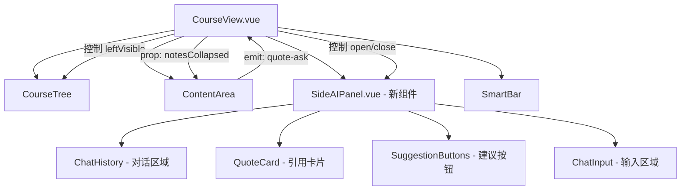
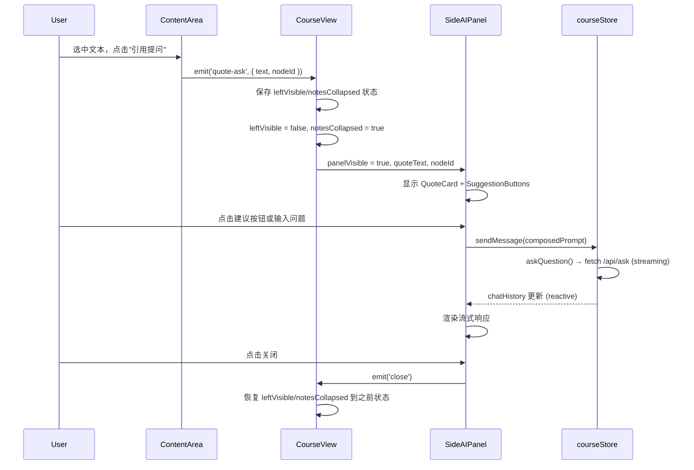

# Design Document: Side AI Panel (右侧滑出式 AI 面板)

## Overview

将当前的全屏浮动 AI 助手（`FloatingAIAssistant.vue`）替换为右侧滑出式 AI 面板。用户在 `ContentArea` 中选中文本并点击"引用提问"后，面板从右侧滑入，展示引用卡片、智能建议按钮和对话区域。面板打开时自动收起左侧目录树和右侧笔记栏以最大化内容空间，关闭后恢复原始布局。

### 设计决策与理由

1. **复用现有聊天基础设施**：`courseStore` 中已有完整的 `chatHistory`、`sendMessage`、`askQuestion`、`pendingChatInput` 等机制，以及多对话管理（`conversations`、`switchConversation` 等）。新面板将直接复用这些，不创建平行实现。`chat.ts` store 当前未被使用（死代码），不会基于它构建。

2. **面板状态提升到 CourseView**：Side AI Panel 的可见性需要与 `leftVisible`（CourseTree）和 `isNotesCollapsed`（ContentArea 内部）协调。因此面板的 open/close 状态将由 `CourseView` 管理，通过 props/events 与子组件通信。

3. **替换而非共存**：`FloatingAIAssistant.vue` 将被移除，其多对话管理 UI（对话列表侧边栏）不迁移到新面板。新面板聚焦于"引用提问"的单次对话流，简化交互。

4. **`isNotesCollapsed` 需要提升**：当前 `isNotesCollapsed` 是 `ContentArea.vue` 内部的 `ref`，但 Side AI Panel 打开时需要从 `CourseView` 层面控制它。设计将通过 `v-model` 或 prop + emit 模式将此状态提升。

## Architecture

### 布局变更

```
打开前:
┌──────────┬─────────────────────────┬──────────┐
│ CourseTree│     ContentArea         │ Notes    │
│ (left)   │     (flex-1)            │ Column   │
│          │                         │ (fixed)  │
└──────────┴─────────────────────────┴──────────┘

打开后:
┌─────────────────────────┬───────────────────┐
│     ContentArea         │  Side AI Panel    │
│     (flex-1)            │  (~1/3 viewport)  │
│                         │                   │
└─────────────────────────┴───────────────────┘
```

### 组件层级



### 数据流




## Components and Interfaces

### 1. SideAIPanel.vue（新组件）

主面板组件，放置在 `CourseView.vue` 的 `main-content-wrapper` 内，位于 `ContentArea` 右侧。

**Props:**
```typescript
interface SideAIPanelProps {
  visible: boolean              // 面板是否可见
  quoteText: string             // 引用的文本内容
  quoteNodeId: string           // 引用文本所属的课程节点 ID
}
```

**Emits:**
```typescript
interface SideAIPanelEmits {
  (e: 'close'): void            // 用户关闭面板
  (e: 'update:visible', value: boolean): void
}
```

**内部结构:**
```
┌─────────────────────────────┐
│ 面板头部                      │
│ [AI 助手标题]     [关闭按钮]   │
├─────────────────────────────┤
│                             │
│  对话历史区域 (scrollable)    │
│  - 复用 courseStore.chatHistory
│  - Markdown 渲染 (markdown-it + KaTeX)
│  - 流式响应显示              │
│                             │
├─────────────────────────────┤
│ ┃ 引用文本内容...        ↩  │  ← QuoteCard
│ [解释一下→] [详细展开→] [深入研究→] │  ← SuggestionButtons
│ [输入框...              发送] │  ← ChatInput
└─────────────────────────────┘
```

**关键行为:**
- 面板宽度：桌面端 `w-1/3`（min 320px, max 480px），移动端 `w-full` overlay
- 使用 `courseStore.chatHistory` 渲染对话（与现有 ChatPanel 共享数据源）
- 使用 `courseStore.sendMessage()` 发送消息
- 使用 `courseStore.chatLoading` 控制加载状态和取消按钮
- Markdown 渲染复用现有的 `MarkdownRenderer` 组件或 `markdown-it` 管道

### 2. CourseView.vue 变更

**新增状态:**
```typescript
// Side AI Panel 状态
const sideAIPanelVisible = ref(false)
const sideAIQuoteText = ref('')
const sideAIQuoteNodeId = ref('')

// 布局恢复用：记录面板打开前的状态
const layoutBeforePanel = ref<{
  leftVisible: boolean
  notesCollapsed: boolean
} | null>(null)
```

**新增方法:**
```typescript
// 打开面板（由 ContentArea 的 quote-ask 事件触发）
function openSideAIPanel(payload: { text: string; nodeId: string }) {
  // 保存当前布局状态
  layoutBeforePanel.value = {
    leftVisible: leftVisible.value,
    notesCollapsed: notesCollapsed.value  // 从 ContentArea 获取
  }
  // 收起侧边栏
  leftVisible.value = false
  notesCollapsed.value = true
  // 打开面板
  sideAIQuoteText.value = payload.text
  sideAIQuoteNodeId.value = payload.nodeId
  sideAIPanelVisible.value = true
}

// 关闭面板
function closeSideAIPanel() {
  sideAIPanelVisible.value = false
  // 恢复布局
  if (layoutBeforePanel.value) {
    leftVisible.value = layoutBeforePanel.value.leftVisible
    notesCollapsed.value = layoutBeforePanel.value.notesCollapsed
    layoutBeforePanel.value = null
  }
}
```

**模板变更:**
```html
<!-- 在 ContentArea 之后添加 -->
<Transition name="slide-in-right">
  <SideAIPanel
    v-if="sideAIPanelVisible"
    :visible="sideAIPanelVisible"
    :quote-text="sideAIQuoteText"
    :quote-node-id="sideAIQuoteNodeId"
    @close="closeSideAIPanel"
  />
</Transition>
```

**Escape 键处理:**
在现有 `handleKeydown` 中添加：当 `sideAIPanelVisible` 为 true 时，Escape 关闭面板。

### 3. ContentArea.vue 变更

**`isNotesCollapsed` 提升:**
将 `isNotesCollapsed` 从内部 `ref` 改为 `v-model` prop：
```typescript
// 之前：const isNotesCollapsed = ref(false)
// 之后：
const props = defineProps<{
  notesCollapsed: boolean
}>()
const emit = defineEmits<{
  (e: 'update:notesCollapsed', value: boolean): void
  (e: 'quoteAsk', payload: { text: string; nodeId: string }): void
}>()
```

**`handleAsk` 变更:**
不再调用 `courseStore.setPendingChatInput()`，改为 emit 事件：
```typescript
const handleAsk = () => {
  if (!selectionMenu.value.text) return
  const text = selectionMenu.value.text
  let nodeId = ''
  if (selectionMenu.value.range) {
    const nodeEl = selectionMenu.value.range.startContainer.parentElement?.closest('[id^="node-"]')
    if (nodeEl) nodeId = nodeEl.id.replace('node-', '')
  }
  emit('quoteAsk', { text, nodeId })
  selectionMenu.value.visible = false
}
```

### 4. FloatingAIAssistant.vue 移除

该组件将被完全移除。其在 `App.vue` 中的引用也将删除。`courseStore.showFloatingAI` 状态可以清理。

### 5. 响应式布局适配

```typescript
// SideAIPanel 内部
const isOverlayMode = computed(() => window.innerWidth < 1024)
```

- `≥1024px`：面板作为 flex 子元素，占 `main-content-wrapper` 的 ~1/3 宽度
- `<1024px`：面板作为 `fixed` overlay，`inset-y-0 right-0 w-full`，带半透明背景遮罩

## Data Models

### 面板状态（CourseView 层）

```typescript
interface SideAIPanelState {
  visible: boolean           // 面板是否打开
  quoteText: string          // 当前引用文本
  quoteNodeId: string        // 引用文本所属节点 ID
}

interface LayoutSnapshot {
  leftVisible: boolean       // 面板打开前左侧栏状态
  notesCollapsed: boolean    // 面板打开前笔记栏状态
}
```

### 面板内部状态（SideAIPanel 组件内）

```typescript
interface PanelInternalState {
  showQuoteCard: boolean       // 引用卡片是否显示（用户可手动关闭）
  showSuggestions: boolean     // 建议按钮是否显示
  inputMessage: string         // 输入框内容
}
```

### 复用的现有数据模型

不引入新的数据模型。以下现有模型直接复用：

- `ChatMessage`（`stores/types.ts`）：对话消息
- `AIContent`（`stores/types.ts`）：AI 响应内容结构
- `ChatConversation`（`stores/types.ts`）：对话会话（如需多对话支持）

### 后端 API

不需要新的后端端点。复用现有 `/api/ask` 端点：

```typescript
// 请求体（与现有 askQuestion 一致）
{
  node_id: string
  node_name: string
  node_content: string      // 包含课程大纲结构 + 当前节点内容
  question: string           // 用户问题（含引用文本前缀）
  history: Array<{ role: 'user' | 'assistant'; content: string }>
  selection: string
  user_notes: string
  user_persona: string
  session_metrics: object
  enable_long_term_memory: boolean
}
```

响应为 SSE 流式文本，由 `courseStore.askQuestion()` 内部的 `fetch` + `ReadableStream` 处理。


## Correctness Properties

*A property is a characteristic or behavior that should hold true across all valid executions of a system — essentially, a formal statement about what the system should do. Properties serve as the bridge between human-readable specifications and machine-verifiable correctness guarantees.*

### Property 1: Quote-ask trigger correctly initializes panel state

*For any* non-empty selected text string and any valid node ID, triggering the quote-ask action should result in the panel becoming visible (`visible === true`), the quote text matching the selected text exactly, and the quote node ID matching the detected node ID.

**Validates: Requirements 1.1, 7.1**

### Property 2: Layout state round-trip on panel open/close

*For any* initial layout state (where `leftVisible` is true or false, and `notesCollapsed` is true or false), opening the Side AI Panel should set `leftVisible = false` and `notesCollapsed = true`, and subsequently closing the panel should restore both `leftVisible` and `notesCollapsed` to their exact values before the panel was opened.

**Validates: Requirements 1.2, 6.2**

### Property 3: Quote dismissal hides card and suggestions without closing panel

*For any* active quote text, clicking the dismiss button on the Quote Card should result in `showQuoteCard === false` and `showSuggestions === false`, while the panel remains visible (`visible === true`).

**Validates: Requirements 2.4**

### Property 4: Suggestion button composes correct prompt

*For any* quote text and any of the three suggestion types ("解释一下", "详细展开", "深入研究"), clicking the corresponding suggestion button should produce a prompt string that contains both the original quote text and the suggestion action keyword, and this prompt should be sent via `courseStore.sendMessage()`.

**Validates: Requirements 3.2**

### Property 5: Suggestion buttons hidden after click

*For any* suggestion button click (regardless of which of the three buttons), `showSuggestions` should become `false` for the current quote context.

**Validates: Requirements 3.3**

### Property 6: Enter key sends non-empty input

*For any* non-empty, non-whitespace-only input string, pressing Enter (without Shift) should trigger `sendMessage` with that input and clear the input field afterward.

**Validates: Requirements 5.2**

### Property 7: Send button disabled state

*For any* input state, the send button should be disabled if and only if the input is empty/whitespace-only OR `chatLoading` is true. Equivalently: the send button is enabled only when the input is non-empty AND `chatLoading` is false.

**Validates: Requirements 5.4, 5.5**

### Property 8: Re-quote replaces current quote and resets suggestions

*For any* pair of quote texts (text₁, text₂), if the panel is already open with text₁ displayed in the Quote Card, triggering a new quote-ask with text₂ should result in the Quote Card displaying text₂ (not text₁) and `showSuggestions` being reset to `true`.

**Validates: Requirements 7.2**

### Property 9: Conversation history accumulates messages

*For any* sequence of N user messages sent through the panel, `courseStore.chatHistory` should contain at least N user-type messages (plus corresponding AI responses as they arrive). The history should not be cleared between messages within the same session unless the user explicitly clears it.

**Validates: Requirements 7.3**

### Property 10: Panel display mode determined by viewport width

*For any* viewport width value, the panel's display mode should be "overlay" (full-width) if and only if the width is less than 1024px, and "side-panel" (~1/3 width) if and only if the width is 1024px or greater. This should hold both on initial render and after resize events.

**Validates: Requirements 8.1, 8.2, 8.3**

## Error Handling

### 网络错误 / AI 响应失败

- 当 `courseStore.askQuestion()` 的 `fetch` 调用失败时（网络错误、HTTP 非 200），现有逻辑已在 `chatHistory` 中追加错误消息。Side AI Panel 通过响应式绑定自动展示错误。
- 流式响应中断时，`chatAbortController` 的 abort 信号会终止读取，`chatLoading` 重置为 false，UI 恢复可交互状态。

### 空引用文本

- 如果 `selectionMenu.value.text` 为空，`handleAsk` 直接 return，不触发面板打开。这是现有行为，保持不变。

### 节点检测失败

- 如果无法从 DOM 中检测到 `[id^="node-"]` 元素（例如选中了非节点区域的文本），`quoteNodeId` 将为空字符串。`courseStore.askQuestion()` 会 fallback 到 `currentNode` 或 `nodes[0]`，这是现有的容错逻辑。

### 面板打开时课程切换

- 如果用户在面板打开时通过路由切换课程，`courseStore.currentNode` 会变化。面板应在 `watch` 中检测课程切换并自动关闭，避免上下文不一致。

### 响应式断点切换

- 面板在 overlay 和 side-panel 模式之间切换时，使用 CSS transition 平滑过渡。overlay 模式下的背景遮罩点击应关闭面板。

## Testing Strategy

### 测试框架

- **单元测试**: Vitest + jsdom（项目已配置）
- **属性测试**: [fast-check](https://github.com/dubzzz/fast-check)（JavaScript/TypeScript 属性测试库，与 Vitest 集成）

### 属性测试（Property-Based Tests）

每个属性测试至少运行 100 次迭代。每个测试用注释标注对应的设计属性。

```typescript
// Feature: side-ai-panel, Property 1: Quote-ask trigger correctly initializes panel state
// Feature: side-ai-panel, Property 2: Layout state round-trip on panel open/close
// Feature: side-ai-panel, Property 3: Quote dismissal hides card and suggestions without closing panel
// ... etc.
```

**测试重点:**

1. **Property 1 (Quote-ask trigger)**: 生成随机非空字符串和随机 node ID，调用 `openSideAIPanel({ text, nodeId })`，断言面板状态。
2. **Property 2 (Layout round-trip)**: 生成随机布尔值对 `(leftVisible, notesCollapsed)`，执行 open → close，断言恢复。
3. **Property 3 (Quote dismissal)**: 生成随机引用文本，打开面板，点击 dismiss，断言 quote/suggestions 隐藏但面板仍开。
4. **Property 4 (Suggestion prompt)**: 生成随机引用文本 × 3 种建议类型，断言组合后的 prompt 包含原文和关键词。
5. **Property 5 (Suggestions hidden after click)**: 对 3 种按钮类型，断言点击后 `showSuggestions === false`。
6. **Property 6 (Enter sends)**: 生成随机非空非纯空白字符串，模拟 Enter，断言 sendMessage 被调用。
7. **Property 7 (Send button disabled)**: 生成随机 `(inputText, chatLoading)` 组合，断言 disabled 状态正确。
8. **Property 8 (Re-quote replaces)**: 生成两个随机字符串，先 open(text1)，再 open(text2)，断言 quoteText === text2 且 showSuggestions === true。
9. **Property 9 (History accumulates)**: 生成随机长度的消息序列，逐条发送，断言 chatHistory 长度单调递增。
10. **Property 10 (Viewport mode)**: 生成随机 viewport 宽度（500-2000），断言 isOverlayMode === (width < 1024)。

### 单元测试（Unit Tests）

单元测试聚焦于具体示例和边界情况，不重复属性测试已覆盖的通用逻辑：

1. **Escape 键关闭面板**: 面板打开时按 Escape，断言面板关闭（Requirements 6.4）
2. **Shift+Enter 不发送**: 输入框中按 Shift+Enter，断言不触发 sendMessage，输入框内容包含换行（Requirements 5.3）
3. **Quote Card 存在时显示建议按钮**: 当 quoteText 非空时，3 个建议按钮可见（Requirements 3.1）
4. **Loading 状态显示取消按钮**: 当 chatLoading 为 true 时，取消按钮可见（Requirements 4.5）
5. **关闭按钮存在**: 面板头部包含关闭按钮（Requirements 6.1）
6. **课程切换时面板自动关闭**: 模拟路由变化，断言面板关闭

### 测试文件位置

```
frontend/src/tests/side-ai-panel.test.ts
```

