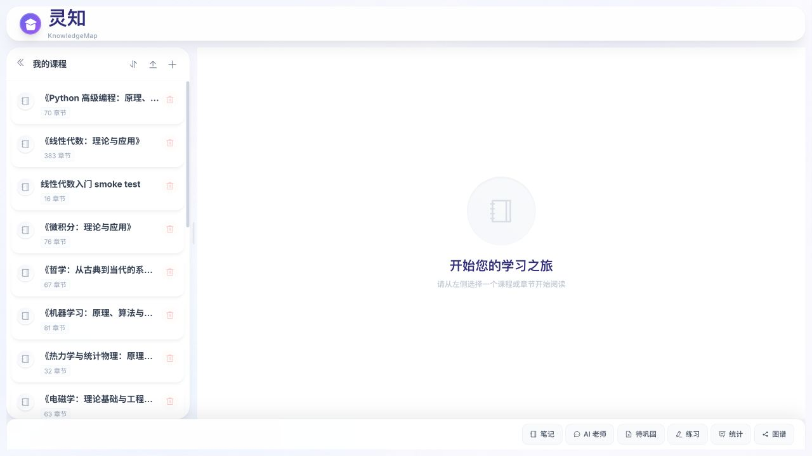
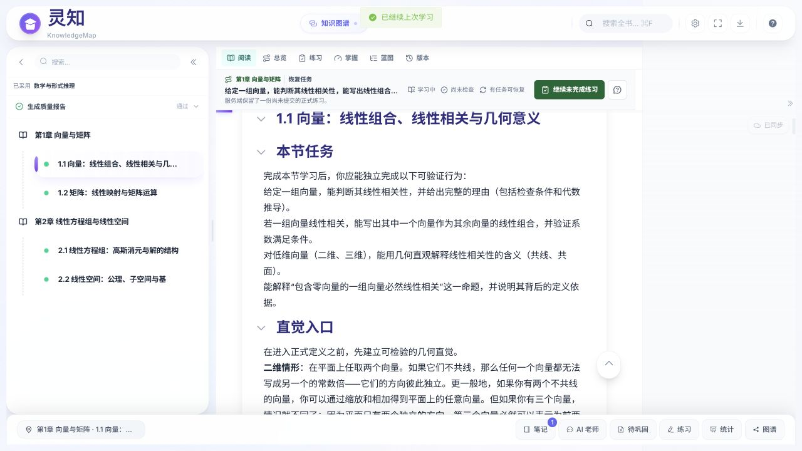
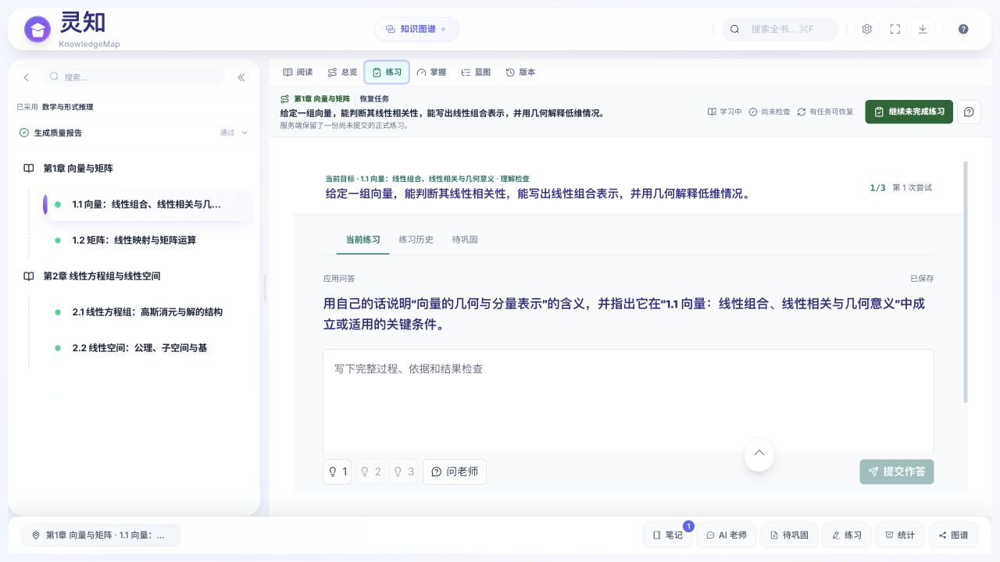
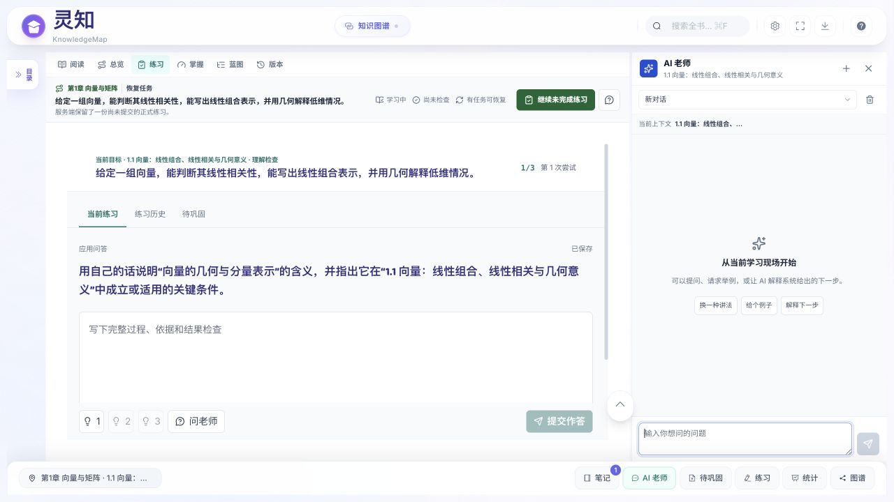
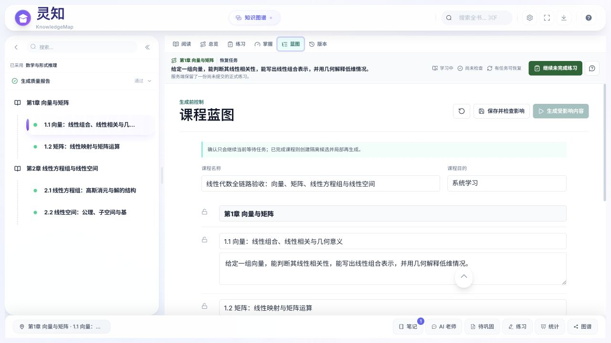
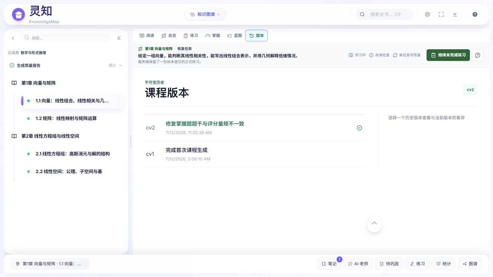

# 产品蓝图与当前实现差距审计

- 审计日期：2026-07-12
- 产品真源：`docs/product-blueprint.md`，提交 `10484c7`
- 代码基线：提交 `e2fa1ca` 及其之前的八阶段课程使用实现
- 验证对象：当前源码、当前路由、干净本地运行实例、标准课程与旧课程页面

## 1. 结论

当前产品不是“后端已经完成，只差前端美化”，也不是“所有新增功能都不可用”。更准确的判断是：

> 八阶段开发产出了一批可以单独运行的后端领域零件，但没有完成以 `CourseDocument / CourseBlock` 为核心的新内核接替；前端又把这些零件直接叠加到旧 Markdown 阅读器上，因此形成了新旧真源并行、产品空间混排、局部功能可运行但整体不可用的状态。

目前存在三个层次：

1. **可保留的真实能力**：资料解析、课程生成策略、正式练习、作答、诊断补救、学习记录、快照、LearningRuntime、AI 动作协议等已有测试和部分真实页面证据。
2. **尚未完成的核心架构**：蓝图定义的 `CourseDocument / CourseBlock`、统一课程写服务、课程操作日志、块墓碑和兼容适配器并不存在。
3. **仍在生产路径中的旧系统**：完整 Markdown、用户可见课程版本、旧 annotation、旧 review、旧 learning path / stats / mastery、Learning OS、本地画像和大量路由直接写课程文件仍然活跃。

因此当前不能继续把前端收口当成纯 UI 任务。正确顺序应是先建立课程内核和兼容边界，再迁移一条完整学习链，最后退役旧入口。

## 2. 运行与验证基线

### 2.1 旧运行实例不能代表当前源码

原本监听 `8000` 的后端是 2026-07-08 启动的旧进程：

- 最新源码已经注册的 `/api/courses/{id}/learning-runtime` 和课程预检在该实例中返回 404。
- 写 `learning_events.json` 和课程文件时出现 `Operation not permitted`。
- 用户可见版本接口返回 500。
- `/openapi.json` 返回 500。

这部分属于开发运行环境失真，不能直接算成当前源码缺陷，但它说明项目缺少可重复、可识别、不会与其他仓库端口冲突的标准启动方式。

### 2.2 干净当前源码实例

使用当前源码在 `8001` 启动后端、在 `5180` 启动前端后：

- `/openapi.json` 正常，当前共 106 条 API 路径。
- LearningRuntime、LearningRecords、Practice、Versions 和课程预检可以读取。
- 标准课程能恢复正式练习，AI 右栏能打开并读取当前目标。
- 当前页面操作未产生浏览器 error / warning。

### 2.3 自动化验证

- 后端：233 项测试通过，但有 470 条依赖弃用警告。
- 前端：156 项测试通过。
- 前端生产构建通过。
- 构建后的 `CourseView` 主包约 1.25 MB，`element-plus` 约 918 KB；当前没有覆盖完整课程页的端到端测试。

这些测试证明局部契约存在，不证明蓝图里的统一产品架构已经成立。

## 3. 蓝图与实现对应矩阵

| 蓝图要求 | 当前实现 | 状态 | 判断 |
| --- | --- | --- | --- |
| 一个 `CourseDocument` 是课程结构真源 | 没有 `CourseDocument` 实体；课程仍保存为含 `nodes` 的 JSON | 未实现 | 课程身份、章节、正文和版本仍沿用旧结构 |
| 异构 `CourseBlock` 是课程本体 | 只有由 Markdown 投影出的 `content_blocks`；代码明确称其为兼容层 | 反向实现 | 当前 `node_content` Markdown 仍是真源 |
| `kind` 与 `role` 分离 | 当前块只有 `type/title/content/order` 等字段 | 未实现 | 无法表达“视频形式的概念”“代码形式的例子”等组合 |
| 课程生成、手工编辑、AI 修改共用课程领域内核 | `nodes.py` 等路由直接修改课程字典并调用 `save_course_compat` | 未实现 | 多条写路径绕过统一命令、修订和影响计算 |
| 用户不理解版本，只看到当前课程 | 学习页直接展示“蓝图”和“版本”，后端有版本比较、恢复和候选系统 | 明确冲突 | 新蓝图已经推翻旧版本产品心智，代码尚未接替 |
| 课程工作室独立于学习工作区 | 前端只有一个 `CourseView`，蓝图编辑和版本管理是学习页顶层标签 | 未实现 | 学习者和作者任务混在同一页面 |
| LearningRuntime 是唯一协调投影 | 新 Runtime 已存在并能驱动标准练习；旧 Learning OS、learning path、stats、mastery 仍在运行 | 部分实现 | 新协调层没有接管全部旧消费者 |
| 学习事实一件一个真源 | Record、Attempt、Event、Snapshot 已存在；旧 annotation/review、本地统计与本地画像仍保存状态 | 部分实现 | 新旧事实和派生状态并存 |
| AI 助手一个入口，多场景能力 | 学习页已有统一 AI Teacher 会话和动作协议 | 部分实现 | 学习现场成立，但课程工作室 AI 与课程修改命令尚未统一到新内核 |
| 旧链只作适配，不再拥有规则 | 旧路由和旧 Store 仍直接读取、计算和写入 | 未实现 | 兼容层仍是活跃业务层 |
| 块移动、删除、拆分后历史可解释 | 只有块修订和锚点解析；无 CourseOperationLog、块墓碑和拆分合并映射 | 未实现 | 无法满足蓝图的可恢复编辑要求 |
| AI、媒体、评分失败时学习仍可继续 | AI 降级和确定性练习边界已有实现 | 较好 | 这是八阶段开发中可保留的成果 |

## 4. 后端问题

### 4.1 根问题不是文件多，而是课程真源没有换代

当前 `content_blocks.py` 会从 `node_content` 解析块，并在块修改后重新拼回 Markdown。`course_service.py` 的块重写提示词明确写着：

```text
content_blocks 只是兼容层，新课程正文仍以完整 Markdown 为准
```

这与新蓝图“CourseBlock 是本体，Markdown 只是块内容和导入导出格式”完全相反。只要这个方向不改，图片、视频、正式题目、复习检查点和动态补救都只能继续作为外围功能，无法成为课程流中的正式块。

### 4.2 写课程的旁路过多

当前至少存在以下课程写路径：

- 节点新增、子节点新增、整节重写、块重生成、节点删除和节点更新。
- Markdown 导入。
- 课程版本恢复和再生成。
- 学习资产确认后创建版本并回写课程。
- 生成 TaskManager 在任务阶段持续更新课程。

这些路径主要通过共享字典和 `save_course_compat` 写整个课程文件，没有统一的课程命令、`course_revision`、块级乐观并发、操作日志和影响范围。结果是“每个功能自己能写”，但无法保证它们写的是同一个模型。

### 4.3 旧领域仍是正式路由

生产应用仍注册：

- 旧 annotation 路由 8 条。
- 旧 review 路由 5 条。
- 旧 learning path / mastery / stats 路由 3 条。
- Learning OS 路由 2 条。
- 独立 profile 生成路由。

前端 `learning.ts` 仍把学习时间、阅读位置和完成节点保存在 `localStorage`，同时请求旧 learning path / mastery / stats。`profile.ts` 仍把 AI 画像、评论、自评和摘要保存在本地并调用独立画像生成接口。这些不是只读兼容适配器，而是仍拥有状态和规则的第二条业务链。

### 4.4 身份边界违反新蓝图

`resolve_user_id()` 在缺少身份时回退到 `default_user`。前端只有设置 `VITE_LEARNER_USER_ID` 才会发送 `X-User-Id`。这与蓝图“身份不确定时不得写正式画像或串用数据”直接冲突。

### 4.5 模块体积反映职责没有收束

- `task_manager.py`：1956 行。
- `course_service.py`：1612 行。
- `learning_continuation.py`：870 行。
- 后端生产 Python 模块约 90 个，路由文件 25 个。

文件数量不是问题本身；问题是课程生成、调度、版本、内容、资产和持久化仍通过共享字典相互穿透。继续在这些文件上增加 CourseBlock 功能，会让新内核再次变成旧系统上的一层包装。

## 5. 前端问题

### 5.1 只有一个产品空间

前端路由只有：

```text
/
/course/:courseId
```

课程库、学习工作区和课程工作室没有独立路由或独立页面骨架。`CourseView.vue` 同时承担课程库、学习、作者操作、弹窗和响应式协调。

### 5.2 新功能通过“加标签”进入旧阅读器

当前课程页同时出现：

- 左侧旧课程树，以及跳过、自定义指令、重新生成、质量报告。
- 顶部阅读、总览、练习、掌握、蓝图、版本六个平级标签。
- 中间旧 Markdown 连续阅读器。
- 右侧固定笔记栏和按像素同步的笔记卡。
- 可开关 AI 侧板。
- 底部笔记、AI、待巩固、练习、统计、图谱六按钮 SmartBar。

这不是蓝图里的课程流，而是多个后端模块各自获得一个入口后的功能集合。

### 5.3 页面虽然能打开，但整体任务不成立

标准课程的正式练习确实可用：可以恢复一份未提交 Attempt，显示 1/3 题、草稿状态和 AI 求助。这说明 PracticeAttempt 与 LearningRuntime 值得保留。

但同一页面仍暴露蓝图编辑、`cv1/cv2` 版本历史、课程生成按钮和学习工具栏；练习没有嵌回课程块所在位置。用户必须理解系统模块，而不是沿课程顺序学习。

### 5.4 巨型组件把新旧状态锁在一起

- `ContentArea.vue`：3584 行。
- `CourseTree.vue`：1449 行。
- `CourseView.vue`：1030 行。
- `LearningStats.vue`：842 行。

其中 `ContentArea` 同时承担虚拟滚动、Markdown 渲染、搜索、高亮、笔记、选区格式、导出、设置、阅读快照和练习跳转。任何新布局都需要同时改动多个不相关状态，因此“重画一遍页面”很容易再次失败。

### 5.5 自动化覆盖没有保护产品主链

156 项前端测试主要覆盖 Store 和工具函数；没有覆盖：

- 从课程库进入课程工作区。
- 阅读到行内正式练习。
- 笔记与 AI 上下文同步。
- 课程工作室修改后回到学习。
- 旧课程通过适配器进入同一主链。

因此构建和单元测试全绿，仍然可以同时存在重复入口、错误空间归属和不可理解的用户流程。

## 6. 页面证据

### 步骤 1：课程外壳，状态不健康



课程列表被放在学习页左栏，底部六按钮在未选择课程时依然出现。课程库没有成为独立空间。

### 步骤 2：旧阅读器与新增模块并行，状态不健康



正文能读、连续性能恢复，但旧目录生成控制、顶部六模式、固定笔记栏和 SmartBar 同时存在。

### 步骤 3：正式练习，局部健康



标准课程可以恢复正式 Attempt，题目、草稿、提示和 AI 求助入口存在。这是可以保留的真实能力，但它仍是独立顶层页面，不是课程流中的 `practice_ref`。

### 步骤 4：AI 助手，局部健康但布局协同不足



AI 能识别当前目标并与练习同屏，但打开后会隐藏左侧目录；底部仍保留重复 AI 入口，整体宽度和职责没有按新蓝图收口。

### 步骤 5：蓝图混入学习页，状态不健康



作者操作与学生学习共享同一导航和左目录，违反课程工作室独立空间的边界。

### 步骤 6：用户可见版本，状态与新蓝图直接冲突



页面要求用户理解 `cv1 / cv2` 和恢复版本，而新蓝图已经明确：用户只感知当前课程与可撤销操作。

## 7. 现有功能的处理方式

### 7.1 保留并迁入新内核

- MaterialAsset、解析、EvidenceUnit、资料用途和覆盖报告。
- 学科教学模式、难度契约、学习目标和章节推进条件。
- 现有 content block 的稳定 ID、指纹和修订算法。
- 正式 PracticeTask、PracticeAttempt、评分、诊断、补救和独立复验。
- LearningRecord、LearningEvent、LearningSnapshot 和 LearningRuntime。
- AIContextPackage、Proposal、Receipt、拒绝冷却和补偿撤销。
- 知识图谱、代码执行、Mermaid 与媒体渲染能力。

### 7.2 改造成兼容适配器

- `node_content` 与旧 Markdown 课程。
- 旧 annotations。
- 旧 quiz、review、learning path、learning stats 和 mastery 响应。
- 旧课程版本文件及历史作答所引用的版本号。

适配器只能读旧格式、调用新领域服务和返回旧响应；不能继续拥有保存逻辑、状态机或 AI prompt。

### 7.3 完成迁移后退出生产主链

- 学习页中的蓝图和版本标签。
- CourseTree 中的跳过、自定义生成和重新生成按钮。
- 固定笔记栏、像素同步和六按钮 SmartBar。
- `learning.ts` 的本地完成度、学习路径和掌握真源。
- `profile.ts` 的本地 AI 画像真源。
- 旧 annotation/review/Learning OS 的直接业务消费者。
- 路由直接修改整份课程 JSON 的写路径。

## 8. 收束顺序

这次不能再拆成八个彼此独立、最后再横向整合的功能阶段。应使用一个架构主线、五个连续门禁。

### 门禁 0：建立可信运行基线

- 统一启动脚本、端口、健康检查、当前 Git 提交和数据目录。
- 启动时输出代码版本、schema 版本和已注册核心路由。
- 增加课程库 -> 阅读 -> Runtime -> 正式练习 -> AI 的只读 smoke test。

### 门禁 1：建立 CourseDocument / CourseBlock 内核

- 定义 CourseDocument、Section/Group、CourseBlock、kind/role、引用和内部修订。
- 旧 Markdown 只通过确定性适配器读取。
- 先迁移一门标准课程，证明文本、图表和正式题目能按块顺序渲染。

### 门禁 2：收口全部课程写操作

- 新增统一课程命令和仓库。
- 生成、手工编辑、AI 修改、移动、拆分、合并和删除都经过同一服务。
- 建立块级并发、操作日志、墓碑、ID 映射和影响计算。
- 旧 node/version 路由只转发，不再直接保存课程文件。

### 门禁 3：统一学习事实与 Runtime

- 让 LearningRuntime 只读取当前 CourseDocument 和正式事实。
- 迁移旧 annotation、review、local stats、Learning OS 和 profile 状态。
- 取消 `default_user` 正式写入，建立明确匿名临时态。
- 用一条真实链验证阅读、行内记录、正式练习、诊断、补救、复习和恢复。

### 门禁 4：重建三个前端空间

- 课程库：课程生命周期与继续学习。
- 课程工作室：资料、结构、块编排、正式资产和质量。
- 学习工作区：左目录、中课程流、右 AI；笔记行内出现。
- 先只迁一门标准课程，不批量兼容所有旧页面。

### 门禁 5：兼容迁移与旧链退役

- 对旧课程输出迁移报告。
- 建立旧接口适配测试和数据对账。
- 删除旧写路径、旧状态 Store、用户可见版本页和重复入口。
- 最后再做全站视觉 token、响应式和性能精修。

## 9. 下一步决策

下一步不应继续 P1-A 的纯前端实现，也不应先拆 `ContentArea.vue`。应先为“CourseDocument / CourseBlock 内核 + 旧 Markdown 适配 + 统一课程写命令”建立 OpenSpec，选标准课程 `4dcfe257-0955-49bb-ade4-dc6ed915bbfb` 做第一条纵向迁移。

第一门禁的验收不是“新类已经写完”，而是：

```text
同一门课程
→ 由 CourseDocument / CourseBlock 读取
→ 文本、图表和正式题目按顺序渲染
→ 移动或修改一个块
→ 笔记锚点和历史 Attempt 仍可解释
→ 旧 Markdown 接口返回兼容结果
→ 没有第二条课程保存路径
```
