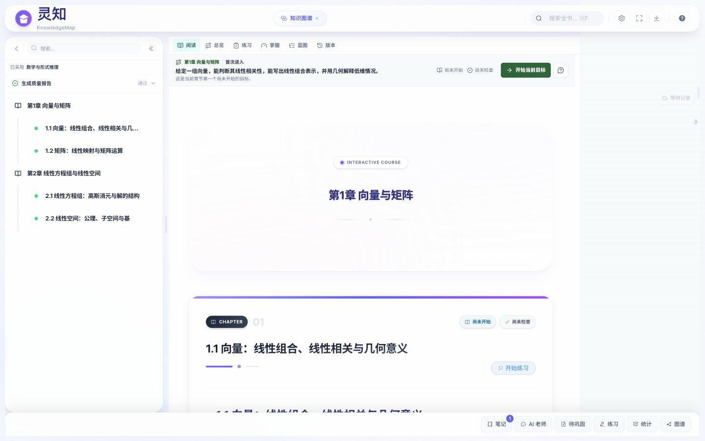
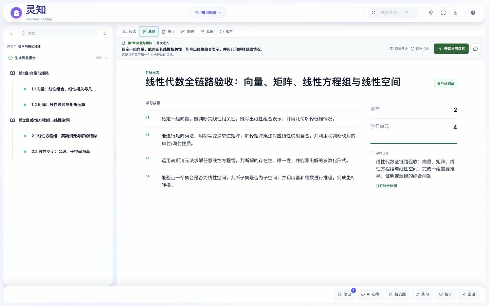
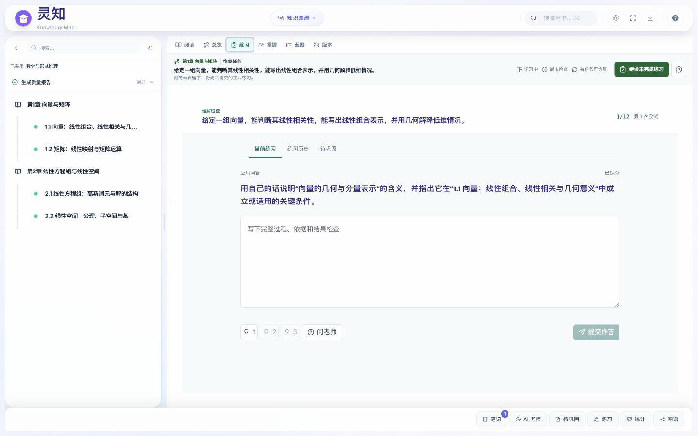
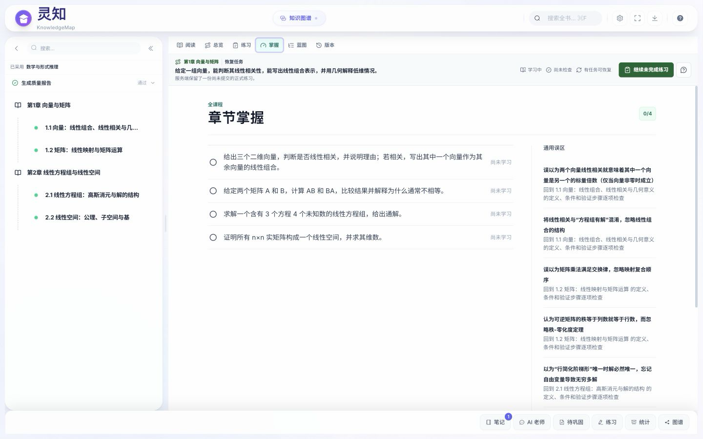
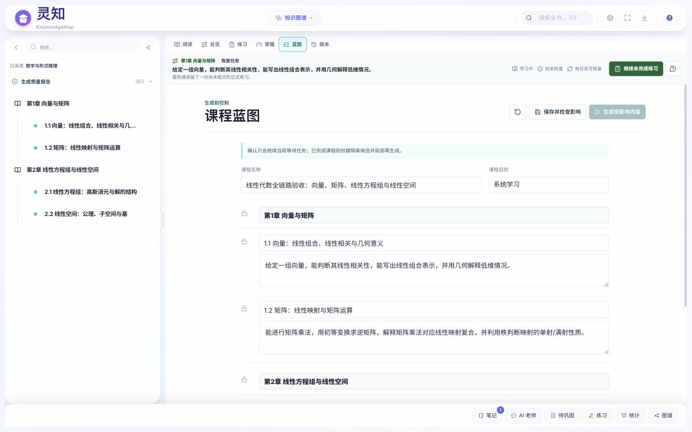
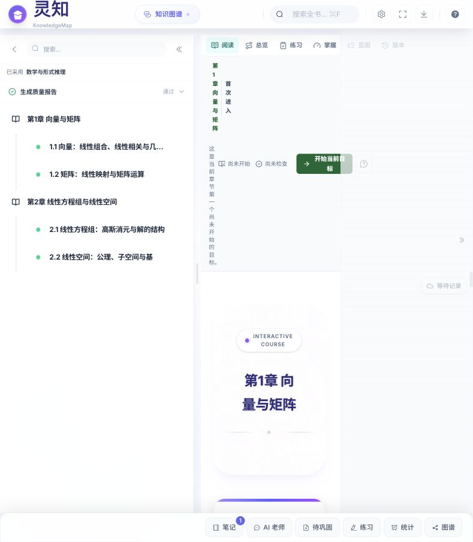
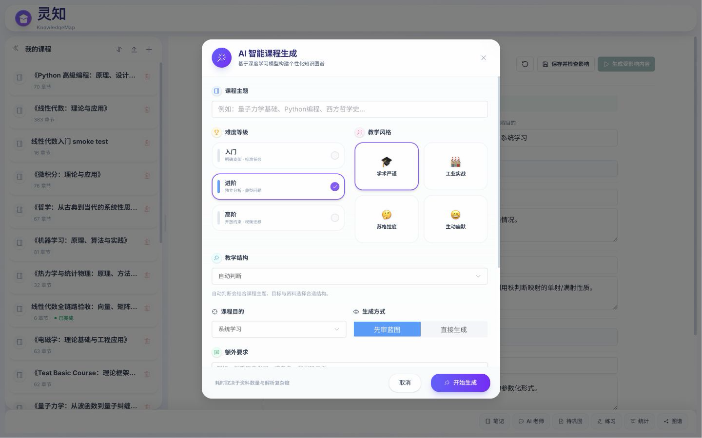
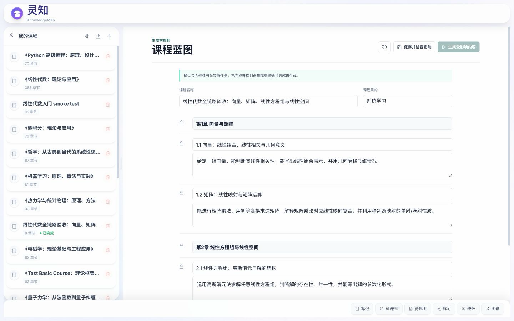
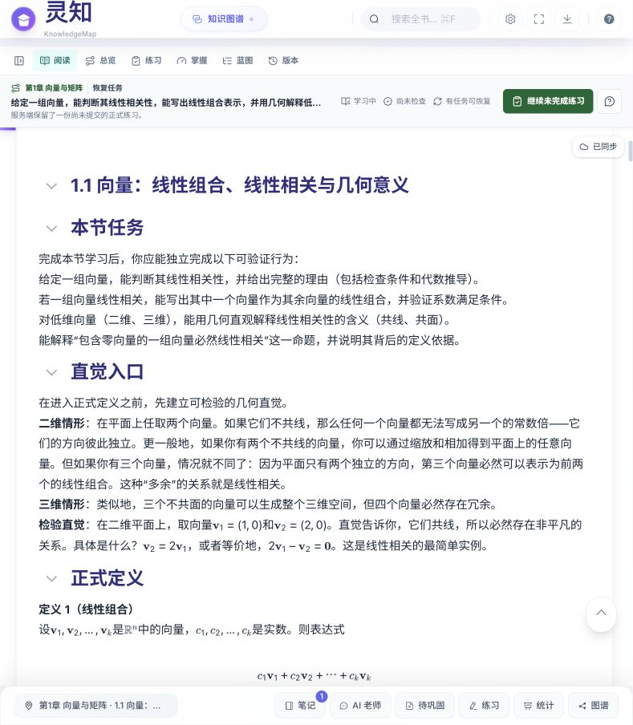

# 灵知产品一致性与可用性审计

- 审计日期：2026-07-12
- 审计对象：课程列表、课程阅读、课程总览、正式练习、掌握、课程蓝图、创建课程、移动端课程页
- 验证环境：本地前端 `http://127.0.0.1:5179`，后端 `http://127.0.0.1:8010`
- 样本课程：`4dcfe257-0955-49bb-ade4-dc6ed915bbfb`
- 视口：`1440x900`、`789x904`、`390x844`

## 1. 总结论

当前软件不是“功能没做”，而是处于 **后端主链已经成形、前端仍在新旧交接、产品结构尚未收口** 的状态。

新课程运行时、正式练习、诊断补救、学习连续性、课程蓝图和版本能力都有真实接口与正式数据，不是演示壳。但这些能力仍被塞在旧课程阅读器、旧全局外壳和旧课程状态中。结果是：

1. 同一个页面同时存在两套视觉语言。
2. 学生学习功能、课程生产功能和系统工具没有分区。
3. 新运行时与旧 `currentNode` 状态没有完全统一，页面会对当前范围产生不同解释。
4. 旧的侧栏、底栏和全局工具继续占据空间，新功能只能继续叠层。
5. 多数新能力“能打开”，但入口、范围、上下文、恢复和反馈没有形成完整用户心智。

因此，目前最准确的产品判断是：**核心能力已进入可验证阶段，整套软件还没有进入稳定可用的产品阶段。**

## 2. 用户旅程审计

| 环节 | 健康度 | 观察 | 主要问题 |
| --- | --- | --- | --- |
| 课程列表 | 橙色 | 旧课、新标准课、阅读型课都能出现 | 没有能力级别、版本、就绪状态和最近学习位置；重复课程难以区分 |
| 创建课程 | 红色 | 参数丰富，能够进入生成流程 | 旧紫色玻璃风格；一个弹窗承担过多决策；教学风格仍使用 emoji；缺少分步确认 |
| 课程阅读 | 红色 | 正文、目录、笔记、连续性动作都存在 | 旧阅读器与新连续性条叠加；首屏巨大章节封面；固定笔记栏长期占位 |
| 课程总览 | 黄色 | 新工作区较清晰，目标和资产能集中展示 | 仍被旧外壳、目录和底栏包围；与阅读页视觉断层明显 |
| 正式练习 | 黄色 | 题目、草稿、状态、恢复和提交链路真实存在 | 练习范围依赖旧节点状态；当前样本显示 12 题但没有清楚解释作用域 |
| 掌握 | 红色 | 能展示检查标准和误区 | 标题称“章节掌握”，实际显示“全课程”；范围语义与当前学习目标不一致 |
| 蓝图与版本 | 红色 | 新的生产能力真实存在 | 课程作者功能直接暴露在学生学习导航中，角色边界错误 |
| 789px 窄桌面 | 红色 | 页面没有直接崩溃 | 左目录、右笔记和正文同时固定，正文仅剩约 187px，文字被挤成竖排 |
| 390px 移动端 | 红色 | 可打开课程并看到主动作 | 顶部和底部均变成无文字图标，导航难发现；多层工具栏压缩正文首屏 |

## 3. 关键证据

### 3.1 旧阅读器和新工作区并存

`CourseView.vue` 在同一个中央容器中保留旧 `ContentArea`，同时挂载新的 `CourseWorkspace`。阅读模式走旧组件，其他模式走新组件。这不是同一设计系统下的页面差异，而是两个时期的产品直接切换。

旧阅读页使用大尺寸章节封面、渐变和高圆角；新工作区使用白底、青绿色、紧凑排版和小圆角。用户每次切换模式都像进入另一套软件。

### 3.2 新运行时和旧节点状态没有统一

连续性条读取 `learningProgressStore.continuation`，能够知道当前学习目标；练习和掌握工作区却通过 `courseStore.currentNode` 推导 `currentNodeId`。课程加载时，如果此前没有旧节点选择，`currentNode` 不会根据运行时的当前目标自动恢复。

这会产生实际割裂：连续性条显示当前目标，掌握工作区却显示“全课程”；点击“练习”虽然把 scope 设为 `node`，但 `nodeId` 为空时仍会向后端请求课程范围结果。

这不是文案小问题，而是新旧状态整合不完整。

### 3.3 角色与信息架构混在一起

同一导航同时包含：

- 学生任务：阅读、练习、掌握。
- 学习辅助：笔记、AI、统计、知识图谱。
- 课程生产：蓝图、版本、跳过节点、自定义生成指令、重新生成。

学生不应在日常学习主导航里看见课程生产和版本管理。作者也不应在编辑蓝图时被学生的阅读底栏和连续性动作包围。

### 3.4 页面工具重复，不是功能协同

顶部工作区导航已有练习和掌握；底部 SmartBar 又提供练习、待复习、统计、图谱、笔记和 AI；全局头部再次提供图谱、搜索、外观、专注和导出。

这些工具没有按“当前任务”收敛，而是长期同时出现。功能越多，正文空间和注意力越少。

### 3.5 响应式存在真实阻断

在 `789x904` 视口下，系统只把小于 `768px` 判断为移动端。此时左侧课程目录约 322px，右侧笔记栏固定 260px，中央可见正文约 187px，标题与正文被挤成逐字换行。

在 `390x844` 下，顶部六个模式按钮和底部主要工具都隐藏文字，仅保留图标。虽然 DOM 中存在 `aria-label`，普通用户仍无法从视觉上知道每个入口是什么。

### 3.6 创建课程仍是旧产品语言

创建课程弹窗继续使用紫色渐变、玻璃效果、大圆角和 emoji 风格，同时一次要求用户决定主题、难度、教学风格、教学法、用途、生成模式、补充要求、资料和资料约束。

这既造成视觉断层，也把本应由系统推断或分步确认的复杂性全部推给用户。

### 3.7 首页不是独立课程管理界面

`/` 与 `/course/:courseId` 复用同一个 `CourseView.vue`。首页实质是同一工作台在没有课程参数时的状态，而不是清晰的课程库。课程管理、当前工作区和课程生产因此容易同时出现。

## 4. 根因划分

### 4.1 不是后端缺功能

当前正式练习、学习运行时、诊断补救、版本协调和 AI 动作协议已有明确接口、测试和真实数据。继续增加后端功能不会自动修复当前体验。

### 4.2 是产品壳没有重构

旧的 `App.vue`、`CourseView.vue`、`ContentArea.vue`、`CourseNode.vue`、`CourseTree.vue` 和 `SmartBar.vue` 仍决定主要页面结构；新的工作区只是嵌入其中，没有接管产品外壳。

### 4.3 是状态真源在前端仍有分叉

后端已经用 `LearningRuntime` 统一学习连续性，但前端工作区仍把 `courseStore.currentNode` 当作课程范围真源。旧节点选择应该降级为“阅读器当前选中项”，不应继续决定正式练习和掌握范围。

### 4.4 是角色边界没有落到路由和权限

课程学习、课程生产和课程管理目前不是三个独立空间，而是同一页面中的标签和弹窗。只靠隐藏按钮无法建立稳定边界。

## 5. 应保留、升级、迁移和删除的功能

### 5.1 保留并作为新主干

- `LearningRuntime` 与唯一下一步动作。
- 正式练习、草稿恢复、诊断补救和复验。
- 课程总览、掌握标准、误区和课程能力契约。
- 课程蓝图、版本、生成质量报告。
- AI 老师统一入口和正式动作确认协议。

### 5.2 必须升级

- 课程库：增加课程类型、就绪状态、当前版本、最近学习目标和继续入口。
- 阅读器：改为新工作区的阅读模式，不再作为特殊旧页面存在。
- 当前范围：统一由运行时目标和显式用户选择共同决定。
- 创建课程：改成“基础目标 -> 资料与约束 -> 生成确认”的短流程，高级参数按需展开。
- 响应式：在平板和窄桌面只允许一个侧栏占位，空笔记栏不得长期保留固定宽度。

### 5.3 迁移到其他空间

- 蓝图、版本、重新生成、节点锁定、跳过节点：迁入“课程工作室”。
- 导出、质量报告、生成任务：迁入课程管理或课程工作室。
- 外观设置：保留为全局偏好，但退出学习主任务工具区。
- 知识图谱：保留一个入口，根据学习/编辑角色切换视图，不在头部和底栏重复。

### 5.4 删除或退役

- 旧紫色玻璃和渐变装饰体系。
- `CourseNode` 的巨大“Interactive Course”章节封面。
- SmartBar 中与顶部导航重复的练习、掌握和图谱入口。
- 创建课程中的 emoji 教学风格卡和模型宣传文案。
- 空笔记栏的固定占位。
- 直接向 `document.body` 追加红色 HTML 的路由错误提示。

## 6. 下一阶段蓝图

当前 8.6 不应只做零散缺陷回灌，应明确升级为 **产品收口与前端主干统一**，但仍按唯一责任域修复，不推翻已经稳定的后端主链。

### P0：先修真实可用性阻断

1. 用 `LearningRuntime.current_objective` 恢复当前学习范围，解除练习/掌握对旧 `currentNode` 的单独依赖。
2. 修复 768-1024px 布局：目录、正文、笔记最多两栏；正文设置可读最小宽度。
3. 明确练习和掌握的范围标题、题量、来源和切换方式。
4. 移动端保留可理解的文字导航，不用六个无文字图标承担主导航。

### P1：完成产品结构收口

1. 拆成课程库、学习工作区、课程工作室三个产品空间。
2. 将阅读迁入新 `CourseWorkspace`，退役旧阅读特殊壳。
3. 统一一个视觉系统：中性白灰、青绿色状态色、5-8px 圆角、克制阴影、统一密度。
4. 合并顶部导航和 SmartBar，只保留与当前任务相关的主要入口。
5. 重做创建课程流程，减少首屏参数并补充生成前确认。

### P2：系统性细节打磨

1. 课程卡的命名、类型、版本、状态和重复项处理。
2. 中英文、空状态、错误状态、加载状态和离线状态。
3. 按钮命名、焦点、键盘操作、移动端触控面积和辅助说明。
4. 逐路由截图回归与真实任务验收，不再只用接口测试和构建通过代表前端完成。

## 7. 验收口径

产品收口完成至少需要满足：

1. 用户进入课程后能在 10 秒内说清当前目标、下一步和当前范围。
2. 学习者界面不出现课程生成、蓝图编辑和版本管理动作。
3. 连续性条、阅读标题、练习范围和掌握范围使用同一目标身份。
4. 390px、789px、1024px 和 1440px 均不存在正文窄于可读宽度、遮挡或主导航不可理解。
5. 同一条旅程内不再切换紫色玻璃风和青绿色工作台两套视觉语言。
6. 每个页面只有一个主动作，重复入口有明确归属或被删除。

## 8. 证据边界

本次审计覆盖一个标准课程的主要页面与三类视口，并结合当前源码确认结构问题。它没有穷举所有旧课程、所有生成状态、英文模式和全部弹窗，因此不应把本报告当作完整视觉回归结果；但已足以确认产品外壳、角色边界、状态衔接和响应式四个系统性问题。

## 9. 8.6 P0 实施回看

本审计提出的四项 P0 已完成第一轮收口：

1. 练习与掌握在旧节点未选择时回退到 `LearningRuntime.current_objective`，不再静默扩大为全课程。
2. 练习明确显示当前目标、全课程或综合检测；掌握改为目标掌握并显示当前目标名称。
3. 768 至 1023px 使用覆盖式课程目录，固定笔记栏只在 1280px 以上占位。
4. 390px 模式导航保留文字并允许横向滚动。

真实标准样本中，练习由错误的全课程 `1/12` 恢复为当前目标 `1/3`，掌握由全课程 `0/4` 恢复为当前目标 `0/1`。789px 正文可见宽度由约 187px 恢复为约 688px。

P0 只解决可用性阻断，没有冒充整站改造完成。课程库、学习工作区和课程工作室的角色拆分，旧阅读器退役、SmartBar 去重、创建课程流程和统一视觉系统仍属于 8.6 P1/P2。
