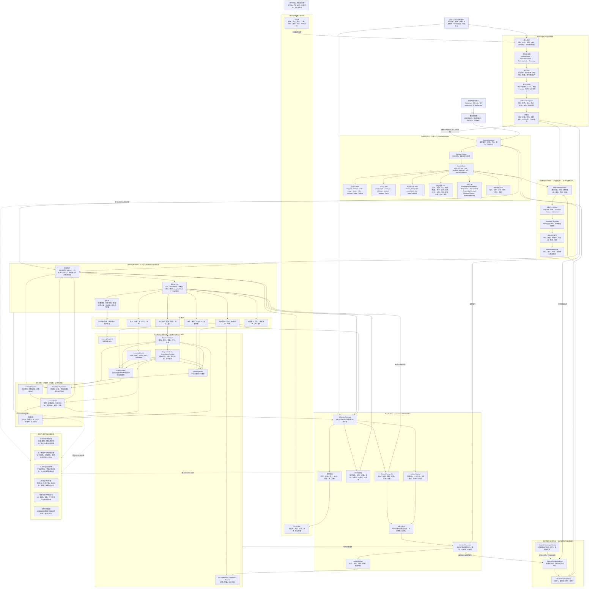

# 灵知 AI 课程系统产品总蓝图

> 本文是灵知当前产品语义的最高优先级真源。它描述目标产品，不按历史开发顺序组织。
>
> 2026-07-12 核心修正：课程不再被定义为用户可见的版本包，也不再以整节 Markdown 为本体。课程的真实结构是一个由 AI 生成并持续维护的 `CourseDocument`，内部由章节、分组和有序异构 `CourseBlock` 组成。
>
> 2026-07-15 核心扩展：灵知按“结构化同源 + 个体化生长”建设课程智能体。当前课程同时拥有可生长的 `CourseKnowledgeBase`；当前课程内每条用户输入与正式学习对象都可成为原始证据。AI 可以规划行、段、块、章节和全课程变化，但所有持久变化先进入可见候选层，只有用户确认后才由领域命令写入当前个人课程。
>
> 2026-07-15 多模态扩展：图解、幻灯、音频、动画、模拟和视频不另建课程，而由 `RepresentationPlan` 从同一课程语义编译为 `TeachingRepresentation / RepresentationSet`。表现编辑只修改表示，语义编辑回到课程变化候选；高成本表示按需生成并具有确定性降级。

## 1. 一句话定义

灵知是一套以可编译为多种教学表达的结构化同源课程为学习现场、以学习事实为证据底座、以 AI 课程智能体驱动个人课程持续生长的个人 AI 学习系统。

它解决的不是“让 AI 写一篇长文章”，而是以下完整问题：

- 把用户目标、资料和约束编排成真正可学习的课程。
- 让文本、公式、代码、图片、视频、图表、题目和复习自然穿插在同一条学习流中。
- 让同一知识从共同语义真源编译为图解、幻灯、音频、动画、模拟和视频，并依据当前任务与证据选择表达。
- 把阅读、提问、笔记、作答、错因、复习和恢复沉淀为可信学习事实。
- 基于事实形成可解释的学习者模型，而不是让 AI 凭印象判断用户。
- 由一个 AI 助手在不同现场提供解释、提示、诊断、补救、复习和课程改进。
- 让课程知识、正文、目标、题目与学习证据使用稳定引用联动，而不是复制多份文本维持一致。
- 让单条强证据触发局部调整、跨位置稳定证据触发广域候选，并由用户决定是否成为当前个人课程的一部分。
- 即使 AI、媒体或评分服务暂时失败，确定性的学习主链仍然可用。

## 2. 产品总控图



这张图表达的主链是：

```text
用户目标与资料
→ AI 生成并质量校验当前课程
→ 稳定 CourseBlock 教学流
→ 从共同语义按需编译并挂载多种 TeachingRepresentation
→ LearningRuntime 组成个人学习现场
→ 阅读 / 提问 / 笔记 / 作答 / 复习
→ 学习事实
→ 学习者模型
→ 当前课程原始证据与可解释适应假设
→ AI 助手回答、自动插入低风险临时教学块，或生成持久课程变化候选
→ 用户接受 / 拒绝 / 重生 / 调整范围
→ 领域命令安全修改当前个人课程与课程知识库
→ 对修改后的学习效果继续取证
→ 用后续正式证据评价内容变化与表达选择
→ 新的学习行为
```

## 3. 核心产品修正

### 3.1 不再把课程设计成版本包

产品层只有一门当前课程。用户直接学习，并通过目标、资料、反馈和自然语言表达改进意图，不需要手工编辑教学块，也不需要理解 `cv1 / cv2`、候选版本或版本迁移页面。AI 修改课程时，用户只审阅原位置的具体差异、理由、证据和作用范围，不管理整份课程版本。

技术层仍允许保留：

- `course_revision`：防止并发覆盖。
- `block_revision`：冻结作答、锚点和引用所依据的内容。
- `CourseOperationLog`：支持审计、撤销和故障恢复。
- 块墓碑与 ID 映射：保证块被删除、拆分或合并后，历史记录仍可解释。

这些都是用户不可见的修订信息，不构成另一套课程产品。

### 3.2 不再把完整 Markdown 当作课程真源

Markdown 只承担三种作用：

- `rich_text` 块的内容格式。
- 旧课程的导入与兼容格式。
- PDF、Markdown 等导出载体。

课程的真实结构固定为：

```text
CourseDocument
└── Section / Group
    └── ordered CourseBlock[]
```

### 3.3 展示位置与领域归属分离

题目、复习、知识库视图和媒体可以出现在课程流中的任意合适位置，但它们各自的正式状态仍归所属领域：

- `PracticeBlock` 引用正式 `PracticeTask`；作答归 `PracticeAttempt`。
- `ReviewCheckpointBlock` 保存复习范围与规则；个人到期状态归 `LearningRecord / LearningEvent`。
- `KnowledgeBlock` 引用统一知识库节点和当前课程映射；个人掌握只作为覆盖层显示。
- `MediaBlock` 引用 `MediaAsset`；课程块不复制二进制文件。

学习页面始终只有一条课程正文流。正式任务在原位置以可扫读的 `CourseBlock` 预览存在，至少说明任务类型、题量或目标、首个任务摘要和保存语义；点击后打开临时学习工具。预览块不内嵌第二份答案或进度，关闭工具必须返回原正文锚点、原滚动位置和原任务状态。

```text
正文中的 CourseBlock 预览
-> 点击开始 / 继续 / 查看结果
-> 桌面居中 TaskOverlay / 移动全屏任务
-> 自动保存、提交或关闭
-> 回到原 CourseBlock
```

练习、掌握、诊断、补救、复习、图谱和代码实验可以拥有完整工具组件，但不得成为与正文平级的顶部栏目、永久分栏或第二条学习路线。桌面端使用居中覆盖弹窗，不使用右侧半屏抽屉；从正文块进入时可用来源到弹窗的连续过渡，从 Dock 或恢复提示进入时使用普通淡入。移动端使用全屏工具；工具内部状态仍归正式领域对象，不写回课程块副本。

展示规则固定为：

| 块类型 | 正文中长期显示 | 点击后临时展开 |
| --- | --- | --- |
| `practice_ref / mastery_check` | 标题、题量或目标、预计用时、进度、结果摘要 | 正式作答、提示、评分、重试与历史 |
| `review_checkpoint / remediation_slot` | 到期或触发原因、范围、当前状态 | 复习、诊断、补救与独立复验 |
| `code_lab` | 任务说明、运行状态与结果摘要 | 完整编辑器、运行器和调试工具 |
| `knowledge_embed` | 与当前位置有关的学科知识及课程覆盖 | 统一知识库探索、能力/易错/提升与掌握覆盖 |
| `reflection / project` | 简要任务、提交状态与产出摘要 | 长表单、编辑器、附件和提交 |
| 内容与媒体块 | 内容本身 | 仅在缩放、全屏播放等确有需要时展开 |

### 3.4 以 3 月版本为体验基线

当前学习体验以 2026 年 3 月版本的交互语法为基线，代码参考点为 `9ae4cc7`：课程目录和连续正文保持稳定，题目、统计、笔记详情、知识库、图片查看和阅读设置从当前上下文临时展开，关闭后继续原来的学习现场。

升级目标不是用新功能重做一套页面，而是在这套体验上替换更强的正式内核：

```text
3 月版稳定体验
+ 当前 CourseDocument / CourseBlock
+ 正式 PracticeAttempt、学习事实与 LearningRuntime
+ 更强但受边界约束的统一 AI 助手
= 当前目标产品
```

继承的是空间秩序和操作连续性，不是机械复制旧实现。以下人工修正优先于 3 月版本：

- 视觉上以 `9ae4cc7` 的真实组件和样式为源码级基线，保留浅色渐变背景、玻璃外壳、柔和阴影、较大主容器圆角、indigo 品牌色和章节卡层级；新功能只能嵌入这套语言，不能借“现代化”另起一套视觉系统。
- 顶栏优先继承旧版紧凑品牌标识、轻巧图标按钮和柔和悬浮反馈；新版只贡献更规整的三段布局、真实课程上下文和更高的信息密度，不能退化成通用后台工具条。
- 左侧目录优先继承旧版章节书本图标、纵向虚线脉络、圆点节点、柔和选中面和可识别的章节节奏；新版只贡献搜索、紧凑行高、阅读状态和掌握状态。高密度不能以抹平层级和视觉性格为代价。
- 课程创建弹窗继承旧版“纵向难度列表 + 2×2 教学风格”的核心选择节奏，课程主题、难度与教学风格构成第一阅读路径；新版增加的教学结构、课程目的和资料边界保留为第二层课程策略，不能再与难度拼成左右控制台。
- 正文教学块通过留白、角色标签和标题层级形成节奏，不在相邻块之间重复绘制整行横线，也不渲染内容中的装饰性 `hr`。`小结` 等承担段落收束作用的标签必须比普通元数据更醒目，并与对应标题共同形成清晰的结束节点。
- 首页改成铺开一门门课程的课程架，不继续把全部课程塞进学习页左栏。
- 固定笔记列退出，手写便签和 AI 问答摘要进入正文个人记录块；原文标记、末尾图标和按需浮层只承担锚点与聚合入口。
- 桌面端把整个课程块作为块级 AI 的感应区：鼠标进入后，直接在块左侧留白轨道显示“解释 / 举例 / 简化 / 提问”四项操作，不再先显示星光按钮、不覆盖正文；进入操作区后保持展开，离开课程块与操作区后延迟收起，避免跨越间隙时闪烁。键盘聚焦课程块时显示同一操作区；触屏端因无 hover 仍保留轻量点击入口。它们在来源块下方形成同一个临时个人内容块，连续追问按轮次叠加在这个块内，不覆盖已有问答。具备课程编辑能力时，“改进正式正文”使用块右上角独立低权重入口进入既有候选工作区，不混入学生菜单。回答标题必须标明来源块，正文统一按“短讲义”组织阅读层级：用节制的标题引导线、段落间距和轻量清单区分解释、要点与例子，不套大卡片、不让装饰性横线贯穿整栏。回答操作允许“继续追问 / 重新生成 / 保留为个人内容 / 移除”；“重新生成”先让用户补充本次要求，再用新结果覆盖当前选中的一条回答，不把改写伪装成追问。完整回答只追加“已解决 / 还不清楚”效果反馈；该反馈写入 `LearningEvent`，但不自动触发下一步、出题、保存、诊断或课程改写。全局 AI 只作为历史会话、跨块问题和低频兜底入口按需展开，不恢复 AI 浮球或第二套会话状态。
- 旧版横跨整页、混合 AI 出题与本地错题的六按钮 SmartBar 退出；保留它“正文下方低频学习工具坞”的空间价值，在中间工作区底部聚合学习记录、当前正式练习、学习统计和知识库。块级 AI 从正文原位进入，全局 AI 与正式任务仍保留并行入口；不同入口引用同一会话或正式任务，不复制状态。
- `LearningContinuation` 继续作为统一学习连续性投影，但不再渲染为正文顶部常驻状态栏目。前端只把真实存在的 `resume_*` 阅读、草稿或正式任务显示为“继续未完成”提示；目录、练习、记录、统计、知识库和 AI 保持并行工具关系，不把内部动作优先级包装成“唯一下一步”。只有课程版本冲突、数据迁移失败等真正阻断学习的情况才允许临时阻断界面。
- 旧本地错题、临时 AI 出题和页面 Store 不再充当正式业务真源。

视觉继承不等于保留旧实现中的全部成本。嵌套 `backdrop-filter`、重复渐变、重复 token 和影响滚动性能的模糊层可以重写，但同视口下的颜色、圆角、层级、密度与阅读节奏必须保持旧版身份。

涉及导航层级、功能常驻位置、正文嵌入或覆盖层、AI 主动程度、自动写入、用户确认和旧功能去留等产品边界时，AI 只能列出证据、方案和影响，不得替用户定案。用户确认后才能进入正式蓝图和实现；普通代码组织与不改变体验的技术修复不重复上升为产品决策。

### 3.5 教学块由 AI 编排，不提供学生工作台

`CourseBlock` 是课程生成、难度设计和运行时适配的内部表达，不是要求学生掌握的编辑工具。学生不通过拖拽画布手工设计教学顺序，因此产品不提供课程工作室或学生块编排器；但 AI 可以根据证据提出任意合法结构变化，用户在原课程语境中审阅和确认。

用户只需要：

- 在创建课程时说明目标、资料、用途、难度感受和讲解偏好。
- 在学习时通过作答、提问、笔记和反馈形成证据；停留与滚动可以成为弱信号，但不能独立触发广域修改。
- 在任一课程块主动选择解释、举例、简化或提问，并决定继续追问、按补充需求重新生成、保留为个人内容或移除。
- 审阅 AI 高亮的课程变化，查看调整理由和范围，选择接受、拒绝、重新生成、补充要求或调整目录范围。

AI 负责把这些信息编译成教学块节奏。系统同时保留两条不同结果路径：

1. **临时适配**：解释、反例、过渡、提示和非正式理解检查可以在当前现场出现，不写入正式课程。
2. **课程生长候选**：AI 可以补写原行、修改或替换块、插入新块、拆分、合并、重排、移除、增加检查点、调整难度，并可提前修改后续章节；候选长期高亮保留，只有用户确认后才写入当前个人 `CourseDocument`。

AI 的操作权限可以很高，但不得替用户确认。单条非常明确的强证据可立即形成局部候选；跨章节或全课程候选必须来自用户明确的广域指令，或多个独立位置的一致证据。系统不得把固定“三次”当作通用硬门槛。

临时适配必须满足：

- 有触发依据，能够说明是由哪次作答、提问、反馈或已确认缺口触发。
- 贴着相关内容出现，不跳转新页面，不改变左侧课程结构。
- 明确属于“仅本次学习”的个人覆盖层，可跳过、可收起，不冒充正式课程内容。
- 不直接改变正式题目、掌握事实或基础课程顺序。
- AI 服务失败时自动消失，原课程仍可继续学习。

课程生长候选必须满足：

- 显示“AI 新增/修改”、前后差异、调整理由和调整范围。
- 支持选区、段、块、小节、章节、多个目录节点和当前全课程范围。
- 未确认时跨刷新与退出持续保留，但不改变正式课程修订。
- 用户可以接受、拒绝、重新生成、补充要求、部分接受和撤销已接受操作。
- 知识、课程、目标和题目变化先做影响分析，不能盲目整章重写。

### 3.6 笔记与 AI 问答回到正文现场

笔记不是脱离课程的侧栏卡片，选区提问也不应只留在聊天历史。它们都应回到理解发生的位置，成为当前用户课程流中的个人记录块：

```text
稳定 CourseBlock
+ 持久待确认 CourseChangeSet 投影
+ 临时 AdaptiveBlock
+ 持久 InlineLearningRecordBlock
= 当前用户看到的完整正文流
```

`InlineLearningRecordBlock` 只是 `LearningRecord` 的正文投影，不复制第二份笔记真源，也不写入基础 `CourseDocument`。它承载两类内容：

- 手写便签：用户选择正文后直接在锚点附近输入，自动保存为个人 `note`。
- AI 问答沉淀：块级 AI 回答默认保持临时；“已解决 / 还不清楚”只记录该回答的效果事实，不保存回答正文。只有用户明确点击“保留为个人内容”后，系统才把当前稳定回答保存为带 `source=ai_qa` 的个人 `note`，并保留会话与内容块引用。

排版规则：

- 短便签在宽屏可以作为正文旁的轻量便签，正文围绕它自动重排；不保存像素坐标。
- 长笔记、代码、公式和 AI 问答摘要使用完整正文宽度，避免窄栏阅读和复杂环绕。
- 移动端全部回落为块级顺序，禁止浮动、遮挡和横向溢出。
- 原文保留轻量选区标记，记录块紧邻所属段落；课程内容变化后继续使用语义锚点迁移。
- 同一选区的一次连续 AI 对话只维护一个问答沉淀块，追问按轮次追加且保留上文，不拆成多张独立卡片；只有用户主动选择“重新生成”并补充需求时，才用新结果覆盖选中的回答。

保存边界：解释、举例、简化和提问只授权生成临时个人内容，不等于授权长期保存。用户点击“保留为个人内容”后，系统通过既有提案与回执协议创建 `LearningRecord`；保存后必须允许编辑、折叠、删除或撤销。普通聊天、AI 主动提醒和未形成稳定解释的中间输出不得自动写成笔记。

### 3.7 结构化同源与个体化生长

灵知后续 AI 能力只由两条最高原则统领：

- **结构化同源**：课程结构、课程知识、目标、题目、记录和证据各有唯一真源，通过稳定 ID、修订、引用和依赖图联动。同源不是把课程目录与学科知识塞进同一棵树，也不是复制多份 Markdown。
- **个体化生长**：当前课程中的每条用户输入都可以登记为原始证据，错题、笔记、诊断和反馈作为事实证据共同参与判断。原始证据与 AI 假设分层；单条明确证据可立即触发局部候选，跨位置稳定模式可扩大范围，反证可以缩小或撤销判断。

课程知识采用三层结构：跨课程 `SubjectKnowledgeLibrary` 提供正式坐标，随课程生成的 `CourseKnowledgeBase` 表达当前课程可生长的知识颗粒度，`CourseKnowledgeMap` 连接知识与课程块、目标和题目。课程与课程知识库可以双向生成影响候选，但个人变化不能自动写回正式学科库。

难度必须落实为知识颗粒度、抽象程度、推导完整度、例子、支架、任务复杂度、知识跨度、节奏、反馈频率和掌握独立性，不能只表现为文字更长、术语更多或题量增加。

完整需求与实施契约见 [`docs/requirements/灵知AI课程智能体需求文档.md`](requirements/灵知AI课程智能体需求文档.md) 和 [`openspec/changes/build-structured-adaptive-course-ai/`](../openspec/changes/build-structured-adaptive-course-ai/)。

### 3.8 多模态同源与教学表达编译

多模态不是在课程外增加图片、音频、PPT 和视频生成器，而是让同一个结构化课程块拥有多种可选择、可追溯、可验证的教学表达。`CourseDocument / CourseBlock` 继续是课程语义与顺序的唯一真源；图解、幻灯、讲解音频、结构化动画、交互模拟、视频和数字人均作为 `TeachingRepresentation` 挂回原块，不复制课程树、正文、知识、题目或学习状态。

生产链固定为：

```text
CourseBlock + CourseKnowledgeMap + LearningObjective + EvidenceUnit
→ RepresentationPlan：教学问题、表达理由、目标、范围、成本、质量和降级要求
→ DiagramSpec / SlideDeckSpec / NarrationSpec / SceneSpec / InteractionSpec
→ 结构化渲染器或可替换媒体提供方
→ 语义、教学、数理、跨模态、可访问、来源和成本质量门
→ RepresentationSet + MediaAsset
→ LearningRuntime 按当前任务、学习证据、设备和约束选择或组合
```

多模态生成按成本与可靠性分级：基础文本、公式、代码和正式题目先保证可用；图解和图表优先；幻灯、TTS 和结构化动画按计划或按需生成；交互模拟只用于确有因果、空间和实验价值的内容；自由视频和数字人最后接入，且不得成为精确知识的唯一表达。对数理、代码、数据和关系内容，确定性图形与可执行结构优先于自由像素生成。

媒体双向编辑必须区分表现与语义：颜色、版式、镜头、语速只形成表示修订；定义、例子含义、知识顺序和目标变化必须解析为 `ChangeOperation` 候选，显示理由、范围和依赖影响，用户确认后才修改课程真源并使相关表示进入 `stale`。无法判断的修改保持待解释，禁止静默反写课程。

个体选择依据知识形态、教学 `role`、目标、当前课程证据、设备、无障碍与成本，不建立固定“视觉型/听觉型”学习风格。观看、点击和单次偏好只作为弱证据，必须与正式作答、诊断和独立复验共同判断表达效果。

详细市场、开源移植、目标架构、质量门和实施路线见 [`docs/research/multimodal-course-generation-landscape-and-lingzhi-integration-2026-07-15.md`](research/multimodal-course-generation-landscape-and-lingzhi-integration-2026-07-15.md)。

## 4. 四层产品模型

### 4.1 实体层

| 实体 | 负责什么 | 明确不负责什么 |
| --- | --- | --- |
| `Course` | 课程身份、所有权、生命周期、当前修订 | 不保存用户作答、笔记和掌握状态 |
| `CourseDocument` | 当前课程结构、章节、块顺序和课程级契约 | 不保存另一份用户可见历史版本 |
| `CourseBlock` | 一个可排序、可引用、可交互的教学单元 | 不复制正式题目、用户复习状态或媒体文件 |
| `MaterialAsset / EvidenceUnit` | 原始资料、解析结果、证据来源和覆盖关系 | 不证明用户已经掌握 |
| `MediaAsset` | 图片、音频、视频、附件及替代文本、字幕、来源、许可和提供方元数据 | 不承载教学语义、课程顺序或学习状态 |
| `TeachingRepresentation / RepresentationSet` | 同一课程语义的一种教学表达，以及默认、替代、组合和降级关系 | 不复制课程正文，不成为第二课程真源 |
| `RepresentationPlan / DiagramSpec / SlideDeckSpec / NarrationSpec / SceneSpec / InteractionSpec` | 说明为什么生成、怎样表达及如何被结构化渲染和验证 | 不直接成为正式课程内容或个人掌握事实 |
| `AssetDerivationGraph` | 记录课程修订、表达规格和媒体资产之间的派生、陈旧与重建关系 | 不替代课程命令或保存另一份语义正文 |
| `GenerationJob / GenerationProvider` | 统一承载多模态规划、渲染、提供方调用、恢复、成本和降级 | 不决定课程结构，不直接修改学习事实 |
| `LearningObjective` | 可验证学习目标及其课程位置 | 不等于完成状态 |
| `SubjectKnowledgeLibrary / KnowledgeNode / AbilityPoint / MisconceptionPoint / ImprovementPoint / Relation` | 跨课程复用的学科、领域、主题、概念、细知识点、能力、易错、提升及正式语义关系 | 不保存课程目录、讲授顺序、题目或个人掌握，不替 AI 下当前学习结论 |
| `CourseKnowledgeBase` | 随当前课程生成、可新增和细化的课程知识语义层 | 不自动改写跨课程正式知识，不复制课程目录 |
| `CourseKnowledgeMap` | 正式知识、课程知识节点、课程块、目标和题目之间的覆盖、顺序与映射状态 | 不复制正文，不把课程局部节点伪装成正式知识 |
| `PracticeTask / MasteryCriterion` | 正式题目、评分和掌握要求 | 不保存用户答案 |
| `PracticeAttempt` | 一次正式作答、提示、提交、评分和证据 | 不复制成错题文本仓库 |
| `LearningEvent` | 不可改写的学习行为事实 | 不保存可编辑当前笔记 |
| `LearningSnapshot` | 当前恢复位置、草稿和活动任务引用 | 不代替事件历史 |
| `LearningRecord` | `note / issue / review_task / bookmark` 当前对象；`note` 可来自手写或结构化 AI 问答摘要 | 不存正式作答和掌握结论 |
| `DiagnosticCase / RemediationSession` | 错因验证、最小补救和独立复验 | 不因一次错误直接创建稳定弱点 |
| `EvidenceItem` | 当前课程中用户输入与正式学习对象的可追溯原始证据索引 | 不复制全文，不直接等于稳定画像或掌握事实 |
| `AdaptationHypothesis` | 基于证据形成的有范围、有反证、有置信度的教学适应判断 | 不直接写入 `LearnerModel` 或正式课程 |
| `CourseChangeSet / ChangeOperation` | AI 课程生长的结构化候选、差异、依赖和范围 | 未确认前不改变正式课程和课程知识库 |
| `LearnerModel` | 基于事实的掌握、缺口、偏好和节奏投影 | 不是隐藏的 AI 记忆仓库 |
| `LearningRuntime` | 一次读取形成当前学习现场、活动任务、恢复事实和内部动作投影 | 不建立新的状态仓库，也不决定前端只能显示一个操作 |
| `AIConversation / Proposal / Receipt` | 对话、动作提案、确认与执行结果 | 不直接成为笔记、画像或掌握事实 |

笔记本、错题本、复习中心、掌握图和学习报告是功能视图，不是新的底层实体。

### 4.2 功能层

#### 课程库

- 新建空白课程、AI 生成课程、导入 Markdown 或复制已有课程。
- 搜索、筛选、归档、恢复、删除和导出课程。
- 首页直接铺开一门门课程，形成可扫描的课程架；课程卡优先显示名称、节点数量和真实生成状态，不把生产工具或伪造的“继续”文案堆进课程卡。
- 课程架上方最多显示一个最近的真实断点恢复入口，只在存在阅读位置、答案草稿或活动任务快照时出现；到期复习和其他能力仍通过并行工具进入。
- 删除默认先软删除；永久删除前展示课程内容、资料绑定和个人学习事实的影响范围。

#### 课程创建与内部维护

- 从课程库进入简洁创建流程，配置目标、用途、学科、难度感受、讲解偏好和资料用途。
- 上传教材、课件、题库、图片、音频、视频和其他资料，后续解析、编排和质量检查由 AI 与确定性服务完成。
- 用户提交后立即进入与该课程卡绑定的“生成现场”，同时看到需求整理、资料解析、教学结构、课程蓝图、章节正文、学习资产、质量检查和发布等真实阶段。生成现场直接复用学习工作区的左侧目录与中间正文，不建立独立课程工作室；任务中心只保留跨课程总览、暂停、取消、恢复和错误处理。
- 一次提交拥有稳定请求号；网络重试、重复点击或响应丢失只能返回原任务和原课程，用户关闭后重新创建才使用新请求号。
- 正文生成必须像 AI 回答一样逐段出现：左侧课程目录分别显示等待、生成中、草稿完成、质量检查中、已定稿和失败状态，中间区域流式展示当前选中章节的真实正文增量；多个章节并行生成时分别维护内容流，不能把增量混成一篇滚动日志。
- 用户可以跟随当前正在生成的章节，也可以固定查看任一已产出章节；关闭生成现场后任务继续运行，从课程卡可随时返回同一现场，刷新或重连后从服务端草稿检查点恢复，而不是从本地百分比猜测进度。
- 流式正文明确标记为“AI 草稿”，只有节点质量处理完成后才变为“已定稿”；整门课程通过最终质量门后才发布为正式 `CourseDocument / CourseBlock`。生成过程展示的是可验证阶段、资料处理结果和课程内容增量，不展示或伪造模型隐藏推理。
- 正式题目、知识结构、掌握标准、通用误区和补救资产由生产链自动建立并经过质量门。
- 新课程同时生成 `CourseKnowledgeBase`，并与正式学科知识、课程块、目标和题目建立可追溯映射。
- 新课程基于知识形态、教学作用和目标形成 `RepresentationPlan`；基础课程先发布，高成本表示按需生成，不能因视频、动画或数字人失败阻断课程。
- 生成失败或资料不足时只展示可理解、可处理的问题，不把内部蓝图、块顺序和质量矩阵抛给学生修理。
- 取消未发布任务必须同时停止后台写入并清理任务专属工作区与课程外壳；清理已发布任务不得删除正式课程。课程库只展示正式课程或仍有真实任务承接的生成外壳，失联历史外壳保留审计但不伪装成 0 节点课程。
- 用户可以通过自然语言要求“讲得更慢”“多举例”“增加代码实践”或重新生成，但不手工拖动教学块；正式课程修改仍需明确确认。

#### 学习工作区

- 按课程顺序渲染文本、公式、代码、图片、视频、图表和交互任务。
- 保留左侧课程目录、中间连续正文、右侧 AI 助手的稳定空间语义，不设置阅读、练习、掌握、蓝图和版本等顶部平级模式。
- 在原位置显示理解检查、正式练习、代码任务、反思和项目预览；正式练习先展示题量与首题摘要，点击后由正文块展开为桌面居中弹窗或移动全屏任务，关闭后反向返回原位置。
- 选中内容问 AI、记笔记、标记问题、创建复习任务或书签。
- 有可靠锚点的手写便签和 AI 问答摘要直接进入正文个人记录层：短内容宽屏环绕，长内容完整占行；不恢复固定笔记栏。
- 在复习检查点处理当前用户的到期内容，不把其他用户的复习状态写进课程。
- 并行查看当前练习、学习记录、知识结构、掌握覆盖、章节结果和 AI 老师；存在真实中断事实时，额外显示轻量“继续未完成”提示。
- 跨设备恢复阅读位置、答案草稿、活动任务和诊断补救现场。
- 原位显示行级和块级 AI 候选，目录显示后续章节待确认变化，并允许用户按目录节点调整范围。
- 在原课程块查看当前默认、替代和无障碍教学表达，按需生成“换一种讲法”；表达仍绑定原块、目标、知识和资料，不进入独立媒体仓库心智。
- 未确认候选可以持续显示和用于阅读，但必须保持 AI 身份；其中的非正式检查不得自动形成掌握证据。

#### 笔记本、错题本、复习中心与知识库

- 笔记本：`note / issue / bookmark` 的聚合和检索视图。
- 错题本：失败 `PracticeAttempt + DiagnosticCase + RemediationSession` 的投影视图。
- 复习中心：`review_task`、到期状态、历史复习事实和可用复习材料的视图。
- 统一学科知识库：以 `subject → domain → topic → concept → knowledge_point` 表达跨课程复用的正式知识，叶子收束到细知识点；能力点挂到主知识节点，易错点和提升点挂到能力点。知识、能力、易错、提升及其关系共享同一个学科包、版本和修订，不再建立平行教学标准库。
- 课程知识库：每门课程同时拥有可继续细化的 `CourseKnowledgeBase`；课程局部知识可以新增、补写、拆分、合并和调整关系，但不能自动升级为跨课程正式知识。
- 课程知识映射：当前课程保存正式知识、课程知识节点、正文块、目标和题目之间的覆盖与讲授顺序。课程目录继续在左栏承担课程导航，不能在知识库弹层中复制一遍。
- 个人掌握只作为学习者模型覆盖层叠加，不改写正式知识、能力、易错或提升条目，也不把一次作答直接染成“已掌握”或“已命中易错点”。
- 学生端只负责搜索、展开、查看当前课程覆盖、知识下的能力/易错/提升及正文位置；正式条目维护和候选审核属于教师或管理工作台，不放进学习现场。
- 这些视图可以跨章节管理，但所有写操作仍回到正式领域对象。

### 4.3 逻辑层

#### 课程生产链

```text
用户目标与资料
→ MaterialAsset 与资料卡
→ 解析与 EvidenceUnit
→ 教学 brief
→ 学习目标与课程知识覆盖要求
→ 蓝图硬约束验收 + 全课一致性契约
→ CourseBlock 编排计划
→ 分块生成与正式资产生成
→ 质量门
→ 共同发布当前 CourseDocument + CourseKnowledgeBase + CourseKnowledgeMap
```

课程生成失败时保留已完成草稿块，允许单块重试；任何半成品都不能直接混入当前课程。

生成过程由同一 `GenerationJob` 产生可恢复事件流，不另建前端任务或第二正文仓库：

```text
阶段事件：任务阶段、阶段进度、当前资料、当前章节和可处理问题
+ 章节事件：task_id + node_id + sequence + draft_revision + content_delta
→ 学习工作区的生成投影按章节装配可见草稿
→ 定时保存工作区草稿检查点
→ 节点质量处理后发送 finalized 修订并替换草稿投影
→ 最终质量门通过后在同一工作区切换为正式课程投影
```

WebSocket 只负责低延迟增量；首次进入、刷新、断网重连和事件缺口必须从服务端任务工作区读取当前阶段、章节清单、累计草稿和最后序号，再继续订阅。前端缓存只能保留最后可见现场，不能成为活动状态、正文或完成判定的真源。

#### 多模态教学表达编译链

```text
当前课程块、知识、目标与资料证据
→ 识别教学问题和知识形态
→ RepresentationPlan：候选模态、拒绝理由、成本、质量和降级链
→ 结构化中间规格
→ renderer / provider
→ 确定性检查 + 跨模态教学质量门
→ TeachingRepresentation / RepresentationSet
→ 挂回稳定 CourseBlock
→ LearningRuntime 选择、组合或按需生成
→ 正式学习证据评价效果并形成后续候选
```

结构化图形、数据图、可执行动画和模拟优先保留 spec、代码、状态与测试；PPT、视频、音频和数字人只是输出或表现层。上游语义修订通过派生指纹精准标记依赖表示，主题、版式和语速变化只重渲染。任何高成本表示都必须预先定义静态或文本降级。

#### 知识基础设施与课程映射链

```text
包含知识、能力、易错与提升的版本化统一知识库
+ 随课程生成并可细化的 CourseKnowledgeBase
→ 规范名称与别名确定性匹配正式知识
→ CourseKnowledgeMap 保存正式知识、课程知识节点、正文块、目标与题目覆盖
→ 无法精确匹配的内容保持课程局部节点或待治理候选
→ 题目、掌握标准、误区、诊断与补救引用同库中的正式知识、能力、易错与提升
→ 学生知识库、学习者模型和 AI 上下文共享同一知识坐标
```

旧课程只能从已有 `key_points`、`knowledge_structure` 和旧图谱标签确定性生成课程映射；精确名称或正式别名命中时才绑定正式知识，其余内容保持待归一。兼容层不得调用另一套 AI 补写细节，也不得把课程局部表达晋升成正式学科知识。

#### 学习运行链

```text
当前 CourseDocument
+ 当前用户 PendingChangeOverlay
+ 当前用户 LearningSnapshot
+ LearningRecord
+ PracticeAttempt / DiagnosticCase
+ LearnerModel
→ LearningRuntime
→ 最终课程流、当前任务、恢复事实、内部动作投影和提醒
```

最终页面渲染的是：

```text
持久 CourseBlock 流
+ CourseChangeSet 投影的待确认变化
+ LearningRuntime 生成的临时 AdaptiveBlock
+ LearningRecord 投影的持久 InlineLearningRecordBlock
```

动态覆盖层可以包含到期复习、临时补救、辨别题和 AI 临时例子。低风险临时块可依据学习事实自动出现，但永远不直接写回正式课程。

#### 正式练习与错题闭环

```text
PracticeTask
→ PracticeAttempt
→ 确定性评分或量规评分
→ 错误事实
→ 必要时建立 DiagnosticCase
→ 辨别题确认错因
→ 最小 RemediationSession
→ 新题独立复验
→ 解决、再次出现或升级支持
```

单次错误只记录事实。只有重复且高置信的独立证据才能形成稳定错因或薄弱判断。

#### 课程改进反馈链

系统必须把当前课程思维证据与事实证据统一接入，但分开保存原始证据和派生判断：

```text
AI 对话 / 问答输入 / 笔记 / 作答 / 错题 / 诊断 / 反馈
→ EvidenceItem 原始证据索引
→ AdaptationHypothesis：支持证据 + 反证 + 范围 + 置信度
→ 动态判断：观察 / 临时解释 / 局部候选 / 依赖范围候选 / 广域推荐
→ CourseChangeSet：课程 + 课程知识 + 映射操作
→ 持久高亮候选：理由 + 范围 + 影响
→ 用户接受 / 拒绝 / 重生 / 部分接受
→ 可恢复领域命令组
→ 修改前后同类证据比较
```

一次明确且具体的强证据可以立即生成局部候选；跨章节与全课程候选需要用户明确要求或多个独立位置的一致证据。固定次数不能代替动态范围判断。只有临时解释不修改正式课程；持久课程变化可以由 AI 主动提出，但必须等待用户确认。

### 4.4 AI 能力层

AI 助手只有一个入口，但可以调用不同领域能力：

- 课程搭建与结构建议。
- 当前课程证据解释、反证识别、动态范围和课程生长决策。
- 资料理解、证据引用和缺口说明。
- 行、段、块、小节、章节和全课程范围的补写、插入、改写、拆分、合并、重排、移除与恢复。
- 当前、向后修补和向前预调，以及课程知识库双向影响分析。
- 文本解释、代码演示、图表和多媒体说明。
- 教学表达规划、图解、可编辑幻灯、讲解音频、结构化动画、交互模拟和受控视频生成；AI 必须说明采用或拒绝某种模态的理由。
- 正式练习提示、答案隔离和下一步解释。
- 错因假设、辨别题、最小补救和独立复验。
- 到期复习、学科知识导航和学习计划解释。
- 课程质量问题发现和课程改进提案。

AI 输出固定分三类：

| 输出 | 是否直接写正式状态 | 示例 |
| --- | --- | --- |
| 临时回答 | 否 | 解释、例子、提示、复习讲解 |
| 课程生长候选 / 动作提案 | 否，等待确认 | 行级补写、后续章节预调、知识细化、创建复习任务 |
| 领域命令回执 | 是，由领域服务产生 | 已保存笔记、已应用课程改进、已创建正式任务 |

用户基于正文选区主动提问时，“建立并持续更新本次问答摘要”属于该动作的明确授权：AI 完成回答后通过幂等领域命令写入一个可撤销的 `LearningRecord`，不再弹第二次确认。后续追问更新同一记录；只有改动正式课程、正式题目、掌握事实或无明确授权的新对象时，才需要额外确认。

AI 不得：

- 把无正文锚点的普通聊天、主动提醒或未完成的中间输出自动保存为笔记、问题、画像或课程内容。
- 把一次答错直接解释成稳定弱点。
- 把一条用户输入虽已登记为原始证据，就直接解释成全课程稳定偏好。
- 直接修改掌握结论、正式题库或当前课程文件。
- 替用户确认 `CourseChangeSet`，或把个人课程知识变化自动发布到跨课程正式知识库。
- 私藏另一份课程、用户画像、错题、下一步或导师记忆。
- 在没有读取资料时声称内容基于该资料。
- 因模型不可用而阻断阅读、作答、记录、恢复和确定性复习。
- 把点击、观看完成或单次偏好直接写成稳定学习风格或掌握结论。
- 让媒体提供方、播放器或导出文件拥有课程结构、知识、目标和学习状态的第二真源。

## 5. CourseBlock 契约

### 5.1 最小字段

```text
block_id
section_id / parent_group_id
position
kind
role
payload
asset_refs
objective_refs
concept_refs
evidence_refs
representation_refs
visibility_rule
internal_revision
status
```

### 5.2 kind 与 role 必须分离

`kind` 回答“怎样呈现或交互”：

```text
rich_text / formula / code / image / audio / video / diagram
table / callout / source_excerpt
practice_ref / code_lab / reflection / project / mastery_check
review_checkpoint / remediation_slot / graph_embed
```

`role` 回答“承担什么教学作用”：

```text
orientation / prerequisite / objective / concept / reasoning / example
counterexample / application / activity / feedback / misconception
checkpoint / remediation / summary / transfer
```

例如：

```text
kind=code, role=example
kind=diagram, role=reasoning
kind=practice_ref, role=checkpoint
kind=video, role=concept
```

课程块角色由教学模块注册表明确给出，不由块在正文中的先后位置推断。生成 Markdown 时，`##` 是同级教学块边界，`###` 及更深标题属于块内部；页面已经显示的节点标题不得再次成为正文块。无法确认角色的标题保留为 `custom`，不得默认冒充引入、概念或例子。空的最终块不进入正式课程展示。

### 5.3 正式引用规则

- 题目块只保存任务引用、展示策略和作用域，不复制题目真源。
- 复习检查点只保存范围、触发和可延后策略，不保存用户到期状态。
- 媒体块引用受控资产；外链必须具备来源、替代文本和失效降级。
- 同一语义的替代表达引用 `RepresentationSet`，不得复制成多份正文块；表示必须保存源修订、目标、知识、证据、质量、来源和降级关系。
- 图谱块引用课程子图；个人掌握覆盖由运行时叠加。
- 块移动保留 `block_id`；拆分和合并必须保存 ID 映射。

## 6. 不可违反的产品边界

1. 当前课程结构和块顺序只有 `CourseDocument` 一个真源。
2. 用户不需要理解课程版本；内部修订只用于并发、撤销、锚点和历史证据。
3. 课程以异构 `CourseBlock` 为本体，Markdown 只用于块内容、导入和导出。
4. `kind` 与 `role` 必须分离，不能再把“例子”和“视频”放在同一枚举维度。
5. 题目块引用正式题目，复习块引用规则和个人事实，不复制内容。
6. 阅读完成不等于掌握；自我确认也不能生成正式掌握证据。
7. 答错是事实，错因和薄弱点是需要验证的推断。
8. 学习事实、当前记录、派生画像和 AI 对话必须分层保存。
9. 笔记本、错题本、复习中心、掌握图和学习报告都是视图，不另建真源。
10. 个性化临时解释和补救不自动写进正式课程。
11. AI 可主动生成任何合法课程生长候选，但未确认候选只作为投影，不能改变正式课程修订。
12. 当前课程中的原始证据、适应假设和正式 `LearnerModel` 必须分层，不能把一条输入直接写成稳定结论。
13. AI 内部重排课程块不能破坏笔记、问题、书签和学习位置锚点。
14. 删除或替换块后，历史记录必须保留并标记映射状态，不能静默丢失。
15. AI 正式写操作必须经过提案、权限、领域命令和回执。
16. AI 不可用时，确定性学习主链仍然可用。
17. 所有学习事实按可信用户身份隔离；身份不确定时不得写入正式画像。
18. 当前个体适应只使用当前课程证据，不能自动影响其他课程、启智或正式知识库。
19. 旧接口和旧数据只能成为兼容适配器，不能继续拥有第二套业务规则。
20. 多种教学表达必须挂回稳定课程语义，PPT、动画、音频、视频、数字人和播放器都不能成为第二课程真源。
21. 表现编辑只改变表示修订；媒体中的语义编辑必须转为可解释、可确认的课程变化候选，不能静默反写。
22. 结构化渲染器和媒体提供方只负责生成与渲染，不得决定课程结构、掌握结论或直接写学习事实。
23. 表达选择不得依据固定学习风格标签；单次点击、播放或反馈不能形成稳定偏好。
24. 高成本媒体按需生成且必须有降级链；任何媒体失败都不能阻断基础课程的阅读、作答、记录和恢复。
25. 所有媒体必须具备来源、许可、模型版本、无障碍替代与派生修订；个人证据生成的媒体不得跨用户复用。

## 7. 异常、冲突与降级矩阵

| 场景 | 系统行为 | 禁止行为 |
| --- | --- | --- |
| 两个窗口同时编辑课程 | 使用 `course_revision + block_revision` 乐观并发；不同块可合并，同一块冲突返回差异 | 静默最后写入覆盖 |
| AI 提案基于旧课程修订 | 应用前重新校验；过期提案失效并重新计算 | AI 按旧状态覆盖用户新修改 |
| 块被移动、拆分或合并 | 移动保留 ID；拆分合并保存旧新 ID 映射；不确定锚点等待确认 | 全部重新生成 ID |
| 被笔记引用的块删除 | 保留块墓碑、原文摘要和个人记录，允许重新定位或归档 | 级联删除笔记或偷偷挂到相邻块 |
| 学习过程中课程被修改 | 活动 Attempt 使用开始时的冻结内容；完成后导航读取当前课程 | 用新内容回算旧答案或让题目中途变化 |
| 图片、视频或外链失效 | 显示标题、来源、替代文本、字幕或摘要占位，并进入待修复 | 空白、无限加载或阻断整节课程 |
| AI 回答、出题或生成失败 | 阅读、记录、正式练习继续可用；任务可重试或续跑 | 保存半段 AI 输出为正式块 |
| 用户拒绝 AI 修改 | 记录拒绝与冷却；没有新证据不重复打扰 | 后台执行或换说法反复提交 |
| 单条强证据要求局部修改 | 可立即生成当前选区、块或小节候选，并说明范围 | 机械等待固定次数或外推全课程 |
| 多个章节出现同类强证据 | 推荐多章节或全课程范围，允许用户缩小和框选 | 把“三次”写成所有情形的固定门槛 |
| 未确认候选跨会话存在 | 服务端恢复同一差异、理由、范围和状态 | 刷新丢失、自动接受或重复生成 |
| 课程与课程知识双向变化 | 使用同一变更集、因果令牌和依赖图，冲突时整体重算 | 两侧互相无限生成或个人变化污染正式库 |
| 评分延迟、失败或重复回调 | 先保存提交快照；状态为 pending；幂等重试后一次形成结果 | 提前更新对错、掌握或生成重复结果 |
| 练习块没有正式题目 | 学习端可继续，编辑端显示明确质量错误；候选题通过校验后才正式化 | 临时 AI 题直接改变错题和掌握 |
| 正式题目删除但已有作答 | 题目退出后续课程，保留题目墓碑、历史快照和作答 | 删除或改写历史证据 |
| 复习到期但没有合适题目 | 可做非评分回忆、讲解或例题复盘，但不产生掌握结论 | 强行打断当前学习或把逾期等同不会 |
| 同一用户学习多门课程 | 事实按课程隔离；只有规范概念映射可带来源地参与跨课模型 | 因名称相似自动共享完成度和掌握 |
| 旧 Markdown 导入 | 确定性解析为有序块；无法识别内容保留为 `raw_markdown`；疑似题目只作候选 | 丢内容、改顺序或直接冒充正式练习 |
| 身份缺失或切换账号 | 身份不可确认时只允许匿名临时态，不写正式画像 | 回退 `default_user` 或串读数据 |
| 用户限制画像用途 | 区分功能必需数据与长期个性化授权，支持查看、关闭、导出和删除 | 未经同意深度使用聊天和私密笔记 |
| 同一选区连续追问 | 在同一 AI 问答块内按轮次追加，保留上文、会话引用与修改时间；重新生成只覆盖选中回答 | 追问覆盖前文，或每次回答都插入一张新卡片挤满正文 |
| 删除课程 | 先软删除；永久删除前展示影响，个人事实允许保留、导出或删除 | 只删主文件留孤儿，或未经确认级联删除 |
| 生成或批量修改中断 | 草稿按阶段保存检查点；整体校验通过后才生效 | 半成品混入当前课程 |
| 内容修改导致图谱或题目过期 | 按影响范围标记待刷新并增量重算，历史证据保留 | 默默展示过期关系和题目 |
| 用户需要撤销 | 使用轻量操作日志撤销具体操作 | 恢复整份旧快照并覆盖后续合法变化 |

四条总护栏：

```text
正式事实不可伪造
个人数据不可串用或误删
AI 操作必须可拒绝
所有修改必须可恢复且不得静默覆盖
```

## 8. 兼容策略：旧链融入同一内核

兼容的目标不是永久维护两套系统，而是让旧入口继续可用，同时所有写入最终落到同一领域内核。

```text
旧路由 / 旧数据 / 旧 Markdown
→ 输入适配器
→ CourseDocument / CourseBlock / 正式领域服务
→ LearningRuntime
→ 兼容响应适配器
```

具体规则：

- 旧 Markdown 确定性迁移为块，原始内容和顺序必须保留。
- 旧 `node_content` 只作为导入源或兼容输出，不能继续覆盖块真源。
- 旧 annotation 幂等迁移到正式 `LearningRecord`；无法确定语义的记录保留迁移标记。
- 旧 quiz、错题和 review 历史只作低置信事实，不直接形成正式 Attempt、掌握或稳定弱点。
- 旧 API 可以保留请求和响应形状，但内部调用统一领域服务。
- 兼容层不得拥有独立状态机、独立 AI prompt 或独立保存逻辑。

## 9. 当前实现对账与唯一进度板

本节不是另一份产品蓝图。第 1 至第 8 节仍然描述唯一目标产品，本节只回答三个执行问题：当前真实做到哪里、旧链还在哪里、下一步攻破什么。今后的状态更新必须修改本节，不再在对话或其他文档里维护平行进度表。

灵知不是六个模块依次完成的线性流水线，而是共享底座上的多线并进系统：课程内容与学习工作区提供学习现场，学习事实与学习者模型提供证据和解释，AI 老师贯穿各现场，课程质量反馈把长期结果送回课程。实施时一次只攻破一个共同瓶颈，但验收必须回到整条系统链。

### 9.1 完成度判定尺度

| 级别 | 含义 | 不足以证明什么 |
| --- | --- | --- |
| 能力存在 | 已有实体、服务、接口或局部测试，可以独立工作 | 不代表用户主流程已经使用它 |
| 进入正式主链 | 前后端真实入口读写同一个正式对象，旧链不再承担该环节规则 | 不代表异常恢复和上下游已经闭环 |
| 端到端闭环 | 正常、失败、恢复、刷新、跨模块写入和历史兼容都走同一条链 | 不代表教学效果已经被真实数据证明 |
| 效果验证 | 有真实使用证据和可解释指标证明它改善了学习或课程质量 | 才能称为该能力真正成熟 |

以下判断统一适用：路由存在、单元测试通过或页面能打开，只能证明“能力存在”；一门样板课程迁移成功，不能代表全部课程完成接管；旧接口仍拥有独立保存或判断规则时，不能称为新旧链已经统一。

`P0 / P1 / R1 / R2` 只允许描述施工依赖，不允许替代产品验收。灵知后续不再按局部优先级宣布完成，而按两条纵向闭环验收：结构化同源必须从唯一课程真源编译多种教学表达、精确追踪来源、识别影响并安全回写；个体化生长必须从个人证据形成可解释假设和候选，经用户决定后只改变个人课程，并能撤销和用后续表现判断效果。两条链均需通过真实前后端、身份隔离、失败降级与跨模块对账，才可称为整体完成。

### 9.2 整体产品实施全景

| 产品模块 | 当前成熟度 | 已有且应保留的能力 | 当前真实缺口 | 进入下一成熟度的门槛 |
| --- | --- | --- | --- | --- |
| 1. 课程生产与当前课程内容 | 生成侧十项能力、正常运行、异常生命周期、首版可见生成现场、课程知识库首次生成和全课一致性已形成主链；个体课程持续生长仍处于分阶段实现 | 学科模式、难度契约、资料证据、课程蓝图硬约束、统一生成任务、隔离工作区、创建补偿、请求幂等、暂停续跑、取消删除级联、分层质量门、带建议发布、`CourseDocument / CourseBlock` 仓库与命令、块级候选、恢复描述与修订冲突保护；首次生成同步编译知识点、能力点、易错点、提升点、课程位置映射和全课一致性契约，内容 prompt、学习资产和发布质量门消费同一结构 | 当前正文增量事件仍缺少 `sequence / draft_revision`，断线恢复依赖累计草稿检查点而非精确追帧；课程知识库目前随生成工作区和课程资产持久化，尚无独立修订仓库、候选式细化、完整结构操作、跨域变更集和知识双向影响分析 | 补齐增量序列、修订号和并行章节压力验收；继续按 `build-structured-adaptive-course-ai` 实现课程知识库独立仓库、领域命令、通用 `CourseChangeSet`、修订映射与可恢复命令组；个人节点不得自造正式知识 ID |
| 2. 学习工作区与 `LearningRuntime` | 正式学习现场已进入主链；个人课程生长候选和已接受个人补充已接入运行时 | 课程库、左目录中正文的学习现场、块级 AI、按需全局 AI、正文任务入口、教学资源覆盖层、断点提示、正文学习记录块、运行时适配块；已接受的个人解释、静态步骤、理解检查和后续过渡仍在同一正文流展示 | 尚无通用行级差异、未来章节目录标记、知识库候选、部分接受和统一候选历史视图 | 把当前受控个人补充扩展为完整 `CourseDocument + PendingChangeOverlay` 投影；阅读、任务、记录、知识、候选与 AI 继续共用同一学习现场 |
| 3. 学习事实与正式证据 | 正式事实主链已完成；面向课程适应的轻量证据索引已进入主链 | `LearningEvent` 通用幂等与领域关联、`LearningSnapshot`、`LearningRecord`、`PracticeAttempt`、诊断、补救、独立复验与安装级匿名身份；AI 问答、记录、练习和反馈可按用户、课程、位置、知识与时间登记证据引用 | 证据纠正、删除、导出、完整来源回跳和真实中文样本校准仍未完成 | 补齐证据治理与真实样本评估；原始证据、适应假设和 `LearnerModel` 始终保持分层，不能因课程候选被接受就伪造掌握 |
| 4. 学习者模型 | 唯一正式模型已进入主链，并已按正式知识 ID 形成跨课程可复用投影 | `learner_model_v1` 从同批正式事实确定性重算，区分阅读、掌握、自评和推断；课程目标经 `CourseKnowledgeMap` 关联正式知识，模型返回知识坐标、状态、证据引用与置信度 | 长期趋势校准、跨课程证据聚合和账号合并后的证据去重尚未完成 | 用多课程真实证据验证同一知识 ID 的聚合、衰减与冲突规则；个人状态始终不得写回知识库 |
| 5. 统一 AI 老师 | 正式事实、学习者模型、正式知识切片和主动课程生长候选已接入同一入口 | 块级解释、举例、简化、提问、原位追问、来源锚定、显式回答反馈、按需全局会话、`AIContextPackage`；有足够证据时展示候选理由、来源、范围、接受、拒绝、撤销和效果状态，无证据时不伪造建议 | 当前生长操作仍限于解释、静态步骤、理解检查和后续过渡；尚缺行级修改、知识双向变化、部分接受、重新生成和广域规划 | 扩展统一 `CourseChangeSet` 操作代数和跨域影响分析；AI 可高权限生成候选但不得替用户确认，也不得修改共享课程 |
| 6. 课程质量反馈与持续迭代 | 两条纵向链已形成首个可运行闭环，但尚未达到完整 OpenSpec | 正式课程会记录可重放修订事件；同一 `CourseDocument` 可确定性编译大纲、教案、讲义、练习册和 `SlideDeckSpec`，每个单元携带来源绑定、过期状态、质量结果和 PPTX 导出；PPT 标题编辑先区分表现、等义、语义与模糊变化并展示影响。个人侧已形成 `EvidenceItem → AdaptationHypothesis → CourseEvolutionChangeSet → 接受/拒绝 → 个人运行时投影 → 撤销/效果比较`，并通过用户和课程隔离测试 | 同源侧尚缺真正异步增量重建、最后可用版本降级、图解与动画规范、统一语义 `CourseChangeSet` 和外部 PPT 回导；生长侧尚缺完整课程操作代数、知识双向影响、跨域恢复、行级候选、部分接受和真实长期效果样本 | 不再按 P0/R1 宣布完成；继续补齐两条演示的完整故障矩阵与真实样本，最终以“结构化同源演示 A + 个体化生长演示 B”联合验收和归档 |

这六项不是六套独立系统。它们必须共享以下真源：课程只认 `CourseDocument`，学习只认正式事实，画像只从事实派生，AI 只临时装配上下文，正式修改只由领域命令执行。

### 9.3 横向工程护栏进度

| 横向能力 | 当前状态 | 必须补齐的门槛 |
| --- | --- | --- |
| 新旧兼容与退役 | 学习域的旧 annotation、Learning OS、profile、旧状态/决策文件和前端 Store 已退出；课程域仍保留未迁移课程的读取适配与有限旧写路径 | 对历史学习文件执行一次性迁移封账；课程每接管一项就删除对应旧保存与判断逻辑，最终兼容层只做输入输出适配 |
| 身份与数据隔离 | 正式学习请求已统一携带安装级匿名身份；后端拒绝缺失身份和共享 `default_user` 的个体读写，跨用户测试已覆盖 | 后续账号体系需要完成匿名身份合并、跨设备同步、切换、导出和删除授权；共享默认用户只允许读取非个体兼容数据 |
| 稳定性与失败降级 | 本地启动已有依赖、端口与健康门禁；首次生成拥有请求幂等、创建补偿、持久检查点、启动对账、手动续跑、取消/删除级联和发布回执防重；provider 隐藏重试已关闭，流式错误不会写入正文；严格质量状态与发布许可分离；前端统一对账任务、课程库和正式正文，并隔离失联历史外壳；真实新课生成、并行任务、暂停恢复、取消删除、重复提交、断网重连和带建议发布均已验收 | 把故障矩阵纳入长期回归，并继续验证高并发压力、跨设备并发和真实模型提供方长时间不可用时的降级表现 |
| 视觉与交互一致性 | 两个主空间和 3 月体验基线已经确定，学习主外壳已收束；知识库已采用浅色高密度覆盖层，并通过桌面、移动详情和英文模式验收 | 其余页面继续按真实截图逐页验收；扩充学科包时不得把管理端审核操作塞进学生知识库 |

### 9.4 课程生成十项全景对账

| 项目 | 当前状态 | 仍需完成的工作 |
| --- | --- | --- |
| 1. 学科设计 | 已具备，待统一主链复验 | 八种教学模式、主辅模式和模块注册表必须直接编译为课程块的教学角色与顺序，不能在发布时退回旧节点结构 |
| 2. 难度设计 | 已具备，待统一主链复验 | 难度能力契约、模块密度和章节推进条件必须落实到块计划、正式任务和质量门，并用同主题不同难度课程复验 |
| 3. 基于资料生成 | 已具备，待统一主链复验 | 资料解析、证据单元、用途和覆盖报告需绑定到最终课程块，确保引用可追溯、资料不足可解释 |
| 4. 大纲预览与修改 | 生成前蓝图审阅与用户明确章节数硬约束已接入统一首次生成链 | 蓝图读取、修改和确认使用同一任务工作区；模型蓝图异常只完整纠正一次，仍不合法则明确失败，不再生成通用占位课程；正式课程在质量通过前保持空外壳；生成后整体结构级修改仍待后续命令补全 |
| 5. 多课程并行生成 | 统一调度与隔离工作区已进入新主链，两门课程并行运行、独立取消和结果归属已完成真实验收 | 继续验证更高并发下的公平调度、模型限流、进程中断和 provider 容量边界 |
| 6. 进度与过程可见 | 学习工作区已接入安全生成投影、真实 `stream_chunk`、章节状态、草稿/定稿标记、当前章节跟随、五秒检查点对账和发布后正式文档切换；本项只把既有生成结果可视化，不改变课程生成算法与模型调用 | 补齐 `task_id / sequence / draft_revision` 和断线精确追帧协议；继续验证多课程切换、高并发、并行章节、长时间断网及刷新后无丢字、重字、串流 |
| 7. 退出后继续 / 断点续跑 | 已完成，并由第 9 项故障矩阵复验 | 同一任务和工作区保留已完成内容、草稿与失败节点；服务启动自动对账，退出、刷新、断网或进程终止后仍由后端恢复描述决定是否续跑；质量阻塞不伪装成运行失败 |
| 8. 局部重新生成 | 单块替换已进入正式主链；通用结构化生长已建立实施规格 | 稳定 `block_id` 生成隔离候选，模型调用前先持久化；后续统一扩展为行级补写、插入、拆分、合并、重排、移除、难度和知识操作；旧块候选必须迁移为单操作变更集，不能保留第二状态机 |
| 9. 失败恢复 | 已完成首次生成与块级改写两条主链闭环，并补齐普通新任务与真实恢复的语义分界 | 后端统一给出恢复状态与检查点；只有服务重启或手动续跑后的活动任务显示恢复，普通 `pending / running` 不等于恢复；启动对账、手动续跑、重复创建幂等、发布防重、候选中断、断网保留和重连同步均已验证；半成品仍与当前课程隔离 |
| 10. 质量检查与课程优化 | 生成侧节点质量、知识质量、章节承接与发布分级已完成；学习后持续优化归整体产品模块 6 | 全课一致性契约约束每节唯一职责、前置承接、实际后续章节和术语；跨节长段重复或错误“下一节”预告会阻断并只定点修复目标小节。学习后的“反复困惑或错误 → 改进提案 → 确认修改 → 效果复验”仍按整体产品模块 6 推进 |

课程生成第 9 项已完成：失败恢复没有建立第三套任务系统，而是让首次生成的任务工作区和块级改写候选各自成为持久恢复点，再由同一后端恢复描述驱动前端动作。第 10 项的发布前质量门已经属于课程生成主链；学习后的持续改进不是生成流程的尾巴，而是整体产品模块 6，必须联合学习事实、学习者模型与 AI 老师推进。

### 9.5 当前攻坚位置与收束顺序

```text
[已通过的共同工程门槛]
生成任务使用隔离工作区，质量通过后直接发布 CourseDocument / CourseBlock

→ [已进入正式主链：课程生成第 8 项]
基于 block_id 的局部重新生成与安全应用

→ [已完成：课程生成第 9 项]
首次生成与块级改写完成失败、重启、重复执行、并发和断网恢复

→ [已补齐：课程生成正常运行闭环]
启动健康门禁 → 普通运行与恢复状态分离 → 发布后三处状态对账 → 真实新课可学习验收

→ [本轮已完成：课程生成过程可见首版闭环]
真实任务阶段 → 章节状态目录 → 正文逐段生成 → 草稿/定稿分层
→ 刷新与断线恢复 → 完成后切换正式课程

→ [本轮已完成：产品模块 3、4、5 主链收束]
学习事实统一写入与身份隔离 → 可重算 LearnerModel → LearningRuntime / AI 老师按意图消费

→ [本轮已完成：CourseKnowledgeBase 首次生成融合]
课程蓝图同时编译课程局部知识树与正式映射
→ 内容 prompt、学习资产、学生知识视图和发布质量门消费同一结构

→ [本轮已完成：首次生成质量收束]
用户明确章节数成为蓝图硬约束 → 无效蓝图只完整纠正一次
→ 全课总编契约约束唯一职责、承接、后续边界与术语
→ 跨节阻断问题只定点修复目标小节

→ [当前已形成首个联合闭环：产品模块 6]
CourseDocument → 五类同源教学表达 → 来源绑定 / 影响预览 / PPTX
+ EvidenceItem → AdaptationHypothesis → 个人 CourseEvolutionChangeSet
→ 理由与范围审阅 → 接受 / 拒绝 / 撤销 → 运行时投影 → 后续效果比较

→ [下一收束门槛：不按 P0/P1 拆散]
同源表达异步精准重建、失败降级、统一语义回写
+ 完整课程操作代数、知识双向影响、行级候选、跨域恢复
→ 两条真实演示共同通过后再归档
```

该工程门槛已于 2026-07-13 通过：新建课程从排队开始只在正式存储中建立空 `CourseDocument` 外壳，蓝图、节点草稿、正文和质量结果保存在同一 `job_id` 工作区；质量通过后幂等发布正式文档，失败时只更新外壳状态。自动化验证覆盖蓝图审阅、暂停恢复、重启续跑、质量失败、运行异常和重复发布；一次真实模型生成产生 2 个课程章节投影与 10 个正式课程块，正式课程文件无持久化旧 `nodes`。

第 8 项已于 2026-07-14 通过：块候选独立存储，确定性质量门覆盖空内容、无实质变化、生成错误、安全长度、非正文载荷和代码围栏，失败时最多自动修订一次。确认应用只走 `replace_block` 课程命令，校验文档和块修订，保留块身份、角色、顺序、目标与资料引用，重复确认返回同一回执，冲突候选标记过期。学习页用同一块级菜单区分临时 AI 内容与正式正文候选。真实模型在 16.95 秒内生成质量通过的数学正文候选，放弃后正式文档与目标块修订号保持不变。

第 9 项已于 2026-07-14 通过：首次生成由后端持有恢复描述和工作区检查点，服务启动按发布回执、任务、课程外壳与工作区对账，中断节点回到待生成但保留草稿和完成内容；手动继续采用原子认领，重复请求不会重复排队或重复发布。块级改写在模型调用前持久化候选，同请求并发只调用一次模型，运行失败或旧进程中断都在同一候选上继续。任务中心和右侧 AI 老师只呈现后端允许的恢复动作，断网刷新保留最后成功数据，重连后重新同步。真实进程 `SIGKILL` 后重启恢复、浏览器断网与恢复均已验收；当前新后端 258 项、旧兼容 97 项、前端 234 项测试及生产构建通过。

2026-07-15 补齐课程生成正常运行闭环：`dev.sh` 改为复用既有依赖、校验 `AI_API_KEY`、端口和前后端健康状态；后端只有带服务重启或手动续跑依据的活动任务才返回恢复中，普通新任务继续使用正式任务状态；WebSocket 与轮询到达完成态时统一刷新任务终态、课程库摘要和当前正式课程文档；provider 思考正文不再写入普通日志。真实新课“课程生成修复验收：勾股定理”从 32% 正常生成到发布，课程库无需刷新即从 0 更新为 2 个学习节点，学习页成功渲染 11 个正式块和练习入口。本条只修复运行闭环，不改变生成 prompt、课程结构算法或质量门标准。

同日课程生成已从“状态可见”升级为首版“产出过程可见”：后端提供不暴露请求快照、提示词和内部证据的工作区安全投影；学习页直接复用原左目录与中正文，目录显示等待、生成、草稿、定稿和失败状态，正文接收真实 `stream_chunk`，并允许跟随当前章节或固定查看已产出章节。刷新、重连和 WebSocket 缺失时每五秒按服务端累计草稿检查点对账，带质量建议发布也会切换正式文档；生成态不写学习进度、笔记或 AI 修改。本项只展示既有生成过程，不改 prompt、课程结构算法、模型调用、质量门或任务调度。当前仍需补齐增量序列与修订号，才能把检查点恢复升级为精确追帧。

同日根据“世界模型停在 32%”的真实反馈补齐缓存对账：服务端当时没有任何活动任务，也没有对应课程，页面展示的是浏览器遗留状态。任务列表成功返回后，前端会对列表中缺失的本地活动任务使用原任务 ID 做单项核验；明确 404 时清理本地任务和进度，临时网络错误时继续保留现场。真实页面创建 25% 测试任务并删除服务端任务后，前端约 3 秒自动移除旧进度，未影响其他正式任务。

产品模块 3、4、5 已于 2026-07-14 完成一次纵向收束：正式学习接口使用稳定身份，`LearningEvent` 具备通用幂等与领域对象关联；旧 annotation、Learning OS、profile、旧状态与决策链从生产代码和前端入口删除；`learner_model_v1` 只从同批正式证据确定性重算，并被 `LearningRuntime` 和 `AIContextPackage` 共同消费。学习概况不再展示伪造总分、学习风格、最佳时段或浏览器统计，AI 回答和 provider 失败也不能直接改写模型。真实 HTTP 已验证“事实写入 → 模型修订变化 → 运行时同修订 → AI 上下文最小暴露”的纵向链。

2026-07-15 完成模块 6 的产品与实施定稿；2026-07-16 已将其中第一条可运行纵向链落地：课程拥有不污染正式库的 `CourseKnowledgeBase`；相关 AI 问答、记录、练习与反馈可登记为课程隔离、用户隔离的原始证据；动态证据判断不使用固定次数；足够证据会形成当前或当前加后续范围的个人候选，用户可接受、拒绝和撤销，接受后只投影到当前个人课程并等待后续独立表现比较。详细真源为 `docs/requirements/灵知AI课程智能体需求文档.md`，完整实施范围仍以 `openspec/changes/build-structured-adaptive-course-ai/` 为准；当前实现不代表完整操作代数、知识双向影响或真实长期效果已经完成。

2026-07-16 已完成 `CourseKnowledgeBase` 的首次生成融合：课程蓝图确定后，同一生成工作区确定性编译“知识点 → 能力点 → 易错点 / 提升点”，并通过 `CourseKnowledgeMap` 连接课程小节、学习目标、练习和可用的正式学科知识；内容生成、自动修订、学习资产、学生知识库视图和首次发布质量门消费同一批稳定课程局部 ID。没有正式学科包时保留合法的课程局部知识，不伪造正式 ID，也不再让学生知识库显示为空。本条只代表首次生成与读取闭环；独立修订仓库、知识候选细化、课程与知识双向影响、跨域命令组和个体化效果复验仍未实现。

同日完成真实新课“二次函数：图像、最值与实际建模”的纵向验收：两节正文均通过 `course_quality_v5`，难度与课程知识严格闸门通过；课程局部知识覆盖 7 个知识点、7 个能力点、15 个易错点和 13 个提升点，6 道练习全部带知识点与能力点引用，学习资产质量无警告。质量规则改变后，旧结论按契约版本自动失效并重新评估；正常教学表述“定义域修正”不再被误判为模型自我纠错，真正的更正残留与公式、列表粘连仍会阻止发布。数学正文清理只规范成对公式内部空格，不再破坏公式外的 Markdown 段落边界。

同日完成首次生成的全课一致性与蓝图硬约束收束：真实生成“一元二次方程：判别式、求根与实际建模”得到 3 个小节、9 个知识点、16 个能力点、25 个易错点、15 个提升点和 9 道正式练习；回放发现第二节把已经讲完的求根公式错误称为“下一节”，新一致性门将其定位为单节阻断，真实模型定点修复后阻断数从 1 降为 0，其他小节保持不变。随后真实生成暴露出模型大纲异常时旧链会退化为固定两章四节占位课程；该旧兜底已删除，用户明确章数与小节总数现在进入确定性验收，第一次失败使用完整契约纠正一次，第二次仍失败则保留工作区并明确报错。

2026-07-15 已完成多模态课程生成的市场、开源移植、产品与目标架构调研，稳定方向为“同源教学表达编译”：`CourseBlock` 继续是语义真源，`RepresentationPlan → typed spec → renderer/provider → quality gates → RepresentationSet` 成为目标扩展链，学习证据只负责选择与改进候选。当前代码已有媒体块类型、Mermaid、代码执行和媒体渲染等零件，但尚无正式 `TeachingRepresentation`、派生依赖、表达路由、PPT 语义回流或多模态效果闭环，因此本条只代表蓝图方向确立，不得对外表述为能力已经实现。实施前须进入正式 OpenSpec，并保持先图解/图表、再可编辑幻灯与 TTS、再结构化动画/模拟、最后自由视频和数字人的依赖顺序。

后续每完成一项，都必须同时更新本节对应状态、删除已被接管的旧规则，并做一次从课程库到学习现场的纵向复验。禁止把十项再次拆成十套互不相认的实现，最后才尝试横向拼接。

### 9.6 现有工程能力的归位方式

现有后端不是推倒重来，而是已有零件需要归入统一内核。

应保留并升级：

- 资料解析、证据单元、资料绑定和覆盖质量报告。
- 学科教学模式、难度能力契约、学习目标和章节推进契约。
- `ContentBlock` 的稳定 ID、顺序、内容指纹和语义锚点。
- 正式题目、`PracticeAttempt`、评分、诊断、补救和独立复验。
- `LearningRecord`、`LearningEvent`、`LearningSnapshot` 和 `LearningRuntime`。
- 统一学科知识库、课程知识映射、Mermaid 图表、代码执行和媒体渲染能力。
- AI 上下文、动作提案、幂等回执、拒绝冷却和撤销协议。
- 当前课程中现有对话、笔记、作答、诊断和反馈对象，作为原始证据来源而不是复制数据。

必须统一升级：

- 让 `CourseBlock` 成为课程正文真源，不再是 Markdown 兼容投影。
- 把内容形式 `kind` 与教学作用 `role` 分开。
- 建立正式的图片、音频、视频、图表、题目和复习检查点块。
- 建立块级新增、移动、删除、复制、拆分、合并和转换命令。
- 建立行级补写、后续章节预调、目录范围选择、跨会话候选、部分接受和跨域可恢复命令组。
- 在正式学科库与课程映射之间增加可生长 `CourseKnowledgeBase`，并完成课程与知识的双向影响分析。
- 建立 `EvidenceItem / AdaptationHypothesis` 分层和动态门槛，保证单条强证据可局部行动、广域修改需要更强范围依据。
- 让题目、复习和知识定位入口在课程顺序中出现，同时保持各自领域真源。
- 让所有课程修改经过统一课程领域服务和内部修订校验。
- 将用户可见版本页面和版本心智退出产品主线。

### 9.7 2026-07-13 学习现场收束状态

当前学习现场已经完成第一轮产品归位，以下能力不再只是蓝图：

- 主空间只保留 `/courses` 课程库和 `/course/:courseId/learn/:nodeId?` 学习现场；旧课程入口只做重定向，不再渲染第二套课程外壳。
- 课程库统一承载 AI 新建、Markdown 导入、资料输入、蓝图审阅模式、后台任务状态、暂停恢复、失败重试和返回课程。
- 学习现场保持左目录、中正文；桌面端悬停结构化课程块时，四项 AI 操作直接显示在块左侧留白轨道，触屏端使用轻量点击入口；解释、举例、简化和提问在来源块下方原位展开。移动端底栏固定为目录、练习、记录、图谱和全局 AI 五个并行入口，全局 AI 作为历史和跨块问题入口默认收起。
- 正式练习从正文 `TaskLauncherBlock` 进入统一任务覆盖层，沿用正式 `PracticeAttempt`、诊断、补救和独立复验状态，关闭后恢复原滚动位置。
- 固定笔记列已经退出。有可靠锚点的手写便签与 AI 问答摘要通过 `InlineLearningRecordBlock` 投影到所属内容块后，原文图标与浮层只负责提示和编辑；旧 Markdown 课程在正文末尾降级投影。
- 文本锚点使用 `text_position + text_quote`，后端按位置、上下文和内容块修订解析；无法唯一定位的记录只进入学习记录总览，不强行插到错误位置。
- `LearningRuntime.adaptive_blocks` 已支持解释、反例、过渡和非正式理解检查；只有诊断补救流程或重复高置信失败能够触发，同锚点最多一个活动块，允许收起、跳过和反馈。
- 旧 `CourseView`、`CourseTree`、`CourseWorkspace` 学生外壳、固定笔记列和旧 `SmartBar` 已退出可达主链；课程资产 Store 只保留正式任务与资产消费能力。
- 标准课程 `4dcfe257-0955-49bb-ade4-dc6ed915bbfb` 已完成首个纵向迁移：同一课程文件只持久化一份 `CourseDocument`，共 6 个章节、45 个有序内容块，不再持久化旧 `nodes` 正文副本。
- 新建课程已接入同一内核：任务工作区承载生成中间形态，质量通过后由课程文档仓库一次发布，课程库、任务中心和学习页继续使用同一 `course_id / job_id`。
- 学习页优先读取正式课程文档接口，再把章节和块映射为现有阅读组件；目录、正文、正式练习覆盖层、学习记录和 AI 老师的用户体验保持不变。
- 旧读取接口只从课程文档生成内存兼容投影；旧节点保存和旧自动生成任务不得覆盖已迁移课程，防止新旧链路继续双写同一门课程。

这不代表第 10 节的目标架构已经全部成立。当前已接管一门标准历史课程、所有新课程的首次生成发布、规范课程的单块局部重新生成及两条生成链的失败恢复；其余历史课程与其他旧节点修改接口仍未完全收口。`CourseKnowledgeBase` 已接入首次生成、课程映射、内容 prompt、学习资产、学生读取和发布质量门，但独立修订仓库、候选式细化及知识双向影响尚未实现。2026-07-16 同源教学表达已从共享底座推进到真实产物：`CourseRevisionEvent / SourceBinding / TeachingRepresentation / RepresentationSet / AssetDerivationGraph` 共同维护课程修订、单元来源、状态和影响，大纲、教案、讲义、正式练习册与 `SlideDeckSpec` 均可从同一课程编译，真实课程已导出并校验可打开的 PPTX；学习页沿用原工作区，以覆盖层展示五类资源和同步状态。PPT 标题修改先做四类语义判定，用户可选择只改当前 PPT 或进入课程联动候选。个人侧同时接通证据索引、适应假设、个人变更集、范围选择、接受/拒绝、正文投影、撤销与后续效果比较；旧自动证据提案不再竞争这条主链。当前未完成项仍包括异步精准重建、失败降级、图解与动画规范、外部 PPT 回导、完整课程命令代数、知识双向影响、跨域恢复和真实长期学习效果，不能把首个联合闭环误报为完整 OpenSpec 已完成。

### 9.8 应退出生产主链的旧实现

- 完整 Markdown 作为课程唯一真源。
- 路由直接修改课程文件的旁路写入。
- 旧 annotation、旧 review、旧 quiz、本地错题 Store 和旧导师记忆等平行真源。
- AI 对话未经确认直接保存正式课程内容的路径。
- 通过恢复整份旧课程快照实现撤销的粗粒度方式。

## 10. 产品完成门槛

只有同时满足以下条件，才能称为目标产品架构已经成立：

1. 任意课程都能由稳定、有序、异构 `CourseBlock` 表达。
2. 文本、代码、图片、视频、图表、正式题目和复习可以在同一课程流中自然穿插。
3. AI 内部块移动、修改和删除不会静默破坏学习记录和历史作答。
4. 课程生成、AI 运行时适配和经确认的正式改进共用同一个课程领域内核，不提供学生块编辑器。
5. 阅读、练习、笔记、错题、复习、图谱和 AI 助手共用同一 `LearningRuntime`。
6. 一件事实只有一个真源，所有“本”与“中心”只是投影视图。
7. AI 只读取必要上下文，正式写动作可确认、可拒绝、幂等且可撤销。
8. AI、媒体、图表、代码执行或评分失败时，课程仍可继续学习。
9. 旧课程和旧入口通过适配器进入同一内核，不产生第二条业务链。
10. 产品不再要求用户理解或管理课程版本，只感知当前课程与可撤销操作。
11. 学习页没有阅读、练习、掌握、蓝图和版本等顶部平级模式；正式任务从正文块原位置进入临时工具，关闭后准确回到原位置。
12. 产品没有课程工作室或学生块编排界面；AI 可以自动插入可跳过的临时教学块，也可以主动生成当前或后续课程的持久候选，但不得替用户确认或未经领域命令改写正式课程和正式事实。
13. 手写便签和基于正文选区的 AI 问答摘要能作为个人记录块回到原文附近，自动重排、跨设备恢复且不复制笔记真源。
14. 每门课程拥有与 `CourseDocument` 联动的可生长 `CourseKnowledgeBase`，个人知识变化不能自动污染跨课程正式知识库。
15. 当前课程所有用户输入与正式学习对象都能形成可追溯原始证据，原始证据、适应假设和正式学习者模型严格分层。
16. 单条明确强证据能立即触发局部候选，跨章节和全课程调整使用动态范围依据而非固定次数。
17. 未确认变化能原位高亮、跨会话保留并显示理由与范围，支持接受、拒绝、重生、部分接受和安全撤销。
18. 课程与课程知识双向变化使用同一因果链和影响分析，不循环生成、不半应用、不破坏历史锚点与作答。
