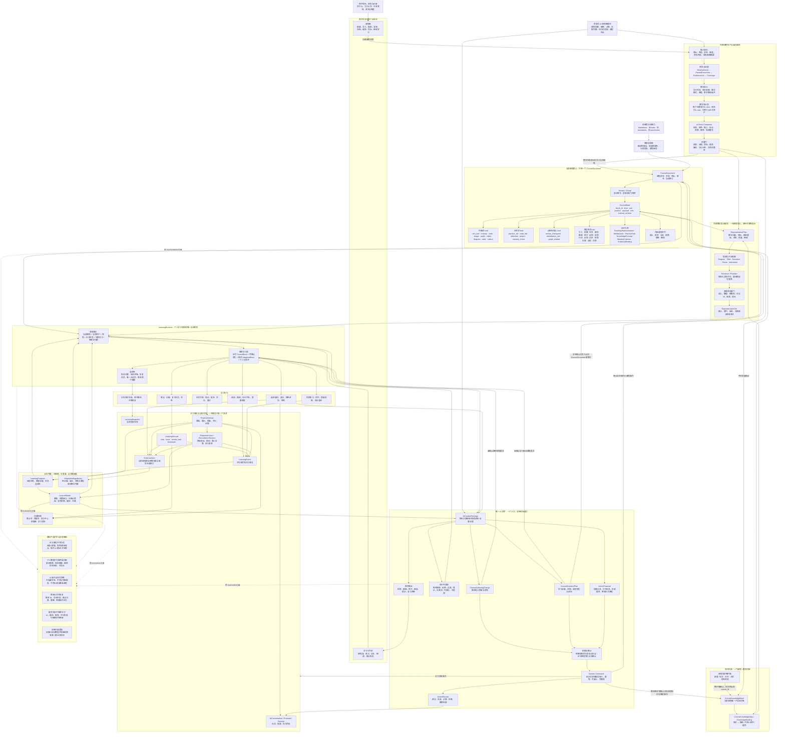

# 灵知 AI 课程系统产品总蓝图

> 本文是灵知当前产品语义的最高优先级真源。它描述目标产品，不按历史开发顺序组织。
>
> 2026-07-12 核心修正：课程不再被定义为用户可见的版本包，也不再以整节 Markdown 为本体。课程的真实结构是一个由 AI 生成并持续维护的 `CourseDocument`，内部由章节、分组和有序异构 `CourseBlock` 组成。
>
> 2026-07-17 边界修正：灵知按“结构化同源 + 课程生长”建设。两者触发来源和质量门不同，但共同维护当前课程的唯一 `CourseDocument`：教师语义修改经影响分析与确认后更新课程；学习证据编译为 `CourseEvolutionPlan`，学生确认后也以可追溯的新修订更新当前课程。学习记录和 AI 问答可按明确的正文操作自动沉淀，但正式课程变化必须可解释、可选择范围、可删除、可重做、可撤销。`CourseKnowledgeBase` 严格属于单门课程，任何运行时读取、变化或掌握判断都不得跨课程。
>
> 2026-07-18 课程生长真源修正：确认后的课程生长块直接写入当前课程唯一的 `CourseDocument`，课程正文、练习和版本不再经过学习者可见性投影。提问与笔记可以形成观察，但没有正式表现或重复一致信号时不得扩大课程改动；一次新独立任务通过只表示初步支持，至少两个不同正式任务持续通过才表示确认。
>
> 2026-07-19 首次课程生成链路修正：新课程默认且只走“需求 → 目录 → 课程生成 → 确认发布”四步生产线。提交需求视为确认第 1 步；用户确认目录后，系统先冻结全课知识职责，再按预算分批生成详细教案并确定性汇编为唯一正式全课教案，由该教案编译知识库、稳定 ID、关系图和逐节绑定。正文只消费冻结教案并按固定并发独立生成；学习先修关系不得把生产链重新串行化。教案与知识库不再作为独立用户确认门；最终发布前仍必须通过同源版本链检查。
> 2026-07-19 生成现场与学习页合并：新建课程后直接进入同一 `course_id` 的学习工作区，顶部以“需求 → 目录 → 教案与知识库 → 正文生成 → 确认发布”五个可见生产阶段解释真实内部进度，但只在目录和发布处等待用户。顶部一级视图收敛为“教案 / 课程 / 练习”，目录继续由左侧课程导航承载；生成阶段自动跟随教案或正文，用户手动切换后保持当前视图，可随时恢复跟随。发布完成后同一 URL 原地成为正式学习页。
>
> 2026-07-20 课程生产状态与界面收敛：前端使用同一阶段投影解释任务真实状态，需求提交后的资料处理、教学画像和目录准备都属于“目录”阶段；失败、暂停、冲突和待确认不得继续显示为旋转中的进行态。顶部生产条只承担五阶段定位，目录尚未形成时不显示空结构侧栏；主区把当前状态、进度、本阶段产出、已保存内容、恢复动作和技术原因放在同一平面，每项事实只表达一次。后端允许恢复时就地继续，已有正文可先查看再返回恢复现场；移动端必须一次看见五个阶段，英文模式不得泄漏后端中文恢复文案。
>
> 2026-07-19 首次生成验收边界修正：生成后不再追加 AI 评分、AI 审稿、全课 AI 一致性修复或逐题 AI 预检返工。质量由上游课程责任、知识身份、教学合同、题目答案合同和正文 Prompt 前置保证；系统只保留可解析结构、稳定 ID、引用端点、覆盖、依赖、绑定、答案可判定性和同源版本链等确定性硬门禁。模型结构输出损坏时最多定向纠正一次，不能把一般内容偏好升级为新的模型循环。
>
> 2026-07-19 教案与知识生成策略修正：一门课程只生成一套 `CourseTeachingPlan` 和一套 `CourseKnowledgeBase`。目录确认后，系统用一次整课教案调用同时确定各小节的原子知识、能力、可信易错、掌握标准、首次负责与复用位置，以及受难度、课程风格和学科模板约束的课程块职责；不再按 21 个小节调用 21 次知识生成。知识库、稳定 ID、六类关系和逐节绑定全部由系统从同一教案本地编译，不再调用独立知识索引或关系图模型。知识关系视图展示全部活动原子知识点，包括没有关系边的真实课程入口。
>
> 2026-07-19 大课教案 V3 修正：上条“一次整课模型调用”只保留为 v17 历史基线，当前真源是“一份正式教案产物”。目录确认后，系统执行 `1 → N → 1`：一次轻量全局骨架冻结知识键、规范陈述、唯一归属、复用、前置和模块边界；多个受输入、输出、小节与知识点预算约束的详细批次在课程级并发上限内展开；本地汇编器按目录顺序生成唯一 `CourseTeachingPlanV3`。每个成功批次立即保存，失败只重试当前批次，知识库和关系图仍保持零模型调用。
>
> 2026-07-20 AI 主链收敛：首次生成只让模型承担轻量目录、教案语义和正文三类不可约产出。教学画像、难度、课程块硬骨架、稳定 ID、知识库、关系图、校验、恢复和发布全部由确定性代码负责；自动教学画像不再增加目录前的模型分类调用。小课紧凑调用与大课 `1 → N → 1` 只代表不同执行预算，新写入和旧检查点恢复后的正式产物统一为 `CourseTeachingPlanV3`，V2 只保留历史读取兼容。每次必要模型请求必须先切换到真实阶段，立即失败也要准确指出目录、骨架、批次或正文。
>
> 2026-07-20 生成链自适应修正：当前主链为 `course_generation_v12 / course_prompt_v21`。20,000 字符与 7,000 mixed-language estimated tokens 是任何最终 `system + user` 请求都不能越过的最后熔断，不是大输入的正常失败方式。目录、教案和正文会按原始输入规模直接选择完整、紧凑或最小语义合同；小课紧凑调用只是快速路径，放不下、提供方失败或结构无效时自动切回标准骨架与批次链。骨架默认每片最多 6 节，详细批次仍超预算时继续拆分，无法再拆或提供方失败时只本地保底当前最小单元并标记降级与人工复核。正文只读取冻结教案并默认并发 4，单节点默认 75 秒；阶段超时保留已完成正文、草稿和恢复位置。单门课程默认最多 24 节，任何请求都不得把四万字原文传给 API，任何局部失败也不得丢弃整门课。
>
> 2026-07-18 本节课程生长修正：用户主动提出的本节调整与学习证据触发的挑战升级使用同一个 `CourseEvolutionPlan`、候选工作区、质量门和课程命令。系统先按真实教学 `role` 盘点本节：已有作用采用保留块身份的块内升级，缺失作用新增课程块；所有候选逐块保存，但只有全部候选通过本节知识同源、范围、重复和质量检查并由用户整体确认后，才在一次 `CourseDocument` 提交中同时生效。重复正式通过既是缺口判断的反证，也是提高挑战的正证据；旧难度掌握事实保留，新挑战另行复验。
>
> 2026-07-19 课程调整入口与工作台修正：学生侧统一使用“调整课程”，不再把“正文重新生成”和“课程生长”表现成两项功能。正文中的“调整这段”是同一任务的就近快捷入口，AI 老师侧栏是主入口；两处都能选择当前内容、当前小节或全课程，并写入同一 `CourseEvolutionPlan`。一项修改留在侧栏直接对比，出现两项及以上修改、跨小节影响或全课程范围时自动进入居中大尺寸审阅工作台，逐项纳入或排除后一次原子提交；完整强自述形成的“当前位置支持 + 相关后续检查”属于一个学生明确请求的生长包，例外地留在侧栏同时展示四类语义、当前与后续方案、范围选择和整体确认，避免审阅层遮断正在变化的课程目录。系统主动发现问题和学生主动提出要求复用同一候选、确认、恢复、去重、撤销与复验链；关闭、刷新或换入口后继续恢复同一未完成任务，不重新生成第二份候选。用户范围是模型不可越过的硬边界；全课程只指当前 `course_id`，正文发起块的教学 `role` 是同类扫描硬锚点。未选节点、其他教学作用、其他课程、历史作答、笔记原文和课程知识定义保持不变。
>
> 2026-07-18 课程生长判断修正：不建立独立重型 Agent，也不把复杂学习表达穷举成规则分支。现有 Workflow 在需求进入和结构盘点之间加入一次受约束的 AI 场景判断，只输出场景摘要、目标教学作用、难度差异和资料要求；系统继续决定真实块的升级或新增，并控制同源、确认、提交、撤销和复验。模型不可用或输出非法时按同一契约回退到确定性规则。涉及最新或前沿事实时必须提示可信时效资料，模型记忆不得冒充当前行业证据。
>
> 2026-07-18 课程编排修正：课程创建中的“教学风格”不再表示学术、幽默等文案语气，而是独立的课程块编排偏好。学科教学结构先保证必需模块，编排偏好再调整推演、案例、应用、项目和探究块的分布与节奏；目标难度随后选择分步示范、带支架练习、学科高阶模块或迁移挑战等难度配方，并把挑战、支架、自主性和迁移距离投影到每个块。全课教案只能在这套模板基线内做局部选择和强调，课程内容审阅必须能够追溯实际块配方。
>
> 2026-07-15 多模态扩展：图解、幻灯、音频、动画、模拟和视频不另建课程，而由 `RepresentationPlan` 从同一课程语义编译为 `TeachingRepresentation / RepresentationSet`。表现编辑只修改表示，语义编辑回到课程变化候选；高成本表示按需生成并具有确定性降级。

## 1. 一句话定义

灵知是一套以可编译为多种教学表达的结构化同源课程为学习现场、以学习事实为证据底座、以 AI 课程智能体驱动个人课程持续生长的个人 AI 学习系统。

它解决的不是“让 AI 写一篇长文章”，而是以下完整问题：

- 把用户目标、资料和约束编排成真正可学习的课程。
- 让文本、公式、代码、图片、视频、图表、题目和复习自然穿插在同一条学习流中。
- 让同一知识从共同语义真源编译为图解、幻灯、音频、动画、模拟和视频，并依据当前任务与证据选择表达。
- 把阅读、提问、笔记、作答、错因、复习和恢复沉淀为可信学习事实。
- 基于事实形成可解释的学习者模型，而不是让 AI 凭印象判断用户。
- 由一个 AI 助手在不同现场提供解释、提示、诊断、补救、复习和课程改进。
- 让课程知识、正文、目标、题目与学习证据使用稳定引用联动，而不是复制多份文本维持一致。
- 让单条强证据触发局部调整、跨位置稳定证据触发广域候选，并由用户决定是否写入当前课程的新修订。
- 即使 AI、媒体或评分服务暂时失败，确定性的学习主链仍然可用。

## 2. 产品总控图



这张图表达的主链是：

```text
用户目标与资料
→ AI 生成并质量校验当前课程
→ 稳定 CourseBlock 教学流
→ 从共同语义按需编译并挂载多种 TeachingRepresentation
→ LearningRuntime 组成个人学习现场
→ 阅读 / 提问 / 笔记 / 作答 / 复习
→ 学习事实
→ 学习者模型
→ 当前课程原始证据与可解释适应假设
→ AI 助手回答并沉淀正文学习记录、自动插入低风险临时教学块，或生成课程生长方案
→ 学生接受 / 拒绝 / 重生 / 调整范围
→ 课程领域命令把确认变化写入当前 CourseDocument 新修订，CourseKnowledgeBase 未经独立知识门禁保持不变
→ 对修改后的学习效果继续取证
→ 用后续正式证据评价内容变化与表达选择
→ 新的学习行为
```

## 3. 核心产品修正

### 3.1 不再把课程设计成版本包

产品层只有一门当前课程。用户直接学习，并通过目标、资料、反馈和自然语言表达改进意图，不需要手工编辑教学块，也不需要理解 `cv1 / cv2`、候选版本或版本迁移页面。AI 修改课程时，用户只审阅原位置的具体差异、理由、证据和作用范围，不管理整份课程版本。

技术层仍允许保留：

- `course_revision`：防止并发覆盖。
- `block_revision`：冻结作答、锚点和引用所依据的内容。
- `CourseOperationLog`：支持审计、撤销和故障恢复。
- 块墓碑与 ID 映射：保证块被删除、拆分或合并后，历史记录仍可解释。

这些都是用户不可见的修订信息，不构成另一套课程产品。

### 3.2 不再把完整 Markdown 当作课程真源

Markdown 只承担三种作用：

- `rich_text` 块的内容格式。
- 旧课程的导入与兼容格式。
- PDF、Markdown 等导出载体。

课程的真实结构固定为：

```text
CourseDocument
└── Section / Group
    └── ordered CourseBlock[]
```

### 3.3 展示位置与领域归属分离

题目、复习、知识库视图和媒体可以出现在课程流中的任意合适位置，但它们各自的正式状态仍归所属领域：

- `PracticeBlock` 引用正式 `PracticeTask`；作答归 `PracticeAttempt`。
- `ReviewCheckpointBlock` 保存复习范围与规则；个人到期状态归 `LearningRecord / LearningEvent`。
- `KnowledgeBlock` 引用当前课程知识节点和当前课程映射；个人掌握只作为覆盖层显示。
- `MediaBlock` 引用 `MediaAsset`；课程块不复制二进制文件。

学习页面始终只有一条课程正文流。正式任务在原位置以可扫读的 `CourseBlock` 预览存在，至少说明任务类型、题量或目标、首个任务摘要和保存语义；点击后打开临时学习工具。预览块不内嵌第二份答案或进度，关闭工具必须返回原正文锚点、原滚动位置和原任务状态。

```text
正文中的 CourseBlock 预览
-> 点击开始 / 继续 / 查看结果
-> 桌面居中 TaskOverlay / 移动全屏任务
-> 自动保存、提交或关闭
-> 回到原 CourseBlock
```

练习、掌握、诊断、补救、复习、图谱和代码实验可以拥有完整工具组件，但不得成为与正文平级的顶部栏目、永久分栏或第二条学习路线。桌面端使用居中覆盖弹窗，不使用右侧半屏抽屉；从正文块进入时可用来源到弹窗的连续过渡，从 Dock 或恢复提示进入时使用普通淡入。移动端使用全屏工具；工具内部状态仍归正式领域对象，不写回课程块副本。

展示规则固定为：

| 块类型 | 正文中长期显示 | 点击后临时展开 |
| --- | --- | --- |
| `practice_ref / mastery_check` | 标题、题量或目标、预计用时、进度、结果摘要 | 正式作答、提示、评分、重试与历史 |
| `review_checkpoint / remediation_slot` | 到期或触发原因、范围、当前状态 | 复习、诊断、补救与独立复验 |
| `code_lab` | 任务说明、运行状态与结果摘要 | 完整编辑器、运行器和调试工具 |
| `knowledge_embed` | 与当前位置有关的当前课程知识及教学绑定 | 本课程知识探索、能力/易错/掌握标准与个人状态覆盖 |
| `reflection / project` | 简要任务、提交状态与产出摘要 | 长表单、编辑器、附件和提交 |
| 内容与媒体块 | 内容本身 | 仅在缩放、全屏播放等确有需要时展开 |

### 3.4 以 3 月版本为体验基线

当前学习体验以 2026 年 3 月版本的交互语法为基线，代码参考点为 `9ae4cc7`：课程目录和连续正文保持稳定，题目、统计、笔记详情、知识库、图片查看和阅读设置从当前上下文临时展开，关闭后继续原来的学习现场。

升级目标不是用新功能重做一套页面，而是在这套体验上替换更强的正式内核：

```text
3 月版稳定体验
+ 当前 CourseDocument / CourseBlock
+ 正式 PracticeAttempt、学习事实与 LearningRuntime
+ 更强但受边界约束的统一 AI 助手
= 当前目标产品
```

继承的是空间秩序和操作连续性，不是机械复制旧实现。以下人工修正优先于 3 月版本：

- 视觉上以 `9ae4cc7` 的真实组件和样式为源码级基线，保留浅色渐变背景、玻璃外壳、柔和阴影、较大主容器圆角、indigo 品牌色和章节卡层级；新功能只能嵌入这套语言，不能借“现代化”另起一套视觉系统。
- 顶栏优先继承旧版紧凑品牌标识、轻巧图标按钮和柔和悬浮反馈；新版只贡献更规整的三段布局、真实课程上下文和更高的信息密度，不能退化成通用后台工具条。
- 左侧目录优先继承旧版章节书本图标、纵向虚线脉络、圆点节点、柔和选中面和可识别的章节节奏；新版只贡献搜索、紧凑行高、阅读状态和掌握状态。当前小节可以继续展开为按正式 `CourseBlock` 顺序排列的三级导航，用“教学角色 + 块标题”直接定位例子、推导、练习、易错点和检查等正文位置；点击只滚动到同一连续正文锚点，正文滚动反向同步当前块。普通状态只展开当前小节，搜索时才临时展开匹配块，移动端同一时间也只保留一个小节的块级目录；不得默认铺开全课课程块、展示正文摘要或把块导航做成第二套课程结构。高密度不能以抹平层级和视觉性格为代价。
- 课程创建弹窗继承旧版“纵向难度列表 + 可扫读图形选项”的核心选择节奏，课程主题、难度与课程编排偏好构成第一阅读路径；编排选项必须直接说明会增加或组织哪些课程块，不能再用学术、幽默等文案形容词冒充课程结构。教学结构、课程目的和资料边界保留为第二层课程策略，不能再与难度拼成左右控制台。
- 正文教学块通过留白、角色标签和标题层级形成节奏，不在相邻块之间重复绘制整行横线，也不渲染内容中的装饰性 `hr`。`小结` 等承担段落收束作用的标签必须比普通元数据更醒目，并与对应标题共同形成清晰的结束节点。
- 首页改成铺开一门门课程的课程架，不继续把全部课程塞进学习页左栏。
- 固定笔记列退出，手写便签和 AI 问答摘要进入正文个人记录块；原文标记、末尾图标和按需浮层只承担锚点与聚合入口。
- 桌面端把整个课程块作为块级 AI 的感应区：鼠标进入后，直接在块左侧留白轨道显示“解释 / 举例 / 简化 / 提问”四项操作，不再先显示星光按钮、不覆盖正文；进入操作区后保持展开，离开课程块与操作区后延迟收起，避免跨越间隙时闪烁。键盘聚焦课程块时显示同一操作区；触屏端因无 hover 仍保留轻量点击入口。它们在来源块下方形成同一个正文问答记录块，连续追问按轮次叠加在这个块内，不覆盖已有问答。具备课程编辑能力时，“改进正式正文”使用块右上角独立低权重入口进入既有候选工作区，不混入学生菜单。回答标题必须标明来源块，正文统一按“短讲义”组织阅读层级：用节制的标题引导线、段落间距和轻量清单区分解释、要点与例子，不套大卡片、不让装饰性横线贯穿整栏。完整回答自动更新同一锚点的 `LearningRecord`，允许“继续追问 / 重新生成 / 删除”；“重新生成”先让用户补充本次要求，再用新结果替换该记录的回答版本，不把改写伪装成追问。删除只撤销该个人记录，不删除课程正文；“已解决 / 还不清楚”写入 `LearningEvent`，但不单独触发出题、掌握结论或正式课程改写。全局 AI 只作为历史会话、跨块问题和低频兜底入口按需展开，不恢复 AI 浮球或第二套会话状态。
- 旧版横跨整页、混合 AI 出题与本地错题的六按钮 SmartBar 退出；保留它“正文下方低频学习工具坞”的空间价值，在中间工作区底部聚合学习记录、当前正式练习、学习统计和知识库。块级 AI 从正文原位进入，全局 AI 与正式任务仍保留并行入口；不同入口引用同一会话或正式任务，不复制状态。
- `LearningContinuation` 继续作为统一学习连续性投影，但不再渲染为正文顶部常驻状态栏目。前端只把真实存在的 `resume_*` 阅读、草稿或正式任务显示为“继续未完成”提示；目录、练习、记录、统计、知识库和 AI 保持并行工具关系，不把内部动作优先级包装成“唯一下一步”。只有课程版本冲突、数据迁移失败等真正阻断学习的情况才允许临时阻断界面。
- 旧本地错题、临时 AI 出题和页面 Store 不再充当正式业务真源。

视觉继承不等于保留旧实现中的全部成本。嵌套 `backdrop-filter`、重复渐变、重复 token 和影响滚动性能的模糊层可以重写，但同视口下的颜色、圆角、层级、密度与阅读节奏必须保持旧版身份。

涉及导航层级、功能常驻位置、正文嵌入或覆盖层、AI 主动程度、自动写入、用户确认和旧功能去留等产品边界时，AI 只能列出证据、方案和影响，不得替用户定案。用户确认后才能进入正式蓝图和实现；普通代码组织与不改变体验的技术修复不重复上升为产品决策。

### 3.5 教学块由 AI 编排，不提供学生工作台

`CourseBlock` 是课程生成、难度设计和运行时适配的内部表达，不是要求学生掌握的编辑工具。学生不通过拖拽画布手工设计教学顺序，因此产品不提供课程工作室或学生块编排器；但 AI 可以根据证据提出任意合法结构变化，用户在原课程语境中审阅和确认。

用户只需要：

- 在创建课程时说明目标、资料、用途、难度感受和课程编排偏好；用户选择的是智能均衡、理论推导、案例实战、项目驱动或问题探究，不需要理解内部模块权重。
- 在学习时通过作答、提问、笔记和反馈形成证据；提问与笔记可以形成观察，但在缺少正式表现或重复一致信号时不能单独触发广域修改，停留与滚动更不能独立触发正式课程变化。
- 在任一课程块主动选择解释、举例、简化或提问；稳定回答自动进入正文，用户可以继续追问、按补充需求重新生成或删除。
- 审阅 AI 高亮的课程变化，查看调整理由和范围，选择接受、拒绝、重新生成、补充要求或调整目录范围。

AI 负责按“学科必需模块 + 课程编排偏好 + 节级难度投影 + 资料证据边界”把这些信息编译成教学块节奏。学科必需模块不能被偏好删除；每个模块实例保留块角色、编排来源和块级难度契约。系统同时保留三条不同结果路径：

1. **正文学习记录**：用户便签和完成的块级 AI 回答按当前明确操作自动保存为 `LearningRecord`，投影在来源内容附近；可删除、可重新生成，不复制课程正文。
2. **临时适配**：系统主动给出的反例、过渡、提示和非正式理解检查可以在当前现场出现，不写入正式课程。
3. **课程生长方案**：AI 可以规划解释、例子、桥接、检查点、补救路径、难度支架、教学方式和后续章节节奏；方案长期高亮保留，只有学生确认后才通过课程领域命令写入当前 `CourseDocument` 新修订。

AI 的观察和规划范围可以很高，但不得替用户确认正式课程变化。系统必须先区分观察、可行动缺口和已确认缺口：普通提问与笔记保持观察；一次可靠正式失败可把同一能力上的多源观察提升为局部候选；用户非常明确的强自述可以直接形成低风险局部候选；跨章节或全课程候选必须来自用户明确的广域指令，或多个独立位置的一致正式证据。系统不得把固定“三次”当作通用硬门槛，也不得把三种来源的数量机械当作充分性。

临时适配必须满足：

- 有触发依据，能够说明是由哪次作答、提问、反馈或已确认缺口触发。
- 贴着相关内容出现，不跳转新页面，不改变左侧课程结构。
- 明确属于“仅本次学习”的临时教学内容，可跳过、可收起，不冒充正式课程内容。
- 不直接改变正式题目、掌握事实或课程顺序。
- AI 服务失败时自动消失，原课程仍可继续学习。

课程生长方案必须满足：

- 显示“AI 新增/修改”、前后差异、调整理由和调整范围。
- 支持选区、段、块、小节、章节、多个目录节点和当前全课程范围。
- 未确认时跨刷新与退出持续保留；确认后以一个原子操作组产生新的课程修订。
- 用户可以接受、拒绝、重新生成、补充要求、部分接受和撤销已接受操作。
- 应改的位置发生真实变化，无关位置保持不变；删除、重做和撤销都产生可追溯的新修订，不覆盖历史。
- 接受后的课程生长块写入当前课程唯一的 `CourseDocument`；正文、正式练习和课程版本直接读取该文档，不再维护按学习者区分的课程投影。
- 接受时冻结调整前证据、原错误任务、目标知识与能力、影响范围和插入块，后续效果只与这份基线及新独立任务比较，不能让旧错误题重做或动画播放冒充改善。
- 一道不同正式任务通过只标记“本轮独立复验通过 / 初步支持”；至少两道不同正式任务持续通过才标记“持续证据已确认”。被动观看、切换关键帧和点击开始复验只登记过程接触。
- 课程知识库默认只作为本课程内的依据；若变化涉及知识定义、关系或掌握标准，必须转入独立知识维护门禁，不能由学习证据静默改写。

### 3.6 笔记与 AI 问答回到正文现场

笔记不是脱离课程的侧栏卡片，选区提问也不应只留在聊天历史。它们都应回到理解发生的位置，成为当前用户课程流中的个人记录块：

```text
稳定 CourseBlock
+ 持久待确认 CourseEvolutionPlan 投影
+ 临时 AdaptiveBlock
+ 持久 InlineLearningRecordBlock
= 当前用户看到的完整正文流
```

`InlineLearningRecordBlock` 只是 `LearningRecord` 的正文投影，不复制第二份笔记真源，也不写入基础 `CourseDocument`。它承载两类内容：

- 手写便签：用户选择正文后直接在锚点附近输入，自动保存为个人 `note`。
- AI 问答沉淀：用户主动发起的块级 AI 回答完成后，系统自动把稳定回答保存为带 `source=ai_qa` 的个人 `note`，并保留会话、来源内容块和回答版本引用；后续追问更新同一记录。

排版规则：

- 短便签在宽屏可以作为正文旁的轻量便签，正文围绕它自动重排；不保存像素坐标。
- 长笔记、代码、公式和 AI 问答摘要使用完整正文宽度，避免窄栏阅读和复杂环绕。
- 移动端全部回落为块级顺序，禁止浮动、遮挡和横向溢出。
- 原文保留轻量选区标记，记录块紧邻所属段落；课程内容变化后继续使用语义锚点迁移。
- 同一选区的一次连续 AI 对话只维护一个问答沉淀块，追问按轮次追加且保留上文，不拆成多张独立卡片；只有用户主动选择“重新生成”并补充需求时，才用新结果覆盖选中的回答。

保存边界：用户在正文块上主动选择解释、举例、简化或提问，即授权系统在回答完成后自动创建或更新该锚点的 `LearningRecord`；流式中间片段不保存，失败回答不覆盖上次稳定版本。保存后必须允许编辑、折叠、删除、重新生成或撤销。普通全局聊天、AI 主动提醒和未形成稳定解释的中间输出不得自动写成正文记录。

### 3.7 结构化同源与个体化生长

灵知后续 AI 能力由两条独立触发主线统领；它们共享单门课程的知识坐标、课程命令和修订底座，但不共享判断门禁：

- **结构化同源**：服务教师和课程维护者。课程结构、课程知识、目标与题目各有唯一真源；一次经确认的语义修改通过 `CourseAuthoringChange`、课程领域命令和派生依赖图联动正文、讲义、PPT 与练习。
- **课程生长**：服务当前学习者。每条用户输入都可登记为原始证据，但普通提问与笔记先保持观察；只有正式表现、重复一致信号或明确强自述达到门禁后，才形成 `AdaptationHypothesis / CourseEvolutionPlan`。学生确认后通过同一课程领域命令写入当前课程的 `CourseDocument` 新修订，反证可以触发缩小、撤销或替换。

两者的共同目标不是把两套状态生硬合并，而是持续维护同一门当前课程。教师修改由教学语义影响分析门禁控制；学习驱动修改由证据充分性、范围合理性和学生确认门禁控制。两者最终都提交版本化课程命令，因此不会形成“基础课 + 个人叠加课”两套长期正文，也不会维护按学习者分叉的课程版本。学习证据不得绕过计划和确认直接改写课程，也不得修改其他课程或静默改写课程知识库。

两条主线使用同一套可解释变化语法，但不合并判断状态机。教师在 PPT 中修改学习目标时，系统先识别“计算技能 → 概念理解”等教学语义变化，分别列出应联动和保持不变的课程单元，确认后更新当前课程并安全重建派生表达。学生侧由提问、学习记录和正式作答等证据共同定位缺口，但提问与记录本身只形成观察，可靠正式失败才允许扩大候选范围；方案从紫色待确认进入蓝色已应用，经过同知识或能力的新独立任务后进入绿色支持状态，并以文字区分“一次任务的初步支持”和“多个不同任务的持续确认”。候选内容播放、阅读、切换动画帧或点击完成本身不计掌握。

学生侧正式采用一条“调整课程”链，而不是“正文重新生成”“用户手动调课”和“证据适配”三套功能：`用户明确要求 / 系统发现问题 → 用户进入候选状态 → 选择当前内容、当前小节或全课程 → AI 场景判断（失败则规则保底）→ 字段白名单与范围边界 → 盘点真实课程块 → 已有块 REPLACE、缺失块 INSERT → 逐块候选检查点 → 知识同源与整组质量门 → 用户确认 → 单次原子课程提交 → 受影响教学表达重建 → 独立复验`。AI 只负责理解难以穷举的语义，不能指定块 ID、扩大范围、选择课程版本或确认结果；系统始终根据真实 `CourseBlock.role` 决定具体动作。正文快捷入口和 AI 老师主入口共享同一服务端任务；一项候选在侧栏直接处理，两项及以上、跨小节或全课程候选进入居中工作台。完整强自述形成的多块生长包在侧栏以一个整体方案处理：四类学习语义、当前位置与相关后续、范围缩小选项和整体确认必须与课程目录同时可见，详细操作仍能在同卡片内展开。用户能够看到哪些内容保持不变、哪些块被升级、哪些块是新增，以及为什么这样改。正式提交前，当前课程正文不发生变化；提交后，历史作答、笔记和旧难度掌握记录不被覆盖。

用户主动要求的空间范围与语义目标必须分层处理：用户先给出 `current_section / whole_course` 硬边界，AI 只能在边界内解释需要调整的教学 `role`，系统再把 `role` 映射到真实块。全课程候选仅升级当前课程中已经存在的匹配块；每项候选拥有稳定操作 ID、所属小节、前后预览和独立审阅决定。部分接受不是多次零散写入，而是先保存勾选集合，再把所有被接受操作作为一个逻辑课程操作组提交；服务端拒绝方案外 ID 和空集合，回执同时记录接受与排除项，撤销只补偿实际应用的操作。

挑战升级的效果由后续更高难度独立任务直接判断，不以是否点击过生长块作为前提：一道不同任务通过只表示初步支持，至少两道不同任务持续通过才表示确认；更高挑战连续失败只触发缩小跨度或增加支架，旧难度已经形成的掌握事实继续保留，不能被重新解释为原知识点缺口。

学习现场统一采用四种变化状态：黄色表示课程维护中受到影响的位置，紫色表示 AI 提出的待确认课程变化，蓝色表示已应用但等待正式复验的课程变化，绿色表示后续独立证据支持该变化；绿色内部继续区分初步支持和持续确认，不能把一次通过写成因果证明。后续证据显示无效或有害时改为橙色待复核。颜色只表达变化生命周期，不取代文字、图标和读屏状态。

灵知实行“一门课程一套知识库”：`CourseKnowledgeBase` 是当前课程唯一的产品知识库和运行时知识坐标，内部以“章节 / 小节路径引用 → 概念组 → 原子知识点 → 能力点 / 易错点 / 掌握标准”组织，知识点之间只保留能驱动教学动作的前置、推导、等价、对比、应用和一般化关系。`CourseKnowledgeMap / KnowledgeBinding` 连接知识与课程块、目标、课件和题目。知识 ID、关系、掌握状态、生成校准和变化影响都以当前 `course_id` 为硬边界；系统不建立供多门课程共同读写的产品知识库，也不把一门课程的知识变化扩散到另一门课程。

难度必须同时落实为课程块配方和块内要求：入门增加分步示范与带支架练习，高阶按学科增加证明、测试、实验设计、材料辨析、数据分析或迁移挑战；每个块再体现相应的知识颗粒度、抽象程度、推导完整度、支架、任务复杂度、知识跨度、节奏、反馈频率和掌握独立性。难度不能只表现为文字更长、术语更多或题量增加。

完整需求与实施契约见 [`docs/requirements/灵知AI课程智能体需求文档.md`](requirements/灵知AI课程智能体需求文档.md)、[`docs/requirements/灵知课程知识库结构与关系网络设计.md`](requirements/灵知课程知识库结构与关系网络设计.md) 和 [`openspec/changes/build-structured-adaptive-course-ai/`](../openspec/changes/build-structured-adaptive-course-ai/)。

### 3.8 多模态同源与教学表达编译

多模态不是在课程外增加图片、音频、PPT 和视频生成器，而是让同一个结构化课程块拥有多种可选择、可追溯、可验证的教学表达。`CourseDocument / CourseBlock` 继续是课程语义与顺序的唯一真源；图解、幻灯、讲解音频、结构化动画、交互模拟、视频和数字人均作为 `TeachingRepresentation` 挂回原块，不复制课程树、正文、知识、题目或学习状态。PPT 在产品界面上使用课程顶栏一级入口和独立全屏工作台，在数据上仍读取同一 `SlideDeckSpec`、来源绑定与派生注册表；“独立工作台”只解决备课和授课空间，不意味着建立第二课程真源。

生产链固定为：

```text
CourseBlock + CourseKnowledgeBase 相关子图 + KnowledgeBinding + LearningObjective + EvidenceUnit
→ RepresentationPlan：教学问题、表达理由、目标、范围、成本、质量和降级要求
→ DiagramSpec / SlideDeckSpec / NarrationSpec / SceneSpec / InteractionSpec
→ 结构化渲染器或可替换媒体提供方
→ 语义、教学、数理、跨模态、可访问、来源和成本质量门
→ RepresentationSet + MediaAsset
→ LearningRuntime 按当前任务、学习证据、设备和约束选择或组合
```

多模态生成按成本与可靠性分级：基础文本、公式、代码和正式题目先保证可用；图解和图表优先；幻灯、TTS 和结构化动画按计划或按需生成；交互模拟只用于确有因果、空间和实验价值的内容；自由视频和数字人最后接入，且不得成为精确知识的唯一表达。对数理、代码、数据和关系内容，确定性图形与可执行结构优先于自由像素生成。

媒体双向编辑必须区分表现与语义：颜色、版式、镜头、语速只形成表示修订；定义、例子含义、知识顺序和目标变化必须解析为 `ChangeOperation` 候选，显示理由、范围和依赖影响，用户确认后才修改课程真源并使相关表示进入 `stale`。无法判断的修改保持待解释，禁止静默反写课程。

个体选择依据知识形态、教学 `role`、目标、当前课程证据、设备、无障碍与成本，不建立固定“视觉型/听觉型”学习风格。观看、点击和单次偏好只作为弱证据，必须与正式作答、诊断和独立复验共同判断表达效果。

详细市场、开源移植、目标架构、质量门和实施路线见 [`docs/research/multimodal-course-generation-landscape-and-lingzhi-integration-2026-07-15.md`](research/multimodal-course-generation-landscape-and-lingzhi-integration-2026-07-15.md)。

## 4. 四层产品模型

### 4.1 实体层

| 实体 | 负责什么 | 明确不负责什么 |
| --- | --- | --- |
| `Course` | 课程身份、所有权、生命周期、当前修订 | 不保存用户作答、笔记和掌握状态 |
| `CourseDocument` | 当前课程结构、章节、块顺序和课程级契约 | 不保存另一份用户可见历史版本 |
| `CourseBlock` | 一个可排序、可引用、可交互的教学单元 | 不复制正式题目、用户复习状态或媒体文件 |
| `MaterialAsset / EvidenceUnit` | 原始资料、解析结果、证据来源和覆盖关系 | 不证明用户已经掌握 |
| `MediaAsset` | 图片、音频、视频、附件及替代文本、字幕、来源、许可和提供方元数据 | 不承载教学语义、课程顺序或学习状态 |
| `TeachingRepresentation / RepresentationSet` | 同一课程语义的一种教学表达，以及默认、替代、组合和降级关系 | 不复制课程正文，不成为第二课程真源 |
| `RepresentationPlan / DiagramSpec / SlideDeckSpec / NarrationSpec / SceneSpec / InteractionSpec` | 说明为什么生成、怎样表达及如何被结构化渲染和验证 | 不直接成为正式课程内容或个人掌握事实 |
| `AssetDerivationGraph` | 记录课程修订、表达规格和媒体资产之间的派生、陈旧与重建关系 | 不替代课程命令或保存另一份语义正文 |
| `GenerationJob / GenerationProvider` | 统一承载多模态规划、渲染、提供方调用、恢复、成本和降级 | 不决定课程结构，不直接修改学习事实 |
| `LearningObjective` | 可验证学习目标及其课程位置 | 不等于完成状态 |
| `CourseKnowledgeBase / ConceptGroup / KnowledgePoint / SkillUnit / Misconception / MasteryCriterion / KnowledgeRelation` | 当前课程唯一产品知识库；组织概念组、原子知识点、能力、易错、掌握标准及六类语义关系 | 不复制章节真源，不保存个人掌握，不创建跨课程共享身份 |
| `CourseKnowledgeMap / KnowledgeBinding` | 课程知识与章节、小节、课程块、目标、课件、图解、题目和记录之间的教学作用与精确引用 | 不复制正文，不用整节全部知识替代真实考查点 |
| `SubjectKnowledgeLibrary`（历史兼容） | 只用于读取旧数据并迁移到具体课程 | 不进入新课程生成、运行时推理或跨课程共享；迁移完成后退出生产主链 |
| `PracticeTask` | 正式题目、评分规则与用于验证掌握标准的任务 | 不保存用户答案，不替代知识库中的 `MasteryCriterion` |
| `PracticeAttempt` | 一次正式作答、提示、提交、评分和证据 | 不复制成错题文本仓库 |
| `LearningEvent` | 不可改写的学习行为事实 | 不保存可编辑当前笔记 |
| `LearningSnapshot` | 当前恢复位置、草稿和活动任务引用 | 不代替事件历史 |
| `LearningRecord` | `note / issue / review_task / bookmark` 当前对象；`note` 可来自手写或结构化 AI 问答摘要 | 不存正式作答和掌握结论 |
| `DiagnosticCase / RemediationSession` | 错因验证、最小补救和独立复验 | 不因一次错误直接创建稳定弱点 |
| `EvidenceItem` | 当前课程中用户输入与正式学习对象的可追溯原始证据索引 | 不复制全文，不直接等于稳定画像或掌握事实 |
| `AdaptationHypothesis` | 基于证据形成的有范围、有反证、有置信度的教学适应判断 | 不直接写入 `LearnerModel` 或正式课程 |
| `CourseAuthoringChange / AuthoringOperation` | 教师或课程维护者对当前课程语义的结构化候选、影响与确认 | 不绕过课程领域命令，不静默改写课程知识库 |
| `CourseEvolutionPlan / CourseEvolutionOperation` | 当前课程内由学习证据驱动的解释、支架、检查、方法与节奏变化 | 未确认只作候选；确认后写 `CourseDocument` 新修订，不跨课程、不直接改知识库 |
| `LearnerModel` | 基于事实的掌握、缺口、偏好和节奏投影 | 不是隐藏的 AI 记忆仓库 |
| `LearningRuntime` | 一次读取形成当前学习现场、活动任务、恢复事实和内部动作投影 | 不建立新的状态仓库，也不决定前端只能显示一个操作 |
| `AIConversation / Proposal / Receipt` | 对话、动作提案、确认与执行结果 | 不直接成为笔记、画像或掌握事实 |

笔记本、错题本、复习中心、掌握图和学习报告是功能视图，不是新的底层实体。

### 4.2 功能层

#### 课程库

- 新建空白课程、AI 生成课程、导入 Markdown 或复制已有课程。
- 搜索、筛选、归档、恢复、删除和导出课程。
- 首页直接铺开一门门课程，形成可扫描的课程架；课程卡优先显示名称、节点数量和真实生成状态，不把生产工具或伪造的“继续”文案堆进课程卡。
- 课程架上方最多显示一个最近的真实断点恢复入口，只在存在阅读位置、答案草稿或活动任务快照时出现；到期复习和其他能力仍通过并行工具进入。
- 删除默认先软删除；永久删除前展示课程内容、资料绑定和个人学习事实的影响范围。

#### 课程创建与内部维护

- 从课程库进入简洁创建流程，配置目标、用途、学科、难度感受、课程编排偏好和资料用途。课程编排偏好只控制课程块角色、分布和节奏，不控制 AI 老师人格、页面排版或正文措辞。
- 上传教材、课件、题库、图片、音频、视频和其他资料，AI 负责语义生成，确定性服务负责结构、引用、绑定和版本链检查。
- 用户提交后立即进入与该课程卡绑定的“生成现场”，看到“需求、目录、教案与知识库、正文生成、确认发布”五个可见生产阶段；它们解释真实内部进度，不等于五个人工确认门。用户只在目录和最终发布处操作。生成现场直接复用学习工作区的左侧目录、中间教案/正文和顶部一级视图，不建立独立课程工作室；任务中心只保留跨课程总览、暂停、取消、恢复和错误处理。
- 生成现场与正式学习页使用同一 URL、同一课程目录和同一正文容器。顶部只保留“教案 / 课程 / 练习”：目录在左侧导航中展开，练习在发布前可见但禁用；教案阶段默认展示全课教案占位与真实返回结果，正文阶段默认展示当前生成小节。用户手动选择视图或节点后停止自动跳转，并通过“跟随生成”恢复。
- 一次提交拥有稳定请求号；网络重试、重复点击或响应丢失只能返回原任务和原课程，用户关闭后重新创建才使用新请求号。
- 正文生成必须像 AI 回答一样逐段出现：左侧课程目录分别显示等待、生成中、草稿完成、结构检查中、已定稿和失败状态，中间区域流式展示当前选中章节的真实正文增量；多个章节并行生成时分别维护内容流，不能把增量混成一篇滚动日志。
- 用户可以跟随当前正在生成的章节，也可以固定查看任一已产出章节；关闭生成现场后任务继续运行，从课程卡可随时返回同一现场，刷新或重连后从服务端草稿检查点恢复，而不是从本地百分比猜测进度。
- 流式正文明确标记为“AI 草稿”，只有节点结构与引用检查完成后才变为“已定稿”；整门课程通过最终发布预检后才发布为正式 `CourseDocument / CourseBlock`。生成过程展示的是可验证阶段、资料处理结果和课程内容增量，不展示或伪造模型隐藏推理。
- 正式题目、知识结构、掌握标准、可信易错和补救资产由同源合同自动建立，并经过确定性结构、引用和答案可判定性检查。
- 新课程先以“全局知识职责骨架 → 有界详细教案批次 → 本地确定性汇编”生成当前 `course_id` 的唯一正式全课教案，再从同一计划本地编译 `CourseKnowledgeBase`、稳定 ID、六类关系和精确教学绑定；生成与发布不得读取跨课程知识参考，也不得另行调用知识或图谱模型。
- 全课教案必须保存规范化课程编排画像、全课块角色分布和每节有序模块实例；每个模块实例说明来自学科必需、学科可选还是编排偏好，并带本节具体教学职责和难度摘要。它是课程正文的内部合同，不再单独等待用户确认；用户在完整课程审阅时一起判断实际课程化结果。
- 新课程基于知识形态、教学作用和目标形成 `RepresentationPlan`；当前课程先发布，高成本表示按需生成，不能因视频、动画或数字人失败阻断课程。
- 生成失败或资料不足时只展示可理解、可处理的问题，不把内部蓝图、块顺序和质量矩阵抛给学生修理。
- 取消未发布任务必须同时停止后台写入并清理任务专属工作区与课程外壳；清理已发布任务不得删除正式课程。课程库只展示正式课程或仍有真实任务承接的生成外壳，失联历史外壳保留审计但不伪装成 0 节点课程。
- 用户可以通过自然语言要求“讲得更慢”“多举例”“增加代码实践”或重新生成，但不手工拖动教学块；正式课程修改仍需明确确认。

#### 学习工作区

- 按课程顺序渲染文本、公式、代码、图片、视频、图表和交互任务。
- 保留左侧课程目录、中间连续正文、右侧 AI 助手的稳定空间语义，不设置阅读、练习、掌握、蓝图和版本等顶部平级模式。
- 在原位置显示理解检查、正式练习、代码任务、反思和项目预览；正式练习先展示题量与首题摘要，点击后由正文块展开为桌面居中弹窗或移动全屏任务，关闭后反向返回原位置。
- 选中内容问 AI、记笔记、标记问题、创建复习任务或书签。
- 有可靠锚点的手写便签和 AI 问答摘要直接进入正文个人记录层：短内容宽屏环绕，长内容完整占行；不恢复固定笔记栏。
- 在复习检查点处理当前用户的到期内容，不把其他用户的复习状态写进课程。
- 并行查看当前练习、学习记录、知识结构、掌握覆盖、章节结果和 AI 老师；存在真实中断事实时，额外显示轻量“继续未完成”提示。
- 跨设备恢复阅读位置、答案草稿、活动任务和诊断补救现场。
- 原位显示行级和块级 AI 候选，目录显示后续章节待确认变化，并允许用户按目录节点调整范围。
- 在原课程块查看当前默认、替代和无障碍教学表达，按需生成“换一种讲法”；表达仍绑定原块、目标、知识和资料，不进入独立媒体仓库心智。
- 未确认候选可以持续显示和用于阅读，但必须保持 AI 身份；其中的非正式检查不得自动形成掌握证据。

#### 笔记本、错题本、复习中心与知识库

- 笔记本：`note / issue / bookmark` 的聚合和检索视图。
- 错题本：失败 `PracticeAttempt + DiagnosticCase + RemediationSession` 的投影视图。
- 复习中心：`review_task`、到期状态、历史复习事实和可用复习材料的视图。
- 课程知识库：每门课程拥有唯一可继续细化的 `CourseKnowledgeBase`；路径视图为“章节 → 小节 → 概念组 → 原子知识点”，章节和小节只引用 `CourseDocument`，不在知识库中复制第二份真源。
- 叶子知识能力包：每个原子知识点保存独立知识陈述、条件、边界和别名，并关联可观察能力、可信易错和掌握标准；没有可信易错时允许为空，不能生成模板内容填满页面。
- 关系网络：全课活动原子知识点先进入同一个稳定 ID 注册表，再分别标记为已连接或课程入口；知识点之间只允许前置、推导、等价、对比、应用和一般化六类关系。父子层级、课程顺序、内容绑定和无具体教学含义的 `related` 不进入正式语义关系网，关系视图不得过滤掉没有边的课程入口节点。
- 课程知识映射：当前课程保存知识节点与正文块、目标、课件、图解、题目和记录之间的教学作用，区分引入、解释、示范、巩固、练习、考查、补救和拓展。
- 个人掌握只作为学习者模型覆盖层叠加，不改写知识、能力、易错或掌握标准，也不把一次作答直接染成“已掌握”或“已命中易错点”。
- 学生端负责沿课程路径浏览、搜索、查看知识能力包、关系和对应内容；知识候选审核仍使用统一候选协议，不在学习现场建立第二套编辑系统。
- 这些视图可以跨章节管理，但所有写操作仍回到正式领域对象。

### 4.3 逻辑层

#### 课程生产链

```text
用户目标与资料
→ MaterialAsset 与资料卡
→ 解析与 EvidenceUnit
→ 教学 brief
→ 轻量课程目录：课程定位、学习目标、章节、小节与每节唯一责任
→ 目录形状与责任验收
→ 用户确认目录修订
→ 冻结全课小节职责、前序承接和后续保留边界
→ 学科模板、课程编排偏好与难度系统先形成每节允许的课程块基线
→ CourseTeachingPlanSkeletonV3 按最多 6 节连续分片，逐片冻结全课知识键、规范陈述、首次负责/复用、前置与模块边界
→ 按章节边界和输入/输出预算拆分 CourseTeachingPlanBatchV3；仍超预算时递归拆分，以课程级并发上限展开能力、易错、掌握标准与局部课程块职责
→ CourseTeachingPlanAssembler 按目录顺序确定性汇编唯一 CourseTeachingPlanV3
→ 本地模板编译器丢弃越权块、补齐必需块及默认职责，并完成知识—课程块绑定
→ 确定性检查目录覆盖、唯一归属、合法前置、必需课程块和知识—课程块绑定
→ 从同一教案本地编译 CourseKnowledgeBase、稳定知识 ID、六类关系、KnowledgeBinding 与全课一致性契约
→ 各节正文只读取冻结教案，以固定并发独立生成
→ 从 AssessmentIntent、QuestionSpec 和私有答案合同编译练习与诊断合同
→ 检查结构、ID、引用、覆盖、依赖、绑定、答案可判定性和同源修订
→ 用户确认课程内容修订
→ 目录、教案、知识、内容与绑定同源发布预检
→ 用户确认发布范围
→ 共同发布当前 CourseDocument + CourseKnowledgeBase + CourseKnowledgeMap / KnowledgeBinding
```

前端把这条链明确展示为四个连续步骤：

1. **需求**：用户填写主题、目标、难度、规模和资料；点击开始即确认本次生成需求。
2. **目录**：系统给出课程定位、章节、小节、学习目标和每节责任；用户可修改并确认。
3. **课程生成**：系统按 `1 → N → 1` 规划并汇编唯一全课教案，本地编译知识库与关系图，并行生成可进入学习现场审阅的完整正文和资产；用户在最终课程形态上确认。
4. **确认发布**：系统只展示结构、引用、绑定、来源和同源版本链预检；不再调用 AI 评分或重写，用户确认后原子发布。

步骤状态只允许“未开始、生成中、待确认、已确认、需要重做、失败”。任务刷新、
服务重启和断网恢复都必须停留在原步骤，不能自动越过待确认状态。用户回改已经
确认的上游产物时，该步骤产生新修订，所有消费旧修订的下游步骤必须标记为“需要
重做”，不能让旧正文继续伪装成新蓝图的产物。

课程生产中的每个阶段都必须保存独立、可校验的正式中间产物。全局骨架、每个详细
批次和最终全课教案分别保存状态、输入修订、尝试次数、输入预算、耗时与结构报告。全课教案不得生成
内部知识 ID，也不得越过模板自由创造课程块；系统在教案通过结构门后分配 ID，并
从同一计划编译知识库、六类关系和精确绑定。系统负责 ID 注册表、结构校验、依赖
计算、检查点、重试范围与发布判断。教案结构门只识别无法解析、目录覆盖缺失、知识
无法归属、身份重复、非法前序复用或模板编译后仍无法形成知识—课程块绑定；模型
漏写必需块不属于纠正理由。本地关系编译检查未知名称、非法类型、自环、重复和前置
或一般化环路。结构输出损坏时最多对当前骨架或当前批次定向纠正一次；第二次仍不
合法则保留目录、骨架与其他已通过批次并明确失败。系统不得回退为无全局边界的逐节
补洞，不得用综合质量分追加整课 AI 修复，任何半成品也不能混入当前课程。

最多 3 节且输入/输出预算安全的小课可以先尝试紧凑单次调用；该调用只是延迟优化，
放不下、提供方失败或结构纠正仍无效时自动切回同一标准骨架—批次链，不让小课拥有
另一套失败语义。其余课程先形成一份连续增长的全课骨架，但每次只处理最多 6 节并读取这些小节必要的前序知识边界。详细教案
再按每批最多 2-3 节、12-15 个知识点的默认预算拆分，每批只发送当前知识与直接依赖
闭包，默认并发 4；最终仍只有一份正式教案，知识库与关系图模型调用均为零。教案通过
后，全部待生成正文直接进入默认并发 4 的队列，`prerequisite_node_ids` 只约束学习顺序。
每个骨架分片完成后立即保存连续前缀及其修订；刷新、断网或进程重启后必须先校验该
前缀，再从第一个未完成分片继续，不得把“已保存检查点”变成从头重跑。
骨架分片、详细批次或无草稿正文无法适配预算或提供方失败时，只为该最小单元生成明确
的本地保底产物，保留其他 AI 成功结果，并记录 `degraded / fallback_reason` 和人工复核。
已有部分流式正文时优先保存草稿和可恢复位置，不用本地文本覆盖真实草稿。

所有首次生成模型调用先进行自适应载荷装配：完整合同放不下时删除重复可选上下文，
改用紧凑合同；仍不安全时只保留稳定 ID、核心目标、知识陈述、边界和输出结构；多小节
单元继续拆分。最后组成的真实请求才进入安全熔断，默认同时不超过 20,000 字符和 7,000
mixed-language estimated tokens。单门课程不超过 24 节，候选模型共享最多 2 次尝试；
目录调用默认 90 秒、教案单元 60 秒、全课教案 360 秒、单节正文 75 秒、全文阶段
480 秒。环境变量只能在代码上限内调节。阶段与节点保存调用数、累计/最大输入估算、
实际采用的 Prompt 细节等级、拆分与降级单元、耗时、并发和输出字符等非敏感指标，
不保存 Prompt 正文或推理。任何真正发出的请求都不能携带四万字原文；到达正文阶段
截止时间时取消未完成单元，任务停在可恢复的正文检查点，保留已完成内容与草稿，不得
把部分课程误报为正文确认完成或提前进入发布准备，也不能累积成小时级等待。

每一步都只让用户判断产品内容，不把内部 ID、关系端点、结构矩阵或格式修复责任
抛给用户。用户看到的是“要教什么、为什么这样组织、准备怎样教、实际生成了什么、
能否发布”；系统负责结构校验、版本冻结、依赖检查和结构纠正。每次确认都记录当前
产物修订和它消费的上游修订，后续阶段不得静默吸收未确认变化。

“结构化同源”在首次生成中不是一句原则，而是一条可检查的版本链：

```text
已确认需求修订
→ 已确认目录修订
→ 同源全课小节教案修订
→ 由教案编译的课程知识库与关系图修订
→ 已确认课程内容与知识绑定修订
→ 发布预检逐项核对这些修订
→ 用户确认发布
```

最终发布门必须验证当前目录、全课教案、知识库、正文、目标、题目和教学表达
仍然引用同一条版本链。任一对象仍引用旧修订、缺少稳定知识绑定或来自未确认
阶段时，发布按钮不可确认，并指出应回到哪一步重做。

当前交互允许用户在课程内容或发布审阅点返回修改已确认目录。返回时课程生成和发布
步骤立即显示为“需要重做”；目录重新确认后，旧教案、知识库、关系图、正文、练习
资产与发布预检从生成工作区中清除，再从新目录重新规划并汇编唯一的正式全课教案。当前只开放目录的
直接编辑入口；教案和知识库可在完整课程与知识库视图中追溯，但不再建立两个额外确认
步骤。

生成过程由同一 `GenerationJob` 产生可恢复事件流，不另建前端任务或第二正文仓库：

```text
阶段事件：任务阶段、阶段进度、当前资料、当前小节、当前产物和可处理问题
+ 章节事件：task_id + node_id + sequence + draft_revision + content_delta
→ 学习工作区的生成投影按章节装配可见草稿
→ 目录、全课小节教案、由其编译的知识库/关系图与各节正文分别保存工作区检查点
→ 节点结构检查后发送 finalized 修订并替换草稿投影
→ 最终发布预检通过后在同一工作区切换为正式课程投影
```

WebSocket 只负责低延迟增量；首次进入、刷新、断网重连和事件缺口必须从服务端任务工作区读取当前阶段、章节清单、累计草稿和最后序号，再继续订阅。前端缓存只能保留最后可见现场，不能成为活动状态、正文或完成判定的真源。

#### 多模态教学表达编译链

```text
当前课程块、知识、目标与资料证据
→ 识别教学问题和知识形态
→ RepresentationPlan：候选模态、拒绝理由、成本、质量和降级链
→ 结构化中间规格
→ renderer / provider
→ 确定性检查 + 跨模态教学质量门
→ TeachingRepresentation / RepresentationSet
→ 挂回稳定 CourseBlock
→ LearningRuntime 选择、组合或按需生成
→ 正式学习证据评价效果并形成后续候选
```

结构化图形、数据图、可执行动画和模拟优先保留 spec、代码、状态与测试；PPT、视频、音频和数字人只是输出或表现层。上游语义修订通过派生指纹精准标记依赖表示，主题、版式和语速变化只重渲染。任何高成本表示都必须预先定义静态或文本降级。

#### 知识基础设施与课程映射链

```text
用户目标、资料与课程约束
→ 定义章节与小节的唯一学习责任
→ 生成概念组与原子知识点
→ 生成能力、可信易错和掌握标准
→ 冻结全课知识 ID 注册表
→ 独立生成六类知识关系、入口决定、理由、条件和联合关系组
→ CourseKnowledgeMap / KnowledgeBinding 保存知识与正文、目标、课件、题目及记录的教学作用
→ 内容生成、教学表达、练习、诊断、AI 老师和学习者模型共享当前课程知识坐标
```

新课程进入后续生产前只要求每节拥有可用的课程内知识身份和实际知识陈述；系统分配稳定 ID 后，关系规划必须逐一处理所有活动知识点，并把它标记为已连接或有明确理由的课程入口。原子性细化、边界详略、能力可观察性、掌握标准和关系丰富度是用户审阅与后续优化维度，不作为首次生成阻断条件；但未知 ID、自环、非法类型、重复、漏处理节点和结构性环路不能进入正式关系图。最终发布仍必须验证确认版本链、课程内稳定引用和基础绑定没有损坏。旧课程缺少任何真实知识结构时保留可阅读状态并标记 `degraded / needs_enrichment`，不得把章节标题自动制造为没有陈述的知识点。历史 `SubjectKnowledgeLibrary` 只允许在受控迁移中读取，不能为新课程提供跨课程术语、知识 ID、关系或掌握标准。

#### 学习运行链

```text
当前 CourseDocument
+ 当前课程 PendingCourseEvolutionProjection
+ 当前用户 LearningSnapshot
+ LearningRecord
+ PracticeAttempt / DiagnosticCase
+ LearnerModel
→ LearningRuntime
→ 最终课程流、当前任务、恢复事实、内部动作投影和提醒
```

最终页面渲染的是：

```text
持久 CourseBlock 流
+ CourseEvolutionPlan 投影的待确认变化
+ LearningRuntime 生成的临时 AdaptiveBlock
+ LearningRecord 投影的持久 InlineLearningRecordBlock
```

动态覆盖层可以包含到期复习、临时补救、辨别题和 AI 临时例子。低风险临时块可依据学习事实自动出现，但永远不直接写回正式课程。

#### 正式练习与错题闭环

```text
PracticeTask
→ PracticeAttempt
→ 确定性评分或量规评分
→ 错误事实
→ 必要时建立 DiagnosticCase
→ 辨别题确认错因
→ 最小 RemediationSession
→ 新题独立复验
→ 解决、再次出现或升级支持
```

单次错误只记录事实。只有重复且高置信的独立证据才能形成稳定错因或薄弱判断。

#### 课程改进反馈链

系统必须把当前课程思维证据与事实证据统一接入，但分开保存原始证据和派生判断：

```text
AI 对话 / 问答输入 / 笔记 / 作答 / 错题 / 诊断 / 反馈
→ EvidenceItem 原始证据索引
→ AdaptationHypothesis：支持证据 + 反证 + 范围 + 置信度
→ 动态判断：观察 / 临时解释 / 局部候选 / 依赖范围候选 / 广域推荐
→ CourseEvolutionPlan：内容 + 支架 + 检查点 + 教学方式 + 节奏操作
→ 持久高亮候选：理由 + 范围 + 影响
→ 用户接受 / 拒绝 / 重生 / 部分接受
→ 课程领域命令原子写入当前 CourseDocument 新修订
→ 修改前后同类证据比较
```

一次明确且具体的强证据可以立即生成局部候选；跨章节与全课程候选需要用户明确要求或多个独立位置的一致证据。固定次数不能代替动态范围判断。只有临时解释不修改正式课程；持久课程变化可以由 AI 主动提出，但必须等待用户确认。

### 4.4 AI 能力层

AI 助手只有一个入口，但可以调用不同领域能力：

- 课程搭建与结构建议。
- 当前课程证据解释、反证识别、动态范围和课程生长决策。
- 资料理解、证据引用和缺口说明。
- 行、段、块、小节、章节和全课程范围的补写、插入、改写、拆分、合并、重排、移除与恢复。
- 当前、向后修补和向前预调，以及课程知识库双向影响分析。
- 文本解释、代码演示、图表和多媒体说明。
- 教学表达规划、图解、可编辑幻灯、讲解音频、结构化动画、交互模拟和受控视频生成；AI 必须说明采用或拒绝某种模态的理由。
- 正式练习提示、答案隔离和下一步解释。
- 错因假设、辨别题、最小补救和独立复验。
- 到期复习、学科知识导航和学习计划解释。
- 课程质量问题发现和课程改进提案。

AI 输出固定分三类：

| 输出 | 是否直接写正式状态 | 示例 |
| --- | --- | --- |
| 锚定回答 | 不写课程；完成后自动写可撤销 `LearningRecord` | 解释、例子、简化、块级提问 |
| 课程生长候选 / 动作提案 | 否，等待确认 | 行级补写、后续章节预调、知识细化、创建复习任务 |
| 领域命令回执 | 是，由领域服务产生 | 已保存笔记、已应用课程改进、已创建正式任务 |

用户基于正文选区主动提问时，“建立并持续更新本次问答摘要”属于该动作的明确授权：AI 完成回答后通过幂等领域命令写入一个可撤销的 `LearningRecord`，不再弹第二次确认。后续追问更新同一记录；只有改动正式课程、正式题目、掌握事实或无明确授权的新对象时，才需要额外确认。

AI 不得：

- 把无正文锚点的普通聊天、主动提醒或未完成的中间输出自动保存为笔记、问题、画像或课程内容。
- 把一次答错直接解释成稳定弱点。
- 把一条用户输入虽已登记为原始证据，就直接解释成全课程稳定偏好。
- 绕过 `CourseEvolutionPlan`、用户确认和课程领域命令直接修改掌握结论、正式题库或当前课程。
- 替学生确认 `CourseEvolutionPlan`，或把学习证据自动写入课程知识库、其他课程或跨课程参考目录。
- 私藏另一份课程、用户画像、错题、下一步或导师记忆。
- 在没有读取资料时声称内容基于该资料。
- 因模型不可用而阻断阅读、作答、记录、恢复和确定性复习。
- 把点击、观看完成或单次偏好直接写成稳定学习风格或掌握结论。
- 让媒体提供方、播放器或导出文件拥有课程结构、知识、目标和学习状态的第二真源。

## 5. CourseBlock 契约

### 5.1 最小字段

```text
block_id
section_id / parent_group_id
position
kind
role
payload
asset_refs
objective_refs
concept_refs
evidence_refs
representation_refs
visibility_rule
internal_revision
status
```

### 5.2 kind 与 role 必须分离

`kind` 回答“怎样呈现或交互”：

```text
rich_text / formula / code / image / audio / video / diagram
table / callout / source_excerpt
practice_ref / code_lab / reflection / project / mastery_check
review_checkpoint / remediation_slot / graph_embed
```

`role` 回答“承担什么教学作用”：

```text
orientation / prerequisite / objective / concept / reasoning / example
counterexample / application / activity / feedback / misconception
checkpoint / remediation / summary / transfer
```

例如：

```text
kind=code, role=example
kind=diagram, role=reasoning
kind=practice_ref, role=checkpoint
kind=review_checkpoint, role=feedback
kind=video, role=concept
```

课程块角色由教学模块注册表明确给出，不由块在正文中的先后位置推断。生成 Markdown 时，`##` 是同级教学块边界，`###` 及更深标题属于块内部；页面已经显示的节点标题不得再次成为正文块。无法确认角色的标题保留为 `custom`，不得默认冒充引入、概念或例子。空的最终块不进入正式课程展示。

`role=feedback` 的正式语义是静态“检查与参考”，不是已经发生的学生反馈。它只承载核对标准、参考结论、推导依据和典型错误；只有正式作答、诊断或学习证据产生后，练习系统与 AI 老师才能给出面向当前学习者的判断。多任务反馈必须以 `###` 形成任务级边界，并编译为版本化 `course_feedback_v1` 派生结构；原 Markdown 仍是唯一可编辑正文真源。学习页使用 `review_checkpoint` 专用呈现，长答案默认逐项折叠，短单项说明可直接展开；历史加粗任务标题只做只读兼容，不静默改写课程修订。

### 5.3 正式引用规则

- 题目块只保存任务引用、展示策略和作用域，不复制题目真源。
- 复习检查点只保存范围、触发和可延后策略，不保存用户到期状态。
- 媒体块引用受控资产；外链必须具备来源、替代文本和失效降级。
- 同一语义的替代表达引用 `RepresentationSet`，不得复制成多份正文块；表示必须保存源修订、目标、知识、证据、质量、来源和降级关系。
- 图谱块引用课程子图；个人掌握覆盖由运行时叠加。
- 块移动保留 `block_id`；拆分和合并必须保存 ID 映射。

## 6. 不可违反的产品边界

1. 当前课程结构和块顺序只有 `CourseDocument` 一个真源。
2. 用户不需要理解课程版本；内部修订只用于并发、撤销、锚点和历史证据。
3. 课程以异构 `CourseBlock` 为本体，Markdown 只用于块内容、导入和导出。
4. `kind` 与 `role` 必须分离，不能再把“例子”和“视频”放在同一枚举维度。
5. 题目块引用正式题目，复习块引用规则和个人事实，不复制内容。
6. 阅读完成不等于掌握；自我确认也不能生成正式掌握证据。
7. 答错是事实，错因和薄弱点是需要验证的推断。
8. 学习事实、当前记录、派生画像和 AI 对话必须分层保存。
9. 笔记本、错题本、复习中心、掌握图和学习报告都是视图，不另建真源。
10. 系统主动生成的临时解释和补救不自动写进正式课程；用户主动发起的稳定块级回答只自动写入可撤销的 `LearningRecord`。
11. AI 可主动生成合法 `CourseEvolutionPlan`，但未确认方案只作为投影；已确认方案必须通过课程领域命令写入当前 `CourseDocument` 新修订，并支持删除、重做和撤销。
12. `CourseKnowledgeBase` 只属于当前 `course_id`；知识、能力、易错、掌握标准和个人状态不得跨课程读写或传播。
13. 当前课程中的原始证据、适应假设和正式 `LearnerModel` 必须分层，不能把一条输入直接写成稳定结论。
14. AI 内部重排课程块不能破坏笔记、问题、书签和学习位置锚点。
15. 删除或替换块后，历史记录必须保留并标记映射状态，不能静默丢失。
16. AI 正式写操作必须经过提案、权限、领域命令和回执。
17. AI 不可用时，确定性学习主链仍然可用。
18. 所有学习事实必须绑定当前课程、位置、来源和时间；缺少课程归属时不得写入正式学习者模型。
19. 课程生长只使用当前课程证据，只修改当前课程，不能自动影响其他课程、启智或课程知识库。
20. 旧接口和旧数据只能成为兼容适配器，不能继续拥有第二套业务规则。
21. 多种教学表达必须挂回稳定课程语义，PPT、动画、音频、视频、数字人和播放器都不能成为第二课程真源。
22. 表现编辑只改变表示修订；媒体中的语义编辑必须转为可解释、可确认的课程变化候选，不能静默反写。
23. 结构化渲染器和媒体提供方只负责生成与渲染，不得决定课程结构、掌握结论或直接写学习事实。
24. 表达选择不得依据固定学习风格标签；单次点击、播放或反馈不能形成稳定偏好。
25. 高成本媒体按需生成且必须有降级链；任何媒体失败都不能阻断当前课程的阅读、作答、记录和恢复。
26. 所有媒体必须具备来源、许可、模型版本、无障碍替代与派生修订；由学习证据生成的媒体只服务当前课程，不能冒充通用课程资产。
27. 静态课程检查不得冒充个性化反馈；多任务或长参考内容必须保留任务级结构，数学表达与程序代码必须使用不同语义边界。

## 7. 异常、冲突与降级矩阵

| 场景 | 系统行为 | 禁止行为 |
| --- | --- | --- |
| 两个窗口同时编辑课程 | 使用 `course_revision + block_revision` 乐观并发；不同块可合并，同一块冲突返回差异 | 静默最后写入覆盖 |
| AI 提案基于旧课程修订 | 应用前重新校验；过期提案失效并重新计算 | AI 按旧状态覆盖用户新修改 |
| 块被移动、拆分或合并 | 移动保留 ID；拆分合并保存旧新 ID 映射；不确定锚点等待确认 | 全部重新生成 ID |
| 被笔记引用的块删除 | 保留块墓碑、原文摘要和个人记录，允许重新定位或归档 | 级联删除笔记或偷偷挂到相邻块 |
| 学习过程中课程被修改 | 活动 Attempt 使用开始时的冻结内容；完成后导航读取当前课程 | 用新内容回算旧答案或让题目中途变化 |
| 图片、视频或外链失效 | 显示标题、来源、替代文本、字幕或摘要占位，并进入待修复 | 空白、无限加载或阻断整节课程 |
| AI 回答、出题或生成失败 | 阅读、记录、正式练习继续可用；任务可重试或续跑 | 保存半段 AI 输出为正式块 |
| 用户拒绝 AI 修改 | 记录拒绝与冷却；没有新证据不重复打扰 | 后台执行或换说法反复提交 |
| 单条强证据要求局部修改 | 可立即生成当前选区、块或小节候选，并说明范围 | 机械等待固定次数或外推全课程 |
| 多个章节出现同类强证据 | 推荐多章节或全课程范围，允许用户缩小和框选 | 把“三次”写成所有情形的固定门槛 |
| 未确认候选跨会话存在 | 服务端恢复同一差异、理由、范围和状态 | 刷新丢失、自动接受或重复生成 |
| 课程与课程知识双向变化 | 使用同一变更集、因果令牌和依赖图，冲突时整体重算 | 两侧互相无限生成、跨课程共享运行时身份或反向写入参考目录 |
| 评分延迟、失败或重复回调 | 先保存提交快照；状态为 pending；幂等重试后一次形成结果 | 提前更新对错、掌握或生成重复结果 |
| 练习块没有正式题目 | 学习端可继续，编辑端显示明确质量错误；候选题通过校验后才正式化 | 临时 AI 题直接改变错题和掌握 |
| 正式题目删除但已有作答 | 题目退出后续课程，保留题目墓碑、历史快照和作答 | 删除或改写历史证据 |
| 复习到期但没有合适题目 | 可做非评分回忆、讲解或例题复盘，但不产生掌握结论 | 强行打断当前学习或把逾期等同不会 |
| 同一用户学习多门课程 | 事实按课程隔离；只有规范概念映射可带来源地参与跨课模型 | 因名称相似自动共享完成度和掌握 |
| 旧 Markdown 导入 | 确定性解析为有序块；无法识别内容保留为 `raw_markdown`；疑似题目只作候选 | 丢内容、改顺序或直接冒充正式练习 |
| 身份缺失或切换账号 | 身份不可确认时只允许匿名临时态，不写正式画像 | 回退 `default_user` 或串读数据 |
| 用户限制画像用途 | 区分功能必需数据与长期个性化授权，支持查看、关闭、导出和删除 | 未经同意深度使用聊天和私密笔记 |
| 同一选区连续追问 | 在同一 AI 问答块内按轮次追加，保留上文、会话引用与修改时间；重新生成只覆盖选中回答 | 追问覆盖前文，或每次回答都插入一张新卡片挤满正文 |
| 删除课程 | 先软删除；永久删除前展示影响，个人事实允许保留、导出或删除 | 只删主文件留孤儿，或未经确认级联删除 |
| 生成或批量修改中断 | 草稿按阶段保存检查点；整体校验通过后才生效 | 半成品混入当前课程 |
| 内容修改导致图谱或题目过期 | 按影响范围标记待刷新并增量重算，历史证据保留 | 默默展示过期关系和题目 |
| 用户需要撤销 | 使用轻量操作日志撤销具体操作 | 恢复整份旧快照并覆盖后续合法变化 |

四条总护栏：

```text
正式事实不可伪造
个人数据不可串用或误删
AI 操作必须可拒绝
所有修改必须可恢复且不得静默覆盖
```

## 8. 兼容策略：旧链融入同一内核

兼容的目标不是永久维护两套系统，而是让旧入口继续可用，同时所有写入最终落到同一领域内核。

```text
旧路由 / 旧数据 / 旧 Markdown
→ 输入适配器
→ CourseDocument / CourseBlock / 正式领域服务
→ LearningRuntime
→ 兼容响应适配器
```

具体规则：

- 旧 Markdown 确定性迁移为块，原始内容和顺序必须保留。
- 旧 `node_content` 只作为导入源或兼容输出，不能继续覆盖块真源。
- 旧 annotation 幂等迁移到正式 `LearningRecord`；无法确定语义的记录保留迁移标记。
- 旧 quiz、错题和 review 历史只作低置信事实，不直接形成正式 Attempt、掌握或稳定弱点。
- 旧 API 可以保留请求和响应形状，但内部调用统一领域服务。
- 兼容层不得拥有独立状态机、独立 AI prompt 或独立保存逻辑。

## 9. 当前实现对账与唯一进度板

本节不是另一份产品蓝图。第 1 至第 8 节仍然描述唯一目标产品，本节只回答三个执行问题：当前真实做到哪里、旧链还在哪里、下一步攻破什么。今后的状态更新必须修改本节，不再在对话或其他文档里维护平行进度表。

灵知不是六个模块依次完成的线性流水线，而是共享底座上的多线并进系统：课程内容与学习工作区提供学习现场，学习事实与学习者模型提供证据和解释，AI 老师贯穿各现场，课程质量反馈把长期结果送回课程。实施时一次只攻破一个共同瓶颈，但验收必须回到整条系统链。

### 9.1 完成度判定尺度

| 级别 | 含义 | 不足以证明什么 |
| --- | --- | --- |
| 能力存在 | 已有实体、服务、接口或局部测试，可以独立工作 | 不代表用户主流程已经使用它 |
| 进入正式主链 | 前后端真实入口读写同一个正式对象，旧链不再承担该环节规则 | 不代表异常恢复和上下游已经闭环 |
| 端到端闭环 | 正常、失败、恢复、刷新、跨模块写入和历史兼容都走同一条链 | 不代表教学效果已经被真实数据证明 |
| 效果验证 | 有真实使用证据和可解释指标证明它改善了学习或课程质量 | 才能称为该能力真正成熟 |

以下判断统一适用：路由存在、单元测试通过或页面能打开，只能证明“能力存在”；一门样板课程迁移成功，不能代表全部课程完成接管；旧接口仍拥有独立保存或判断规则时，不能称为新旧链已经统一。

`P0 / P1 / R1 / R2` 只允许描述施工依赖，不允许替代产品验收。灵知后续按两条纵向闭环分别验收：结构化同源必须从当前课程真源编译多种教学表达、精确追踪来源、识别影响并安全回写当前课程；课程生长必须从当前课程内的个人证据形成可解释假设和适配方案，经学生决定后通过领域命令形成 `CourseDocument` 新修订，并能删除、重做、撤销和用后续表现判断效果。任一链可以独立达到闭环；整体验收额外检查两者共同维护单一课程真源，同时知识和证据绝不跨课程。

### 9.2 整体产品实施全景

| 产品模块 | 当前成熟度 | 已有且应保留的能力 | 当前真实缺口 | 进入下一成熟度的门槛 |
| --- | --- | --- | --- | --- |
| 1. 课程生产与当前课程内容 | 生成侧十项能力、异常生命周期、可见生成现场、全课一致性、课程知识库 v2 与课程块编排已进入第一条纵向主链 | 学科模式、课程编排画像、节级及块级难度契约、资料证据、统一生成工作区、`CourseDocument / CourseBlock`、块级候选与恢复；首次生成先产出“路径引用 → 概念组 → 原子知识点 → 能力 / 易错 / 掌握标准 + 六类关系”，再把学科必需模块、编排偏好和难度投影编译成可确认块配方，正文块、目标、题目、教学表达和 AI 消费同一课程内 ID | `CourseKnowledgeBase` 仍随课程元数据保存，尚无独立原子仓库、知识拆分合并等领域命令、修订映射和双向影响分析；块配方还需真实同题多风格成课及视觉验收，大课程重建仍是同步分批调用 | 先用同一主题、学科结构和难度生成不同编排偏好课程，验证块分布、正文质量和资料边界；再建立独立知识仓库与变更命令，把知识变化接入精确影响预览 |
| 2. 学习工作区与 `LearningRuntime` | 正式学习现场已进入主链；课程生成现场也复用同一页面与 URL，本节六步工作台与全课程多节点审阅都使用同一方案状态 | 课程库、左目录中正文的学习现场、块级 AI、按需全局 AI、正文任务入口、以“教案 / 课程 / 练习”为顶部导航的全屏课程工作区、左侧目录、全屏知识库、课程顶栏 PPT 一级入口与独立全屏工作台、断点提示、正文学习记录块；新建课程直接进入五阶段生成现场，按阶段自动展示全课教案或实时正文，手动选择后保持当前视图，发布后原地切换正式学习态；AI 老师普通输入支持当前小节与当前全课程硬范围，正文块优化支持仅当前内容与全课程同类内容，系统按自然语言教学作用及当前块角色硬锚点匹配真实块；全课程调整从开始就进入独立大尺寸工作台，逐项读取真实保存检查点，完成后原地审阅前后差异、纳入与排除，窄侧栏只保留入口和状态摘要；所选操作一次性写入当前 `CourseDocument` | 尚无通用行级差异、个人知识状态提示、任意章节组合、目录多节点框选、逐项重生和统一方案历史视图 | 完成行级与任意目录范围的 `PendingCourseEvolutionProjection`、依赖重算和完整操作历史；阅读、任务、记录、知识、适配与 AI 继续共用同一学习现场 |
| 3. 学习事实与正式证据 | 正式事实主链已完成；证据成熟度和课程效果基线已进入课程生长主链 | `LearningEvent` 通用幂等与领域关联、`LearningSnapshot`、`LearningRecord`、`PracticeAttempt`、诊断、补救和独立复验；AI 问答、记录、练习和反馈可按当前课程、位置、知识与时间登记证据引用；普通提问与笔记保持观察，可靠正式表现决定是否允许扩大候选 | 证据纠正、删除、导出、完整来源回跳和真实中文长期样本校准仍未完成 | 补齐证据治理与长期真实样本评估；原始证据、适应假设和 `LearnerModel` 始终保持分层，不能因课程候选被接受或一次新题通过就伪造掌握与因果结论 |
| 4. 学习者模型 | 唯一正式模型已进入主链；正式题目与诊断资产已携带当前课程知识和能力引用 | `learner_model_v1` 从同批正式事实确定性重算，区分阅读、掌握、自评和推断，并返回状态、证据引用与置信度；新学习资产直接使用当前课程知识坐标 | 知识拆分合并后的当前投影和修订映射尚未实现 | 按当前课程知识 ID 重算个人知识状态并保留发生时修订，个人状态不得写回知识库 |
| 5. 统一 AI 老师 | 正式事实、学习者模型、单课程知识切片和课程生长计划已接入同一入口；轻量场景判断与用户硬范围已进入 Workflow | 块级解释、举例、简化、提问、原位追问、来源锚定、回答自动入正文、显式效果反馈、按需全局会话、`AIContextPackage`；AI 老师使用唯一 `courseEvolution` 状态承接主动调整与证据建议。普通输入先选当前小节或当前全课程，正式正文优化先选当前块或全课程同类内容；受约束 AI 再判断场景、难度差异和资料要求，系统按块级角色硬锚点匹配同类内容，并允许逐项纳入后原子提交。AI 只读取当前课程中通过质量门的知识、能力、易错、掌握标准和一跳关系子图 | 知识侧尚缺沿关系网定位最小前置断点的正式诊断器；课程生长侧尚缺行级操作、任意章节组合、证据主动推荐广域范围、逐项重生和可信时效资料自动接入 | 扩展知识关系诊断、行级与任意目录节点操作；AI 可理解场景并生成当前课程方案，但不得替学生确认、扩大用户硬边界、修改其他课程或绕过知识维护门禁 |
| 6. 课程质量反馈与持续迭代 | 两条 Demo 纵向链已进入同一课程真源，课程生长已补齐局部与用户明确全课程两种可审阅纵向链，但两个 OpenSpec 尚未全部完成 | 教师侧能从独立 PPT 工作台修改学习目标并安全发布五类同源表达；学生侧同时支持 `用户明确要求` 与 `重复正式通过` 两类入口，经同一 `CourseEvolutionPlan` 生成候选。局部方案支持块内升级和缺失块新增；全课程方案把自然语言解释为教学作用，只扫描当前课程现有匹配块，以全宽工作台逐项审阅。服务端只接受合法操作 ID，把勾选项一次提交，并记录接受与排除项；撤销只补偿实际应用内容。应用后同步重建受影响教学表达并等待独立复验 | 同源侧尚缺真正的单页/单段/单题组异步增量构建、跨产物深层一致性、通用图解和外部 PPT 回导；课程生长侧尚缺行级变化、任意多章节规划、部分接受后的依赖重算与逐项重生、跨域恢复、方案历史、时效资料和真实长期样本 | 完成剩余操作代数和故障矩阵，验证并发、冲突、跨域恢复、依赖重算、资料时效门和长期效果；任何学习证据都不得修改其他课程或直接改知识库 |

这六项不是六套独立系统。它们必须共享以下真源：课程只认 `CourseDocument`，学习只认正式事实，画像只从事实派生，AI 只临时装配上下文，正式修改只由领域命令执行。

### 9.3 横向工程护栏进度

| 横向能力 | 当前状态 | 必须补齐的门槛 |
| --- | --- | --- |
| 平行旧链退役 | 学习域的旧 annotation、Learning OS、profile、旧状态/决策文件和前端 Store 已退出；课程域仍有少量历史兼容读取代码 | 新课程正式链不再增加历史迁移和兼容逻辑；确认无活动调用后删除剩余旧入口与死代码 |
| 单用户本地身份 | 当前产品由一个人在本地使用，学习事实归属于唯一当前用户；身份字段只承担本地记录关联，不产生学生 A/B 的课程视图、可见版本或隔离分支 | 保持单用户产品边界，不规划账号切换、多人课程投影或跨用户同步 |
| 稳定性与失败降级 | 本地启动已有依赖、端口与健康门禁；首次生成拥有请求幂等、创建补偿、持久检查点、启动对账、手动续跑、取消/删除级联和发布回执防重；provider 隐藏重试已关闭，流式错误不会写入正文；严格质量状态与发布许可分离；前端统一对账任务、课程库和正式正文；真实新课生成、并行任务、暂停恢复、取消删除、重复提交、断网重连和带建议发布均已验收 | 把故障矩阵纳入长期回归，并继续验证真实模型提供方长时间不可用时的降级表现 |
| 视觉与交互一致性 | 两个主空间和 3 月体验基线已经确定，学习主外壳已收束；目录由左侧导航承载，教案、课程和练习统一为顶部一级视图，知识库继续使用无遮罩、无外边距、无圆角框的浅色全屏工作台 | 其余页面继续按真实截图逐页验收；页面顶部承担一级导航时不得再套用居中弹窗语法；细化课程知识库时不得把维护者审核操作塞进学生知识视图 |

### 9.4 课程生成十项全景对账

| 项目 | 当前状态 | 仍需完成的工作 |
| --- | --- | --- |
| 1. 学科设计 | 已具备，待统一主链复验 | 八种教学模式、主辅模式和模块注册表必须直接编译为课程块的教学角色与顺序，不能在发布时退回旧节点结构 |
| 2. 难度设计 | 难度块配方与块级契约已进入确定性主链 | 入门、进阶、高阶会生成不同模块分布；每个块继续携带目标等级、节点角色、重点维度、支架、自主性、迁移距离和反馈时机。质量门负责检查正文是否履行已确认模块，不以昂贵的随机模型 A/B 作为规则成立的前置条件 |
| 3. 基于资料生成 | 已具备，待统一主链复验 | 资料解析、证据单元、用途和覆盖报告需绑定到最终课程块，确保引用可追溯、资料不足可解释 |
| 4. 大纲预览与修改 | 生成前蓝图审阅与用户明确章节数硬约束已接入统一首次生成链 | 蓝图读取、修改和确认使用同一任务工作区；模型蓝图异常只完整纠正一次，仍不合法则明确失败，不再生成通用占位课程；正式课程在质量通过前保持空外壳；生成后整体结构级修改仍待后续命令补全 |
| 5. 多课程并行生成 | 统一调度与隔离工作区已进入新主链，两门课程并行运行、独立取消和结果归属已完成真实验收 | 继续验证更高并发下的公平调度、模型限流、进程中断和 provider 容量边界 |
| 6. 进度与过程可见 | 学习工作区已接入安全生成投影、真实 `stream_chunk`、章节状态、草稿/定稿标记、当前章节跟随、五秒检查点对账和发布后正式文档切换；本项只把既有生成结果可视化，不改变课程生成算法与模型调用 | 补齐 `task_id / sequence / draft_revision` 和断线精确追帧协议；继续验证多课程切换、高并发、并行章节、长时间断网及刷新后无丢字、重字、串流 |
| 7. 退出后继续 / 断点续跑 | 已完成，并由第 9 项故障矩阵复验 | 同一任务和工作区保留已完成内容、草稿与失败节点；服务启动自动对账，退出、刷新、断网或进程终止后仍由后端恢复描述决定是否续跑；质量阻塞不伪装成运行失败 |
| 8. 课程调整 | 当前内容、当前小节与全课程已使用同一入口语义、`CourseEvolutionPlan` 和确认状态；稳定 `block_id` 的成熟生成能力保留为内部服务，不再形成第二项产品功能 | 后续统一扩展为行级补写、拆分、合并、重排、移除、难度和知识操作；旧块候选接口仅作兼容读取，确认无活动调用后删除，不能重新进入前端主链 |
| 9. 失败恢复 | 已完成首次生成与块级改写两条主链闭环，并补齐普通新任务与真实恢复的语义分界 | 后端统一给出恢复状态与检查点；只有服务重启或手动续跑后的活动任务显示恢复，普通 `pending / running` 不等于恢复；启动对账、手动续跑、重复创建幂等、发布防重、候选中断、断网保留和重连同步均已验证；半成品仍与当前课程隔离 |
| 10. 结构发布门与课程优化 | 生成后 AI 评分、AI 审稿、全课 AI 修复、逐题 AI 预检和自动教学画像 AI 分类已退出首次生成主链；小课紧凑调用与大课 `1 → N → 1` 统一写入一份正式 `CourseTeachingPlanV3`，知识库与关系图模型调用均为 0；发布前只保留结构、ID、引用、覆盖、依赖、绑定、答案合同和同源版本链硬门禁 | 继续用生产指标验证每批预算、独立恢复、正文依赖波次、模型 P50/P95 与提供方容量；学习后的“反复困惑或错误 → 改进提案 → 确认修改 → 效果复验”仍按整体产品模块 6 推进 |

课程生成第 9 项已完成：失败恢复没有建立第三套任务系统，而是让首次生成的任务工作区和块级改写候选各自成为持久恢复点，再由同一后端恢复描述驱动前端动作。第 10 项的确定性发布门属于课程生成主链；学习后的持续改进不是生成流程的尾巴，而是整体产品模块 6，必须联合学习事实、学习者模型与 AI 老师推进。

### 9.5 当前攻坚位置与收束顺序

```text
[已通过的共同工程门槛]
生成任务使用隔离工作区，质量通过后直接发布 CourseDocument / CourseBlock

→ [已进入正式主链：课程生成第 8 项]
基于 block_id 的局部重新生成与安全应用

→ [已完成：课程生成第 9 项]
首次生成与块级改写完成失败、重启、重复执行、并发和断网恢复

→ [已补齐：课程生成正常运行闭环]
启动健康门禁 → 普通运行与恢复状态分离 → 发布后三处状态对账 → 真实新课可学习验收

→ [本轮已完成：课程生成过程可见首版闭环]
真实任务阶段 → 章节状态目录 → 正文逐段生成 → 草稿/定稿分层
→ 刷新与断线恢复 → 完成后切换正式课程

→ [本轮已完成：产品模块 3、4、5 主链收束]
学习事实统一写入与身份隔离 → 可重算 LearnerModel → LearningRuntime / AI 老师按意图消费

→ [已完成：课程知识库 v2 进入课程生成主链]
首次生成先建立概念组、原子知识点、能力、易错、掌握标准与六类关系
→ 内容 prompt、正文块、课件、题目、学习资产、学生知识视图和 AI 上下文消费同一课程内知识 ID
→ 下一步只补独立修订仓库、知识变化影响预览和个人证据的精确知识映射

→ [本轮已完成：首次生成质量收束]
用户明确章节数成为蓝图硬约束 → 无效蓝图只完整纠正一次
→ 全课总编契约约束唯一职责、承接、后续边界与术语
→ 跨节阻断问题只定点修复目标小节

→ [本轮已完成：两条 Demo 纵向证明链进入正式主链]
教师修改 PPT 学习目标 → 自动识别教学语义变化 → 全屏真实影响图与保持不变清单 → 教师确认 → 逐单元差异回执
→ 用户确认 → 正式课程目标修订 → 五类表达安全发布

学生提问 + 学习记录 → 观察中；可靠正式错题到达后 → 明确认知缺口 → 当前与后续范围候选
→ 用户确认 → 当前 CourseDocument 新修订 → 主动动画判断 → 新正式独立复验
→ 蓝色等待证据 / 绿色初步支持或持续确认 / 橙色待复核

→ [下一收束门槛：不按 P0/P1 拆散]
同源表达真正的单页/单段/单题组异步增量构建与跨产物一致性
+ 课程生长完整操作代数、行级候选、跨域恢复和长期效果样本
→ 各自完成故障矩阵后再归档对应 OpenSpec
```

该工程门槛已于 2026-07-13 通过：新建课程从排队开始只在正式存储中建立空 `CourseDocument` 外壳，蓝图、节点草稿、正文和质量结果保存在同一 `job_id` 工作区；质量通过后幂等发布正式文档，失败时只更新外壳状态。自动化验证覆盖蓝图审阅、暂停恢复、重启续跑、质量失败、运行异常和重复发布；一次真实模型生成产生 2 个课程章节投影与 10 个正式课程块，正式课程文件无持久化旧 `nodes`。

第 8 项已于 2026-07-14 通过：块候选独立存储，确定性质量门覆盖空内容、无实质变化、生成错误、安全长度、非正文载荷和代码围栏，失败时最多自动修订一次。确认应用只走 `replace_block` 课程命令，校验文档和块修订，保留块身份、角色、顺序、目标与资料引用，重复确认返回同一回执，冲突候选标记过期。学习页用同一块级菜单区分临时 AI 内容与正式正文候选。真实模型在 16.95 秒内生成质量通过的数学正文候选，放弃后正式文档与目标块修订号保持不变。

第 9 项已于 2026-07-14 通过：首次生成由后端持有恢复描述和工作区检查点，服务启动按发布回执、任务、课程外壳与工作区对账，中断节点回到待生成但保留草稿和完成内容；手动继续采用原子认领，重复请求不会重复排队或重复发布。块级改写在模型调用前持久化候选，同请求并发只调用一次模型，运行失败或旧进程中断都在同一候选上继续。任务中心和右侧 AI 老师只呈现后端允许的恢复动作，断网刷新保留最后成功数据，重连后重新同步。真实进程 `SIGKILL` 后重启恢复、浏览器断网与恢复均已验收；当前新后端 258 项、旧兼容 97 项、前端 234 项测试及生产构建通过。

2026-07-15 补齐课程生成正常运行闭环：`dev.sh` 改为复用既有依赖、校验 `AI_API_KEY`、端口和前后端健康状态；后端只有带服务重启或手动续跑依据的活动任务才返回恢复中，普通新任务继续使用正式任务状态；WebSocket 与轮询到达完成态时统一刷新任务终态、课程库摘要和当前正式课程文档；provider 思考正文不再写入普通日志。真实新课“课程生成修复验收：勾股定理”从 32% 正常生成到发布，课程库无需刷新即从 0 更新为 2 个学习节点，学习页成功渲染 11 个正式块和练习入口。本条只修复运行闭环，不改变生成 prompt、课程结构算法或质量门标准。

同日课程生成已从“状态可见”升级为首版“产出过程可见”：后端提供不暴露请求快照、提示词和内部证据的工作区安全投影；学习页直接复用原左目录与中正文，目录显示等待、生成、草稿、定稿和失败状态，正文接收真实 `stream_chunk`，并允许跟随当前章节或固定查看已产出章节。刷新、重连和 WebSocket 缺失时每五秒按服务端累计草稿检查点对账，带质量建议发布也会切换正式文档；生成态不写学习进度、笔记或 AI 修改。本项只展示既有生成过程，不改 prompt、课程结构算法、模型调用、质量门或任务调度。当前仍需补齐增量序列与修订号，才能把检查点恢复升级为精确追帧。

同日根据“世界模型停在 32%”的真实反馈补齐缓存对账：服务端当时没有任何活动任务，也没有对应课程，页面展示的是浏览器遗留状态。任务列表成功返回后，前端会对列表中缺失的本地活动任务使用原任务 ID 做单项核验；明确 404 时清理本地任务和进度，临时网络错误时继续保留现场。真实页面创建 25% 测试任务并删除服务端任务后，前端约 3 秒自动移除旧进度，未影响其他正式任务。

2026-07-19 修复任务控制身份错配：`task/job ID` 是暂停、恢复、删除和 WebSocket 对账的唯一控制身份，`course_id` 只表达任务所属课程。任务中心按后端任务逐条展示，同一课程的多次生成不再互相覆盖；学习页仍只投影当前活动任务，旧任务迟到事件不能改写新任务。控制动作必须拿到明确的后端任务 ID 并等待接口成功，缺失 ID 时直接失败，不再伪造本地暂停或删除成功。暂停文案同时区分正文阶段的“保留草稿继续”与结构阶段的“保留完整检查点并重做未完成步骤”。前端 363 项、后端暂停恢复与重启恢复 36 项、生产构建及中文真实页面验收通过；真实验收只读查看，没有暂停或删除现有任务。

产品模块 3、4、5 已于 2026-07-14 完成一次纵向收束：正式学习接口使用稳定身份，`LearningEvent` 具备通用幂等与领域对象关联；旧 annotation、Learning OS、profile、旧状态与决策链从生产代码和前端入口删除；`learner_model_v1` 只从同批正式证据确定性重算，并被 `LearningRuntime` 和 `AIContextPackage` 共同消费。学习概况不再展示伪造总分、学习风格、最佳时段或浏览器统计，AI 回答和 provider 失败也不能直接改写模型。真实 HTTP 已验证“事实写入 → 模型修订变化 → 运行时同修订 → AI 上下文最小暴露”的纵向链。

2026-07-15 完成模块 6 的产品与实施定稿；2026-07-16 落地的第一条可运行纵向链已经具备课程隔离知识库、证据索引、动态范围判断、接受、拒绝、撤销和效果比较，但当时把接受结果长期写入 `PersonalCourseOverlay`。2026-07-17 的最新产品决策废止该双课程真源：旧覆盖块作为迁移输入，确认后的变化改由课程领域命令写入当前 `CourseDocument` 新修订。详细真源为 `docs/requirements/灵知AI课程智能体需求文档.md`，完整实施范围仍以 `openspec/changes/build-structured-adaptive-course-ai/` 为准；当前实现不代表完整操作代数、知识影响门禁或真实长期效果已经完成。

2026-07-18 补齐“用户明确全课程要求”的首条可运行链：AI 老师输入旁新增 `current_section / whole_course` 范围选择，范围由用户决定且不能被模型扩大；自然语言场景判断只输出教学 `role`，全课程规划器据此扫描当前 `course_id` 中已存在的匹配块，并形成包含所属小节、前后预览、理由、同源绑定和稳定操作 ID 的多节点方案。前端全宽审阅层允许逐项纳入或排除；服务端校验操作白名单并以单次课程命令应用所选项，回执和撤销仅覆盖实际应用操作。2026-07-19 将正文“调整这段”和 AI 老师中的课程生长合并为同一个“调整课程”产品功能：正文是就近快捷入口，侧栏是主入口，两处共同提供当前内容、当前小节和全课程硬范围，并调用同一个课程方案接口。稳定块级生成器继续负责当前内容的高质量候选，但其结果也先转换为 `CourseEvolutionPlan`，不再由前端维护第二套候选与确认状态。一项内容变化留在侧栏，出现两项及以上、跨小节影响或全课程范围时进入居中工作台；完整强自述的多块生长包例外地以一个侧栏方案展示和整体确认，使四类语义、目录影响和范围控制保持同屏。任务在模型调用前持久化，同请求原子认领，关闭、刷新和换入口后恢复同一任务。反馈里用于描述改写方式的“应用、例子、理解、检查”等词不得扩大目标教学作用。该实现完成的是“统一入口语义 + 当前内容 / 当前小节 / 当前全课程 + 同一方案、恢复与提交”的纵向闭环，不代表选区、行段、任意章节集合、目录框选、逐项重生或部分接受后的依赖图重算已经完成。

2026-07-19 补齐“强自述立即触发课程生长”的真实主链。AI 老师不匹配某一句演示台词，而是识别一条输入中是否同时存在“已经会什么、持续卡在哪里、希望怎样讲、允许影响到哪里”四类语义；其中跨位置候选还必须由用户明确说出“本小节和相关后续”等范围。满足完整契约时，`assistant_question_submitted` 直接成为强自述证据，在问题登记稳定点立即更新 `EvidenceItem → AdaptationHypothesis → CourseEvolutionPlan`，不等待 AI 文本回答全部生成。后续节点仍由当前课程知识关系与精确绑定优先选择，最多形成一组当前位置解释、结构化动画、独立正式题、下一处承接和后续检查，而不是把“后续”机械解释成全课程。AI 老师会突出显示已识别的四个维度、范围理由和相关节点数，并默认选中用户明确要求的“本小节及后续”；用户仍可缩小为当前小节，确认前 `CourseDocument` 保持不变。确认后通过一次课程命令写入新修订；撤销会退休本方案新增块并保留原始学习事实，同一批已经被拒绝或撤销的证据不得立即重新提议，只有新的强学习请求才能重新生成同类候选。普通提问、单次模糊困惑和没有范围的表达继续留在观察链；强自述只足以生成课程候选，不写入正式掌握结论，效果仍必须由不同正式任务独立复验。

2026-07-16 已完成旧结构下 `CourseKnowledgeBase` 的首次生成融合：同一生成工作区能够编译课程局部知识、能力、易错与提升字段，并让内容、资产、学生视图和发布门消费稳定局部 ID。2026-07-17 复核确认这仍只是迁移底座：它没有概念组、原子知识点、掌握标准、六类关系和精确绑定，标题投影与模板内容仍可能通过，因此不能视为新知识库结构已经实现。

2026-07-17 已完成课程知识库结构与关系网络的产品定稿，并落地第一条 v2 纵向实现：灵知采用“一门课程一套知识库”，`CourseKnowledgeBase` 成为当前课程唯一产品知识库和运行时知识坐标；学生视图按“章节 / 小节路径引用 → 概念组 → 原子知识点 → 能力 / 易错 / 掌握标准”展开，横向只保留前置、推导、等价、对比、应用和一般化六类可驱动教学动作的关系。新课在同一生成工作区先形成知识蓝图，标题复制、缺定义或边界、无可观察能力、无掌握标准、无理由或悬空关系、无精确绑定都会阻断发布；正文块、目标、题目、教学表达与 AI 使用同一课程内 ID，历史 `SubjectKnowledgeLibrary` 退出新生成和运行主链，`ImprovementPoint` 停止新写入。历史课程通过独立 AI 知识化入口分批重建，只有通过同一质量门才原子保存；真实扫描的 28 个当前课程文件中，27 个可解析、1 个因 JSON 格式损坏无法读取，6 门已有显式知识结构但缺条件、边界或掌握标准而未通过 v2 门，另 21 门没有可确认的显式知识结构。本轮预检没有修改这些真实课程，也没有用标题投影伪装迁移成功。当前尚未完成损坏数据修复、独立知识仓库、知识拆分合并命令、课程与知识双向影响、可恢复批量知识化及多教学模式真实课程验收，不能据此宣称整个知识系统完成。

2026-07-16 真实新课“二次函数：图像、最值与实际建模”曾通过旧 `course_quality_v5`：两节正文、7 个旧知识节点、7 个能力点、15 个易错点、13 个提升点和 6 道练习均满足当时契约。2026-07-17 将它降为迁移与反例基线：旧门只能证明字段齐全和引用存在，不能证明知识点不是章节复制、关系有效、易错可信或题目精确绑定；后续必须按新结构重新知识化和验收。

2026-07-16 完成首次生成的全课一致性与蓝图硬约束收束：真实生成“一元二次方程：判别式、求根与实际建模”得到 3 个小节和 9 道正式练习，旧知识契约还生成了 9 个知识节点、16 个能力点、25 个易错点和 15 个提升点；这些数量只作为旧结构记录，不证明新知识库质量。回放发现第二节把已经讲完的求根公式错误称为“下一节”，一致性门将其定位为单节阻断，真实模型定点修复后阻断数从 1 降为 0，其他小节保持不变。随后真实生成暴露出模型大纲异常时旧链会退化为固定两章四节占位课程；该旧兜底已删除，用户明确章数与小节总数现在进入确定性验收，第一次失败使用完整契约纠正一次，第二次仍失败则保留工作区并明确报错。

2026-07-19 首次生成主链曾升级为 `course_generation_v9 / course_prompt_v17`，以下为已被 V3 批次规划取代的历史基线。
目录确认后，系统只调用一次 `CourseTeachingPlan`，在同一结构化结果中完成整门课所有
小节的知识责任、能力目标、可信易错、掌握标准、首次负责与复用位置，以及受难度、
课程风格和学科模板约束的课程块安排。通过结构门后，系统本地编译
`CourseKnowledgeBase`、稳定课程内 ID、六类关系、逐节绑定和题目分析合同；知识库和
关系图不再各自调用模型。各小节正文随后按硬前置依赖分波次并行，同一波次互不等待。

这次改造同时废止 v6/v7 的逐节知识包、逐节关系邻域策略，以及 v8 的“整课索引 +
独立整课图谱”双调用策略。无论课程有 2 节还是 21 节，全局规划模型调用都固定为
1 次，知识库模型调用和关系图模型调用均为 0；正文仍按小节使用完整教学合同生成。
速度优化不依赖缩短正文、降低模型等级、删减知识字段或关闭模型推理。生成后 AI
评分、AI 一致性修复、逐题 AI 预检和题目 AI 返工继续留在首次生成主链之外；发布只
阻断结构、ID、引用、覆盖、依赖、绑定、答案可判定性和同源版本链错误。教案结构化
输出损坏时最多定向纠正一次。

2 节与 21 节确定性回归均证明：只发生一次全课教案调用，知识库与关系图调用为 0，
每个小节都获得完整知识责任和模板约束模块，关系端点与正文绑定使用同一批稳定 ID。
模板现在拥有必需课程块硬骨架：模型只需返回知识语义、可选块和局部教学强调，漏写
必需块时由本地编译器补齐职责与知识绑定，不再为“重复模板”启动第二次模型调用；
越权块会被丢弃。保留验证题也通过确定性变式搜索避开已展示正式题；没有足够真实
变式的旧题型不再换标签伪造保留题，而是明确不生成该可选资产，全程不增加 AI 调用。

同日真实四步发布烟测“`一次函数斜率的含义`”在首选模型额度耗尽、回退到
`Qwen/Qwen3.5-397B-A17B` 的状态下通过：目录 52.07 秒、一次全课教案 81.51 秒、
单节正文 76.77 秒，完整发布 213.34 秒；生成 4 个原子知识点、4 条正式关系和
13 个课程块。知识库与关系图模型调用均为 0，教案模型调用为 1，学习资产、来源链和
全部阻断门通过。本地编译、题目合同、检查与原子发布合计约 3 秒，剩余时间几乎全部
来自三次必要模型产出。进程级模型熔断会让额度耗尽或限流模型在冷却期内退出后续
候选，避免每个小节重复支付同一失败成本；生产仍必须保证至少一个高质量模型有健康
额度。该烟测证明旧的线性规划冗余已经移除，不代表提供方端到端耗时上限；上线后仍
需持续采集目录、教案和正文关键路径的 P50/P95、429、模型吞吐与失败恢复指标，并
用真实课程抽查教学质量。

v8 曾用 3 个递进小节做真实提供方烟测：整课索引耗时 115.96 秒，独立整课图谱耗时
96.66 秒；ModelScope 前四个候选还曾因额度不足返回 429，回退到
`Qwen/Qwen3.5-397B-A17B` 后才成功。关闭内部长推理的索引对照虽降到 60 秒，却把
原子知识点从 9 个降到 7 个。这组数据现在只作为旧架构反例：v9 不通过关闭推理换
速度，而是彻底删除独立索引和图谱调用。生产仍需保证首选模型额度健康，否则一次教案
规划和正文生成仍可能受到提供方回退与吞吐限制。

2026-07-19 当前主链升级为 `course_generation_v9 / course_prompt_v18`。v18 保留“一门课
一份正式教案、一份知识库”的产品真源，但不再要求大课由一次模型调用承担全部输入与
输出。系统先去重难度基线、课程块目录和证据提示，再生成轻量全局知识职责骨架；详细
教案按章节边界与预算拆分，默认并发 2，每批完成即写入检查点；最终汇编修订只依赖
目录、骨架与小节语义，不依赖批次完成顺序。任务中心展示骨架、批次、小节和汇编的
真实进度，失败时明确“从第几批继续”和“正文尚未开始”。

2026-07-20 当前主链升级为 `course_generation_v10 / course_prompt_v19`。v10 删除目录前
的自动教学画像模型分类，教学模式由用户选择或确定性规则直接编译；因此一次新课不再
因辅助判断额外占用模型槽位或在目录前形成隐藏故障点。小课仍以一次紧凑调用降低延迟，
但本地编译器会为其建立稳定知识身份修订并封装为 `CourseTeachingPlanV3`；大课继续
由骨架和详细批次汇编同一 V3。所有必要模型调用在发出前先写入真实阶段，提供方立即
拒绝时也能准确归因。V2 只作为历史课程与旧检查点的读取输入，不再产生新的正式写入。

同日主链继续升级为 `course_generation_v11 / course_prompt_v20`。v11 不增加新的 AI
角色，而是为现有三类必要产出增加硬预算：最终请求输入、课程小节数、输出长度、候选
尝试、单次调用和阶段总耗时都在代码层封顶。大课详细批次由“全量注册表重复发送”改为
“当前知识 + 直接依赖闭包”，默认并发 4；正文不再等待前序正文，而是只依赖冻结教案
并独立并发。21 节规模回归稳定拆为 7 个批次，批次 Prompt 合计约 39,425 字符、单批
最大约 2,552 mixed-language estimated tokens；24 节富难度与模块合同骨架约 5,063
tokens。现有 20/22 节真实课程按新正文 Prompt 重放，单节最大约 5,525/6,511 tokens；
4 万中文字符请求在本地预算门被拒绝且提供方调用数为零。

同日主链在用户校正后升级为 `course_generation_v12 / course_prompt_v21`。v12 将上条
硬门从“超限即失败”的主路径降为最后熔断：目录、骨架、详细批次和正文按实际源规模
选择完整、紧凑或最小语义合同；骨架每片最多 6 节并保持前序知识身份连续，详细批次
仍放不下时递归拆分。无法再拆或提供方失败时只本地编译当前骨架分片、教案批次或无
草稿正文，保留所有已成功 AI 产物并显式要求人工复核。正文单节点默认时限降为 75 秒，
阶段总时限不再抛弃整课，而是取消未完成节点、保留草稿并暴露恢复位置。四万字需求和
超大正文上下文回归证明真正发出的请求仍同时小于字符与 token 硬门；小课紧凑调用
失败回归证明系统会切换到标准骨架—批次链并继续使用模型，而不是整课失败或直接降成
模板。硬门测试继续证明绕过自适应装配的原始超大请求不会触达提供方。

2026-07-15 已完成多模态课程生成的市场、开源移植、产品与目标架构调研，稳定方向为“同源教学表达编译”：`CourseBlock` 继续是语义真源，`RepresentationPlan → typed spec → renderer/provider → quality gates → RepresentationSet` 成为目标扩展链，学习证据只负责选择与改进候选。当前代码已有媒体块类型、Mermaid、代码执行和媒体渲染等零件，但尚无正式 `TeachingRepresentation`、派生依赖、表达路由、PPT 语义回流或多模态效果闭环，因此本条只代表蓝图方向确立，不得对外表述为能力已经实现。实施前须进入正式 OpenSpec，并保持先图解/图表、再可编辑幻灯与 TTS、再结构化动画/模拟、最后自由视频和数字人的依赖顺序。

后续每完成一项，都必须同时更新本节对应状态、删除已被接管的旧规则，并做一次从课程库到学习现场的纵向复验。禁止把十项再次拆成十套互不相认的实现，最后才尝试横向拼接。

### 9.6 现有工程能力的归位方式

现有后端不是推倒重来，而是已有零件需要归入统一内核。

应保留并升级：

- 资料解析、证据单元、资料绑定和覆盖质量报告。
- 学科教学模式、难度能力契约、学习目标和章节推进契约。
- `ContentBlock` 的稳定 ID、顺序、内容指纹和语义锚点。
- 正式题目、`PracticeAttempt`、评分、诊断、补救和独立复验。
- `LearningRecord`、`LearningEvent`、`LearningSnapshot` 和 `LearningRuntime`。
- 现有课程知识生成与映射代码作为迁移底座，以及 Mermaid 图表、代码执行和媒体渲染能力。
- AI 上下文、动作提案、幂等回执、拒绝冷却和撤销协议。
- 当前课程中现有对话、笔记、作答、诊断和反馈对象，作为原始证据来源而不是复制数据。

必须统一升级：

- 让 `CourseBlock` 成为课程正文真源，不再是 Markdown 兼容投影。
- 把内容形式 `kind` 与教学作用 `role` 分开。
- 建立正式的图片、音频、视频、图表、题目和复习检查点块。
- 建立块级新增、移动、删除、复制、拆分、合并和转换命令。
- 建立行级补写、后续章节预调、目录范围选择、跨会话候选、部分接受和跨域可恢复命令组。
- 在已进入主链的课程知识库 v2、六类关系和精确绑定之上，继续建立独立修订仓库、知识变更命令、旧新 ID 映射与课程—知识双向影响分析。
- 建立 `EvidenceItem / AdaptationHypothesis` 分层和动态门槛，保证单条强证据可局部行动、广域修改需要更强范围依据。
- 让题目、复习和知识定位入口在课程顺序中出现，同时保持各自领域真源。
- 让所有课程修改经过统一课程领域服务和内部修订校验。
- 将用户可见版本页面和版本心智退出产品主线。

### 9.7 2026-07-13 学习现场收束状态

当前学习现场已经完成第一轮产品归位，以下能力不再只是蓝图：

- 主空间只保留 `/courses` 课程库和 `/course/:courseId/learn/:nodeId?` 学习现场；旧课程入口只做重定向，不再渲染第二套课程外壳。
- 课程库统一承载 AI 新建、Markdown 导入、资料输入、蓝图审阅模式、后台任务状态、暂停恢复、失败重试和返回课程。
- 学习现场保持左目录、中正文；桌面端悬停结构化课程块时，四项 AI 操作直接显示在块左侧留白轨道，触屏端使用轻量点击入口；解释、举例、简化和提问在来源块下方原位展开。移动端底栏固定为目录、练习、记录、图谱和全局 AI 五个并行入口，全局 AI 作为历史和跨块问题入口默认收起。
- 正式练习从正文 `TaskLauncherBlock` 进入统一任务覆盖层，沿用正式 `PracticeAttempt`、诊断、补救和独立复验状态，关闭后恢复原滚动位置。
- 固定笔记列已经退出。有可靠锚点的手写便签与 AI 问答摘要通过 `InlineLearningRecordBlock` 投影到所属内容块后，原文图标与浮层只负责提示和编辑；旧 Markdown 课程在正文末尾降级投影。
- 文本锚点使用 `text_position + text_quote`，后端按位置、上下文和内容块修订解析；无法唯一定位的记录只进入学习记录总览，不强行插到错误位置。
- `LearningRuntime.adaptive_blocks` 已支持解释、反例、过渡和非正式理解检查；只有诊断补救流程或重复高置信失败能够触发，同锚点最多一个活动块，允许收起、跳过和反馈。
- 旧 `CourseView`、`CourseTree`、`CourseWorkspace` 学生外壳、固定笔记列和旧 `SmartBar` 已退出可达主链；课程资产 Store 只保留正式任务与资产消费能力。
- 标准课程 `4dcfe257-0955-49bb-ade4-dc6ed915bbfb` 已完成首个纵向迁移：同一课程文件只持久化一份 `CourseDocument`，共 6 个章节、45 个有序内容块，不再持久化旧 `nodes` 正文副本。
- 新建课程已接入同一内核：任务工作区承载生成中间形态，质量通过后由课程文档仓库一次发布，课程库、任务中心和学习页继续使用同一 `course_id / job_id`。
- 学习页优先读取正式课程文档接口，再把章节和块映射为现有阅读组件；目录、正文、正式练习覆盖层、学习记录和 AI 老师的用户体验保持不变。
- 旧读取接口只从课程文档生成内存兼容投影；旧节点保存和旧自动生成任务不得覆盖已迁移课程，防止新旧链路继续双写同一门课程。

这不代表第 10 节的目标架构已经全部成立。当前已接管一门标准历史课程、所有新课程的首次生成发布、规范课程的单块局部重新生成及两条生成链的失败恢复；其余历史课程与其他旧节点修改接口仍未完全收口。课程知识库 v2 已接入首次生成、课程映射、内容 prompt、学习资产、学生读取、AI 上下文和发布质量门，但独立修订仓库、候选式细化及知识双向影响尚未实现。2026-07-16 同源教学表达已从共享底座推进到真实产物：`CourseRevisionEvent / SourceBinding / TeachingRepresentation / RepresentationSet / AssetDerivationGraph` 共同维护课程修订、单元来源、状态和影响，大纲、教案、讲义、正式练习册与 `SlideDeckSpec` 均可从同一课程编译。2026-07-18 PPT 从通用教学资源覆盖层拆出，课程顶栏右上角增加一级入口，独立全屏工作台承载完整页序、同源依据、页级编辑、AI 检查、课堂演示与右上角 PPTX 导出；生成链按整套规划后逐页填充，每个教学单元稳定包含目标、核心讲解和理解检查。真实《矩阵与线性变换》课程生成 25 页中文课件，公式转译覆盖常见运算符、希腊字母、上下标、矩阵/方程组和运算箭头，残留 LaTeX、替换字符与错误解码被设为发布阻断项；课件已在原生 PowerPoint 验证可编辑、备注存在且中文与公式无乱码。编译器版本同时进入缓存复用判定，公式与版式规则升级后不会继续复用旧产物。2026-07-19 大纲与教案不再使用居中教学资源弹层，而是与课程、练习共用顶部一级切换的全屏课程工作区；知识库沿用同一全屏资源壳层。讲义与练习册继续作为同源派生产物存在，但不在该顶部工作区重复建立独立主导航。PPT 标题修改先做四类语义判定，用户可选择只改当前 PPT 或进入课程修改候选。学习侧的 `EvidenceItem → AdaptationHypothesis → CourseEvolutionPlan` 已支持范围选择、接受、拒绝、撤销与后续效果比较；最新实现把确认结果写入当前 `CourseDocument` 新修订，不再保留长期 `PersonalCourseOverlay`，同时学习证据不得跨课程或写入课程知识库。当前未完成项仍包括异步精准重建、跨产物深层一致性、通用图解、外部 PPT 回导、完整课程命令代数、知识双向影响门禁、课程生长的知识精确映射、跨域恢复和真实长期学习效果，不能把首个联合闭环误报为完整 OpenSpec 已完成。

同日后续交互收束：顶部主导航最终只保留“教案 / 课程 / 练习”，目录由左侧课程导航承载；前述“大纲作为顶部一级入口”仅是过渡状态，不再代表当前产品真相。

### 9.8 正式题目合同与作答诊断链

课程第 3 步对每一道会真正交给学生的主练习、综合检测、诊断题、补救题和独立复验题
执行同一条零额外模型调用的编译链：

```text
同源全课小节教案与由其编译的课程知识库
→ 编译 AssessmentIntent：为什么出、考什么、要求什么可观察表现
→ 编译 QuestionSpec 与私有答案合同：题面、条件、交付形式、怎样算答对
→ 直接编译 question_analysis：本课知识、能力、易错、掌握标准和参考解题方向
→ 确定性领域插件检查引用、输入、答案可判定性和解题约束
→ 合同门判断能否成为正式题目
→ 用户在课程内容确认步骤查看逐题依据后确认
```

挂了知识 ID 不等于题目合同完整。范围外 ID、隐藏评分条件、答案不可判定、能力不可
观察或领域输入不合法会阻止内容确认和发布。系统不再先让 AI 独立解析所有题目、再让
AI 映射，也不在失败后调用 AI 重写题干；`question_analysis` 直接来自同源合同，前端
逐题展示“为什么出、实际考什么、命中了什么、哪里有问题”，让用户判断教学逻辑。

题库现在只有一条正式合同：`question_spec_v2` 是学生可见题面，私有
`solution_envelope_v1` 保存标准答案、量规、验证器参数和解题图，两者只通过
`solution_revision_id` 关联。原有图算法、线代、微积分、热力学、代码等学科适配器保留
为确定性校验插件，用来保证题目可解、推理路径真实和领域输入匹配，但不能把
`answer_spec` 重新写回公开题目或另建一套题库。

题库质量采用异常处理制：通过结构、答案、独立求解、重复度和学科确定性校验的普通题
默认发布，教师无需逐题批准，并能在同一个完整题库浏览面中查看所有已发布题目。教师
发现低质量题后执行“打回重做”，该修订必须立即退出学生练习池，保留打回原因和历史
证据，再通过带身份的异步任务只替换这一道题；生成失败时坏题保持下架并允许重试，
不得恢复坏题或重做整个知识点。来源不足、高风险、独立求解不一致、未知学科候选和综合
考核仍是发布前硬门。覆盖率只计算通过质量门且当前可用的题目。运行时题库、作答、学习
快照和 AI 老师状态只保存在数据层，不作为仓库源码或产品蓝图真源。

学生提交答案后，量规评分与按需作答诊断并发进行。量规评分回答“是否达标”，作答诊断
回答“学生采用了什么思路、哪些地方正确、最关键差距在哪里”。诊断先依据学生真实
答案自由判断，再映射本题允许的课程知识、能力和易错范围；范围外结果被丢弃，不为
填标签强行套库。学生看到具体反馈和一个立即可做的下一步动作；真实差距同时进入
既有诊断、补救、独立复验和针对再练。诊断模型失败时保留正式评分并明确标记诊断
不可用，不伪造个性化结论。

2026-07-19 起，标准主练习默认一次交付三道单项选择题。每个二级学习目标继续使用
`concept_check / objective_practice / mastery_check` 三个稳定任务槽，分别确认概念、
迁移和掌握，而不是临时从题库随意凑三题。每题四个选项、一个正确答案；正确选项只在
私有解答合同中保存，干扰项由标准答案的可解释变化、当前课程易错点或明确条件遗漏产生。
史料论证、语言写作等没有唯一标准成品时，不伪造唯一范文，而是让学习者识别唯一一份
同时满足材料、限制和全部可观察量规的作答方案，其他选项明确遗漏至少一项必要要求。
练习接口固定返回三题，显式进入或未完成的题优先占用其中一个位置，不通过追加形成第四题。
教师导入题、已有历史题目和显式使用其他题型的综合检测保持原合同，不做批量重写。选择题
只能证明学生选择了哪个命题，因此作答诊断只描述该选择与题目条件的差异，不把一个选项
反推成学生未表达的计算步骤或思维过程。

当前纵向链已经接入课程生成合同门、内容确认工作台、`PracticeAttempt`、诊断假设、
针对再练和练习反馈页面。它仍需经过真实新课程、真实开放作答、中英文浏览器和模型
异常的完整验收，才能把本项标记为生产完成。

### 9.9 应退出生产主链的旧实现

- 完整 Markdown 作为课程唯一真源。
- 路由直接修改课程文件的旁路写入。
- 旧 annotation、旧 review、旧 quiz、本地错题 Store 和旧导师记忆等平行真源。
- AI 对话未经确认直接保存正式课程内容的路径。
- 通过恢复整份旧课程快照实现撤销的粗粒度方式。

## 10. 产品完成门槛

只有同时满足以下条件，才能称为目标产品架构已经成立：

1. 任意课程都能由稳定、有序、异构 `CourseBlock` 表达。
2. 文本、代码、图片、视频、图表、正式题目和复习可以在同一课程流中自然穿插。
3. AI 内部块移动、修改和删除不会静默破坏学习记录和历史作答。
4. 课程生成、AI 运行时适配和经确认的正式改进共用同一个课程领域内核，不提供学生块编辑器。
5. 阅读、练习、笔记、错题、复习、图谱和 AI 助手共用同一 `LearningRuntime`。
6. 一件事实只有一个真源，所有“本”与“中心”只是投影视图。
7. AI 只读取必要上下文，正式写动作可确认、可拒绝、幂等且可撤销。
8. AI、媒体、图表、代码执行或评分失败时，课程仍可继续学习。
9. 旧课程和旧入口通过适配器进入同一内核，不产生第二条业务链。
10. 产品不再要求用户理解或管理课程版本，只感知当前课程与可撤销操作。
11. 学习页没有阅读、练习、掌握、蓝图和版本等顶部平级模式；正式任务从正文块原位置进入临时工具，关闭后准确回到原位置。
12. 产品没有课程工作室或学生块编排界面；AI 可以自动插入可跳过的临时教学块，也可以主动生成当前或后续课程的持久候选，但不得替用户确认或未经领域命令改写正式课程和正式事实。
13. 手写便签和基于正文选区的 AI 问答摘要能作为个人记录块回到原文附近，自动重排、跨设备恢复且不复制笔记真源。
14. 每门课程拥有与 `CourseDocument` 联动的唯一 `CourseKnowledgeBase`；路径、原子知识、六类关系、能力、易错与掌握标准共享课程内稳定 ID，外部参考库不得成为当前课程运行主链或可用性开关。
15. 当前课程所有用户输入与正式学习对象都能形成可追溯原始证据，原始证据、适应假设和正式学习者模型严格分层。
16. 单条明确强证据能立即触发局部候选，跨章节和全课程调整使用动态范围依据而非固定次数。
17. 未确认变化能原位高亮、跨会话保留并显示理由与范围，支持接受、拒绝、重生、部分接受和安全撤销。
18. 课程与课程知识双向变化使用同一因果链和影响分析，不循环生成、不半应用、不破坏历史锚点与作答。
19. 所有正式题目在发布前都能证明“为什么出、实际考什么、如何判定”；正式作答同时保留量规评分与真实思路诊断，并让差距进入同一诊断、补救、复验和课程生长链。
# 题目生成与质量闭环 v2

题库重建现在先生成 `course_assessment_blueprint_v2`，再按“教师题库、
课程题目、开放网页、模型通用知识”的顺序形成
`question_reference_package_v1`。每个二级节点在生成前锁定概念检查、
目标应用和掌握迁移三个槽位；每节点至少两种 `input_contract_v2`
作答模式，纯长文本最多一道。

每个候选题经过独立求解、确定性验证、隔离语义评审和
`question_quality_report_v2` 的 100 分质量门。总分低于 75 时整题重生，
75–84 时按问题代码局部修复，最多三次。未达到 85 分、核心维度不足、
命中硬性阻断或三次后仍失败的题目被废弃，不进入学生题池，也不能由
教师强行批准。正常低风险题自动发布；高风险、低来源置信度和综合考核
仍进入发布前审核。每次尝试写入 `question_generation_audit_v2`。

正式代码题只通过独立 Runner 注册和执行隐藏测试。后端只保存测试包 ID
与摘要；Runner 不可用时实现题失败关闭。旧题不原地改写，重建通过后才
发布新 bundle；任何生成、检索、评分或 Runner 失败都保留当前有效
bundle。旧题在重建前继续使用兼容文本组件。
