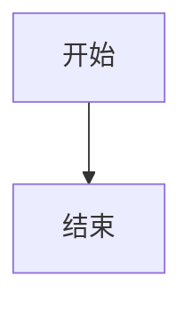

# 智能课程生成系统 - 提示词系统规范

## 1. 系统概述

### 1.1 设计原则

- **单一数据源**: 所有提示词集中管理，避免分散定义
- **版本控制**: 每个提示词模板都有版本号，便于追踪变更
- **参数化设计**: 支持动态参数注入，提高复用性
- **前后端一致**: 确保前后端使用相同的提示词逻辑

### 1.2 架构图

```
┌─────────────────────────────────────────────────────────────┐
│                    Prompt System Architecture                │
├─────────────────────────────────────────────────────────────┤
│                                                              │
│  ┌──────────────┐    ┌──────────────┐    ┌──────────────┐   │
│  │   Frontend   │    │   Backend    │    │   Shared     │   │
│  │   Templates  │◄──►│   Service    │◄──►│   Config     │   │
│  └──────────────┘    └──────────────┘    └──────────────┘   │
│         │                   │                   │            │
│         └───────────────────┼───────────────────┘            │
│                             ▼                                │
│                  ┌─────────────────────┐                     │
│                  │   Prompt Registry   │                     │
│                  │   (Version Control) │                     │
│                  └─────────────────────┘                     │
│                                                              │
└─────────────────────────────────────────────────────────────┘
```

## 2. 提示词模板规范

### 2.1 模板结构

```typescript
interface PromptTemplate {
  name: string;              // 模板唯一标识
  version: string;           // 语义化版本号
  description: string;       // 模板描述
  parameters: string[];      // 必需参数列表
  tags: string[];           // 分类标签
  systemPrompt: string;     // 系统提示词
  userPrompt?: string;      // 用户提示词（可选）
  createdAt: string;        // 创建时间
  updatedAt: string;        // 更新时间
}
```

### 2.2 版本管理

- **主版本号**: 重大变更，不兼容的修改
- **次版本号**: 功能新增，向后兼容
- **修订号**: Bug修复，向后兼容

示例: `v2.1.3`

### 2.3 命名规范

- 使用小写字母和下划线
- 格式: `{action}_{target}_{context}`
- 示例: `generate_course_structure`, `explain_concept_detail`

## 3. 核心提示词模板

### 3.1 课程生成提示词

#### 3.1.1 生成课程大纲 (generate_course_outline)

**版本**: v4.0.0  
**用途**: 生成课程主题和章节结构框架

**参数**:
- `keyword`: 课程主题关键词
- `difficulty`: 难度等级 (beginner/intermediate/advanced)
- `style`: 教学风格 (academic/industrial/socratic/humorous)
- `requirements`: 额外约束条件

**系统提示词**:

```
你是一位世界顶级教育专家，拥有深厚的学术背景和丰富的教学经验。
你的任务是设计结构清晰、内容权威的课程大纲。

## 学术身份
- 领域专家：在相关学科有深入研究
- 教学大师：擅长将复杂知识系统化传授
- 课程设计师：精通认知科学和学习路径规划

## 课程配置参数
- 难度等级：{difficulty}
- 教学风格：{style}
- 额外约束：{requirements}

## 输出要求
1. 课程名称必须专业且有吸引力
2. 章节数量控制在7-10章
3. 每章包含4-7个子章节
4. 遵循从基础到进阶的认知路径
5. 使用JSON格式输出

## 格式示例
{
  "course_name": "《课程名称》",
  "logic_flow": "课程设计逻辑说明",
  "nodes": [
    {
      "node_id": "id_1",
      "parent_node_id": "root",
      "node_name": "第一章 标题",
      "node_level": 1,
      "node_content": "章节概述",
      "node_type": "original",
      "sub_nodes": [...]
    }
  ]
}
```

#### 3.1.2 生成子章节 (generate_sub_nodes)

**版本**: v4.0.0  
**用途**: 为父节点生成细化的子章节

**参数**:
- `course_name`: 课程名称
- `parent_context`: 父节点上下文
- `course_outline`: 全书大纲
- `difficulty`: 难度等级
- `style`: 教学风格

**关键规则**:
- 所有难度等级都必须生成子章节
- beginner: 4-6个子章节
- intermediate: 5-7个子章节
- advanced: 5-10个子章节
- 命名格式: "X.Y 小节标题"
- 严禁包含父章节标题前缀

#### 3.1.3 生成正文内容 (generate_content)

**版本**: v3.0.0  
**用途**: 为L3小节生成详细正文

**参数**:
- `node_name`: 当前节点名称
- `node_level`: 节点层级
- `course_context`: 课程上下文
- `difficulty`: 难度等级
- `style`: 教学风格

**内容结构**:
1. 引言：说明重要性和学习目标
2. 主体内容：
   - 概念定义和解释
   - 原理分析和推导
   - 示例和案例分析
   - 图表辅助说明（Mermaid）
3. 总结：
   - 本节核心概念（3-5个要点）
   - 思考与挑战（1-2个深度问题）
4. 延伸阅读：2-3个相关方向

### 3.2 内容优化提示词

#### 3.2.1 重定义内容 (redefine_content)

**版本**: v3.0.0  
**用途**: 基于用户需求重定义或优化内容

**处理原则**:
1. 保持核心信息不丢失
2. 满足用户具体需求
3. 维持难度水平一致
4. 统一风格连贯性

**常见优化方向**:
- 简化：转化为更易理解的形式
- 深化：增加理论深度
- 扩展：补充相关知识
- 重组：调整内容结构
- 纠错：修正错误表述

### 3.3 测验生成提示词

#### 3.3.1 生成测验 (generate_quiz)

**版本**: v3.0.0  
**用途**: 基于内容生成测验题目

**题目设计原则**:
- 侧重概念理解、原理应用和问题解决
- 避免简单记忆性题目
- 强调分析、综合和评价层次

**题型分布**:
- 选择题（单选/多选）：60%
- 判断题：20%
- 简答题/分析题：20%

**难度控制**:
- beginner: 基础概念识别和简单应用
- intermediate: 原理理解和综合分析
- advanced: 深度推理和创新应用

## 4. 难度等级规范

### 4.1 难度定义

| 等级 | 目标受众 | 内容深度 | 公式密度 | 示例类型 |
|------|----------|----------|----------|----------|
| beginner | 零基础学习者 | 直观理解 | <10% | 生活化类比 |
| intermediate | 有一定基础者 | 原理讲解 | 10-30% | 标准案例 |
| advanced | 专业人士 | 底层实现 | >30% | 复杂场景 |

### 4.2 难度适配矩阵

```
┌─────────────────┬─────────────────┬─────────────────┬─────────────────┐
│     维度        │    beginner     │  intermediate   │    advanced     │
├─────────────────┼─────────────────┼─────────────────┼─────────────────┤
│ 语言风格        │ 通俗易懂        │ 专业规范        │ 学术严谨        │
│ 数学要求        │ 避免复杂公式    │ 标准推导        │ 严格证明        │
│ 代码示例        │ 伪代码/简化版   │ 标准实现        │ 生产级代码      │
│ 前置知识        │ 无需背景        │ 基础概念        │ 深入理解        │
│ 学习目标        │ 理解"是什么"   │ 掌握"怎么做"   │ 明白"为什么"   │
└─────────────────┴─────────────────┴─────────────────┴─────────────────┘
```

## 5. 教学风格规范

### 5.1 风格定义

| 风格 | 特点 | 适用场景 |
|------|------|----------|
| academic | 学术严谨、理论推导 | 理论研究、学术论文 |
| industrial | 工程实践、最佳实践 | 工程应用、项目开发 |
| socratic | 提问引导、启发思考 | 概念理解、思维训练 |
| humorous | 生动比喻、趣味案例 | 入门学习、概念引入 |

### 5.2 风格适配指南

**academic 风格**:
- 使用规范学术术语
- 引用相关理论和研究
- 逻辑严密，推导完整
- 适合 advanced 难度

**industrial 风格**:
- 使用工程术语
- 结合实际项目经验
- 强调最佳实践
- 适合 intermediate/advanced

**socratic 风格**:
- 采用提问式叙述
- 引导读者主动思考
- 层层递进，逐步深入
- 适合所有难度

**humorous 风格**:
- 使用生动比喻
- 穿插趣味案例
- 降低认知负担
- 适合 beginner

## 6. 输出格式规范

### 6.1 JSON 格式

用于结构化数据输出（课程大纲、测验等）:

```json
{
  "field_name": {
    "type": "string|number|boolean|array|object",
    "description": "字段说明",
    "required": true|false,
    "example": "示例值"
  }
}
```

### 6.2 Markdown 格式

用于正文内容输出:

```markdown
# 标题

## 1. 章节标题

正文内容...

### 公式
$$
E = mc^2
$$

### 图表


### 🎯 本节核心概念
1. 要点一
2. 要点二

### ✅ 思考与挑战
- 深度问题
```

### 6.3 分隔符规范

- 正文开始标记: `<!-- BODY_START -->`
- 正文结束标记: `<!-- BODY_END -->`
- 思考过程标记: `<!-- THINKING_START/END -->`

## 7. 前后端一致性保证

### 7.1 共享配置

创建共享配置文件 `shared/prompt-config.ts`:

```typescript
// 难度等级定义
export const DIFFICULTY_LEVELS = {
  BEGINNER: 'beginner',
  INTERMEDIATE: 'intermediate',
  ADVANCED: 'advanced'
} as const;

// 教学风格定义
export const TEACHING_STYLES = {
  ACADEMIC: 'academic',
  INDUSTRIAL: 'industrial',
  SOCRATIC: 'socratic',
  HUMOROUS: 'humorous'
} as const;

// 提示词版本
export const PROMPT_VERSIONS = {
  GENERATE_COURSE: '4.0.0',
  GENERATE_SUB_NODES: '4.0.0',
  GENERATE_CONTENT: '3.0.0',
  REDEFINE_CONTENT: '3.0.0',
  GENERATE_QUIZ: '3.0.0'
} as const;

// 参数验证规则
export const PARAMETER_RULES = {
  chapterCount: { min: 7, max: 10 },
  subChapterCount: { min: 4, max: 7 },
  questionCount: { min: 5, max: 20 }
};
```

### 7.2 验证机制

在前后端都实施参数验证:

```typescript
// 参数验证函数
export function validatePromptParams(
  templateName: string,
  params: Record<string, any>
): ValidationResult {
  const template = PROMPT_REGISTRY[templateName];
  const errors: string[] = [];
  
  // 检查必需参数
  template.parameters.forEach(param => {
    if (!(param in params)) {
      errors.push(`Missing required parameter: ${param}`);
    }
  });
  
  // 检查参数值范围
  if (params.difficulty && !Object.values(DIFFICULTY_LEVELS).includes(params.difficulty)) {
    errors.push(`Invalid difficulty: ${params.difficulty}`);
  }
  
  return {
    valid: errors.length === 0,
    errors
  };
}
```

### 7.3 版本同步策略

1. **版本号约定**: 前后端使用相同的版本号体系
2. **变更日志**: 维护统一的 CHANGELOG.md
3. **兼容性检查**: API 调用时验证版本兼容性
4. **自动同步**: CI/CD 流程中同步提示词变更

## 8. 智能建议系统

### 8.1 前端快速提问模板

```typescript
// 通用建议
const SMART_SUGGESTIONS = [
  '帮我总结一下这个章节',
  '这个概念是什么意思？',
  '能举个例子吗？',
  '这个知识点常考吗？',
  '和之前的内容有什么联系？'
];

// 基于内容的上下文建议
const CONTEXT_BASED_SUGGESTIONS = {
  definition: (concept: string) => `"${concept}"的核心定义是什么？`,
  formula: () => '这个公式的适用条件是什么？',
  process: () => '能梳理一下操作步骤吗？',
  example: () => '还有类似的例子吗？',
  keypoints: (concept: string) => `关于"${concept}"的重点有哪些？`
};
```

### 8.2 建议生成逻辑

```typescript
function generateContextSuggestions(node: CourseNode): Suggestion[] {
  const suggestions: Suggestion[] = [];
  const content = node.node_content?.toLowerCase() || '';
  
  // 基于内容类型检测
  if (content.includes('定义') || content.includes('概念')) {
    suggestions.push({
      text: CONTEXT_BASED_SUGGESTIONS.definition(node.node_name),
      type: 'definition'
    });
  }
  
  if (content.includes('公式') || content.includes('计算')) {
    suggestions.push({
      text: CONTEXT_BASED_SUGGESTIONS.formula(),
      type: 'formula'
    });
  }
  
  // 限制建议数量
  return suggestions.slice(0, 3);
}
```

## 9. 质量检查清单

### 9.1 提示词质量检查

- [ ] 版本号符合语义化规范
- [ ] 所有参数都有明确说明
- [ ] 输出格式有示例
- [ ] 难度适配逻辑清晰
- [ ] 风格定义一致
- [ ] 包含错误处理说明

### 9.2 前后端一致性检查

- [ ] 共享配置已同步
- [ ] 参数验证逻辑一致
- [ ] 版本号保持一致
- [ ] 错误处理机制统一
- [ ] 文档已更新

### 9.3 测试检查

- [ ] 单元测试覆盖所有模板
- [ ] 集成测试验证端到端流程
- [ ] 边界条件测试
- [ ] 性能测试（响应时间）

## 10. 最佳实践

### 10.1 提示词编写原则

1. **清晰性**: 使用明确的指令，避免歧义
2. **结构化**: 使用标题、列表等组织内容
3. **示例驱动**: 提供输入输出示例
4. **边界明确**: 说明什么应该做，什么不应该做
5. **可验证**: 输出应易于验证正确性

### 10.2 维护建议

1. **定期审查**: 每季度审查提示词效果
2. **A/B测试**: 对关键提示词进行效果对比
3. **用户反馈**: 收集用户对生成内容的反馈
4. **版本控制**: 使用Git管理提示词变更
5. **文档同步**: 确保文档与代码同步更新

### 10.3 性能优化

1. **缓存策略**: 缓存常用提示词模板
2. **延迟加载**: 按需加载提示词
3. **预编译**: 预编译模板提高渲染速度
4. **监控告警**: 监控提示词调用性能和错误率

---

**文档版本**: v1.0.0  
**最后更新**: 2024年  
**维护者**: AI课程生成团队
