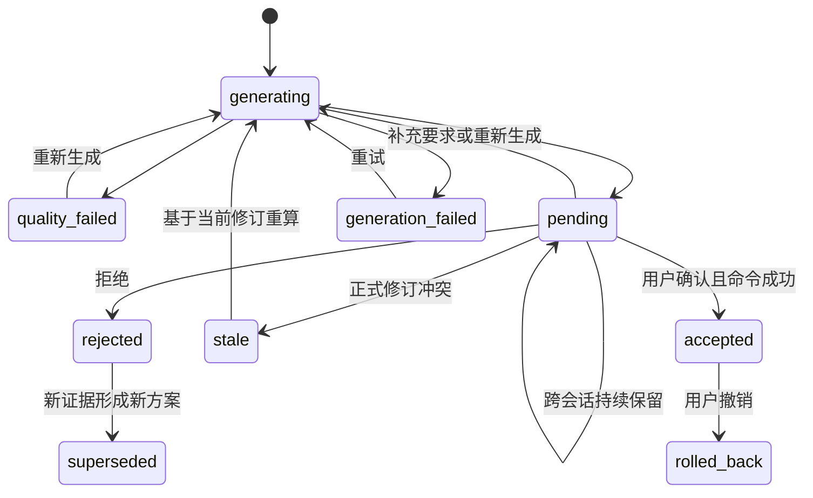

# 灵知 AI 课程智能体需求文档：结构化同源与个体化生长

> 文档状态：产品与技术交接基线<br>
> 日期：2026-07-15<br>
> 适用产品：灵知学生端<br>
> 读者：产品负责人、技术负责人、AI 工程、前后端、测试<br>
> 上位真源：[`docs/product-blueprint.md`](../product-blueprint.md)<br>
> 实施规格：[`openspec/changes/build-structured-adaptive-course-ai/`](../../openspec/changes/build-structured-adaptive-course-ai/)

## 0. 执行摘要

灵知下一阶段不是继续增加几个孤立的 AI 按钮，而是把现有课程生成、知识库、AI 老师、学习事实和课程修改能力收束成一个真正会生长的课程系统。

产品只保留两条最高原则：

1. **结构化同源**：课程目录、课程块、知识节点、学习目标、题目、笔记、错题证据与 AI 修改都拥有稳定结构、稳定引用和修订关系。任一处变化都能定位其上下游影响，不靠复制文本维持表面一致。
2. **个体化生长**：系统持续读取当前学生在当前课程中的真实学习证据，动态判断应该讲得更细、增加例子、补充推导、改变任务难度，还是提前调整后续章节；AI 可以生成任何课程修改，但只能进入可见的候选层，最终由学生确认。

最终产品不是“一句话生成一门固定课程”，而是：

```text
一句话和资料生成初始课程
+ 课程学科知识库
+ 持续积累的学习证据
+ AI 动态教学决策
+ 可确认、可回退的结构化修改
= 一门随学生共同生长的个人课程
```

本需求建立在现有能力之上，不另起平行系统。当前已经存在的 `CourseDocument / CourseBlock`、`LearningEvent`、`PracticeAttempt`、`LearningRecord`、`LearnerModel`、`LearningRuntime`、`AIContextPackage`、块级候选与课程命令继续复用并升级。

一个关键技术判断是：**同源不等于把所有东西塞进同一张树或同一个 JSON。**课程结构、知识结构、学习事实各有唯一真源；“同源”通过稳定 ID、引用、修订和依赖图实现。否则课程目录会污染学科知识树，聊天推断会污染正式事实，最终反而无法联动。

## 1. 背景与当前缺口

### 1.1 已有底座

灵知目前已经具备：

- 由章节、分组和异构 `CourseBlock` 构成的唯一正式 `CourseDocument`。
- 正文块级解释、举例、简化、提问和连续追问。
- 正式题目、作答、错题诊断、笔记、复习任务与学习事件。
- 从正式事实确定性重算的 `LearnerModel`。
- 按意图装配最小上下文的统一 AI 老师。
- 基于稳定 `block_id` 的局部重新生成候选、质量门、确认应用和修订冲突保护。
- 与课程同时生成的课程知识库、课程知识图及课程对象映射底座。

### 1.2 当前真实缺口

这些能力尚未形成“会生长的课程”：

- AI 主要响应用户当前选中的位置，不能持续发现“接下来应该为这个学生改变什么”。
- 当前块级候选以整块替换为主，不能完整表达行级补写、插块、拆分、合并、重排、隐藏和跨章节调整。
- 学习对话、笔记、错题和反馈尚未形成统一的“证据账本 → 适应判断 → 课程修改”闭环。
- AI 只能有限使用正式知识库，不能让当前课程的知识颗粒度随教学需要继续细化。
- 知识变化与课程变化没有双向影响分析，容易出现课程已经增加概念而知识库未更新，或知识节点拆细后正文、题目仍引用旧颗粒度。
- 未确认修改尚未形成一层可长期保留、跨会话恢复、可批量审阅的个人课程候选层。
- 难度虽然已有契约，但尚未根据学习证据转化为对推导、例子、支架、任务和节奏的具体动态变化。

## 2. 产品目标与范围

### 2.1 必须达成的最终能力

1. 课程生成时同步生成一份当前课程可用、可继续生长的课程学科知识库。
2. 当前课程中的每一条用户输入都能作为原始学习证据被记录，但原始文字不能未经判断直接升级为稳定结论。
3. AI 能持续评估证据强度：一条非常明确的强证据可立即触发局部候选；跨位置反复出现的同类证据可触发更大范围候选。
4. AI 可修改当前内容，也可根据当前学习情况提前调整尚未学习的后续章节。
5. AI 可新增课程块，也可在原块的行、段、块、章节和全课程范围内修改现有内容。
6. 所有未确认变化长期保留、高亮显示、注明 AI 来源，并提供接受、拒绝、重新生成、补充要求和调整范围。
7. 用户可主动选择当前选区、块、小节、章节、多个目录节点或全课程作为调整范围；AI 可推荐范围，但不能替用户确认。
8. 知识库和课程双向联动：任一侧变化都能生成另一侧的影响分析与候选修改。
9. 已接受修改可按单项或整组撤销、比较和恢复，且不能破坏历史作答、笔记与锚点。
10. 全部证据、模型和候选目前只在当前课程内生效，不跨课程传播。

### 2.2 本次明确不做

- 不修改启智教师端。
- 不在当前阶段实现教师发布课程与学生个人课程之间的正式同步协议。
- 不实现 PPT 双向编辑；只保证未来可以从同一结构化真源生成 PPT 等派生视图。
- 不实现视频讲解生成与视频资产生产；保留媒体块和后续能力扩展点。
- 不把学生端改造成手工课程工作室或块拖拽编辑器。
- 不把一条聊天、一处停留或一次答错直接视为稳定画像或全课程修改依据。

这些是当前交付边界，不代表可以省略本文列出的课程智能体能力。本文各实施阶段是依赖顺序，不是可选 MVP 清单。

## 3. 核心术语与真源边界

| 名称 | 定义 | 真源边界 |
| --- | --- | --- |
| `SubjectKnowledgeLibrary` | 旧跨课程知识数据的迁移来源 | 只在显式历史迁移中读取；不进入新生成、运行时、AI、练习或掌握投影 |
| `CourseKnowledgeBase` | 与一门课程同时生成、只服务当前课程、可继续细化的唯一产品知识库 | 保存概念组、原子知识点、能力、易错、掌握标准和课程内知识关系 |
| `CourseKnowledgeMap / KnowledgeBinding` | 当前课程知识与章节、正文、课件、目标、题目之间的精确教学绑定 | 只表达对象引用、教学作用和覆盖，不复制课程正文或知识定义 |
| `CourseDocument` | 当前学生这门课程唯一正式结构 | 章节、分组、块顺序和当前修订的唯一正式真源 |
| `CourseBlock` | 可定位、可组合、可修改的最小教学单元 | 拥有稳定 ID、类型、教学作用、引用和修订 |
| `EvidenceItem` | 用户输入、作答、笔记、反馈等一次可追溯原始证据 | 只记录发生过什么，不直接等于薄弱点或偏好 |
| `AdaptationHypothesis` | AI 根据一组证据形成的有范围、有置信度、可被反证的教学判断 | 必须引用证据，不得伪装成正式事实 |
| `AdaptationIssue` | 已达到采取行动门槛的具体教学问题或机会 | 说明原因、适用范围、强度和反证 |
| `CourseChangeSet` | AI 针对一个问题生成的一组结构化课程与知识修改 | 确认前属于候选层，不能成为正式课程修订 |
| `ChangeOperation` | `CourseChangeSet` 中的一个原子操作 | 可单独预览、接受、拒绝、重生和撤销 |
| `ActionReceipt` | 领域服务执行确认操作后的持久回执 | 记录真实结果、修订变化和撤销入口 |

### 3.1 一门课程一套知识库

用户所说“生成课程时同时生成、之后还可以继续细化的知识库”，在工程上唯一对应 `CourseKnowledgeBase`。它不是章节标题索引，也不是跨课程标准库的局部副本，而是当前课程自己的可生长知识结构：

```text
CourseDocument（章节、小节与教学顺序真源）
                    ↓ 路径定位
CourseKnowledgeBase（概念组 → 原子知识点 → 能力 / 易错 / 掌握标准）
                    ↕ 六类课程内知识关系
CourseKnowledgeMap / KnowledgeBinding（正文、课件、目标、题目与教学作用）
                    ↕
LearnerModel 与正式学习事实（当前学生状态投影）
```

知识库的纵向路径为“章节 → 小节 → 概念组 → 原子知识点”；横向语义网只允许 `prerequisite / derives / equivalent_to / contrasts_with / applies_to / generalizes` 六类关系。章节包含、课程先后顺序和对象绑定不得混入知识关系网。

首次生成时，知识身份、逐节知识详情与关系生成必须分层。系统先用一次紧凑全课规划
冻结规范名称、唯一首次负责小节和前序复用；再让逐节调用只读取当前职责、身份合同和
本节证据，并在共享有界预算内并行生成知识详情。全部节点编译课程内稳定 ID 后，
独立关系阶段按小节邻域并行复制这些 ID，逐一提交 `connected / course_entry`
决定和六类关系，最终按课程顺序合并为一张全课关系图。模型不得在节点阶段用名称
顺手生成少量关系，也不得创建内部 ID；关系视图必须展示全部活动原子知识点，而不是
只展示已有关系边的端点。

新生成和运行链不读取 `SubjectKnowledgeLibrary`。旧数据只有在维护者显式迁移时才能复制为当前课程内的新身份；迁移完成后不得保留运行时依赖。完整实体、关系与质量门见 [`灵知课程知识库结构与关系网络设计.md`](./灵知课程知识库结构与关系网络设计.md)。

## 4. 两条最高产品原则

### 4.1 原则一：结构化同源

结构化同源包含六层含义：

1. **结构同源**：大纲、章节、小节和正文不再是互相复制的 Markdown，而是 `CourseDocument` 的不同投影。
2. **语义同源**：正文、目标、题目、错题与 AI 判断通过知识节点 ID 指向同一语义坐标。
3. **内容同源**：同一段课程内容只在一个正式块中保存；目录、知识库、搜索、导出和未来 PPT 都是派生视图。
4. **修订同源**：修改必须携带课程、块、知识和映射修订；不能按旧内容静默覆盖新内容。
5. **因果同源**：每次 AI 修改都能追溯到证据、判断、候选、确认和回执。
6. **交互同源**：行内 AI、全局 AI、知识库和课程目录共用同一候选与命令协议，不各自维护隐藏状态。

同源后的联动不是简单的“改 A 就把整份 B 重写”，而是：

```text
修改一个结构化对象
→ 计算依赖与影响范围
→ 对受影响对象生成候选差异
→ 用户按单项或整组确认
→ 统一领域命令更新正式修订
→ 所有投影视图重新读取同一真源
```

### 4.2 原则二：个体化生长

个体化生长不是给用户贴一个“入门/进阶”标签，也不是让 AI 回答更长，而是持续改变课程的真实组成：

- 概念是否需要拆得更细。
- 定义是否需要补充边界和反例。
- 推导过程需要展开还是压缩。
- 例子数量、跨度和难度是否需要变化。
- 是否需要增加过渡、桥接、提示或理解检查。
- 正式任务需要降低支架还是增加挑战。
- 后续章节是否要提前补充前置内容或调整节奏。
- 已经掌握的内容是否可以压缩，但仍保留必要检查点。

课程生长同时包含三种时间方向：

| 方向 | 例子 | 结果 |
| --- | --- | --- |
| 当下适配 | 学生说“这段推导跳得太快” | 立即在当前位置生成行级补写或过渡块候选 |
| 向后修补 | 后续错误证明前面定义不牢 | 对前面定义块形成补充候选，并保留历史作答语境 |
| 向前预调 | 第二节暴露前置不足 | 为第三、四、五节提前增加桥接、例子或检查点候选 |

AI 的课程操作权限可以很高，但治理边界固定为：

```text
AI 可以在候选层生成任何合法修改
AI 不可以替用户确认修改
用户确认后只能由正式领域命令执行
所有执行必须可追溯、可拒绝、可恢复
```

“可控”是这两条原则的实现护栏，不另立为第三条产品原则。

## 5. 产品与系统全景

```mermaid
flowchart TD
    A["课程主题、资料、用途与初始难度"] --> B["课程生产链"]
    B --> C["CourseDocument / CourseBlock"]
    B --> D["CourseKnowledgeBase"]
    B --> E["正式题目、目标与学习资产"]
    D <--> F["CourseKnowledgeMap"]
    F <--> C
    F <--> E

    C --> G["学生学习当前课程"]
    E --> G
    G --> H["思维证据：对话与每一行输入"]
    G --> I["事实证据：作答、错题、笔记、反馈"]
    H --> J["EvidenceLedger"]
    I --> J
    J --> K["AdaptationHypothesis"]
    K --> L["动态证据强度与范围判断"]
    L --> M["CourseChangeSet"]
    M --> N["持久候选层：高亮、理由、范围、影响"]
    N --> O{"学生决定"}
    O -->|接受| P["课程与知识领域命令"]
    O -->|拒绝| Q["拒绝历史与冷却"]
    O -->|重新生成| M
    P --> C
    P --> D
    P --> R["修订、回执、历史与撤销"]
    R --> G
```



当前页面渲染公式为：

```text
当前正式 CourseDocument
+ 当前用户未确认的 CourseChangeSet 候选投影
+ LearningRecord 个人记录投影
+ 仅用于即时讲解的临时 AI 内容
= 学生此刻看到的个人课程流
```

四者必须视觉可区分。尤其是未确认候选可以长期存在并参与学习，但不能冒充已经接受的正式课程内容。

## 6. 实体与数据契约

### 6.1 `CourseKnowledgeBase`

最低字段：

```text
knowledge_base_id
course_id
schema_version
revision_id
concept_groups[]
knowledge_points[]
skill_units[]
misconceptions[]
mastery_criteria[]
relations[]
bindings[]
source_refs[]
generation_audit
quality_report
lifecycle_status          candidate / active / degraded / tombstoned
created_at / updated_at
```

`KnowledgePoint` 最低字段：

```text
knowledge_id
course_id
primary_concept_group_id
knowledge_type
name / statement
conditions[] / boundaries[] / counterexamples[]
aliases[]
source_refs[]
granularity_status        atomic / coarse / fragmented / needs_review
revision_id
status                    active / candidate / tombstoned
```

每个活动知识点至少关联一个可观察 `SkillUnit` 和一个可验证 `MasteryCriterion`；`Misconception` 只有在存在具体错误表现、判别方法和修复策略时才生成。旧 `ImprovementPoint` 不再作为核心实体：稳定目标迁入能力点，具体任务迁入练习，个人提升建议由 AI 根据证据动态生成。

允许的知识操作包括新增、补写、拆分、合并、重命名、移动主要路径位置、调整六类知识关系、绑定或解除课程对象。删除使用墓碑和映射迁移，不物理抹除被历史事实引用的节点。完整字段以课程知识库结构设计文档为准。

### 6.2 `EvidenceItem`

每条原始证据必须至少包含：

```text
evidence_id
learner_id
course_id
source_type               ai_message / question_input / note / attempt / feedback / self_report
source_object_ref
content_or_result_ref
course_location_ref       selection / block / section / chapter
knowledge_refs[]
objective_refs[]
occurred_at
evidence_revision
privacy_scope             current_course
```

用户在当前课程中向 AI 助手或问答框输入的每一行文字都进入原始证据层。为避免重复真源，完整文本仍由原会话或记录对象保存，`EvidenceItem` 保存稳定引用、必要摘录或内容指纹。

### 6.3 `AdaptationHypothesis`

```text
hypothesis_id
course_id / learner_id
claim_type                detail_need / prerequisite_gap / challenge_need / example_need / pacing_need ...
claim
target_knowledge_refs[]
candidate_scope
supporting_evidence_refs[]
counter_evidence_refs[]
directness
confidence
stability
freshness
valid_until?
status                    observing / actionable / contradicted / expired / resolved
```

原始证据和 AI 推断必须分开。一句话可以被完整记录，但只有当其指向明确、足够直接或与其他独立证据相互支持时，才能形成可行动判断。

### 6.4 `CourseChangeSet`

```text
change_set_id
course_id / learner_id
reason_summary
evidence_refs[]
recommended_scope
user_selected_scope
difficulty_delta
operations[]
affected_object_refs[]
base_revision_vector
quality_report
status
created_at / updated_at
```

每个 `ChangeOperation` 至少包含：

```text
operation_id
operation_type
target_ref
before_snapshot_or_ref
after_payload
inline_diff
reason
evidence_refs[]
scope
dependency_operation_ids[]
expected_revision
quality_status
status
```

### 6.5 候选状态机



`rejected`、`superseded`、`accepted` 和 `rolled_back` 从正文候选层退出，但保留在历史中；`pending` 必须跨刷新、退出和设备恢复。

## 7. 学习证据与动态触发规则

### 7.1 两类证据

| 证据类型 | 来源 | 价值 | 限制 |
| --- | --- | --- | --- |
| 思维证据 | 与 AI 的对话、问答输入、对解释的追问、显式评价 | 能直接反映学生如何理解、哪里卡住、想要怎样讲 | 可能是临时情绪、只针对局部或表达不完整 |
| 事实证据 | 正式作答、错题、诊断、笔记、复习结果、回答反馈 | 能证明实际表现和持续结果 | 沉默数据不能自动解释错因，必须结合任务与上下文 |

两类证据不设置机械的固定优先级。明确且具体的思维证据可能比一组含义不清的点击数据更强；经过独立复验的事实证据通常比 AI 猜测更强。

### 7.2 动态证据强度

证据强度至少由以下维度共同决定：

- **直接性**：学生明确说“这里太简略”高于 AI 从停留时间推断。
- **范围明确度**：明确指向一段、一节或全课程，决定修改半径。
- **严重度**：完全无法继续高于轻微偏好。
- **重复性**：同类问题是否在不同时间、不同位置独立出现。
- **一致性**：对话、错题、笔记和复验是否指向同一判断。
- **结果验证**：增加解释后是否解决，或同类错误是否仍然出现。
- **新鲜度**：近期证据对当前课程更有效，但历史模式可保留衰减权重。
- **反证**：后续独立完成、明确否认或只在单个特殊章节发生，会缩小或撤销判断。

实现可以使用可解释规则、统计评分或模型判定，但不得把“连续三次”写成所有场景的硬编码真理。三次只是一个典型例子：

- 学生在当前段落明确说“这段推导太简略，我需要逐步展开”，单条证据已经足以立即生成当前局部候选。
- 学生只说“没看懂”，通常先生成当前解释或检查，不足以改变全课程。
- 学生在三个不同章节都反复要求展开推导，并且补写后表现改善，可以形成“本课程后续推导默认更细”的广域候选。
- 学生在一个特殊章节要求更细，但其他章节表现正常，应保持局部，不外推为全局偏好。

### 7.3 评估时机

系统采用“持续记录、事件驱动评估、弹性稳定点汇总”：

- 每次用户输入、AI 回答反馈、正式提交、笔记更新和诊断结果都实时记录。
- 单条强直接证据达到门槛时，可立即生成局部候选。
- 未达到门槛的证据继续积累，不反复打扰。
- 在一次问答结束、一个块学完、一次正式提交完成、离开小节或用户主动请求调整时，重新汇总相关证据。
- 跨章节或全课程修改需要更强的范围证据，除非用户本人明确要求全局应用。

稳定点是降低抖动的评估机会，不是“必须等到第三次”的死规则。

### 7.4 触发结果分级

| 证据状态 | 系统动作 |
| --- | --- |
| 弱或含义不清 | 只记录，不产生课程候选；必要时继续观察或询问 |
| 局部强证据 | 立即生成当前选区、块或小节候选 |
| 多源一致证据 | 生成局部候选，并检查后续依赖位置 |
| 跨位置稳定模式 | 推荐多小节、章节或全课程范围，由用户调整范围后确认 |
| 存在强反证或证据过期 | 缩小范围、降低优先级、撤销假设或让旧候选过期 |

停留时间、滚动速度、一次错误、一次提问或 AI 自己的猜测不得单独触发广域修改。

## 8. 难度必须落实为课程组成

难度不是一个抽象滑杆，而是一组可操作维度：

| 维度 | 降低门槛时 | 提高挑战时 |
| --- | --- | --- |
| 知识颗粒度 | 拆细概念、补充边界和前置 | 合并熟悉内容、提高抽象层级 |
| 推导完整度 | 展开中间步骤、解释为何成立 | 压缩已掌握步骤、要求自行补全 |
| 例子 | 增加近迁移例子、反例与对比 | 增加开放约束、跨情境和远迁移 |
| 支架 | 提示、模板、桥接、分步检查 | 减少提示、提高独立性 |
| 任务复杂度 | 单目标、短步骤、即时反馈 | 多目标整合、权衡与开放任务 |
| 知识跨度 | 只连接必要前置 | 跨章节、跨主题综合 |
| 节奏 | 小步推进、高频理解检查 | 压缩已知内容、延长独立工作段 |
| 掌握要求 | 在支架下完成标准任务 | 独立解释、迁移、论证和复验 |

AI 调整难度时必须返回具体 `difficulty_delta`，说明哪些维度发生变化，并以实际块、题目或知识颗粒度变化体现。只把文字写长、增加术语或增加题量不算有效难度调整。

## 9. AI 可执行的完整结构操作

### 9.1 正文与结构操作

| 操作 | 作用 | 关键约束 |
| --- | --- | --- |
| `INSERT_BLOCK` | 插入解释、例子、过渡、反例、检查点或补救块 | 必须指定插入锚点和教学作用 |
| `PATCH_SPAN` | 在原块某行、句或段中插入、删除或替换内容 | 必须生成行内 diff，不能重写无关内容 |
| `PATCH_BLOCK` | 对原块进行局部结构化修改 | 保留 `block_id` 和未改字段 |
| `REPLACE_BLOCK` | 整块换一种讲法 | 影响较大，必须完整前后对比 |
| `SPLIT_BLOCK` | 将过密内容拆成多个块 | 保存旧新 ID 映射和锚点迁移 |
| `MERGE_BLOCKS` | 合并重复或过碎内容 | 保留历史引用和合并来源 |
| `RESEQUENCE_BLOCKS` | 调整局部教学顺序 | 必须通过前置依赖和学习中任务检查 |
| `REMOVE_BLOCK` | 从当前课程移除不再需要的块 | 使用墓碑，不删除历史事实 |
| `RESTORE_BLOCK` | 恢复被移除内容 | 产生新修订，不篡改历史 |
| `ADD_CHECKPOINT` | 增加理解或掌握检查 | 非正式检查不得伪装成正式掌握证据 |
| `ADD_REMEDIATION_PATH` | 增加补救路径 | 绑定证据、知识与退出条件 |
| `ADJUST_DIFFICULTY_CONTRACT` | 调整后续内容的具体难度维度 | 必须同步受影响块和任务候选 |

后续视频能力通过现有 `MediaAsset + video CourseBlock` 扩展，但不属于本期实现。

### 9.2 知识操作

```text
ADD_KNOWLEDGE_NODE
PATCH_KNOWLEDGE_NODE
SPLIT_KNOWLEDGE_NODE
MERGE_KNOWLEDGE_NODES
MOVE_KNOWLEDGE_NODE
ADD_KNOWLEDGE_RELATION
REMOVE_KNOWLEDGE_RELATION
MAP_COURSE_OBJECT
UNMAP_COURSE_OBJECT
REFINE_GRANULARITY
```

### 9.3 操作权限

- AI 可生成上述任何候选操作，也可把多个操作组成一个有依赖顺序的 `CourseChangeSet`。
- AI 不得直接执行接受动作、伪造用户确认或绕过质量门。
- 用户可接受整组、接受其中一部分、拒绝整组、拒绝单项或要求重新生成。
- 部分接受后，依赖已拒绝操作的后续操作必须自动重算或标记不可应用。

## 10. 调整范围与影响分析

### 10.1 可选范围

范围选择器必须支持：

```text
当前文字选区
当前行 / 段
当前课程块
当前小节
当前章节
多个小节或章节
用户在目录树中框选的任意节点集合
全课程
```

AI 必须给出推荐范围，用户可以修改。推荐范围不是确认结果。

### 10.2 范围交互

范围选择使用现有课程目录树，不新增课程编排工作台：

```text
调整范围
◉ 当前小节：2.2 特征值的几何意义
○ 当前章节：第二章
○ 自定义目录范围
  ☑ 2.2 特征值的几何意义
  ☑ 3.1 对角化条件
  ☑ 4.3 动力系统应用
○ 全课程
```

当选择多章节或全课程时，系统必须先返回：

- 将影响的章节、块、知识节点、题目和目标数量。
- 每个位置为何需要变化。
- 哪些是直接修改，哪些只是受影响待检查。
- 难度维度的整体变化。
- 预计保留不变的部分，避免用户误以为整本书会被重写。

### 10.3 当前与后续章节

学生在第二节暴露明显前置缺口时，系统必须能检查第三、四、五节的依赖，而不是等学生走到那里再补救。后续调整以候选方式提前出现在：

- 左侧目录节点的 AI 变更数量标记。
- 当前页面顶部或 AI 助手中的“已为后续内容准备修改”提示。
- 后续块真正滚动到视口时的行内高亮。

不得用多个打断式弹窗要求学生逐条处理。

## 11. 候选层交互需求

### 11.1 行级与块级显示

- 新增行或段：使用轻量高亮，边缘标记“AI 新增”。
- 删除内容：以可展开的删除 diff 显示，不立即从候选视图消失。
- 替换内容：同时显示前后差异，可切换“只看修改后 / 查看对比”。
- 新增块：整块带 AI 候选标识，但保持课程正文阅读感，不做成聊天气泡。
- 重排：在目录或影响预览中显示原位置和新位置。
- 知识变化：在知识库节点显示“AI 待确认细化/合并/新增关系”。

未确认变化可以被学生阅读和用于继续学习，但必须持续显示候选身份。

### 11.2 每个候选的必备信息

界面第一层必须清楚显示用户要求的两个核心信息：

1. **调整理由**：AI 为什么认为这里需要改，使用面向学生的简洁说明。
2. **调整范围**：当前变更作用于哪里，用户可以改变范围。

可展开第二层显示：

- 关键证据来源与发生位置。
- 难度发生了哪些具体变化。
- 影响的后续章节、知识节点和任务。
- 质量检查结果。

必备操作：

```text
[接受] [拒绝] [重新生成] [修改范围] [补充要求]
```

“补充要求”提供文本框，例如“例子保留，但推导再详细一点”。拒绝时可以选填原因，用于冷却和下一次生成，但不强迫学生填写。

### 11.3 批量处理

当一组修改跨越多个位置时：

- 顶部显示整组原因、范围和影响摘要。
- 支持全部接受、全部拒绝和逐项审阅。
- 单项接受后，整组状态和依赖实时更新。
- 全部接受必须是一个带幂等键和修订前置条件的逻辑事务。
- 执行失败时不得出现一半正式、一半丢失且无说明的状态。

### 11.4 主动提醒

AI 主动能力分两级：

1. **即时个人解释层**：当前问题的解释、例子、过渡和非正式理解检查，可在强局部证据下及时出现。
2. **课程生长候选层**：对当前块、后续章节、知识库或全课程的持久修改，生成后保持可见并等待用户决定。

主动提醒必须说明“为什么现在出现”，并遵守拒绝冷却。被拒绝后，没有新证据或范围变化时不得换措辞反复推送。

## 12. 课程与知识库双向联动

### 12.1 知识库变化驱动课程候选

例：AI 发现“矩阵可对角化”节点颗粒度过粗，建议拆成“特征向量完备性”“几何重数与代数重数”“相似对角化构造”。

接受知识细化前，系统必须计算：

- 哪些正文块只引用了旧粗节点。
- 哪些学习目标和题目需要重新映射。
- 哪些章节缺少新细节点的解释或检查。
- 哪些内容已经覆盖，无需重复生成。

随后生成关联课程候选，而不是直接重写整章。

### 12.2 课程变化驱动知识库候选

例：学生要求在正文增加一个此前未建模的“Jordan 标准形失败条件”说明。课程候选通过后，系统应判断：

- 它是否只是一个例子，不需要新增知识节点。
- 它是否是现有节点的边界条件，应补写节点描述。
- 它是否是可独立解释、练习和诊断的新知识点，应新增课程知识节点。
- 它与哪些课程内知识点存在前置、推导、等价、对比、应用或一般化关系。
- 当前课程资料和既有知识中是否存在规范术语或别名；不得查询其他课程补齐。

### 12.3 防止循环修改

双向联动必须使用同一个 `change_set_id`、因果来源和依赖图：

- 由知识拆分引发的课程改动不能再次被识别为一条全新的知识拆分建议。
- 同一因果链中的操作只执行一次，重复请求返回同一回执。
- 一侧修订变化导致候选过期时，整组重新做影响分析。
- 任何跨课程知识设施都不在自动闭环中；课程变化既不读取它，也不得反向写入它。

## 13. AI 能力架构

这一能力不能只靠一个大 prompt 完成，至少需要六种可组合能力：

| 能力 | 输入 | 输出 |
| --- | --- | --- |
| 证据解释器 | 当前课程内原始证据与稳定对象 | 带引用、范围和反证的 `AdaptationHypothesis` |
| 教学决策器 | 假设、难度契约、知识依赖、当前进度 | 是否行动、行动半径、难度变化和优先级 |
| 课程规划器 | 目标范围、课程结构、知识映射 | 有依赖顺序的 `CourseChangeSet` |
| 内容生成器 | 单个操作上下文与教学契约 | 新内容、行内 diff 或结构变更载荷 |
| 影响分析器 | 课程、知识、目标、题目与锚点引用 | 受影响对象、过期对象和迁移计划 |
| 质量评估器 | 候选及其契约 | 结构、教学、证据、难度、引用和安全报告 |

### 13.1 上下文原则

- 当前局部解释只读取选区、相邻块、相关知识、当前目标和必要证据。
- 跨章节调整读取被选目录范围、依赖边界、证据摘要和相关正式对象，不默认把全部原始聊天塞给模型。
- 每个 AI 结论必须保留原始证据引用和模型生成时的修订向量。
- 模型失败只让该候选失败或待重试，不能阻断课程阅读、作答、笔记和已有候选浏览。

### 13.2 确定性服务职责

以下工作不得交给模型自由决定：

- 身份、课程归属和权限校验。
- 修订、幂等、事务和冲突处理。
- ID 生成、引用存在性和依赖无环检查。
- 正式题目答案披露规则。
- 历史作答、笔记和锚点迁移边界。
- 候选状态机与用户确认。
- 当前课程知识 ID、六类关系签名、绑定精度和引用合法性。

## 14. 建议服务与接口契约

接口名称可以按现有后端命名调整，但语义不可丢失。

```text
GET  /api/courses/{course_id}/knowledge-base
GET  /api/courses/{course_id}/evidence-summary
GET  /api/courses/{course_id}/adaptation-issues
POST /api/courses/{course_id}/change-sets
GET  /api/courses/{course_id}/change-sets?status=pending
GET  /api/courses/{course_id}/change-sets/{change_set_id}
POST /api/courses/{course_id}/change-sets/{change_set_id}/regenerate
POST /api/courses/{course_id}/change-sets/{change_set_id}/accept
POST /api/courses/{course_id}/change-sets/{change_set_id}/reject
POST /api/courses/{course_id}/change-sets/{change_set_id}/rollback
POST /api/courses/{course_id}/change-sets/{change_set_id}/scope-preview
GET  /api/courses/{course_id}/change-history
```

建议新增或扩展事件：

```text
raw_learning_evidence_recorded
adaptation_hypothesis_updated
adaptation_issue_became_actionable
course_change_set_created
course_change_operation_accepted
course_change_operation_rejected
course_change_set_applied
course_change_set_rolled_back
course_knowledge_base_refined
adaptation_effect_evaluated
```

正式应用必须携带：

```text
learner_id
course_id
change_set_id
accepted_operation_ids[]
base_revision_vector
user_selected_scope
idempotency_key
```

## 15. 一致性、冲突与恢复

### 15.1 应用顺序

用户确认后执行：

1. 校验学习者身份、课程归属和操作权限。
2. 校验课程、块、知识库、映射和资产修订。
3. 对最终选择范围重新做影响分析。
4. 对所有操作运行结构、教学、引用和难度质量门。
5. 使用同一个命令组应用知识、课程和映射变化。
6. 写入修订、操作日志、事件与 `ActionReceipt`。
7. 重新读取 `CourseDocument / CourseKnowledgeBase / LearningRuntime`。
8. 将候选层更新为已接受，正文高亮退出，历史与撤销入口保留。

任何一步失败都不能谎称已经完成。无法原子提交时必须使用可恢复事务日志，启动后自动完成或补偿，不能留下无解释的半应用状态。

### 15.2 冲突规则

| 场景 | 处理方式 |
| --- | --- |
| 候选生成后目标块被其他操作修改 | 标记 `stale`，展示差异并基于当前修订重算 |
| 两个候选修改同一行 | 不自动最后写入覆盖，要求合并或选一项 |
| 两个候选修改不同块但共享知识节点 | 重新校验共享节点修订，可安全合并时合并 |
| 用户部分接受一个依赖变更集 | 自动禁用或重算依赖未满足的操作 |
| 块被拆分或合并 | 保存旧新 ID 映射，迁移仍可唯一定位的笔记与证据 |
| 已有作答引用被修改内容 | 历史 Attempt 冻结原题与原课程修订，不用新内容重算旧结果 |
| AI 或网络中断 | 正式课程保持原修订，候选保留生成失败或中断状态并可续跑 |

### 15.3 撤销

- 单项撤销生成补偿命令，不删除原操作历史。
- 整组撤销只撤销该组仍可安全补偿的变化。
- 后续合法修改依赖已接受内容时，系统先展示影响，不能恢复整份旧快照覆盖后续变化。
- 历史作答、评分、用户输入和已发生事件不可被撤销操作抹除。

## 16. 隐私、身份与证据治理

- 证据目前严格限制在当前学习者、当前课程内使用。
- 每条证据必须能让用户追溯来源；AI 理由不能只写“根据你的学习情况”。
- 原始证据、派生假设和正式学习事实分层保存。
- 用户可查看某个候选使用了哪些证据，可纠正“这只是本章需要，不是全课程偏好”。
- 被用户纠正的假设必须形成反证和范围修正，不能只改变展示文字。
- 拒绝和纠正会影响后续候选，但不得篡改原始对话、笔记或作答历史。
- 当前课程删除、导出和账号迁移必须包含候选、证据引用与修订历史的明确处理规则。

## 17. 关键验收场景

### 场景 1：单条强证据立即局部调整

学生选中两行推导并说“这里跳步太严重，请把中间每一步写出来”。系统立即生成当前段落的 `PATCH_SPAN` 候选，逐行高亮新增步骤，理由指向该句话，范围默认为当前段落。未确认前正式块修订不变。

### 场景 2：模糊单次反馈不外推

学生只说一次“没看懂”。系统可以继续解释或做理解检查，但不得因此把全课程改为入门难度，也不得直接形成稳定“推导能力弱”结论。

### 场景 3：跨章节模式触发广域候选

学生在多个相互独立章节持续要求展开推导，且更详细解释后反馈“已解决”或后续作答改善。系统形成稳定模式，推荐对后续所有推导块增加中间步骤，但仍允许用户只选择第三至第五章。

### 场景 4：当前困难提前修改后续内容

学生在第二节暴露“函数复合”前置不足。系统检查第三、四、五节依赖，在未来章节插入桥接、例子和理解检查候选；目录显示每节待确认数量。学生不需要等到进入这些章节才看到提醒。

### 场景 5：修改原块而不是只能插块

一个定义块原本两行，AI 只在第二行后补充适用边界。界面显示行内 diff 和“AI 新增”，用户可接受、拒绝、重新生成或补充要求，不必把整块复制成另一张卡片。

### 场景 6：候选跨会话保持

学生退出课程再回来，未确认的行级修改、未来章节候选、理由、范围和生成状态仍然存在。系统不得因为刷新自动接受、丢失或重复生成。

### 场景 7：用户主动框选目录范围

学生把一处“多举实际例子”的调整从当前小节扩展到第一、三、五章。系统先返回这些章节中将修改的例子块与可能新增块，再生成候选；未被选中的章节保持不变。

### 场景 8：知识颗粒度不足

AI 发现一个粗知识节点同时承担三个可独立解释和诊断的概念，向当前课程知识维护面提出拆分。维护者确认后，系统同时更新课程知识库和映射，并为缺少相应解释或检查的正文位置生成关联候选；已经覆盖的块不重复生成。

### 场景 9：课程内容反向补知识库

学生接受一个新增边界条件的正文修改。系统识别该内容未被课程知识库表达，向当前课程知识维护面生成补写现有节点或新增原子知识点及课程内关系的候选；课程正文修订不等待知识候选自动通过，知识候选也不能查询其他课程补齐。

### 场景 10：接受、拒绝、重生与撤销

同一变更集包含五项操作。学生接受三项、拒绝一项、要求另一项“例子更贴近日常”后重新生成。应用后可单独撤销其中一个不再被后续内容依赖的操作，历史仍能看到完整因果链。

### 场景 11：修订冲突

候选生成后，目标块已经被另一已确认操作修改。确认旧候选时系统拒绝覆盖，标记过期并基于新内容重新生成，不能以最后写入者为准。

### 场景 12：证据课程隔离

学生在课程 A 中反复要求详细推导，不得自动改变课程 B。跨课程个性化只有未来获得明确产品决策与授权后才可实现。

### 场景 13：候选内容中的学习行为

学生阅读一个未确认候选并完成其中的非正式理解检查。系统可记录候选交互并用于判断候选是否有效，但不得把它自动算作正式掌握。候选接受后，只有通过正式质量门升级的任务才可进入正式证据链。

### 场景 14：AI 失败不阻断学习

跨章节候选生成中模型失败。当前正式课程、练习、笔记、已生成候选和知识库仍可使用；失败任务保留原因和重试入口，不能保存半段输出为正式内容。

## 18. 实施顺序

### 阶段 A：统一契约与迁移底座

- 固定“一门课程一套知识库”，让 `SubjectKnowledgeLibrary` 退出新生成与运行主链，只保留显式历史迁移，将 `CourseKnowledgeMap / KnowledgeBinding` 固定为教学绑定层。
- 版本化概念组、原子知识点、能力、易错、掌握标准与六类关系 schema，删除章节标题复制式知识点兜底。
- 扩展课程命令，覆盖行级修改、插入、拆分、合并、重排、移除和难度调整。
- 建立 `CourseChangeSet / ChangeOperation`、修订向量、幂等和事务日志。
- 将现有单块重新生成候选迁移到新候选协议，不保留第二套状态机。

### 阶段 B：证据账本与动态判断

- 接入当前课程内所有用户输入、AI 反馈、笔记、作答和诊断引用。
- 建立原始证据与 `AdaptationHypothesis` 的分层模型。
- 实现动态强度、范围、反证、衰减和稳定点评估。
- 提供证据来源查看与用户纠正能力。

### 阶段 C：持久候选层与完整审阅交互

- 实现行内 diff、新增块、目录标记、未来章节提示和知识节点候选。
- 实现理由、范围树、补充要求、接受、拒绝、重生和批量处理。
- 支持刷新、退出、断网、跨设备恢复与候选冲突。
- 同步中英文、键盘、触屏和无障碍状态。

### 阶段 D：主动个体课程生长

- 从局部强证据触发即时修改候选。
- 从跨位置模式生成多章节或全课程候选。
- 支持当前、向后修补和向前预调。
- 将抽象难度变化编译为真实课程块、知识颗粒度和任务变化。

### 阶段 E：知识库与课程双向联动

- 课程生成先形成知识蓝图，再据此生成正文、课件与练习，并共同发布 `CourseKnowledgeBase`。
- 实现原子知识点细化、合并、六类关系和精确教学绑定候选。
- 实现课程到知识、知识到课程的双向影响分析。
- 实现单一因果链、循环抑制、跨域事务与质量门。

### 阶段 F：效果验证与工程收束

- 对比修改前后同类位置的求助、错误、理解反馈和独立复验结果。
- 识别无效或副作用修改，形成新的证据和回退建议。
- 完成历史候选迁移、旧接口退役、故障矩阵和全链路压测。
- 完成从课程生成到长期学习、生长、撤销和恢复的纵向验收。

## 19. 测试与质量矩阵

| 测试层 | 必测内容 |
| --- | --- |
| 领域单元测试 | 证据强度、范围推断、反证、衰减、状态机、修订、幂等、依赖排序、循环抑制 |
| 课程命令测试 | 每种结构操作、部分接受、批量事务、冲突、墓碑、ID 映射和撤销 |
| 知识测试 | 原子性、概念组与知识点拆分合并、六类关系语义与无环、精确绑定、普通流程零跨课程读取、显式迁移、引用完整性和旧新 ID 映射 |
| AI 契约测试 | 结构化输出、证据引用、范围、难度 delta、拒绝伪难度和失败重试 |
| 集成测试 | 证据 → 假设 → 候选 → 确认 → 课程/知识修订 → 运行时刷新 |
| 前端组件测试 | 行内 diff、目录范围树、批量状态、未来章节标记、跨会话恢复 |
| 端到端测试 | 14 个关键验收场景、断网、刷新、服务重启、并发窗口和跨设备 |
| i18n 与无障碍 | 中英文键一致、无中文残留、键盘审阅、读屏状态、390/789/1024/1440px |
| 性能测试 | 大课程、多候选、多证据、跨章节影响分析和流式生成不阻塞阅读 |
| 隐私与隔离 | 跨用户、跨课程、删除、导出、身份切换和无身份拒绝 |
| 教学效果评估 | 修改前后求助率、同类错误、独立完成、反馈与回退，不以文本长度充当效果 |

## 20. 完成定义

只有同时满足以下条件，才可以宣称“结构化同源与个体化生长”完成：

1. 当前课程、课程知识库、映射和学习资产有明确唯一真源及稳定引用。
2. 所有当前课程用户输入都能形成可追溯原始证据，且不会未经判断污染正式模型。
3. 单条强证据和累积模式都能按动态规则触发正确范围的候选。
4. AI 能完整执行行、段、块、小节、章节、多章节和全课程结构操作。
5. AI 能修改当前内容并预调后续内容，且所有变化在候选层清晰可见。
6. 用户能查看理由、修改范围、接受、拒绝、重生、部分接受和撤销。
7. 未确认候选跨会话保留，确认前不改变正式课程修订。
8. 知识库和课程的双向变化能做精确影响分析，不循环生成、不整章盲重写。
9. 接受操作具备权限、质量、修订、幂等、事务、回执和恢复保护。
10. 历史作答、笔记、证据和锚点在拆分、合并、删除、重排和撤销后仍可追溯。
11. AI、网络或单个候选失败时，现有学习主链继续可用。
12. 旧块级候选和旧适配块已迁入统一协议，不再存在竞争真源。
13. 真实浏览器完成中英文、多视口、断网、刷新、重启和并发验收。
14. 使用真实学习样本验证至少一条“发现问题 → 改变课程 → 后续证据改善或回退”的闭环。

## 21. 与现有实现的衔接

| 现有能力 | 处理方式 |
| --- | --- |
| `CourseDocument / CourseBlock` | 保留为正式课程真源，扩展完整结构命令 |
| 单块重新生成候选 | 迁移为单操作 `CourseChangeSet`，不保留旧候选状态机 |
| `LearningRuntime.adaptive_blocks` | 即时解释继续保留；持久课程生长统一进入候选层 |
| `LearningEvent / LearningRecord / PracticeAttempt` | 作为原始证据来源，不复制为新事实仓库 |
| `LearnerModel` | 继续从正式事实确定性重算；新增假设层不得直接写模型 |
| `AIContextPackage` | 扩展适应意图与范围上下文，继续按最小必要原则装配 |
| `SubjectKnowledgeLibrary` | 退出新生成与运行主链；只保留显式历史迁移读取 |
| `CourseKnowledgeMap` | 收束为 `KnowledgeBinding` 语义，精确连接课程知识、正文、课件、目标和题目 |
| `ActionProposal / Receipt` | 升级承载变更集确认、执行、冲突和撤销 |
| 课程难度契约 | 从生成时静态契约升级为可解释 `difficulty_delta` 和实际内容变化 |

## 22. 产品判断与未来连接

### 22.1 灵知真正的产品差异

市面上大部分“一句话生成课程”停在生成结果，AI 教育助手又多停在聊天回答。灵知应该占据两者之间更难但更有价值的位置：**课程不是一次生成的内容包，而是有结构、有证据、有状态、能持续演化的学习运行时。**

这使灵知的核心不再是“生成得快”，而是：

- 每一处内容为什么存在。
- 它对应哪个知识与学习目标。
- 学生在哪些地方真实遇到问题。
- AI 为什么决定改这里而不是别处。
- 修改怎样影响后续课程。
- 修改是否真的改善了学习。

### 22.2 与启智的未来打通

本次不修改启智，但必须为未来保留清晰接口：

```text
启智教师课程源
→ 发布结构化课程模板
→ 灵知为每个学生建立个人课程实例
→ 每个课程实例生成并维护自己的 `CourseKnowledgeBase`
→ 学生证据驱动个人候选与个人修订
→ 匿名聚合的共性课程质量问题回到教师端
→ 教师决定是否升级公共课程模板
```

教师公共课程与学生当前课程必须是两个不同权限域。导入模板后，知识对象必须复制为当前课程内身份；课程知识 ID 不跨课程共享，当前课程可以自由生长，但不能自动反向改写教师公共课程；学生共性问题可以成为启智中的审核候选，而不是直接发布。

### 22.3 与 PPT 等派生内容的未来关系

未来 PPT、讲义、复习卡和教师教案应从 `CourseDocument + CourseKnowledgeMap + LearningAsset` 投影，而不是另存一份失联文本。PPT 修改要想反向改变课程，必须被解析为同样的 `ChangeOperation`，经过影响分析和确认后写回真源。当前阶段先把稳定 ID、结构操作和修订链打牢，后续才有可能可靠双向联动。

### 22.4 最终一句话

**结构化同源让 AI 知道课程各部分如何彼此关联；个体化生长让 AI 知道为什么、何时、为谁改变这些部分。两者合起来，灵知才从“会生成课程的软件”变成“会陪学生共同生长的课程智能体”。**
