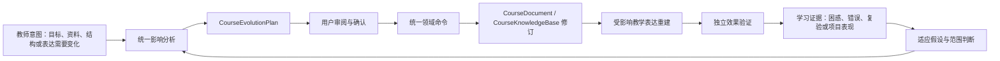
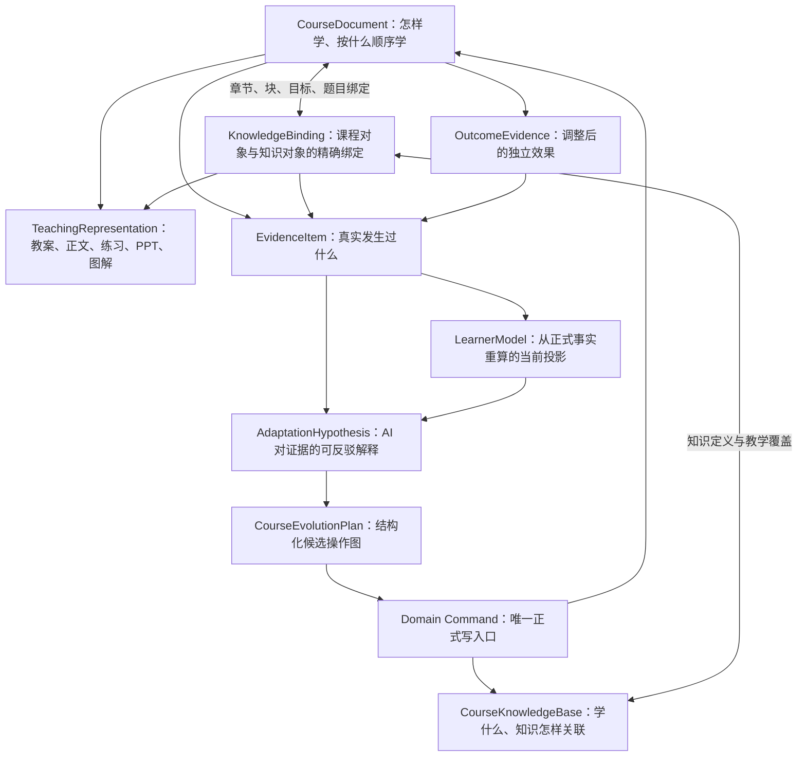
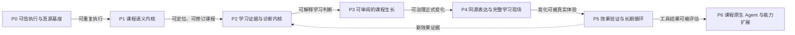

# 灵知整体开发需求与依赖路线图

> 文档状态：待评审的整体执行基线<br>
> 版本：V1.0<br>
> 日期：2026-07-25<br>
> 适用范围：灵知学生端及其课程生成、学习、课程生长与 AI 能力<br>
> 读者：产品负责人、技术负责人、AI 工程、前后端、测试与设计<br>
> 上位产品真源：[`docs/product-blueprint.md`](../product-blueprint.md)<br>
> 领域合同：[`灵知 AI 课程智能体需求文档`](./灵知AI课程智能体需求文档.md)<br>
> 当前实施规格：[`build-structured-adaptive-course-ai`](../../openspec/changes/build-structured-adaptive-course-ai/)<br>
> 外部研究依据：[`AI 教育产品全景与整合方案`](../research/ai-education-landscape-and-integration-2026-07-14.md)、[`多模态课程生成全景与灵知整合方案`](../research/multimodal-course-generation-landscape-and-lingzhi-integration-2026-07-15.md)、[`DeepTutor 融合调研`](../research/DeepTutor-与灵知融合深度研究及实施方案-2026-07-23.md)

## 0. 文档职责

本文回答的不是“还有哪些零散功能没做”，而是：**灵知为了成为目标产品，必须按什么因果顺序建设，每一层要为下一层提供什么不可替代的前提。**

本文中的 `P0–P6` 是 `Prerequisite Layer`，即建设前置层级，不是传统的严重程度、商业优先级或工作量排序：

- `P0` 不表示“最重要”或“最简单”，而表示后续所有建设都依赖的第一层。
- 每一层都必须消费上一层的正式产物，并产出下一层可依赖的稳定能力。
- 不能通过并行堆功能跳过前置层；可以预研下一层，但不能把预研原型接入正式主链。
- 本文不维护任务完成勾选和当前百分比。当前产品状态只更新产品蓝图，具体任务只更新有效 OpenSpec，避免形成第二份进度表。
- 本文不重复课程对象、证据对象、操作对象和接口的全部字段定义；这些细节继续以领域合同和 OpenSpec 为准。

## 1. 执行摘要

### 1.1 最终愿景

灵知要把学习从一次性的内容消费，变成一个有知识坐标、有学习证据、能持续调整、能验证效果的个人课程系统。

目标产品不是“更快生成一门课”，也不是“在课程旁边增加更多 AI 工具”，而是形成一条可以长期运转的学习因果链：

```text
学习目标、资料与起点
→ 结构化当前课程
→ 教案、正文、练习、PPT、图解等同源教学表达
→ 阅读、提问、笔记、作答与项目表现
→ 可追溯学习证据与当前知识状态
→ AI 形成有依据、可反驳的教学判断
→ 用户审阅并确认课程调整
→ 当前课程与受影响表达安全更新
→ 独立任务验证调整效果
→ 新证据回到下一轮判断
```

### 1.2 当前阶段判断

灵知已经证明了若干纵向 Demo 链能够成立：结构化课程生成、正式题目、学习事实、AI 老师、同源教学表达、课程调整与效果等待状态都存在真实入口。当前瓶颈不再是“有没有功能”，而是这些功能尚未全部建立在同一组稳定关系之上：

- 课程对象可用，但课程知识尚缺独立修订仓库和完整双向影响分析。
- 学习事实可写入，但证据治理、来源回跳、知识断点诊断和长期校准仍不完整。
- 课程调整已有联合闭环，但操作代数、依赖重算、历史、跨域恢复和任意范围尚未闭合。
- 多种教学表达已能从同一课程生成，但精确增量构建与跨表达一致性仍不足。
- 效果状态已经出现，但还没有足够的独立复验和长期样本证明“改了以后真的更好”。
- AI 能调用上下文并提出方案，但尚不具备可以安全承载自主任务编排的稳定工具与结果合同。

因此，下一阶段必须从“样板链累加”切换为“依赖层收束”：先建立可信执行与语义内核，再建立证据、课程生长、同源表达、效果验证，最后才让 Agent 组合这些能力。

### 1.3 产品北极星

唯一北极星指标是：**可验证学习闭环完成率**。

```text
有来源证据、形成正式课程修订且获得独立效果结果的已接受调整数
÷
全部已接受课程调整数
```

该指标要求一次产品行为同时跨过“证据、判断、确认、执行、复验”五道门。单独的生成数量、AI 对话数量、课程时长或页面访问量都不能证明目标产品成立。

## 2. 产品原则与边界

### 2.1 五条不可让步的产品原则

1. **一件事实只有一个真源。**课程结构、课程知识、学习事实、学习者模型和教学表达各自拥有清楚的真源与派生关系。
2. **AI 判断不是事实。**AI 只能从证据形成假设和建议；正式掌握状态由规则和正式表现重算，正式课程变化由用户确认和领域命令执行。
3. **个性化就是当前课程的受控修订。**不建立长期覆盖正式课程的个人 Overlay，也不让用户管理复杂版本树。
4. **多模态是课程的教学表达。**PPT、图解、动画、音频和未来视频从课程语义派生，不成为独立内容真源或平行产品。
5. **所有新增能力必须回到学习闭环。**不能说明如何增强“目标 → 课程 → 证据 → 判断 → 调整 → 效果”的功能，不进入正式主线。

### 2.2 当前明确不做

- 不把灵知扩张为 LMS、班级管理、多人协作或教师发布平台。
- 不优先建设账号体系、社交、内容广场、课程商城和跨用户推荐。
- 不新增与课程库、学习工作区、AI 老师平行的顶层功能中心。
- 不让 Agent 直接写文件、执行 shell、绕过领域命令或未经确认改写正式课程。
- 不先做自由视频、数字人或大规模外部 Skill 市场，再倒推课程语义。
- 不以单门样板课程、单次模型成功或局部单元测试代替跨学科、异常和长期效果验证。

## 3. 用户、任务与完整体验

### 3.1 核心用户

当前只服务一个本地学习者。系统中的“教师意图”表示课程设计与教学材料调整视角，不代表当前阶段引入独立教师账号、班级或发布关系。

### 3.2 三个核心任务

| 用户任务 | 用户真正需要完成的事 | 系统责任 | 成功结果 |
| --- | --- | --- | --- |
| 建立一门课程 | 把目标、资料、起点和偏好转成可学的路径 | 建立课程语义、知识坐标和同源表达 | 用户进入一门结构完整、可追溯、可练习的当前课程 |
| 在课程中学习 | 阅读、提问、记录、练习和完成项目 | 保存可追溯事实，给出当前帮助，但不把观察伪装成掌握 | 用户持续学习，系统知道发生了什么以及证据指向哪里 |
| 让课程随学习生长 | 发现缺口、审阅调整、继续学习并验证 | 从证据形成假设，通过统一操作修改课程并独立复验 | 用户得到更适合自己的当前课程，并知道调整是否有效 |

### 3.3 两类触发必须汇入同一路径



教师意图和学习证据的来源不同，但不能各自建立课程写入链。二者最终都必须进入同一个影响分析、方案、确认、领域命令、重建和回执协议。

## 4. 关键对象与关系优化

### 4.1 目标关系图



### 4.2 必须优化的八组关系

| 当前关系风险 | 目标关系 | 产品结果 |
| --- | --- | --- |
| 课程正文与知识定义混在同一对象 | `CourseDocument` 管“怎样学”，`CourseKnowledgeBase` 管“学什么与关系”，通过稳定绑定关联 | 课程可以改编排，知识也可以拆分合并，双方不互相污染 |
| 教案、正文、题目、PPT 各自生成 | 所有教学表达从同一课程修订和知识绑定编译 | 一处语义变化能精确影响所有必要表达，未受影响内容保持不变 |
| 观察、AI 判断与掌握状态混用 | `EvidenceItem → AdaptationHypothesis → LearnerModel` 分层 | 用户能追溯依据，AI 失败不会改写正式学习状态 |
| AI 直接组织业务写入 | AI 负责理解与提案，Workflow 负责流程，领域命令负责正式修改 | 行为可确认、幂等、可撤销、可恢复 |
| 教师调整与学生个性化分两条链 | 两类触发汇入同一 `CourseEvolutionPlan` 和命令协议 | 不再维护两套课程修改系统 |
| 个性化内容长期覆盖正式课程 | 接受后形成当前 `CourseDocument` 新修订，候选只在确认前存在 | 用户只感知一门当前课程，不管理分叉版本 |
| 多模态被当成独立工具 | 多模态成为带来源、依赖与质量门的 `TeachingRepresentation` | PPT、图解和后续媒体能重建、回退和降级 |
| 功能按页面或按钮拆分 | 功能按闭环节点和领域能力组织，页面只承载任务 | 新功能不会制造新的顶层入口和平行状态机 |

## 5. P0–P6 总体依赖链



| 层级 | 这一层解决的根问题 | 交给下一层的正式产物 | 不完成会导致什么 |
| --- | --- | --- | --- |
| P0 | 系统能否被稳定开发、验证和恢复 | 可信工具链、测试门、数据边界与当前契约基线 | 后续变化无法区分产品缺陷、环境问题和测试泄漏 |
| P1 | 课程与知识能否被精确定位、安全修改 | 稳定课程/知识对象、完整操作代数、事务回执 | 证据没有稳定落点，AI 修改只能继续整块替换和旁路写入 |
| P2 | 系统能否知道真实发生了什么以及可能意味着什么 | 可治理证据、知识断点、假设与模型分层 | 调整没有依据，个性化只能依赖聊天印象或单次错误 |
| P3 | 有依据的判断能否转化为受控课程变化 | 可审阅计划、范围、依赖、历史、撤销和恢复 | AI 建议无法成为可靠产品行为，用户也无法判断改了什么 |
| P4 | 一次课程变化能否一致地进入所有学习表达 | 同源增量重建、完整学习现场与课程类型差异 | 修改只停留在 JSON 或单页面，无法形成真实学习体验 |
| P5 | 课程变化是否真的改善学习 | 独立复验、效果状态、长期证据与运营指标 | 产品只能证明“会改”，不能证明“改得有效” |
| P6 | AI 能否自主组合成熟能力完成复杂任务 | 课程原生任务编排、受控工具集与用户控制 | 过早 Agent 化只会把不稳定能力放大成不可控自动化 |

## 6. P0：可信执行与真源基座

### 6.1 建设目标

让任何后续需求都能在一套可重复、可退出、可定位失败、不会污染用户数据的工程环境中实施和验收。P0 的价值不是“技术清理”，而是给 P1 的领域内核改造建立可信反馈系统。

### 6.2 核心需求

| 编号 | 需求 | 输入 | 处理 | 输出与异常 |
| --- | --- | --- | --- | --- |
| P0-FR-01 | 固化开发运行时 | 当前 README、`pyproject.toml`、前后端锁文件 | 统一 Python/Node 版本、依赖安装与启动入口 | 新环境可复现；版本不匹配时启动前明确失败 |
| P0-FR-02 | 收束自动化测试生命周期 | 全量后端测试及后台线程、异步 portal、重建循环 | 找出并关闭跨测试泄漏，所有服务具备显式启动/停止协议 | 全量测试自然退出；不得依靠杀进程或跳过后半段 |
| P0-FR-03 | 建立统一质量门 | 后端、前端、OpenSpec、i18n 与构建 | 提供稳定的 lint、类型、测试、构建、规格校验组合 | 本地与 CI 结果一致，失败指出所属层和可复现命令 |
| P0-FR-04 | 划清源码、运行数据与演示产物 | `backend/data`、`artifacts`、视频、导出文档、缓存 | 明确版本化、忽略、保留、清理和备份策略 | 运行数据不会进入功能提交，产物可追踪且不会挤占源码仓库 |
| P0-FR-05 | 建立接口与数据契约基线 | 当前正式路由、Schema、存储对象与兼容入口 | 记录正式入口、兼容读取和待退出写路径 | P1 可判断哪些路径应迁移，旧链不会被误当新真源 |
| P0-FR-06 | 建立可观测执行基线 | 生成任务、模型调用、课程命令、表达编译 | 统一关联 `course_id / task_id / revision / operation_group_id` | 一次失败能从用户动作追到模型、命令、存储和回执 |

### 6.3 P0 完成门

- 后端全量测试完成收集后的全部用例并自然退出，不存在顺序相关挂起。
- 前端单测、类型检查和生产构建通过；OpenSpec 全量校验通过。
- 后端 lint 工具进入正式开发依赖并能在规定运行时执行。
- 源码、用户运行数据、演示产物和临时缓存边界明确，Git 提交不会混入无关数据。
- 所有正式写入链和仍存的兼容写路径可以被列举并追踪。
- 关键异步任务具备启动、取消、重启对账和关闭协议。

### 6.4 在 P0 完成前禁止

- 不新增课程或知识的正式写路径。
- 不以单测通过代替全量测试可退出。
- 不在不稳定运行时上继续扩大领域重构。
- 不把用户数据、真实模型输出或演示视频当作源码资产提交。

### 6.5 解锁 P1 的条件

P1 需要频繁改变课程对象、知识对象和写入路径。只有 P0 能稳定证明“命令是否执行、修订是否一致、旧链是否仍写入、异常是否可恢复”，P1 的迁移才不会变成不可验证的大重构。

## 7. P1：课程语义内核

### 7.1 建设目标

建立一门课程唯一、可寻址、可演化的语义内核。课程结构与课程知识各守边界，但能通过稳定绑定做双向影响分析；所有正式改变只走同一组领域命令。

### 7.2 核心需求

| 编号 | 需求 | 关键行为 | 验收输出 |
| --- | --- | --- | --- |
| P1-FR-01 | 独立 `CourseKnowledgeBase` 修订仓库 | 知识节点、关系、能力、易错、掌握标准拥有独立修订与存储，不再附着课程元数据保存 | 可按 `course_id + knowledge_revision` 读取、比较和恢复 |
| P1-FR-02 | 稳定对象与绑定 | 章节、块、目标、题目、知识、表达具有稳定 ID；绑定记录教学作用、范围和发生时修订 | 任一对象能找到上游来源和下游消费者 |
| P1-FR-03 | 完整课程操作代数 | 支持行/段/块/章节/多节点的补写、替换、插入、删除、移动、拆分、合并、重排、难度调整和作用转换 | 操作语义独立于 UI 和模型 prompt，可由测试直接执行 |
| P1-FR-04 | 知识变更命令 | 支持知识新增、修订、拆分、合并、退役、关系调整及旧新 ID 映射 | 知识变化能生成课程、题目与表达影响集 |
| P1-FR-05 | 命令组事务与恢复 | 同一方案中的课程、知识和表达操作具备幂等键、前置修订、原子应用或补偿、冲突与恢复状态 | 失败不留下半课程、半知识或重复操作 |
| P1-FR-06 | 旧写链退役 | 路由、兼容层和旧 Store 只读投影或完全退出，不能保留独立判断与保存 | 同一种改变只有一个正式写入口 |
| P1-FR-07 | 影响预览 | 修改课程或知识前计算直接影响、间接影响、保持不变和无法自动处理项 | 用户与后续 P3 能审阅真实影响，而不是只看改后文本 |

### 7.3 用户可见能力

- 课程知识维护与修订比较。
- 课程或知识变化的真实影响预览。
- 当前课程结构的稳定定位、修订回执和冲突说明。

P1 的前端只服务语义核验，不扩张为学生手工课程编辑器或新的顶层“知识工程中心”。

### 7.4 P1 完成门

- 任一课程块和知识节点都能跨修订稳定定位，拆分合并后存在明确映射。
- 课程与知识的全部正式写操作可通过领域服务执行，路由无旁路保存逻辑。
- 多操作方案在重复请求、修订冲突、服务重启和中途失败时不会部分生效。
- 影响分析能区分必须重建、建议复核、保持不变和失效引用。
- 一门历史课程和一门新课程都能通过同一内核读取、修改、撤销与恢复。

### 7.5 在 P1 完成前禁止

- 不新增另一种 AI 课程编辑接口或组件私有写逻辑。
- 不让知识节点变化后静默沿用失效题目、目标或表达绑定。
- 不以整份快照覆盖替代可审计的原子命令与补偿。
- 不开始依赖不稳定 ID 的跨会话证据分析。

### 7.6 解锁 P2 的条件

学习证据必须回答“在当前课程哪个对象、哪个知识坐标、哪个修订上发生”。P1 提供稳定定位和映射后，P2 才能区分真实能力变化、课程内容变化与旧证据失效。

## 8. P2：学习证据与诊断内核

### 8.1 建设目标

让系统准确知道“发生了什么、证据指向哪里、能支持多强的判断”，并严格区分原始事实、AI 假设和正式学习者模型。P2 为 P3 提供有依据且有范围的课程调整输入。

### 8.2 核心需求

| 编号 | 需求 | 关键行为 | 验收输出 |
| --- | --- | --- | --- |
| P2-FR-01 | 统一证据账本 | 阅读、提问、笔记、作答、诊断、补救、复验、项目产出和显式反馈使用统一证据外壳 | 每条证据包含来源、课程修订、对象与知识绑定、时间和强度 |
| P2-FR-02 | 证据治理 | 支持来源回跳、纠正、删除、导出、重复合并和失效标记 | 用户能检查系统依据，纠正后相关投影可重算 |
| P2-FR-03 | 证据质量与时效 | 区分观察、正式表现、自评、推断、反证；支持衰减、范围和冲突 | 一次停留或聊天不能升级为掌握，多条相反证据不会被静默覆盖 |
| P2-FR-04 | 知识断点诊断 | 沿当前课程知识关系查找最小前置断点，区分概念缺口、步骤错误、条件遗漏、迁移失败和表达不匹配 | 诊断给出证据、候选断点、替代解释与需要的新验证 |
| P2-FR-05 | 假设与模型分层 | `AdaptationHypothesis` 引用证据、范围、置信度与反证条件；`LearnerModel` 只从正式事实确定性重算 | AI 结论失败或被拒绝时，正式事实与掌握状态不受污染 |
| P2-FR-06 | 动态触发门 | 单条强证据允许局部建议；广域或长期调整需要跨位置、重复或独立证据 | 调整范围与证据强度匹配，系统不会因一次错误重写全课 |

### 8.3 用户可见能力

- **学习证据时间线**：按课程位置、知识、时间和证据类型查看发生过什么，支持回跳、纠正、删除和导出。
- **知识断点诊断**：展示最可能的前置缺口、支持证据、替代解释和下一道验证任务，不只给“薄弱知识点”标签。
- **个人课程地图**的证据层：在当前课程结构与知识坐标上查看已学、待验证、存在矛盾和需要复习的位置。

### 8.4 P2 完成门

- 证据从产生、存储、回跳、纠正到投影重算完整可用。
- 同一证据不会跨课程传播；发生时修订与当前修订之间有明确映射或失效说明。
- 知识断点诊断至少覆盖正式错题、重复困惑、补救和独立复验四类输入。
- 每个适应假设都能回答“依据什么、适用哪里、为什么是这个范围、什么会推翻它”。
- 模型调用失败、假设被拒绝或证据被删除时，不会留下伪造掌握和稳定偏好。

### 8.5 在 P2 完成前禁止

- 不把 AI 对话摘要直接写成薄弱点、偏好或掌握结论。
- 不因为一次答错自动扩大到全课程重写。
- 不展示无法追溯来源的个性化结论。
- 不让学习证据写入课程知识库或修改其他课程。

### 8.6 解锁 P3 的条件

P3 要决定改什么、改多大、为什么现在改。只有 P2 能提供来源明确、强度匹配、可被反证的判断，课程生长才不是随机个性化。

## 9. P3：可审阅的课程生长

### 9.1 建设目标

把 P2 的学习判断和教师意图统一转化为可审阅、可部分接受、可恢复、可验证的课程变化。AI 可以提出复杂方案，但用户始终控制范围和正式提交。

### 9.2 核心需求

| 编号 | 需求 | 关键行为 | 验收输出 |
| --- | --- | --- | --- |
| P3-FR-01 | 统一调整入口 | AI 老师、正文选区、块菜单、知识影响和效果复核进入同一方案状态 | 不同入口共享范围、证据、方案、确认和历史 |
| P3-FR-02 | 任意范围选择 | 支持行、段、块、小节、章节、多个目录节点、同类教学作用和全课程；用户硬范围不可被 AI 扩大 | 方案明确列出包含、排除和推荐扩展范围 |
| P3-FR-03 | 操作依赖图 | `CourseEvolutionPlan` 以 DAG 表达前置、互斥、联动和重建依赖 | 能判断部分接受后哪些操作仍合法、需重算或需重新生成 |
| P3-FR-04 | 调整工作台 | 显示原文、候选、证据、影响、保持不变、风险和预期效果 | 用户不用阅读内部 JSON 就能完成审阅 |
| P3-FR-05 | 逐项控制 | 支持接受、排除、拒绝、补充要求、重生、改范围和全部取消 | 每次动作保留理由与状态，拒绝后没有新证据不重复打扰 |
| P3-FR-06 | 提交、历史与撤销 | 原子提交选中操作，生成回执；支持方案历史、单项或整组补偿撤销 | 当前课程只有一个正式修订，用户能查看改了什么和恢复结果 |
| P3-FR-07 | 冲突与恢复 | 处理并发修订、过期候选、网络中断、服务重启、模型失败和表达重建失败 | 正式课程不半应用，用户能继续、重算或放弃 |

### 9.3 用户可见能力

- **统一课程调整工作台**：承担当前内容、多个章节和全课程调整，不再在窄侧栏审阅大型方案。
- **个人课程地图**：将课程结构、知识坐标、证据状态、待调整项和历史变化放在同一定位系统中，但不新增独立顶层页面。
- **调整历史**：解释触发、证据、已接受/排除操作、课程修订、受影响表达、撤销和效果状态。

### 9.4 P3 完成门

- 行级、块级、章节、多节点和全课程方案都走同一状态机和命令协议。
- 部分接受后依赖图正确重算，不会执行失去前置条件的孤立操作。
- 用户刷新、断网或服务重启后能继续审阅同一方案，且不会重复模型调用或重复提交。
- 提交、冲突、撤销和重做都有持久回执，失败不破坏正式课程和历史证据。
- 教师意图与学习证据两种触发完成同一条纵向验收。

### 9.5 在 P3 完成前禁止

- 不新增另一套课程优化弹窗、Store、候选模型或保存接口。
- 不允许 AI 替用户接受方案、扩大硬范围或直接写正式课程。
- 不把“生成成功”当作“应用成功”，不隐藏保持不变与失败项。
- 不在缺少依赖重算时开放多节点部分接受。

### 9.6 解锁 P4 的条件

只有 P3 产出明确的正式课程修订、知识修订、影响集和操作回执，P4 才能判断哪些教案、正文、题目、PPT 或图解需要增量重建，哪些必须保持不变。

## 10. P4：同源教学表达与完整学习现场

### 10.1 建设目标

让课程语义和课程变化真正成为用户可学、可教、可练、可演示的完整体验。所有表达共享来源和依赖，但根据教学目的使用不同结构，而不是复制同一段文字。

### 10.2 核心需求

| 编号 | 需求 | 关键行为 | 验收输出 |
| --- | --- | --- | --- |
| P4-FR-01 | 同源表达编译 | 总体教案、分节教案、课程正文、正式练习、PPT、图解读取同一课程修订与知识绑定 | 每个表达单元能回溯来源和编译版本 |
| P4-FR-02 | 精确增量构建 | 根据 P3 影响集按页、段、块、题组或表达单元重建 | 受影响项更新，未受影响项内容与身份保持稳定 |
| P4-FR-03 | 跨表达一致性门 | 检查目标、知识、例子、题目、答案、术语、顺序和修订一致性 | 不一致阻止发布或明确降级，不用表面相似度冒充语义一致 |
| P4-FR-04 | 表达路由与降级 | 根据内容的因果、空间、数据、代码和演示价值选择图解、图表、动画、模拟、PPT 或文本 | 生成失败时回到可学习的文本/静态表达，不阻断课程 |
| P4-FR-05 | 课程类型差异 | 系统课强调知识前置、渐进练习和复习；项目课强调产出、里程碑、评审和迁移 | 同一内核支持真实不同课程结构，不只改标题和 prompt |
| P4-FR-06 | 学习现场收束 | 课程库与课程工作区承载教案、课程、练习、PPT、知识、记录和 AI 的任务流 | 不新增平行顶层页面，移动端与桌面端都能完成核心闭环 |
| P4-FR-07 | 表达级编辑回流 | PPT 或其他表达中的语义修改先判断仅表现层还是课程语义层 | 表现变化只重渲染；语义变化进入 P3 方案，不直接改课程 |

### 10.3 用户可见能力

- **同源教学材料控制台**：用户能在同一课程工作区查看表达状态、来源、影响和重建结果。
- **真正的系统课与项目课差异**：生成、学习任务、证据与效果验证使用不同教学结构。
- **结构化多模态表达**：优先完成通用图解/图表、可编辑 PPT 与高价值动画/模拟；音频和自由视频按必要性后置。
- **个人课程地图的体验层**：把当前位置、前置知识、练习、记录、待验证和调整结果放在同一课程导航关系中。

### 10.4 P4 完成门

- 同一课程变化能自动得到正确的表达影响集和增量重建结果。
- 用户可查看真实前后差异和保持不变项；未受影响表达不会被整套重新生成。
- 系统课与项目课各至少完成一条跨“生成 → 学习 → 证据 → 调整 → 表达重建”的真实链。
- 图解、PPT、代码、题目或模型失败时正文与正式学习任务仍可继续。
- 中文和英文模式、`390 / 789 / 1024 / 1440` 视口、键盘可达性、加载/空/失败/恢复状态通过真实页面验收。

### 10.5 在 P4 完成前禁止

- 不把 PPT、视频、图解或模拟建设成独立内容真源。
- 不为每种表达新增顶层页面、独立 AI 对话和独立修订状态。
- 不先批量生成高成本自由视频，再补来源、质量和效果合同。
- 不把整套重生称为增量更新，不用隐藏变化代替一致性验证。

### 10.6 解锁 P5 的条件

P5 必须验证用户实际接触到的课程变化。只有 P4 保证课程修订已经一致进入正文、练习和相关表达，后续学习表现才可以归因到本次调整，而不是归因到漏更新或表达冲突。

## 11. P5：效果验证与长期学习循环

### 11.1 建设目标

证明课程调整不是“看起来更个性化”，而是能产生可解释的新学习证据。P5 完成后，目标因果环第一次真正闭合，并为 P6 提供可评估的工具结果。

### 11.2 核心需求

| 编号 | 需求 | 关键行为 | 验收输出 |
| --- | --- | --- | --- |
| P5-FR-01 | 调整前基线 | 在提交方案时冻结目标问题、证据范围、预期变化和验证方式 | 每次调整都有可比较的前态，不事后挑指标 |
| P5-FR-02 | 独立效果任务 | 使用未泄露答案、非原题复述且覆盖同一能力的正式任务验证 | 结果能区分记住答案、局部理解、迁移和稳定掌握 |
| P5-FR-03 | 效果状态机 | 支持等待证据、初步支持、持续确认、待复核、无效、负向和已撤销 | 用户知道当前结论强度，不把一次通过写成已证明 |
| P5-FR-04 | 结果驱动动作 | 根据效果选择保留、强化、挑战、降级、重做或撤销 | 调整结果重新进入 P2 证据账本和下一轮课程判断 |
| P5-FR-05 | 复习与补救调度 | 根据知识关系、证据时效和效果状态安排复习、补救与迁移任务 | 课程节奏随真实表现变化，不只追加提示卡 |
| P5-FR-06 | 长期与多样性验证 | 覆盖多学科、系统课、项目课、长课程、长会话与真实模型异常 | 不以单一线代 Demo 外推全部课程 |
| P5-FR-07 | 成本与性能治理 | 记录模型 P50/P95、429、失败、重试、任务耗时与单位闭环成本 | 可判断哪些智能步骤值得保留、降级或确定性实现 |

### 11.3 用户可见能力

- **调整效果状态**：在调整历史和课程地图中展示正在等待什么证据、目前支持程度和下一步任务。
- **复验与补救计划**：把独立验证放回课程原位置，不建立孤立的“测评中心”。
- **课程成长回顾**：按“问题 → 依据 → 调整 → 新表现”查看真实变化，而不是版本号列表。

### 11.4 P5 完成门

- 每次已接受的学习适应调整都能关联前态、正式修订、独立验证和效果结论，或明确说明为何尚不能验证。
- 效果结果进入证据账本并能触发新假设，但不会循环强化同一未经验证的 AI 结论。
- 多学科、两类课程和长课程样本均通过核心闭环与异常矩阵。
- 统计能区分“功能调用成功”“课程修改成功”和“学习效果得到支持”。
- 模型延迟、限流或失败不会阻止继续阅读、练习、查看历史和提交已有正式答案。

### 11.5 在 P5 完成前禁止

- 不对外宣称系统已证明“自进化”“因材施教有效”或“持续提升掌握”。
- 不用用户点击接受、主观满意或内容变长替代学习效果。
- 不让生成方案使用其私有答案参与后续独立复验。
- 不在缺少基线和反证条件时做自动强化或全课扩散。

### 11.6 解锁 P6 的条件

Agent 只有在每个工具的输入、权限、输出、异常和效果都可验证时，才能安全组合复杂任务。P5 让系统知道“调用成功以后是否真的有用”，避免 Agent 只优化调用次数和表面完成率。

## 12. P6：课程原生 Agent 与能力扩展

### 12.1 建设目标

让用户用自然语言表达学习意图，由 Agent 在课程内部组合成熟能力完成研究、诊断、调整、练习和验证任务；自主性只发生在规划与草稿层，正式事实和课程修改仍由既有领域边界控制。

### 12.2 核心需求

| 编号 | 需求 | 关键行为 | 验收输出 |
| --- | --- | --- | --- |
| P6-FR-01 | 课程原生任务卡 | Agent 任务显示目标、范围、计划、当前步骤、调用能力、等待输入、结果和成本 | 用户可取消、重试、刷新、补充信息并回到课程位置 |
| P6-FR-02 | 受控工具集 | 首期只开放 5–8 个稳定领域工具，按 `read / draft / propose` 分权 | Agent 无 shell、无任意文件写入、无正式课程直接提交权限 |
| P6-FR-03 | 计划与上下文管理 | 根据当前课程、知识、证据与用户硬范围选择必要上下文和步骤 | 长任务不把整课、全部历史和私有答案一次塞入模型 |
| P6-FR-04 | 用户交互协议 | 支持 `ask_user`、确认、拒绝、取消、暂停、重试和权限说明 | 关键选择缺失时停在可恢复状态，不猜测扩大范围 |
| P6-FR-05 | 领域命令提交 | Agent 只能生成 P3 可审阅方案；正式提交继续由用户确认和领域服务执行 | Agent 失败不污染课程、知识、证据和学习者模型 |
| P6-FR-06 | Agent 评测 | 建立 20 个覆盖理解、诊断、调整、研究和验证的 gold tasks，与固定工作流基线对照 | 证明成功率、质量或成本至少一项有明确增益，且无安全回退 |
| P6-FR-07 | 隔离 PoC 与渐进扩展 | 先以 DeepTutor 等框架做 sidecar PoC，再决定吸收运行时模式还是继续自研 | 框架不接管领域内核，失败可整体移除 |

### 12.3 首期 Agent 场景

- 根据当前课程和资料研究一个问题，产出带来源的课程内解释草稿。
- 结合证据与知识关系定位最小前置断点，提出验证任务和课程调整方案。
- 把一个项目目标拆成当前课程中的里程碑、知识前置、产出与评审计划。
- 对已接受调整跟踪复验，判断应保留、加强、挑战还是撤销。
- 在不暴露私有答案的前提下，为当前薄弱能力生成新的正式候选任务。

### 12.4 P6 完成门

- 20 个 gold tasks 上，Agent 相对固定工作流基线有可复现价值，且延迟与单位任务成本处于可接受范围。
- 所有工具调用都有权限、输入、输出、异常和幂等合同；高风险动作必须进入用户确认。
- 取消、超时、模型失败、工具失败、服务重启和用户修改范围后，任务不会污染正式状态。
- Agent 不读取无关课程、私有答案、密钥和内部 prompt，不具备任意系统操作能力。
- 若 Agent 没有带来可验证增益，则保留现有 Workflow，不为了“Agent 化”替换稳定路径。

### 12.5 P6 之后的扩展原则

外部 PPTX 回导、更多动画/模拟、音频/视频、可信时效研究、教师模板连接和跨产品协作，只能作为成熟领域能力接入闭环。每项扩展都必须先回答：它读取哪个真源、产生哪类候选、由谁确认、如何验证效果、失败怎样降级。

## 13. 功能建设总表

| 功能 | 所属层 | 新增或优化 | 上游依赖 | 下游价值 |
| --- | --- | --- | --- | --- |
| 工程质量门与生命周期治理 | P0 | 优化 | 现有运行时与测试 | 让领域迁移和异常验证可信 |
| 数据与产物边界 | P0 | 优化 | 当前存储与 Git 规则 | 防止用户数据污染开发基线 |
| 独立课程知识修订仓库 | P1 | 新增 | `CourseKnowledgeBase v2` | 支撑知识变化、证据定位和影响分析 |
| 完整课程/知识操作代数 | P1 | 新增与统一 | `CourseDocument`、现有块命令 | 支撑任意范围课程生长 |
| 双向影响预览 | P1 | 新增 | 稳定绑定与修订 | 支撑调整审阅和增量表达重建 |
| 学习证据时间线 | P2 | 新增 | 稳定课程/知识定位 | 让判断可追溯、可纠正 |
| 知识断点诊断 | P2 | 新增 | 课程知识关系与正式证据 | 给出最小、可验证的适应假设 |
| 统一课程调整工作台 | P3 | 优化与扩展 | 证据、假设、操作代数 | 把建议变成受控课程变化 |
| 个人课程地图 | P2–P4 | 新增 | 课程、知识、证据、调整状态 | 给用户一个统一学习坐标，不新增真源 |
| 方案历史与效果链 | P3–P5 | 新增 | 提交回执、复验结果 | 解释课程为什么变化、变化是否有效 |
| 同源教学材料控制台 | P4 | 优化 | 影响集与表达依赖图 | 让教案、正文、练习、PPT、图解保持一致 |
| 系统课/项目课差异化 | P4–P5 | 新增 | 统一语义内核与证据合同 | 证明平台不是单一学科模板 |
| 调整效果验证 | P5 | 新增 | 正式修订、独立任务与证据账本 | 闭合“课程变化 → 学习效果” |
| 课程原生 Agent 任务 | P6 | 新增 | P0–P5 的稳定能力 | 用自然语言组合成熟闭环，而非替代它们 |

## 14. 指标体系

### 14.1 产品结果指标

| 指标 | 定义 | 不能被什么替代 |
| --- | --- | --- |
| 可验证学习闭环完成率 | 已接受调整中，具备证据、修订和独立效果结果的比例 | AI 调用成功率、候选生成数 |
| 有效调整支持率 | 完成验证的调整中，得到初步或持续支持的比例 | 用户点击接受、内容长度变化 |
| 负向调整发现率 | 被独立验证判定无效或负向并被修正/撤销的比例 | 越低越好的表面目标；发现负向结果本身是系统诚实性的证明 |
| 证据可追溯率 | 正式判断中能回到有效来源和发生时课程修订的比例 | 只有知识标签但无来源 |
| 同源一致性通过率 | 受影响表达通过语义、绑定和答案合同门的比例 | 全文相似度或模型主观评分 |

### 14.2 工程与运营指标

- 课程命令原子完成率、冲突率、恢复成功率和重复请求幂等命中率。
- 表达增量重建命中率、保持不变准确率和单位变更重建成本。
- 模型请求 P50/P95、429、失败率、重试次数和单位闭环模型成本。
- 后端全量测试完成与退出时长、前端构建体积、关键页面交互性能。
- Agent gold task 成功率、人工介入率、越权阻断率、任务取消与恢复成功率。

数值目标必须先通过 P0 建立真实基线，再由对应 OpenSpec 写入阶段验收；本文不虚构尚无数据支撑的百分比。

## 15. 非功能需求

### 15.1 可靠性

- 任一 AI、媒体、图表、代码执行或评分失败，都不能阻止用户继续阅读课程和使用已有正式练习。
- 所有正式写动作必须具备幂等键、前置修订检查、结果回执和可恢复状态。
- 跨课程、知识与表达的操作组不得留下用户无法解释的半应用状态。
- 异步任务投影在正常轮询或推送中应于 5 秒内反映最新持久检查点。

### 15.2 性能与规模

- 继续以 120 节大课程作为结构、影响分析、历史和界面规模基线。
- 长课程不得一次把全量正文、全部证据和全部知识历史发送给模型；上下文按任务、范围和一跳关系切片。
- 保持现有单次模型输入预算边界，超出时必须分片、汇总或拒绝，不能静默截断关键合同。
- 大型工作台和教学表达采用增量加载、列表虚拟化与稳定尺寸，避免内容增加导致布局跳动和主线程长阻塞。

### 15.3 安全、隐私与权限

- 当前坚持本地单用户边界，证据、课程与模型上下文默认只在当前课程内生效。
- 私有答案合同、密钥、内部 prompt 和无关课程上下文不得发送给不需要它们的模型或 Agent 工具。
- 用户可查看、纠正、删除和导出个人证据；删除后派生模型、假设与待处理方案必须重算。
- 正式课程、知识和学习事实的写权限不能由 UI 组件、模型或外部框架直接获得。

### 15.4 体验与可访问性

- 所有新增用户文案同步维护中英文 locale，英文模式不得残留中文和原始 key。
- 核心流程覆盖 `390 / 789 / 1024 / 1440` 视口，文本不得遮挡，固定工具和动态内容不得引发布局漂移。
- 加载、空、失败、冲突、过期、取消、恢复和只读降级状态都必须提供明确下一步。
- 大型审阅使用全宽工作台；侧栏只承载入口、摘要和短交互。

## 16. 分层验收矩阵

| 验收链 | P0 | P1 | P2 | P3 | P4 | P5 | P6 |
| --- | --- | --- | --- | --- | --- | --- | --- |
| 正常主链 | 工具链可复现 | 命令与修订正确 | 证据与诊断正确 | 方案审阅提交正确 | 表达同步正确 | 独立复验闭环 | Agent 组合成功 |
| 失败降级 | 测试可定位并退出 | 无半写入 | 不伪造结论 | 候选可重试/放弃 | 正文仍可学 | 正式评分仍保留 | 任务可取消且不污染 |
| 刷新/重启 | 服务显式关闭对账 | 操作幂等恢复 | 证据不重不漏 | 方案状态恢复 | 重建检查点恢复 | 效果等待状态恢复 | 长任务恢复或明确终止 |
| 并发/冲突 | 结果可复现 | 修订冲突阻断 | 发生时修订保留 | 依赖重算 | 影响集不串课 | 验证不泄露答案 | Agent 不扩大用户范围 |
| 历史兼容 | 数据边界清楚 | 旧课进入统一内核 | 旧证据降级说明 | 旧候选不再写入 | 旧表达可重编译 | 不伪造历史基线 | 不调用旧旁路工具 |
| 多样性 | 多环境一致 | 新课/旧课 | 多证据类型 | 多范围 | 多学科/两类课程 | 长期与迁移任务 | 20 个 gold tasks |

每一层进入完成状态前，必须至少通过正常、失败、刷新/重启、并发/冲突和历史兼容五类验收；涉及用户页面时增加中英文和多视口真实浏览器验证。

## 17. 防止局部最优的执行规则

1. **每项需求必须写出上游输入和下游消费者。**无法说明关系的功能先不开发。
2. **阶段门按产物判断，不按任务数量判断。**完成 90% 子任务但没有交付下一层可依赖的正式对象，仍不能进入下一层。
3. **允许纵向探针，不允许旁路产品。**可以用最小样板验证下一层假设，但原型不得新建正式真源、写路径和顶层入口。
4. **优先清除重复关系，而不是增加适配层。**新能力应接入统一课程、知识、证据和命令内核；兼容层只能读，不得继续生长规则。
5. **任何 UI 完成声明必须回到领域链。**页面能点不代表功能完成，必须验证真实写入、刷新、异常、历史和下游影响。
6. **任何 AI 完成声明必须回到效果链。**模型输出漂亮不代表课程有效，必须经过用户确认、正式修订和独立复验。
7. **不按文件或模块分 P 层。**同一 P 层可以跨前后端、数据、AI、测试和设计；层级表达的是因果前提，不是团队分工。
8. **不在 P 层之间堆永久 TODO。**阻断下一层的缺口必须在当前层收束；非阻断增强明确延期到对应层，不能悬空。

## 18. 实施与变更治理

### 18.1 进入实施的方式

- 产品蓝图继续维护当前成熟度、真实状态和唯一下一攻坚位置。
- 本文维护稳定的整体依赖逻辑，不记录每日进度和完成百分比。
- 领域对象、状态机、接口与异常合同继续维护在 AI 课程智能体需求文档。
- 每个准备实施的高影响层级或跨域能力必须建立或修订 OpenSpec，任务只在 OpenSpec 中勾选。
- 一项现有 OpenSpec 如果跨越多个 P 层，应按当前层的完成门重新切割；先收束前置能力，再开启下游能力，不以“已写在同一份 tasks.md”作为并行实施理由。

### 18.2 阶段评审问题

每次阶段评审只回答六个问题：

1. 这一层消费的上游正式产物是否已经真实存在？
2. 这一层交给下一层的产物是否稳定、唯一、可验证？
3. 是否仍有旁路写入、平行真源或只在样板课程成立的行为？
4. 正常、失败、恢复、冲突和历史兼容是否走同一条链？
5. 用户是否能理解发生了什么、依据是什么、下一步是什么？
6. 当前结果是否增强最终因果环，而不是只改善一个页面或一次演示？

### 18.3 需求变更门

新增功能必须同时说明：所属 P 层、上游依赖、消费的真源、产生的正式对象、确认权、异常降级、验证指标和下游价值。若无法归入现有层级，应先证明最终愿景或核心因果链已经改变，再修改产品蓝图和本文，不得直接增加 `P7` 或建立平行路线。

## 19. 最终完成定义

灵知只有在以下完整体验稳定成立后，才能称为目标产品已经完成：

> 用户从一个真实目标与资料出发得到结构化课程；在同一课程中学习、提问、记录、练习和完成项目；系统把这些行为保存为有知识坐标和来源的证据，形成可反驳的教学判断；用户在统一工作台审阅并确认调整；当前课程与全部受影响教学表达安全更新；新的独立任务验证调整是否有效，结果再进入下一轮课程生长。AI 可以组合成熟能力帮助用户完成复杂任务，但不能绕过证据、确认、领域命令和效果验证。

这也是 P0 到 P6 的唯一内在逻辑：**先让系统可信，再让课程可改；先让证据可信，再让调整发生；先让调整进入真实学习现场，再验证效果；最后才把这些成熟能力交给 Agent 自主组合。**
