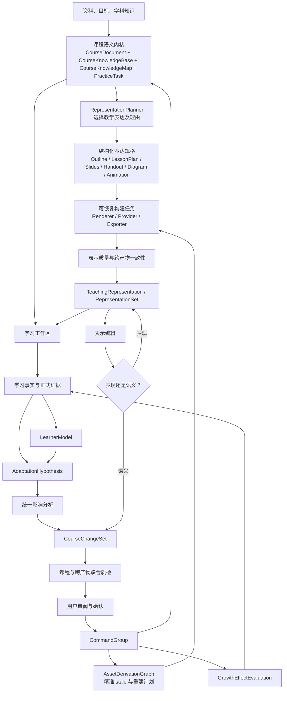
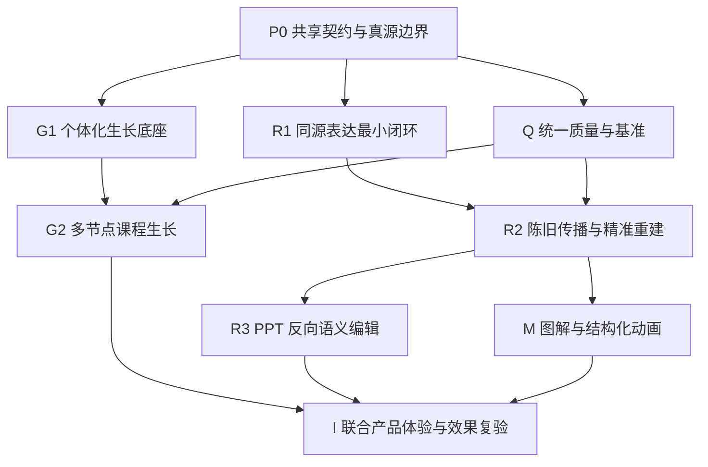

# 灵知结构化同源与个体化生长完整实施需求与技术交接书

> 文档状态：完整实施交接基线
> 文档版本：V2.0
> 日期：2026-07-16
> 当前代码基线：`main@b318111`
> 适用对象：课程维护者、学生、AI 工程师、后端工程师、前端工程师、测试工程师
> 上位产品真源：[`docs/product-blueprint.md`](../product-blueprint.md)
> 课程生长细节参考：[《灵知课程生长引擎结构性改造需求与技术交接书》](./灵知课程生长引擎结构性改造需求与技术交接书.md)
> 原始总需求：[《灵知 AI 课程智能体需求文档：结构化同源与个体化生长》](./灵知AI课程智能体需求文档.md)
> 当前课程生长 OpenSpec：[`openspec/changes/build-structured-adaptive-course-ai/`](../../openspec/changes/build-structured-adaptive-course-ai/)
> 分支边界：PR #9（`agent/courseware-workbench`）截至本文定稿时仍为未合并 Draft，不属于本实施基线

---

## 0. 文档用途与替代关系

本文档用于指导灵知从“能够生成和修改一门课程”，升级为同时具备以下两种核心能力的完整课程系统：

1. **结构化同源**：大纲、正文、教案、幻灯、讲义、题目、图解和动画来自同一个课程语义内核。一处语义变化能够找到全部受影响对象，并通过重新编译保持一致；在幻灯等派生产物中发生的语义修改，也能转换为课程变化候选，确认后回写课程真源。
2. **个体化生长**：学生的提问、笔记、错题、作答、诊断和理解反馈形成可追溯证据。AI 据此提供当下支持，必要时提出局部或多节点课程调整；所有正式变化有依据、有范围、可确认、可拒绝、可撤销，并通过后续学习证据验证是否有效。

上一份《灵知课程生长引擎结构性改造需求与技术交接书》完整描述了第二条能力，但主动排除了 PPT、视频、动画等教学表达生产，因此无法单独达成“多种课程产物同源联动”的目标。

从本文件生效起：

- 本文档是两条能力联合实施、集成顺序和最终验收的主交接书。
- 上一份课程生长交接书继续作为证据、假设、影响分析、变更集和效果复验的详细参考。
- 如果两份文档在实施范围上冲突，以本文档为准。
- 不删除上一份文档，也不把两份文档实现成两套课程主链。

### 0.1 文档优先级

```text
docs/product-blueprint.md
→ 本完整实施交接书
→ 课程生长交接书
→ 原始总需求文档
→ 对应 OpenSpec
→ 历史审计、研究和旧设计文档
```

### 0.2 OpenSpec 要求

现有 `build-structured-adaptive-course-ai` 明确排除了 PPT、视频和动画生产，不得假装它已经承载本次新增范围。

正式开发前必须：

1. 保留并修订现有 OpenSpec，继续承载“个体化生长”主链。
2. 新建一个依赖共享课程内核的 OpenSpec，建议命名为 `build-same-source-teaching-representations`，承载教学表达编译、派生依赖、陈旧检测、重新生成和反向语义编辑。
3. 两个 OpenSpec 必须引用同一套 `CourseDocument / CourseBlock / CourseChangeSet / revision vector / quality protocol`，禁止分别定义自己的课程真源、修改协议或任务系统。
4. 用本文档作为联合验收基线，不能只分别完成两个 OpenSpec 就宣布产品目标已经实现。

---

## 1. 执行摘要

### 1.1 最终要交付的产品行为

系统完成后必须真实支持：

```text
课程维护者修改正文中的一个概念
→ 系统识别语义变化
→ 展示被影响的章节、过渡、目标、例子、题目、教案、讲义和幻灯
→ 用户确认
→ 课程真源原子修改
→ 所有受影响派生产物进入待重建状态
→ 通过同一语义重新编译
→ 质量检查通过后发布新修订
```

以及：

```text
学生在某个课程块提问、答错或留下笔记
→ 原始事实被记录并定位到课程、知识和题目
→ 系统形成有证据、有反证规则的适应假设
→ 当下提供临时解释、例子、图解或检查
→ 证据足够时提出正式课程变化候选
→ 用户查看理由、范围和差异后确认
→ 个人课程分支安全改变
→ 相关讲义、练习、幻灯或动画按需重建
→ 后续学习结果验证变化是否有效
```

### 1.2 不是要做什么

本项目不是：

- 生成大纲、教案、PPT、讲义和题目五份互不关联的文本文件。
- 给五种产物分别维护五套 prompt、数据库和状态机。
- 修改正文后把五个文件全部无脑重新生成。
- 学生一次答错后自动重写整门课程。
- 让 AI 不经确认直接修改正式课程或跨课程学科知识库。
- 把动态动画、自由视频或数字人当作课程可用性的前提。
- 新建一个长期占用主界面的复杂“课程编排工作台”。

### 1.3 一句话架构

> 一份课程语义真源，向外编译多种教学表达，向内吸收真实学习证据；所有语义变化通过同一个变化协议传播，所有教学效果通过后续证据验证。

---

## 2. 产品背景、现状与缺口

### 2.1 产品愿景

灵知不是一次性 AI 课件生成器，而是一个持续维护课程一致性、理解每个学生并让个人课程逐步生长的 AI 学习系统。

完整产品链为：

```text
资料 / 学科知识 / 教学目标
→ 结构化课程语义
→ 多种教学表达与正式题目
→ 学习现场
→ 学习行为与原始事实
→ 学习者模型与适应假设
→ 临时教学支持或正式变化候选
→ 用户确认与课程命令
→ 课程新修订与派生产物重建
→ 新的学习行为
→ 效果复验
```

### 2.2 当前已有能力

当前 `main@b318111` 已有以下可复用原料：

| 能力 | 当前基础 | 本次处理 |
| --- | --- | --- |
| 课程真源 | `CourseDocument / CourseBlock`、稳定 ID、修订和课程命令 | 保留并扩展修订事件 |
| 课程生成 | 生成 `v4`、prompt `v8`、难度、资料、质量和单次修复 | 保留，接入统一质量与表达规划 |
| 课程知识 | `SubjectKnowledgeLibrary / CourseKnowledgeBase / CourseKnowledgeMap` | 保留，作为影响分析与表达编译依据 |
| 正式题目 | 题目、能力和知识映射已有部分链路 | 提升为正式关联对象，不复制进课件文本 |
| 生成运行时 | 后台任务、断点、生成工作区、节点状态和失败恢复 | 保留，扩展为通用可恢复构建任务 |
| 学习事实 | 阅读、笔记、AI 对话、练习、诊断、快照和学习记录 | 保留为证据来源 |
| 学习者模型 | 从正式事实确定性重算部分状态 | 保留，不允许派生产物另建画像 |
| 局部变化 | 单块候选、多范围提案、接受、拒绝、重生和过期 | 迁移到统一 `CourseChangeSet` |
| 媒体零件 | 媒体块、Mermaid、代码执行、媒体渲染等零散能力 | 纳入正式教学表达编译层 |

当前基线验证结果沿用上一轮：

- 后端测试：`367 passed`
- 前端测试：`270 passed`
- 前端生产构建：通过

上述结果只证明当前基线可运行，不证明本文档目标已经实现。

### 2.3 当前核心缺口

#### 缺口一：课程产物没有正式同源编译链

目前大纲、教案、PPT、讲义、题目和媒体没有统一的表示对象、派生依赖和修订协议。即使某些产物能够由 AI 单独生成，也无法回答：

- 它来自哪些课程块、知识节点、目标和资料？
- 上游哪个修订变化后它已经过期？
- 哪些页面需要重建，哪些页面完全不受影响？
- 修改幻灯标题只是版式变化，还是改变了课程语义？
- 新幻灯和正文、讲义、答案是否仍然一致？

#### 缺口二：个体化变化链尚未形成稳定闭环

当前存在证据、学习者模型、AI 老师和局部候选零件，但仍缺少统一证据锚点、可解释假设、多节点变化规划、联合质检、原子提交和效果复验。

#### 缺口三：两条链没有共享变化协议

如果先分别开发“PPT 同步”和“课程生长”，极易形成：

```text
课程修改一套接口
PPT 修改一套接口
AI 适配一套接口
知识库更新一套接口
题目重生成一套接口
```

最终它们只能通过文本复制勉强同步。本文档的核心改造是让所有语义变化都进入同一个 `CourseChangeSet + ChangeOperation + CommandGroup` 协议。

---

## 3. 两张目标体验的准确产品定义

### 3.1 目标体验 A：一处改变，全课及全部课程产物联动

课程维护者看到的不是五个失联文件，而是一门课程的五种用途视图：

| 用户看到的名称 | 系统中的真实性质 | 真源 |
| --- | --- | --- |
| 大纲 | `CourseDocument` 结构投影 | 章节、块顺序、目标与依赖 |
| 教案 | 教师教学表达 | `LessonPlanSpec` 派生于课程语义 |
| PPT | 幻灯教学表达 | `SlideDeckSpec` 派生于课程语义 |
| 讲义 | 学习者阅读表达 | `HandoutSpec` 派生于课程语义 |
| 题目 | 正式 `PracticeTask` 及其导出视图 | 题目本身是正式实体，不只是 PPT 中的一段文字 |

关键要求：

1. 修改课程正文中的语义，系统必须先分析影响，再修改真源。
2. 依赖该语义的教案、PPT、讲义、题目和图解被精准标记为 `stale`。
3. 低成本派生内容可自动排队重建，高成本内容根据策略按需重建。
4. 重建失败时旧产物仍可访问，但必须显示“基于旧课程修订”，不得伪装成最新。
5. 修改 PPT 时先区分表现变化和语义变化；只有语义变化才回到课程变化候选。
6. 用户确认语义变化后，目录、正文、知识映射、后续过渡、题目与全部派生产物按依赖顺序更新。

### 3.2 目标体验 B：一次学习，个人课程再生

学生看到的是同一门课程基于个人证据长出的受控分支：

1. 提问、笔记、错题和正式练习首先保存为原始事实。
2. 系统展示它引用了哪些事实，而不是直接给学生贴稳定标签。
3. 证据不足时只提供临时解释、例子、图解或理解检查。
4. 证据足够时，系统建议调整当前段、当前块、当前小节、后续章节或相关教学表达。
5. 正式变化必须展示理由、范围、差异、预期效果和质量状态。
6. 学生可以接受、拒绝、重生、限制范围或撤销。
7. 接受后修改当前个人课程分支，不影响其他学生和公共课程。
8. 新课程修订会使相关讲义、练习、幻灯、图解或动画按需更新。
9. 后续同类任务用于判断这次变化有效、无效、证据不足或有害。

### 3.3 两种体验的共同内核

两种体验看似不同，但内部必须共享：

```text
稳定课程对象
+ 稳定知识和题目引用
+ 修订向量
+ 影响分析
+ CourseChangeSet
+ 联合质量检查
+ 用户确认
+ CommandGroup
+ 派生依赖图
+ 可观测任务
+ 撤销与效果复验
```

---

## 4. 不可妥协的结构原则

### 4.1 语义只有一份正式真源

| 对象 | 唯一正式真源 | 禁止成为竞争真源的对象 |
| --- | --- | --- |
| 课程结构与正文 | `CourseDocument / CourseBlock` | Markdown 导出、PPT 文本、教案 JSON、前端缓存 |
| 当前课程知识语义 | `CourseKnowledgeBase` | prompt 内临时知识列表、幻灯备注 |
| 课程与知识关系 | `CourseKnowledgeMap` | 散落在课件中的复制标签 |
| 正式题目与答案 | `PracticeTask / MasteryCriterion` | PPT 页面内复制的题目文本 |
| 学习事实 | `LearningEvent / PracticeAttempt / LearningRecord` | AI 自己总结的隐藏记忆 |
| 正式学习者状态 | 由事实派生的 `LearnerModel` | PPT、AI 对话或某个页面维护的个人标签 |
| 正式课程变化 | `CourseChangeSet → CommandGroup → Receipt` | 直接写 JSON、直接改 PPT 后覆盖课程 |

### 4.2 派生产物可以保存表达，不能复制语义所有权

教案、幻灯和讲义必然包含适合各自场景的措辞，但每个关键内容单元必须保存 `source_bindings`，指出其来源课程块、知识点、目标、题目和源修订。

派生产物可以：

- 缩写、重排、视觉化和补充表现说明。
- 保存版式、主题、镜头、语速、备注和交互状态。
- 使用不同于正文的等义表述。

派生产物不可以：

- 独立拥有课程核心定义、结论、公式、答案或知识顺序。
- 在没有来源绑定的情况下产生正式教学事实。
- 在上游已变化后继续标记为最新。

### 4.3 语义修改和表现修改分离

| 修改类型 | 示例 | 处理方式 |
| --- | --- | --- |
| 表现修改 | 字体、颜色、布局、动画时长、讲解语速 | 只修改 `TeachingRepresentation` 修订 |
| 等义表达修改 | 幻灯标题更简洁、讲义段落换一种说法 | 通过语义等价检查后只改表示修订 |
| 语义修改 | 定义变化、例子结论变化、知识顺序变化、目标变化 | 转换为 `CourseChangeSet`，确认后修改课程真源 |
| 无法判断 | 一句话可能只是缩写，也可能改变概念 | 保持待解释，不得静默回写 |

### 4.4 生成与判定分离

- 生成模型负责产出候选，不负责给自己判定“已经正确”。
- 确定性规则负责 schema、引用、修订、公式、代码和依赖硬门。
- 学科评审负责事实、推导、答案和专业准确性。
- 教学评审负责目标、支架、任务、难度和表达选择。
- 跨产物评审负责同一术语、数字、结论、答案和顺序是否一致。
- 效果评审负责后续学习是否真正改善。

### 4.5 受控自主

- AI 可以自动分析、规划、生成、质检和标记过期。
- AI 可以自动展示低风险临时解释或等义替代表达。
- AI 不得未经确认修改正式课程语义。
- 用户确认语义变化后，相关派生产物的标记过期是确定性动作，不需要再次确认。
- 自动重建是否立即执行由成本和策略决定；发布前必须通过质量门。

---

## 5. 目标总架构



### 5.1 四层职责

#### 实体层

负责稳定对象、ID、修订、引用、状态和历史。

#### 功能层

负责用户看得见的生成、阅读、编辑、提问、建议、审阅、确认、重建、撤销和效果反馈。

#### 逻辑层

负责课程生成、表达编译、证据评价、影响分析、变化执行、陈旧传播和效果复验。

#### AI 能力层

负责在严格输入和结构化输出约束下进行规划、候选生成、编辑分类、学科评审和教学评审，不拥有正式数据真源。

---

## 6. 核心实体与数据契约

### 6.1 课程谱系 `CourseLineage`

用于表达个人课程从哪一门基础课程、哪个修订生长而来，但不建立第二份隐藏正文。

```text
CourseLineage
  course_id
  owner_user_id
  origin_course_id?
  forked_from_revision?
  branch_kind: canonical | personal
  current_revision
  created_at
```

规则：

- 当前个人课程的 `CourseDocument` 仍是该个人课程唯一正式真源。
- 个人变化默认只作用于当前 `course_id + owner_user_id`。
- 不自动向公共课程、其他用户或正式学科库传播。
- 后续若要将个人有效变化提升为公共课程候选，必须另行设计审核流程，不属于本阶段自动能力。

### 6.2 教学表达计划 `RepresentationPlan`

```text
RepresentationPlan
  plan_id
  course_id
  source_revision_vector
  target_scope
  learning_objective_ids
  knowledge_refs
  practice_refs
  evidence_refs
  requested_representations[]
  rejected_representations[]
  pedagogical_reasons[]
  cost_class
  accessibility_requirements[]
  quality_requirements[]
  fallback_chain[]
  planner_version
  status
```

`requested_representations` 不能只写“生成 PPT”，必须说明：

- 解决什么教学问题。
- 面向谁、在哪个课程位置使用。
- 为什么这种表达优于纯文本。
- 使用哪些源块、知识、目标、资料和题目。
- 失败时退化为什么。

### 6.3 教学表达 `TeachingRepresentation`

```text
TeachingRepresentation
  representation_id
  course_id
  representation_type
  source_bindings[]
  source_revision_vector
  spec_id
  artifact_ids[]
  semantic_fingerprint
  render_fingerprint
  quality_report_id
  revision
  status: planned | building | ready | stale | failed | archived
  stale_reasons[]
  fallback_representation_id?
  created_at
  updated_at
```

`source_bindings` 至少支持：

```text
course_id
section_id?
block_id?
span_anchor?
knowledge_node_ids[]
learning_objective_ids[]
practice_task_ids[]
material_evidence_ids[]
source_revisions
```

### 6.4 表达集合 `RepresentationSet`

同一语义可以有默认、替代、组合、无障碍和降级表达。

```text
RepresentationSet
  set_id
  course_id
  target_scope
  default_representation_id
  alternative_representation_ids[]
  complementary_representation_ids[]
  accessibility_representation_ids[]
  fallback_chain[]
  selection_policy
  revision
```

不得用固定“视觉型学生”“听觉型学生”选择表达。选择依据是当前任务、知识形态、证据、设备、无障碍和成本。

### 6.5 结构化表达规格

第一阶段至少定义：

| 规格 | 用途 | 必备结构 |
| --- | --- | --- |
| `OutlineProjection` | 大纲视图与导出 | 章节、目标、先修、知识覆盖、块责任 |
| `LessonPlanSpec` | 教案 | 教学目标、时间、活动、提问、误区、检查、教师备注 |
| `SlideDeckSpec` | PPT | 页面目的、来源绑定、标题、要点、视觉、讲者备注、练习引用 |
| `HandoutSpec` | 讲义 | 阅读结构、解释、例子、公式、提示、知识与题目引用 |
| `PracticeSheetSpec` | 题目导出 | 正式题目引用、作答区域、答案和评分量规策略 |
| `DiagramSpec` | 图解/图表 | 节点、关系、数据、坐标、标签、来源和替代文本 |
| `AnimationSpec` | 结构化动画 | 场景、状态、变换、时间轴、公式/对象绑定、暂停点和降级帧 |

自由视频和数字人不是第一阶段完成条件。动画优先采用可验证的结构化 `AnimationSpec`，而不是不可审计的自由视频。

### 6.6 派生依赖图 `AssetDerivationGraph`

```text
AssetDerivationGraph
  graph_id
  course_id
  nodes[]
  edges[]
  graph_revision

DerivationNode
  node_id
  node_type: source | spec | representation | artifact
  object_id
  revision_or_fingerprint
  status

DerivationEdge
  from_node_id
  to_node_id
  dependency_kind
  dependency_scope
  rebuild_policy
```

主要依赖类型：

```text
semantic_content
structure_order
learning_objective
knowledge_reference
practice_reference
material_evidence
visual_theme
layout
narration
accessibility
```

语义变化只使依赖语义的对象过期；主题变化只使渲染产物过期，不得重生成课程内容。

### 6.7 表示编辑提案 `RepresentationEditProposal`

```text
RepresentationEditProposal
  proposal_id
  representation_id
  base_representation_revision
  edit_payload
  classification: presentation | equivalent_semantic | semantic | ambiguous
  classification_reasons[]
  affected_source_bindings[]
  generated_change_set_id?
  status
```

### 6.8 课程生长对象

以下对象沿用上一份交接书的完整定义：

- `EvidenceAnchor`
- `EvidenceItem`
- `AdaptationHypothesis`
- `ImpactAnalysis`
- `CourseChangeSet`
- `ChangeOperation`
- `GrowthQualityReport`
- `CommandGroup`
- `ActionReceipt`
- `GrowthEffectEvaluation`

本文件新增一条硬约束：`ImpactAnalysis` 和 `CourseChangeSet` 必须同时返回受影响的课程语义对象和派生产物对象，不能只分析正文块。

### 6.9 统一变化操作

第一阶段至少支持：

```text
PATCH_SPAN
REPLACE_BLOCK
INSERT_BLOCK
DELETE_BLOCK
MOVE_BLOCK
UPDATE_BLOCK_META
UPDATE_LEARNING_OBJECTIVE
UPDATE_COURSE_KNOWLEDGE
UPDATE_KNOWLEDGE_MAP
UPDATE_PRACTICE_TASK
UPDATE_FORMAL_REFS
UPDATE_REPRESENTATION_SPEC
MARK_REPRESENTATION_STALE
```

其中 `UPDATE_REPRESENTATION_SPEC` 只处理表现或已验证等义的修改；语义变化必须先转换为课程语义操作。

---

## 7. 结构化同源主链

### 7.1 初始课程生产

```text
用户目标与资料
→ MaterialAsset / EvidenceUnit
→ 教学 brief
→ 学习目标、课程知识覆盖和难度契约
→ CourseDocument 蓝图与 CourseBlock 计划
→ 正文、正式题目和课程知识共同生成
→ 课程质量检查
→ 发布 CourseDocument + CourseKnowledgeBase + CourseKnowledgeMap + PracticeTask
→ 形成 RepresentationPlan
→ 基础教学表达异步编译
```

发布策略：

- 正文、知识、目标和正式题目通过课程硬门后，基础课程即可学习。
- 大纲投影必须随课程立即可用。
- 教案、讲义和题目导出作为低至中成本表达排队生成。
- PPT 按课程配置自动或按需生成。
- 图解和动画只在 `RepresentationPlan` 认为有明确教学价值时生成。
- 任一派生表达失败不得阻断基础课程发布。

### 7.2 课程语义修改后的传播

语义修改提交采用四阶段协议：

#### 阶段 A：正式语义原子提交

在同一个 `CommandGroup` 中预演、质检并提交：

- `CourseDocument / CourseBlock`
- `CourseKnowledgeBase`
- `CourseKnowledgeMap`
- `LearningObjective`
- `PracticeTask / MasteryCriterion`

任一硬性操作失败，不得留下半应用课程状态。

#### 阶段 B：确定性陈旧传播

提交成功后，根据新旧修订和派生依赖图：

```text
计算受影响绑定
→ 将相关 spec / representation / artifact 标记 stale
→ 保存 stale reason 和源修订差异
→ 生成 RepresentationRebuildPlan
```

这一阶段不调用大模型也必须能够完成。

#### 阶段 C：异步精准重建

- 只重建受影响页面、段落、题组、图解或动画。
- 同一产物中未受影响的已验证单元继续复用。
- 构建任务支持暂停、取消、重试、断点和服务重启恢复。
- 旧产物保留用于回退和历史引用，但状态必须为旧修订。

#### 阶段 D：质量通过后发布

- 新产物通过自身质量门与跨产物一致性门后进入 `ready`。
- 失败时保持 `failed/stale`，不得覆盖最后一个可用版本。
- 用户界面显示当前课程已更新、哪些产物正在重建、哪些暂时仍是旧版本。

### 7.3 “一处改变”不是全量重写

示例：将正文中“矩阵乘法就是行乘列”改为“矩阵乘法表示线性变换的复合，行列计算是其坐标实现”。

系统应得到类似影响结果：

```text
直接影响：当前定义块、对应 PPT 页面、讲义段落
依赖影响：后续复合变换解释、章节过渡、两道概念题
可能影响：教师提问提示、一个动画旁白
保护对象：无关计算例题、历史学生作答、个人笔记原文
```

不得默认重生成整门课程，也不得只修改当前一句话。

### 7.4 五种核心产物的编译规则

#### 大纲

- 大纲本质是 `CourseDocument` 的结构投影，不另存独立章节树。
- 展示章节、目标、知识覆盖、先修、块责任和状态。
- 目录顺序改变时直接重新投影，不调用大模型复制一份新大纲。

#### 教案

- 以课程目标、课程块、易错点、练习和教学时间为输入。
- 每个教学活动绑定源课程块和目标。
- 教师备注可以独立保存，但若备注改变课程语义，必须进入课程变化候选。

#### PPT

- 每页必须有明确 `slide_purpose` 和 `source_bindings`。
- 标题、要点、图解、例题和讲者备注分别结构化保存。
- 正式题目使用引用，不复制成失联题目。
- 导出 `.pptx` 是渲染结果，`SlideDeckSpec` 才是可编辑表示真源。

#### 讲义

- 保留比 PPT 更完整的推导、例子和解释。
- 每个段落绑定课程块或知识点。
- 可针对个人课程修订生成个人讲义，但不得影响其他用户。

#### 题目

- 正式题目是独立领域实体，不是派生文件中的文本片段。
- 题目页、练习册和 PPT 练习页都是 `PracticeTask` 的不同投影。
- 正式语义变化影响题目时，必须重新检查答案、评分量规、能力点和易错点。

---

## 8. PPT 等派生产物的反向编辑

### 8.1 编辑分类流程

```text
用户修改 SlideDeckSpec 或可解析的 PPT
→ 提取修改前后结构化差异
→ 确定性规则先分类
→ 必要时 AI 判断语义等价性
→ presentation / equivalent_semantic / semantic / ambiguous
```

### 8.2 表现修改

例如：

- 改颜色、字号、布局。
- 将一张图移到右侧。
- 调整动画速度。
- 修改不承载语义的标题样式。

处理：只产生新的表示修订和渲染产物，不影响课程真源和其他课程产物。

### 8.3 等义表达修改

例如将“矩阵乘法的本质”改成“矩阵乘法意味着什么”，但内容和目标不变。

处理：

1. 运行语义等价与来源绑定检查。
2. 通过后只修改 `SlideDeckSpec`。
3. 不触发正文、教案和讲义重建。
4. 保存判定依据，允许人工改判为语义变化。

### 8.4 语义修改

例如将例子、定义、结论或知识顺序改成新的含义。

处理：

```text
表示差异
→ 生成对应 ChangeOperation
→ ImpactAnalysis 分析正文、知识、题目和其他表示
→ 展示“这次修改将影响什么”
→ 用户确认
→ CommandGroup 修改课程语义
→ AssetDerivationGraph 标记相关产物 stale
→ 精准重建并重新发布
```

PPT 不能直接覆盖正文。

### 8.5 无法判断的修改

- 标记为 `ambiguous`。
- 显示原文、修改后文本和可能影响。
- 要求用户选择“只改当前 PPT”或“改变课程含义并联动”。
- 未确认前不修改任何正式语义对象。

---

## 9. 个体化生长主链

### 9.1 证据进入

支持的原始事实至少包括：

- AI 提问和上下文选择。
- “已解决 / 还不清楚 / 没帮助”等反馈。
- 手写笔记、问题标记和书签。
- 正式作答、提示使用、修改过程、答案和评分。
- 错因诊断、补救和独立复验。
- 阅读、停留和跳过等弱行为信号。
- 用户对课程变化或教学表达的接受、拒绝和重生。

每条事实先保存，再通过统一 `EvidenceAnchor` 解析到：

```text
course_id
section_id
block_id
span
knowledge_node_ids
ability_point_ids
misconception_point_ids
practice_task_id
representation_id?
source_revision
```

无法解析时保留事实和失败原因，不得静默吞掉，也不得伪造精确位置。

### 9.2 原始事实、学习者模型和适应假设分层

```text
一次答错
≠ 已确认易错点
≠ 稳定学习者标签
≠ 自动修改课程
```

正式变化之前必须有 `AdaptationHypothesis`：

- 支持证据。
- 反证与失效条件。
- 问题类型。
- 置信度及其解释。
- 最小作用范围。
- 临时支持方式。
- 正式变化建议。
- 后续验证方式。

### 9.3 临时支持与正式变化分流

| 情况 | 系统行为 |
| --- | --- |
| 当下求助、证据不足 | 原位生成临时解释、例子、图解或检查，不改正式课程 |
| 单条强证据明确指出局部缺口 | 形成局部变化候选 |
| 多条独立证据指向同一能力或误区 | 扩展影响分析范围 |
| 证据指向表达问题而非课程语义问题 | 优先增加替代表达，如图解或结构化动画 |
| 证据与已有假设矛盾 | 降低置信度、缩小范围或撤销假设 |
| 后续证据显示变化无效或有害 | 生成修正、回退或改变表达策略的候选 |

### 9.4 个体化变化可以影响什么

正式个人课程候选可以：

- 补足某段推导。
- 改写解释或例子。
- 调整当前和后续块的支架。
- 新增理解检查或练习。
- 调整难度、节奏和迁移距离。
- 修改个人课程知识颗粒度和映射。
- 新增图解、幻灯、讲义补充或结构化动画。
- 对后续章节提前增加过渡和复习。

但不得：

- 自动改变其他用户课程。
- 自动写回 `SubjectKnowledgeLibrary`。
- 用新正文重算历史作答。
- 把 AI 临时解释伪装成已确认正式内容。

### 9.5 多节点规划

多节点变化必须先形成统一计划：

```text
问题与教学目标
→ 最小充分影响范围
→ 操作依赖图
→ 课程语义候选
→ 派生产物影响和重建计划
→ 合成后课程与跨产物联合质检
→ 一个统一变更集供用户审阅
```

用户可以限制为“只应用当前小节”“当前小节及下一节”等范围，但若所选范围破坏依赖闭包，系统必须解释并要求重新规划。

### 9.6 效果复验

变化应用后必须建立 `GrowthEffectEvaluation`，观察：

- 同类错误是否减少。
- 求助次数是否下降。
- 支架依赖是否降低。
- 独立作答和迁移任务是否改善。
- 新增图解或动画是否真正被使用并有帮助。
- 是否引入新的误解或负担。

结果只能是：

```text
effective
ineffective
insufficient_evidence
harmful
```

没有新证据不能被判定为有效。

---

## 10. 两条主链的联动规则

### 10.1 学习证据既能改变语义，也能改变表达

系统首先判断问题属于：

| 问题类型 | 优先动作 |
| --- | --- |
| 课程事实或逻辑错误 | 修改课程语义，并重建相关表达 |
| 推导跨度过大 | 补足课程块或增加个人支架 |
| 纯文本不适合空间/动态概念 | 增加图解、动画或交互表达 |
| 难度与学生当前状态不匹配 | 改个人课程支架、例子和任务 |
| 单次表达偏好 | 临时切换替代表达，不直接形成长期标签 |

### 10.2 同一变化只生成一次语义计划

例如学生不理解矩阵复合：

- 不能让“课程正文 AI”生成一份修改。
- 不能让“PPT AI”再生成另一份修改。
- 不能让“练习 AI”独立生成第三份修改。

正确方式：

```text
一个 AdaptationHypothesis
→ 一个 ImpactAnalysis
→ 一个 CourseChangeSet
→ 多个语义和表示操作
→ 一次联合质检和确认
```

### 10.3 课程变化完成不等于全部产物同步完成

系统必须分别展示：

- 课程语义已应用。
- 大纲已同步。
- 题目正在复核。
- 讲义正在重建。
- PPT 第 8、9 页正在重建。
- 动画构建失败，已回退为静态分步图。

不得只显示一个虚假的“100% 已完成”。

---

## 11. 统一质量系统

### 11.1 课程语义质量

沿用四层质量：

| 层级 | 检查内容 |
| --- | --- |
| 确定性层 | schema、引用、修订、依赖、公式、代码、答案和占位符 |
| 学科层 | 事实、推导、概念边界、术语、答案和来源 |
| 教学层 | 目标、支架、任务、难度、迁移和反馈 |
| 效果层 | 后续作答、求助、支架依赖和反馈是否改善 |

### 11.2 各类教学表达质量

| 表达 | 关键质量门 |
| --- | --- |
| 大纲 | 结构、目标、先修、知识覆盖和块责任一致 |
| 教案 | 时间可执行、活动与目标对齐、提问和检查完整 |
| PPT | 每页目的明确、信息密度合理、公式与正文一致、讲者备注完整 |
| 讲义 | 推导完整、阅读层级清楚、例子和练习引用正确 |
| 题目 | 能力对齐、答案正确、评分可执行、难度和误区明确 |
| 图解 | 节点关系、标签、数据、方向和替代文本正确 |
| 动画 | 状态变化、时间顺序、公式或对象映射正确，关键帧可降级 |

### 11.3 跨产物一致性

每次重建至少检查：

- 定义、术语和符号一致。
- 数字、单位和例子结论一致。
- 章节和教学顺序无矛盾。
- PPT、讲义和教案引用同一正式题目。
- 题目答案和课程定义一致。
- 图解和动画没有表达与正文相反的关系。
- 派生产物的 `source_revision_vector` 与当前源修订一致。

### 11.4 基准集

除原有八种学科教学模式课程基准外，新增两类基准：

1. **同源传播基准**：对固定课程执行定义、例子、顺序、目标、题目和主题修改，验证影响范围、陈旧传播和精准重建。
2. **跨产物一致性基准**：固定课程同时生成大纲、教案、PPT、讲义和题目，检查事实、术语、数字、公式、答案、顺序和来源绑定。

---

## 12. 服务、接口与任务契约

具体 URL 可沿用项目现有路由风格，但领域职责必须清楚。

### 12.1 课程变化服务

```text
GrowthEvidenceService
HypothesisService
ImpactAnalyzer
CourseChangePlanner
CandidateCompiler
GrowthQualityService
CommandGroupExecutor
GrowthEffectEvaluator
```

详细契约沿用课程生长交接书。

### 12.2 教学表达服务

```text
RepresentationPlanner
RepresentationRegistry
RepresentationBuildService
DerivationGraphService
StalenessPropagationService
RepresentationEditClassifier
CrossRepresentationQualityService
RepresentationPublishService
```

### 12.3 必要逻辑接口

#### 规划教学表达

```text
Input:
  course_id
  source_revision_vector
  target_scope
  requested_type?
  actor_context
  learning_context?

Output:
  representation_plan_id
  requested_representations
  rejected_representations
  reasons
  cost_and_fallback
```

#### 构建表达

```text
Input:
  representation_plan_id
  representation_type
  idempotency_key

Output:
  build_job_id
  representation_id
  status
  progress
  failure_reason?
```

#### 查询派生影响

```text
Input:
  course_change_set_id

Output:
  affected_representations
  affected_units
  stale_reasons
  rebuild_order
  cost_estimate
  fallback_plan
```

#### 提交表示编辑

```text
Input:
  representation_id
  base_revision
  structured_diff

Output:
  edit_proposal_id
  classification
  reasons
  generated_change_set_id?
```

#### 确认语义修改

复用统一 `CourseChangeSet` 确认接口，不新建“PPT 回写课程”专用写入协议。

### 12.4 通用构建任务状态

```text
queued
planning
building
validating
ready
stale
paused
retrying
failed
cancelled
archived
```

任务必须保存：

```text
job_id
course_id
representation_id?
source_revision_vector
provider / model / renderer
stage
progress
checkpoint
retry_count
cost
failure_code
created_at / updated_at
```

任务系统必须复用现有生成运行时能力，不新建第二个前端轮询状态真源。

### 12.5 可观测事件

至少新增：

```text
representation_plan_created
representation_build_started
representation_build_checkpointed
representation_quality_completed
representation_published
representation_marked_stale
representation_rebuild_scheduled
representation_rebuild_failed
representation_edit_classified
representation_semantic_change_proposed
cross_representation_quality_failed
```

并与 `growth_trace_id / change_set_id / command_group_id` 关联。

---

## 13. 前端产品体验

### 13.1 保持现有学习工作区骨架

```text
左侧：课程目录、生成/变化/过期状态
中间：正式课程流、行内临时支持、教学表达和变化候选
右侧：AI 老师、证据、理由、影响范围和审阅
底部：学习记录、学习概况、知识库和 AI 老师入口
```

不得增加多个顶部平级页面来割裂阅读、练习、PPT、掌握和版本。

### 13.2 学生端教学表达

- 图解、动画和替代讲法原位挂在对应课程块。
- 通过轻量入口切换“正文 / 图解 / 动画 / 更详细讲义”等表达。
- 高成本表达未生成时显示明确状态和文本/静态降级。
- 个人表达和正式课程内容视觉上可区分，但不能使用突兀的大型工作台。
- “AI 建议调整”在目录和原位置显示轻量标记。

### 13.3 学生端变化审阅

- 显示证据摘要、理由、影响范围、差异和预期效果。
- 可选择“当前块”“本小节”“本小节及下一节”等范围。
- 系统检查依赖闭包，范围不足时解释原因。
- 支持确认、拒绝、重新生成、撤销。
- 应用后展示课程、题目和教学表达各自的同步状态。

### 13.4 课程维护者的多产物入口

不建立永久占满页面的复杂课件工作台。建议在课程页面提供一个“课程产物”入口，以抽屉、弹窗或独立全屏预览承载：

- 大纲。
- 教案。
- PPT。
- 讲义。
- 题目。
- 图解/动画等其他表达。

每个产物显示：

```text
当前修订
来源课程修订
最新 / 过期 / 构建中 / 失败
受影响单元
质量状态
重新构建
导出
编辑
历史版本
```

### 13.5 反向编辑交互

课程维护者修改 PPT 后：

- 表现修改直接保存。
- 语义等价修改显示“只更新当前 PPT”。
- 语义变化显示“检测到课程含义变化”。
- 展示将影响的正文、章节过渡、教案、讲义、题目和其他 PPT 页面。
- 用户确认后再修改课程真源。
- 重建过程按产物和单元显示真实状态，不使用虚假百分比。

### 13.6 无障碍与移动端

- 图解必须有替代文本。
- 动画必须有关键帧静态版、文字步骤或暂停控制。
- PPT 和讲义必须保持键盘可访问和阅读顺序。
- 移动端复杂编辑可退化为审阅和确认，不强行复刻桌面编辑器。

---

## 14. 实施路线与依赖顺序

本次不能把所有内容一次性大改，也不能让两个团队各自造一套体系。采用“共享内核先行，两条能力并行，联合验收收束”。



### 14.1 P0：共享内核

必须先完成：

- 冻结 `CourseDocument / CourseBlock` 正式真源边界。
- 确立统一修订向量和课程提交事件。
- 确立 `CourseChangeSet / ChangeOperation / CommandGroup / Receipt`。
- 确立 `EvidenceAnchor`。
- 确立 `source_bindings` 和 `AssetDerivationGraph` 最小 schema。
- 确立跨用户、跨课程和测试数据隔离。
- 确立一个可恢复任务协议供课程生成和表达构建复用。
- 修订现有 OpenSpec 并建立教学表达 OpenSpec。

P0 不完成，后续不得并行开发接口。

### 14.2 G1：个体化生长底座

- 修正 `node_id / block_id` 混用。
- 建立证据、假设和无行动原因。
- 跑通单块强证据闭环。
- 建立课程生长任务状态和可观测链。
- 保留现有 AI 老师和正文入口，不新建第二入口。

### 14.3 R1：同源表达最小闭环

第一批必须支持：

1. 大纲投影。
2. 教案结构化生成。
3. 讲义结构化生成。
4. 正式题目引用与练习册投影。
5. `SlideDeckSpec` 生成、预览和 `.pptx` 导出。

每类产物都必须有 `source_bindings` 和源修订，不接受只有五个 Markdown 文件的伪实现。

### 14.4 Q：统一质量

- 保留现有课程确定性和连贯性检查。
- 加入学科和教学评审。
- 加入各表达类型质量门。
- 加入跨产物一致性检查。
- 建立固定课程及变化基准。

### 14.5 G2：多节点课程生长

- 影响分析扩展到课程、知识、题目和派生产物。
- 一个问题生成一个多操作变化计划。
- 支持部分选择和依赖闭包。
- 实现原子课程提交、冲突、恢复和撤销。
- 建立效果复验。

### 14.6 R2：陈旧传播与精准重建

- 课程提交事件触发确定性派生影响分析。
- 支持单页、单段、单题组的精准 `stale`。
- 支持自动/按需重建策略和降级链。
- 构建失败保留最后可用版本。
- 前端展示真实同步状态。

### 14.7 R3：PPT 反向语义编辑

- 从 `SlideDeckSpec` 编辑开始，不先攻任意外部 PPT 文件的自由解析。
- 支持表现、等义、语义和模糊四类判断。
- 语义变化转为统一 `CourseChangeSet`。
- 跑通确认、回写、影响传播和全部受影响产物重建。
- 外部 `.pptx` 回导只在结构化 spec 稳定后实现。

### 14.8 M：图解与结构化动画

- 先支持 Mermaid/ECharts/确定性图形。
- 再支持公式、几何、数据和状态变化的 `AnimationSpec`。
- 必须提供静态关键帧和文字降级。
- 动画质量检查包括状态、顺序、标签、公式和交互暂停点。
- 自由视频与数字人不纳入本轮完成门槛。

### 14.9 I：联合收束

- 跑通下方两条完整演示验收。
- 验证课程变化、表达重建和学习效果共享同一 trace。
- 清理旧并行状态机和竞争真源。
- 完成迁移、中英文、桌面、移动、刷新、断网和服务重启验收。

---

## 15. 两条必须通过的完整演示验收

### 15.1 演示 A：结构化同源

#### 初始状态

同一门课程已经拥有：

- 大纲。
- 正文。
- 教案。
- PPT。
- 讲义。
- 正式题目。

所有对象都能显示来源课程修订和稳定绑定。

#### 操作一：从正文发起语义变化

**Given** 课程维护者将“矩阵乘法只是行乘列”修改为“矩阵乘法表达线性变换的复合，行列计算是坐标实现”。

**When** 系统分析变化。

**Then** 必须展示：

- 当前定义块的差异。
- 后续相关推导和章节过渡。
- 受影响的知识映射和学习目标。
- 需要复核的两道练习。
- 受影响的 PPT 页面、讲义段落、教案活动和图解。
- 不受影响并被保护的对象。

#### 操作二：确认并同步

**When** 用户确认。

**Then**：

- 课程语义对象原子提交。
- 大纲立即重新投影。
- 题目进入答案和能力复核。
- 教案、讲义和 PPT 的精确单元进入重建。
- 界面显示每类产物真实状态。
- 质量通过后依次发布新修订。
- 任一重建失败不破坏正式课程，旧产物显示过期状态。

#### 操作三：从 PPT 反向修改

**Given** 用户在 PPT 中把一个例子改成了具有不同数学含义的新例子。

**When** 系统检测到语义变化。

**Then**：

- 不直接覆盖正文。
- 展示对正文、讲义、题目和后续章节的影响。
- 用户可以只保留为 PPT 表达，或确认改变课程语义。
- 确认后复用同一课程变化协议完成全链更新。

#### 演示 A 通过标准

> 课程维护者维护的是一门始终一致的课程，而不是五份需要人工对照的文件。

### 15.2 演示 B：个体化生长

#### 初始状态

两个学生进入同一基础课程，各自拥有隔离的个人课程实例或个人分支。

#### 操作一：形成证据

**Given** 学生 A 在第二节针对矩阵复合提问“我会计算，但不理解为什么要这样乘”，随后在理解检查中答错，并留下一条相关笔记。

**When** 系统处理事实。

**Then**：

- 展示对话、错答和笔记三个原始事实来源。
- 正确定位到课程块、知识点、能力点和题目。
- 形成可解释适应假设，而不是直接写入稳定弱点。

#### 操作二：产生调整候选

**When** 假设达到行动条件。

**Then**：

- 建议在当前位置增加动态变换演示。
- 建议调整后续三个推导块的支架和顺序。
- 左侧相关章节显示轻量“AI 建议调整”标记。
- 学生可查看证据、理由、范围和预期效果。
- 学生可选择“只应用本小节”或“本小节及下一节”。

#### 操作三：确认与个人分支生长

**When** 学生确认“本小节及下一节”。

**Then**：

- 个人课程分支通过统一命令组修改。
- 正文新增解释和推导支架。
- `AnimationSpec` 构建并原位展示；失败时使用静态分步图。
- 新理解检查绑定正式能力点和预期效果。
- 学生 B 和基础课程完全不变。

#### 操作四：效果复验

**When** 学生 A 完成新理解检查和后续同类任务。

**Then**：

- 系统返回有效、无效、证据不足或有害之一。
- 有效时保留当前个人修订。
- 无效或有害时生成调整或回退候选。
- 不把“学生点击了确认”当成学习效果已经改善。

#### 演示 B 通过标准

> 课程不再要求学生适应固定内容，而是在证据、确认和效果验证的边界内与学生共同生长。

---

## 16. 自动化测试与非功能要求

### 16.1 自动化测试矩阵

| 测试层 | 必测内容 |
| --- | --- |
| schema | 新实体、非法状态、版本和向后兼容 |
| 真源边界 | 大纲、PPT、讲义不得成为竞争课程真源 |
| 来源绑定 | 块、span、知识、目标、题目和资料引用 |
| 修订 | 源修订、表示修订、过期和冲突 |
| 派生图 | 精准影响、主题隔离、循环依赖和重建顺序 |
| 构建任务 | 幂等、断点、暂停、取消、重试、重启和失败降级 |
| 反向编辑 | 表现、等义、语义、模糊和人工改判 |
| 证据 | 强弱证据、反证、衰减、冷却和重复合并 |
| 多节点变化 | 依赖图、部分选择、原子提交、冲突和撤销 |
| 质量 | 课程、各表达、跨产物、公式、答案和来源 |
| 隔离 | 用户、课程、个人分支和测试数据 |
| 前端 | 状态、差异、过期、重建、刷新、中英文和多视口 |
| 完整集成 | 演示 A 与演示 B 自动化和真实浏览器验收 |

### 16.2 性能与成本

- 课程语义提交和陈旧标记不得等待高成本媒体生成完成。
- 影响分析优先使用确定性依赖和索引，再调用 AI 解释复杂语义影响。
- 未受影响的产物单元必须复用。
- 高频弱证据不得触发高成本动画或整套 PPT 重建。
- 每个构建任务记录模型、渲染器、耗时、成本和缓存命中。
- 对自由媒体提供方必须有超时、重试、熔断和确定性降级。

### 16.3 安全与数据边界

- 所有接口必须携带真实 `user_id / course_id`。
- 学生个人证据和课程变化不得被其他用户读取。
- 导出产物不得包含内部 prompt、模型密钥、路径或隐藏学习者标签。
- 外部媒体和资料必须保存来源、许可和必要的引用信息。
- 测试必须使用隔离存储，禁止污染真实 `backend/data`。

### 16.4 可恢复性

- 语义提交必须可原子执行或通过事务日志恢复。
- 表达重建可以异步失败，但不得破坏最后可用版本。
- 刷新、退出、断网、服务重启后可恢复构建和审阅状态。
- 历史学习事实、作答和笔记继续引用当时课程修订。

---

## 17. 迁移与旧链处理

### 17.1 迁移原则

- 所有迁移可重跑、可审计、可报告。
- 不为历史对象伪造无法确定的来源绑定。
- 可以将旧产物标记为 `unbound_legacy`，等待人工绑定或重新生成。
- 旧 `ChangeProposal` 投影到统一变化审阅层，不补造不存在的历史假设。
- 旧单块候选保留 ID 和状态，通过适配层读取。
- 旧导出文件继续可访问，但不宣称已与最新课程同步。

### 17.2 旧链退役门禁

只有同时满足以下条件才能删除旧接口或状态机：

1. 历史数据可无损读取。
2. 新链支持原有接受、拒绝、重生、恢复和冲突能力。
3. 前端不再读写旧状态真源。
4. 演示 A、演示 B、完整测试和真实浏览器验收通过。
5. 迁移报告列出所有无法绑定或仍需兼容的对象。

---

## 18. 风险与防范

| 风险 | 表现 | 防范 |
| --- | --- | --- |
| 五份文件再次失联 | 每个产物独立 prompt 和存储 | 统一课程真源、source binding、派生图和修订 |
| 一处变化导致全量重建 | 成本和等待时间不可控 | 单元级绑定、精准 stale、缓存和增量构建 |
| PPT 反向污染课程 | 表现编辑被当成语义修改 | 四分类、人工确认、统一 ChangeSet |
| 课程与题目不一致 | 定义改了，答案没改 | 正式题目引用、联合质检和原子课程命令 |
| 个性化过度 | 一次错误重写整门课 | 假设层、反证、最小充分范围和确认 |
| AI 自评失真 | 候选生成后自己宣布正确 | 生成与判定分离、确定性硬门和独立评审 |
| 动画成为脆弱依赖 | 构建失败导致不能学习 | 静态关键帧、文字步骤和基础课程先发布 |
| 新旧系统并存 | 每个入口维护自己的候选 | 统一对象、适配层和退役门禁 |
| 多块半应用 | 正文改了，知识和题目未改 | CommandGroup、预演、依赖闭包和恢复日志 |
| 用户隔离失败 | 个人变化影响其他学生 | 课程谱系、所有权检查和跨用户测试 |

---

## 19. 必须向产品负责人请示的门禁

普通工程细节由技术负责人按本文档自主决策。出现以下情况必须停下说明方案和影响：

1. 想让 AI 不经确认自动修改正式课程语义。
2. 想把学生个人变化传播到公共课程、其他学生或跨课程知识库。
3. 想让 PPT、讲义、教案或某个媒体文件成为第二课程真源。
4. 无法区分表现编辑和语义编辑，准备默认选一边处理。
5. 想删除、覆盖或猜测填充历史课程、题目、笔记、作答或来源绑定。
6. 想新建第二套课程命令、任务调度、学习者模型或 AI 对话状态。
7. 无法同时保证部分选择和依赖闭包。
8. 想用自由视频替代可验证的公式、代码、图表或动画规格。
9. 新界面需要破坏左目录、中正文、右 AI 老师的学习工作区主结构。
10. 想降低学科正确性、用户隔离、修订安全或可恢复性来换取速度。
11. 想将当前未合并 PR 直接作为实现基线。

请示格式必须为：

```text
当前事实
方案 A / 方案 B
各自对产品、数据、兼容性和工期的影响
技术建议
需要产品负责人决定的唯一问题
```

---

## 20. 开发交付物

### 20.1 开工前

1. 当前代码与本文档逐项对照表。
2. 共享内核、课程生长和教学表达三个范围的影响文件清单。
3. 两个 OpenSpec 的依赖关系和联合验收说明。
4. 数据迁移、回滚、任务恢复和测试隔离方案。
5. 需要产品负责人决定的问题，一次性集中提出。

### 20.2 每个阶段

- 可运行代码和聚焦提交。
- schema、接口和状态迁移说明。
- 自动化测试结果。
- 真实样本或浏览器验收证据。
- 与上一阶段的回归对比。
- 当前尚未实现的边界，不得用目标架构冒充现状。

### 20.3 最终交付

- 更新后的课程生长 OpenSpec。
- 新建并完成的教学表达 OpenSpec。
- 演示 A 完整证据包。
- 演示 B 完整证据包。
- 八种课程教学模式质量对比。
- 同源传播和跨产物一致性基准报告。
- AI 失败、修订冲突、构建中断和多块提交失败演练。
- 中英文、桌面端、移动端、刷新、断网和服务重启验收。
- 迁移、旧链退役和残余风险报告。

---

## 21. 完成定义

只有同时满足以下条件，才可以宣称两张目标体验已经实现：

1. 全系统只有一套正式课程语义真源。
2. 大纲直接投影课程结构，不存在第二章节树。
3. 教案、PPT、讲义、题目导出、图解和动画拥有稳定来源绑定和源修订。
4. 课程语义变化能够精准找到所有受影响课程对象和派生产物。
5. 语义提交后，受影响产物被确定性标记过期并可精准重建。
6. 重建失败不破坏基础课程和最后可用产物，用户能看到真实状态。
7. PPT 表现修改不污染课程；语义修改必须转换为统一变化候选。
8. 课程正文、知识、目标和正式题目通过统一命令组保持一致。
9. 每条学习证据都能保存、定位、追踪或明确说明无法定位。
10. 原始事实、学习者模型、适应假设和正式课程变化严格分层。
11. 单块强证据和多位置稳定证据都能形成适当范围的候选。
12. 用户可以查看依据、理由、范围、差异、预期效果和同步状态。
13. 用户可以确认、拒绝、重生、限制范围和撤销。
14. 个人变化只影响当前用户课程分支。
15. 图解和结构化动画可以作为课程块表达生成，并具有静态或文字降级。
16. 初始课程、后续变化和派生产物共用统一学科、教学和一致性质量系统。
17. 至少一条真实个人课程变化完成后续效果复验。
18. 演示 A 与演示 B 全部通过，不能以局部接口测试替代完整体验。
19. 后端、前端、生产构建、OpenSpec、基准评价、中英文和真实浏览器验收全部通过。
20. 旧系统已迁移或明确保留兼容层，不存在新的竞争真源和隐藏状态机。

---

## 22. 给技术负责人的最终说明

本次改造不是简单增加一个 PPT 生成器，也不是继续把课程生长理解为“AI 重写一段正文”。真正的产品目标是建立统一的课程变化基础设施：

```text
课程语义决定所有教学表达的含义
教学表达根据使用场景重新组织同一语义
学习证据决定当前学生需要怎样的课程和表达
任何正式变化都有范围、依据、确认、质量、修订和回执
所有派生产物都知道自己来自哪里、是否过期、如何重建
后续学习结果决定这次变化是否值得保留
```

最终判断标准不是“生成了多少文件”，而是：

> 课程维护者只维护一门始终一致的课程；学生每学习一次，这门个人课程就能在可解释、可确认、可恢复的边界内继续生长。
