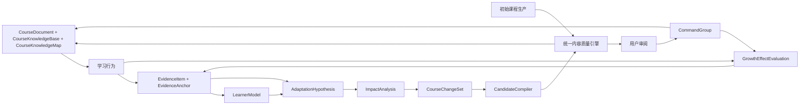
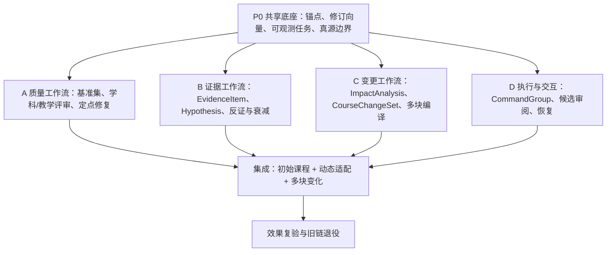

# 灵知课程生长引擎结构性改造需求与技术交接书

> 文档状态：开发交接基线
> 文档版本：V1.0
> 日期：2026-07-16
> 当前代码基线：`main@d592458`
> 分支边界：PR #9（`agent/courseware-workbench`）截至本文定稿时仍为未合并 Draft，不属于本交接书代码基线
> 适用范围：灵知学生端课程生产、学习证据、个体化调整与课程修改主链
> 主要读者：技术负责人、AI 工程师、后端工程师、前端工程师、测试工程师
> 上位产品真源：[`docs/product-blueprint.md`](../product-blueprint.md)
> 原始总需求：[《灵知 AI 课程智能体需求文档：结构化同源与个体化生长》](./灵知AI课程智能体需求文档.md)
> 当前 OpenSpec：[`openspec/changes/build-structured-adaptive-course-ai/`](../../openspec/changes/build-structured-adaptive-course-ai/)

---

## 0. 开发者必读

本文档不是一份新的平行产品蓝图，而是对现有“结构化同源 + 个体化生长”需求的结构性实施升级。它用来解决真实测试已经暴露的三类问题：

1. 课程内容质量不够稳定，只依靠 prompt 和表层质量规则难以达到高精度教学贴合。
2. 动态适配虽然有证据、学习者模型和变更提案的雏形，但用户短期体验中几乎感受不到。
3. 多节点联动修改只做了多范围提案容器，缺少真正的影响分析、统一规划、联合质检和原子执行。

实施时必须遵守以下四条：

- **不新建第二套课程主链。** `CourseDocument` 仍是正式课程真源，`CourseKnowledgeBase` 仍是当前课程语义层，`LearningEvent / PracticeAttempt / LearningRecord` 仍是学习事实来源。
- **不把三个现象当成三个孤立 Bug。** 它们必须统一收敛到“课程生长引擎”，共享证据、锚点、影响分析、变更计划、质量报告和执行回执。
- **不用重写代替完成度。** 保留当前已验证的生成 `v4`、prompt `v8`、质量 `v8`、知识库、连贯性、生成工作区、模型容错和任务调度能力。
- **任何会改变产品边界的决定必须先问产品负责人。** 特别是正式课程是否可以自动改写、是否跨课程使用个人证据、是否允许学生 AI 改写正式学科库、是否破坏历史作答和证据引用。

### 0.1 文档优先级

若实施过程中发现文档之间存在差异，按以下顺序处理：

```text
docs/product-blueprint.md
→ 本交接书
→ 原始总需求文档
→ 当前有效 OpenSpec
→ 历史审计与过期设计文档
```

不得新建第二份自称“唯一设计真源”的文档。本轮属于已有 OpenSpec 范围的结构性补齐，应更新 `build-structured-adaptive-course-ai`，不应再建竞争 OpenSpec。

---

## 1. 执行摘要

灵知现在已经拥有了课程生成、课程知识库、学习事实、学习者模型、AI 老师、变更提案、局部重生成和质量闸门等多个部件。当前问题不是“缺少某个功能”，而是这些部件之间缺少一个统一的教学变化控制层。

本次应建设一个统一的 **Course Growth Engine（课程生长引擎）**，负责连接：

```text
课程语义真源
→ 初始课程生成与质量检查
→ 学习行为与正式证据
→ 可解释的调整假设
→ 影响范围分析
→ 单块或多块变化计划
→ 候选内容编译
→ 联合质量检查
→ 用户确认
→ 原子执行与撤销
→ 修改效果复验
```

这个引擎不是另一个页面，也不是另一个 AI 助手。它是内部领域协调层，对前端仍然通过学习工作区、正文内容块、AI 老师与待确认变更来呈现。

### 1.1 本次最终交付

开发完成后，系统必须真正具备以下能力：

1. 每条证据都能稳定定位到课程章节、`CourseBlock`、知识点、能力点和必要的题目对象，不再混用 `node_id` 和 `block_id`。
2. 系统对一条证据为什么触发或不触发调整给出可查询结果，不允许静默吞掉。
3. 调整前必须先形成 `AdaptationHypothesis`，明确证据、问题类型、反证、置信度、范围和验证方式。
4. 范围不再由调用者直接硬编码为 `block`，而是由知识映射、课程依赖和学习证据共同得出最小充分修改范围。
5. 多节点修改不再是多个互不相干的变更项，而是共享一个基线修订、依赖图和联合质量报告的 `CourseChangeSet`。
6. 用户接受一组变更时，系统要么完整执行已选择且依赖闭合的操作集，要么不改正式课程，不得留下半应用状态。
7. 课程内容质量不再只由 prompt 和关键词规则决定，而由确定性质检、学科检查、教学检查和真实学习效果四层共同评价。
8. 修改完成不等于生长完成。系统必须追踪后续同类证据，评价修改是有效、无效、证据不足还是引入了新问题。

---

## 2. 项目背景与现状

### 2.1 产品愿景

灵知要做的不是一次性的 AI 课件生成器，而是一套以学生为中心、能够持续组织知识、观察学习、调整教学并验证效果的个人 AI 学习系统。

产品对外的两个核心主张是：

- **结构化同源**：课程目录、课程块、知识点、能力点、易错点、提升点、题目和学习证据之间通过稳定 ID、引用和修订关系连接，不靠复制文本维持表面一致。
- **个体化生长**：学习事实形成可解释的学习者状态，AI 再据此改变解释、例子、推导、练习、支架、难度与后续章节，并通过后续证据判断调整是否真正有效。

产品的完整逻辑链是：

```text
课程 / 知识库 / 题目 / 学习资产
→ 学习行为
→ 学习事实与证据
→ 学习者模型
→ AI 教学决策
→ 临时调整或正式课程变化候选
→ 用户确认与领域命令
→ 新的学习行为
→ 效果复验
```

### 2.2 当前已有能力

截至 `main@d592458`，项目不是从零开始，已经具备以下重要底座：

| 层次 | 已有能力 | 主要位置 |
| --- | --- | --- |
| 课程真源 | `CourseDocument / CourseBlock`，带稳定 ID、内部修订和课程命令 | `backend/course_document.py`、`backend/course_repository.py`、`backend/course_commands.py` |
| 课程生成 | 生成 `v4`、prompt `v8`、用户结构硬约束、资料证据、难度契约、单次纠正 | `backend/course_service.py`、`backend/course_generation_workflow.py`、`backend/course_prompt_composer.py` |
| 知识同源 | `SubjectKnowledgeLibrary`、`CourseKnowledgeBase`、`CourseKnowledgeMap` | `backend/subject_knowledge.py`、`backend/course_knowledge_base.py`、`backend/course_knowledge_map.py` |
| 连贯性 | 章节依赖、术语、责任边界、重复内容和下一节承接检查 | `backend/course_coherence.py` |
| 质量闸门 | 节点格式、学习动作、反馈、关键点、难度、证据与全课程质量报告 | `backend/course_quality.py` |
| 生成运行时 | 后台任务、断点、节点调度、生成工作区、实时预览、失败重试 | `backend/task_manager.py`、`backend/generation_workspace.py` |
| AI 稳定性 | 限流、超时、连接错误和 5xx 自动换模型，32% 大纲生成心跳 | `backend/ai_base.py`、`backend/course_service.py` |
| 学习事实 | 阅读、笔记、AI 对话、练习、诊断、快照与学习记录 | `backend/learning_events.py`、`backend/learning_records.py`、`backend/practice_attempts.py` |
| 学习者模型 | 从正式事实确定性重算目标、知识、能力和易错信号 | `backend/learner_model.py`、`backend/learner_model_service.py` |
| 局部变更 | 单块重生成候选、多范围 `ChangeProposal`、接受/拒绝/重生/过期处理 | `backend/block_regeneration.py`、`backend/change_proposals.py` |
| 交互入口 | 正文行内 AI、右侧 AI 老师、待确认变更和生成预览 | `frontend/src/components/InlineCourseBlockAI.vue`、`SideAIPanel.vue` |

当前基线验证结果：

- 后端：`367 passed`
- 前端：`270 passed`
- 前端生产构建：通过

这些能力是本次改造的原料，不得为了重构而重写。

### 2.3 真实测试反馈

开发同学在真实使用中提出：

1. “生成的课程内容质量还是不够，目前的提示词方式难以做到高精度学习贴合。”
2. “内容的动态适配性在短期使用下感受不太出来。”
3. “多节点内容联动修改不稳定，有时有效，很多时候不会改。”

对反馈的时间边界要明确：昨晚可见课程样本主要使用 `course_generation_v3 / prompt_v4-v6`，当前代码则是 `course_generation_v4 / prompt_v8 / quality_v8`。因此第一条需要用当前链路重新生成固定基准课程后验收，不能直接把旧样本等同于 v8 结果。但第二、第三条已能从当前代码中确认。

---

## 3. 根因诊断

### 3.1 不是 prompt 单点问题

当前质量 `v8` 能检查格式、占位符、学习动作、反馈信号、关键词覆盖、难度信号、资料引用和跨节重复等内容。但它尚不能稳定判断：

- 学科结论、推导、代码、数据或答案是否真正正确。
- 内容是否恰好解决当前学习目标，而不只是出现了相关词汇。
- 例子和练习是否真正训练了对应能力，是否只是对正文的简单复述。
- 支架、推理跨度、迁移距离和学生当前状态是否匹配。
- 某次课程修改是否真正降低后续求助、错误或支架依赖。

所以 prompt 只能是候选内容编译器的一部分，不能同时担任需求理解、变化规划、内容生成、质量判定和效果验证五个职责。

### 3.2 动态适配的对象锚点没有统一

当前已确认一条具体接线错误：

```text
前端已传递 content_anchor.block_id
→ AI 反馈路由只使用章节 node_id
→ LearningEvent.node_id 存入章节 ID
→ 适配服务却将该值当作 CourseBlock.block_id 查找
→ 找不到 CourseBlock
→ 返回 None
→ 上层宽泛捕获并静默吞掉
→ 用户感受为“什么都没发生”
```

这不只是一个字段传错，而是系统缺少统一 `EvidenceAnchor` 契约的表现。只修这一条路由，以后笔记、错题、选区、知识节点和候选块仍会重复出现同类错误。

### 3.3 有多范围提案数据结构，没有多范围规划引擎

`ChangeProposalScope` 已声明 `block / section / sections / chapters / book`，前端也能显示这些范围。但当前证据驱动生产路径始终生成：

```text
scope = block
target_block_ids = [block_id]
items = [一个追加补充解释的修改]
```

系统并没有一个正式服务负责：

- 识别哪些知识、能力、易错点受影响。
- 查找真正承担这些教学责任的课程块。
- 区分应修改定义、例子、推导、练习、误区还是后续承接。
- 计算多操作之间的依赖顺序和最小充分范围。
- 在同一个新课程投影上做联合质检。
- 将选中且依赖闭合的操作作为一个命令组原子执行。

因此“有时有效”主要来自某个单块候选恰好可用，“很多时候不会改”则是因为生成与执行机制并没有完整覆盖多节点语义。

### 3.4 缺少修改效果复验

当前流程主要到“候选已应用”结束。系统没有稳定回答：

- 这次修改原来想解决什么问题。
- 修改后应观察哪类新证据。
- 多久或多少次互动后可以判定有效。
- 无效时应回退、重生、缩小范围还是改变教学策略。

没有这一层，系统只会“不断生成变化”，不会“持续变好”。

---

## 4. 产品目标、范围与成功标准

### 4.1 产品目标

本次改造要达成四个目标：

1. **初始课程更可靠**：生成内容不只“看起来像课程”，而是通过学科、教学、结构和任务一致性验收。
2. **动态适配可见、可解释**：用户能知道系统记录了什么、为什么没有动作、为什么建议改这里、修改预期解决什么。
3. **多节点变更可规划、可交易、可恢复**：一组变化共享基线、因果链、依赖图、质量结果和回执。
4. **课程能够用真实学习结果校正自己**：后续证据会评价已应用的调整，并产生保留、改写或回退建议。

### 4.2 本次范围

包含：

- 当前课程内的证据锚点、调整假设、影响分析、变更规划、候选生成、质量检查、确认执行和效果复验。
- 初始课程生成与后续课程变化共用的质量评价层。
- 单块、小节、多小节、多章节和全课程变化。
- 课程内容与 `CourseKnowledgeBase / CourseKnowledgeMap` 的影响联动。
- 当前学生、当前课程内的个体化。

不包含：

- 不跨课程广播学生偏好或弱点。
- 不自动修改跨课程正式 `SubjectKnowledgeLibrary`。
- 不改造启智教师端。
- 不实现 PPT、视频、动画等多模态生产工作台。
- 不把学生端改造成手工拖拽式课程编辑器。
- 不允许 AI 未经确认直接改写正式课程。低风险的临时解释或提示可自动出现，但必须可跳过、可追溯、不改变正式修订。

### 4.3 成功指标

| 指标 | 验收要求 |
| --- | --- |
| 锚点解析 | 所有进入生长评估的证据必须有明确 `resolution_status`；无法解析时记录原因，不得静默丢弃 |
| 触发可观测 | 每次证据评估都产生“已触发 / 未达阈值 / 锚点失效 / 已冷却 / 重复”之一的持久结果 |
| 单块闭环 | 一条强且指向明确的当前块证据，可从记录、假设、候选、确认到回执完整跑通 |
| 多块原子性 | 故意使一个操作失败时，其余操作不得部分写入正式课程；恢复后可幂等续执行 |
| 修订安全 | 旧候选面对已变更块必须进入 `stale`，不得最后写入覆盖 |
| 质量基准 | 八种教学模式均有固定基准用例；新版不得在任一硬性维度退化 |
| 学科与教学评价 | 每门基准课程通过人工抽样和结构化评分；严重事实、推导、答案或引用错误必须为 0 |
| 动态适配感知 | 用户能在学习工作区中看到临时教学支持或待确认正式变化，并查看证据、理由和范围 |
| 效果复验 | 至少一个真实样本跑通“问题 → 修改 → 新证据 → 有效/无效/不足”全链路 |
| 兼容性 | 现有课程、作答、笔记、AI 对话和未确认候选不因迁移被删除或错绑 |

---

## 5. 结构性设计原则

### 5.1 五个真源各自唯一

“同源”不等于所有东西放进同一份 JSON。必须继续保持：

| 对象 | 唯一真源 | 不得出现的第二真源 |
| --- | --- | --- |
| 正式课程结构与内容 | `CourseDocument` | 旧 `nodes[].node_content`、前端隐藏副本、变更提案的未确认内容 |
| 当前课程语义 | `CourseKnowledgeBase` | 正文拼出的隐藏知识树、另一份课件知识库 |
| 课程与知识关系 | `CourseKnowledgeMap` | 散落在 prompt、前端和题目中的无版本关联 |
| 学习事实 | `LearningEvent / PracticeAttempt / LearningRecord / DiagnosticCase` | AI 自己维护的隐藏“用户记忆” |
| 正式学习者状态 | 从真实确定性派生的 `LearnerModel` | AI 直接写入或不带证据的长期标签 |

### 5.2 原始证据、派生假设和正式变化必须分层

```text
发生过的事实
≠ AI 对事实的解释
≠ 已达到行动门槛的问题
≠ 候选变化
≠ 已确认的正式课程修订
```

一次答错、一次停留或一句“没懂”可以成为证据，但不得直接成为稳定弱点或全课程策略。

### 5.3 受控自主，不是无权限自动化

| 变化类型 | 是否可自动 | 说明 |
| --- | --- | --- |
| 临时解释、反例、提示、过渡块 | 可自动出现 | 不改正式课程，可跳过、可追溯、有反馈入口 |
| 修改、删除、拆分、重排正式课程块 | 不可自动应用 | AI 可自动生成候选，用户确认后才能由领域命令执行 |
| 当前课程知识节点变化 | 不可自动应用 | 必须有影响分析和候选审阅 |
| 正式学科库变化 | 禁止 | 学生个人 AI 只能提交治理候选，不能直接写入 |

### 5.4 局部问题默认最小充分修改

影响分析不得因为支持“全课程”就默认扩大范围。应先找到能够解决当前假设的最小变化集，只在存在稳定跨位置证据、明确依赖或结构不一致时扩大。

### 5.5 生成与判定分离

- 候选生成器可以使用外接大模型，但不能自己宣布通过。
- 确定性质检、修订检查、引用检查和依赖检查不依赖候选生成模型。
- 学科和教学评审可以使用独立模型，但必须输出结构化问题与证据，不得只给一个主观总分。
- 修复必须针对具体问题，不得循环整节盲目重生成。

---

## 6. 目标总架构



这是一个多线协同系统，不是一条所有请求都必须同步跑完的超长流程：

- 初始课程生产线调用统一质量引擎后可发布。
- 低风险临时适配可以在学习运行时直接投影，不经过正式课程命令。
- 正式课程生长通过假设、影响分析、变更计划、质量和确认链路。
- 效果复验是异步持续进行的，不阻塞当前学习。

---

## 7. 四层设计

### 7.1 实体层

实体层定义稳定对象，不定义页面。

#### 7.1.1 `EvidenceAnchor`

目的：统一解决选区、章节、块、题目、知识节点和候选内容的定位问题。

最低契约：

```text
anchor_id
course_id
course_document_revision
section_id?
block_id?
block_revision_id?
text_quote?
text_start?
text_end?
content_fingerprint?
knowledge_refs[]
capability_refs[]
mistake_point_refs[]
improvement_point_refs[]
objective_refs[]
practice_task_ref?
candidate_ref?
resolution_status        resolved / partial / stale / unresolved
resolution_reason?
resolved_at
```

硬性规则：

- `node_id` 只能表示它自己声明的对象类型，不允许将章节 ID 当成块 ID。
- 证据进入生长评估前必须先经过 `EvidenceAnchorResolver`。
- 无法解析时保留原证据和失败原因，不进入正式变更规划。
- 块拆分、合并或重排后，通过 ID 映射、文本指纹和引用关系尝试迁移锚点。

#### 7.1.2 `EvidenceItem`

```text
evidence_id
learner_id
course_id
source_type
source_object_ref
anchor
content_excerpt_or_result_ref
occurred_at
strength_hint?
privacy_scope            current_course
schema_version
```

`EvidenceItem` 是对原始事实的统一索引，不复制完整对话、笔记或作答内容，完整内容仍归原对象保存。

#### 7.1.3 `AdaptationHypothesis`

```text
hypothesis_id
growth_trace_id
learner_id / course_id
claim_type
claim
problem_class             prerequisite_gap / explanation_gap / example_gap /
                          reasoning_gap / misconception / transfer_gap /
                          challenge_gap / pacing_gap / content_error
supporting_evidence_refs[]
counter_evidence_refs[]
knowledge_refs[]
capability_refs[]
candidate_scope
confidence
stability
freshness
expected_effect
validation_plan
status                    observing / actionable / contradicted /
                          expired / applied / resolved
revision_id
```

假设必须同时包含“支持证据”和“什么新证据会推翻它”。只有支持证据、没有反证规则的对象不是合格的适应假设。

#### 7.1.4 `ImpactAnalysis`

```text
impact_analysis_id
growth_trace_id
hypothesis_revision_id
base_revision_vector
direct_targets[]
dependent_targets[]
protected_targets[]
recommended_scope
minimum_sufficient_target_ids[]
dependency_graph
knowledge_impacts[]
objective_impacts[]
practice_impacts[]
risk_flags[]
explanation
revision_id
```

`protected_targets` 用来明确哪些内容必须保持不变，避免 AI 借局部问题扩写或重写无关内容。

#### 7.1.5 `CourseChangeSet`

```text
change_set_id
growth_trace_id
learner_id / course_id
hypothesis_revision_id
impact_analysis_revision_id
reason_summary
recommended_scope
user_selected_scope?
base_revision_vector
operations[]
operation_dependency_graph
quality_report
status
created_at / updated_at
```

`ChangeOperation` 最低字段：

```text
operation_id
operation_type
target_kind
target_id
before_revision
before
after
reason
evidence_refs[]
depends_on[]
affected_refs[]
quality_status
status
```

必须支持的正式课程操作：

```text
PATCH_SPAN
REPLACE_BLOCK
INSERT_BLOCK
REMOVE_BLOCK
SPLIT_BLOCK
MERGE_BLOCKS
MOVE_BLOCK
UPDATE_BLOCK_ROLE
UPDATE_FORMAL_REFS
UPDATE_PRACTICE_REF
UPDATE_COURSE_KNOWLEDGE_NODE
UPDATE_KNOWLEDGE_MAPPING
```

第一阶段不能立即实现所有操作时，数据契约仍应一次定稳，每个未开放操作返回明确 `unsupported_operation`，不得退化为无类型字符串拼接。

#### 7.1.6 `GrowthQualityReport`

```text
quality_report_id
growth_trace_id?
course_id
base_revision_vector
candidate_revision_vector
deterministic_check
subject_check
pedagogy_check
coherence_check
knowledge_check
task_check
blocking_issues[]
repairable_issues[]
warnings[]
publication_allowed
review_allowed
evaluator_versions
created_at
```

#### 7.1.7 `CommandGroup` 与 `ActionReceipt`

```text
command_group_id
change_set_id
selected_operation_ids[]
dependency_closure_ids[]
expected_revision_vector
idempotency_key
status
receipts[]
compensation_log[]
```

所有选定操作必须在同一个课程文档新投影上预演、质检、提交。若持久层无法提供真实数据库事务，则必须使用临时文件 + `fsync` + 原子替换 + 事务日志实现可恢复提交。

#### 7.1.8 `GrowthEffectEvaluation`

```text
effect_evaluation_id
growth_trace_id
change_set_id
applied_revision_vector
expected_effect
observation_window
baseline_evidence_refs[]
followup_evidence_refs[]
comparable_metrics
result                    effective / ineffective /
                          insufficient_evidence / harmful
confidence
recommended_next_action   keep / refine / rollback / observe
created_at / updated_at
```

### 7.2 功能层

用户能够感知的功能必须收敛为：

1. **初始课程质量保证**：用户生成课程后看到经过学科、教学和结构评审的结果，而不是表层通过的长文。
2. **当下支持**：当用户表达困惑时，AI 可以先给临时解释、例子、反例、提示或理解检查，不需等待正式课程改写。
3. **正式课程生长候选**：证据足够时，系统在正文原位置和目录中展示修改建议，包含证据、理由、范围、差异和预期效果。
4. **多节点统一审阅**：一个问题涉及多个块时，用户看到一个变更集，不是多个无关提醒。
5. **选择、拒绝、重生与调整范围**：用户可以选择一部分操作，但系统必须自动补齐依赖闭包或要求重新规划，不能应用逻辑不完整的子集。
6. **效果状态**：用户可看到某次已接受调整正在观察、已验证有效或建议重新修改。

前端不新增独立“课程编排工作台”。用户仍以左侧目录、中间课程流、右侧 AI 老师为主要学习现场；候选变化就地嵌入正文或在 AI 老师中展开详情。

### 7.3 逻辑层

统一逻辑链：

```text
Record Evidence
→ Resolve Anchor
→ Normalize EvidenceItem
→ Update LearnerModel Projection
→ Build / Update AdaptationHypothesis
→ Decide Runtime Support vs Formal Change
→ Analyze Impact
→ Plan CourseChangeSet
→ Compile Candidates
→ Run Unified Quality
→ Review
→ Execute CommandGroup
→ Refresh CourseDocument / CKB / KMap / Runtime
→ Observe Effect
```

需新增一个单一 `CourseGrowthOrchestrator`。它不保存第二份业务状态，只负责调用下列领域服务并串起 `growth_trace_id`：

| 服务 | 职责 | 不得越界 |
| --- | --- | --- |
| `EvidenceAnchorResolver` | 将原始位置解析为稳定课程与知识引用 | 不生成教学结论 |
| `HypothesisService` | 合并证据、反证、衰减与置信度 | 不直接改课程 |
| `ImpactAnalyzer` | 计算最小充分范围、依赖和受保护对象 | 不写候选正文 |
| `CourseChangePlanner` | 生成结构化操作计划和依赖图 | 不自己宣布质量通过 |
| `CandidateCompiler` | 依计划生成每个操作的 `after` | 不直接写正式课程 |
| `GrowthQualityService` | 在投影课程上联合检查 | 不用同一个候选生成结果作为唯一评判 |
| `CommandGroupExecutor` | 验证修订、幂等、提交、回执与补偿 | 不绕过 `CourseCommandService` |
| `GrowthEffectEvaluator` | 将后续可比证据与预期效果对照 | 不篡改历史证据 |

### 7.4 AI 能力层

AI 不应再通过一个超大 prompt 完成所有事情。必须分为可独立验收的四类调用：

1. **假设提取**：输入最小必要证据、学习者状态和知识坐标，输出候选问题类型、支持/反证和建议验证方式。
2. **变化规划**：输入已通过门槛的假设与确定性影响候选，输出结构化 `ChangeOperation[]`，不输出整门课程大段自由文本。
3. **候选编译**：按每个操作的目标、受保护内容、知识契约、难度 delta 和前后文生成 `after`。
4. **独立评审**：学科评审和教学评审分别输出结构化问题，再由确定性服务综合决定是否可审阅或可发布。

所有 AI 输出必须带：

```text
schema_version
input_revision_vector
model/provider
prompt_contract_version
structured_output
source_refs
generation_id
```

---

## 8. 统一内容质量引擎

### 8.1 质量的四层定义

| 层次 | 检查内容 | 主要方法 | 阻断条件 |
| --- | --- | --- | --- |
| 确定性层 | 结构、修订、引用、依赖、占位符、格式、证据 ID、块类型 | 代码规则和 schema | 任何临界错误、无效引用、修订过期、依赖不闭合 |
| 学科层 | 事实、概念、推导、数学答案、代码可运行、实验边界、引用忠实度 | 专用检查器 + 独立 AI 评审 + 可运行验证 | 严重事实错误、结论/过程/答案矛盾、不可运行核心代码 |
| 教学层 | 目标、前置、推理跨度、例子映射、错误分析、练习对齐、反馈、迁移、难度与支架 | 教学模块契约 + AI 评审 + 基准人工标注 | 不能支持学习目标、练习与能力无关、伪难度、缺少必要反馈 |
| 效果层 | 求助、同类错误、支架依赖、独立作答、显式反馈是否改善 | 后续证据对比 | 不阻断首次发布；用于判定已应用变化的保留、修改或回退 |

### 8.2 固定基准集

必须建立可版本化的课程生成基准集，覆盖八种已有教学模式：

```text
general
math_formal
programming_engineering
natural_science
life_medical
humanities_social
language_learning
business_career
```

每种模式至少包含：

- 一个无资料的普通课程。
- 一个带必用资料的课程。
- 一个带明确章数/小节数和边界约束的课程。
- 一个带学习者准备度与难度约束的课程。

基准数据必须保存：

```text
输入需求
资料与授权
预期知识范围
必须覆盖/禁止扩写内容
关键学科事实与参考答案
预期能力点与练习对齐
人工评分量规
历史生成结果与评分
模型、prompt、质量契约版本
```

不能只抽样一门数学课就宣布整套课程生成质量提升。

### 8.3 评分量规

人工与 AI 评审使用同一套结构化量规：

| 维度 | 评估问题 |
| --- | --- |
| 学科正确性 | 概念、事实、推导、答案和边界是否正确 |
| 目标对齐 | 每个块是否服务对应学习目标和能力点 |
| 讲解完整性 | 是否有必要前置、推理、例子、边界和误区 |
| 学习者贴合 | 语言、推理跨度、支架和难度是否适合当前目标用户 |
| 例子质量 | 例子是否真正映射抽象概念，且可以帮助迁移 |
| 任务质量 | 任务是否可观察、可作答、可反馈，并训练指定能力 |
| 连贯与去重 | 章节责任是否清楚，是否正确承接且没有长段重复 |
| 资料忠实度 | 必用资料是否被使用，引用是否真正支持对应陈述 |
| 结构化程度 | 内容是否被编译成合适的教学块，而不是只拆成大量 `rich_text` |

### 8.4 生成与修复策略

```text
候选生成
→ 确定性检查
→ 学科评审
→ 教学评审
→ 联合问题归并
→ 定点修复计划
→ 最多一次定点修复
→ 重新全量检查
→ 通过 / 带明确警告完成 / 阻断
```

禁止：

- 无限自动重试。
- 修复后不重新质检就标记成功。
- 只因文本更长或包含更多关键词就认定质量更高。
- 用一次整节重写修复一个小问题。
- 把生成模型对自己输出的自评作为唯一质量依据。

---

## 9. 课程生长主链

### 9.1 证据接入

**输入**：

- AI 回答“已解决 / 还不清楚”反馈。
- 用户的选区问题、追问和补充要求。
- 笔记、问题、复习任务和书签。
- 正式练习作答、提示使用、评分与重试。
- 诊断假设、错因确认、补救和独立复验。
- 用户对已生成课程变化的接受、拒绝与重生要求。

**处理**：

1. 先保存原事实，再异步进行锚点解析和评估。
2. 生长评估失败不得回滚原事实。
3. 评估失败必须写入可查询结果，不得 `except Exception: pass`。
4. 同一事实通过 `evidence_id / idempotency_key` 幂等评估。

**输出**：

```text
recorded
anchor_resolved
evaluation_pending
no_action_insufficient_evidence
no_action_unresolved_anchor
no_action_cooldown
hypothesis_observing
hypothesis_actionable
```

### 9.2 临时适配与正式生长分流

| 判断 | 系统动作 |
| --- | --- |
| 用户正在当下求助，证据尚不足以修改正式课程 | 生成可跳过的临时解释、例子或检查块 |
| 一条强证据明确指向当前块内局部问题 | 建立局部假设，推荐当前段/块变化候选 |
| 多条独立弱证据指向同一问题 | 累积置信度，达门槛后形成可行动假设 |
| 同一能力/易错点在多个位置出现独立证据 | 进入多位置影响分析，推荐多小节或后续章节变化 |
| 证据与现有假设矛盾 | 降低置信度、缩小范围或标记为被反驳 |

### 9.3 影响范围分析

`ImpactAnalyzer` 必须同时读取：

```text
AdaptationHypothesis
CourseDocument
CourseKnowledgeBase
CourseKnowledgeMap
学习目标与能力点
题目与评分量规
章节前置与连贯性契约
当前用户选定范围
```

输出范围不只是枚举值，必须包含受影响对象集和理由。

范围规则：

1. 优先定位直接教学责任块。
2. 若修改直接影响例题、练习、评分或误区，将它们加入依赖对象。
3. 若修改会让后续章节前置契约失效，只修改承接或必要前置，不重写整节。
4. 用户主动限制范围时，若范围不足以构成依赖闭包，必须解释并要求确认扩大或重新规划。
5. 每个受保护块必须在计划中显式标记不变项。

### 9.4 多节点变化规划

多节点不是“对每个块分别调一次模型”。必须先生成统一计划：

```text
统一变化目标
→ 目标对象与受保护对象
→ 每个块的新责任
→ 操作依赖顺序
→ 共享术语、难度与知识契约
→ 每个操作的候选编译
→ 合成后课程投影的联合质检
```

候选编译可以并行，但编译前必须共享同一计划，编译后必须在同一投影上质检。

### 9.5 审阅与部分接受

用户可对一个 `CourseChangeSet` 进行：

- 全部接受。
- 选择部分操作。
- 拒绝全部或单项。
- 对单项补充要求后重新生成。
- 缩小或扩大建议范围。

部分接受规则：

1. 根据 `operation_dependency_graph` 自动计算所选操作的依赖闭包。
2. 如果自动增加了必要依赖，必须在提交前明示。
3. 如果删除某操作会让其他操作不成立，禁用提交并说明原因。
4. 最终进入命令组的必须是一个经过联合质检的闭合操作集。

### 9.6 执行与恢复

提交前：

- 比对课程、块、知识库、映射和题目修订向量。
- 将所有操作应用到内存或临时投影。
- 重新运行确定性、学科、教学、知识和连贯性检查。
- 检查历史笔记、作答、证据和锚点迁移影响。

提交时：

- 使用唯一 `command_group_id` 和 `idempotency_key`。
- 必须全部成功后再提升当前正式修订。
- 失败时保留可续执行或补偿日志，不得返回虚假成功。

提交后：

- 重算 `CourseKnowledgeMap`、相关学习资产与 `LearningRuntime`。
- 记录操作回执、旧新修订、影响对象和撤销能力。
- 建立 `GrowthEffectEvaluation`并开始观察后续证据。

### 9.7 效果复验

效果不能只看“学生点了接受”或“正文变长了”。不同假设应使用不同后续证据：

| 假设类型 | 预期效果 | 优先复验证据 |
| --- | --- | --- |
| 解释颗粒度不足 | 同位置重复求解释降低 | 追问、“已解决”、同概念小题 |
| 前置知识缺口 | 后续任务能独立完成 | 前置诊断、后续作答、提示使用 |
| 例子无法帮助迁移 | 变式或新情境作答改善 | 迁移题、新情境解释 |
| 难度或支架不匹配 | 独立度提高且错误不恶化 | 提示层级、独立完成、错因 |
| 误区未被正确辨别 | 同类误区不再重复 | 辨别题、诊断案例、独立复验 |

效果尚不足以判定时返回 `insufficient_evidence`，不得把“没有新证据”当作“已经有效”。

---

## 10. 现有模块的去留与改造

| 现有模块 | 决策 | 改造要求 |
| --- | --- | --- |
| `CourseService` | 保留 | 仍负责初始课程生产；接入统一 `GrowthQualityService`，不承担后续证据判断 |
| `CoursePromptComposer` | 保留升级 | 继续是 prompt 唯一正式组装入口；新增假设/变化计划/候选编译契约，不新建 v5/v8 平行模板 |
| `course_quality.py` | 保留为确定性底座 | 拆出统一质量协调层，保持当前规则为其中一层 |
| `CourseKnowledgeBase` | 保留 | 作为影响范围和候选编译的语义依据 |
| `CourseKnowledgeMap` | 保留升级 | 增加稳定反向索引和影响查询，不再只用于展示映射 |
| `LearnerModel` | 保留 | 继续确定性重算，不允许 AI 直接写入；为假设层提供输入 |
| `learner_model_service.evaluate_and_propose_change` | 替换职责 | 不再自己直接生成单块补充；调用 `CourseGrowthOrchestrator` |
| `LearningEvent._maybe_trigger_evidence_evaluation` | 保留为触发点 | 改为投递可追踪评估任务；禁止宽泛异常静默吞掉 |
| `ChangeProposal` | 迁移 | 作为 `CourseChangeSet` 审阅投影或兼容适配层，不再同时承担计划与执行 |
| `BlockRegenerationCandidate` | 迁移 | 变成只含一个 `ChangeOperation` 的 `CourseChangeSet`；迁移期保留路由适配 |
| `CourseCommandService` | 保留升级 | 补齐结构操作，由 `CommandGroupExecutor` 组合执行 |
| `TaskManager` | 保留 | 继续负责初始课程生成与节点调度；生长任务可复用其通用任务能力，但不得新建第二个全局任务真源 |
| `SideAIPanel / InlineCourseBlockAI` | 保留 | 接入统一生长状态，不再维护另一套未确认状态 |
| 当前直接改知识库 JSON 的复核写入 | 替换 | 改为知识领域命令、正式修订、原子写入和回执 |

### 10.1 必须立即修正的具体问题

以下内容属于新架构的入场条件，不应等到最后：

1. AI 回答反馈必须优先使用 `content_anchor.block_id`，并同时保留 `section_id / node_id`。
2. 将当前事件模型中的对象位置扩展为正式 `EvidenceAnchor`，并为历史事件提供兼容解析。
3. `_maybe_trigger_evidence_evaluation` 保留“原事实不因下游失败而回滚”的原则，但必须写入评估任务和失败结果。
4. 测试必须使用隔离存储，不得再将 `default_user / course-1` 等测试事件写入真实 `backend/data/learning_events.json`。
5. 用户身份必须传入所有生长评估、提案列表、确认、拒绝、重生和回执接口，不得使用默认用户处理真实个人课程。

---

## 11. 接口与服务契约

本节规定逻辑契约。HTTP 路由可以兼容现有路径，但后端不得继续把计划逻辑写在路由中。

### 11.1 证据评估

```text
Input:
  evidence_id
  user_id
  course_id

Output:
  growth_trace_id
  anchor_resolution
  evaluation_status
  hypothesis_id?
  no_action_reason?
```

### 11.2 影响分析

```text
Input:
  hypothesis_id
  expected_revision_vector
  user_scope_constraint?

Output:
  impact_analysis_id
  recommended_scope
  direct_targets
  dependent_targets
  protected_targets
  dependency_graph
  risk_flags
```

### 11.3 变更规划与候选编译

```text
Input:
  impact_analysis_id
  user_instruction?

Output:
  change_set_id
  operations
  quality_status
  generation_progress
  failure_reason?
```

### 11.4 提交命令组

```text
Input:
  change_set_id
  selected_operation_ids
  expected_revision_vector
  idempotency_key

Output:
  command_group_id
  status
  receipts
  new_revision_vector
  undo_capability
  failure_or_compensation?
```

### 11.5 效果评估

```text
Input:
  change_set_id
  new_evidence_id?

Output:
  effect_evaluation_id
  status
  comparable_metrics
  result
  recommended_next_action
```

### 11.6 状态查询

前端必须能查询一条 `growth_trace_id` 的完整状态，至少包含：

```text
evidence_recorded
anchor_resolving / anchor_failed / anchor_resolved
hypothesis_observing / hypothesis_actionable
impact_analyzing / impact_ready
candidate_generating / candidate_failed / candidate_ready
quality_checking / quality_failed / review_ready
partially_selected / applying / applied / stale / rejected
effect_observing / effective / ineffective / insufficient_evidence / harmful
```

---

## 12. 前端产品体验

### 12.1 不改变学习工作区主布局

继续使用：

```text
左侧：课程目录与未确认数量
中间：正式课程流 + 临时适配 + 变化候选
右侧：AI 老师、证据解释、变更详情与审阅
底部：学习记录、学习概况、知识库和 AI 老师入口
```

不新增持久占用主内容宽度的“生长工作台”。

### 12.2 临时适配

- 就地出现在触发位置。
- 明确标记“AI 临时讲解”，不冒充正式课程。
- 支持“有帮助 / 没帮助 / 跳过”。
- 反馈进入后续证据，但不直接等于掌握。

### 12.3 正式变化候选

- 在正文原位置展示行内差异、新增块或被影响块提示。
- 目录节点显示该小节或章节的未确认数量。
- 多节点变更首先展示统一目标和影响范围，再按目录顺序展示每项差异。
- 每项显示证据、理由、预期效果、修订状态和质量状态。
- 候选过期、生成失败或尚未生成时，不得展示一块空白“修改为”。

### 12.4 为什么没有修改

动态适配的可解释不只包括“为什么改”，也包括“为什么没改”。面向用户不需要显示工程字段，但应提供简短可理解状态：

- 已记录这次反馈，证据还不足以修改正式课程。
- 已先提供临时讲解，将继续观察。
- 无法定位原课程位置，请在对应内容处重试。
- 该问题与已有候选重复，已合并处理。

---

## 13. 并行实施路线

本次不按“先把一个大模块做完，再做下一个”的孤立方式推进。应使用一个共享底座和四条并行工作流，最后联合验收。



### 13.1 P0：共享底座

必须首先完成：

- 确立 `EvidenceAnchor` schema 和兼容解析器。
- 修正 AI 回答反馈的 `block_id` 接线。
- 为每次生长评估生成 `growth_trace_id`。
- 建立可持久的评估任务状态、失败原因和重试。
- 确立课程、块、知识库、映射、题目的统一修订向量。
- 隔离测试与真实运行数据。
- 修订现有 OpenSpec，将本文档对象、状态和验收并入，不创建第二变更集。

P0 验收：用户在某个正文块内点击“还不清楚”，系统能稳定记录到正确 `CourseBlock`，并返回明确评估状态，无静默失败。

### 13.2 A 线：内容质量引擎

- 建立八种教学模式基准集与人工量规。
- 将当前 `course_quality.py`、连贯性、知识库和资料证据检查组装为确定性层。
- 增加学科评审与教学评审结构化输出。
- 实现问题归并与一次定点修复。
- 对初始课程和 `CourseChangeSet` 投影共用同一质量服务。
- 记录每次基准生成的模型、prompt、质量版本、耗时、问题与修复。

### 13.3 B 线：证据与假设

- 建立 `EvidenceItem` 投影，不复制原事实真源。
- 建立 `AdaptationHypothesis` 持久层和状态机。
- 接入支持证据、反证、衰减、冷却、重复合并和范围校正。
- 区分临时支持与正式变更门槛。
- 将拒绝、重生和“有帮助/没帮助”反馈回流为新证据。

### 13.4 C 线：影响分析与多节点规划

- 建立 `CourseKnowledgeMap` 反向索引和课程块责任查询。
- 实现 `ImpactAnalyzer`，输出直接、依赖、保护对象和风险。
- 实现 `CourseChangePlanner`，输出操作依赖图。
- 实现 `CandidateCompiler`，支持共享计划后的并行候选编译。
- 在同一课程投影上运行联合质检。
- 第一批要求完整支持 `REPLACE_BLOCK / INSERT_BLOCK / PATCH_SPAN / UPDATE_FORMAL_REFS`，其余操作可在契约稳定后逐步实现。

### 13.5 D 线：执行、恢复与交互

- 实现 `CommandGroupExecutor` 与依赖闭包校验。
- 实现预演、联合质检、修订校验、幂等提交、日志与补偿。
- 把现有 `ChangeProposal` 和单块候选迁移到统一变更集投影。
- 前端实现统一详情、范围、证据、差异、状态和部分选择。
- 支持刷新、退出、断网、服务重启和跨设备恢复。
- 只有当新链路验收合格后，才退役旧状态机，不先删旧功能。

### 13.6 集成与效果复验

- 跑通初始课程质量、单块适配、多块变化、知识联动和修改后复验。
- 建立 `GrowthEffectEvaluation`。
- 对无效、有害和证据不足分别给出处理。
- 完成历史候选兼容、旧路由适配与竞争真源清理。

---

## 14. 关键验收场景

### AC-01：正确块锚点

**Given** 用户在正文某 `CourseBlock` 中请求解释并点击“还不清楚”。

**When** 反馈被记录并进入生长评估。

**Then** `EvidenceAnchor.block_id` 等于该块 ID，`section_id` 另行保存，不使用章节 ID 查找 `CourseBlock`。

### AC-02：没有静默失败

**Given** 证据无法解析到现有块。

**When** 生长评估运行。

**Then** 原事实保存成功，评估记录为 `no_action_unresolved_anchor`，包含失败原因，可查询且可重试。

### AC-03：模糊单次反馈不过度外推

**Given** 用户只说一次“没懂”，无其他证据。

**Then** 系统可提供临时解释，但不得生成全课程正式变更，并明确说明仍在观察。

### AC-04：单条强证据局部生长

**Given** 用户选中一段推导并明确说“从第二步到第三步跳得太快，请补齐中间代数变形”。

**Then** 系统形成局部假设，推荐 `PATCH_SPAN` 或局部 `REPLACE_BLOCK`，不扩大到无关章节。

### AC-05：多位置稳定证据触发多节点计划

**Given** 同一能力或易错点在三个相互独立位置出现证据。

**Then** 影响分析展示所有直接与依赖对象，一个 `CourseChangeSet` 包含多个有依赖的操作，而不是多个孤立单块提案。

### AC-06：多节点联合质检

**Given** 变更同时修改定义、例子和练习块。

**Then** 质量服务对合成后的新课程投影检查术语、定义、答案、评分和后续承接，不得只逐块分开判定。

### AC-07：部分选择时维持依赖闭合

**Given** 用户取消选择某个被其他操作依赖的基础操作。

**Then** 系统禁用提交，或要求同时取消依赖操作，不得提交语义不完整的子集。

### AC-08：多块原子提交

**Given** 命令组中第三个操作人为失败。

**Then** 正式 `CourseDocument / CourseKnowledgeBase / CourseKnowledgeMap` 不得保留前两个操作的半应用结果；任务记录保留失败点和可恢复状态。

### AC-09：修订过期不覆盖

**Given** 候选生成后目标块已被其他操作修改。

**Then** 原候选进入 `stale`，提交返回冲突，用户可以基于新修订重新生成。

### AC-10：课程质量不仅是格式通过

**Given** 课程格式完整、存在练习和关键词，但核心推导或答案错误。

**Then** 学科评审必须阻断发布或审阅，不得因确定性分数达标而通过。

### AC-11：练习与能力点对齐

**Given** 课程声称训练“在新情境中选择合适方法”，但练习只要求背诵定义。

**Then** 教学评审报告为任务-能力不对齐，生成定点练习修复计划。

### AC-12：修改后效果复验

**Given** 用户接受了一个“补足推导中间步骤”的变化。

**When** 后续完成同概念检查题并对讲解给出反馈。

**Then** `GrowthEffectEvaluation` 对比基线与后续证据，返回 `effective / ineffective / insufficient_evidence / harmful` 之一。

### AC-13：AI 失败不阻断学习

**Given** 多块候选编译时模型失败。

**Then** 当前正式课程、练习、笔记和已完成候选仍可使用；变更任务显示失败点和重试入口，不得保存半段正文到正式课程。

### AC-14：历史学习对象不被改写

**Given** 课程块被拆分、合并或删除。

**Then** 历史作答和评分继续引用原修订，笔记与证据通过 ID 迁移或墓碑保持可追溯，不使用新正文重算历史结果。

### AC-15：跨用户和跨课程隔离

**Given** 用户 A 在课程 X 的证据形成了课程变化。

**Then** 用户 B 的课程 X 以及用户 A 的课程 Y 均不得读取或应用该变化。

---

## 15. 测试、评价与可观测性

### 15.1 自动化测试

| 测试层 | 必测内容 |
| --- | --- |
| schema 测试 | 所有新对象字段、版本、向后兼容和非法值 |
| 锚点测试 | 节、块、选区、题目、知识节点、拆分/合并后迁移、过期锚点 |
| 证据测试 | 强/弱证据、反证、衰减、冷却、重复、跨位置累积 |
| 假设测试 | 形成、升级、降级、反驳、过期、范围收缩和验证计划 |
| 影响分析 | 直接对象、依赖对象、保护对象、最小充分范围、章节依赖 |
| 变更规划 | 操作类型、依赖图、部分选择闭包、受保护对象不变 |
| 质量测试 | 确定性、学科、教学、知识、连贯、任务和资料一致性 |
| 命令测试 | 幂等、修订冲突、原子提交、半途失败、补偿、撤销、服务重启 |
| 集成测试 | 证据 → 假设 → 影响 → 候选 → 质量 → 确认 → 回执 → 效果 |
| 前端测试 | 行内差异、多节点详情、范围、状态、刷新恢复、中英文和多视口 |
| 隔离测试 | 跨用户、跨课程、无身份、删除、导出、测试数据隔离 |

### 15.2 课程基准评价

每次修改以下任一内容时必须重跑固定基准集：

- 课程大纲 prompt。
- 正文 prompt。
- 修复 prompt。
- 教学模块契约。
- 难度契约。
- 知识库编译或映射。
- 学科/教学评审。
- 质量闸门阈值。

评价报告必须展示新旧版在各维度的对比，不只显示“通过/失败”。

### 15.3 运行时可观测事件

至少记录：

```text
growth_evidence_received
growth_anchor_resolved
growth_anchor_failed
growth_hypothesis_updated
growth_no_action
growth_impact_ready
growth_change_set_created
growth_candidate_generation_failed
growth_quality_completed
growth_change_set_selected
growth_command_group_started
growth_command_group_succeeded
growth_command_group_failed
growth_effect_updated
```

关键字段：

```text
growth_trace_id
user_id
course_id
evidence_id
hypothesis_id
change_set_id
command_group_id
scope
target_count
model / provider
duration_ms
status
reason_code
revision_vector
```

用户可见证据和内部工程日志必须分开，不得在用户页面暴露模型密钥、prompt 原文、堆栈或内部路径。

---

## 16. 数据迁移与旧链处理

### 16.1 迁移原则

- 所有迁移必须可重跑、可审计、可报告，不破坏原始学习数据。
- 不要给所有历史事件猜测伪造精确 `block_id`。只有可唯一解析时才标记 `resolved`，否则保留 `partial / unresolved`。
- 旧 `ChangeProposal` 可投影为简化 `CourseChangeSet`，但不补造历史上不存在的假设或质量结果。
- 旧单块重生候选保留原 ID 和状态，通过适配层纳入新审阅界面。
- 旧 `nodes[].node_content` 继续只作兼容投影，不恢复为正式真源。

### 16.2 退役门禁

只有同时满足以下条件才能删除旧状态机或路由：

1. 已有数据可无损读取。
2. 前端已完全使用新投影。
3. 新链路完成对等的接受、拒绝、重生、恢复和冲突处理。
4. 完整测试与真实浏览器验收通过。
5. 迁移报告明确没有未处理的真实用户对象。

---

## 17. 风险与防范

| 风险 | 表现 | 防范 |
| --- | --- | --- |
| 大模型规划范围过大 | 一处困惑触发全课程重写 | 确定性影响候选、最小充分范围、受保护对象、用户确认 |
| AI 评审不稳定 | 同一内容每次分数差异大 | 结构化问题输出、确定性硬门、固定基准集、评审模型与版本记录 |
| 证据过度解读 | 一次答错被当成稳定弱点 | 假设层、反证、衰减、范围与置信度、正式变化确认 |
| 候选爆炸 | 用户面对大量微小变更 | 重复合并、冷却、主问题分组、一次最多一个主建议 |
| 多块半应用 | 定义改了但例题、答案没改 | 命令组、依赖闭包、预演、联合质检、原子提交 |
| 新旧链再次并存 | 新引擎和旧块候选各存一份状态 | 适配层、迁移门禁、唯一真源检查、不新建独立页面或仓库 |
| 运行成本不可控 | 每条弱证据都调用多次大模型 | 确定性预筛、假设合并、批量评估、缓存、冷却、只对 actionable 假设生成候选 |
| 测试污染用户数据 | 真实学习记录出现 `default_user/course-1` | 测试隔离存储、禁止默认真实 DATA_DIR、CI 后污染检查 |

---

## 18. 需要产品负责人决定的门禁

实施者对普通工程细节应使用已有架构自主决策，不要为低风险可逆细节频繁中断开发。但出现以下任一情况时，必须停下并向产品负责人说明可选方案、影响和建议：

1. 想让 AI 不经用户确认直接改写正式课程或课程知识库。
2. 想将当前课程证据用于其他课程、其他用户或公共课程。
3. 想让学生 AI 直接改写 `SubjectKnowledgeLibrary`。
4. 无法同时保持用户部分选择和命令组原子性，需要改变交互规则。
5. 想删除、重置、覆盖或猜测填充历史课程、笔记、作答、证据或候选。
6. 想引入第二套课程文档、学习者模型、任务调度器、变更状态机或 prompt 主链。
7. 想为了延迟或调用成本降低硬性学科正确性、身份隔离、用户确认或修订安全。
8. 发现实现与 `product-blueprint.md` 的产品边界相冲突。
9. 新前端交互需要改变左目录、中课程流、右 AI 老师的学习工作区主结构。
10. 无法判断某个 AI 评审问题应该阻断发布、降级为警告还是仅记录。

提问不能只问“这里怎么做”，应使用：

```text
当前事实
可选方案 A / B
各自对产品、数据和兼容性的影响
技术建议
需要产品负责人决定的唯一问题
```

---

## 19. 开发交付物

开发者应分阶段交付，每个阶段都可独立验收。

### 19.1 开工前交付

1. 当前实现与本文档对照表，分为已满足、部分满足、未满足、历史兼容。
2. 影响文件和模块边界清单。
3. 数据迁移、回滚与测试隔离方案。
4. 并行工作流的任务拆分、依赖和验收点。
5. 所有需要产品负责人决定的问题，一次性集中提出。

### 19.2 代码交付

- 基于当前最新 `main` 创建功能分支，不基于历史分支直接合并。
- 逐阶段提交，不将运行数据、`.hypothesis`、临时生成结果和无关文档加入功能提交。
- 所有用户可见文案同步更新中英文 locale。
- 开发过程中保持后端、前端、OpenSpec 和基准评价持续可运行。

### 19.3 验收交付

- 更新后的 OpenSpec 与全部验证结果。
- 自动化测试清单和结果。
- 八种教学模式基准课程对比报告。
- 至少一条真实个体化生长闭环的证据报告。
- 三类故障演练：AI 失败、修订冲突、多块提交中断。
- 中英文、桌面端、移动端和刷新/退出/重启验收。
- 迁移和旧链退役报告。

---

## 20. 完成定义

只有同时满足以下条件，才可以宣布本次结构性改造完成：

1. 当前代码只有一套课程真源、一套课程知识语义层、一套学习者模型和一套变更执行协议。
2. 证据位置通过统一 `EvidenceAnchor` 解析，不再存在 `node_id / block_id` 语义混用。
3. 每次证据评估都可追踪，失败和不行动均有原因，不存在静默吞掉。
4. 原始证据、学习者模型、调整假设、影响分析、变更计划和正式修订分层清楚。
5. 单块强证据能形成可解释局部候选，多位置稳定证据能形成真正多节点变更计划。
6. 多节点候选共享基线、依赖图、联合质量报告和原子执行回执。
7. 用户可以查看证据、理由、范围、差异和预期效果，且支持接受、拒绝、重生、部分选择和撤销。
8. 初始课程和后续变更共用确定性、学科、教学与连贯性质量引擎。
9. 八种教学模式的固定基准评价可重复运行，并能对比模型、prompt 和质量契约版本。
10. 至少一条真实闭环进入效果复验，不把“已应用”冒充为“已有效”。
11. 修订冲突、AI 失败、服务重启和多块中断均不会破坏正式课程和学习主链。
12. 历史课程、笔记、作答、对话、证据和候选可以无损读取或通过明确适配层使用。
13. 后端、前端、生产构建、OpenSpec、基准评价、中英文和真实浏览器验收全部通过。

---

## 21. 给开发负责人的最后说明

这次改造的成功不是“新增了几个类和接口”，也不是“prompt 变长了”。它必须让三个真实体验同时发生变化：

1. 初始课程的学科正确性、教学贴合度和任务质量稳定提高。
2. 用户的一次明确学习反馈能稳定产生可见、可解释、可拒绝的教学响应。
3. 一个涉及多个课程位置的问题能被统一规划、统一质检、安全执行并在事后验证效果。

开发者应让当前已有的课程生产、知识库、学习事实、学习者模型、AI 老师和变更提案成为一个有因果、有状态、有质量和有恢复能力的整体。

本项目的最终判断标准是：

> 过去，AI 只是帮我们生成课程；完成本次改造后，课程能够根据真实学习证据，在可解释、可确认、可恢复的边界内持续生长。
