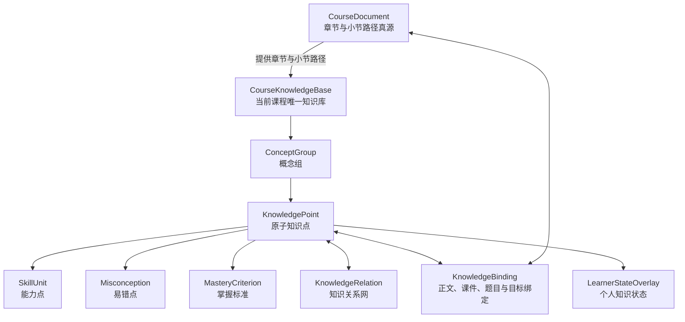
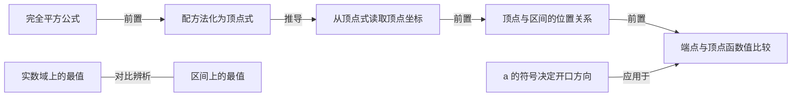

# 灵知课程知识库结构与关系网络设计

> 文档状态：产品与技术设计基线
>
> 日期：2026-07-17
>
> 适用范围：灵知单门课程内的知识生成、课程内容、教学表达、练习、AI 老师、学习证据与课程生长
>
> 关联蓝图：[`docs/product-blueprint.md`](../product-blueprint.md)
>
> 关联 OpenSpec：[`openspec/changes/build-structured-adaptive-course-ai/`](../../openspec/changes/build-structured-adaptive-course-ai/)

## 0. 核心结论

灵知实行“一门课程一套知识库”。`CourseKnowledgeBase` 是当前课程唯一的产品知识库和运行时知识坐标，不建设学生可见、跨课程共享的总知识库。

知识库的产品形态固定为：

```text
纵向：课程路径结构
章节 → 小节 → 概念组 → 原子知识点

横向：知识关系网络
前置 / 推导 / 等价 / 对比 / 应用 / 一般化

叶子：知识能力包
知识定义 + 条件与边界 + 能力点 + 易错点 + 掌握标准

外部绑定：教学与学习闭环
正文 / 课件 / 图解 / 题目 / AI / 笔记 / 错题 / 学习证据 / 个人状态
```

一句话定义：

> 纵向路径树组织这门课程怎样学，横向知识关系网组织这些知识为什么相连，叶子知识能力包定义具体学什么、会什么、容易错什么以及怎样证明学会。

## 1. 产品边界

### 1.1 当前课程知识库是唯一产品知识库

- 每次创建课程时，同时创建同一 `course_id` 的 `CourseKnowledgeBase`。
- 知识点 ID 只要求在当前课程内稳定，不要求跨课程统一。
- 同一概念出现在两门课程中，可以拥有不同颗粒度、讲解边界、前置要求和掌握标准。
- 知识库随课程一起生成、修改、生长、撤销和恢复。
- 课程知识库不得因外部学科包不存在、无法匹配或版本落后而不可用。

现有 `SubjectKnowledgeLibrary` 只允许作为可选内部参考：

- 提供规范术语、别名、覆盖检查或生成校准候选。
- 不作为学生知识库，不出现在学生产品心智中。
- 不拥有当前课程知识点的运行时身份。
- 不作为课程发布、AI 使用或个人掌握投影的必选前置。
- 匹配失败时不得清空、降级或阻断当前课程知识库。

### 1.2 四个真源必须分开

| 对象 | 唯一真源 | 负责什么 |
| --- | --- | --- |
| 课程路径 | `CourseDocument` | 章节、小节、教学顺序与正文块 |
| 课程知识 | `CourseKnowledgeBase` | 概念组、原子知识点、能力、易错、掌握标准与知识关系 |
| 教学绑定 | `CourseKnowledgeMap / KnowledgeBinding` | 知识与章节、正文、课件、题目、目标之间的教学作用 |
| 个人状态 | `LearnerModel` 及正式学习事实 | 当前学生在同一课程知识点上的证据、掌握、误区和复习状态 |

个人状态覆盖知识点，但不修改知识库；课程路径展示知识库，但不复制知识定义。

## 2. 总体结构



知识库页面中的路径树由 `CourseDocument` 与知识库定位共同投影：

```text
CourseDocument.chapter
└── CourseDocument.section
    └── ConceptGroup.primary_section_ref
        └── KnowledgePoint.primary_concept_group_id
```

章节、小节名称仍由 `CourseDocument` 管理，知识库不保存第二份章节真源。知识点在树上只有一个主要位置；它在其他章节被复习、应用或考查时，通过教学绑定显示，不复制第二个知识点。

## 3. 核心实体

### 3.1 `CourseKnowledgeBase`

```text
knowledge_base_id
course_id
schema_version
revision_id
concept_groups[]
knowledge_points[]
skill_units[]
misconceptions[]
mastery_criteria[]
relations[]
bindings[]
source_refs[]
generation_audit
quality_report
lifecycle_status          candidate / active / degraded / tombstoned
created_at / updated_at
```

原则：

- 一个活动课程只有一个活动知识库修订。
- ID 不包含章节位置或显示名称；移动、重命名不更换 ID。
- 候选修订不能直接被 AI 老师、正式练习和学习者模型当作活动知识使用。
- `degraded` 表示历史课程尚未完成知识化，不得用章节标题伪装成正式知识点。

### 3.2 `ConceptGroup`

概念组负责把一组紧密相关的原子知识点组织成可理解的内容分类，但不直接承载掌握状态。

```text
concept_group_id
course_id
name
description
primary_section_ref
order
source_refs[]
revision_id
status
```

质量要求：

- 名称应表达一个知识问题域，如“开口与对称性”，不能直接复制“第 1.1 节”。
- 每个概念组至少包含两个原子知识点；只有一个时应检查是否无需概念组或是否拆分不足。
- 概念组不是知识关系端点，不参与个人掌握计算。

### 3.3 `KnowledgePoint`

原子知识点是知识库最核心的叶子，是正文、课件、题目、AI、证据和个人状态共同引用的最小知识坐标。

```text
knowledge_id
course_id
primary_concept_group_id
knowledge_type            definition / principle / rule / method /
                          condition / representation / procedure
name
statement                 知识命题或操作规则
conditions[]              成立或适用条件
boundaries[]              不适用范围、限制与易混边界
counterexamples[]         必要时提供反例
aliases[]
entry_reason?             允许成为关系网入口的原因
source_refs[]
granularity_status        atomic / coarse / fragmented / needs_review
revision_id
status                    active / candidate / tombstoned
```

原子性判断必须同时满足：

1. 能用一个聚焦问题独立解释或考查。
2. 只表达一个主要命题、规则或操作。
3. 脱离章节标题后仍能独立成立。
4. 学会后能够产生至少一种可观察行为。
5. 拆开后不会只剩无意义的术语碎片。

禁止：

- 用章节或小节标题自动生成同名知识点。
- 把“定义、公式、图像、应用”打包成一个粗知识点。
- 用一整道题、一个案例或一段正文充当知识点名称。
- 只保存名称而没有 `statement`、条件、边界和掌握要求。

### 3.4 `SkillUnit`

能力点回答“学会后应该能做什么”，必须可观察、可出题、可形成证据。

```text
skill_id
course_id
name
observable_behavior
primary_knowledge_id
supporting_knowledge_ids[]
required_evidence_types[]
source_refs[]
revision_id
status
```

一个能力可以依赖多个知识点，但必须指定一个主要知识点用于树上展示。能力名称应使用具体动作，如“判断”“解释”“推导”“构造”“比较”“验证”，不能只写“理解某某”。

### 3.5 `Misconception`

易错点回答“学生会以什么具体方式出错，以及如何辨别和修复”。

```text
misconception_id
course_id
name
observable_error_pattern
confused_with
discrimination
repair_strategy
primary_knowledge_id
related_knowledge_ids[]
skill_ids[]
source_refs[]
revision_id
status
```

易错点可以缺省；没有可靠依据时允许为空，不能为了填满页面而生成模板错误。禁止使用“回到关键步骤检查”“加强理解”等通用修复策略。

### 3.6 `MasteryCriterion`

掌握标准回答“出现什么表现才算掌握”，不是学生当前状态。

```text
criterion_id
course_id
name
observable_performance
knowledge_ids[]
skill_ids[]
required_independence      guided / assisted / independent
required_transfer         same_form / variation / new_context
verification_method
required_evidence_types[]
source_refs[]
revision_id
status
```

每个活动知识点至少有一个可验证能力和一个掌握标准。易错点不是强制字段，但出现时必须可观察、可辨别、可修复。

### 3.7 退出 `ImprovementPoint` 核心实体

当前“提升点”混合了稳定能力、具体练习和个人建议，不能继续作为知识库核心实体：

- 稳定能力目标迁移到 `SkillUnit`。
- 具体练习迁移到 `PracticeTask`。
- 个性化提升建议由 AI 根据正式学习证据动态生成。

兼容读取可以保留旧字段，但新生成、修订和正式写入不得继续创建新的 `ImprovementPoint`。

## 4. 知识关系网络

### 4.1 网络边界

知识关系网络只连接当前课程内的活动原子知识点：

```text
KnowledgePoint -- KnowledgeRelation --> KnowledgePoint
```

以下内容不进入语义关系网：

- `contains`、父子层级：属于路径树。
- “上一节”“下一节”：属于课程顺序。
- 知识点到正文、课件、题目：属于教学绑定。
- 知识点到能力、易错、掌握标准：属于实体关联。
- 无明确教学含义的 `related`：禁止进入正式关系网。

### 4.2 六类正式关系

| 关系 | 标准方向 | 严格判定 | 直接驱动 |
| --- | --- | --- | --- |
| `prerequisite` | A → B | 没有 A，学生无法或明显难以独立理解、执行 B | 排序、前置诊断、补救 |
| `derives` | A → B | 在明确条件和步骤下，可以从 A 得到 B 的结论或方法 | 推导讲解、证明链、步骤课件 |
| `equivalent_to` | A ↔ B | 在给定条件下可相互替换，语义或结果保持一致 | 表示转换、等价验证、多种讲法 |
| `contrasts_with` | A ↔ B | 学生容易混淆，且存在明确判别条件 | 辨析题、反例、错因诊断 |
| `applies_to` | A → B | A 的规则或方法被用于解释、求解或验证 B | 例题、迁移任务、应用解释 |
| `generalizes` | A → B | A 覆盖更一般范围，B 是附加条件下的特殊情形 | 抽象提升、拓展、难度升级 |

### 4.3 关系判定门禁

#### `prerequisite` 与 `derives`

- “先学了”不等于前置；必须通过移除测试：去掉 A 后，B 是否仍能独立学习或执行。
- 前置只说明依赖，不说明 B 能从 A 逻辑推出。
- 推导必须给出条件或关键步骤；只有时间顺序时不能使用 `derives`。

#### `derives` 与 `applies_to`

- `derives` 产生新的结论或方法。
- `applies_to` 使用已有规则处理另一个知识对象。
- 如果 A 只是帮助理解 B，但既不推出也不用于解决 B，应重新判断是否为前置，不能降级为 `related`。

#### `equivalent_to` 与 `generalizes`

- 等价关系要求指定条件下可以双向替换。
- 一般化只是一方向：一般规律可以覆盖特殊情形，特殊情形不能反向覆盖一般规律。
- 同义名称使用 `aliases`，不能创建两个重复知识点再用 `equivalent_to` 连接。

#### `contrasts_with`

- 不能因为两个知识不同就建立对比关系。
- 必须存在真实混淆风险和具体判别维度。
- 关系必须保存 `distinction`，说明学生靠什么区分。

### 4.4 多前提关系

有些推导或硬前置需要多个知识共同成立。第一版继续保存二元边，但使用关系组表达联合条件：

```text
relation_group_id
group_operator            all_of / any_of
```

例如 `A + C → B` 保存为两条指向 B 的关系，共享同一个 `relation_group_id`，并标记 `all_of`。系统不得把它误读为 A 或 C 任意一个就足以推出 B。

### 4.5 `KnowledgeRelation` 数据契约

```text
relation_id
course_id
source_knowledge_id
target_knowledge_id
relation_type             prerequisite / derives / equivalent_to /
                          contrasts_with / applies_to / generalizes
relation_group_id?
group_operator?           all_of / any_of
necessity?                required / helpful
priority                   core / supporting
conditions[]
reason
distinction?
derivation_steps[]
source_refs[]
source_type                model_generated / material_derived /
                          user_confirmed / system_compiled
confidence
status                     candidate / accepted / rejected / tombstoned
revision_id
```

方向规则：

- `prerequisite / derives / applies_to / generalizes` 只保存标准方向，反向标签由读取层生成。
- `equivalent_to / contrasts_with` 是对称关系，端点按稳定 ID 排序后只保存一条。
- `necessity` 主要用于前置关系；`required` 前置参与发布阻断和补救路径，`helpful` 只提供教学建议。

## 5. 教学绑定

### 5.1 `KnowledgeBinding`

```text
binding_id
course_id
knowledge_ids[]
skill_ids[]
target_type               section / course_block / objective / slide /
                          diagram / question / criterion / record
target_id
teaching_role             introduces / explains / demonstrates /
                          reinforces / practices / assesses /
                          remediates / extends
importance                primary / supporting
anchor
source_refs[]
knowledge_revision_id
target_revision_id
revision_id
status
```

绑定原则：

- 每个对象必须区分主要知识和辅助知识。
- 题目不得默认绑定整节所有知识；综合题绑定较多知识时必须声明综合任务理由。
- 每个教学正文块、正式课件单元和题目必须能回溯到至少一个活动知识点。
- 一个知识点在多个章节复习或应用时，保留一个知识身份，通过多个绑定表达不同教学作用。

### 5.2 关系驱动教学表达

| 关系 | 优先教学表达 |
| --- | --- |
| `prerequisite` | 前置检查、学习路线、断点提示 |
| `derives` | 分步推导、证明链、流程图、逐步动画 |
| `equivalent_to` | 双栏转换、等价验证、同源多表示 |
| `contrasts_with` | 对比表、反例、辨别题 |
| `applies_to` | worked example、迁移练习、案例解释 |
| `generalizes` | 特殊到一般阶梯、抽象层级图、拓展任务 |

课件、图解、动画和 AI 讲解必须读取关系类型，而不是只读取章节标题后重新总结全文。

## 6. 生成与审查链

课程首次生成必须按以下顺序进行：

```text
用户目标、资料与课程约束
→ 定义章节与小节的唯一学习责任
→ 在每个小节下生成概念组
→ 将概念组拆成原子知识点
→ 原子性、重复和边界审查
→ 生成能力点、易错点和掌握标准
→ 生成六类知识关系及理由、条件、联合关系组
→ 结构验证 + 语义审查
→ 依据知识与关系生成正文、课件和练习
→ 建立精确教学绑定
→ 全课一致性与知识质量门
→ 共同发布 CourseDocument + CourseKnowledgeBase + CourseKnowledgeMap
```

核心控制原则：

1. 课程内容由知识蓝图约束，不能先生成章节正文，再把标题投影成知识点。
2. AI 可以生成候选结构，但确定性服务负责 ID、引用、无环、重复和修订检查。
3. 语义审查必须区分“概念组”“原子知识点”“题目”“案例”和“个人建议”。
4. 新课程知识库存在硬错误时保留生成工作区并进入可恢复失败，不发布表面完整课程。
5. 历史课程可以继续阅读，但没有真实结构时标记 `degraded / needs_enrichment`，不得用同名章节节点冒充正式知识点。

## 7. 质量门

### 7.1 结构门

- 所有活动实体 ID 唯一且属于同一 `course_id`。
- 每个知识点只有一个主要路径位置。
- 路径引用的章节、小节和概念组均存在。
- 拆分、合并、移动和墓碑保留旧新 ID 映射。

### 7.2 知识点门

- 100% 活动知识点拥有 `statement`、颗粒度状态、来源和修订。
- 所有知识点通过原子性检查；粗节点不得进入正式发布。
- 章节标题不得自动复制为同名知识点。
- 每个知识点至少关联一个可观察能力和一个掌握标准。
- 条件性知识必须包含条件或边界；无条件时应明确为普遍适用范围。

### 7.3 能力与易错门

- 能力使用可观察动词，能够被题目或行为证据验证。
- 易错点名称、错误表现和修复策略不得互相复制。
- 没有可信易错点时允许为空，不得生成通用模板填充。
- 具体题目不得保存为能力、易错或“提升点”。

### 7.4 关系门

- 关系端点必须是当前课程活动知识点，禁止自环。
- `required prerequisite` 图和 `generalizes` 图不得有环。
- `derives` 不得双向重复；双向可替换应使用 `equivalent_to`。
- 对称关系只保存一条，关系 ID 与语义签名唯一。
- 禁止正式 `related` 关系和没有具体 `reason` 的关系。
- 除明确入口知识外，每个知识点至少拥有一条有教学意义的入边；入口必须保存 `entry_reason`。
- 传递可推出的边默认不重复保存；如需保留直接关系，必须说明独立教学价值。
- AI 生成关系先为 `candidate`，通过结构与语义审查后才可 `accepted`。

### 7.5 绑定门

- 所有学习目标、正式题目、掌握标准和教学表达必须绑定活动知识点。
- 正文块和课件单元必须声明教学作用，不能只有“属于本节”。
- 题目绑定必须精确到实际考查点；不得用整节全部知识填充。
- 课程知识变化后，受影响绑定必须进入 `stale / needs_review`，不能静默沿用。

## 8. 二次函数示例

### 8.1 路径树

```text
第一章：图像与最值
└── 1.1 二次函数的图像特征
    ├── 概念组：代数表示
    │   ├── 二次函数一般式中 a≠0
    │   ├── 顶点式的结构
    │   └── 一般式与顶点式的等价关系
    ├── 概念组：开口与对称性
    │   ├── a 的符号决定开口方向
    │   ├── |a| 决定开口宽窄
    │   ├── 对称轴方程
    │   └── 顶点坐标
    └── 概念组：区间最值
        ├── 实数域上的最值
        ├── 顶点与区间的位置关系
        └── 端点与顶点函数值比较
```

### 8.2 关系网



如果学生在区间最值上失败，AI 老师沿关系网依次检查：

```text
是否会比较端点与顶点函数值
→ 是否判断顶点与区间的位置
→ 是否能求顶点坐标
→ 是否会把一般式化为顶点式
→ 是否掌握完全平方公式
```

系统不再让学生重学整个“1.1 图像与最值”。

## 9. 知识变化与影响分析

知识点支持新增、补写、拆分、合并、移动、重命名和墓碑。每次变化必须计算：

- 路径位置是否改变。
- 六类知识关系是否失效、需要迁移或新增。
- 哪些正文块、课件页、图解和题目进入陈旧状态。
- 哪些能力、易错和掌握标准需要重绑。
- 哪些学习证据仍引用旧修订。
- 哪些个人状态只能保留历史解释，不能直接迁移结论。

历史 `PracticeAttempt / LearningEvent / LearningRecord` 保留发生时的知识 ID 和修订。当前投影可以通过旧新映射解释，但禁止重写历史事实。

## 10. 下游消费契约

### 10.1 正文与课程生成

- 每个正文块读取目标知识点、相关能力、关系上下文和教学作用。
- 章节内容生成不得超出本节知识责任，也不得提前讲完后续节点。
- 一个知识点跨章节出现时，后续正文使用 `reinforces / applies / assesses`，不重新创建知识点。

### 10.2 课件与多模态表达

- `SlideDeckSpec / DiagramSpec / SceneSpec` 必须保存 `knowledge_ids / relation_ids / skill_ids`。
- 知识关系决定表达结构，主题与视觉样式只决定表现。
- 知识或关系修订后，只将真实依赖的课件单元标记为陈旧。

### 10.3 练习与诊断

- 题目明确区分主要考查点和辅助知识。
- 作答与诊断继承题目的精确知识、能力和易错引用。
- 错因定位沿关系网寻找最小前置断点，不能默认回退整节。

### 10.4 AI 老师

- 默认读取当前位置的目标知识点、一个相关关系子图、对应能力、易错和个人证据。
- 不把整节所有知识一次性塞入上下文。
- 解释建议必须说明当前点、前置断点或对比关系，不能只给通用回答。

### 10.5 学习者模型与复习

- 个人状态按当前课程知识 ID 与能力 ID 投影。
- 知识点是否掌握由正式证据确定，不由知识库字段或 AI 单次判断决定。
- 复习路径依据关系网和证据选择最小必要子图。

## 11. 实施顺序

### 阶段一：结构与质量地基

1. 版本化新 `CourseKnowledgeBase` schema。
2. 增加概念组、原子知识点、能力、易错、掌握标准和六类关系契约。
3. 增加原子性、关系无环、关系语义、绑定精度和模板内容质量门。
4. 删除“章节标题自动生成同名知识点”的正式兜底。

### 阶段二：首次生成主链

1. 先生成知识蓝图，再生成正文与教学资产。
2. 引入结构生成、语义审查、定点修复和可恢复失败。
3. 发布时共同激活课程、知识库和绑定修订。

### 阶段三：全项目精确绑定

1. 正文、目标、题目和掌握标准改用课程知识 ID。
2. 课件、图解、动画和讲解保存知识与关系引用。
3. AI 老师、诊断、学习证据、学习者模型和复习读取同一知识坐标。

### 阶段四：知识生长与双向影响

1. 支持知识点拆分、合并、移动和关系调整候选。
2. 实现课程、知识、课件和题目的影响预览。
3. 用户确认后通过可恢复命令组应用，保留历史映射和撤销回执。

### 阶段五：历史课程知识化

1. 旧课程先标记真实成熟度，不展示伪知识点。
2. 对正文与资料运行独立知识化任务。
3. 通过同一质量门后再升级为活动课程知识库。

## 12. 完成定义

只有同时满足以下条件，才可称知识库结构和关系网络已经接入产品主链：

1. 任意新课程先形成课程知识蓝图，再生成正文、课件和题目。
2. 章节、小节只负责路径，原子知识点不再复制章节名称。
3. 每个知识点具备定义、条件或边界、能力和掌握标准。
4. 六类关系均可解释、可校验并能驱动至少一种教学行为。
5. 正文、课件、题目、AI、诊断和学习证据引用同一课程知识 ID。
6. 学生出错时可以定位最小知识断点，而不是只定位到章节。
7. 知识变化能够精确识别受影响的课程内容和教学表达。
8. 历史事实、个人状态和课程局部知识保持课程隔离且可追溯。
