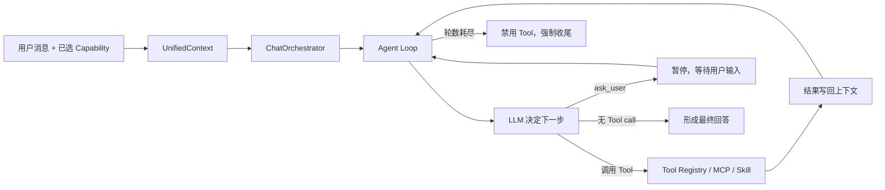
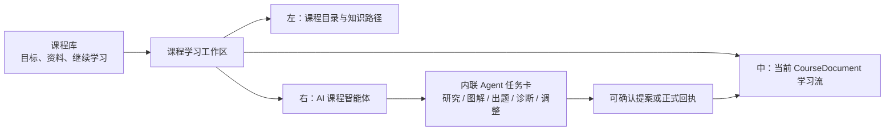
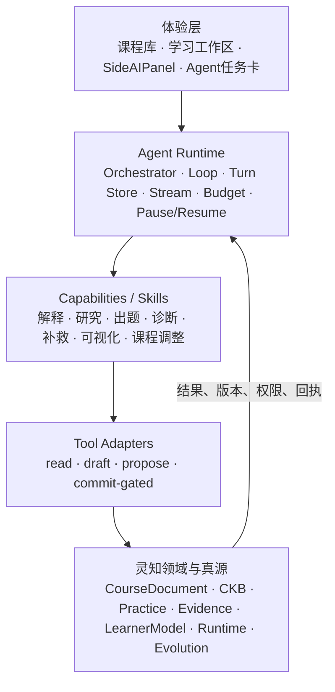

# DeepTutor × 灵知：从 Workflow-first 到课程原生 Agent 的融合研究与实施方案

> 日期：2026-07-23
> 面向对象：灵知产品负责人、后端、前端、AI/算法、测试、安全与架构负责人
> 文档性质：产品判断、源码研究、目标架构、融合决策与实施交接稿
> DeepTutor 研究快照：`v1.5.2` / commit `b728354863540466f5410bec3530eb55a9fe0edc`
> 灵知对照基线：[`docs/product-blueprint.md`](../product-blueprint.md) 及当前生产代码
> 证据边界：外部事实以固定版本源码、官方 Release、论文和公开 Issue 为准；融合建议为本报告分析，不代表已经实施
> 质量检查：引用完整性 PASS；关键事实 spot-check PASS；报告结论仍需 PoC 验证

---

## 0. 执行摘要：不要“合并两个产品”，要把 DeepTutor 的 Agent 执行层装进灵知的课程操作系统

本报告最重要的结论只有一句：

> **DeepTutor 应成为灵知的 Agent 能力供体，而不是新的产品底座；灵知继续拥有课程、知识、练习、证据、掌握、版本和写权限，Agent 负责理解目标、选择 Skill、调用 Tool、推进任务和解释过程。**

这两个项目不是简单的同类竞品，而是分别把力量放在了不同层：

- **灵知强在“教学产品与领域系统”**：它像产品经理、课程设计师和教学运行时，已经规定课程怎么产生、知识怎么绑定、题目如何成为正式资产、学习事实怎样形成、错因如何确认、课程变化如何提案、确认、撤销和复验。[25][26]
- **DeepTutor 强在“Agent 执行基础设施”**：它已经把统一上下文、多轮工具循环、Capability、按需 Skill、Tool Registry、流式事件、会话持久化、Memory、MCP、沙箱、多用户和外部 Agent 接入组织成一个可运行系统。[2][5][6][7][9][10]

灵知当前的 AI 不算弱：`AIContextPackage v3` 已经能装配课程、运行时、知识、任务、来源、证据、对话和权限，`ActionProposal → Command → Receipt` 也已经有写入门禁。[27][29] 真正的缺口是：当前 `AIQAService` 仍然主要是**一次上下文装配 + 一次流式 LLM 调用**，没有 Agent 自己选择工具、读取 Skill、多轮执行、暂停询问和恢复任务的运行时。[28]

因此，融合后的目标不应是“灵知里再加一个 DeepTutor 页面”，而应是：

> **Course-native Agentic Learning OS：用户只需要表达学习目标，AI 课程智能体在当前课程和权限范围内，自主选择研究、解释、出题、可视化、诊断、补救、复习或课程调整等 Skill；所有正式状态仍由灵知领域服务裁决。**

### 0.1 推荐决策

| 决策项 | 推荐结论 |
| --- | --- |
| 产品外壳 | 保留灵知的课程库、学习工作区和课程内 AI 老师，不复制 DeepTutor 的多入口工作台 |
| Agent 位置 | Agent 成为 AI 执行面主控；课程与学习领域层仍是事实与写入主控 |
| 首次融合方式 | 先用 DeepTutor `v1.5.2` 作为 Python 3.11 sidecar，通过受限 MCP/HTTP 调用灵知只读与提案工具 |
| 长期方式 | PoC 证明价值后，选择性移植 Agent kernel 到灵知，不长期依赖整套 DeepTutor 产品运行时 |
| Skill 定位 | Skill 是教学 SOP、工具使用规则和工作流描述，不得拥有课程数据库、掌握算法或写权限 |
| Memory 定位 | DeepTutor 式 Memory 用于偏好、历史和连续性；正式学习证据与掌握继续使用灵知现有模型 |
| 写操作 | Agent 默认只能 `read / draft / propose`；`commit` 必须经过灵知领域命令、确认和回执 |
| 前端交互 | 不要求用户先选 Chat/Quiz/Research；由 Agent 自动路由，并以可检查的任务卡展示过程 |
| 不建议方案 | 不做 Git 级整仓合并，不 fork DeepTutor 前端，不引入第二课程、第二知识库、第二画像或第二学习状态 |

### 0.2 为什么不是直接整仓合并

DeepTutor 后端要求 Python `>=3.11`，Web 使用 Next.js 16 + React 19；灵知当前是 FastAPI + Python 3.10、Vue 3 + Vite。[15][16][32] 更重要的是，双方都已经拥有会话、知识、学习状态、UI 和任务设施。整仓合并会立即产生以下冲突：

```text
DeepTutor Knowledge Center  ↔  灵知 CourseKnowledgeBase
DeepTutor Memory            ↔  灵知 Evidence / LearnerModel
DeepTutor Mastery Path      ↔  灵知 Practice / Diagnosis / Remediation / Progress
DeepTutor Book              ↔  灵知 CourseDocument / CourseBlock
DeepTutor Chat Sessions     ↔  灵知 AIConversation / LearningRuntime
DeepTutor Web Workspace     ↔  灵知课程库 / 学习工作区 / PPT 工作台
```

这些不是普通的重名模块，而是会争夺“谁是真源、谁决定下一步、谁能写状态”的控制权。项目价值最大化的方式不是把所有代码都搬进来，而是精确提取其可复用内核，把重复领域拒绝在边界外。

---

## 1. 研究范围、版本与结论可信度

### 1.1 固定研究快照

本报告锁定 DeepTutor `v1.5.2`。该版本发布于 2026-07-19，研究时仓库约 29,172 stars、3,837 forks，许可证为 Apache-2.0；这些热度数据只表示社区关注，不表示生产成熟度。[1][3]

`v1.5.2` 的主要变化包括可配置附件限制、通过内部 MCP 做 PageIndex 推理式检索、更广的模型支持，以及 Book、Knowledge Base 和聊天稳定性修复。[3] 本报告所有源码判断均使用固定 commit，避免后续 `main` 变化导致引用失真。

### 1.2 证据层级

| 层级 | 使用材料 | 可以支持什么 |
| --- | --- | --- |
| 一级 | 固定 commit 源码、官方 Release、LICENSE | 当前真实实现、接口、依赖、安全变化、许可 |
| 二级 | DeepTutor 论文 v3 | 设计意图、实验设置、报告结果、作者承认的限制 |
| 三级 | 公开 RFC / Bug Issue | 真实使用线索和测试用例来源，不能推断普遍故障率 |
| 本地一级 | 灵知产品蓝图、正式需求、生产代码 | 灵知现有真源、边界、技术栈和真实缺口 |
| 分析层 | 本报告的目标架构与路线 | 待团队决策和 PoC 验证，不应被当作已完成事实 |

### 1.3 三个必须保留的不确定性

1. 本轮没有运行 DeepTutor 全栈，因此没有实测其安装成功率、前端性能、模型成本和不同提供方的稳定性。
2. DeepTutor 论文证明的是受控模拟环境下的提升，不是大规模真人学生长期学习效果。[19]
3. Sidecar、进程内依赖和选择性移植的真实成本，需要用同一批灵知任务做 PoC 后才能最终决定。

---

## 2. 概念统一：Agent、Capability、Skill、Workflow、Tool 到底是什么关系

这次讨论最容易卡住的地方，是把 Agent 和 Workflow 当成互斥分类。更准确的理解是：它们是不同层的控制结构。

| 概念 | 本质 | 谁决定何时使用 | 是否应该直接写正式状态 | 灵知中的例子 |
| --- | --- | --- | --- | --- |
| Product / Domain | 用户价值、对象与规则 | 产品和领域模型 | 是，但必须通过领域命令 | CourseDocument、PracticeAttempt、LearningRuntime |
| Agent | 基于目标和当前状态动态决定下一动作的执行控制器 | 模型 + 运行时约束 | 默认否 | 未来的 AI 课程智能体 |
| Capability | 一个高层任务目标及其政策容器 | 用户显式选或系统路由 | 视其工具权限 | 研究、解释、诊断、课程调整 |
| Skill | Agent 可按需读取的 SOP、约束和工具使用方法 | Agent 根据任务匹配 | 否 | “诊断错因”“生成迁移题”“调整本节课程” |
| Workflow | 预先定义阶段、状态和门禁的流程 | 应用代码或 Skill 引导 | 可通过固定节点写入 | 课程生成、正式练习、诊断补救 |
| Tool | 一个输入输出明确的原子动作 | Agent 或 Workflow | 只应通过受控 adapter | 查知识、读运行时、创建提案 |
| Service | 对数据和领域规则负责的实现 | 应用调用 | 是，正式写入权应留在这里 | course_evolution、practice、learner_model |

### 2.1 “Skill 本质上是不是 Workflow？”

可以说**Skill 是一种可携带、可按需读取的 Workflow 描述**，但它不是完整的执行引擎。DeepTutor 的 Skill 是包含 `SKILL.md` 和可选引用/脚本的自包含包；系统先把简要 manifest 给模型，模型判断匹配后再调用 `read_skill` 获取完整内容。[10]

因此：

```text
Skill 告诉 Agent：
  应该按什么步骤做
  什么时候使用哪些 Tool
  哪些规则不能违反
  输出应该长什么样

Agent 负责：
  是否调用这个 Skill
  当前步骤是否完成
  遇到新情况是否换工具、追问、重试或停止

Domain Service 负责：
  结果是否合法
  是否能写入正式状态
  版本、权限、幂等和审计
```

### 2.2 双重主次关系：这是两个项目真正能合并的理论基础

双方不是只有一条“谁主谁次”，而是存在两个平面：

#### 执行平面

```text
Agent 主控
  → 选择 Capability / Skill
  → 调用 Tool
  → 观察结果
  → 继续、追问、降级或结束
```

在这一平面，Agent 是主，Skill/Workflow 是它可调用和遵循的结构。

#### 真源与写入平面

```text
灵知领域模型主控
  → 校验课程、知识、任务、证据和版本
  → 决定是否允许写入
  → 产生正式 Command / Receipt

Agent 只能读取、起草和提案
```

在这一平面，Agent 必须从属于灵知。

这能同时满足用户希望的“更自由、更像真正 Agent”，也保住教育产品最重要的可信性。自由应发生在**寻找路径和组合能力**上，不应发生在**伪造学习事实和绕过权限**上。

---

## 3. DeepTutor 到底讲了一个什么产品功能

### 3.1 一句话定义

DeepTutor 是一个 **agent-native learning workspace**：Chat、Quiz、Research、Visualize、Solve 和 Mastery Path 等任务共享统一运行时、上下文、工具、知识库和 Memory，外围再扩展 Book、Co-Writer、Partners、My Agents 和多渠道接入。[2]

它不只是“AI 老师答题”，更像是：

```text
一个用户可选学习目标
  + 一套统一 Agent runtime
  + 多种可调用学习 Capability
  + 可安装的 Skill
  + 多引擎知识库与资料解析
  + 可观察 Memory
  + 外部 Agent 与聊天渠道
```

### 3.2 用户看到的产品面

DeepTutor 当前主要表面包括：

- Chat：统一对话入口，也是 Quiz、Research、Visualize、Solve、Mastery 的启动点。
- Learning Space：对话、Notebook、Question Bank、Mastery Path、Persona、Skill 的持久层。
- Knowledge Center：LlamaIndex、PageIndex、GraphRAG、LightRAG、Obsidian 等多引擎知识库。
- Memory：L1/L2/L3 三层可检查、可编辑的个人化工作台。
- Book：从资料形成提案、课程 spine、页面和互动内容。
- Co-Writer：持久 Markdown 文档中的 AI 编辑与接受/拒绝差异。
- Partners：带 persona、知识、Skill、Memory 和外部渠道的长期 Agent。
- My Agents：调用本地 Claude Code、Codex 或已有 Partner 作为 subagent。[2][19]

这套产品的优势是**横向能力丰富、上下文跨表面复用**。它让用户在“问、查、练、写、研究、可视化、连接外部 Agent”之间切换，而不必每次重建环境。

### 3.3 它为什么算 Agent，而不是普通 Workflow

DeepTutor 内置七个 Capability；`ChatOrchestrator` 读取 `active_capability`，没有选择时才回退 Chat。[4][5][6] 一旦进入 Capability，核心执行逻辑是有界多轮循环：



Chat loop 的关键特点是：

- 模型每轮可以选择一个或多个工具；
- 工具结果回到 messages，模型据此继续；
- `ask_user` 可以暂停本轮并等待回答；
- 无工具调用的轮次被视为最终回答；
- 达到最大轮数后关闭工具并强制收尾；
- 中间 narration、tool call、result 和 final answer 可以流式展示。[7][8]

这正是灵知当前缺少的执行能力。

### 3.4 但它并不是“完全自由的一个万能 Agent”

DeepTutor 仍然把高层任务拆成 Capability，并由用户在界面上选择。不同 Capability 可以拥有不同 prompt、工具、循环扩展和状态。换句话说，它是：

> **Capability-first，Agent-loop-inside 的混合系统。**

这个事实对灵知很重要。我们不需要追求一个不受约束的“总 Agent”；更好的方向是让 Agent 在课程上下文中自动选择 Capability/Skill，同时由权限和领域状态限制可用工具。

---

## 4. DeepTutor 源码价值拆解

### 4.1 UnifiedContext：所有能力共享的装配对象

`UnifiedContext` 统一携带 session、当前消息、历史、可用工具、内置工具白名单、active capability、知识库、附件、配置、语言、Memory、Persona、Skill manifest、来源 manifest 和扩展 metadata。[6]

它的价值不是字段本身，而是确立一个原则：

> Capability 不应各自拼 prompt、各自找知识、各自读取 Memory；运行时应先装配一个有界上下文，再交给执行层。

灵知已经有更教育化的 `AIContextPackage v3`，因此不应再复制 DeepTutor Context，而应将现有对象升级为 `UnifiedLearningContext`。

### 4.2 Capability Registry：把高层任务从页面和 prompt 中解耦

DeepTutor 的 Capability Registry 让 Chat、Solve、Question、Research、Animator、Visualize、Mastery 以一致接口注册和路由。[4][5] 这使：

- CLI、WebSocket、REST、SDK 可以走同一入口；
- 新能力不必再写一套聊天引擎；
- 每个能力可以声明自己的工具、prompt 和生命周期；
- UI 只切目标，不切底层运行时。

灵知可借鉴这个边界，但 Capability 名称应该围绕课程行为，而不是复制 DeepTutor 菜单。

建议第一批：

```text
explain_current_context
investigate_course_question
generate_practice_draft
diagnose_with_evidence
plan_remediation
visualize_concept
propose_course_evolution
summarize_learning_session
```

### 4.3 Tool Composition：真正可扩展的关键

DeepTutor 不是把所有工具永远塞给模型，而是根据上下文条件和权限组合：

- 有 KB 时挂 RAG；
- 有附件时挂 `read_source`；
- 有 Memory 时挂 `read_memory`；
- 有 Skill 时挂 `read_skill`；
- 有 deferred tools 时挂 `load_tools`；
- shell/code 受沙箱和权限控制；
- Capability 可以拥有专属工具；
- Partner 和非管理员可以进一步缩小白名单。[9]

这比“大 prompt 写清楚所有功能”更稳，因为模型只看到当前任务需要的工具集合。对灵知而言，Tool Composition 应由以下因素共同决定：

```text
当前入口
+ 当前 course_id / node_id / task_ref
+ 用户角色与授权
+ Capability
+ 是否存在正式任务
+ 是否允许答案披露
+ 是否允许课程提案
+ 是否启用外部网络 / MCP
→ 本轮最小 Tool Set
```

### 4.4 Skill Service：把教学方法从核心代码中释放出来

DeepTutor Skill 的价值包括：

- `SKILL.md` 作为可读 playbook；
- manifest 只暴露名称和描述，减少上下文；
- 模型按需调用 `read_skill`；
- 用户 Skill 可以覆盖内置 Skill；
- 导入包有大小、文件后缀、路径和原子替换门禁；
- Skill 可从 EduHub、ClawHub 等注册表进入系统。[2][10]

对灵知最值得借的是“教学方法可版本化、可测试、可替换”，例如：

- 如何用苏格拉底式追问确认理解；
- 如何把一次错误转成可反证假设；
- 如何生成辨别题而不泄露答案；
- 如何判断概念更适合图解、代码还是动画；
- 如何把用户自述转成课程变化候选；
- 如何做来源受限的前沿研究。

但 Skill 绝不能：

- 直接写 `LearnerModel`；
- 直接修改掌握；
- 直接覆盖 `CourseDocument`；
- 自己声明某题为正式资产；
- 自己改变权限和数据范围；
- 使用不受控脚本访问任意文件或网络。

### 4.5 Session、Turn Runtime 与 StreamBus：让 Agent 任务可见、可恢复

DeepTutor 把 session、turn、事件、流式输出和重启恢复放到统一运行时，而不是只维护一条文本消息。[5][11] 这解决了 Agent 产品常见问题：

- 工具执行时间长时用户看不到进度；
- 页面刷新后不知道任务进行到哪里；
- 中断后重复调用工具；
- 最终回答与中间 reasoning/tool trace 混在一起；
- 多个入口产生不同事件格式。

灵知已经有生成任务、SSE、课程任务中心和 LearningRuntime，但 AI 老师尚未拥有完整 Agent turn。未来建议把 Agent 事件统一为：

```text
turn_started
capability_selected
skill_loaded
tool_started
tool_progress
tool_completed
tool_failed
assistant_message_delta
approval_required
user_input_required
proposal_created
turn_completed
turn_cancelled
```

这些是可检查的执行事件，不应暴露隐藏思维链。

### 4.6 Knowledge 与 Parsing：适合作为 provider 层，不适合作为第二课程知识库

DeepTutor 的 Knowledge Center 支持：

- LlamaIndex（向量 + BM25）；
- PageIndex（基于文档树的推理式检索）；
- GraphRAG、LightRAG、LightRAG Server；
- Obsidian；
- MinerU、Docling、MarkItDown、PyMuPDF4LLM 等解析器；
- 版本化索引和 linked index。[2][3]

这里的价值是“检索和解析引擎可替换”。但灵知的 `CourseKnowledgeBase` 不只是检索库，它承担课程内稳定知识身份、能力、误区、掌握标准、关系和正文/题目绑定。[25] 因此正确的融合是：

```text
DeepTutor parsing / retrieval engine
    ↓ 提供候选证据、片段、引用、召回分数
灵知 EvidenceUnit / CourseKnowledgeBase 编译与质量门
    ↓ 决定哪些内容成为正式课程知识和绑定
```

不应让 GraphRAG、PageIndex 或 Obsidian 节点直接成为灵知知识 ID。

### 4.7 Memory：可借鉴可检查性，但不能替代正式学习证据

DeepTutor 当前代码中的 Memory 是文件型三层结构：

- L1：各 surface 的 append-only trace；
- L2：按 chat、notebook、quiz、kb、book、partner、cowriter 聚合的 Markdown；
- L3：recent、profile、scope、preferences 跨 surface 综合。[2][11]

这套设计很适合：

- 记住用户偏好的讲解方式；
- 记录最近关注的主题；
- 为跨表面对话提供连续性；
- 让用户查看和纠正系统记忆；
- 追踪综合结论来自哪些历史。

但它不够承担：

- 正式作答事实；
- 题目和标准答案修订；
- 掌握标准；
- 诊断确认；
- 独立复验；
- 课程版本变化；
- 证据是否仍对当前课程修订有效。

社区 RFC #397 也明确提出当前 Memory 缺少概念级学习状态、重复错误模式、跨模块统一证据和可解释修正，说明这一边界不仅是本报告的推断，也是项目社区正在讨论的缺口。[20]

### 4.8 Mastery Path：有可用机制，但不应替代灵知现有学习主链

DeepTutor Mastery Path 已包含：

- memory、concept、procedure、design 四类知识点；
- QuizAttempt、ErrorRecord、复习状态和 review queue；
- 定量知识的 hard gate；
- 概念/设计型的定性 gate；
- 最近五次作答加权；
- 单次和两次证据的 0.5 / 0.8 封顶；
- 间隔复习调度。[12][13][14]

这是一个实用、简洁、可替换的 mastery engine。但当前 `KnowledgePoint` 只有 `id/name/type/module_id`，没有灵知要求的来源修订、明确掌握标准、课程内稳定绑定、六类知识关系和证据失效规则。[12]

因此建议：

- 借用“hard gate、低样本封顶、复习队列、Agent 必须先读状态”的思想；
- 不迁移其 LearningProgress 作为灵知真源；
- 不用 Tutor 的定性 boolean 直接覆盖灵知掌握；
- 如需算法实验，把 scoring 函数隔离为可替换投影，输入仍来自灵知正式 Attempt。

### 4.9 Partners、Subagents 与 Channels：后期价值高，当前不是 P0

DeepTutor 的 Partners 把 persona、Skill、知识、Memory、heartbeat、cron 和十多个 IM 渠道组合成长驻 Agent；My Agents 还可调用 Claude Code、Codex 或其他 Partner。[2][19]

对灵知的长期价值包括：

- 专门的数学、编程、语言、考试 Agent；
- 在用户授权后做复习提醒；
- 调用代码 Agent 构建可运行演示；
- 让研究 Agent 为课程更新提供来源；
- 在桌面、移动端和 IM 保持上下文。

但这些能力会显著扩大权限、隐私、成本和打扰风险。建议在课程内 Agent 主链稳定后再做，不应在首期融合中复制。

---

## 5. 论文结果、当前实现和真实边界

### 5.1 论文给出了什么积极证据

DeepTutor 论文 v3 构建 TutorBench：

- 30 个知识库；
- 90 个学生画像；
- 270 个交互任务；
- 覆盖 humanities、sciences、engineering、business 和 research；
- 任务包含概念理解、问题求解、应用和比较。[19]

在其交互评测中，DeepTutor 的 Overall Quality 为 3.91，Naive Tutor 为 3.53，相对提升 10.76%；其 solver-only pipeline 在五类 backbone 上的相对增益范围为 25.69%–32.03%。[19]

这支持两个值得灵知吸收的机制：

1. 只增加 CoT 或 ReAct 不足以形成强个性化，知识 grounding 和 learner context 必须进入统一闭环。
2. “investigate → solve → write”这类多阶段结构，可能比一次回答更适合复杂学习任务。

### 5.2 为什么不能把结果直接当作商业效果

论文也明确说明：

- 学生是 LLM simulator；
- Tutor backbone 和 simulator 均使用 Gemini-3-Flash；
- Judge 使用 Claude Sonnet 4.6；
- 每份 transcript 评三次；
- 尚缺大规模真人学生验证；
- Book 与 Partners 对保持、参与、打扰成本和真实结果尚无纵向验证；
- 多阶段 Agent 会增加推理成本。[19]

因此最准确的表述是：

> 论文证明 DeepTutor 的闭环机制在其受控模拟评测中有显著潜力；没有证明把项目合进灵知后，真实学生的长期掌握、保持和迁移必然提升。

### 5.3 论文 Memory 与当前仓库 Memory 不是同一个实现

论文描述：

- Trace Forest；
- 可嵌入、可语义检索的多分辨率 trace；
- `SearchTrace / ListTraces / ReadNodes`；
- 专门 Memory agents 更新 learner profile。[19]

当前 `v1.5.2` 源码主线则是 L1/L2/L3 文件和 Markdown consolidation；固定代码快照中没有找到论文所述 `TraceToolkit` 接口。[11]

这不是对论文真实性的判断，而是工程采用时必须注意：

> 论文概念、Benchmark runtime 和当前产品代码不能自动视为完全一致；团队应以要集成的源码契约为准。

### 5.4 公开 Issue 提供的三条工程教训

截至本报告快照，以下 Issue 仍为 open：

- #607：Book 的长时间同步请求在前端超时，但后端继续完成，说明长任务必须 job 化、事件化和可恢复。[21]
- #647：Mastery 场景出现重复 `write_memory`，说明 Agent 写操作必须幂等、去重并区分 turn 与事实。[22]
- #650：选择 exclusive Knowledge capability 时其他 KB 被静默跳过，说明多引擎组合必须显式报告兼容性和降级。[23]

这些 Issue 不足以推断项目整体质量差，但非常适合直接转换成灵知的集成测试。

---

## 6. 灵知当前到底属于 Agent 还是 Workflow

### 6.1 结论：当前灵知是 Workflow-first、AI-enhanced

灵知已经具有高度完整的产品和领域体系：

- `CourseDocument / CourseBlock`；
- 单课程 `CourseKnowledgeBase` 与六类关系；
- CourseTeachingPlan 与课程生成链；
- PracticeTask / PracticeAttempt；
- DiagnosticCase / RemediationSession / IndependentValidation；
- LearningEvent / Snapshot / Record；
- LearnerModel；
- LearningRuntime；
- AIConversation / Proposal / Receipt；
- CourseEvolutionPlan。[25][26]

这些主链的阶段、写入条件、版本和异常处理主要由确定性代码控制。AI 在其中负责：

- 目录、教案和正文语义生成；
- 场景判断；
- 回答与解释；
- 生成候选；
- 提供课程变化内容。

但 AI 不自由决定全部流程，也不能直接写正式学习状态。因此当前不是 Agent-first 产品。

### 6.2 当前 AI 嵌入不深，问题不在 UI，而在执行结构

灵知已经有一个很强的上下文层。`AIContextPackage v3` 包括：

- 版本化课程现场；
- LearningRuntime revision；
- LearnerModel 相关切片；
- 课程知识与关系；
- 当前任务和答案披露；
- 课程来源；
- 学习证据；
- 最近消息；
- allowed proposals 与 forbidden actions。[27]

但是 `AIQAService` 只把这些内容渲染进 system prompt，然后调用一次 `_stream_llm`。[28] 它不会：

- 自己先查课程知识再回答；
- 发现缺资料后调用研究工具；
- 选择图解或代码执行；
- 读取某个教学 Skill；
- 生成练习后调用确定性校验；
- 中途询问用户关键约束；
- 发现证据不足后停止提案；
- 在失败后改用另一个受限方案；
- 把一个长任务持久化并恢复。

所以用户感到“AI 嵌入度不高”是准确的。当前 AI 是被嵌在每条 Workflow 的生成节点里，而不是一个能自主调度现有产品能力的执行者。

### 6.3 灵知最有价值的部分恰恰不应该被 Agent 化

灵知已经规定：

- 阅读完成不等于掌握；
- 一次答错不是稳定弱点；
- 错因必须验证；
- 掌握来自正式证据；
- AI 不拥有学习状态；
- AI 正式写操作必须通过 Proposal、Command 和 Receipt；
- CourseEvolutionPlan 必须确认、可撤销、可复验；
- AI 不可用时确定性学习主链仍可用。[25]

这些规则不应变成 Skill 文本交给模型“尽量遵守”，而应继续是代码和数据层硬约束。

### 6.4 旧战略决策需要被正式修订

2026-07-18 的产品蓝图明确写过“不建立独立重型 Agent”，只在现有 Workflow 中加入一次受约束场景判断。[25] 这在当时有合理性：先保证课程生长真源和写入安全。

如果团队采纳本报告，就属于战略级变化。建议新 OpenSpec 明确：

> 不建立拥有第二状态和第二写权限的重型 Agent；建立一个共享灵知领域真源、以最小工具集运行、可暂停可审计的 Agent 执行层。

这样不是推翻此前对安全和真源的判断，而是把“重型 Agent”从“不能做”改为“只能做执行层，不能做领域层”。

---

## 7. 双方产品与技术完整对比

| 维度 | 灵知当前 | DeepTutor v1.5.2 | 融合后目标 |
| --- | --- | --- | --- |
| 核心心智 | 创建并学习一门会生长的课程 | 在统一学习工作台调用多种 Agent 能力 | 围绕一门课程，由 Agent 主动调用能力 |
| 顶层导航 | 课程库、学习页、PPT | Chat、Partners、My Agents、Book、Space、Memory、Knowledge | 保留课程中心，不复制功能门户 |
| 课程真源 | 强：CourseDocument / Block / revision | Book 与 Chat 等表面相对独立 | 灵知继续唯一课程真源 |
| 知识真源 | 强：课程内原子知识、关系、绑定、修订 | 强检索、多引擎，但学习语义较弱 | DeepTutor 引擎做检索 provider |
| 学习事实 | 强：Event、Attempt、Diagnosis、Remediation | 有 Quiz/Mastery/Memory，但契约较轻 | 灵知继续拥有正式事实 |
| Agent Loop | 当前缺失 | 成熟：多轮 Tool、暂停、强制收尾 | 选择性移植 |
| Capability | 功能散在领域服务和入口 | 明确 Registry | 建立课程原生 Capability |
| Skill | 当前主要在代码、prompt、需求中 | 独立 Skill package | 教学方法 Skill 化 |
| Tool | 有大量服务，但未包装成 Agent tools | Registry + conditional composition + MCP | 给现有服务加安全 adapter |
| Context | 教育语义强、版本与权限明确 | 通用、跨表面、可扩展 | 以 AIContextPackage 演化 |
| Memory | 正式证据与画像严谨；软记忆较弱 | 跨表面连续性强、可检查 | Soft Memory 与 Formal Evidence 双层 |
| Mastery | 证据、修订、诊断补救严谨 | 简洁 hard gate 与复习调度 | 保留灵知，吸收算法思想 |
| 长任务 | 课程生成成熟；AI 老师较轻 | Agent turn/session/stream 较完整 | 统一 AgentTask 投影 |
| 写权限 | Proposal/Command/Receipt 强 | Tool 写权限更开放，需要门禁 | 灵知协议统领所有写工具 |
| 多用户 | 当前重点不是完整多租户 Agent 平台 | 有路径、模型、KB、Skill、Tool 隔离 | 只吸收隔离策略 |
| 外部 Agent | 未成为产品主链 | Claude Code / Codex / Partner | 后期作为受限专家工具 |
| 前端技术 | Vue 3 / Vite | Next.js / React | 不合并前端框架 |
| 后端版本 | Python 3.10 | Python >=3.11 | sidecar 隔离，移植代码保持 3.10 兼容或统一升级 |
| 最大优势 | 教育领域可信性与课程闭环 | Agent 能力密度与生态 | 可信课程 × 自主执行 |
| 最大风险 | AI 只是一次调用，产品能力无法自主组合 | 表面多、状态多、权限面广 | Agent 自由度越界或引入双真源 |

### 7.1 非显而易见的关键判断

双方的互补不是“灵知功能少、DeepTutor 功能多”。灵知事实上拥有更复杂的学习和课程领域对象；DeepTutor 的优势是让模型能**动态调用这些对象周围的能力**。

因此，项目融合的核心指标不应是“搬进来多少页面、多少 Tool”，而应是：

> 在不增加第二真源的前提下，用户需要手动点击和理解的 Workflow 是否减少，Agent 能否更稳定地完成跨能力学习任务。

---

## 8. 融合后的产品想象：Course-native Agentic Learning OS

### 8.1 产品定义

融合后的灵知可以定义为：

> **以结构化课程为持久学习现场、以正式学习证据为事实底座、由课程原生 Agent 自主调用教学 Skill 和工具、在用户控制下持续调整课程的个人 AI 学习操作系统。**

### 8.2 用户不应该先学会“怎么用 Agent”

DeepTutor 让用户显式选择 Quiz、Research、Visualize、Solve 等 Capability，这对通用工作台合理；灵知已经有更强的课程情境，不应把模式选择重新交给用户。

目标交互应该是：

```text
用户：“我还是不明白梯度下降为什么会震荡，结合刚才那道题讲。”

Agent 自动判断：
1. 读取当前位置、题目、Attempt 和知识关系
2. 发现是步长与曲率关系问题
3. 调用 diagnose-with-evidence Skill
4. 读取课程知识和来源
5. 生成一张等高线交互图或结构化图解
6. 给出分步解释
7. 生成一题不泄露原题答案的辨别题草稿
8. 由正式练习服务校验后再呈现

用户看到：
“正在读取本节知识 → 检查刚才的作答 → 生成图解 → 准备验证题”
```

用户不需要手动切换“研究模式”“可视化模式”“出题模式”。

### 8.3 顶层信息架构继续保持课程中心



右侧 AI 面板不只显示聊天文本，而应有三种内容：

1. **回答**：直接解释、提示、比较、举例。
2. **任务**：显示 Agent 正在使用的 Capability、Skill、来源、工具和进度。
3. **提案**：显示将要创建的记录、练习、课程调整及影响范围，等待确认。

现有 `SideAIPanel.vue`、`CourseTaskCenter`、课程生长审阅工作台可以继续演化，不需要新建“Agent Studio”；当前顶层路由本身也已经是课程库、学习工作区和 PPT 工作台组成的课程中心结构。[31]

### 8.4 三个未来体验样本

#### 样本 A：从目标到课程

用户输入：“三周内学会用 Python 做商业数据分析，我会 Excel，不会写代码。”

Agent：

- 追问时间、数据类型和成果目标；
- 调用来源研究，获得可信课程素材；
- 调用 course-design Skill；
- 让现有 `course_generation_v16` 完成确定性生成链；
- 目录和发布仍使用现有确认门；
- 生成过程中 Agent 解释为什么选择该课程结构。

Agent 没有替代课程生成 Workflow，而是负责把用户目标转成 Workflow 的高质量输入、补资料和解释选择。

#### 样本 B：课程中的自由求助

用户问：“能不能换一种我更容易懂的方式？”

Agent：

- 读取当前块 `role` 和知识类型；
- 查看本课程中曾经有效的表达，但不永久贴学习风格标签；
- 选择图解、代码、类比或逐步推导 Skill；
- 输出临时解释；
- 只有用户明确要求“把这种讲法放进课程”时才形成 CourseEvolutionPlan。

#### 样本 C：证据驱动课程生长

用户连续在两个不同正式任务中独立通过同一能力，但当前课程仍有大量支架。

Agent：

- 只读 LearningRuntime 和证据；
- 调用 challenge-upgrade Skill；
- 形成“哪些支架可以收缩、哪些迁移挑战可新增”的提案；
- 课程领域服务检查知识同源、范围、版本和影响；
- 用户逐项接受；
- 修改后安排独立复验。

---

## 9. 目标架构：Agent 主执行，灵知主真源

### 9.1 五层架构



### 9.2 Agent Runtime 应有的最小组件

建议新建的长期模块边界：

```text
backend/agent_runtime/
  contracts.py          # AgentTurn / AgentEvent / ToolCall / ToolResult
  context.py            # UnifiedLearningContext 装配
  orchestrator.py       # Capability 路由
  loop.py               # 有界多轮工具循环
  registry.py           # Capability / Skill / Tool registry
  tool_policy.py        # 本轮最小工具集与权限
  turn_store.py         # turn、事件、暂停和恢复
  stream.py             # SSE / WebSocket 事件
  budgets.py            # token、round、time、tool cost
  fallbacks.py          # 回退当前 one-shot AIQAService

backend/agent_tools/
  course.py
  knowledge.py
  learning_runtime.py
  practice.py
  diagnostics.py
  records.py
  research.py
  visualization.py
  course_evolution.py

backend/agent_skills/
  explain/
  investigate/
  practice/
  diagnose/
  remediate/
  visualize/
  evolve_course/
```

目录名称是建议，不是本轮已实施事实。

### 9.3 `UnifiedLearningContext`：扩展现有对象，不建立第二上下文真源

建议由 `AIContextPackage v3` 演化，并继续把现有 `LearningRuntime` 作为一次读取正式事实后形成的唯一协调投影，而不是在 Agent 层复制一套状态。[27][30]

```text
UnifiedLearningContext
  identity
    user_id / role / tenant
  scene
    course_id / course_revision / node / block / selection
  runtime
    runtime_revision / active_task / primary_action
  learner
    bounded learner model slice / evidence refs
  knowledge
    course knowledge IDs / relations / sources
  conversation
    session / turn / bounded history / summary
  agent
    selected capability / skill manifest / tool policy / budgets
  permissions
    read / draft / propose / commit gates
  provenance
    source inventory / fetched_at / versions
```

关键规则：

- 不把整门课程默认放进 prompt；
- 不复制 LearningRuntime；
- 工具每次使用稳定 ID 重新读取真实状态；
- 所有写提案带 `expected_revision`；
- 长任务持有 context snapshot，但提交前必须重新校验。

### 9.4 工具权限分四级

| 级别 | 能力 | 默认是否给模型 | 示例 |
| --- | --- | --- | --- |
| `read` | 只读真实对象 | 是，按场景最小化 | 读当前知识、读正式 Attempt、查来源 |
| `draft` | 产生无正式效力的临时产物 | 有条件 | 生成图解 spec、练习草稿、研究笔记 |
| `propose` | 创建待确认候选 | 有条件 | 创建记录提案、CourseEvolutionPlan |
| `commit` | 修改正式状态 | 否 | 执行课程命令、提交作答、修改掌握 |

即使 Agent 调用了 `propose_course_evolution`，也只是让领域服务创建合法候选。真正的 `commit` 只在用户确认后由 API/领域服务执行。

### 9.5 Agent Loop 的推荐初始政策

- 普通课程问答：最多 4 个工具轮次；
- 研究、可视化等复杂任务：最多 8 个工具轮次；
- 每个工具独立超时和结果大小限制；
- 一个 turn 只能存在一个未解决 `ask_user`；
- 一个 turn 最多产生一个主提案；
- 工具失败不能自动扩大权限；
- 最终收尾必须区分“完成、部分完成、需要用户输入、被权限阻止、服务不可用”；
- 当前 Agent 失败时回退现有 `AIQAService`，阅读、练习和恢复继续可用。

这些数值是 PoC 初始值，需要用真实成本和任务成功率校准。

---

## 10. Memory、学习证据与掌握：必须做双层而不是大一统

### 10.1 推荐数据分层

| 层 | 保存什么 | 是否可被 LLM 更新 | 是否能影响掌握 |
| --- | --- | --- | --- |
| Soft Memory | 偏好、目标、最近主题、用户明确记忆、会话摘要 | 可通过受控写入和用户编辑 | 不能直接影响 |
| Interaction Trace | Agent turn、Skill、工具、来源、临时产物 | 系统自动记录 | 只能作为观察线索 |
| Formal Evidence | LearningEvent、Attempt、诊断、复验、记录来源 | 只能由领域服务写 | 是 |
| LearnerModel | 从正式事实确定性重算的当前投影 | LLM 不能直接写 | 是 |
| Course Evolution Evidence | 支持/反证、假设、计划、效果比较 | AI 可提案，系统裁决 | 可影响课程候选，不改历史事实 |

一句话护栏：

> **Memory 影响语气、召回和连续性；Evidence 影响掌握、诊断和课程变化。**

### 10.2 DeepTutor Memory 到灵知的映射

| DeepTutor | 灵知建议 |
| --- | --- |
| L1 trace | 映射为 AgentTurnEvent 和已有 LearningEvent 的引用，不复制正式事实 |
| L2 surface summary | 作为会话/能力摘要，可删除可重建 |
| L3 recent/profile/scope/preferences | 作为用户授权的 Soft Memory |
| Memory Graph | 可做“AI 为什么记得这件事”的来源视图 |
| write_memory Tool | 只写 Soft Memory；禁止写 LearnerModel |
| Mastery Path | 作为算法与交互参照，不迁移为正式 LearningProgress |

### 10.3 防止 Memory poisoning

以下内容不得因为出现在对话、网页、文档或 Skill 中就进入长期记忆：

- 文档里的指令；
- 网页要求 Agent 忽略规则的文本；
- 模型对用户性格的推断；
- 一次错误；
- 未评分练习；
- 未确认诊断；
- 外部 subagent 的结论；
- 工具错误消息；
- 未完成任务的中间猜测。

进入 Soft Memory 也应有来源、时间、置信度、作用域和用户纠正入口。

---

## 11. DeepTutor 源码到灵知的模块映射

| DeepTutor 模块 | 价值 | 灵知对应对象 | 建议动作 |
| --- | --- | --- | --- |
| `runtime/orchestrator.py` | Capability 路由、StreamBus 生命周期 | AI 老师统一入口 | **改写移植** |
| `core/context.py` | 通用 UnifiedContext | `AIContextPackage v3` | **保留灵知并扩展** |
| `agents/chat/agent_loop.py` | 无工具即结束、ask_user、轮数与强制收尾 | 当前缺失 | **重点移植思想** |
| `core/agentic/loop.py` | 标签驱动通用循环 | 未来研究/生成复杂 Agent | **二期评估移植** |
| `runtime/registry/capability_registry.py` | Capability 插件化 | 现有分散 AI 能力 | **改写移植** |
| `runtime/registry/tool_registry.py` | Tool schema 与统一执行 | 灵知领域服务 | **只建 adapter，不搬业务** |
| `_shared/tool_composition.py` | 按上下文与权限最小挂载 | `AIContextPackage.permissions` | **重点改写** |
| `services/skill/service.py` | Skill manifest、按需读取、导入门禁 | 教学策略与流程 | **选择性移植** |
| `core/stream_bus.py` | 统一流式事件 | SSE、任务中心 | **融合现有协议** |
| `services/session/turn_runtime.py` | turn 持久化、恢复、事件 | AIConversation、AgentTask | **借鉴状态机** |
| `services/memory/*` | 可检查三层 Memory | Soft Memory | **只吸收分层与追溯** |
| `learning/*` | hard gate、最近证据加权、复习 | 正式 Practice/LearnerModel | **只吸收算法思想** |
| `services/parsing/*` | 多解析器 provider | Material pipeline | **按需接 provider** |
| `services/rag/pipelines/*` | 多检索引擎 | Course KB 来源检索 | **provider 化，禁止成真源** |
| `services/sandbox/*` | exec 隔离、配额、artifact | 未来代码/媒体工具 | **安全基线，可参考实现** |
| `multi_user/*` | 路径、模型、KB、Skill、Tool 授权 | 用户隔离 | **吸收 fail-closed 策略** |
| `services/subagent/*` | Claude/Codex 外部专家 | 未来研究与代码演示 | **后期可选** |
| `services/partners/*` | 长驻 Agent、多渠道 | 未来复习伙伴 | **暂不迁移** |
| `web/*` | DeepTutor 整体 UI | 灵知 Vue 学习工作区 | **不迁移** |
| `book/*` | 互动书与页面生成 | CourseDocument | **不迁移状态，只参考编译** |

### 11.1 可直接包装成首批 Tool 的灵知能力

#### 只读工具

```text
get_learning_runtime
read_course_scene
search_course_knowledge
read_course_sources
get_active_practice
get_diagnostic_state
list_current_records
explain_primary_action
```

#### 草稿工具

```text
draft_practice_task
draft_visual_spec
draft_research_note
draft_remediation_explanation
```

#### 提案工具

```text
propose_learning_record
propose_review_task
propose_course_evolution
propose_representation
```

#### 不给模型的正式工具

```text
submit_attempt
confirm_diagnosis
write_mastery
apply_course_command
publish_course
delete_course
```

---

## 12. 四类融合方案与推荐决策

### 12.1 方案 A：只参考设计，自研 Agent Runtime

做法：阅读 DeepTutor 源码，重新实现 loop、registry、skill、stream 和 turn store。

优点：

- 与灵知契约最匹配；
- 无 Python 3.11 sidecar；
- 不引入 DeepTutor 路径、设置和状态；
- 长期维护简单。

缺点：

- 首次验证慢；
- 容易只实现“看起来像 Agent”的简化版；
- 需要自行补齐恢复、事件、工具组合和失败分支。

适合：团队已经确定长期架构，且不急于两周内验证。

### 12.2 方案 B：DeepTutor Sidecar + 灵知 MCP/HTTP Tool

做法：

- DeepTutor 运行在独立 Python 3.11 服务；
- 灵知保持 Python 3.10；
- 灵知提供内部只读/提案 Tool server；
- DeepTutor Agent 通过 MCP 或内部 HTTP 调用；
- 灵知前端继续使用 `SideAIPanel`，后端代理 Agent event。

优点：

- 最快验证 DeepTutor Agent loop 和 Skill 是否有真实价值；
- 不修改灵知 Python 环境；
- DeepTutor 升级和回滚相对独立；
- 能用 feature flag 控制。

缺点：

- 临时存在双 session/stream；
- 需要身份、上下文和事件桥；
- 网络边界增加延迟；
- 不能长期让 DeepTutor Memory/KB 成为真源。

适合：首期 PoC。**本报告推荐。**

### 12.3 方案 C：选择性移植 Agent Kernel 到灵知

做法：只移植或重写 loop、registry、tool policy、skill loader、turn store 和 stream 协议，全部使用灵知的 Context、服务和数据库。

优点：

- 长期架构最干净；
- 单一 session、身份、观测与部署；
- 与领域权限天然一致；
- 可完全保持课程中心交互。

缺点：

- 工程量高于 sidecar；
- 需要持续人工跟踪 DeepTutor 上游；
- 部分代码可能依赖 Python 3.11，需要兼容改写；
- 许可证与来源标记需要规范。

适合：PoC 通过后的正式目标。**本报告长期推荐。**

### 12.4 方案 D：Fork / 整仓合并 / DeepTutor 成为主平台

做法：把灵知课程能力迁入 DeepTutor，或把 DeepTutor Web/Backend 整体并入灵知。

优点：

- 表面功能增长最快；
- 可以直接展示大量现成功能。

缺点：

- 两套前端框架；
- 两套会话、KB、Memory、Mastery、课程和用户状态；
- DeepTutor 上游同步困难；
- 灵知差异化领域模型被稀释；
- 安全和部署面显著扩大；
- 最终可能花大量时间删掉不该合并的部分。

适合：只有团队决定放弃现有灵知产品内核、转而维护 DeepTutor fork 时才考虑。**当前明确不推荐。**

### 12.5 决策矩阵

评分 1–5，5 为更优。

| 维度 | A 自研 | B Sidecar | C Kernel Port | D 整仓 Fork |
| --- | ---: | ---: | ---: | ---: |
| 两周内验证速度 | 2 | 5 | 2 | 3 |
| 保留灵知真源 | 5 | 4 | 5 | 1 |
| 长期维护性 | 4 | 3 | 5 | 1 |
| 上游复用 | 2 | 5 | 3 | 4 |
| 技术栈冲突 | 5 | 4 | 3 | 1 |
| 安全可控性 | 4 | 3 | 5 | 1 |
| UI 一致性 | 5 | 4 | 5 | 1 |
| 实施成本 | 3 | 4 | 2 | 1 |
| 推荐 | 次选 | **PoC 首选** | **长期首选** | 拒绝 |

最终建议不是在 B 和 C 中二选一，而是：

```text
Phase 0：B，快速证明价值
    ↓ 达到门槛
Phase 1-3：C，逐步替代 sidecar
    ↓
DeepTutor 继续作为上游能力参考，不成为运行时真源
```

---

## 13. 推荐实施路线

### Phase 0：两周只读 PoC

目标：证明“Agent 自主组合工具”比当前一次问答更能完成复杂课程任务，且不触碰正式写入。

范围：

- DeepTutor `v1.5.2` sidecar；
- 只启用 Chat Agent loop；
- 禁用 shell、code execution、cron、外部 Skill 安装和任意 MCP；
- 暴露 5–8 个灵知只读工具；
- 选择 20 个黄金任务；
- 前端只增加 Agent trace/task card，不改主要导航；
- 通过 feature flag 选择当前 AIQAService 或 Agent。

建议黄金任务：

1. 基于当前块和知识关系解释概念；
2. 基于已提交 Attempt 给分层提示但不泄题；
3. 发现来源不足并明确说明；
4. 生成一个可视化 spec；
5. 基于当前目标生成练习草稿并调用校验；
6. 读取诊断状态解释下一步；
7. 遇到歧义调用 `ask_user`；
8. 工具失败后安全降级；
9. 用户刷新后恢复 Agent turn；
10. Prompt injection 文档不能让 Agent 越权。

通过门槛：

- 黄金任务完成率相对 current baseline 提升；
- 课程事实引用准确率不下降；
- 未授权写操作为 0；
- 受限答案泄露为 0；
- P95 首个可见事件延迟可接受；
- 成本和总延迟有可解释预算；
- 刷新和取消不会重复工具副作用。

### Phase 1：把 AI 老师正式 Agent 化

目标：在灵知后端建立自己的 AgentTurn 和 Tool Adapter，初期仍只读。

主要工作：

- `UnifiedLearningContext`；
- Capability Registry；
- 有界 Agent loop；
- Tool policy；
- AgentEvent SSE；
- turn store、暂停、取消、恢复；
- 现有 `AIQAService` 作为 fallback；
- `SideAIPanel` 显示任务、来源和工具结果；
- 中英文文案同步。

验收：

- 普通问题不需要 Tool 时仍可单轮快速回答；
- 复杂问题可以自主调用多工具；
- 同一 turn 事件顺序可重放；
- 所有工具都有 course/user/expected revision；
- Agent 不创建竞争 `primary_action`。

### Phase 2：教学 Skill 与 Capability

目标：把教学方法从散落 prompt 和代码中提取为可版本化资产。

第一批 Skill：

```text
grounded_explanation
socratic_check
practice_drafting
misconception_discrimination
minimal_remediation
concept_visualization
course_evolution_planning
source_freshness_research
```

每个 Skill 必须有：

- 触发条件；
- 不应触发条件；
- 允许工具；
- 输入输出 schema；
- 证据要求；
- 停止条件；
- 权限边界；
- 单元样例和 adversarial 样例；
- 版本和变更记录。

### Phase 3：接入提案，不直接接入写入

目标：让 Agent 从“会回答”进化到“会提出合法动作”。

接入：

- `propose_learning_record`；
- `propose_review_task`；
- `propose_course_evolution`；
- `propose_representation`；
- existing `ActionProposal / CourseEvolutionPlan`；
- 用户确认、拒绝、重新生成、部分接受；
- runtime revision stale 检查；
- Receipt 回流 Agent turn。

验收：

- 每个提案显示理由、来源、范围和影响；
- 同一证据不会重复创建提案；
- 用户拒绝后尊重冷却；
- 课程变化仍只能由领域命令提交；
- 提案过期时 fail closed。

### Phase 4：长任务与课程创建/演化协作

目标：Agent 可以协调现有 Workflow，但不替代 Workflow。

典型任务：

- 主动补齐创建课程所需约束；
- 研究资料并形成来源包；
- 调用现有课程生成链；
- 解释生成阶段和失败；
- 对跨章节课程调整进行规划；
- 自动选择研究、图解和练习等能力；
- 任务中心显示全过程。

课程生成的目录确认、质量门和最终发布确认继续保持。

### Phase 5：Soft Memory、外部 Agent 与 Partners

前提：前四阶段在真实用户中证明价值。

可增加：

- 用户可检查 Soft Memory；
- 研究 Agent；
- 代码 Agent；
- 学科专属 Partner；
- 复习日程；
- IM 渠道；
- Skill 市场。

这一阶段需要单独的隐私、安全、打扰和商业成本评审。

---

## 14. 开发任务拆分建议

### Epic A：Agent Runtime

| Ticket | 内容 | 依赖 |
| --- | --- | --- |
| AR-01 | AgentTurn / AgentEvent / ToolResult 契约 | 无 |
| AR-02 | UnifiedLearningContext v1 | AIContextPackage v3 |
| AR-03 | Capability Registry | AR-01 |
| AR-04 | 有界 Agent loop | AR-01、AR-03 |
| AR-05 | Tool composition 与权限 | AR-02 |
| AR-06 | SSE、暂停、取消、恢复 | AR-01、turn store |
| AR-07 | fallback 与 feature flag | 当前 AIQAService |

### Epic B：Domain Tool Adapters

| Ticket | 内容 | 风险 |
| --- | --- | --- |
| AT-01 | LearningRuntime read tool | 低 |
| AT-02 | Course scene / source tool | 低 |
| AT-03 | CourseKnowledge search tool | 低 |
| AT-04 | Practice disclosure tool | 中，必须防泄题 |
| AT-05 | Diagnostic state tool | 中，不能自动确认错因 |
| AT-06 | Draft practice + validation | 中 |
| AT-07 | Proposal adapters | 高，必须 revision + idempotency |
| AT-08 | External research tool | 高，来源、SSRF、Prompt injection |

### Epic C：Agent UX

| Ticket | 内容 |
| --- | --- |
| AX-01 | SideAIPanel Agent task card |
| AX-02 | Tool/Skill/Source 可检查摘要 |
| AX-03 | ask_user 交互卡 |
| AX-04 | 取消、重试、继续和刷新恢复 |
| AX-05 | Proposal 与 Receipt 统一呈现 |
| AX-06 | 移动端与中英文验收 |

### Epic D：安全与可观测性

| Ticket | 内容 |
| --- | --- |
| AS-01 | Tool allowlist 与 deny-by-default |
| AS-02 | 文档、网页和 Skill Prompt injection 防护 |
| AS-03 | 沙箱、网络、路径、资源配额 |
| AS-04 | 审计日志、成本和调用链 |
| AS-05 | 跨用户、跨课程隔离测试 |
| AS-06 | Kill switch 与回退 |

### Epic E：Agent 评测

| Ticket | 内容 |
| --- | --- |
| AE-01 | 20–50 个黄金任务 |
| AE-02 | 当前 AIQAService baseline |
| AE-03 | 工具选择正确率 |
| AE-04 | 事实/来源/答案披露评测 |
| AE-05 | 提案合法性和重复率 |
| AE-06 | 成本、延迟、恢复与安全回归 |

---

## 15. 安全与权限：这不是附加项，而是融合是否可上线的决定条件

### 15.1 DeepTutor 的安全历史给出的直接警示

DeepTutor `v1.4.1` 官方 Release 说明修复了：

- TutorBot shell RCE；
- filesystem path traversal；
- cross-bot file-management authz bypass；
- cross-session turn-regeneration authz bypass；
- book-confirmation authz bypass；
- LLM 通过聊天触发 ExecTool 执行 shell 命令。[17]

`v1.4.10` 又将多用户模式下非管理员 MCP 工具改为 deny-by-default。[18]

因此：

- 不得采用 `v1.4.1` 之前的代码；
- PoC 默认关闭 shell 和 code execution；
- 不能因为是内部 MCP 就默认可信；
- 模型永远不能自行提升工具权限；
- 每个 Tool 由服务端根据当前用户、课程和场景重新鉴权。

### 15.2 威胁模型

| 风险 | 场景 | 控制 |
| --- | --- | --- |
| Prompt injection | 课程资料或网页要求忽略系统规则 | 外部文本一律标为数据；系统规则与工具策略不从文档读取 |
| Tool injection | 恶意工具结果诱导下一个工具调用 | Tool result 类型化；权限每次重算 |
| 越权写入 | Agent 直接修改课程或掌握 | 模型无 commit tool；写入走 Proposal/Command/Receipt |
| 答案泄露 | Agent 读取标准答案后给未提交学生 | server-side disclosure gate；答案与普通上下文隔离 |
| 跨课程串读 | Tool 使用错误 course_id | course_id 由服务端注入，不由模型传入 |
| 跨用户串读 | session 或路径未隔离 | user context、路径和 repository 查询强制作用域 |
| Memory poisoning | 未确认推断进入长期画像 | Soft Memory 与 Formal Evidence 分离 |
| Skill 供应链 | Skill 含恶意脚本或过宽权限 | 签名/来源/审阅/后缀/大小/无 symlink/默认无脚本 |
| SSRF | web_fetch 访问内部网或 metadata | 出站 allowlist、DNS/IP 校验、响应大小限制 |
| 路径穿越 | 附件、Skill、artifact 逃逸工作区 | canonical path + sandbox mount |
| 成本攻击 | 无限轮次、超大文档、工具递归 | round/token/time/cost budget |
| 拒绝服务 | 长工具阻塞 Agent turn | job 化、超时、取消、队列、熔断 |
| 隐私扩散 | 外部模型拿到整门课程与私密笔记 | 最小上下文、字段脱敏、provider policy |

### 15.3 上线前硬门禁

1. 所有工具有 owner、schema、权限级别和最大输出。
2. Tool 参数中的 user_id、course_id、expected revision 由服务端注入。
3. 所有 propose 工具幂等，所有 commit 由非模型路径触发。
4. 外部资料和 Skill 不能修改 system prompt 或 tool policy。
5. shell、文件写和任意网络默认关闭。
6. Agent turn 可以全局 kill switch 回退当前 AIQAService。
7. 安全回归覆盖 v1.4.1 Release 中列出的同类问题。

---

## 16. 性能、成本、可靠性和可观测性

### 16.1 Agent 会增加什么成本

与一次 LLM 调用相比，Agent 可能增加：

- 多轮模型调用；
- 工具和检索调用；
- 上下文重复注入；
- 中间结果存储；
- 异步任务；
- 失败重试；
- 可视化、代码和外部 Agent 成本。

论文也明确承认多阶段 pipeline 用推理成本换取可控性和个性化。[19]

### 16.2 成本控制建议

- 简单问题先做轻量路由，可一次回答就不进入工具循环；
- Skill manifest 精简，全文按需读取；
- Tool 输出 schema 化并限制字数；
- 检索使用 course/node/knowledge ID 先过滤；
- 相同 revision 下缓存只读工具结果；
- 模型分层：路由与摘要使用低成本模型，复杂推理才用高能力模型；
- 每个 Capability 有独立预算；
- 超预算返回部分结果和明确状态，不暗中继续；
- 记录每个 turn 的模型 token、工具时间、provider 成本和失败。

### 16.3 长任务必须 job 化

DeepTutor #607 说明同步 HTTP 等待多次 LLM 调用很容易出现“前端失败、后端完成”的分叉。[21] 灵知已有成熟 GenerationJob 经验，应把以下任务纳入同一原则：

- 深度研究；
- 多资源解析；
- 复杂可视化；
- 多题生成与校验；
- 跨章节课程变化；
- 外部 Agent 调用。

长任务需要：

```text
job_id
status
stage
progress
event_sequence
checkpoint
cancel_requested
result_refs
error_code
retry_policy
idempotency_key
```

### 16.4 可观测性

每个 Agent turn 至少记录：

- user/course/session/turn；
- capability 与 skill 版本；
- 可用工具清单；
- 实际 tool call、耗时、状态和输出摘要；
- context revision；
- model/provider；
- token 与估算成本；
- proposal/receipt 引用；
- cancellation、fallback 和错误；
- 不保存隐藏推理链，只保存可检查动作和简短 rationale。

---

## 17. 测试与评测体系

### 17.1 六层测试

#### 1. Contract Test

- Context schema；
- Tool schema；
- AgentEvent 顺序；
- pause/resume；
- Proposal/Receipt；
- revision 和 idempotency。

#### 2. Unit Test

- capability router；
- tool composition；
- budget；
- fallback；
- skill parser；
- memory filter。

#### 3. Integration Test

- Agent → Tool → Domain Service；
- Tool 失败和重试；
- 数据变化导致 proposal stale；
- refresh 恢复；
- sidecar 断开；
- 模型不可用。

#### 4. E2E

- 课程内提问；
- 正式练习提示；
- 诊断解释；
- 可视化；
- 创建提案；
- 用户确认和回执；
- 移动端与中英文。

#### 5. Security

- Prompt injection；
- 课程/用户越权；
- path traversal；
- SSRF；
- shell/MCP 提权；
-答案泄露；
- Memory poisoning；
- Skill zip bomb/symlink；
- 高成本循环。

#### 6. 教学质量评测

- 事实与来源；
- 是否针对当前误区；
- 是否尊重答案披露；
- 是否把一次错误夸大；
- 练习与目标是否对齐；
- 诊断是否有正式证据；
- 补救后是否使用独立新题；
- 课程提案是否范围合理。

### 17.2 PoC 核心指标

| 指标 | 解释 |
| --- | --- |
| Task Success Rate | 黄金任务是否真正完成 |
| Tool Selection Precision | 是否调用了必要工具、避免无关工具 |
| Grounding Accuracy | 回答与当前课程来源是否一致 |
| Permission Violation | 越权写入或读取，目标必须为 0 |
| Answer Leakage | 未允许时泄露答案，目标必须为 0 |
| Proposal Validity | 提案能否通过领域校验 |
| Duplicate Side Effect | 刷新、重试是否重复写，目标必须为 0 |
| P50/P95 First Event | 用户多久看到有意义的反馈 |
| End-to-end Latency | 任务完成时间 |
| Cost per Successful Task | 每个成功任务的模型与工具成本 |
| Fallback Success | Agent 失败时是否安全回退 |
| User Control | 用户是否理解、取消、拒绝和恢复 |

### 17.3 不要过早使用“学习效果提升”作为唯一 KPI

首期先证明：

- Agent 能正确完成跨能力任务；
- 不损害事实和权限；
- 比现有一次回答减少用户手动操作；
- 成本和延迟可控。

真正的保持、迁移和长期掌握，需要后续真人纵向实验，不能由模型 Judge 或短期满意度代替。

---

## 18. 开源许可与上游维护

### 18.1 Apache-2.0 允许什么

DeepTutor 代码使用 Apache-2.0。它允许使用、复制、修改和分发，也包含相应专利许可；分发衍生作品时需要：

- 给接收者一份许可证；
- 对修改文件做显著修改说明；
- 保留相关版权、专利、商标和归属声明；
- 如果上游含 NOTICE，则按许可证要求保留 NOTICE；
- 不把许可证理解为获得项目商标使用权。[24]

固定快照根目录没有发现 NOTICE 文件，但正式引入时仍应重新检查目标 tag 和实际复制文件。

### 18.2 建议的合规做法

建立：

```text
THIRD_PARTY_NOTICES.md
docs/opensource/deeptutor-adoption.md
vendor/deeptutor/ 或明确来源注释
上游 commit / 文件 / 修改说明清单
SBOM
依赖许可证扫描
```

如果只是参考思想后独立实现，也应在架构文档中注明来源，但不要复制实现细节后假装完全原创。

### 18.3 不能被 Apache-2.0 一次性覆盖的内容

仍需逐项审计：

- DeepTutor 可选依赖；
- GraphRAG、LightRAG、PageIndex 服务条款；
- MinerU、Docling 等解析器；
- EduHub/ClawHub 导入 Skill；
- 图片、视频、字体、模型权重；
- 外部渠道 SDK；
- 论文文本的 CC BY 4.0；
- 用户上传资料和生成内容版权。

本节是工程筛选建议，不构成法律意见。

### 18.4 上游同步策略

如果采用选择性移植：

- 固定来源 commit；
- 每个移植文件记录 upstream path；
- 不定期比较 DeepTutor 安全和 runtime 改动；
- 只合并与已采用内核相关的上游变化；
- 不追求版本号同步；
- 对上游安全 Release 建自动提醒；
- 自有领域 adapter 不回写上游 fork。

---

## 19. 风险登记

| 风险 | 概率 | 影响 | 缓解 |
| --- | --- | --- | --- |
| Agent 变成另一套状态机 | 中 | 极高 | 所有正式状态仍归领域服务；无 commit tool |
| Sidecar 双会话分叉 | 高 | 中 | 以灵知 turn_id 为主键；DeepTutor session 只作执行映射 |
| Python 版本冲突 | 高 | 中 | PoC sidecar；长期移植做 3.10 兼容或正式升级 |
| 前端功能门户膨胀 | 中 | 高 | 保持课程中心；Capability 自动路由 |
| 工具太多导致选择错误 | 高 | 中 | 条件装配、最小工具集、Skill 约束和评测 |
| 成本和延迟失控 | 高 | 高 | 路由、预算、缓存、模型分层、长任务 job 化 |
| Prompt injection | 高 | 高 | 数据/指令隔离、typed result、权限每次重算 |
| Skill 供应链风险 | 中 | 高 | 首期只内置 Skill；签名、审阅和默认无脚本 |
| Memory 污染掌握 | 中 | 极高 | Soft Memory 与 Formal Evidence 分离 |
| 课程内容被静默修改 | 低 | 极高 | CourseEvolutionPlan + 用户确认 + Receipt |
| 答案泄露 | 中 | 极高 | server-side disclosure gate |
| DeepTutor 上游快速变化 | 高 | 中 | 固定 tag、选择性同步、安全观察 |
| Agent 质量提升不明显 | 中 | 高 | 两周 PoC 与 baseline；未过门不扩大 |
| 团队同时维护 sidecar 和 port | 中 | 中 | sidecar 明确为临时，设退出日期和迁移门 |

---

## 20. Use / Adapt / Reject：榨干项目价值的最终清单

### 20.1 Use：可以直接用于 PoC

- 固定 `v1.5.2` sidecar；
- Chat Agent loop；
- ask_user pause；
- Skill manifest / read_skill；
- Tool Registry / MCP；
- Stream 事件思想；
- 安全修复后的 sandbox 与非管理员 deny-by-default 原则；
- 官方源码和 Release 作为测试输入。

### 20.2 Adapt：最值得长期吸收

- ChatOrchestrator → 课程 Capability router；
- UnifiedContext → UnifiedLearningContext；
- Tool composition → 基于课程、任务和权限的最小工具集；
- Skill Service → 教学 Skill；
- Turn Runtime → AI 老师任务持久化；
- L1/L2/L3 → 可检查 Soft Memory；
- Mastery hard gate → 灵知正式证据上的算法参考；
- Parsing/RAG 多 provider → 灵知资料与检索 provider；
- Subagent → 后期受限专家工具；
- Partners → 后期课程伙伴。

### 20.3 Reject：不应该进入灵知主链

- DeepTutor 整套 Web；
- Chat/Quiz/Research 等顶层模式选择器；
- Book 作为第二课程；
- Knowledge Center 作为第二知识真源；
- Memory 作为掌握真源；
- Mastery Path 作为第二学习进度；
- 默认 shell / exec；
- 任意外部 Skill 安装；
- Agent 直接提交作答；
- Agent 直接修改 LearnerModel；
- Agent 直接发布课程；
- 全仓 Git merge 或长期产品 fork。

---

## 21. 两周 PoC 建议日程

### 第 1–2 天：契约与安全边界

- 冻结 20 个黄金任务；
- 定义 5–8 个只读工具；
- 定义 AgentEvent；
- 确认 course/user/revision 注入规则；
- DeepTutor sidecar 关闭 shell、cron、外部 Skill 和非白名单 MCP。

### 第 3–5 天：Context 与 Tool Bridge

- 把 `AIContextPackage v3` 映射给 sidecar；
- 实现 LearningRuntime、Course scene、CourseKnowledge、Practice disclosure 工具；
- 建立灵知 turn_id 与 sidecar session 映射；
- 单元和越权测试。

### 第 6–8 天：前端 Agent Task Card

- SSE 代理；
- 展示 capability、skill、tool 和来源摘要；
- ask_user；
- 取消与重试；
- 刷新恢复；
- 中英文与移动端。

### 第 9–10 天：评测与决策

- 跑 baseline 和 Agent；
- 比较任务完成、来源、权限、答案泄露、延迟和成本；
- 做 Prompt injection 与断线恢复；
- 形成 go / revise / stop 结论；
- 若通过，启动正式 OpenSpec。

### PoC 结束必须回答

1. 哪些任务的提升来自 Agent loop，而不是更长 prompt？
2. 哪些 Tool 真正被稳定选择？
3. sidecar 桥接成本是否可接受？
4. 哪些 DeepTutor 内核值得移植？
5. 哪些功能看起来丰富但对灵知主线无价值？
6. 平均每个成功任务多花多少时间和成本？
7. 是否出现任何事实、权限或答案披露退化？

---

## 22. 团队仍需做的关键决策

### 必须在 PoC 前决定

1. PoC 只覆盖课程内 AI 老师，还是同时覆盖课程创建？
2. 是否允许联网研究？若允许，出站域名和来源政策是什么？
3. 首批模型 provider 和成本上限是什么？
4. Agent trace 对普通用户展示到什么程度？
5. sidecar 是否只在开发环境运行，还是进入灰度环境？

### 必须在正式实现前决定

1. 灵知后端升级 Python 3.11，还是保持 3.10 并改写移植代码？
2. Soft Memory 的授权、查看、删除和跨课程边界是什么？
3. Skill 是仓库内代码资产、后台配置，还是未来开放给用户？
4. Agent 任务与现有 CourseTaskCenter 是否统一数据模型？
5. 哪些 Capability 允许产生 Proposal？
6. 是否允许 subagent，以及其数据和工具边界？

### 当前不需要决定

- 是否复制 DeepTutor 所有渠道；
- 是否建设 Skill 市场；
- 是否支持所有 RAG 引擎；
- 是否把 Book、Co-Writer、Partners 全部带入；
- 是否开放 shell。

这些都不应阻塞核心 Agent PoC。

---

## 23. 最终结论

用户最初的判断是对的：灵知和 DeepTutor 可以融合，但融合的原因不是“双方都有 AI 助手”，而是双方的强项恰好处于不同层。

灵知已经把“什么是一门可信、可学习、可生长的课程”定义得很深；DeepTutor 已经把“模型怎样在统一上下文中调用工具、Skill 和外部能力完成任务”实现得很深。

最佳组合不是：

```text
灵知 UI + DeepTutor UI
灵知课程 + DeepTutor Book
灵知证据 + DeepTutor Memory
```

而是：

```text
灵知产品与领域真源
        ↓ 提供上下文、工具和写入门禁
课程原生 Agent Runtime
        ↓ 动态选择
Capabilities / Skills / Tools
        ↓ 结果回到
Proposal / Command / Receipt / CourseEvolutionPlan
```

这会让灵知从：

> 用户在固定 Workflow 中点击功能，AI 在指定节点生成内容

进化为：

> 用户表达学习意图，Agent 自主组合现有教学能力；领域系统保证事实可信、范围明确、改动可控。

真正值得“榨干”的，不是 DeepTutor 的页面数量，而是它证明了一套可复用的 Agent 工程结构。真正不能被牺牲的，是灵知已经建立的课程同源、正式证据、用户确认和可恢复性。

---

## 参考文献


[1] [HKUDS/DeepTutor 官方仓库](https://github.com/HKUDS/DeepTutor)

[2] [DeepTutor README @ v1.5.2](https://github.com/HKUDS/DeepTutor/blob/b728354863540466f5410bec3530eb55a9fe0edc/README.md)

[3] [DeepTutor v1.5.2 Release](https://github.com/HKUDS/DeepTutor/releases/tag/v1.5.2)

[4] [Built-in Capabilities](https://github.com/HKUDS/DeepTutor/blob/b728354863540466f5410bec3530eb55a9fe0edc/deeptutor/runtime/bootstrap/builtin_capabilities.py)

[5] [ChatOrchestrator](https://github.com/HKUDS/DeepTutor/blob/b728354863540466f5410bec3530eb55a9fe0edc/deeptutor/runtime/orchestrator.py)

[6] [UnifiedContext](https://github.com/HKUDS/DeepTutor/blob/b728354863540466f5410bec3530eb55a9fe0edc/deeptutor/core/context.py)

[7] [Chat Agent Loop](https://github.com/HKUDS/DeepTutor/blob/b728354863540466f5410bec3530eb55a9fe0edc/deeptutor/agents/chat/agent_loop.py)

[8] [Generic Agentic Loop](https://github.com/HKUDS/DeepTutor/blob/b728354863540466f5410bec3530eb55a9fe0edc/deeptutor/core/agentic/loop.py)

[9] [Tool Composition](https://github.com/HKUDS/DeepTutor/blob/b728354863540466f5410bec3530eb55a9fe0edc/deeptutor/agents/_shared/tool_composition.py)

[10] [Skill Service](https://github.com/HKUDS/DeepTutor/blob/b728354863540466f5410bec3530eb55a9fe0edc/deeptutor/services/skill/service.py)

[11] [Memory Paths](https://github.com/HKUDS/DeepTutor/blob/b728354863540466f5410bec3530eb55a9fe0edc/deeptutor/services/memory/paths.py)

[12] [Mastery 数据模型](https://github.com/HKUDS/DeepTutor/blob/b728354863540466f5410bec3530eb55a9fe0edc/deeptutor/learning/models.py)

[13] [Mastery Policy](https://github.com/HKUDS/DeepTutor/blob/b728354863540466f5410bec3530eb55a9fe0edc/deeptutor/learning/policy.py)

[14] [Mastery Scoring](https://github.com/HKUDS/DeepTutor/blob/b728354863540466f5410bec3530eb55a9fe0edc/deeptutor/learning/mastery.py)

[15] [DeepTutor pyproject.toml](https://github.com/HKUDS/DeepTutor/blob/b728354863540466f5410bec3530eb55a9fe0edc/pyproject.toml)

[16] [DeepTutor Web package.json](https://github.com/HKUDS/DeepTutor/blob/b728354863540466f5410bec3530eb55a9fe0edc/web/package.json)

[17] [DeepTutor v1.4.1 Security & Stability Release](https://github.com/HKUDS/DeepTutor/releases/tag/v1.4.1)

[18] [DeepTutor v1.4.10 MCP Deny-by-default Release](https://github.com/HKUDS/DeepTutor/releases/tag/v1.4.10)

[19] [DeepTutor: Towards Agentic Personalized Tutoring, arXiv v3](https://arxiv.org/html/2604.26962)

[20] [DeepTutor RFC #397：下一代 Memory 架构](https://github.com/HKUDS/DeepTutor/issues/397)

[21] [DeepTutor Issue #607：Book 长请求超时](https://github.com/HKUDS/DeepTutor/issues/607)

[22] [DeepTutor Issue #647：Mastery Memory 重复写入](https://github.com/HKUDS/DeepTutor/issues/647)

[23] [DeepTutor Issue #650：Knowledge Base exclusive capability 冲突](https://github.com/HKUDS/DeepTutor/issues/650)

[24] [DeepTutor Apache-2.0 LICENSE](https://github.com/HKUDS/DeepTutor/blob/b728354863540466f5410bec3530eb55a9fe0edc/LICENSE)

[25] [灵知产品总蓝图](../product-blueprint.md)

[26] [灵知 AI 课程智能体需求文档](../requirements/灵知AI课程智能体需求文档.md)

[27] [灵知 AIContextPackage v3](../../backend/ai_teacher_context.py)

[28] [灵知 AIQAService](../../backend/ai_qa_service.py)

[29] [灵知 AI 老师动作协议](../../backend/ai_teacher_actions.py)

[30] [灵知 LearningRuntime](../../backend/learning_runtime.py)

[31] [灵知前端路由](../../frontend/src/router/index.ts)

[32] [灵知 README 与技术栈](../../README.md)
