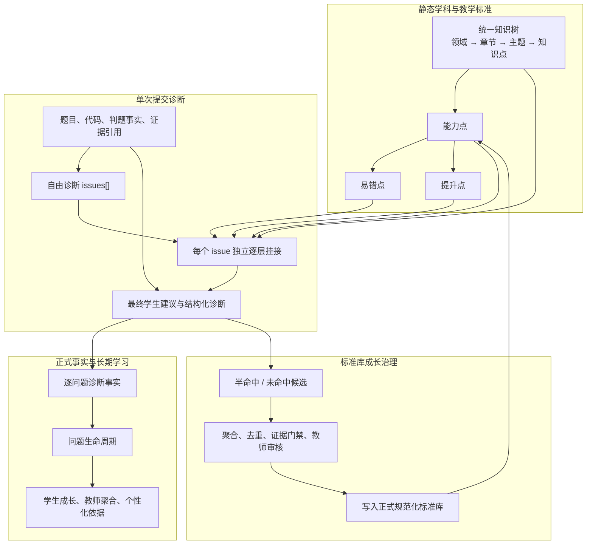

# Code 平台知识库与标准库设计解析

> 分析对象：`/Users/yq/Desktop/Code/online-judge`
>
> 核对日期：2026-07-14
>
> 文档目的：解释 Code 平台知识库与标准库的设计精髓、真实运行方式、产品价值、当前实现状态和可迁移原则。本文是对照研究，不自动改变灵知产品蓝图。

## 执行摘要

Code 平台最值得学习的，不是“把知识目录分得很细”，也不是“给每道题打很多标签”，而是建立了一套贯穿教学全过程的**稳定语义坐标系**：

```text
知识树：这门学科包含什么
能力点：学生需要会做什么
易错点：学生通常在哪个具体动作上出错
提升点：修正基础错误后还能怎样进阶
提交证据：这个学生这一次实际发生了什么
AI 诊断：如何根据证据理解问题并挂接到语义坐标
学习事实：怎样把一次判断变成可追踪的正式记录
治理闭环：标准库没有覆盖时，怎样受控地长出新节点
```

它的核心不是“库替 AI 判断”，而是：

> **AI 先根据题目、完整代码和判题事实自由诊断，再用标准库统一命名、颗粒度和归属；后端只负责证据、结构、合法性和长期事实。**

因此，Code 平台形成的不是一棵静态知识树，而是一套循环：

```text
学科知识坐标
→ 题目与提交映射
→ AI 发现多个真实问题
→ 每个问题独立挂接标准库
→ 形成学生建议与正式诊断事实
→ 比较后续提交中的持续、恢复和复发
→ 库外问题进入候选池
→ 教师治理后反哺标准库
```

这套设计的真正价值是同时解决五个问题：

1. 不同题目、课程、学生和 AI 输出使用同一套知识语言。
2. AI 可以自由分析，但结果不再只是不可复用的自然语言。
3. 一次提交可以被拆成多个独立问题，每个问题有证据和知识归属。
4. 同一个问题能够跨提交追踪，而不是每次重新生成一段评价。
5. 标准库可以从真实未命中案例中成长，但不会被一次模型输出直接污染。

### 阅读导航

- 只想理解精髓：读第 2、10、16 节。
- 想理解真实运行链：读第 4、6、7、8 节。
- 想判断当前完成度：读第 5.5、9、13 节。
- 想迁移到灵知：读第 3、12、14、15 节。

## 1. 它到底要解决什么问题

普通在线判题系统只能回答：

```text
这次提交通过了吗？
```

普通 AI 代码助手通常只能回答：

```text
这段代码可能哪里错了？
```

Code 平台想进一步回答：

```text
学生这次具体错在什么可教学动作上？
这个动作属于哪一个知识点和能力点？
这是第一次出现、持续存在、修复后复发，还是已经恢复？
老师如何在班级、作业和题目层面看到同类问题？
现有标准库没有覆盖时，如何把新问题沉淀下来？
```

如果没有统一知识坐标，系统会出现四种典型混乱：

- 同一个问题在不同页面被叫成不同名字。
- AI 每次都能讲一段，但无法判断学生是否反复犯了同一个错误。
- 教师端只能按关键词猜章节和错因，统计口径不稳定。
- 标准库为了“命中率”不断堆标签，最终变成难以维护的平铺词表。

所以，知识库的第一职责不是展示，而是让课程、题目、诊断、学习记录和教师分析**说同一种语言**。

## 2. 最核心的设计精髓

### 2.1 知识树不是课程目录，而是跨课程复用的学科坐标

课程目录回答“这一次按什么顺序教”，知识树回答“这个概念在学科中是什么、与什么相邻、依赖什么”。

同一个知识点可以出现在多门课程、多道题和多次学习活动中，但正式知识节点只有一个。课程、题目和学习事实都引用它，而不是各自复制一棵树。

因此：

```text
知识树 ≠ 一门课程的章节目录
知识树 ≠ 一道题的标签集合
知识树 ≠ 某个学生的学习进度
```

课程目录只是知识树在某个教学目标下的**选择、排序与编排投影**。

### 2.2 知识点、能力点和易错点必须分开

三者回答的是不同问题：

| 层 | 回答的问题 | 例子 |
| --- | --- | --- |
| 知识点 | 学什么 | 左闭右开区间 |
| 能力点 | 学生要会做什么 | 能把题面边界语义转换成正确循环条件 |
| 易错点 | 学生会在哪个动作上犯错 | 把 `range(l, r)` 的右端误认为包含 |
| 提升点 | 掌握基础后怎样提高 | 用边界反例和不变量系统验证循环 |

如果把它们都塞进一棵目录树，会发生两种错误：

- “循环边界”下面同时出现概念、能力、错误和建议，节点语义混乱。
- 学生状态被误写进学科结构，例如把“张三不会循环边界”当成知识节点属性。

Code 平台的正式结构是：

```text
知识树收束到知识点
└── 能力点
    ├── 易错点
    └── 提升点
```

### 2.3 标准库是诊断语言，不是诊断引擎

标准库负责：

- 统一名称。
- 控制颗粒度。
- 给出能力与错因之间的正式关系。
- 提供相近项、前置项和迁移项。
- 让自然语言诊断可以落到稳定 ID。

标准库不负责：

- 仅凭条目内容判断学生一定犯了什么错。
- 用关键词规则替 AI 预选错误行。
- 把候选节点当作当前提交的证据。
- 存放 AI 工作流、安全规则、部署门禁或教师审批流程。

这意味着，即使标准库中有“最后一个元素漏处理”，只要当前代码和判题证据不支持，AI 就不能把它判成命中。

### 2.4 AI 先自由诊断，再挂接标准库

如果一开始就把标准库候选塞给 AI，模型很容易围绕候选找解释，出现“为了命中而诊断”的锚定偏差。

Code 平台采用相反顺序：

```text
先看完整题目 + 完整带行号代码 + 判题事实
→ 形成多个带证据的问题 issues[]
→ 再为每个问题逐层查找最合适的标准库位置
```

标准库因此服务于 AI，而不是限制 AI 的观察范围。

### 2.5 每个问题独立归类，不把整道题压成一个标签

一次提交可能同时存在：

- 题意理解错误。
- 状态设计错误。
- 循环边界错误。
- 输出格式错误。

这些问题可能属于完全不同的知识路径。Code 平台先产生多个 `issue`，再为每个 `issue` 独立维护导航路径、命中状态和失败状态。

一个问题没有匹配，不会清空其他问题；整道题也不再只有一个“主标签”。

### 2.6 必须允许半命中和未命中

正式命中状态的核心语义是：

| 状态 | 含义 | 处理 |
| --- | --- | --- |
| `HIT` | 现有条目精确解释了真实问题，并有当前证据 | 绑定正式 ID |
| `PARTIAL` | 找到了正确方向或父路径，但现有条目颗粒度不够 | 保留最近正式锚点，并提出更细候选 |
| `MISS` | 现有库无法解释真实问题 | 不伪造正式 ID，形成库外发现 |

`OUT_OF_LIBRARY` 在部分模型输出与兼容协议中表示库外发现；正式事实主口径仍收束为 `HIT / PARTIAL / MISS`，库外内容另存为发现或成长候选。

这一设计承认标准库永远不可能一次建完。允许不命中，比为了漂亮的命中率硬套一个错误 ID 更重要。

### 2.7 当前证据高于标准库路径

知识邻近只说明“可能相关”，不证明“这次发生了”。正式判断必须回到：

- 题目要求。
- 学生代码行。
- 编译或运行错误。
- 可见失败样例。
- 期望输出与实际输出。
- 可引用的证据编号。

标准库路径提供解释坐标，证据决定诊断是否成立。

### 2.8 静态标准库与动态学生状态分离

标准库保存“这个错误类型是什么”；学习事实保存“哪个学生在何时、哪道题、哪次提交中出现了它”。

同一个 `MISTAKE_POINT` 可以关联许多学生和提交，但它本身不保存任何人的掌握度。学生的持续困难、恢复和复发是后续事实投影，不污染标准库定义。

## 3. 四类对象的清晰边界

| 对象 | 真正职责 | 主要内容 | 不应承载 |
| --- | --- | --- | --- |
| 知识树 | 定义学科地图 | 领域、章节、主题、知识点、别名、前置关系 | 学生状态、具体错误、课程顺序 |
| 标准库 | 定义诊断与教学语言 | 能力点、易错点、提升点、关系 | 当前提交结论、AI 流程、审批状态 |
| 提交诊断事实 | 记录这次发生了什么 | 问题 ID、正式归属、证据、置信度、来源 | 学科定义、全局真理 |
| 学习者投影 | 解释一个人如何变化 | 新出现、持续、复发、未观察、恢复 | 回写标准库或篡改历史事实 |

可以用一句话记住：

> **知识树是地图，标准库是诊断词典，提交事实是行车记录，学习者模型是基于记录计算出的当前状态。**

## 4. 总体架构



## 5. 静态知识结构

### 5.1 知识树层级

当前实体枚举支持：

```text
DOMAIN
CHAPTER
SECTION
TOPIC
KNOWLEDGE_POINT
```

当前目录数据实际使用的是：

```text
领域 DOMAIN
└── 章节 CHAPTER
    └── 主题 TOPIC
        └── 细知识点 KNOWLEDGE_POINT
```

`SECTION` 目前保留在模型中，但当前目录没有实际节点。它是预留层，不应在展示时假装已经存在。

每个知识节点至少包含：

| 字段语义 | 作用 |
| --- | --- |
| 稳定 `code` | 被题目、能力点、事实和 API 长期引用 |
| `parentCode` | 构成唯一主树 |
| 主名称 `name` | 统一正式叫法 |
| `aliases` | 吸收高中、竞赛、通用、英文和旧称 |
| `path` | 提供完整可读路径 |
| `stage / difficulty` | 表达适用阶段与难度 |
| `prerequisites` | 表达学习前置 |
| `learningObjectives` | 说明学习目标 |
| `typicalProblems` | 说明典型问题形态 |
| `libraryVersion / enabled` | 支持版本和停用治理 |

### 5.2 一套主节点，多套术语别名

Code 平台没有把“高中知识库”和“竞赛知识库”建成两棵平行树。同一概念只保留一个正式节点：

```text
主名：优先采用高中教学中常用、学生可理解的叫法
别名：竞赛术语、英文术语、教师惯用名、历史旧称
```

这样既能让学生看到熟悉语言，也能让题库、AI 和教师通过不同说法检索到同一个节点。

这比复制多棵树更稳，因为多树最终会造成：

- 一个概念拥有多个 ID。
- 学生记录无法合并。
- 课程和题目各自选择不同分支。
- 标准库修改需要多处同步。

### 5.3 规范化标准库

正式诊断层分为三类实体：

#### 能力点

能力点描述学生需要完成的具体判断、操作或建模动作，关键内容包括：

- 正式编码与名称。
- 学习目标。
- 一个主知识点锚点。
- 相关知识点和前置知识点。
- 掌握层级与适用语言。

#### 易错点

易错点必须归属于一个能力点，关键内容包括：

- 具体错误行为，而不是“理解不深”之类空泛标签。
- 学生产生错误的具体误解。
- 可观察症状。
- 修复策略。
- 严重度。
- 主知识点、相关知识点和适用语言。

#### 提升点

提升点表达基础问题修复后可以进一步训练什么，关键内容包括：

- 提升目标。
- 练习策略。
- 对学生的收益。
- 教师解释。
- 关联的能力点、知识点和易错点。

### 5.4 关系不是另一棵树

除唯一主归属外，系统还支持：

```text
PREREQUISITE  前置
RELATED       相关
CONFUSABLE    易混淆
TRANSFER      可迁移
EXTENDS       扩展
```

这些关系用于检索、解释和迁移，不替代主树。主路径必须稳定，横向关系可以丰富。

### 5.5 当前目录数据规模

通过当前代码目录直接统计得到：

| 内容 | 数量 |
| --- | ---: |
| 领域 | 6 |
| 章节 | 34 |
| `SECTION` | 0 |
| 主题 | 111 |
| 细知识点 | 586 |
| 知识树节点总数 | 737 |
| 能力点 | 140 |
| 易错点 | 361 |
| 提升点 | 75 |
| 标准库条目总数 | 576 |

这组数据来自当前保留的代码目录与测试素材，只用于说明结构和覆盖规模。项目已经决定：**正式生产内容以数据库为真源**；既有 seed 仅作为历史兼容、测试夹具或迁移来源，新增正式内容不应继续通过新 seed 批次交付。

### 5.6 正式表与兼容快照

设计上的正式主结构是：

```text
informatics_knowledge_nodes
ai_standard_skill_units
ai_standard_mistake_points
ai_standard_improvement_points
ai_standard_library_relations
ai_standard_library_growth_candidates
```

旧表 `ai_standard_library_items` 仍被保留，用于兼容教师端数字 ID、旧 API 和历史数据。它不应继续承担正式数据真源。

这也是当前实现最明显的新旧并存点：规范化表已经建立，部分读写仍会经过旧平铺快照再同步到规范化结构。

## 6. 一次提交如何使用知识库

### 6.1 第一步：构造证据包

后端先整理客观材料：

- 完整题目描述、输入输出与约束。
- 完整学生代码和稳定行号。
- 编译输出、运行时错误、超时或判题结果。
- 可见失败样例、期望输出和实际输出。
- 统一的 `evidenceRef`。

事实层只回答“发生了什么”，不替 AI 判断“为什么发生”。

### 6.2 第二步：自由诊断多个问题

AI 首轮不读取标准库 ID，只根据证据输出：

```text
problemUnderstanding
codeIntent
behaviorGap
issues[]
```

每个问题至少具有：

- 稳定 `issueId`。
- 问题标题。
- 发生了什么。
- 为什么重要。
- 证据引用。
- 严重度和置信度。

后端会校验证据引用是否合法。单个问题无效时，应尽量只丢弃该问题，而不是清空所有问题。

### 6.3 第三步：每个问题逐层挂接

后端为每个问题维护独立的 `breadcrumb`，每轮只给 AI 当前可见层。AI 只能执行三个最小动作：

```text
SELECT    选择当前层节点并继续展开
DONE      当前路径或诊断项已经足够
NO_MATCH  当前层没有合适项
```

运行过程类似：

```text
根领域
→ 章节
→ 主题
→ 知识点
→ 能力点 / 易错点 / 提升点
```

后端负责：

- 校验 AI 只能选择当前层可见 code。
- 保存已经确认的 breadcrumb。
- 展开下一层，而不是让模型自己编造路径。
- 记录轮次、超时、非法 code 和失败原因。
- 一个问题失败时继续处理其他问题。

这种“逐层给目录”的方式比一次把 576 个标准项全塞进 prompt 更节省上下文，也更容易审计 AI 在哪一步选错。

### 6.4 第四步：生成最终建议

最终建议阶段同时读取：

- 原始题目、代码和判题事实。
- 自由诊断得到的多个问题。
- 每个问题的标准库锚点或未命中状态。

它输出两套内容：

#### 学生可见内容

- 基础层问题说明。
- 提高层建议。
- 证据依据。
- 一个可执行的下一步动作。

#### 后台结构化内容

- 每个诊断候选的命中状态。
- 知识路径、能力点、易错点和提升点 ID。
- 证据引用和置信度。
- 库外发现与成长候选。
- 教师追踪与质量标志。

学生看到的是老师式自然反馈，不应看到 `libraryFit`、内部候选数组或模型审计字段。

### 6.5 第五步：后端校验

后端不替 AI 生成诊断，但负责硬边界：

- JSON 和字段结构合法。
- 标准库 ID 真实存在。
- `HIT` 必须有正式锚点。
- `MISS` 不能伪造已有 ID。
- 学生可见判断引用真实证据。
- 非法证据别名被归一化或拒绝。
- 失败状态不能伪装成 AI 成功。

### 6.6 标准库不可用时的正确降级

当前 issue-first 主链的正确语义是：

```text
问题是否成立，看 issues + evidence
标准库是否命中，看 anchors
学生建议是否生成，看 issues + evidence
```

所以：

| 场景 | 影响 |
| --- | --- |
| 标准库为空 | 标记 `LIBRARY_EMPTY`，继续生成建议 |
| 当前层无匹配 | 当前问题标记 `NO_MATCH`，继续 |
| AI 返回非法 code | 当前问题降级或重试，其他问题继续 |
| 单个问题挂接超时 | 当前问题标记 `ATTACHMENT_FAILED`，不清空其他问题 |
| 自由诊断没有任何合法问题 | 整次诊断失败，不伪造建议 |

旧文档中“导航失败时关闭整条诊断”的规则已经被 issue-first 设计取代，不应再作为当前主链理解。

## 7. 从一次诊断到长期学习事实

### 7.1 为什么自然语言报告还不够

一段自然语言反馈适合学生阅读，却不适合长期计算。系统还需要把它投影成逐问题事实：

```text
submissionId
analysisId
issueId
factType
skillUnitId
mistakePointId
improvementPointId
knowledgePath
knowledgePathStatus
libraryFit
evidenceRefs
confidence
```

这使得学生刷新页面、重新进入、跨页面查看或教师聚合时，不需要重新解析 AI 文本。

### 7.2 稳定问题身份

系统按优先级为问题生成稳定键：

```text
正式易错点 ID
→ 正式提升点 ID
→ 能力点 ID + 事实类型
→ 知识路径叶子 + 标题的规范化指纹
```

有正式 ID 时优先使用正式 ID；没有正式 ID 时才降级到文本指纹。这样既能追踪标准问题，也能暂时承载库外问题。

### 7.3 问题生命周期

在同一学生、同一作业和同一道题的有效提交序列中，每个问题可以进入：

| 状态 | 含义 |
| --- | --- |
| `NEW` | 第一次观察到 |
| `PERSISTED` | 相邻有效提交中仍存在 |
| `NOT_OBSERVED` | 本次暂未观察到，但还不能直接证明掌握 |
| `RECURRED` | 消失后再次出现 |
| `RECOVERED` | 在通过等更强证据下获得恢复证据 |
| `UNCOMPARABLE` | 缺少身份、诊断或有效变化，不能比较 |

系统还区分“重复提交”和“有效尝试”。源码、判题状态和问题集合都没有变化时，不应把重复点击提交算成新的学习证据。

### 7.4 学生与教师看到的是同一事实的不同投影

学生侧可以看到：

- 本次新增问题。
- 仍然存在的问题。
- 已改善或恢复的问题。
- 反复出现的问题。
- 当前最值得处理的一项。

教师侧可以按：

```text
班级 → 作业 → 题目 → 学生/问题证据
```

聚合同一套后端事实。章节、知识点、能力点和易错点是分析维度，不是四套互不相干的统计系统。

## 8. 标准库如何从真实学习中成长

### 8.1 候选从哪里来

当 AI 能确认真实问题，但现有标准库只有相近父路径或完全没有细项时，系统生成成长候选，而不是直接写入正式库。

候选至少保存：

- 建议层级：能力点、易错点或提升点。
- 建议 code、名称和完整路径。
- 最后一个有效父知识点。
- 来源题目和提交。
- 证据引用与证据状态。
- 相似正式条目。
- 置信度、出现次数和独立来源提交。
- 变更理由、审核状态和回滚信息。

### 8.2 breadcrumb 是父路径唯一真源

模型可以建议新节点名称，但不能自行改写上级路径。候选只能挂在后端已经逐层确认的最后有效知识点下面。

这样可以防止 AI 输出一个看似合理、实际上不存在的知识路径。

### 8.3 同类候选聚合，而不是重复堆积

候选按“父知识点 + 层级 + 规范化 code”聚合：

- 同一提交重试只合并证据，不增加出现次数。
- 不同独立提交命中同类候选，才增加出现次数。
- 相似候选可以标为 `MERGED_SIMILAR`。
- 正式库已有同项时进入 `BLOCKED`，避免重复入库。

### 8.4 临时节点可以低优先级参与后续导航

具有真实父路径、证据和候选状态的临时节点，可以作为 `PROVISIONAL` 项出现在对应知识点的诊断层，但正式条目始终优先。

这让系统在教师尚未审核前也能复用真实发现，同时通过明确状态避免把临时节点伪装成正式标准。

### 8.5 教师治理动作

教师治理台支持：

```text
查看
编辑
通过入库
合并入库
拒绝
忽略
```

治理摘要还会显示：

- 待审核积压。
- 重复聚合数量。
- 高频候选路径。
- 标准库薄弱路径。

### 8.6 当前存在一个必须收束的产品边界

项目规格中同时存在两种规则：

1. 成长候选必须经过教师审核后才能影响正式库。
2. 满足父节点、直接证据、置信度和独立提交次数门禁后可以自动晋升。

当前代码的自动晋升开关默认开启，阈值为置信度 `0.90`、独立出现 `2` 次；但教师审核规格又强调实时诊断不得直接改写正式标准库。

这是一个真实的设计冲突，不是文案差异。若以教育标准库的可信性为首要目标，建议最终收束为：

```text
默认只自动聚合和排序候选
→ 自动达到“建议优先审核”状态
→ 教师或明确授权的治理流程批准后入库
```

自动晋升可以作为受控实验能力存在，但不应是默认生产行为。

## 9. 前端如何体现这套设计

### 9.1 学生侧

知识库不应先表现为一张复杂大图，而应嵌入学生当下任务：

- 每条建议展示自然语言问题说明。
- 显示对应知识路径及其来源状态：正式、临时、历史推断或未归类。
- 显示可点击的代码证据，跳回编辑器相应行。
- 在提交历史中显示问题新增、持续、复发和恢复。
- 使用同一知识坐标解释推荐和复盘。

对学生而言，知识树的价值不是“浏览 737 个节点”，而是知道：

```text
我现在卡在哪个具体动作上
为什么系统这样判断
它属于哪条学习路径
下一次提交是否真的解决了
```

### 9.2 教师侧

教师端目前具有两种视图：

1. 正式标准库：按知识路径查看能力点和易错点，支持搜索、筛选、新建、编辑、停用。
2. 人工治理：查看成长候选、频繁路径和薄弱路径，执行通过、合并、拒绝和忽略。

教师分析主线不是“先看整棵树”，而是：

```text
班级
→ 作业
→ 题目
→ 高频知识点 / 能力点 / 易错点
→ 代表学生与提交证据
```

这使知识库服务于真实教学决策，而不是成为一个孤立的后台编辑器。

## 10. 一个完整例子：循环最后一个元素漏处理

### 10.1 静态知识与标准

正式知识路径可能是：

```text
程序设计基础
→ 循环结构
→ 循环边界
→ 左闭右开 / 最后一次迭代
```

对应能力点：

```text
判断循环端点是否包含
```

对应易错点包括：

```text
允许相等时误用严格不等号
误把 Python range 右端当作包含
最后一个元素漏处理
```

这些不是三个同义标签，而是同一能力下三个可区分的具体错误行为。

### 10.2 当前提交证据

假设题目要求处理全部 `n` 个数，学生代码只循环到 `n - 2`，失败样例的最后一个数正好影响答案。

证据包可能包含：

```text
题目：要求处理全部 n 个输入
代码：第 18 行循环条件提前结束
判题：首个失败样例的尾部元素改变正确答案
```

### 10.3 AI 自由诊断

AI 先输出：

```text
I1：最后一个输入没有进入统计
证据：problem:requirement、code:line:18、judge:first_failed_case
```

此时还没有标准库 ID。

### 10.4 逐层挂接

AI 在后端提供的当前层中依次选择：

```text
程序设计基础
→ 循环结构
→ 循环边界
→ 判断循环端点是否包含
→ 最后一个元素漏处理
```

如果当前代码证据与条目精确一致，结果为 `HIT`。

### 10.5 正式事实和后续变化

系统保存：

```text
issueId = I1
mistakePointId = MP_LOOP_LAST_ELEMENT_SKIPPED
knowledgePath = [...]
evidenceRefs = [...]
libraryFit = HIT
```

学生下一次有效修改后：

- 问题仍存在：`PERSISTED`。
- 暂时没观察到但还未通过：`NOT_OBSERVED`。
- 通过后获得恢复证据：`RECOVERED`。
- 之后又出现：`RECURRED`。

### 10.6 标准库不够细时

如果真实错误是“过滤后序列长度变化，但循环仍使用原数组长度”，现有条目只能定位到循环边界能力，却没有精确易错点：

```text
libraryFit = PARTIAL
正式父路径 = 循环边界 → 判断循环端点是否包含
新候选 = 过滤后仍沿用原序列边界
```

候选携带当前代码证据和来源提交进入治理池。这里体现了整套系统最重要的开放性：**先忠于真实问题，再决定标准库是否需要成长。**

## 11. 为什么它比“目录复刻”更有价值

如果知识树只是题目目录复刻，它只能帮助浏览；Code 平台的设计让同一坐标参与：

| 环节 | 知识坐标的作用 |
| --- | --- |
| 题目管理 | 标明题目真正训练的知识和能力 |
| AI 诊断 | 统一问题名称与颗粒度 |
| 学生反馈 | 解释当前问题处在哪条学习路径 |
| 提交比较 | 判断两次提交是否是同一个问题 |
| 学习者模型 | 聚合持续困难、恢复和复发 |
| 个性化推荐 | 选择同能力复练、前置补救或迁移题 |
| 教师分析 | 统计班级真实薄弱点并下钻证据 |
| 标准库治理 | 从真实未命中案例发现知识缺口 |

真正的精髓不是某一张表，而是**所有学习功能引用同一个稳定知识坐标**。

## 12. 这套系统明确不是什么

### 12.1 不是一门课程生成一棵私有知识树

课程应该选择、映射和编排共享知识节点。只有学科确实出现新概念时，才通过治理流程扩充正式树。

### 12.2 不是把全部标准库塞给大模型

后端逐层展开，AI 每次只看当前层。这样控制上下文、降低锚定并保留可复盘路径。

### 12.3 不是规则引擎

标准库中的症状和典型模式只是教学参考，不能用本地关键词直接替 AI 判定真实错因。

### 12.4 不是学生画像数据库

“某学生经常犯某错”属于学习事实和模型投影，不属于易错点定义本身。

### 12.5 不是自动扩张的标签池

一次模型未命中不能直接创造正式标准。候选必须聚合、去重、检查证据和接受治理。

### 12.6 不是面向学生的复杂后台

学生需要的是当前问题、证据、路径和下一步，不是编辑知识图谱或浏览内部 ID。

## 13. 当前实现成熟度与真实缺口

### 13.1 已经形成的能力

- 一棵统一的信息学知识树，不分裂高中库和竞赛库。
- 知识点、能力点、易错点和提升点的规范化结构。
- 题目、完整代码和判题事实驱动的自由诊断。
- 多问题独立逐层挂接。
- `HIT / PARTIAL / MISS` 开放世界命中协议。
- 学生自然反馈与后台结构化诊断分离。
- 逐问题事实投影和问题生命周期。
- 学生成长摘要与教师后端事实聚合。
- 标准库临时候选、聚合、审计和教师治理台。

### 13.2 仍然存在的过渡债务

| 问题 | 当前表现 | 应收束方向 |
| --- | --- | --- |
| 新旧数据结构并存 | 规范化表与旧平铺 `ai_standard_library_items` 同时存在 | 规范化表成为唯一主写入和主读取，旧表只做明确兼容适配 |
| 教师前端仍从平铺列表重建树 | 前端加载 `/items` 后按知识 code 自己分组 | 后端直接提供规范化树与诊断层 DTO，前端不再推断归属 |
| 提升点管理不完整 | 服务端有正式提升点，教师正式库筛选与编辑主要只有能力点、易错点 | 补齐提升点查看、编辑、停用和关系管理 |
| seed 历史较重 | 大量版本化 seed 类仍在代码中 | 保持运行时关闭，逐步转为迁移档案与测试夹具，不再扩张 |
| 自动晋升与人工审核冲突 | 自动合并默认开启，规格又要求教师批准 | 明确生产默认治理策略，推荐默认人工批准 |
| 导航动作语义未完全收束 | 接口允许返回最多两个 code，当前主流程实际按首项继续 | 收束为单选动作，或真正实现可审计的多分支导航 |
| 兼容标签仍可形成回退事实 | 正式建议为空时仍可能从旧标签投影 `DIAGNOSIS` | 逐步只让正式 issue/advice 产生新事实，旧标签仅用于历史读取 |
| 个人全局掌握图尚未完整 | 已有同题问题生命周期，但跨题知识掌握仍是后续聚合 | 在正式事实之上建立可重算、带证据和置信度的学习者投影 |

### 13.3 不应误读的数据规模

586 个知识点和 576 个标准条目说明系统已有骨架，不说明教学质量已经完成。真正重要的是：

- 每个能力点是否描述具体动作。
- 每个易错点是否能区分真实错误行为。
- 条目是否有稳定主归属。
- AI 是否根据证据正确命中。
- 未命中是否能形成高质量候选。
- 教师是否能从聚合结果回到代表证据。

质量不能用“节点越多越好”替代。

## 14. 对灵知最值得迁移的原则

这部分只提炼原则，不在本文直接决定灵知实现方案。

### 14.1 先建共享语义底座，再让课程映射

灵知不应为每门课程生成一套互不相认的知识树。更稳的结构是：

```text
共享或课程域内稳定知识节点
→ 课程目标选择和排序这些节点
→ 课程块声明服务哪些知识点、能力点或易错点
→ 练习与诊断继续引用同一 ID
```

课程目录和知识树可以同时产生，但不能同时成为两套真源。目录负责教学顺序，知识树负责语义归属，两者通过稳定映射相连。

### 14.2 把“内容块”变成围绕能力与错因的教学手段

解释、推导、例题、练习、提示、反例和总结不只是页面样式，而是服务某个知识点或能力点的教学角色：

```text
知识点：函数定义域
能力点：能从表达式限制中求定义域
易错点：分母非零与根号条件漏取交集
教学块：概念解释、推导、反例、分步练习、迁移题
```

这样，可组合课程块才有明确组合依据，而不是 AI 随机拼装。

### 14.3 练习诊断应先读真实作答，再映射标准库

编程练习可以使用代码、判题和行级证据；数学可以使用步骤、变形和答案；语言可以使用文本、语法结构和评分依据。学科证据不同，但共同协议可以保持：

```text
真实作答证据
→ AI 自由诊断多个问题
→ 映射知识点 / 能力点 / 易错点
→ 形成正式事实
→ 后续独立复验
```

### 14.4 知识库不应吞并学习事实与学习者模型

灵知应继续保持：

```text
知识与标准：定义世界中有什么
学习事实：记录这个人发生了什么
学习者模型：根据事实推导这个人现在可能处于什么状态
AI 老师：读取必要事实和模型，决定此刻如何教学
```

### 14.5 允许知识库不知道

新学科、新资料和新课程一定会出现未覆盖内容。系统应允许：

```text
精确命中
半命中
未命中
提出候选
经过治理后扩充
```

这比课程生成时要求 AI 一次性生成“完美知识树”更符合真实教育系统。

## 15. 一页式蓝图

```text
【学科真源】
统一知识树
领域 → 章节 → 主题 → 知识点
主名 + 别名 + 前置/相关/易混/迁移关系

【教学标准】
知识点 → 能力点 → 易错点 / 提升点
定义具体能力边界、真实错误行为和进阶方向

【任务映射】
课程 / 题目 / 练习引用正式知识与能力 ID
不复制私有知识树，不把课程目录当学科真源

【AI 诊断】
题目 + 作答 + 客观结果
→ 自由诊断多个 issue
→ 每个 issue 逐层挂接
→ HIT / PARTIAL / MISS
→ 学生自然反馈 + 后台结构化诊断

【正式事实】
逐问题保存 ID、路径、证据、置信度和来源
跨提交计算 NEW / PERSISTED / NOT_OBSERVED / RECURRED / RECOVERED

【教学应用】
学生复盘、个性化练习、AI 老师、教师班级分析
全部读取同一套正式事实和知识坐标

【成长治理】
未命中 → 临时候选 → 独立提交聚合 → 去重与证据门禁
→ 教师审核/明确授权 → 正式入库 → 后续导航可见
```

## 16. 最终判断

Code 平台知识库设计的精髓可以压缩为六句话：

1. **一棵树统一概念，多种术语通过别名进入同一节点。**
2. **知识点说明学什么，能力点说明会做什么，易错点说明错在哪里。**
3. **标准库给 AI 坐标和语言，但不替 AI 阅读题目、作答和证据。**
4. **每个真实问题独立归类，并允许精确命中、半命中和未命中。**
5. **诊断必须沉淀为逐问题事实，才能跨提交追踪学习变化。**
6. **库外发现先成为候选，经过聚合和治理后才反哺正式标准。**

真正应迁移的不是那 737 个知识节点或 576 个标准条目，而是这套分工和闭环。只复制树形界面，会得到目录；复制稳定坐标、证据协议、问题生命周期和治理机制，才会得到一个能支持个性化学习的知识系统。

## 17. 主要源码与规格依据

以下路径均相对于 `/Users/yq/Desktop/Code/online-judge`：

| 主题 | 主要依据 |
| --- | --- |
| 知识树实体与层级 | `src/main/java/com/onlinejudge/learning/knowledge/domain/InformaticsKnowledgeNode.java`、`InformaticsKnowledgeNodeType.java` |
| 知识目录样本 | `src/main/java/com/onlinejudge/learning/knowledge/application/InformaticsKnowledgeSeedCatalog.java` |
| 能力点、易错点、提升点 | `src/main/java/com/onlinejudge/learning/standardlibrary/domain/AiStandardSkillUnit.java`、`AiStandardMistakePoint.java`、`AiStandardImprovementPoint.java` |
| 规范化结构规格 | `openspec/specs/standard-library-normalized-schema/spec.md` |
| 统一知识树规格 | `openspec/specs/informatics-knowledge-tree-quality/spec.md` |
| 多问题自由诊断与逐层挂接 | `src/main/java/com/onlinejudge/submission/application/AiReportService.java`、`openspec/specs/standard-library-layered-attachment/spec.md` |
| AI 与标准库边界 | `src/main/java/com/onlinejudge/submission/application/PromptTemplateRegistry.java` |
| 逐问题正式事实 | `src/main/java/com/onlinejudge/submission/domain/SubmissionDiagnosisFact.java`、`SubmissionDiagnosisFactProjector.java` |
| 稳定问题身份 | `src/main/java/com/onlinejudge/submission/application/IssuePointKeyFactory.java` |
| 问题生命周期 | `src/main/java/com/onlinejudge/submission/application/SubmissionIssueLifecycleService.java`、`SubmissionGrowthSummaryService.java` |
| 标准库成长候选 | `src/main/java/com/onlinejudge/learning/standardlibrary/application/AiStandardLibraryGrowthAgentService.java` |
| 临时节点与治理 | `openspec/specs/standard-library-provisional-growth/spec.md`、`standard-library-review-workflow/spec.md`、`standard-library-governance-quality/spec.md` |
| 教师端正式库与治理台 | `frontend/src/features/teacher/TeacherManagementPage.tsx` |
| 历史决策与当前真源 | `docs/ai-memory/项目决策.md` |

### 核验记录

- 通过当前编译产物直接统计知识目录与标准目录，结果为 `737` 个知识树节点、`576` 个标准库条目。
- 运行 7 个针对性测试类，共 29 个测试，失败 0、错误 0、跳过 0。
- 测试覆盖知识树同步、规范化标准库、逐层导航、成长候选、诊断事实投影、问题生命周期和提交成长摘要。
- 对 Code 项目只做了读取、编译与测试，没有修改其源码；原有 `data/onlinejudge.mv.db` 和 `run.pid` 工作区改动未处理。
