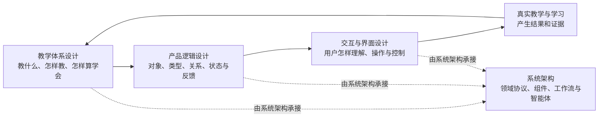
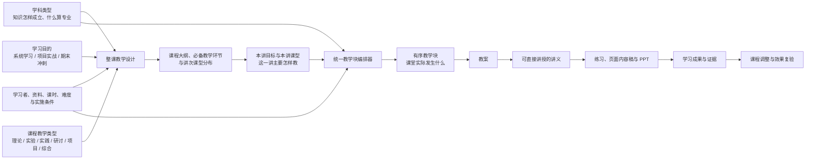
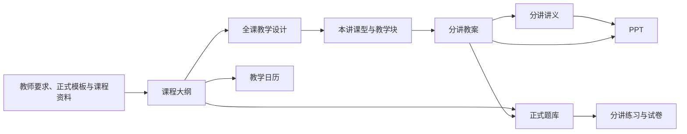

# 灵知 AI 课程系统产品蓝图

> 文档状态：当前产品定义的最高优先级来源<br>
> 本文回答：灵知是什么，教学体系怎样定义，产品对象怎样关联，用户怎样理解和操作，以及哪些产品边界不能被实现绕过。<br>
> 本文不回答：代码怎样组织、当前完成到哪里、某次变更怎样施工、历史上为什么这样决定。

相关文档：

- [系统架构](./系统架构.md)：技术架构、代码结构、领域协议、能力模块与运行链。
- [当前产品状态](./产品状态.md)：唯一当前状态板，记录成熟度、在建项、缺口和下一攻坚位置。
- [项目规则](../AGENTS.md)：跨任务仍然有效的产品、执行、验收和工程护栏。
- [`openspec/changes/`](../openspec/changes/)：正在实施的重要变更、任务和验收要求。
- [项目决策记录](./归档/项目决策记录.md)：只用于追溯历史原因和被取代方案。

维护规则：

1. 本文只维护仍然有效、会约束多个模块的产品定义，不记录实现进度和版本日志。
2. 产品判断改变时直接修正原位置；历史原因交给项目决策和 Git。
3. 字段、接口、模块名、提示词、阈值、模型版本和测试数量属于系统架构、正式规格或状态证据，不进入本文。
4. 技术实现必须承接本文，不能从当前页面、代码或模型能力反向发明产品关系。

本文按三个产品设计部分组织：

```text
教学体系设计：教育上应该怎样做
-> 产品逻辑设计：对象怎样关联、约束和变化
-> 交互与界面设计：用户怎样理解、操作和控制
-> 技术架构设计：由系统架构承接
```

## 0. 30 秒看懂蓝图

### 0.1 产品设计全貌



三部分共同回答“产品应该是什么”，全部由本文承载；系统架构回答“系统怎样实现”。教学体系是源头，产品逻辑把教学语义变成稳定关系，交互与界面再把这些关系翻译为人能理解和控制的任务。

灵知的差异化集中在两条相互依赖的产品机制：

- **具有学生视角的教师智能体**：智能体服务教师，但从学生的学习目的、起点、行动和达成证据反向组织课程。教师端回答“要教会什么、怎样教、怎样检查”，学生端回答“我要学会什么、怎样学、怎样证明学会”；两端读取同一课程，不各自维护一份内容。
- **结构化同源**：大纲、教案、讲义、题库、PPT 和学生学习界面都保留与课程目标、讲次、知识和来源的关联。任一内容变化后，系统先识别真正受影响的部分并形成联动修改建议，教师确认后再精准更新，不整门课程重写。

### 0.2 课程形成关系图



这张图是灵知教学语义的主索引。课程级只有三类正式分类输入：学习目的决定“为什么学、最终得到什么”，学科类型决定“这个领域怎样学才专业”，课程教学类型决定“整门课主要怎样教”。系统先据此形成整课结构和讲次课型分布，再结合本讲目标、本讲课型与当前条件编排教学块。任何生成模板、页面选项或智能体工具，都必须能指出自己读取了什么、改变了什么、产出了什么，以及用什么证据检查。

### 0.3 人与 AI 的阅读约定

| 读者 | 快速读法 | 完整读法 |
| --- | --- | --- |
| 人 | 先看本节两张图，再进入当前任务对应章节 | 需要做产品决策时，继续阅读相关定义、关系、边界和质量标准 |
| AI | 先建立“教学体系 → 产品逻辑 → 交互界面 → 技术承接”的全局坐标 | 按标题层级读取正式定义；不得只从图、页面文案、提示词或代码名称反推产品语义 |

快速定位：产品方向看第 1 章，全部教学语义看第 2 章，对象、状态和生产关系看第 3 章，页面与交互看第 4 章，异常和不可违反边界看第 5 章，长期建设顺序与完成标准看第 6 章。

本文中的图负责展示全貌，表格和带有“必须、应、可以、不得”的规则负责正式约束；二者不一致时，以详细规则为准。本文定义目标产品语义，不表示所有能力已经实现；当前成熟度只看产品状态。

## 1. 产品定义

### 1.1 产品定位

灵知是一套以结构化课程为核心、由具有学生视角的教师智能体协助运行的 AI 课程系统。它连接教师课程生产、统一学习现场和学习证据驱动的课程生长，并从同一课程语义生成面向教师和学生的不同表达。

它不是一次性课程生成器，也不是把聊天、题库、笔记和 PPT 拼在一起的工具箱。教师智能体也不只是替教师写材料，而是始终从学生最终要学会什么、需要完成什么、用什么证明学会出发，帮助教师组织教学、检查结果、发现问题并修正课程。

```text
目标、资料与学习起点
-> 结构化当前课程
-> 教案、讲义、练习、PPT 与图解等同源教学产物
-> 阅读、提问、笔记、作答与项目表现
-> 有来源、有知识坐标的学习证据
-> 可反驳的教学判断与课程调整候选
-> 用户审阅并确认
-> 当前课程及受影响产物安全更新
-> 独立任务验证调整效果
-> 新证据进入下一轮课程生长
```

### 1.2 核心用户与任务

灵知服务两个围绕同一份正式课程协作的角色：

- 课程创建者和教师：从学生的学习目的、起点、目标、资料与教学约束创建课程，审阅并修改大纲、教案、讲义、题库和 PPT，在真实学生界面中即时预览并继续修订。
- 学习者：根据系统学习、项目实战或期末冲刺的目的，看见自己要学会什么、完成什么和怎样证明学会，并在同一现场阅读、练习、提问、记录和形成成果。

两类角色共享同一个课程身份、内容版本和正式课程，但权限、入口、任务和表达不同。教师端与学生端不是两套课程，也不是把教师页面原样复制给学生；它们是同一教学内容面向备课任务和学习任务形成的双视角界面。灵知不扩张为班级管理、多人协作或学校文件管理平台。

产品必须完整支持四类连续任务：

1. 从目标、资料和教学约束得到一门结构清楚、可审阅、可恢复的课程。
2. 让教师持续编辑各类教学产物，并看见上游修改对下游的真实影响。
3. 让学习者在同一现场完成阅读、练习、提问、记录和项目，不在工具之间搬运上下文。
4. 让课程依据真实学习证据安全调整，并用独立结果判断调整是否有效。

### 1.3 产品北极星

唯一北极星是**可验证学习目标达成率**：

```text
有来源证据、形成正式课程修订并获得独立效果结果的已接受调整数
/
全部已接受课程调整数
```

生成数量、AI 对话数量、课程时长、PPT 页数和页面访问量只能解释过程，不能证明学习目标已经达成。

### 1.4 产品范围

- 不做通用教务和班级管理平台，不做多人协作、课程商城、内容广场或社交网络。
- 不新增与课程库、课程工作区、AI 老师平行的顶层功能中心。
- 不让用户管理内部版本树，不建立长期覆盖正式课程的个人内容副本。
- 不让智能体绕过证据、用户确认和正式操作直接改写课程。
- 不先做自由视频、数字人或能力市场，再倒推课程定义。
- 不用单门样板课程、一次模型成功或局部测试代替跨学科与长期效果验证。

## 2. 教学体系设计

教学体系设计定义“灵知教什么、怎样教、怎样判断学会，以及不同教学对象如何组合”。本章所说的“完整教学语义”，指灵知当前产品支持并会约束大纲、教案、讲义、练习、PPT 和课程生长的全部稳定语义，不试图穷尽世界上所有教育理论。

页面、提示词、代码和模型只能实现这些定义，不能临时创造另一套教学分类、关系或质量标准。

### 2.1 灵知的教学定义、寓意与共同原则

#### 2.1.1 教学定义

> 教学是教师在真实条件下，围绕可观察成果，组织学习者经历理解、行动、反馈与迁移，并依据学习证据持续调整支持，使学习者从当前起点走向独立完成。

这一定义决定了灵知的本质：灵知编排的不是一组“看起来完整”的内容，而是一条**可实施、可观察、可调整的学习发生路径**。内容是教学材料，教学块是运行单位，学习证据是控制信号，教师是最终决策者。

| 主体 | 在灵知中的正式角色 | 产品必须守住的含义 |
| --- | --- | --- |
| 教师 | 课程共同设计者、课堂决策者和适应性专家 | 教师确认目标和标准，根据现场证据决定继续、补支架、重教、变式或提高挑战 |
| 学习者 | 通过解释、求解、操作、讨论、创作和反思形成表现的人 | 学习者必须留下可观察行动和产出，并逐步从依赖支持走向独立选择、自检和迁移 |
| AI | 把教师意图和教学标准转化为候选结构与内容的协作者 | AI解释建议依据、接受修改并保存影响；正式教学判断、课程确认和课堂处置仍由教师负责 |
| 课程资料 | 知识、案例、任务与证据来源 | 资料支持教学内容，不自动决定教学结构，也不能替代教师确认的课程目标与学科标准 |

#### 2.1.2 真实教学场景

教学定义必须覆盖老师真实工作的三个时段，而不是只覆盖“点击生成”这一刻：

| 时段 | 老师真正要解决的问题 | 灵知形成的正式结果 |
| --- | --- | --- |
| 课前设计 | 这门课为何学、这讲要达成什么、学生从哪里开始、用什么证明学会、在现有课时与设备下怎样教 | 大纲、讲次目标、本讲课型、有序教学块、教案、可直接讲授的讲义与 PPT |
| 课中实施 | 学生现在是否跟上、哪种错误正在发生、该继续还是调整、怎样让不同学生都能进入任务 | 教师可讲语言、提问与活动指令、预期回应、就近检查、反馈分支、时间与替代方案 |
| 课后复盘 | 哪些目标真正达成、哪些判断只有弱证据、下次课或后续产物应改哪里、调整是否有效 | 学习事实、教学解释、局部调整候选、影响范围、新修订与独立复验 |

课堂实施条件是教学设计输入。总课时、单讲时长、班额、线上或线下、个人或分组、设备与网络、安全与无障碍要求、考试和提交时限都会改变教学块的数量、参与方式和反馈路径；它们不改变课程核心目标，也不能由模型静默假设。

#### 2.1.3 共同教学原则

无论学习目的、学科类型、课程教学类型和本讲课型怎样变化，灵知都遵守以下共同原则：

| 原则 | 产品语义 | 直接约束 |
| --- | --- | --- |
| 从成果反推 | 先明确学习者最终要解释、完成、判断或创造什么，再设计证据、活动和内容 | 大纲不能先罗列知识点再补目标；教案必须先有目标和达成检查 |
| 学科方法成立 | 不同学科用不同方式建立知识、证据和专业判断 | 数学不能用直觉替代定义，工程不能只讲概念，人文不能把解释写成唯一事实 |
| 可观察的认知投入 | 学习者必须选择、解释、推导、实现、操作、讨论或创造；互动必须形成共同产物或观点修订 | 每个关键环节标明学习者做什么、留下什么，不能用“参与讨论”冒充学习发生 |
| 讲解—行动—证据—反馈 | 解释和示范必须进入学习者行动，行动必须产生证据，证据必须决定下一步 | 教案和讲义同时写清达到、部分达到、未达到时怎样处理 |
| 支架逐步撤除 | 新手先获得分步示范和提示，随后过渡到独立完成和迁移 | 难度变化不能只换“简单/困难”措辞 |
| 多路径进入、同标准达成 | 用多种表征、参与和表达方式减少与目标无关的障碍，核心成果与专业标准保持一致 | 支持方式可以变化，不能把“照顾差异”写成降低目标 |
| 证据与判断分开 | 作答、作品和行为是事实；掌握判断、教学解释和课程建议是可修正结论 | 自述不能直接写成已掌握，AI 解释不能冒充学习事实 |
| 迁移而非复述 | 真正学会表现为能够在条件变化后选择、解释并使用所学 | 总结不能代替迁移任务，变式不能只替换数字或名词 |
| 教师最终控制 | AI 提供结构、内容和建议，教师决定学习目的、学科类型、课程教学类型、本讲课型、教学块与正式结果 | 推荐必须可修改、拒绝、撤销和恢复 |

灵知不要求每节课使用同一教学法。共同原则负责守住底线，学习目的负责最终去向，学科类型负责专业方法，课程教学类型负责整课主导方式，本讲课型负责当前课堂主弧，教学块负责把这些约束落成可执行顺序。

#### 2.1.4 教学理论怎样进入产品

教学理论在灵知中只转化为稳定规则、内容要求和最低质量标准，不新增教师要理解的理论菜单：

| 教学依据 | 吸收进灵知的规则 | 不形成的新分类 |
| --- | --- | --- |
| [OECD Teaching Compass 2025](https://www.oecd.org/en/publications/oecd-teaching-compass_8297a24a-en.html) | 教师作为课程共同设计者和适应性专家；AI建议必须支持教师能动性、专业判断和持续调整 | “教师能动性课型” |
| [CAST UDL Guidelines 3.0](https://udlguidelines.cast.org/) | 提供多种进入、参与和表达路径；主动识别无关障碍；支持走向有目的、能反思、能行动的学习者自主性 | “UDL 教学类型” |
| [ICAP Framework](https://doi.org/10.1080/00461520.2014.965823) | 教学块记录可观察的认知投入，区分接收、操作、生成解释和基于彼此观点的互动 | “主动课 / 互动课” |
| [IES 学习与教学组织指南](https://ies.ed.gov/ncee/wwc/PracticeGuide/1) | 间隔复现、主动提取、例题与独立解题交替、抽象与具体表征连接、深层解释问题进入动作库 | “提取练习课程” |
| [UNESCO AI Competency Framework for Teachers](https://unesdoc.unesco.org/ark:/48223/pf0000391104) | 人本、教师责任、AI教学整合和教师专业学习进入 AI 使用与确认边界 | “AI 教学风格” |

框架的新旧和流行度不直接决定产品采纳。只有能够改变课堂设计、学习证据、教师决策或最低质量标准的原则才进入正式要求；具体方法由学科、目标、学生起点和现场条件共同选择。

### 2.2 教学语义词典与课程层级

#### 2.2.1 课程教学层级

```text
课程
└── 讲（LessonUnit）：大纲计划、备课、授课、资料作用域、失败恢复和版本边界
    ├── 知识点：本讲需要理解和掌握的专业内容
    └── 教学块：课堂中实际发生的专业教学环节
```

“讲”是新课程唯一的教师可见正式层级，一讲可以覆盖一个或多个知识点，并由若干教学块组织课堂。课程大纲决定“整门课讲什么以及怎样展开”；固定周课表决定常规授课时间，教学日历决定具体日期、地点和教师；课程教学类型决定全课主要采用什么教学组织；当前讲的课型和教学块决定“一讲怎样组织”；教案、讲义、练习和 PPT 分别承担不同教学职责。新课程的大纲、教案、资料定位、导航和调整范围都只使用“课程—讲次”关系，不再建立其他并行教学层级。

#### 2.2.2 正式术语

| 术语 | 回答的问题 | 作用范围 | 是否直接给教师选择 |
| --- | --- | --- | --- |
| 课程类别 | 这门课在教务上属于什么 | 教务档案 | 是，但不参与教学编排 |
| 课程规模 | 这门课承诺覆盖多少 | 全课程 | 由课时与范围共同确定，教师可修正 |
| 学习目的 | 为什么开这门课，学习者最终要得到什么 | 全课程 | 是，系统学习、项目实战、期末冲刺 |
| 具体课程目标 | 这门课完成后，学习者能做出什么可观察表现 | 全课程并分解到各讲 | 教师填写或确认，不是分类菜单 |
| 目标难度 | 学习者最终需要在多大挑战和独立程度下完成 | 全课程并落实到各讲 | 是，入门、进阶、高阶 |
| 学科类型 | 在这个领域，知识怎样成立、什么算专业行为和合格证据 | 全课程 | AI 推荐，教师可锁定或修改；只分一级 |
| 第二学科关系 | 完成目标是否确实需要另一种专业方法 | 全课程或局部 | 需要时显式确认；不是学科二级分类 |
| 课程教学类型 | 整门课主要用什么方式组织教学 | 全课程 | 是，理论课、实验课、实践课、研讨课、项目课、综合课 |
| 课程阶段 | 当前内容处于引入、奠基、发展、整合还是成果阶段 | 课程与讲 | 系统判断，教师通过结构调整改变 |
| 本讲课型 | 当前一讲主要怎样教 | 讲 | AI 推荐，教师可修改；七种稳定类型 |
| 教学动作 | 为完成当前教学任务需要哪些讲解、示范、练习、讨论、探究、制作或检查动作 | 教学块内部 | 系统使用，不形成教师分类菜单 |
| 教学块 | 课堂按什么顺序发生哪些环节 | 讲 | 系统编排，教师通过教案或 AI 候选调整 |
| 教学产物 | 教学设计和内容以什么正式形式保存、审阅和使用 | 全课或讲 | 通过工作台操作 |
| 学习成果证据 | 用什么可观察结果判断目标是否达成 | 目标、讲与课程 | 教师确认，学习过程产生 |

这些术语不能互相替代。学习目的回答“为什么学”，具体课程目标回答“学完能做什么”，学科类型回答“这个领域怎样做才专业”，课程教学类型回答“整门课主要怎样教”，本讲课型回答“这一讲主要怎样教”，教学块回答“课堂具体按什么顺序发生”。教学块也不是正式课程正文中的内容单元。

### 2.3 教学对象、课程规模与实施条件

#### 2.3.1 教学对象与学习起点

教学对象描述课程面向哪一类人，例如教育阶段、专业背景、语言水平、年龄或职业场景；学习起点描述这批学习者当前已经具备什么、缺少什么以及证据来自哪里。二者不能混为“用户画像”。

- 教师明确提供的教学对象和前置要求是课程设计约束。
- 学习者自述、访谈和历史表现必须标明证据来源；仅有自述时只能形成暂定起点。
- 已有优势可以减少重复讲解，但必须保留检查点；未知能力不能默认已掌握。
- 共性课程基线服务目标人群，个体差异通过支架、节奏、练习和经确认的课程调整处理，不建立个人平行课程正文。

#### 2.3.2 课程规模与覆盖承诺

课程规模决定可以诚实承诺的覆盖范围，不直接决定学习目的、课程教学类型、本讲课型或难度：

| 课程规模 | 语义 | 可以承诺 | 必须说明 |
| --- | --- | --- | --- |
| 微型课 | 围绕一个可检查的核心问题完成一次短课教学 | 核心概览、入门或专题成果 | 本次不覆盖什么，不得自称完整学科课程 |
| 单元课 | 完整覆盖一个相对独立的知识或能力模块 | 一个单元的目标、结构与综合任务 | 单元边界以及与前后模块的关系 |
| 完整学期课 | 覆盖学科主干结构并形成跨讲综合成果 | 主干知识、能力与阶段评价 | 仍未覆盖的进阶、选修或特殊范围 |

规模只改变覆盖宽度、讲次数量和内容密度，不降低专业标准。短课也必须有目标、必要前置、教学行动和检查；长课也不能为了“完整”堆积无关内容。精确课时阈值由系统架构维护，蓝图只规定覆盖要求。

#### 2.3.3 实施条件

总课时、单讲时长、班级规模、线上/线下环境、可用设备、资料许可、安全要求、考试日期和学校模板等实施条件会限制“怎样教”，但不能由模型静默改变。

- 总课时和单讲时长决定内容容量与教学块时长，容量不足时必须缩小范围或增加课时。
- 班级规模影响讨论、展示、反馈和协作方式，不改变目标和学科标准。
- 工具、实验、代码执行或联网条件不足时，必须提供可解释替代方案或阻断相关活动。
- 医学、实验、代码执行、隐私和外部资料使用遵守各自安全边界。
- 资料是知识和案例来源，不自动决定教学结构；资料冲突、缺失或时效不足必须显式标记。

### 2.4 三种学习目的

学习目的定义“为什么开这门课、学习者最终要得到什么”，是大纲和全课成果的第一约束。它不等于具体课程目标：前者是稳定分类，后者是这门课可观察、可检查的个性化结果。

| 学习目的 | 核心组织问题 | 典型推进路径 | 必须保存的具体课程目标 | 完成证据 | 不得退化为 |
| --- | --- | --- | --- | --- | --- |
| 系统学习 | 学习者要系统掌握哪个知识或能力领域 | 知识地图 → 先修关系 → 基础到进阶 → 综合应用 | 目标范围、主干关系、前置要求、不覆盖项 | 能解释核心关系，并在综合任务中迁移使用 | 零散主题合集、百科目录 |
| 项目实战 | 学习者最终要做成什么，为此需要学会什么 | 成果与标准 → 里程碑 → 能力缺口 → 学习与制作 → 检验和迭代 | 交付物、评价标准、现实约束、里程碑 | 完成可检查成果，并说明关键决策与验证依据 | 普通知识目录外加一个期末项目 |
| 期末冲刺 | 在有限时间内，哪些课程能力最需要补齐 | 范围与准备度诊断 → 优先复习 → 专项练习 → 限时模拟 → 考前巩固 | 考试范围、考试时间、当前准备度、目标水平 | 分阶段检查与模拟任务达到目标准备度 | 平均复习全部内容、题海堆积 |

目标专属规则：

- 系统学习必须保持知识和能力的先修关系，课程结尾必须有跨讲综合应用。
- 项目实战的每个阶段必须同时包含必要知识、实践动作和可检查产出；学习者自述经验只能暂定压缩，并在项目任务中验证。
- 期末冲刺的优先级由课程范围、剩余时间和薄弱程度共同决定，诊断和模拟必须能够校正最初判断。

问题、案例和成果仍然可以组织整门课，但它们保存为具体目标、资料关系和成果证据，不再占用一套平行的学习目的分类。例如，以核心问题为主线且最终形成系统理解的课程属于“系统学习”；最终提交研究报告或解决方案的课程属于“项目实战”。

学习目的会影响整课结构，但不单独决定课程教学类型或每讲课型。同一个“系统学习”可以是理论课、实验课或综合课；同一门实验课也可以在某一讲采用理论讲授。

| 学习目的 | 高频本讲课型 | 全课必须形成的结构 |
| --- | --- | --- |
| 系统学习 | 理论讲授、讲练结合、案例研讨、实验探究、复习测评 | 先修递进、阶段整合与最终迁移 |
| 项目实战 | 项目工作坊、实践操作、讲练结合、案例研讨、实验探究 | 每个里程碑都连接必要知识、制作行动、检查和修订 |
| 期末冲刺 | 复习测评、讲练结合、实践操作 | 诊断、针对性补救、限时练习、模拟和策略复盘 |

### 2.5 六种课程教学类型

课程教学类型回答“整门课主要用什么方式组织教学”。它决定整课的讲次课型分布、必备教学环节和评价重心，但不要求每一讲都使用同一种课型。

| 课程教学类型 | 整课组织原则 | 高频本讲课型 | 全课必备环节 | 典型完成证据 |
| --- | --- | --- | --- | --- |
| 理论课 | 围绕概念、原理、模型和推理逐步建立知识体系 | 理论讲授、讲练结合、案例研讨、复习测评 | 概念建构、完整推理、理解检查、综合迁移 | 能解释原理、边界和关系，并在新情境中使用 |
| 实验课 | 围绕现象、假设、实验设计、数据和结论形成证据链 | 实验探究、理论讲授、讲练结合、复习测评 | 安全与变量控制、实验操作、数据分析、误差与局限 | 可复现记录、数据解释和受证据约束的结论 |
| 实践课 | 围绕可执行任务，通过示范、练习、反馈和独立完成形成能力 | 实践操作、讲练结合、案例研讨、复习测评 | 标准示范、带支架练习、反馈修正、独立检查 | 能按标准独立完成操作、表达或工作任务 |
| 研讨课 | 围绕问题、材料、证据和观点比较形成判断 | 案例研讨、理论讲授、实验探究、复习测评 | 问题界定、材料取证、观点交锋、论证与反思 | 有证据、能回应异议的判断或论证 |
| 项目课 | 围绕真实交付物、里程碑和迭代组织知识与行动 | 项目工作坊、实践操作、讲练结合、案例研讨 | 成果标准、里程碑、制作、评审、修订和交付 | 可验收成果及其决策、测试和迭代依据 |
| 综合课 | 根据内容和阶段组合多种课型，同时维持清楚的主线和评价 | 七种本讲课型按阶段组合 | 知识、行动、反馈、整合和迁移缺一不可 | 对应具体课程目标的综合表现 |

选择课程教学类型时，以整课主要学习活动和评价方式为准，而不是课程名称。系统可以根据学习目的、学科类型和具体目标推荐，教师拥有最终决定权。

### 2.6 八种学科类型

学科类型回答“在这个领域，什么算解释、什么算证据、什么算专业行动”。产品只保留以下八个一级类型；每个一级类型本身就是完整教学标准，不再要求教师继续选择二级学科。

| 学科类型 | 怎样识别 | 必须进入的专业动作 | 按当前内容启用 | 代表性成果证据 | 不可降低的要求 |
| --- | --- | --- | --- | --- | --- |
| 通用课程 | 课程横跨多个领域，或重点是概念、方法与实际应用 | 概念/方法 → 例子 → 学习者行动 → 应用与迁移 | 比较判断、清单模板、案例应用、综合任务 | 能解释核心概念，并把方法用于真实任务 | 不能退化成百科介绍；必须能够实际使用 |
| 数学与形式科学 | 核心对象是定义、符号、数量关系、逻辑、证明、求解或建模 | 直觉入口 → 正式定义 → 完整推理/例题 → 变式 → 错误分析 | 多重表征、证明、计算策略、反例、建模 | 独立求解、证明或建立并检验形式模型 | 直觉不能替代定义；推导、例题和答案必须逻辑一致 |
| 编程与工程技术 | 核心任务需要实现、运行、调试、测试、设计系统或作工程取舍 | 可运行示例 → 机制 → 修改 → 故障与质量 → 工程成果 | 需求分解、架构、数据/模型评估、部署、重构 | 可运行、可测试、可解释取舍的工程交付物 | 不能只贴代码或只讲概念；环境、版本和验收条件必须明确 |
| 自然科学 | 核心任务是解释或预测自然现象，并用模型、实验或数据检验 | 现象 → 问题/假设 → 模型 → 实验/数据 → 解释与边界 | 测量、变量控制、证据论证、工程应用 | 用模型和证据解释、预测或设计调查 | 现象、模型、证据和结论必须分开；必须说明不确定性与适用边界 |
| 生命科学与医学基础 | 核心任务需要在正确尺度连接结构、功能、机制、调节和证据 | 定位与结构 → 功能 → 机制 → 系统调节 → 案例与数据 | 正常/异常比较、实验依据、跨尺度连接、生物数据推理 | 解释生命过程或基础医学案例并说明证据强度 | 结构、功能和机制不能混写；不得给个人诊断或治疗建议 |
| 人文社科 | 核心任务依赖材料、语境、因果解释、价值判断或观点论证 | 核心问题 → 语境与材料 → 解释/比较 → 论证 → 综合表达 | 历史变化、文本解释、规范论证、社会调查 | 有材料依据、能回应异议的分析或论证 | 事实、材料、观点和解释必须分开；争议不能写成唯一事实 |
| 语言学习 | 核心目标是在特定情境中理解、表达、互动或转述 | 可理解输入 → 语块/形式 → 受控练习 → 真实输出 → 反馈修正 | 发音文字、文化语用、互动协商、学术/职业表达 | 在目标情境中完成可理解、准确、得体的真实表达 | 不能长期停留在单词和语法讲解；必须出现真实输出和再次表现 |
| 商业与职业技能 | 核心任务是在角色、目标、约束和相关方中作诊断、决策或交付 | 场景与约束 → 问题诊断 → 方法/工具 → 决策或行动 → 指标与复盘 | 战略运营、市场沟通、数据财务、角色模拟 | 可评价的方案、分析、沟通、决策或工作成果 | 不能只讲框架和口号；完成活动不等于成果合格 |

### 2.7 一级学科的内部识别与跨学科组合

#### 2.7.1 同一学科内的条件规则

同一一级学科会包含不同内容，但这些差异不再形成教师要选择的“学科细分”。系统直接识别当前内容特征，在所属一级学科标准内启用相应专业动作：

| 学科类型 | 当前内容特征（不是分类） | 识别依据 | 优先启用的专业动作 |
| --- | --- | --- | --- |
| 通用课程 | 当前内容以概念、原理、关系和判断为主 | 概念边界、关系解释和比较标准是完成目标的关键 | 概念建构、比较与判断 |
| 通用课程 | 当前内容以方法、流程、技能和实际操作为主 | 完成目标需要执行步骤并检查结果 | 方法工作坊、案例应用 |
| 数学与形式科学 | 当前内容以定义、定理、逻辑、证明和形式关系为主 | 目标包含定义辨析、证明或严格论证 | 直觉与多重表征、证明与论证 |
| 数学与形式科学 | 当前内容以求解、统计、优化、建模和数据关系为主 | 目标包含策略选择、计算或现实建模 | 解题策略、建模探究 |
| 编程与工程技术 | 当前内容需要建立基础程序结构与运行反馈 | 目标包含语法、程序结构、算法入门或最小实现 | 先跑通最小程序、引导式实现 |
| 编程与工程技术 | 当前内容需要处理系统和工程质量 | 目标包含架构、服务、数据、网络、部署、测试或取舍 | 引导式实现、测试与重构、项目与架构 |
| 编程与工程技术 | 当前内容需要处理数据或模型工程 | 目标包含数据、训练、推理、评估或模型工程质量 | 引导式实现、调试实验、测试与重构 |
| 自然科学 | 当前内容主要用变量、定律和模型解释或预测现象 | 目标要求建立、使用或比较科学模型 | 现象探究、模型解释、证据论证 |
| 自然科学 | 当前内容主要通过实验、测量、对照和数据检验问题 | 目标要求提出可检验问题并获得证据 | 现象探究、实验调查 |
| 自然科学 | 当前内容把科学模型用于环境、能源、地质或设计 | 目标要求在现实约束下提出并评价方案 | 实验调查、设计与应用 |
| 生命科学与医学基础 | 当前内容连接细胞、个体、生态等尺度 | 目标要求解释结构、机制、调节或变异 | 结构与功能、机制与系统、比较与变异 |
| 生命科学与医学基础 | 当前内容连接解剖、生理、病理、免疫或健康机制 | 目标要求解释基础医学案例和证据边界 | 结构与功能、机制与系统、案例推理 |
| 人文社科 | 当前内容围绕材料、时间、因果和变化形成历史解释 | 目标要求辨析材料并解释变化 | 问题与语境、材料解释、因果与变化 |
| 人文社科 | 当前内容围绕文本、作品和文化语境形成解释 | 目标要求细读、比较或形成有依据的表达 | 材料解释、观点论证、综合表达 |
| 人文社科 | 当前内容围绕概念、前提、价值、规范和异议论证 | 目标要求澄清概念、检验前提并回应异议 | 问题与语境、观点论证 |
| 人文社科 | 当前内容围绕社会现象、研究材料、理论和公共问题 | 目标要求用材料和理论解释现象 | 问题与语境、材料解释、观点论证 |
| 语言学习 | 当前内容要求在日常角色、信息差和具体目的中交流 | 目标是完成真实理解与互动 | 可理解输入、互动任务 |
| 语言学习 | 当前内容处理专业文本、写作、演讲、转述或跨文化沟通 | 目标是面向特定对象完成复杂表达 | 调解与转述、表现与修正 |
| 商业与职业技能 | 当前内容处理产品、运营、项目、组织或供应链决策 | 目标要求诊断、选择并交付工作成果 | 场景诊断、案例决策、成果交付与复盘 |
| 商业与职业技能 | 当前内容处理营销、销售、谈判、品牌、客户或职业沟通 | 目标要求在角色和利益差异中达成结果 | 场景诊断、角色模拟 |
| 商业与职业技能 | 当前内容处理指标、数据、财务、投资或商业分析 | 目标要求用工具和数据形成判断 | 工具工作坊、案例决策 |

这些规则只控制系统怎样选动作，不产生新的产品术语、用户选项或数据层级。

#### 2.7.2 主学科与第二学科关系

一门课必须有一个主学科类型；只有完成目标确实需要另一种专业行为时，才增加第二学科关系。第二学科仍使用八种一级学科之一，不再继续细分：

| 组合强度 | 语义 | 结果要求 |
| --- | --- | --- |
| 轻量补充 | 第二学科只在少数内容中提供局部方法或表达 | 主学科成果不变，局部教学块增加第二学科护栏 |
| 协同支撑 | 两种学科行为在多个讲次中共同完成同一成果 | 关键讲次必须同时出现两种行为及其检查 |
| 双核心 | 两种学科能力都是课程最终成果不可缺少的部分 | 大纲、综合任务和评价必须分别证明两种能力，并检查它们的整合 |

教师明确锁定的主学科优先于自动识别。第二学科不能因为标题中出现某个词就自动升级；系统必须说明为什么需要、影响哪些讲次以及增加什么成果证据。

### 2.8 课程阶段与内部专业动作库

#### 2.8.1 五个课程阶段

| 课程阶段 | 教学责任 | 典型成果 |
| --- | --- | --- |
| 引入 | 建立目标、问题、情境和学习必要性 | 能说清要解决什么、为什么值得学 |
| 奠基 | 建立必要概念、方法、表征、工具和前置能力 | 能完成带支架的基础解释或任务 |
| 发展 | 扩展关系、难度、案例、证据和独立行动 | 能独立完成相邻任务并解释过程 |
| 整合 | 连接多个知识或能力，比较方法并处理复杂约束 | 能在新情境中选择、组合和迁移 |
| 成果 | 形成综合作品、论证、项目、表现或考试准备度 | 能以明确标准提交、说明、修订和验证成果 |

学习进程不是固定讲次名称，也不是所有课程必须平均分配。微型课可以在一讲内压缩完成五个学习任务，完整学期课则会跨讲反复检查和改进局部目标，最后形成全课成果。

#### 2.8.2 内部专业动作库

专业动作是教学块内部可复用的最小教学责任。系统根据一级学科标准、当前内容、课程阶段、课程教学类型和本讲课型选择动作；教师不需要再选择“教学原型”，也不建立另一套分类层级。

##### 通用课程专业动作

| 专业动作 | 教学目的 | 成果证据 | 关键护栏 |
| --- | --- | --- | --- |
| 概念建构 | 建立概念、关系和边界 | 能用自己的话解释，并用例子与反例划界 | 概念围绕问题组织；例子不能代替边界 |
| 方法工作坊 | 把方法拆成可执行步骤并逐步撤除支架 | 能脱离示范，按条件选择并执行方法 | 清单服务判断；步骤包含结果检查 |
| 比较与判断 | 比较多个对象或方案的条件、证据和取舍 | 能依据共同标准选择并说明理由 | 不无原则折中；结论回到使用条件 |
| 案例应用 | 把概念或方法用于有约束的案例 | 能完成案例判断并说明概念与事实的映射 | 案例不能只是故事；虚构情境必须标明 |
| 综合迁移 | 整合前序能力解决条件变化的新问题 | 能独立完成成果并说明选择、边界和自检 | 内容摘要不算迁移；必须改变情境或约束 |

##### 数学与形式科学专业动作

| 专业动作 | 教学目的 | 成果证据 | 关键护栏 |
| --- | --- | --- | --- |
| 直觉与多重表征 | 从问题或表征建立直觉，再连接定义、符号和条件 | 能在文字、图形、符号或数值表征间转换并说明不变量 | 直觉不能替代定义；各表征指向同一对象 |
| 解题策略 | 用完整例题呈现策略选择、推理和结果检查 | 能独立求解条件变化后的相邻问题并解释选法 | 不只展示步骤；变式不能只换数字 |
| 证明与论证 | 围绕命题条件建立推导链并比较证明思路 | 能补全或构造证明并指出每一步条件 | 不隐藏关键跳步；区分例证与证明 |
| 错误诊断 | 用典型错误定位误用的定义、条件或推理 | 能诊断、修复并构造暴露误区的反例 | 不只公布答案；错误必须可信且能定位原因 |
| 建模探究 | 把现实条件转化为变量、假设和关系，再解释结果边界 | 能建立、求解、检验模型并解释假设变化 | 明确变量和假设；结果回到现实语境 |

##### 编程与工程技术专业动作

| 专业动作 | 教学目的 | 成果证据 | 关键护栏 |
| --- | --- | --- | --- |
| 先跑通最小程序 | 先获得可运行反馈，再解释机制和环境前提 | 能独立运行、核对输出并解释关键语句 | 代码可直接运行；环境与版本明确 |
| 引导式实现 | 从需求和分解进入实现，再用修改任务检验理解 | 能完成一个功能增量并用验收条件证明 | 不只复制答案；任务必须有需求和完成条件 |
| 调试实验 | 针对故障依次复现、假设、定位、修复和回归检查 | 能解释根因并验证修复没有引入回归 | 报错不等于根因；修复后必须复验 |
| 测试与重构 | 用测试保护行为，在保持契约下改善实现 | 能设计正常、边界和失败用例并证明行为不变 | 测试对应行为；前后必须有可比证据 |
| 项目与架构 | 围绕系统目标分解组件、接口和取舍 | 能交付可运行、可测试、可解释取舍的工程成果 | 架构服务真实规模；不用名词堆砌代替理由 |

##### 自然科学专业动作

| 专业动作 | 教学目的 | 成果证据 | 关键护栏 |
| --- | --- | --- | --- |
| 现象探究 | 从可观察现象提出可检验问题和假设 | 能区分观察与解释，并提出可被证据检验的问题 | 不先给结论再伪装探究；假设可支持也可反驳 |
| 模型解释 | 用变量、关系和假设构造模型并说明边界 | 能使用模型解释或预测，并指出成立条件 | 模型不是现实本身；证据与解释分开 |
| 实验调查 | 设计变量、对照、测量和数据分析检验问题 | 能设计可执行调查、分析数据并陈述不确定性 | 控制关键变量；数据不足不下强结论 |
| 证据论证 | 建立主张、证据和推理的可检查关系 | 能比较解释并根据证据质量修正主张 | 相关性不直接等于因果；说明替代解释 |
| 设计与应用 | 使用科学模型设计方案并按约束评价 | 能提出方案、说明依据并比较取舍 | 方案服从科学边界；评价标准先于设计 |

##### 生命科学与医学基础专业动作

| 专业动作 | 教学目的 | 成果证据 | 关键护栏 |
| --- | --- | --- | --- |
| 结构与功能 | 在正确尺度定位结构并解释其功能 | 能从尺度和结构特征推断功能并说明证据边界 | 位置描述不等于功能解释；必须标明尺度 |
| 机制与系统 | 沿因果链连接过程、调节、反馈和系统关系 | 能按因果顺序解释并预测关键环节变化 | 相关性不冒充机制；不跳过关键中介 |
| 生物证据与数据 | 用实验、数据、模型或统计评价生命科学主张 | 能说明数据支持什么、不支持什么 | 不根据单一研究下绝对结论；区分观察与推断 |
| 比较与变异 | 比较结构、物种、状态或条件并解释差异来源 | 能基于机制解释相同与差异 | 不价值化正常与异常；差异回到尺度和机制 |
| 案例推理 | 用结构、功能和机制解释教学案例 | 能提出机制解释、所需证据和不确定性 | 不给个人诊断或治疗建议；结论与证据强度相称 |

##### 人文社科专业动作

| 专业动作 | 教学目的 | 成果证据 | 关键护栏 |
| --- | --- | --- | --- |
| 问题与语境 | 建立值得追问的问题，只补充回答所需语境 | 能提出支持性问题并说明所需材料 | 背景不写成流水账；问题允许证据改变答案 |
| 材料解释 | 辨析来源、语境、表述和限制后形成解释 | 能引用具体材料并评价其立场和限制 | 材料内容不自动等于事实；解释必须指出依据 |
| 因果与变化 | 分析事件、制度或观念变化的多重原因和机制 | 能区分触发、条件和长期结构 | 先后发生不证明因果；时间线服务解释 |
| 观点论证 | 比较观点的概念、前提、证据和解释力 | 能提出可辩护主张、回应异议并承认边界 | 争议不写成唯一事实；比较使用共同标准 |
| 综合表达 | 整合多份材料和观点形成写作、讨论或公共表达 | 能提交有主张、证据、推理和异议回应的作品 | 不把摘要拼成论证；评价覆盖证据和推理 |

##### 语言学习专业动作

| 专业动作 | 教学目的 | 成果证据 | 关键护栏 |
| --- | --- | --- | --- |
| 可理解输入 | 通过可理解文本或话语获得意义并提取语块 | 能理解目标信息并在新输入中识别目标语块 | 输入难度可控；逐词翻译不等于理解 |
| 形式与准确性 | 从意义和使用中注意形式，再以受控练习建立准确性 | 能在语境中准确选择和变换目标形式 | 形式讲解回到意义和语用；不长期机械替换 |
| 互动任务 | 围绕角色、目的和信息差完成真实互动 | 能理解、回应并协商意义以完成任务 | 必须有信息差或真实选择；背稿不算自由互动 |
| 调解与转述 | 为特定对象重组、解释或转述信息 | 能按对象和目的重组信息并处理语用差异 | 不是逐字替换；保留关键信息和交际目的 |
| 表现与修正 | 完成综合语言行动并根据反馈再次表现 | 能产生真实输出并进行可观察修订 | 评价不只数语法错误；修订后复验交际效果 |

##### 商业与职业技能专业动作

| 专业动作 | 教学目的 | 成果证据 | 关键护栏 |
| --- | --- | --- | --- |
| 场景诊断 | 明确角色、目标、约束和相关方后界定问题 | 能提交结构化问题定义并区分症状、原因和约束 | 不先套框架再找问题；说明信息缺口 |
| 案例决策 | 从不完整信息形成选项、比较取舍并决策 | 能提交说明依据、风险和替代方案的决策备忘录 | 案例不设唯一标准答案；指标不替代判断 |
| 工具工作坊 | 理解工具适用条件并用它完成工作成果 | 能正确使用工具并解释关键判断 | 工具有适用边界；填表不等于完成分析 |
| 角色模拟 | 在目标冲突、信息差和时间约束下练习沟通 | 能完成角色表现并依据行为标准复盘 | 双方目标必须不同；复盘基于行为证据 |
| 成果交付与复盘 | 产出可使用成果并依据指标、风险和相关方影响迭代 | 能交付、接受评审并说明修订和影响 | 区分活动与质量；不得忽略伦理和相关方影响 |

### 2.9 七种本讲课型

本讲课型是讲次层的稳定分类，回答“这一讲主要怎样教”。系统根据整课结构、当前讲目标和学科标准推荐，教师看到和调整的是以下七种：

| 本讲课型 | 适用情境 | 最小教学弧 | 主要成果证据 | 不得退化为 |
| --- | --- | --- | --- | --- |
| 理论讲授 | 需要建立概念、原理、关系、模型或适用边界 | 问题/经验 → 核心解释 → 例子或推理 → 理解检查 → 归纳迁移 | 能解释为什么成立、在什么条件下成立 | 教师单向念稿、概念罗列 |
| 讲练结合 | 原理理解和实际使用缺一不可 | 问题 → 原理 → 示范 → 学习者练习 → 解释选择 → 反馈迁移 | 既能完成任务，也能解释方法与边界 | 前半讲理论、后半做无关练习 |
| 实践操作 | 需要形成程序、操作、表达或工具使用能力 | 任务与标准 → 示范 → 带支架练习 → 反馈修正 → 独立检查 | 能按标准独立完成操作或表现 | 只观看示范、机械照抄 |
| 案例研讨 | 需要在具体材料、情境或多种方案中形成判断 | 案例与问题 → 证据辨析 → 观点/方案比较 → 讨论决策 → 反思迁移 | 能依据材料或标准作出并捍卫判断 | 讲故事、猜标准答案 |
| 实验探究 | 需要围绕问题形成假设，并通过材料、观察、实验或数据检验 | 问题 → 假设 → 取证/设计 → 分析 → 结论与限制 | 能用证据支持、修正或反驳解释 | 先给结论再伪装探究 |
| 项目工作坊 | 需要围绕阶段成果协作制作并迭代 | 里程碑与标准 → 计划/分工 → 制作 → 检查点 → 展示评审 → 修订 | 形成可检查的阶段交付物和修订依据 | 自由活动、只汇报进度 |
| 复习测评 | 需要巩固、诊断、补救或迁移验证 | 提取练习 → 错误诊断 → 针对性再教/再练 → 迁移检查 → 学习策略 | 能说明薄弱原因并在新任务中改进 | 重讲一遍、只公布分数 |

本讲课型决定课堂主弧，不要求每一讲只有一种教学动作。例如“理论讲授”也必须包含学习者行动和检查；“实践操作”也需要必要原理和标准。课型名称不能替代具体教学块。

专业动作与本讲课型不是固定一一映射。系统根据当前讲目标选择主课型，再把所需专业动作编排为教学块，常见关系如下：

| 本讲课型 | 常见专业动作来源 |
| --- | --- |
| 理论讲授 | 概念建构、直觉与多重表征、证明与论证、模型解释、结构与功能、机制与系统、问题与语境、材料解释、可理解输入、形式与准确性 |
| 讲练结合 | 同一讲同时需要概念/机制动作和实现/操作/表现动作时 |
| 实践操作 | 方法工作坊、先跑通最小程序、引导式实现、调试实验、互动任务、调解与转述、工具工作坊、角色模拟 |
| 案例研讨 | 比较与判断、案例应用、案例推理、观点论证、案例决策及材料比较类动作 |
| 实验探究 | 建模探究、现象探究、实验调查、证据论证及需要假设检验的内容 |
| 项目工作坊 | 项目与架构、成果交付与复盘，以及服务阶段交付物的综合动作 |
| 复习测评 | 错误诊断、表现与修正，以及以掌握检查和针对性补救为主的讲次 |

如果一讲包含多种动作，本讲课型由主要学习成果决定，其他动作转化为其中的教学块；不得仅根据标题关键词机械定型。

### 2.10 当前分类与生成边界

灵知面向教师只保留四类稳定分类，教学块是系统根据这些分类和真实条件编排出的结果：

| 分类 | 作用范围 | 决定什么 | 不决定什么 |
| --- | --- | --- | --- |
| 学习目的 | 全课程 | 学习的最终去向与成果形态 | 学科怎样建立知识、每讲怎样组织 |
| 学科类型 | 全课程 | 专业方法、证据和安全边界 | 课程要服务哪种学习目的 |
| 课程教学类型 | 全课程 | 整课主要怎样组织、哪些环节必须系统出现 | 每一讲都采用同一种课堂结构 |
| 本讲课型 | 当前讲 | 这一讲的主要教学弧和教学块组合 | 改写全课目标、知识和资料范围 |

具体目标、教学动作、课程阶段、难度、讲义表达方式和活动节奏都是上述分类下的设计内容，不再形成与四类分类并行的菜单。教师明确选择优先于系统推荐；系统推荐必须说明依据、允许修改，并在修改后重新检查受影响的讲次和产物。

提示词和学科模板只能在已确认的分类、目标、讲数、资料范围和教学块顺序内生成内容，不得自行增加课程分类、改变讲次层级或绕过教师确认。历史名称、旧数据的读取和转换方式只在系统架构与历史记录中维护，不再占用当前产品定义。

### 2.11 难度、学习起点与课程难度曲线

难度表示学习者需要面对的挑战、可获得的支架、完成任务的独立程度以及迁移距离，不表示文字长度、术语数量、公式密度、代码量或题量。

#### 2.11.1 难度的五个组成部分

| 组成 | 回答的问题 |
| --- | --- |
| 入口要求 | 进入课程前至少需要哪些知识、能力和就绪度 |
| 挑战结构 | 前置负荷、抽象程度、推理深度、整合范围、任务复杂度和迁移距离多大 |
| 支架结构 | 示范、提示、节奏拆分和反馈多频繁、何时逐步撤除 |
| 掌握标准 | 准确性、独立性、解释、执行和迁移达到什么程度 |
| 学科适配 | 当前难度在本学科中应表现为什么专业任务和证据 |

#### 2.11.2 三种目标难度

| 目标难度 | 入口假设 | 挑战与支架 | 掌握证据 | 不得误解为 |
| --- | --- | --- | --- | --- |
| 入门 | 可以从零或极少前置开始 | 高支架、小步推进、即时反馈 | 能用自己的话说明核心概念，并在支架下完成标准任务 | 内容幼稚、只讲名词 |
| 进阶 | 已具备基础概念或基本操作 | 新方法处示范，其余逐步独立；保留质量标准和结果检查 | 能独立完成典型任务、解释关键选择并修正常见错误 | 单纯增加篇幅和步骤数 |
| 高阶 | 能独立处理典型问题并说明常用方法边界 | 低支架、高推理、高整合和远迁移；只在新约束与安全边界处支持 | 能独立处理开放约束，说明取舍、边界和不确定性，并迁移到陌生情境 | 删掉提示、跳过前置、堆术语制造困难 |

目标难度与学习起点必须分开：目标难度说明最终要到哪里，学习起点说明现在从哪里出发。起点未知时先安排简短诊断；存在缺口时优先增加桥接支架、前置单元或独立基础课，不得由系统静默降低最终目标。只有教师明确选择降低目标，才重新定义掌握标准。

#### 2.11.3 课程难度曲线

课程难度不是直线上升，而是“总体上升、遇到新能力重新加支架”的锯齿曲线：

```text
桥接前置 -> 奠定基础 -> 完整示范 -> 带支架练习 -> 独立任务
        -> 整合 -> 迁移 -> 掌握检查 -> 综合成果
```

难度曲线必须满足：

- 相邻讲次的挑战跨度有界，不连续制造无法承接的陡升。
- 新概念负荷与任务复杂度同时上升时，必须同步增加支架。
- 支架随能力形成逐步撤除，但检查标准和安全边界不能删除。
- 课程后段必须出现整合、迁移或综合成果，不能始终停留在示范。
- 学科适配决定高阶表现：数学体现证明、反例或建模，工程体现约束、测试和取舍，人文体现材料限制和强异议回应，不能用统一“难题”模板代替。

### 2.12 教学动作库与教学块语义

#### 2.12.1 教学块完整要求

教学块是一段在真实课堂中可以完整实施和检查的教学过程。每个教师可见教学块必须回答：**为什么做、老师怎样带、学生怎样学、留下什么、怎样判断、接下来怎么办。**

| 组成部分 | 必须保存 | 回答的问题 |
| --- | --- | --- |
| 教学责任 | 名称、目的、目标/知识范围、顺序、时长、是否必需 | 这一段为什么存在，服务哪个结果？ |
| 教师动作 | 讲解、示范、提问、组织、观察或反馈的具体动作 | 老师真实做什么，不是抽象写“引导学生”？ |
| 学习者行动 | 可观察的解释、求解、操作、讨论、创作、选择或反思 | 学生怎样加工知识，不是只“认真听讲”？ |
| 认知投入 | 接收、操作、生成解释、共同建构四种程度及其外显行为 | 学生是在接收、操作、生成新解释，还是基于彼此观点共同建构？ |
| 学习证据 | 预期回答、过程、作品、操作结果或观点修订，以及检查方法 | 老师凭什么知道当前目标是否达成？ |
| 反馈与调整 | 反馈措辞、达到/部分达到/未达到三档处理、再次表现 | 得到证据后继续、补支架、重教还是提高挑战？ |
| 实施条件 | 分组、资源、设备、安全、无障碍支持和替代方案 | 这段在当前班额、环境和工具下能否真正发生？ |
| 前后衔接 | 进入方式、转场和对下一块的输入 | 为什么现在做这一段，完成后自然进入哪里？ |

教学块的最小运行回路为：

```text
目标与成功标准
-> 教师动作
-> 学习者可观察行动
-> 现场证据
-> 达到 / 部分达到 / 未达到
-> 推进 / 补支架 / 重教复查
-> 下一教学责任或迁移任务
```

教学块的名称可以因课堂语言调整，但责任不能漂移。一个教学块可以形成多个正式内容单元；多个连续内容单元也可以共同服务一个教学块。

#### 2.12.2 全课程与每讲共同骨架

| 作用范围 | 必备模块 | 语义 |
| --- | --- | --- |
| 全课程 | 课程定位、学习路径、综合迁移 | 说明面向谁、形成什么成果、怎样递进以及如何综合使用 |
| 每讲 | 本讲任务、核心教学、学习者行动、检查与反馈 | 说明要完成什么、怎样建立知识、学习者做什么以及如何判断 |

本文在教师课程层级统一称“本讲任务”。新课程的界面和生成内容也必须使用这一名称，不再用其他名称建立并行层级。

任何学科的专业教学块都叠加在共同骨架上，不能删除目标、学习者行动或反馈，只留下专业内容。

#### 2.12.3 跨学科编排增强

| 编排增强 | 作用 |
| --- | --- |
| 深入推演 | 展开可检查的因果、推理或推导链 |
| 补充案例 | 增加与当前目标直接对应、可逐步拆解的案例 |
| 真实场景 | 把能力用于有角色、目标和约束的情境 |
| 项目实战 | 形成与前后课程连续的阶段性项目成果 |
| 问题探究 | 组织问题、假设、依据、推演和检验 |
| 边界与反例 | 用条件变化和反例检查概念、方法或结论 |

这些增强只调节当前学科标准内的内容节奏。例如数学中的“深入推演”仍必须遵守形式定义，商业课程中的“问题探究”仍必须产出可用决策，而不是把所有学科写成同一种通用课程。

#### 2.12.4 难度与支架

| 支架层级 | 教学动作 | 学习者责任 |
| --- | --- | --- |
| 分步示范 | 展示输入、判断、依据、步骤和结果检查 | 跟随并解释关键步骤 |
| 带支架练习 | 提供提示、半成品或中间检查点，并逐步减少 | 完成保留的关键步骤并使用反馈修正 |
| 迁移挑战 | 改变情境、条件、目标或约束 | 独立选择方法，说明边界、取舍和验收依据 |

难度必须改变支架、任务复杂度和独立程度，不能只要求模型“写得更难”。

#### 2.12.5 各学科动作集合

| 学科类型 | 全课程必备 | 每讲常规必备 | 按目标选用 |
| --- | --- | --- | --- |
| 通用课程 | 概念地图 | 解释性例子、应用场景 | 清单或模板、案例比较、概念模型、方法演练、综合迁移 |
| 数学与形式科学 | 前置诊断 | 直觉入口、正式定义、例题推演、变式练习、错误分析 | 证明与推导、数学建模、多重表征、策略选择、数学论证 |
| 编程与工程技术 | 工程成果路径 | 最小可运行示例、运行结果、机制拆解、修改任务、调试案例 | 测试与质量、架构设计、需求与设计、重构实践、代码评审 |
| 自然科学 | 现象到模型路径 | 现象与问题、模型与规律、实验与证据、适用边界、预测与应用 | 实验设计、数据分析、问题与假设、证据论证、科学设计 |
| 生命科学与医学基础 | 生命层级 | 定位与结构、功能、机制过程、调节与系统关系、机制案例 | 正常与异常、实验依据、尺度连接、生物数据推理 |
| 人文社科 | 问题与观点路径 | 背景与语境、材料与证据、观点与论证、观点比较、讨论或写作 | 材料辨析、时间线、核心问题、材料解释、因果与变化、综合回应 |
| 语言学习 | 交际场景路径、间隔复习 | 可理解输入、词汇与语块、形式、意义与使用、控制练习、真实输出 | 发音与文字系统、文化与语用、语言注意、互动协商、调解转述、反馈与修正 |
| 商业与职业技能 | 工作成果路径 | 业务场景、方法框架、案例拆解、工具与模板、实战任务、评价指标 | 角色模拟、数据分析、问题诊断、决策与取舍、成果复盘、伦理与相关方 |

“常规必备”表示该学科的完整课程必须系统覆盖这些行为，不表示每一讲机械塞入全部动作。当前讲应由学习目的、课程教学类型、当前讲目标、课程阶段、本讲课型、时长和资料条件选出最小充分组合。

### 2.13 教师要求、正式模板与教学产物

#### 2.13.1 三类依据的关系

课程生成同时受三类依据约束，但三者承担不同责任：

| 依据 | 决定什么 | 如何进入课程 | 不得变成什么 |
| --- | --- | --- | --- |
| 教师确认的课程要求 | 本课程的对象、目标、讲数、课时、资料、重点、教学方式、考核和特殊约束 | 由教师填写或从材料中识别后确认，成为当前课程事实 | 被模型自行补写或被通用模板覆盖 |
| 学校或教师提供的正式模板 | 交付文档使用哪些栏目、顺序、表格、名称和版式 | 先识别并映射到课程内容，教师确认后用于阅读与导出 | 另一份课程内容、所有课程唯一固定格式 |
| 灵知教学标准 | 什么样的大纲、教案和教学过程在教育上完整、可实施、可检查 | 约束生成、质量检查和教师审阅 | 一套要求教师学习的理论菜单 |

三类依据发生冲突时，系统必须指出冲突发生在哪里：格式不同，只调整呈现；栏目缺失，说明缺少哪类教学信息；教师要求与专业或安全标准冲突，保留教师原意并请求明确处理。系统不得为了填满模板编造事实，也不得因为学校模板没有某个栏目就丢掉课程内部必须保存的教学关系。

正式模板的处理过程是：

```text
导入模板或样例
-> 识别栏目、顺序、表格与版式要求
-> 映射到同一课程内容
-> 显示已匹配、缺失、冲突和无法识别项
-> 教师确认映射
-> 按统一教学标准生成和检查
-> 在系统内继续使用同一课程内容
-> 按原模板要求导出
```

模板只改变课程内容怎样排列和交付，不改变课程内容由谁负责。模板更新后，系统先显示格式变化和受影响栏目；教师采用新映射前，不重写当前大纲与教案。

#### 2.13.2 课程大纲最低内容标准

所有课程大纲至少包括以下六个部分；学校模板可以改变名称、顺序和版式，但不能让对应信息失去归属：

| 大纲部分 | 必须说清楚的内容 |
| --- | --- |
| 课程介绍 | 课程定位、教学对象、总学时与讲数、学习价值、内容范围及不覆盖项 |
| 教学目标 | 学习目标、育人目标和可测量结果；目标必须能继续分解到各讲，并对应成果或评价证据 |
| 课程要求 | 学习起点与先修要求、授课模式、线下讲授/线下实践/在线教学学时、考核权重与评分标准、实施条件及教师确认的其他要求 |
| 教学内容及教学安排 | 只按“第 1 讲”至“第 N 讲”组织；每讲说明主题、责任、目标、主要内容、应用载体、拓展资源、学习任务、分类学时、教学方式和达成证据 |
| 参考资料 | 区分主要资料与补充资料，保留真实名称、来源和适用范围，不编造书目或链接 |
| 课程教学网站 | 保存教师确认的网站及用途；未提供时明确“暂未设置”，不得自行生成网址 |

新讲次式课程使用 `formal_syllabus_v2`。课程目标只分为学习目标、育人目标和可测量结果：知识、能力、创新素养和学科视野进入学习目标，责任、规范、伦理与价值判断进入育人目标，可测量结果负责验证二者，不再重复设置“素养与视野目标”。育人目标只在课程内容确有真实联系时具体表达，不能为了栏目完整填入套话。考核方案必须同时包含过程性评价和终结性评价，权重合计 100%，每项写清评分标准并关联可测量结果，不能只列百分比而不说明考查什么。

每项可测量结果都要关联其对应的学习或育人目标、覆盖讲次、评价证据和内容范围。系统只保存这些关系与成果序号，关联表由同一份大纲生成，不复制目标或成果正文；旧课程缺少关系时明确提示待补充，不自行编造，也不影响原大纲继续阅读。

每讲都必须回答三类问题：用什么把知识放进真实使用，学生还能依据什么继续学习，课前或课后要完成什么并留下什么证据。第一类统称“应用载体”，可按学科选择案例、问题、例题、实验、项目情境或真实任务；第二类统称“拓展资源”，必须来自教师已确认、可核验的书籍、论文、标准、法规、数据集、视频或网站，书籍只有确认版次后才填写页码；第三类统称“学习任务”，可以线上或线下，只有线上与混合课程要求每讲至少包含一项线上任务。三类责任每讲必备，但表达形式不机械统一。

线下讲授、线下实践和在线教学计入课程总学时，三项逐讲相加后必须等于教师确认的总学时；课外学习任务只记录预计负担，不计入总学时。知识模块只分组讲次并自动汇总学时，不产生新的课程层级、资产或生成任务。中文简介字数、目标条数、书目数、案例资源数和模块数只有在学校模板或教师明确要求时才作为硬条件；课程核心特点落实到课程定位、教学方式、逐讲活动和考核方案，不另存一份重复描述。

大纲、教案和讲义的纯模型生成在交付前先完成检查、自动修正和复验。大纲先处理默认空值与确定性学时，再合并内容建议优化；教案复用已有候选优化器修正最终报告；讲义既检查单块表达，也检查整讲重复、衔接和深度。各层自动修正最多两轮，只接受改善且未破坏结构、来源和教师输入的结果；硬校验失败不保存正式修订，缺少真实来源继续明确待补充。教师已经编辑的内容只通过显式候选应用修改，读取或刷新不触发自动改写。

大纲审阅只提供改进建议，不拥有生成准入权限，也不得改变大纲完成状态或教案入口。右侧只显示一个低强调“查看大纲审阅”按钮；教师点击后在弹窗中查看具体问题、受影响讲次和修复方向，关闭后回到原工作位置，中间栏继续只保留当前大纲及其候选差异。教师可以忽略建议直接进入教案，也可以手工补充，或让 AI 生成候选后查看差异、采用或放弃；大纲每次保存或采用候选后，系统都基于同一份最新当前修订重新审读并更新问题数量。大纲、教案和讲义只向教师显示当前修订，不提供历史浏览或任意恢复。需要真实来源、版次或链接核验的问题只能由教师补充，不得由 AI 伪造为已解决。

#### 2.13.3 分讲教案最低内容标准

每一讲教案至少包括以下五个部分：

| 教案部分 | 必须说清楚的内容 |
| --- | --- |
| 本讲基本信息 | 第几讲、主题、课时与时长、授课对象、时间地点、资料设备等实际条件 |
| 教学目标 | 知识目标、能力目标、育人目标及各自的可观察达成表现 |
| 教学重点与难点 | 为什么重要、学生可能卡在哪里、用什么教学安排和证据处理，而不是只列名词 |
| 本讲教学设计 | 本讲课型、设计思路、有序教学过程、总结、作业与拓展、拓展阅读 |
| 教学资料与活动记录 | 本讲使用的来源、讲义和 PPT 对应关系、课后真实活动记录及教师补充材料 |

教学过程由数量和顺序可变的教学块组成，不把“案例、讨论、实践”硬写成所有课程都必须依次出现的固定栏目。每个教学块至少保存：

- 时长。
- 本块目标与内容。
- 教师活动。
- 学生活动。
- 课堂产出。
- 达成检查。
- 反馈与调整。
- 与前后教学块的衔接。
- 与讲义、PPT 的对应关系。

上述字段是系统生成、编辑、质量检查和同源更新所需的完整结构，不等于老师默认阅读的栏目。教案生成后，工作台先显示正式教案，生成依据降为可展开的辅助信息；正式教案的阅读态和默认导出中，每个教学块只呈现“教学环节、时间、环节目标与内容、课堂活动、达成判断”。其中“课堂活动”合并呈现教师活动与学生活动，“达成判断”合并呈现课堂产出与检查方法。反馈策略、不同达成状态下的处理、进入支持、分组方式、前后衔接、专业边界和讲义/PPT 对应关系继续保存在结构化数据中，只在编辑、专项审阅或问题诊断时按需出现，不能占据老师日常阅读教案的主页面。

课前准备按课程实际需要出现；课程总结、作业与拓展、拓展阅读放在课堂教学过程之后。教学活动照片及说明只能由教师在课后补充，AI 必须保持空白，不得生成虚构照片、活动过程或参与情况。

#### 2.13.4 其他教学产物的责任



图表示主要依赖，不是页面门禁。教师可以先写讲义再补题，也可以只制作某些讲次；系统必须保留来源关系并在上游变化时精确提示影响。

| 教学产物 | 回答的核心问题 | 必须包含 | 主要上游 | 主要下游或证据 | 不应承担 |
| --- | --- | --- | --- | --- | --- |
| 课程大纲 | 这门课为什么存在、教什么、怎样递进并怎样达成 | 课程介绍、教学目标、课程要求、按讲教学安排、参考资料和课程教学网站 | 教师要求、学习目的、学科类型、课程教学类型、规模、资料和实施条件 | 全课设计、教案、日历、题库和影响基线 | 逐分钟调度、完整讲述内容 |
| 教学日历 | 课程何时、何地、由谁按什么进度实施 | 讲次、时间、地点、人员、进度状态和必要调整 | 当前大纲与排课条件 | 教师首页、课前准备和进度检查 | 改写知识结构、另存大纲 |
| 全课教学设计 | 整门课采用什么教学与评价策略 | 定位、对象、学习起点、总体目标、教学主线、课程教学类型、学科策略、讲次课型分布、评价设计、讲次责任和知识坐标 | 当前大纲、课程知识和教师约束 | 分讲课型、教案、评价和课程调整 | 成为第二份课程正文 |
| 分讲教案 | 这一讲怎样真实教完 | 本讲基本信息、三类目标、重难点、设计思路、教学块、资料活动及课后延伸 | 大纲、全课设计、资料、本讲编排 | 讲义、练习、PPT 和课堂执行 | 代替完整授课内容、编造课后活动记录 |
| 分讲讲义 | 教师站在讲台上具体怎样讲 | 按教学块组织的自然讲述、概念与边界、过渡、提问、示例或推理、活动指令、反馈提示和总结 | 当前教案、课程知识和选定资料 | PPT、教师授课和讲义修订 | 重新选择本讲课型、独立改结构、退化为教材正文或课堂提纲 |
| 正式题库 | 整门课有哪些可复用、可审阅的正式题目 | 出题意图、目标和知识范围、公开题面、私有答案或评分标准、难度、题型、验证与修订 | 大纲、教案、课程知识、资料和明确评价意图 | 练习、试卷、诊断和复验 | 成为生产链强制前置；混淆公开题面与私有答案 |
| 分讲练习与试卷 | 学习者是否在明确范围内达到目标 | 正式题目引用、作答规则、反馈或评分标准、范围和完成条件 | 正式题库、教学范围和评价目标 | 正式作答、诊断、掌握证据和课程调整 | 复制题干答案形成第二题库 |
| PPT | 学生当下看什么、教师怎样借助画布推进教学 | 每页教学任务、可见结论与必要过程、构图、讲义来源、教师备注和证据关系 | 当前讲义、教案追溯和表现模板 | 课堂展示、讲义或其他表达 | 在制作阶段重新发明知识和教学结构 |
| 配套文档 | 学校提交、学生说明、评分或归档需要什么正式材料 | 已确认模板、课程信息、适用对象、修订和导出 | 正式课程信息和学校模板 | 评分细则、自查清单、说明和归档 | 承担课堂教学主链、建立第二份课程内容 |

所有产物必须区分输入、当前工作修订、质量结果和导出结果。上传只表示原件已保存；大纲、教案和讲义生成成功后直接形成当前可编辑修订并可进入下一步，教师采纳 AI 候选时仍需明确应用。这三类资产只保留并发保护和全课 AI 调整受限撤销所需的内部修订，不提供历史浏览或任意恢复；PPT 按其独立确认与版本合同处理，学生可见发布继续遵守正式课程边界。

### 2.14 教学语义的组合、对齐与质量标准

#### 2.14.1 完整组合关系

```text
课程级：学习目的 + 一级学科类型 + 课程教学类型
       + 学习者起点 + 资料 + 规模 + 目标难度 + 实施条件
       -> 课程大纲、全课教学设计、讲次课型分布与必备教学环节

讲次级：本讲目标 + 本讲课型 + 一级学科标准 + 课程级约束
       + 当前讲内容 + 课程阶段 + 时长 + 难度角色 + 资料与环境
       -> 选择最小充分的教学动作，并确定顺序与时长
       -> 有序教学块

产物级：有序教学块
-> 教案
-> 可直接讲授的讲义
-> 练习 / PPT / 其他同源表达
-> 学习成果证据与课程调整
```

组合优先级：

1. 教师明确的学习目的、具体课程目标、范围、一级学科和课程教学类型是课程级硬约束。
2. 学科标准决定专业动作、成果证据和安全边界，任何课程教学类型或本讲课型都不能让它失效。
3. 课程教学类型决定整课课型分布和必备环节，本讲课型决定当前课堂主弧；当前讲目标、内容和条件决定具体取舍。
4. 系统从内部动作库选择最小充分动作，并确定教学块角色、顺序和时长。
5. 提示词在已确定的教学块要求内生成具体内容，不重新决定学习目的、学科类型、课程教学类型、本讲课型或块顺序。
6. 教学块负责真实实施，教学产物各自保存不同责任；冲突必须显示原因、影响和可选处理，不允许模型静默折中。

#### 2.14.2 目标—证据—活动—表达对齐

每个重要目标都必须沿同一条关系落到最终表达：

```text
可观察目标
-> 达成证据
-> 学习者活动
-> 教师支持与反馈
-> 讲义、练习和 PPT 表达
```

一个合格目标应说明“谁在什么条件下，完成什么可观察行为，达到什么标准”。“理解、掌握、熟悉”只有在后面接上解释、求解、分析、设计、表达或操作等可观察行为时才成立。

评价至少区分：

- 过程检查：及时发现误解、错误步骤和支架需求，用于调整当前教学。
- 阶段成果：检查一个课程阶段或里程碑的综合能力。
- 最终成果：证明整门课承诺的解释、项目、结论、表现或考试准备度。
- 迁移复验：在新情境、延迟时间或独立任务中验证学习是否稳定。

#### 2.14.3 通用专业性标准

大纲、教案、讲义、练习和 PPT 的专业性不能只靠“生成完整”判断，至少同时满足：

1. **目标一致**：产物服务已确认的课程目标和本讲目标。
2. **范围诚实**：课程规模、标题、定位和不覆盖项一致，不夸大完整性。
3. **学科成立**：解释、推理、证据、实践和评价符合当前学科方法。
4. **结构衔接**：整课、讲次、讲内知识点和教学块没有跳跃、重复或责任冲突。
5. **课堂可实施**：活动、时间、资料、教师动作和学生动作能够真实执行。
6. **成果可检查**：每个关键目标都有适当产出、标准和达成证据。
7. **来源可追溯**：指定资料、课程知识和生成内容之间可以回查。
8. **表达适配**：大纲像大纲、教案像教案、讲义能直接讲、PPT 适合课堂观看。
9. **模板可交付**：学校模板的栏目和格式要求被正确映射，导出内容完整且没有另建一份课程。
10. **教师可控制**：建议可以采用、修改、拒绝、撤销和恢复。
11. **失败可降级**：局部生成或表达失败不破坏已确认课程和最后可用结果。

#### 2.14.4 产物专项最低质量要求

| 产物 | 最低专项质量要求 |
| --- | --- |
| 大纲 | 六个最低部分齐全或明确说明缺项；定位和成果具体；范围、总学时与计划讲数匹配；讲次责任唯一；目标、先修和达成检验可追踪 |
| 教案 | 五个最低部分齐全；本讲课型与目标匹配；教学块顺序成立；师生活动、时长、课堂产出、检查与反馈可执行；课后活动记录不由 AI 编造 |
| 讲义 | 内容完整且自然可讲；块间过渡顺畅；例子、提问、活动和反馈服务教案；不写成教材正文 |
| 题目与练习 | 出题意图明确；题面与答案隔离；评分和诊断标准成立；题目能暴露目标差距 |
| PPT | 每页只有明确教学任务；学生画布不过载；教师备注承接完整讲义；预览和导出同源 |
| 配套文档 | 模板栏目映射已确认；缺失、冲突和无法识别项可见；导出符合目标格式且内容仍来自正式课程 |
| 课程调整 | 有真实证据、范围和反证；说明影响与保持不变项；正式应用后安排独立复验 |

模板和提示词只能帮助实现这些定义和最低质量要求，不能代替它们。不同学科、课程教学类型和本讲课型可以使用不同内容模板，但所有模板必须读取同一套课程要求和教学块定义，并回到同一术语、关系、证据和教师确认体系。

## 3. 产品逻辑设计

产品逻辑设计定义教学对象之间的组成、类型约束、派生组合、依赖状态和反馈演化。先生成什么只是其中一部分。

### 3.1 四个总体机制

#### 具有学生视角的教师智能体

具有学生视角的教师智能体回答“系统怎样既服务教师，又不丢失真实学习任务”：

```text
学生的学习目的、起点与实施条件
-> 学生最终要学会什么、完成什么、怎样证明学会
-> 教师要教会什么、怎样组织、怎样检查和调整
-> 大纲、教案与各类教学表达
-> 学生真实学习界面与学习证据
```

智能体在教师端协助设计和修改课程，但所有建议都必须能够回到学生的目标、行动与达成证据。教师端和学生端分别使用适合各自任务的语言，不复制两份课程内容；教师在学生视角预览中确认的内容，就是学习者实际得到的课程呈现。

#### 结构化同源

结构化同源回答“同一门课程怎样产生一致的教学产物”：

```text
课程目标、课程教学设计、课程知识与来源
-> 结构化正式课程
-> 大纲 / 教案 / 讲义 / 练习 / 题库 / PPT / 图解 / 学生学习界面
-> 修改发生时识别关联与真实影响
-> 生成联动修改建议并标明保持不变的内容
-> 教师确认后精准更新受影响部分
```

课程结构、知识身份、目标、讲次和来源关系共同约束所有产物。每个产物可以有自己的用途、版式、编辑和确认状态，但不能脱离课程语义成为第二份课程正文。修改不会直接触发整课覆盖：系统先判断哪些目标、讲次和产物受到影响，保留不受影响的内容和最后可用版本，教师确认后才更新或重新生成相关部分。

#### 课堂调控

课堂调控回答“老师怎样根据学生当下表现继续教学”：
```text
本讲目标与成功标准
-> 教学块中的教师动作与学习者行动
-> 回答、过程、作品或操作等现场证据
-> 达到 / 部分达到 / 未达到
-> 推进、增加挑战 / 补支架、变换表征 / 缩小任务、重教复查
-> 下一教学块或课后调整候选
```

预期回应帮助教师提前准备，真实回应才是课堂决策依据。系统不能把“活动已完成”当成“目标已达成”，也不能让 AI 根据单次弱信号自动改变正式课程。

#### 课程生长

课程生长回答“课程怎样依据真实教学与学习过程持续调整”：

```text
学习行为、记录与正式作答
-> 有来源的证据
-> 可反驳的教学判断
-> 范围受限的课程调整方案
-> 用户审阅与确认
-> 正式课程新修订
-> 受影响产物按来源关系重新生成
-> 独立效果复验
```

AI 判断只是有依据的假设，不是学习事实。具有学生视角的教师智能体让课程生产始终回到学生真实要完成的学习任务；结构化同源保证师生界面和各类产物不漂移；课堂调控让教案进入真实教学；课程生长把多次课堂和学习证据转化为可审阅的长期调整。

### 3.2 正式对象与唯一来源

灵知中的产品对象按责任划分，而不是按页面或文件类型重复保存：

- **正式课程**保存稳定课程身份、按讲顺序组织的正文，以及目标、知识、来源和修订关系，是教师端与学生端共同读取的课程本体。
- **课程内容单元**是正文中能够稳定定位、修改和呈现的最小内容。呈现形式和教学作用分别记录，避免把“看起来相同”误判为“教学责任相同”。
- **课程教学设计**保存全课与分讲的教学责任、课型、教学块和评价安排，不复制一份课程正文。
- **当前课程知识**保存本课程实际教授的知识、能力、易错点、掌握标准及其与讲次和产物的关系，不与跨课程的通用学科知识混为一谈。

课堂“教学块”和正文“内容单元”不是同一个对象：教学块描述一段课堂活动和师生行为，一个教学块可以形成多个正文内容单元；正文内容单元描述课程内容怎样稳定保存和呈现，不能反过来代替课堂编排。

一件事实只能有一个正式来源，其他页面、文件和导出结果都只是不同用途的呈现：

| 事实 | 正式来源 | 可以形成的界面或文件 | 禁止出现的第二份事实 |
| --- | --- | --- | --- |
| 当前课程结构与正文 | 正式课程 | 目录、教师正文、学生正文、旧课程只读视图 | 页面本地保存的整份课程副本 |
| 课程教学设计 | 课程教学设计 | 全课设计、分讲教案、生成要求 | 脱离正式课程独立生长的教案副本 |
| 当前课程知识 | 当前课程知识 | 知识图谱、标签、AI 所需的课程片段 | 用讲次标题假装知识点、另建课程知识副本 |
| 正式题目与试卷 | 正式题库及其修订记录 | 教师题库、练习、试卷 | 页面勾选状态、复制题干和答案形成的副本 |
| 正式作答 | 学生作答记录 | 错题本、练习反馈、掌握证据 | 页面本地作答历史 |
| 学习行为事实 | 学习行为记录 | 进度、诊断输入、统计 | 正文局部自行保存“已读”事实 |
| 学习现场位置 | 续学位置记录 | 续学入口、滚动恢复 | 用页面位置冒充学习事实 |
| 笔记与问答 | 学习记录 | 正文旁记录、记录总览 | 不受课程身份约束的组件笔记库 |
| 当前学习者状态 | 可由事实重新计算的学习者状态 | 掌握、困难、偏好和学习策略 | 可以脱离证据直接修改的学生画像 |
| 课程调整建议 | 同一项课程调整任务 | 就近候选、审阅工作区、影响预览 | 每个入口分别保存一份调整建议 |
| 讲义、PPT、图解等教学表达 | 与课程来源绑定的教学表达 | 课堂展示、下载文件、音频或图解 | 脱离正式课程独立变化的第二份正文 |

讲义中的视觉表达以教学块为最小来源单元。系统根据当前内容判断是否推荐图解或 AI 插图，教师也可以在任意教学块主动生成；只有教师采用后，候选才进入该教学块的共享表达集。图解承担公式、概念、条件、因果、步骤和对比关系：私有文本模型先从讲义原文规划受限节点与关系，后端校验来源并编译为可检查的结构规格，失败时回到确定性图解。AI 插图承担形象化解释、情境联想和适量的视觉趣味，保存提示词、AI 生成标记和不可变资产引用；人物与历史场景可以生成想象性插图，但不得称为史料照片、档案记录或事实证据。系统不建设讲义资料图片检索类型。两类表达都不写回讲义 Markdown；PPT 和学生端只能消费同一份已采用规格，不能反向成为新的媒体真源。动画实现与历史数据保留在兼容层，但默认关闭，不进入推荐、生成、审阅或下游消费。

用户感知的是“当前正式结果 + 可撤销操作”，而不是底层版本树。历史修订用于追溯、冲突、撤销和效果比较，不成为顶层产品概念。字段、存储结构和代码名称由系统架构维护，不进入产品蓝图。

### 3.3 类型、派生与组合关系

```text
学习目的 + 一级学科类型 + 课程教学类型
+ 学习者起点、目标难度、资料、规模与实施条件
-> 可观察课程目标 + 全课成果证据
-> 大纲、全课教学设计、必备环节与讲次课型分布
-> 当前讲目标 + 本讲课型 + 当前内容、条件与既有证据
-> 形成有序教学块
-> 有序教学块（师生动作 + 认知投入 + 证据 + 反馈分支 + 实施条件）
-> 分讲教案
-> 分讲讲义
-> PPT 与练习等下游产物
-> 课堂实施与学习证据
-> 局部调整或课程生长
```

本节只说明这些语义在产品对象之间怎样派生；学习目的、学科类型、课程教学类型、本讲课型、教学块和产物的正式含义以第二章为准。

关系规则必须满足：

- 学习目的、学科类型和课程教学类型是三个相互独立的课程级维度，本讲课型是讲次级维度；四者不得重复表达同一件事。
- 教师明确选择优先于自动识别；自动识别必须可解释、可修改。
- 旧学科细分、教学原型、偏好和节奏只作为内部条件、动作与兼容信息，不再拥有独立产品状态。
- 稳定选择、排序、时长和冲突规则由产品规则表达；提示词只在已确认结构内生成内容。
- 检查必须返回后续动作，不能只生成一道题或一句“及时反馈”；达到、部分达到和未达到分别有可执行路径。
- 支架、表征、分组和参与方式可以根据学生与环境调整，核心目标、学科标准和证据要求不能静默降低。
- 冲突时必须显示冲突对象、原因和可选处理，不静默覆盖任一已确认产物。

### 3.4 课程生产依赖

课程生产采用可跳转、但依赖清楚的四个主阶段；题库是可选课程文件，不进入主阶段导航：

```text
大纲｜教案｜讲义｜PPT
```

常见纵向路径是：

```text
建课表单、教师要求与可选资料
-> 生成轻量讲次方案：讲次顺序、标题、内容简介
-> 停止后台生成，教师可直接编辑方案
-> 教师明确继续后，先根据最新方案生成一次课程级正式合同
-> 合同通过结构校验后，全部讲次详情一次入队，并发生成目标、范围、学时和教学安排
-> 本地按方案顺序校验讲数、学时、目标与完整对象并汇编全课大纲
-> 完整大纲成为当前可编辑修订并停留
-> 投影同源全课教案预览，默认并发生成全部分讲教案
-> 分讲讲义
-> PPT
```

这条路径表达前后依赖，不限制教师在页面间自由切换：

- 教师可以跳过题库先制作讲义或 PPT，也可以之后补题并把选中题目用于既有产物。
- 教学日历、题库、试卷和配套文档读取同一课程基线，但不是纵向链的强制步骤。
- 正式模板参与栏目映射、质量检查和导出，不在大纲与教案之外保存第二份课程内容。
- 上游修改只让真正受影响的下游进入待复核、过期或重建，不整课重做。
- 上游修改不自动重生成或覆盖下游，最后可用版本持续可读，由教师明确决定下一次生成。
- 课程规模只增加按讲有界工作单元；所有单元一次入队并共享容量控制，不产生固定四讲批次、两批并发或前讲完成后才启动后讲的业务协议。

### 3.5 状态、修订与审阅

所有生成和编辑统一遵循：

```text
输入或编排
-> 可见任务
-> 可恢复工作稿
-> 结构校验
-> 当前工作修订
-> 可选质量审阅与编辑
-> 下游影响与下一动作
```

大纲、教案和讲义的生成完成以“结果非空、结构可用、来源未过期”为准；形成当前工作修订后，下游立即可用，不再等待人工确认。质量审阅只产生可忽略的改进建议，不改变完成状态；它只通过低强调按钮打开弹窗，不常驻正文、右栏或生成状态。模型未返回内容、结构无法解析或任务失败才阻断使用。PPT 页面内容稿仍保留独立质量与确认合同。

自动保存形成新的当前工作修订，并按精确来源把旧下游标为过期。学生视角预览直接读取教师当前课程内容，不再增加整门课程发布状态。失败必须保留已完成单元和最后可用结果，只重试缺失或失败部分。

手工修改和 AI 修改都先形成候选。正式应用前必须说明：

- 修改了什么、依据是什么。
- 影响哪些对象，哪些保持不变。
- 是否存在冲突、过期、资料不足或质量阻断。
- 怎样拒绝、撤销、恢复或重新生成。

### 3.6 学习、练习与反馈

学习现场统一消费正式课程、课程知识和当前学习身份：

```text
正式课程 + 当前学习事实
-> 阅读、记录、练习与诊断
-> 新的正式学习事实
-> 可重算学习者状态
-> 当前进度、连续性与可解释行动
```

正式练习必须从教学目标和课程知识形成明确出题意图，公开题面与私有答案、评分标准、隐藏测试严格隔离。评分回答“是否达标”，诊断回答“答案表现出什么差距”；没有证据时不得反推学生未表达的思考过程。

原始事实、教学解释和正式状态严格分层：

```text
学习行为、笔记问答与正式作答
-> 有来源的学习证据
-> 可被反驳的教学解释
-> 可重新计算的学习者状态，或范围明确的课程调整建议
```

单条明确强证据可以触发局部候选；范围越广，需要的独立一致证据越强。反证必须能够缩小或撤销判断。

### 3.7 AI 与用户控制

AI 只承担确定性规则无法可靠完成的语义工作，例如结构与内容候选、资料理解、受约束的证据解释和局部重写。

- AI 回答、AI 建议、可审阅候选和正式动作必须区分。
- AI 可以主动提出改进，但不能替用户确认或扩大用户选择的范围。
- 正式动作必须经过统一的影响分析、确认、课程操作和结果反馈。
- 模型不可用时，已有课程、练习、记录和最后可用产物继续可用。
- 涉及最新事实时读取可信时效资料，不能用模型记忆冒充证据。

## 4. 交互与界面设计

交互与界面设计把教学对象、产品关系、状态和动作翻译成用户能理解、能控制的界面。

### 4.1 界面表达原则

```text
对象 -> 合适的界面形态
关系 -> 布局、层级、导航和影响提示
状态 -> 反馈、差异和恢复入口
动作 -> 可预期、可撤销的控件
```

- 容器用于表达成组信息、独立状态、明确边界或可操作区域。
- 普通标题、说明和单行文字优先依靠位置、字号、颜色和留白建立层级，不为装饰增加边框和卡片。
- 正式内容优先以连续文档呈现；结构树、设置和建议只在任务需要时出现。
- 看起来可点击的元素必须可用；不可用时明确原因和恢复条件。
- 加载、空、成功、失败、冲突、过期、取消、恢复和只读降级都必须有真实状态。

同一教学语义根据教师和学生的任务采用不同表达，但不得改变目标、内容、顺序、达成标准和当前版本：

| 同一教学语义 | 教师端表达 | 学生端表达 |
| --- | --- | --- |
| 学习目标 | 这一讲要教会什么、怎样检查 | 这一讲我要学会什么、怎样证明学会 |
| 学习过程 | 老师怎样带、观察什么、何时调整 | 我要完成什么、遇到困难怎样继续 |
| 学习成果 | 需要学生留下什么证据、怎样判断达标 | 我要交付什么成果、达到什么标准 |

### 4.2 产品空间

灵知只保留四类顶层任务空间：

1. **教师首页**：我的日历与我的课程。
2. **课程工作台**：课程生产、文件管理和正式课程预览。
3. **学习现场**：阅读、练习、记录、知识和学生 AI 老师。
4. **调整课程工作区**：分析影响、审阅候选、应用、撤销和复验。

PPT 等复杂表达使用从课程文件或工作台进入的专用工作区，不升级为平行顶层产品中心。

### 4.3 教师首页

教师首页在同一顶栏提供“我的日历 / 我的课程”：

- 我的日历由课程范围、教学日历和选中日期或课次状态组成。选择课程只改变当前显示的日历内容，“进入课程”始终是独立动作。
- 默认进入“我的课程”。课程库支持卡片与列表、搜索、筛选和表头排序，只用“备课中 / 备课完成”表达整课状态，显示最后编辑而不显示课程版本。
- 新建课程使用同一套课程信息要求，收集中英文名称、代码、层次、类别、学分、周/总学时、先修课、学年学期、星期、节次和地点；学期可选春夏、秋冬、春、夏、秋、冬、暑期课、寒期课。春夏、秋冬按浙大校历规则自动使用 16 个教学周，春、夏、秋、冬自动使用 8 个教学周，默认不要求教师另填起止周；特殊课程可以切换为自定义周次。年度具体日期、节假日和调休继续由对应年度浙大校历决定，不在课程大纲中猜测。创建后直接进入备课工作台。
- AI 新建与已有文档导入最终都进入同一个课程身份和课程对象。

### 4.4 课程工作台

课程工作台默认采用左侧生产导航、中间正式内容和随当前任务变化的右栏：

- 左栏：一级固定为大纲、教案、讲义、PPT 四个主阶段；大纲不展开讲次二级目录，教案、讲义和 PPT 固定显示同一讲次目录。每讲第一行显示讲次身份，第二行显示当前阶段真实状态；题库、评分细则和自查清单放在“其他课程文件”。
- 中栏：当前对象的表单、生成过程、工作修订、阅读、编辑和差异；大纲、教案和讲义不显示确认按钮。生成完成后原位进入当前可编辑修订，不自动关闭编辑、跳到下一讲或切换阶段。
- 右栏：不常驻 AI 助手，也不重复左侧讲次列表。生成前显示资料准备、每份资料的讲次范围与可选补充要求；生成中显示当前讲任务详情、冻结输入、真实进度、失败原因和可用控制；生成后显示当前版本、上游修订和实际使用依据。AI 修改仅在教师明确调用时进入现有候选或课程调整能力。AI 审阅只保留低强调按钮并在弹窗查看，不常驻展开或阻断后续生成。联网能力未配置时不显示联网入口。
- 教案阶段先显示来自当前完整大纲的全课生成预览，课程目标、模块、讲次顺序、逐讲学时和总学时不再重复填写；页面没有强制步骤条或必填全课设置，资料与逐讲补充要求均可选。教案和讲义默认只显示“生成全部”，把所有符合条件的讲次子任务一次入队并由统一容量并发调度，每讲真实流式保存，完成即显示当前资产。任一讲失败时，原按钮改为“重新生成”，底层只恢复失败或缺失讲次，不覆盖已可用内容。
- 学生视角预览：始终可从工作台打开，使用与学生真实学习现场相同的内容版本、表达规则和渲染路径，只增加教师身份与预览标识，不显示“学生网站”“待发布修改”或整课发布操作。教师在这里确认的学生界面就是学习者实际得到的界面，不再另行复制、排版或维护一份学生课程。
- 正式模板：工作台把上传文件区分为“课程资料”“参考资料”和“正式模板”。前两类提供教学内容与参考依据，正式模板提供交付栏目和版式；系统显示识别结果、栏目映射、缺失和冲突，教师采用映射后才用于大纲、教案和配套文档导出。更换模板不直接改写当前内容。

大纲、教案、讲义和 PPT 的最终显示状态只由服务端 `course_production_state_v1` 编译，课程库、工作台、教学日历和课程文件不得各自组合另一套最终状态。状态投影同时承担动作授权：`allowed_actions` 决定能做什么，`action_targets[action]` 决定只能操作哪些真实 task ID；按钮、Store 和后端命令不得再从显示四态、本地布尔值、检查点或“最新任务”反推动作与目标。缺 task ID、未知状态、不可恢复质量阻断和不合法投影全部 fail closed，只保留查看原因。迁移期前端只能在新投影完全缺失时单向回退旧字段；必须经过至少一个完整生产观察周期，确认新旧差异和外部单讲调用均归零，才能删除旧推导与兼容路径。

五类教学语义按真正负责它们的界面出现：

| 语义 | 出现位置 | 教师看到什么 | 修改后的系统行为 |
| --- | --- | --- | --- |
| 学习目的 | 大纲 | 系统学习、项目实战、期末冲刺，以及该课程的具体目标和成果 | 重新检查大纲主线、阶段成果和评价，不静默改写当前内容 |
| 学科类型 | 大纲 | 八种一级学科之一；确有需要时显示第二学科关系 | 重新检查专业动作、成果证据与安全护栏，并显示受影响讲次 |
| 课程教学类型 | 大纲 | 理论课、实验课、实践课、研讨课、项目课、综合课 | 重新检查整课课型分布、必备环节和评价重心，并显示受影响讲次 |
| 本讲课型 | 当前讲教案 | 理论讲授、讲练结合、实践操作、案例研讨、实验探究、项目工作坊、复习测评 | 保存新的当前编排修订，只影响当前讲并精确标记下游过期 |
| 教学块 | 当前讲教案正文 | 每块名称、目的、顺序、时长、师生活动、认知投入、学习证据、反馈分支和实施条件 | 通过直接编辑教案或 AI 候选调整，保留差异、影响和全课调整的受限撤销；不提供教案历史恢复 |

同一讲次使用同一份正式数据，在工作台中形成三个连续任务状态：

| 状态 | 中栏主对象 | 教师主要操作 | 系统支持 | 必须显示的状态 |
| --- | --- | --- | --- | --- |
| 课前设计 | 本讲教案与讲义 | 查看或调整目标、课型、教学块、资料、时长和替代方案；生成并编辑讲义与 PPT | 解释推荐依据，补齐候选，指出课时、资源、证据或学科冲突 | 主状态只用未生成/生成中/可使用/生成失败；需更新、暂停、来源待核对和最近失败作为辅助问题，并显示资料缺口、预计时长、下游影响与恢复点 |
| 课中实施 | 经过压缩的授课视图 | 查看当前块、可直接说的讲义、计时、提问、可能回应和三档处置；快速记录真实表现 | 只提供就近解释和已有备选，不在课堂中擅自重写正式课程 | 当前块、剩余时间、记录是否保存、离线状态、可回到原教案 |
| 课后复盘 | 目标—证据—调整摘要 | 核对真实产出，区分事实与判断，选择只改当前讲、相关后续或全课 | 汇总证据，提出可反驳的局部候选与复验安排 | 证据来源、判断强度、影响范围、待确认、已应用、可撤销 |

界面不把教学块拆成一排重卡片。教案保持连续、可编辑的教师文档；块标题和时长形成轻量导航，师生活动、证据与反馈按清楚的小标题和对齐行呈现。推荐依据、理论来源和内部策略默认折叠为“为什么这样安排”，只在教师需要判断或发生冲突时展开。

旧学科细分、教学原型、编排节奏、内部编号和含义混杂的“教学风格”不再作为表单选项。系统可以在 AI 说明中用自然语言解释“为什么这样编排”，但不得要求教师理解内部分类。

新课程不先进入独立文件导入页。工作台首次打开时用短弹窗选择备课起点：“从零开始”直接进入空工作台；“基于已有资料”在弹窗内批量导入课程资料、参考资料和正式模板，系统先识别各自用途，教师集中确认后再进入工作台。材料上传、替换、模板变化与教师全课调整都进入“审计与更新中心”，页面集中展示它们与大纲、教案、讲义和 PPT 的来源关系或真实影响、冲突、解析质量、栏目映射、未变内容、结构预览和执行回执；工作台各步骤只接收教师确认后形成的工作稿或调整候选。导入不是教学步骤，文件系统也不是备课的前置页面。

左侧顺序表达常见备课路径，不把所有步骤都设成强制前置条件。大纲、教案和讲义在中栏完成“输入—生成—当前修订—可选审阅或编辑”，生成成功即可继续；手动修改与 AI 修改不建立两套模式：教师直接编辑当前工作稿，AI 修改先形成候选并在同一对象旁审阅差异。教师从正文选区调用 AI 时，系统携带选中内容打开按需候选入口，但右栏仍属于当前生成任务，监听器不得自动打开助手或改变页面阶段。AI 会话和未处理候选不得丢失。

按需 AI 修改只有一条能力链，以“提出要求 → 查看影响 → 审阅候选 → 应用或撤销”完成修改。当前对象的小改在原画布形成候选；多对象、整课批量替换和会改变讲次身份或顺序的要求，形成同一项课程调整任务并进入课程调整工作区审阅。两者最终都回到现有正式内容、确认操作、执行结果和撤销能力，AI 会话本身不保存第二份课程内容，也不占用生产右栏。

教案局部修改以 `base_revision_id + section_node_id + target_field + target_item_id` 锁定一个字段、列表条目或教学块字段，选中文字只作为目标内的修改锚点，不能代替对象身份。请求只携带本讲标题、课型与时长、当前小节目标/重点/难点/达成检查、相邻教学块的输入输出与衔接、绑定知识点的命题/边界/前置关系/易错点/能力点/掌握标准，以及与目标实际相关的少量资料片段；不得发送整门课程、整份教案或全部资料。输入框从目标对象下方向下展开，生成中显示真实心跳与等待时间，候选只标记实际改变的字段或条目，并在同一位置采用或保留原文。

每讲教案、讲义和 PPT 共用固定讲次目录。首次打开未生成教案的一讲时，中栏先显示本讲准备、推荐课型、推荐理由和教学块摘要，教师可先调整课型。默认可见操作只从全课入口一次入队并发运行；单讲底层能力只留给批量恢复和旧客户端兼容，不形成另一套可见状态机。生成完成后主操作原位切换为常见下一动作；失败时原位切换为“重新生成”，但不自动切换讲次或阶段。教师改变学习目的、学科类型、课程教学类型或本讲课型时，只精确标记受影响的教案、讲义和 PPT 需更新，不直接覆盖最后可用版本。

### 4.5 课程文件空间

课程文件一级目录固定为：

```text
教学大纲；分讲教案；讲义；PPT；其他课程文件；课程资料；回收站
```

- 教学大纲、分讲教案、讲义和 PPT 读取同一课程与讲次的修订关系，不复制底层内容。题库、评分细则和自查清单放入其他课程文件。
- 上传原件只保存一次；正式对象保存主来源、参考资料和联网来源的关系。
- 两个批量导入入口共用同一条资料理解链：先解析正文，再结合可核对的文件证据和一次整批 AI 判断识别文档用途、课程或讲次位置、版本角色、模板栏目及原件之间的关系。界面显示依据、可信程度、缺失材料与明确降级状态，由老师集中确认；人工修正不再被后续 AI 覆盖。工作台第一次打开正式目标时自动匹配相应原件，老师之后的替换、增补或清空始终优先。
- 默认界面只保留搜索、导入和新建等当前主操作。多选后才出现批量移动与移入回收站；重命名、移动和单文件删除放在右键菜单。删除默认可还原，只有在回收站内再次确认才永久删除；仍被正式文件引用的原件不得移入回收站。
- 单击文件夹进入，单击文件选中并更新详情，双击或明确主操作才打开、生成或编辑。
- 搜索覆盖整门课程并显示语义路径；无匹配项和空文件夹必须区分。
- 页面不提供泛化“新建”菜单。固定正式对象缺失时直接显示“未生成”，重复生成形成新修订而不是并列副本。

题库始终是一门课程唯一的正式题库。导入、AI 生成、审核、筛选和组卷都在同一题库工作台中完成；“组成试卷”是题库内部操作，不新增课程生产阶段。

### 4.6 学习现场

学习现场保持“左目录、中正文、右侧笔记或 AI、底部学习工具”的连续空间：

- 学习者围绕当前讲次直接看见“我要学会什么、要完成什么、怎样证明学会”，相应内容由教师端的教学目标、教学过程和成果标准从同一课程语义转换而来。
- 正式练习从正文对应位置或课程练习视图进入，关闭后回到原内容锚点。
- 桌面笔记在正文右侧展开；移动端使用全屏覆盖层，避免压缩正文。
- 错题本、复习、学习记录和知识图谱是正式领域事实的聚合视图，不建立各自的进度副本。
- 临时解释、反例、过渡和检查可以进入当前学习流，但不自动写入正式课程。

教师预览复用学生真实学习界面的内容、顺序、状态和渲染路径，但使用教师身份和明确的预览标识，不读取或写入学生数据。教师工作台中的备课语言不会原样暴露给学生；系统只把同一教学语义转换成学习者能够直接行动的表达。

### 4.7 调整课程

学生侧和教师侧都只保留一个“调整课程”概念。就近入口、AI 发起入口和独立工作区共享同一项课程调整任务：

- 用户选择当前内容、当前讲次、相关后续或全课程范围。
- 单项局部变化可以原位审阅；跨对象或全课程变化进入完整工作区。
- 关闭、刷新或切换入口后恢复同一任务，不生成第二份候选。
- 用户选择的范围是不可突破的限制，AI 不得扩大范围或替用户确认。

## 5. 产品边界、异常与演进

### 5.1 不可违反的边界

1. 一件事实只能有一个正式来源。
2. 教师已经确认的课程要求不能被模型、通用模板或学校格式静默覆盖。
3. 正式模板只规定栏目和交付格式，不保存第二份课程内容；更换模板不等于修改课程。
4. AI 不得编造真实授课、出勤、活动照片、学生参与或课后效果记录。
5. 教案、课程知识、正式题目、学习事实和教学表达各自拥有清楚边界。
6. 正式课程变化只能通过统一课程操作完成。
7. AI 输出、对话、笔记和自述不能直接成为掌握事实或正式课程内容。
8. 个性化只作用于当前课程，不跨课程共享运行时知识或学习结果。
9. 教学表达从课程派生，表达编辑与内容关系修改必须分开处理。
10. 正式题面的公开内容与私有答案、评分标准和隐藏测试严格隔离。
11. 失败、降级、待审阅、质量通过、教师确认和正式生效必须区分。
12. 用户不需要理解内部版本树、提示词版本、模型调用策略和修订实现。
13. 旧链只能读取或迁移，不能继续生长新的写入规则。

### 5.2 异常与降级

| 场景 | 必须行为 | 禁止行为 |
| --- | --- | --- |
| 模型不可用 | 保留检查点、已完成单元和最后可用产物，提供恢复动作 | 清空整门课程、伪造 AI 成功 |
| 资料不足或冲突 | 标记缺口、降低置信度、请求补充或进入审阅 | 用模型常识冒充指定资料事实 |
| 模板无法完整识别 | 保留原文件，显示已识别、未识别和待人工对应的栏目，允许教师手动确认 | 静默套用通用格式、丢失原模板要求 |
| 模板格式与教学标准冲突 | 分开显示格式要求与缺失的教学信息，请教师确认怎样呈现 | 为服从格式删除正式课程内容、为补栏目编造事实 |
| 课程修订冲突 | 重新定位候选或返回明确过期冲突 | 覆盖新修订、静默丢失修改 |
| 知识引用失效 | 阻止正式应用或进入知识维护候选 | 复制标题伪造知识身份 |
| 题目质量失败 | 隔离候选并保留当前有效题目 | 把坏题重新放回学生题池 |
| 验证器不可用 | 相关题型失败关闭，其他可验证内容继续 | 假装执行隐藏测试 |
| 表达生成失败 | 使用完整文字、静态替代或最后可用表达 | 阻断课程阅读、发布空白产物 |
| 学习锚点歧义 | 留在记录总览并提示重新定位 | 把记录强插到错误正文 |
| 服务重启 | 根据持久检查点只恢复未完成单元 | 重做全部已完成工作 |
| 旧课程缺少新要求 | 只读适配或明确迁移，降级可解释 | 同时向旧对象和新对象写入 |

### 5.3 兼容与演进

- 新课程只写当前正式对象；旧对象只读适配，迁移必须幂等、可审计、可恢复。
- 兼容接口必须声明读取的正式来源和写入目标，不能成为长期业务入口。
- 新增对象、页面、状态或能力时，必须说明现有对象为何不能承载、谁拥有状态、谁消费，以及旧链何时退出。
- 产品定义稳定但技术协议可以演进；实现细节由系统架构、正式规格和产品状态维护。
- 外部研究和演示只有回写本文或正式规格后才改变产品方向。

## 6. 长期建设顺序与完成标准

### 6.1 长期建设顺序

以下七层表示产品与工程的前置依赖，不表示当前完成度：

| 层级 | 必须先回答的问题 | 稳定产物 | 下一层解锁条件 |
| --- | --- | --- | --- |
| 第一层：可信运行基础 | 系统能否稳定开发、验证、恢复并隔离数据 | 可复现的运行环境、最低质量要求、数据边界和状态责任 | 能区分产品缺陷、环境问题和测试污染 |
| 第二层：课程核心 | 课程、教案、知识、题目和表达分别由谁负责 | 正式课程、统一课程操作、稳定知识与来源引用 | 课程可安全修改且不产生平行内容来源 |
| 第三层：学习证据与诊断 | 系统依据什么理解学习过程 | 正式学习事实、证据位置和可重新计算的学习者状态 | 调整能够指出来源、可信程度和反证 |
| 第四层：可审阅的课程生长 | 怎样把证据变成受控课程变化 | 调整方案、影响预览、用户确认、撤销和恢复 | 任意支持范围都能完整应用或拒绝，不出现半完成状态 |
| 第五层：同源表达与完整学习现场 | 修改后各类产物和学习入口怎样一致 | 与来源绑定的教案、讲义、练习、PPT、图解和统一学习现场 | 变化能精准重建，失败保留最后可用结果 |
| 第六层：效果验证与长期循环 | 怎样证明调整真的有效 | 独立复验、效果比较、失败回退和长期样本 | 不以“已接受”冒充“已改善” |
| 第七层：课程智能体 | AI 怎样组合成熟能力完成复杂目标 | 受证据、确认、正式操作和效果验证约束的智能体 | 智能体只能组合已验证能力，不能绕过它们 |

唯一内在顺序是：先让系统可信，再让课程可改；先让证据可信，再让调整发生；先让调整进入真实教学与学习现场，再验证效果；最后才把成熟能力交给智能体组合。

### 6.2 产品完成标准

只有以下条件同时成立，灵知的目标产品才算完成：

1. 任意课程都能由稳定、有序、异构教学单元表达，修改不会静默破坏学习记录和历史作答。
2. 课程生成、教师修改和经确认的个性化调整共用同一课程内核。
3. 大纲、教案、课程知识、讲义、正式题目、PPT 和学生学习界面之间具有可验证的来源、修订与影响关系。
4. 同一课程语义能够分别形成教师备课表达和学生学习表达；教师预览与学生真实学习界面使用同一内容版本和渲染路径，不需要人工维护两份课程。
5. 教师要求、正式模板和灵知教学标准能够分别保存、正确对应并共同约束生成；大纲与教案达到最低内容标准，并能按教师确认的格式导出而不产生第二份课程。
6. 阅读、练习、笔记、错题、复习、知识图谱和 AI 老师共用同一学习运行时。
7. 所有正式题目都能说明为什么出、考什么、怎样判定，并隔离私有答案和隐藏验证。
8. 原始证据、AI 假设、学习者状态和课程调整严格分层，任何结论可回到来源。
9. 单条强证据可触发局部候选，广域修改需要更强范围依据；反证能够缩小或撤销判断。
10. 用户可以理解、选择、拒绝、部分接受、撤销和恢复课程变化，系统不会半应用。
11. 课程变化后，系统能自动识别真正受影响的目标、讲次和教学产物，说明保持不变的内容；教师确认后再精确复用、更新、过期、重建或安全降级，不产生漂移。
12. AI、媒体、图表、代码执行、评分或网络失败时，课程仍可继续学习并明确恢复。
13. 旧课程和旧入口通过只读适配或幂等迁移进入同一内核，不再产生第二条写链。
14. 多门跨学科真实课程证明完整生产与学习链，并有长期样本证明课程调整带来改善或触发安全回退。

这些标准描述产品终局，不表示当前完成度。当前事实只看[产品状态](./产品状态.md)。
